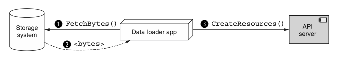
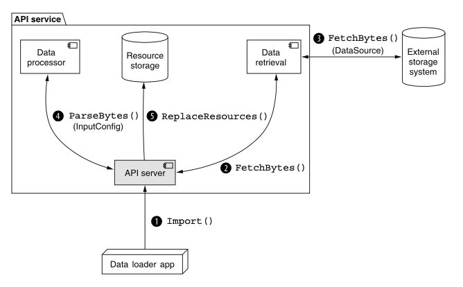
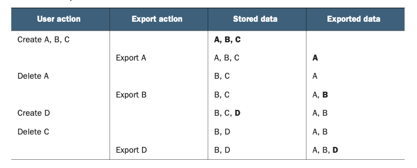

# 第 23 章 导入与导出

<div style="background:#f7f5e6; padding:24px; border-radius:4px; color:#405a73;">

**本章内容**
- 导入和导出的具体定义
- 直接与远程存储系统交互
- 将序列化字节转换为 API 资源
- 处理易变数据集导出时的一致性问题
- 导入和导出时应如何处理唯一标识符
- 如何处理被导入或导出的相关资源
- 处理导入或导出操作期间的失败
- 导入和导出与备份和恢复有何不同
- 在输入和输出数据上进行过滤
</div><br/>

在这种模式中，我们将探讨如何通过自定义 import 和 export 方法安全且灵活地将资源移入和移出 API。
更重要的是，这种模式依赖 API 直接与外部存储系统通信，而不是通过中间客户端。
我们将通过定义几个松耦合的配置结构来使这一切正常工作，以涵盖这些资源在 API 和底层存储系统之间旅程的各个方面，从而最大化灵活性和可重用性。

<a id="motivation"></a>
## 23.1 动机

在任何管理用户提供数据的 API 中（几乎每个 API 都是如此），我们已经定义了几种将资源移入和移出系统的方式。
其中一些作用于单个资源（例如，全套标准方法），而另一些则作用于资源组（例如，一组批量方法），但所有这些都有一个重要的共同点：数据总是从 API 服务直接传输回客户端。

让我们考虑这样一种情况：我们有一些想要加载到 API 中的序列化数据，例如要在 ChatRoom 资源内创建的一堆 Message 资源。
一种方法是编写一个应用服务器，从存储系统检索数据，将序列化字节解析为实际资源，然后使用传统方法在 API 中创建新资源。
虽然这可能不方便，但它肯定能完成任务。

这个计划有一个关键方面可能会成为问题：数据所需经过的路径。
在这种情况下，数据必须走相当长的路径，从存储系统到将执行加载的应用代码，最后再到 API，如图 23.1 所示。

*图 23.1 导入数据需要一个中间数据加载器应用程序。* <br/>
<br/>

如果数据恰好与应用服务器在同一台机器上（甚至附近），这还不是一个糟糕的提议。
但如果基础设施的安排不那么友好呢？
例如，如果数据和 API 彼此靠近，但应用服务器不被允许住在附近呢？
这意味着加载数据的自定义函数将把整个数据集一路传输到应用服务器，然后再一路传回 API 服务器。
这有点像每次需要一杯牛奶就去商店，而不是买一盒放在冰箱里：两者都消耗能量，但后者效率要高得多。

这个问题对于反方向流动的数据也同样存在。
如果我们不是将新资源加载到系统中，而是想从系统中取出已有资源，使用自定义代码这样做需要数据流经这个中间应用服务器。
而随着任一场景中数据量的增长（如今数据往往如此），这个问题只会变得更糟。

因此，有相当充分的理由让数据直接在 API 和远程存储系统之间流动。
这不仅会最大限度地减少用户需要编写的自定义代码量，还会减少将数据从一个地方传输到另一个地方所浪费的带宽和用户管理的计算资源。
在下一节中，我们将概述这个低效流程的解决方案。

<a id="overview"></a>
## 23.2 概述

在这种模式中，我们将依赖两个特殊的自定义方法将资源移入和移出 API：import 和 export，如图 23.2 所示。
由于总体目标是允许 API 直接与外部存储系统交互，这两个方法都将承担在 API 服务和存储系统之间传输所有数据的责任。
此外，由于任何外部存储系统都不太可能以与任何 API 服务完全相同的方式存储数据，这些方法还需要承担将 API 资源转换为存储系统理解的原始字节（以及反向转换）的责任。

*图 23.2 导入操作将数据检索和处理合并到 API 服务中。* <br/>
<br/>

问题出现在这两个配置方面的种类繁多上。
存储系统数量巨大，因此我们构建这些自定义方法的请求消息的方式至关重要，以便在 API 用户需要时能够轻松引入新的存储系统。
此外，可用于将 API 资源转换为原始字节的序列化格式也同样繁多，因此请求结构的灵活性非常重要，既要支持现有的任何格式，也要能够扩展到支持未来可能出现的任何新格式。

如果这还不够复杂，在数据被序列化为一堆字节之后，可能还需要执行进一步的转换。
例如，数据在存储到磁盘之前被压缩或加密并不罕见。
而且由于这些自定义方法必须直接与外部存储系统通信，它们还负责允许 API 服务的用户配置这些附加参数。

为了使这一切正常工作，我们将依赖一个总体配置接口作为 import 和 export 自定义方法的主要输入。
这些配置接口（用于导入的 InputConfig 和用于导出的 OutputConfig）负责存储所有相关信息，既用于在资源和字节之间转换数据，
也用于将这些字节传输到外部存储系统或从外部存储系统传出。

由于存储系统数量庞大、种类繁多且不断变化，我们将依赖一些结构，
使我们能够将数据传输的配置与数据转换的配置分开并保持独立。
换句话说，我们将把如何访问外部存储的配置与如何序列化 API 资源或反序列化原始字节的配置分开。
为此，我们将使用通用的 DataSource 和 DataDestination 接口，这样每个扩展接口都将包含将字节传输到预期源或从预期目标传出所需的所有配置。

一旦我们解决了结构性问题并决定了如何安排所有这些配置细节，我们还剩下一些复杂的问题需要回答，关于每个自定义方法的行为。
例如，我们如何处理失败并决定重试请求是否安全？
底层数据的一致性如何？
当我们导出数据时，我们是获取数据的完整快照并导出它，还是允许它是一个涂抹？
同样，当我们导入数据时，新资源如何与现有资源交互？
我们如何处理标识符冲突？
在导出数据之前是否应该剥离它们？

在下一节中，我们将更详细地探讨这些行为问题以及所有结构性问题。

<a id="implementation"></a>
## 23.3 实现

现在我们已经概述了高层次的问题，是时候开始深入细节了。
让我们先看看自定义 import 和 export 方法本身，然后我们将探讨它们各自的请求接口是如何构建的。

### 23.3.1 导入和导出方法

由于我们的目标是直接与外部存储系统之间导入和导出数据，我们需要做的第一件事是定义自定义 import 和 export 方法，它们将管理这些操作的所有复杂性。
尽管我们一直在泛泛地谈论这些方法，但重要的是要注意，这些自定义方法，就像我们在 [第 9 章](ch9.md) 中看到的那样，将锚定到 API 中的特定资源。
换句话说，每个自定义 import 或 export 方法将负责单一资源类型（例如 ImportMessages 或 ExportMessages）。

这些方法下一个（可能显而易见的）值得强调的属性是返回类型。
正如我们在 [第 10 章](ch10.md) 中学到的，当 API 方法不是即时的或可能需要一段时间时，最好让它们返回某种承诺，以完成实际工作。
虽然这些自定义方法可能完成得相对较快，但它们有花费相当多时间的风险，因此完全符合返回 LRO 和最终结果而不是同步结果的准则。

将这两部分放在一起，并遵循 [第 9 章](ch9.md) 的其他指导，我们可以相当容易地想出两个示例方法，用于将 Message 资源导入给定的 ChatRoom 资源。

*清单 23.1 自定义 import 和 export 方法示例*

```typescript
abstract class ChatRoomApi {
  // 我们将多个资源导入到隶属于父资源的集合中
  @post("/{parent=chatRooms/*}/messages:export")
  ExportMessages(req: ExportMessagesRequest):
    Operation<ExportMessagesResponse, ExportMessagesMetadata>;

  // 我们将多个资源导入到隶属于父资源的集合中
  @post("/{parent=chatRooms/*}/messages:import")
  ImportMessages(req: ImportMessagesRequest):
    Operation<ImportMessagesResponse, ImportMessagesMetadata>;
}
```

同样重要的是要注意，这两个自定义方法专注于将多个资源导入集合，但这并不是唯一可用的选项。
我们可能还想导入不由一组 API 资源表示的数据，而只是许多数据点，这些数据点在导入后可以单独寻址。
例如，如果我们的聊天 API 包含一个用花哨的机器学习算法训练的虚拟助手，我们可能有一种方式将训练数据点导入单个 VirtualAssistant 资源，从而产生这个自定义方法。

*清单 23.2 将不可寻址的数据点导入资源的示例*

```typescript
abstract class ChatRoomApi {
  // 并非导入到集合中，我们可以将不可寻址的数据导入到特定资源中
  @post("/{id=virtualAssistants/*}:importTrainingData")
  ImportTrainingData(req: ImportTrainingDataRequest):
    Operation<ImportTrainingDataResponse, ImportTrainingDataMetadata>;
}
```

如我们所见，这些是看起来相当普通的自定义方法，它们返回 LRO，最终会解析为标准响应。
棘手的地方，正如我们将在下一节中学到的，是我们应该如何构建请求方法。

### 23.3.2 与存储系统交互

由于连接外部存储系统是我们导入和导出数据设计的关键组成部分，我们需要一个地方来放置每个存储系统的所有可能配置选项，这是理所当然的。
通常，人们很容易把所有各种配置选项简单地堆在一起，这样一个单一的配置 schema 就能与所有现有的存储系统通信。
然后，当我们需要添加对新存储系统的支持时，我们可能只是向这个配置接口添加一些新字段，然后就完事了。

除了相当混乱之外，这种设计还有问题，因为它可能导致相当多的困惑。
<ins>首先，当我们有一个包含大量选项且所有选项都紧挨在一起的单一接口时，决定在哪些情况下哪些选项是必需的可能会变得很有挑战性。</ins>
这会导致不必要的来回沟通，因为 API 服务器会因为数据源或目标配置缺失而拒绝各种导入或导出请求。

<ins>其次，当我们继续向扁平结构添加越来越多的配置选项时，我们的下一个诱惑是重用接口上现有的字段，使它们可能适用于多个不同的存储系统。</ins>
换句话说，不是同时拥有一个 sambaPassword 字段和一个 s3secretKey 字段，我们可能只有一个 password 字段，并尝试将它既用于 Amazon Web Services 颁发的 S3 密钥，也用于 Samba 网络共享上特定用户的密码。
乍一看这似乎是个好主意，但当一个字段仅仅因为名称听起来相似就被用于多个目的时，会导致更多困惑。

一个更直接的解决方案是拥有一个单一的多态字段，然后为每个支持的不同存储系统提供特定的接口。
换句话说，我们可能有一个 S3DataSource 用于从 Amazon 的 Simple Storage Service 加载数据，以及一个 SambaDataSource，能够与 Samba 网络共享交互。

*清单 23.3 使用 S3 作为数据源的示例*

```typescript
interface DataSource {
  // type 是最终接口的静态字符串，作为存储系统的标识符
  type: string;
}

// 具体的数据源接口继承自基础接口
interface S3DataSource extends DataSource {
  // type 是最终接口的静态字符串，作为存储系统的标识符
  type: 's3';
  bucket: string;
  // 此处存储 glob 表达式（例如 archive-*.gzip），用于匹配被视作数据源的对象
  glob: string;
}
```

同样的模式也适用于存储服务作为数据从 API 流出的目标，从而为 API 带来模块化、可重用的概念，
这样在导入或导出各种资源时，与外部存储系统的连接就可以重用。
但这引出了一个有趣的问题：如果这些接口只是关于如何连接到存储系统，为什么我们需要为读取数据与写入数据分别提供不同的接口？

<ins>虽然这两个概念密切相关（毕竟，它们都是关于与外部存储系统交互和传输数据），但它们并不完全相同。</ins>
例如，当我们使用 Amazon 的 S3 作为数据源时，我们希望应用一种模式（在这种情况下是 glob 表达式 `[https://en.wikipedia.org/wiki/Glob]`）来选择要检索哪些 S3 对象（就像磁盘上的文件一样）。
另一方面，在导出数据时，我们更可能有一个单一输出文件或可能有几个不同的文件，但都放在同一个目录中（在 S3 中，这通过使用文件名前缀来表示，例如 exports/2020/）。

*清单 23.4 使用 S3 作为数据目标的示例*

```typescript
interface DataDestination {
  type: string;
}

interface S3DataDestination extends DataDestination {
  type: 's3';
  bucket: string;
  // 在本场景中，不使用glob表达式，而是通过前缀来确定写入对象的命名规则
  prefix: string;
}
```

<ins>换句话说，虽然这两个概念非常相似，但它们并不完全相同，也不代表同一件事。
可能有许多重叠的字段，但这是有意为之，以允许两个接口独立变化。
而这种松耦合正是即使在面对巨大波动时也能保持灵活的设计类型。</ins>

现在我们已经有了一种方式来配置 API 应如何从外部存储系统检索字节（或向外部存储系统发送字节），我们可以进入下一部分：
弄清楚如何在 API 资源和这些字节之间进行转换。

### 23.3.3 在资源与字节之间转换

有趣的是，由于构建 Web API 的本质，我们已经有了一种机制将底层 API 资源转换为序列化的字节块。
通常这依赖于像 JSON 这样的格式；然而，每个 API 都需要一种通过互联网发送数据的方式，因此必须有一种为用户序列化数据的方式。
虽然这个预先存在的机制会派上用场，但为导出而序列化大量资源（或为导入而反序列化）并不完全相同。
例如，我们可能使用 JSON 来序列化单个资源，但在导出数据时，我们可能依赖一种修改过的格式
（例如，换行分隔的 JSON 而不是资源的 JSON 数组）或完全不同的格式（例如，带标题行的 CSV 或 TSV）。
我们不会深入探讨资源序列化的所有细节，但清单 23.5 展示了将一些 Message 资源序列化为 CSV 的示例。
（如果你想知道为什么缺少标识符，请查看第 23.3.5 节。）

*清单 23.5 示例 CSV 序列化的 Message 资源*

```csv
# 导出为CSV的数据中，首行通常是定义列名的表头行
sender, type, content
# 每一行存储待导入的字段
"users/1", "text", "hi"
"users/2", "text", "hi back"
```

此外，即使我们已经序列化了数据，我们可能还想在存储它以进行导出之前执行进一步的转换（反方向也同样如此）。
这可能简单到用用户提供的密钥压缩或加密数据，也可能比那更复杂一些，例如将数据切分成几个不同的文件以存储在外部存储服务上。

无论我们可能想对数据做什么，我们当然需要一个地方来放置所有这些配置，为此我们将使用一个 InputConfig 接口（或用于导出数据的 OutputConfig 接口）。
就像自定义 import 和 export 方法一样，这些接口将基于每个资源，从而产生像 MessageInputConfig 这样的接口。

*清单 23.6 Message 资源的输入和输出配置示例*

```typescript
// 这两者十分相似但并不完全相同，它们承担不同的职责
interface MessageInputConfig {
  // 输入的内容类型
  // 可选值："json", "csv", undefined（自动检测）
  contentType?: string;

  // 可选值："zip", "bz2", undefined（未压缩）
  compressionFormat?: string;
}

// 这两者十分相似但并不完全相同，它们承担不同的职责
interface MessageOutputConfig {
  // 用于序列化的内容类型
  // 可选值："json", "csv", undefined 代表默认值
  contentType?: string;

  // 使用 ${number} 表示带前导零填充的文件编号
  // 内容类型对应的文件扩展名会追加在文件名后（例如 ".json"）
  // 默认值："messages-part-${number}"
  filenameTemplate?: string;

  maxFileSizeMb?: number;

  // 可选值："zip", "bz2", undefined（未压缩）
  compressionFormat?: string;
}
```

希望这一切看起来都相当无聊且无害。
<ins>真正的价值不在于导入和导出数据的具体配置参数，而在于检索原始数据与处理该数据之间的关注点分离。
这种松耦合确保我们可以在整个 API 中重用数据源和目标来导入和导出各种资源类型。</ins>

现在我们已经介绍了结构性方面，让我们换个话题，开始深入研究这种模式的行为细微差别，首先从我们应该如何处理 API 中底层资源的一致性开始。

<a id="consistency"></a>
### 23.3.4 一致性

在导出数据时，我们显然需要读取整个打算导出的资源集合。
尽管我们多么希望可以瞬间读取任意数量的资源，但这通常只在资源数量足够少时才成立。
对于可能更大的集合，读取所有数据显然会花费一些非零的时间。
这本身不一定是个问题，但不能保证这个导出操作会独占访问系统。
这就引出了一个重要的问题：对于在导出操作过程中可能发生变化的资源，我们该怎么办？

解决这个问题有两种简单的选择。
一种是依赖底层资源存储系统提供的快照或事务能力。
例如，我们可能在特定时间点读取所有资源，确保我们拥有正在导出的资源集合的一致视图。
如果我们这样做，在导出操作运行期间并发进行的任何更改都不会反映在正在导出的数据中。

遗憾的是，并非所有存储系统都支持这种快照功能。
更糟糕的是，能够处理超大数据集的系统往往更不太可能支持这一点。
我们该怎么办？

另一种选择，对于导出操作来说完全可以接受，就是承认用我们现有的存储系统能做的最好的事情，就是提供正在导出数据的涂抹 (smear)。
这意味着我们导出的资源可能不是任何单一时间点数据的精确表示，而是在导出操作运行期间对 API 中资源集合的最佳努力尝试。
虽然这当然不理想，但在许多情况下，这将是唯一可用的选择，因此也是我们能做的最好的事情。

如果这种数据涂抹的概念有点不清楚，让我们考虑一个例子。
在表 23.1 中，前两列显示了导出操作以及用户同时操作系统中的数据的动作。
最后两列显示了数据的当前状态（存在哪些资源）以及已导出的数据。

*表 23.1 带有数据涂抹的导出场景* <br/>
<br/>

由于双方（用户和导出操作）动作的独特交错，我们实际上最终得到了一组看起来有点奇怪的资源。
这组特定的资源（A、B 和 D）从未同时存在过（查看存储数据列，可以看到这组资源从未在同一时间同时存在）。
这种涂抹当然不寻常，但当我们没有能力对数据的一致快照进行操作时，这是一种必要的恶。

如果 API 的存储系统不支持读取数据的一致快照，但这种不一致的导出数据完全不可接受，那么另一个可以考虑的选择是在导出过程中禁止修改 API 中的资源。
虽然这当然很不方便（并且在导出期间涉及系统范围的运营停机），但有时这是唯一可用的安全选择（事实上，这也是 Google Cloud Datastore 建议消费者导出该存储系统中存储数据的一致视图的方式）。

<ins>如果本节有一个关键要点，那应该是这个关键理念：导出数据与备份数据不是一回事。
备份意味着数据的快照，包括各种唯一标识信息，而数据的导出实际上是通过传统方式检索数据，将数据直接路由到外部存储服务。</ins>
在下一节中，我们将探讨对于正在导出的资源中的唯一标识信息，我们究竟应该怎么处理，因为它比看起来要复杂一些。

<a id="identifiers-and-collisions"></a>
### 23.3.5 标识符与冲突

到目前为止，我们一直假设在序列化给定资源时，它应包含该资源的所有字段，包括标识符。
尽管这看起来像是一个小细节，但事实证明，这单个字段引出了相当多有趣的问题。
例如，当将资源导入集合时，如果我们在源数据中遇到一个资源的 ID 已在 API 中使用，我们该怎么办？

另一个有趣的案例出现在我们导出具有特定标识符的资源，但随后尝试将这些相同的资源导回 API，但导入到不同的父资源中时。
换句话说，如果我们导出 ID 设置为 `chatRooms/1234/messages/2` 的 Message 资源，并希望将该资源导入 ChatRoom #5678，该怎么办？
它应该被创建为 `chatRooms/5678/messages/2`，还是被赋予一个完全不同的标识符？

最后，我们必须考虑 API 不允许用户指定资源标识符的情况。
对于我们要导入的资源的标识符，我们该怎么办？
忽略它们？正如我们将在 [第 23.3.7 节](#failures-and-retries) 中看到的，当我们开始探讨需要重试先前失败的导入时会发生什么时，这一点变得相当重要。

幸运的是，我们可以回溯到导入和导出的原始定义来回答这个问题。
自定义 import 和 export 方法旨在提供一种在 API 和外部存储系统之间架起桥梁的方式，在将数据从一个地方搬运到另一个地方时，省去应用代码作为中间人。
这意味着其功能应等同于从外部存储位置获取数据，并使用批量创建方法基于所提供的数据创建一堆新资源。
坦率地说，任何超出这种简单（且朴素）功能的东西都超出了范围。

<ins>这个定义的结果相当强大：如果不支持用户指定的标识符（通常应该如此，正如我们在 [第 6 章](ch6.md) 中学到的），那么自定义 import 方法在 API 中创建新资源时应忽略所提供的任何标识符（例如 id 字段）。</ins>
话虽如此，在需要稍后确定数据来源的场景中，导出数据时保留标识符是合理的。

但这是否意味着如果我们两次导入相同的数据，可能会创建大量重复资源？
绝对会，但这是有意为之。

import 和 export 方法明确不是为了作为将数据备份和恢复到 API 中的机制。
那种特殊功能需要对数据提供严格得多的保证，例如备份数据时快照的一致性（正如我们在 [第 23.3.4 节](#consistency) 中看到的），以及导入数据时对集合的完全替换。
而这些自定义方法不提供此类保证。

### 23.3.6 处理相关资源

到目前为止，自定义 import 和 export 方法都专注于一次只处理一个资源，但这有点过于简化了。
毕竟，鉴于我们对资源布局和层级的讨论（参见 [第 4 章](ch4.md) ），我们很合理地期望可能想要导入或导出同时拥有子资源或其他相关资源的资源。
举一个非常简单的例子，如果我们想导出一组 ChatRoom 资源呢？
那是否也应该包括所有子 Message 资源？
显然聊天信息本身很重要，但当我们想到导入或导出聊天室时，一个空的 ChatRoom 可能并不是我们想要的。

虽然我们可能急于尝试扭曲这种模式以适应在单次 API 调用中对多个不同资源类型进行操作，但简单地说，这并非这种模式的目的。
正如我们在 [第 23.1 节](#motivation) 中学到的，这种模式的目标是在 API 服务和外部存储系统之间架起桥梁，避免中间人在两者之间搬运数据。
它并非旨在引入关于如何从 API 本身检索或加载数据的新的、更高级的功能。

因此，正如我们将其他 API 方法限制为单一资源类型（例如，标准 list 或批量 create 方法）一样，自定义 import 和 export 方法也应同样受到限制。

这意味着导入和导出数据几乎总是限于那些没有子资源且在没有额外相关资源的情况下也可能有用的资源。
例如，虽然导入或导出 ChatRoom 资源可能没有意义，但能够导入或导出给定 ChatRoom 资源中包含的 Message 资源仍然相当有用。

换一种说法，当我们导入或导出 Message 资源时，重点是将有用的、半独立的数据移入和移出 API。
当我们对 ChatRoom 资源做同样的事情时，我们的重点似乎已经从简单的数据搬运和路由转移到了备份和恢复功能的世界，
在那里我们想要保留数据的特定状态，并可能在稍后的时间点将系统恢复到该状态。
虽然这种保留和恢复的理念当然很重要，而且它恰好与导入和导出的理念有相当多的重叠，但这二者肯定不是一回事。

让我们换个话题，考虑一下如何处理在任何 API 中都不可避免地出现的意外情况。

<a id="failures-and-retries"></a>
### 23.3.7 失败与重试

正如任何系统都可能时不时遇到问题一样，那些涉及两个系统传输可能大量数据的系统几乎肯定会如此。
此外，由于自定义 import 和 export 方法所期望的行为本质上是在某个地方写入数据，我们面临一个更复杂的场景：如果在读取或写入数据（无论是 API 中的资源还是外部存储系统中的字节）的过程中发生失败，那么从失败中恢复几乎肯定会更加困难。

这两种方法的失败可以有两种类型，取决于数据流动的方向。
在导入数据时，失败可能出现在存储系统无法向 API 服务提供原始字节，或者 API 服务无法创建新资源时。
在导出数据时，失败类似但方向相反，源于无法从 API 读取资源，或者无法将原始字节传输并写入外部存储系统。
我们该如何处理这些失败？
更重要的是，如果操作恰好失败了，我们如何知道重试是否安全？
让我们先解决两者中较容易的那个。

#### 导出失败

虽然任何类型的失败都不方便，但关于导出失败的好消息是，重试通常是安全的。
原因是再次尝试从 API 导出数据与之前（可能失败的）尝试完全独立。
然而，这并不意味着这类失败没有复杂之处；有几个潜在问题需要解决。

<ins>首先是最明显的一点：一次导出尝试的数据不保证与稍后尝试的数据完全相同。</ins>
特别是在有许多并发用户与系统交互的易变数据集中，两次尝试产生相似结果的可能性非常小。
幸运的是，export 方法的目标是将数据从 API 中传输出去，而且它可能已经不对正在导出的数据的一致性做出任何保证。
相反，正如我们在 [第 23.3.4 节](#consistency) 中学到的，数据很可能是资源的涂抹，而不是单一的一致快照，因此重复导出尝试不应导致结果数据出现任何有意义的问题。

接下来，我们必须考虑如何处理先前失败的导出尝试留下的数据。
我们应该尝试删除它，还是留下来以便日后手动清理？
尽管看起来可能很浪费，但最佳实践通常是保留数据不动，无论失败发生在过程中的哪个位置。

原因有两方面。
<ins>首先，不能保证 API 甚至有权从外部存储系统删除数据（在这种情况下，最佳实践是拒绝该权限）。
其次，我们不知道实际导出的数据对请求导出的用户是有价值的还是无用的。</ins>

这可能看起来违反直觉，但底线是我们没有资格判断导出多少数据对用户的目的来说是足够的。
显然 100% 有用，0% 没用，但介于两者之间的一切都完全是灰色地带。
例如，想象我们正在导出一个非常大的 10 TB 数据集。
在判断它从无用跨越到有价值之前，需要导出多少数据？
如果导出操作在最后一个资源上失败，真的值得完全删除吗？
也许那一个资源在宏大计划中并不那么重要。
底线是删除导出数据超出了导出数据的范围，应该由存储系统的所有者来决定如何处理这些数据。

鉴于此，我们有一个新问题：如果存储系统空间用完了怎么办？
遗憾的是，鉴于之前关于将决定权留给用户的讨论，这是一个我们无法解决的问题。
更糟糕的是，这可能导致级联失败，即重复的导出操作会因存储空间不足而失败。
话虽如此，鉴于我们迄今为止建立的约束和原则，这只是一个我们别无选择只能忍受的情况，因为替代方案对 API 用户来说根本更糟。

现在我们已经讨论了导出数据时的失败，让我们换个方向，看看当数据反向流动时如何处理失败。

#### 导入失败

与导出失败不同，导入数据时的失败不是我们可以简单地重试并假定一切正常的事情。
首先，失败可能是由于验证错误而非暂时性的网络或数据传输错误引起的。
如果是这种情况，再多的重试也无法解决问题，我们应该在 LRO 结果中报告验证失败的条目。

即使失败是由暂时性原因引起的，我们也必须认识到一个事实：先前失败的导入尝试可能仍然创建了一些资源。
这是一个大问题，因为除非导入立即失败，否则未来重试导入操作几乎肯定会导致创建重复资源。
我们该怎么办？

一个显而易见的解决方案是在事务内执行导入操作，在出现任何类型的失败迹象时回滚事务。
虽然这是一个快速简单的修复方法，但不幸的是，并非每个存储系统都支持完整的事务语义。
即使那些支持的，也可能在处理超大量数据时遇到困难，导致在单个事务中创建数量惊人的资源。

对于无法简单依赖宝贵的数据库功能的情况，我们显然需要另一种解决方案。
为此，我们可以借鉴 [第 26 章](ch26.md) 的内容，保护我们的 API 免受重复 API 请求的危害。

虽然关于请求去重有相当多的内容需要阅读和理解，但简单的概述是：对于将要导入的每条记录，我们可以分配一个称为导入请求标识符的全局唯一标识符。
这个 importRequestId 将被分配给导入操作期间将要创建的每个单独资源，API 服务可以在第一次创建时缓存该标识符，丢弃未来导入同一记录的尝试。

*清单 23.7 一些带有用于去重的导入请求 ID 的示例 JSON 资源*

```json
// 导入请求 ID 由 API 用来消除歧义，并避免为给定的数据条目创建重复资源。
{ importRequestId: "abc", sender: "users/1", content: "hi" }
{ importRequestId: "def", sender: "users/2", content: "hi back" }
```

为了让那些可能想在数据导出后重新导入数据的人更方便，我们甚至可以考虑在 MessageOutputConfig 接口中添加一个配置选项，以支持在导出操作期间是否应将这些 importRequestId 值注入序列化数据中。
无论我们是否这样做，关键是如果我们想确保在重试失败的导入操作时不导入重复资源，就必须有一种方法来区分我们以前见过的资源条目和没见过的。
由于资源 ID 出于一些很好的原因已经被忽略，正如我们在 [第 23.3.5 节](#identifiers-and-collisions) 中学到的，这导致我们专门为此目的引入一些新东西。
这意味着，如果输入中不存在这个特殊字段，在底层存储系统不支持事务的系统中重试失败的导入请求，最终将导致重试的导入操作创建重复资源。

### 23.3.8 过滤与字段掩码

正如我们在 [第 22 章](ch22.md) 中所看到的，过滤资源集合的能力是一项有价值的功能，使我们能够更高效地与 API 中存储的数据交互。
但过滤资源的这种理念是否同样适用于自定义 import 和 export 方法，就像适用于标准 list 方法一样呢？
在这种情况下，答案是既是也不是。

#### 过滤输出

在导出数据方面，回想一下目标只不过是提供一种将存储系统直接连接到 API 的方式。
换句话说，export 方法所做的应该与标准 list 方法没有什么不同。
因此，理所当然地，自定义 export 方法当然应该支持在导出项之前过滤它们。
而且，正如你所预料的，其 API 定义不过是在导出请求接口上添加一个 filter 字段。

*清单 23.8 向导出请求添加过滤器的示例*

```typescript
interface ExportMessagesRequest {
  parent: string;
  outputConfig: MessageOutputConfig;
  dataDestination: DataDestination;
  // 我们可以使用 filter 字符串字段来过滤导出的资源。
  filter: string;
}
```

你可能想知道为什么 filter 放在 OutputConfig 接口旁边（而不是里面）。
答案很简单：输出配置完全专注于我们将一堆资源转换成一堆字节的方式。
另一方面，过滤发生在这一阶段之前，专注于选择哪些资源将被序列化、压缩等。
虽然可能很诱人地将这个配置放在 OutputConfig 内部，但这里的关注点分离至关重要，确保每个部分只负责一件事（且仅负责一件事）。

#### 过滤输入

与导出数据（我们在 API 选择的数据上应用过滤器）不同，在数据入口处过滤数据有点不寻常。
它涉及将字节从外部存储系统传输到 API 服务，然后 API 服务将 InputConfig 中存储的详细信息应用于序列化字节
（例如，解压缩、解密和反序列化），然后才应用过滤器来决定是丢弃该资源还是在 API 中创建它。

更麻烦的是，被导入的资源上可能有一些派生数据，只有在它们被加载到 API 中后才可用于过滤。
例如，我们如何基于仅输出的字段（如 createTime 或任何其他服务计算的属性）来过滤传入数据？
为了有效地做到这一点，我们需要让数据通过 API 本身的业务逻辑运行，这将导致更多的复杂性和潜在的浪费精力。

正如你可能猜到的，虽然在导入操作期间支持入口数据的过滤当然并非不可能，但这是我们通常不应在 API 中做的事情之一。
即使 API 没有遇到目前列出的问题，也不能保证这一事实在未来仍然成立。
如果我们真的做出了导致这种情况的更改，我们现在就陷入了在可能棘手的情况下弄清楚如何继续支持导入过滤的困境。
相反，用户应该负责在执行导入操作之前进行任何数据转换（包括过滤）。

### 23.3.9 最终 API 定义

以下 API 定义涵盖了我们在聊天 API 中可能如何导入和导出 Message 资源。
有两个示例源和目标，分别涵盖 Samba（ https://en.wikipedia.org/wiki/Samba ）存储系统和 Amazon 的 S3（ https://aws.amazon.com/s3/ ）。

*清单 23.9 最终 API 定义*

```typescript
abstract class ChatRoomApi {
  @post("/{parent=chatRooms/*}/messages:export")
  ExportMessages(req: ExportMessagesRequest):
    Operation<ExportMessagesResponse, ExportMessagesMetadata>;

  @post("/{parent=chatRooms/*}/messages:import")
  ImportMessages(req: ImportMessagesRequest):
    Operation<ImportMessagesResponse, ImportMessagesMetadata>;
}

interface ExportMessagesRequest {
  parent: string;
  outputConfig: MessageOutputConfig;
  dataDestination: DataDestination;
  filter: string;
}

interface ExportMessagesResponse {
  chatRoom: string;
  messagesExported: number;
  // ...
}

interface ExportMessagesMetadata {
  chatRoom: string;
  messagesExported: number;
  // ...
}

interface MessageOutputConfig {
  // The content type for serialization.
  // Choices: "json", "csv", undefined for default.
  contentType?: string;

  // Use ${number} for a zero-padded file ID number.
  // Content type will be appended with file extension (e.g., ".json").
  // Default: "messages-part-${number}"
  filenameTemplate?: string;

  // Undefined for no maximum file size.
  maxFileSizeMb?: number;

  // Choices: "zip", "bz2", undefined (not compressed)
  compressionFormat?: string;
}

interface DataDestination {
  // A unique identifier of the destination type (e.g., "s3" or "samba")
  type: string;
}

interface SambaDestination extends DataDestination {
  // The location of the Samba share (e.g., "smb://1.1.1.1:1234/path")
  type: 'samba';
  uri: string;
}

interface S3Destination extends DataDestination {
  type: 's3';
  bucketId: string;
  objectPrefix?: string;
}

interface ImportMessagesRequest {
  parent: string;
  inputConfig: MessageInputConfig;
  dataSource: DataSource;
}

interface ImportMessagesResponse {
  chatRoom: string;
  messagesImported: number;
}

interface ImportMessagesMetadata {
  chatRoom: string;
  messagesImported: number;
}

interface MessageInputConfig {
  // The content type of the input.
  // Choices: "json", "csv", undefined (auto-detected)
  contentType?: string;

  // Choices: "zip", "bz2", undefined (not compressed)
  compressionFormat?: string;
}

interface DataSource {
  type: string;
}

interface SambaSource extends DataSource {
  type: 'samba';
  uri: string;
}

interface S3Source extends DataSource {
  type: 's3';
  bucketId: string;

  // One or more masks in glob format (e.g., "folder/messages.*.csv")
  mask: string | string[];
}
```

<a id="trade-offs"></a>
## 23.4 权衡

尽管这种模式看起来可能涵盖了与将数据移入和移出 API 相关的所有内容，但也许最令人困惑的是，
它实际上是一种非常具体且狭义专注的设计，涵盖了一种独特的数据移动方式，并试图解决一个简单的目标：
弥合 API 服务和外部存储系统之间的差距。
这种具体性和狭义专注的结果导致了两个主要缺点。

首先，这种模式并非设计用来处理多个资源类型。
这意味着它不是为了帮助你导出大量相关资源、父资源和子资源，或者任何通常导致多资源关系的东西。
简单地说，这种模式是关于获取大量自包含的数据点，并帮助它们在 API 服务和外部存储系统之间搬运，而不需要应用服务器充当中间人。
如果你确实需要将多个资源连接在一起并以任何有意义的方式操作这些资源，那么这个中间人就不再只是中间人了；
它已经成为业务逻辑的重要部分。
自定义 import 和 export 方法并非旨在包含或实现任何特殊业务逻辑；它们被设计为简单的数据搬运工。

这引出了下一个主要缺点：很容易将 import 和 export 与备份和恢复功能混淆（毕竟，它们通常都涉及在 API 和存储系统之间搬运数据）。
正如我们在 [第 23.3.4 节](#consistency) 中看到的，这些自定义方法根本不是为解决数据的原子保留或从先前快照完全恢复数据的任务而设计的。
相反，它们在没有一致性保证的情况下运行，如果没有被完全理解，可能会导致一些相当令人困惑的结果。

<a id="exercises"></a>
## 23.5 练习

1. 为什么为配置 import 或 export 方法使用两个独立的接口很重要？
为什么不将它们合并为一个接口？

2. 有哪些可用选项可以避免导入（或导出）数据的涂抹？最佳实践是什么？

3. 当资源被导出时，标识符是否应该与数据一起存储？
当同一数据被导入时呢？
新资源是否应该具有相同的 ID？

4. 如果导出操作失败，到目前为止已传输的数据是否应该被删除？
为什么应该或不应该？

5. 如果一个服务想要支持导入和导出，包括子资源和其他相关资源，它可能如何着手？
在这种情况下应如何处理标识符？

<a id="summary"></a>
## 本章小节

- 自定义 import 和 export 操作允许我们直接在 API 服务和外部存储系统之间移动数据。

- 这些方法并非旨在像备份和恢复功能那样运作，并且由于这一关键差异而产生若干后果。

- API 定义专注于两个正交的配置接口：一个用于将字节移入和移出外部存储系统，另一个用于在 API 资源表示和这些字节之间进行转换。

- 除非系统支持时间点数据加载，否则自定义 import 和 export 方法很可能会导致系统中存储的数据出现涂抹。

- 导入和导出数据通常应限于一次处理单一资源类型，依靠备份和恢复功能来处理子资源和其他被引用的资源。
