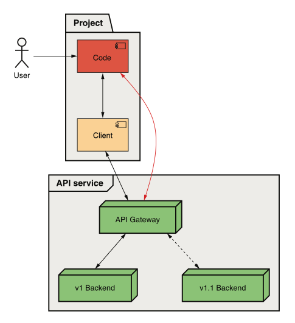
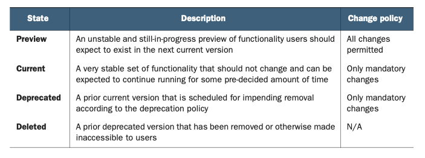
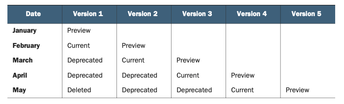
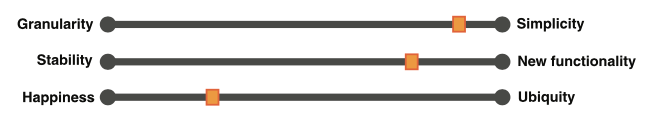
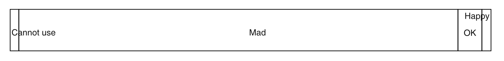
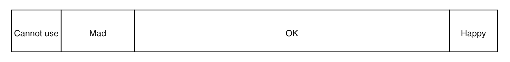

# 第 24 章 版本控制与兼容性

<div style="background:#f7f5e6; padding:24px; border-radius:4px; color:#405a73;">

**本章内容**
- 什么是版本控制
- 兼容性意味着什么
- 如何定义向后兼容性
- 选择版本控制策略所涉及的权衡
- 几种流行的 Web API 版本控制策略概述
</div><br/>

我们构建的软件很少是静态的。
相反，随着新功能的创建和新功能的添加，它往往会随着时间的推移频繁变化和演进。
这引出了一个问题：我们如何进行这些改进，而不会严重不便那些已经习惯于事物看起来和行为像以前一样的用户？
在本章中，我们将探讨解决这个问题最常见的机制：版本控制。

<a id="motivation"></a>
## 24.1 动机

软件开发不仅很少是静态的，而且也很少是连续的过程。
即使有了持续集成和部署，我们经常会有检查点或发布，某些新功能 “上线” 并对用户可见，这对于 Web API 尤其如此。
API 既僵化又公开，这意味着安全地进行更改很困难，这一事实加剧了这种需求。
这引出了一个显而易见的问题：我们如何对 Web API 进行更改，而不对已经使用该 API 的人造成损害？

“用户会自己处理” 的默认选项显然是不可接受的。
此外，“永远不更改 Web API” 的替代方案实际上是不可能的，即使我们从不打算添加新功能。
例如，如果存在安全或法律问题（例如，律师通知你相关 API 调用在某种程度上违法），那么更改将是不可避免的。
<ins>为了解决这个问题，这种模式将探讨如何向 API 引入版本的概念，以及适合 Web API 广泛需求的各种不同策略。</ins>

<a id="overview"></a>
## 24.2 概述

为了确保 API 的现有用户不受后续更改的影响，API 可以引入检查点或 API 版本，为每个不同版本维护单独的部署。
这意味着通常可能对 API 现有用户造成问题的新更改将作为新版本部署，而不是作为对现有版本的更改。
这有效地将更改隐藏在不准备接受这些更改的那部分用户之外。

遗憾的是，这远不止是将 Web API 的不同部署标记为独立版本并宣称问题已解决那么简单。
我们还必须担心可以实现版本控制的不同层面（例如，客户端库与线上协议），以及从众多可用选项中选择哪种版本控制策略。
也许最具挑战性的方面是，实际上没有正确答案。
相反，选择如何在 Web API 中实现版本控制将因构建 API 的人以及另一侧使用 API 的人的期望和特点而异。

然而，有一件事保持不变：版本控制的主要目标是为 API 用户提供尽可能多的功能，同时造成最小的不便。
牢记这个目标，让我们首先通过审视更改是否可以被视为兼容，来探讨我们可以做些什么来最大限度地减少不便。

### 24.2.1 什么是兼容性？

<ins>兼容性是指两个不同组件能否成功相互通信。
在 Web API 的情况下，这通常指客户端和服务器之间的通信。</ins>

<ins>这个概念可能看起来很简单，但当我们考虑兼容性的时间维度时，它变得复杂得多。</ins>
当你发布一个 Web API 时，任何客户端代码显然都会与该 API 兼容，但遗憾的是，无论是 API 还是客户端，都不会是静态的或冻结在时间中的。
随着事物发生变化，我们开始看到更多客户端和服务器的组合，我们必须考虑这些不同的组合是否能够相互通信，这并不像听起来那么简单。
例如，如果你有三个迭代版本的 API 客户端和三个不同的 API 服务器版本可用，你实际上有九条总的通信路径需要考虑，并非所有路径都预期能正常工作。

由于 API 设计者无法控制 API 用户编写的客户端代码，我们必须转而关注对 API 服务器所做的更改是否与现有客户端代码兼容。
<ins>换句话说，如果你可以将一个 API 服务器版本替换为另一个，而任何现有客户端代码都不会注意到差异（或至少不会停止运行），我们就称这两个 API 服务器版本彼此兼容。</ins>

例如，假设一个 Web API 的用户编写了一些与该 API 通信的代码（直接或通过客户端库）。
现在假设我们有一个新版本的 Web API 服务（在这种情况下是 v1.1），如图 24.1 所示。
如果在流量从 v1 转移到 v1.1 后，客户端代码继续正常工作，我们就说这两个版本是兼容的。

*图 24.1 用于确定两个版本是否兼容的实验* <br/>
<br/>

那么，我们为什么关心兼容性？
如果你回想一下本节前面所学的内容，我们了解到版本控制是达到目的的一种手段：
为我们的用户提供最大量的功能，同时造成尽可能小的不便（理想情况下完全没有不便）。
我们做到这一点的一种方式是将新版本与现有版本一起部署，这样用户就可以访问新功能，而不会导致以前为其他人编写的代码出现问题。
这之所以有效，是因为我们实际上用新的 API 版本创建了一个全新的世界，但这真的是我们能做的最好的吗？
如果有一种更好的方式可以将更多功能交到现有用户手中，同时不造成任何不便呢？

<ins>事实证明，我们可以通过以一种与 API 之前看起来足够接近的方式将新功能注入现有版本，从而做得更好。</ins>
事实上，修改后的版本会如此接近，以至于客户端甚至可能无法分辨添加新功能前后的 API 之间的差异。
这意味着，如果我们只对 API 进行兼容的更改，所有现有代码都将在对我们的更改一无所知的情况下继续正常运行。

但现在这引出了一个非常复杂且微妙的问题：我们如何判断某个给定的更改是否向后兼容？
换句话说，我们如何判断某个更改是否会被注意到或破坏现有客户端代码？

<a id="defining-backward-compatibility"></a>
### 24.2.2 定义向后兼容性

正如我们刚刚看到的，只对 API 进行向后兼容更改的能力意味着我们拥有一种神秘的力量，可以在不需要做任何工作的情况下向用户提供新功能。
所以现在我们要做的就是确定什么才算是向后兼容的更改。
通常，这个决定很容易。
我们只需问自己一个简单的问题：这个更改会导致现有代码出错吗？
如果是，那么它就是破坏性的，或者说是向后不兼容的。

事实证明，事情并没有那么简单，而且遗憾的是，这是 API 设计中那些没有单一简单答案的场景之一。
相反，我们面对的是许多不同的答案，它们都可以说是正确的。
此外，正确的程度将取决于依赖你的 API 的用户以及他们的期望是什么。
<ins>换句话说，与本书中的许多其他设计模式不同，这是那种没有单一清晰明显的最佳方式来应用该模式的情况之一。</ins>

<ins>在制定什么应该和不应该被视为向后兼容的策略时，API 设计者当然应该考虑几个话题。</ins>
换句话说，虽然本节不会提供有保证的正确答答案，但它会提出几个确实应该回答的不同问题。
任何决定都不太可能是纯粹正确或错误的；
然而，设计者必须根据 API 用户的期望来选择最佳选项。
例如，使用 API 的大型数据仓库与一群微型 IoT（物联网）设备会有非常不同的期望，我们稍后会看到。

让我们直接开始，看看最值得回答的常见问题。

#### 添加功能

<ins>最明显的起点是你是否甚至想将这种增强现有版本的能力视为提供新功能的一种方式。</ins>。
换句话说，你的 API 用户对他们的稳定性要求是否如此严格，以至于他们希望每一个版本都永远冻结在时间中？
如果 API 的主要用户是银行，这可能是一个非常合理的期望。
他们可能希望任何新版本都是明确选择加入的，这样他们就必须实际更改代码才能利用任何新功能。
这完全没问题。
另一方面，如果 API 的用户是一群小型科技初创公司，他们可能更关心获得新功能，而不是单个 API 版本的稳定性。

如果你确实决定允许在现有版本中添加新功能，你可能需要更仔细地考虑这些新功能如何呈现给 API 用户。
例如，新功能可以表示为现有资源上的新字段、全新的资源，或者可以执行的新动作。
而这些中的每一个都会对用户产生不同的影响。

在现有资源上添加新字段的情况下，这可能对任何有非常严格资源要求的用户产生重大影响。
例如，想象一个由可用内存非常有限的 IoT 设备使用的 API。
如果向现有资源添加一个新字段，一个以前能正常工作的 HTTP GET 请求实际上可能导致设备内存耗尽并使进程崩溃。
这在检索单个资源时可能看起来牵强，但想象一下添加一个可能包含大量信息的字段，而 IoT 设备列出所有资源。
不仅每个资源的数据量可能增加到超出预期的边界，而且问题还会因列出项响应中出现的资源数量而被放大。

在添加新资源或新 API 方法的情况下，现有代码不太可能（如果不是不可能）意识到 API 的这些新方面；
然而，这并不意味着我们完全没有问题。
例如，想象一下用于从 API 备份所有资源的客户端代码。
如果创建了一个新资源，而现有代码对该新资源一无所知，那么它显然会从备份输出中缺失。
虽然在许多情况下最好避免为这类问题承担责任，但在某些场景下，禁止为此类情况添加新资源可能是合理的。

在新添加的资源引入某种与现有资源或字段的新依赖或关系的情况下，事情会变得更加棘手。
例如，想象一个 API 引入了一个属于 ChatRoom 资源的新 MessagePolicy 子资源（并默认包含一个原始策略）。
如果我们只有在先删除 MessagePolicy 资源后才能删除 ChatRoom 资源，我们实际上是在强迫现有用户了解这个新更改，而不是允许他们对这个新功能一无所知，这可能是一个糟糕的选择。

<ins>正如我们之前讨论的，这些当然不是必须遵循的硬性规则。
相反，这些是任何 API 设计者在发布新 API 时应考虑并决定的潜在场景。
最终，决定向现有 API 添加新功能是否安全更像是一门艺术而非科学，
因此至少可以期望的是就这一主题阐明一致且清晰的策略。</ins>

即使你决定以任何形式添加新功能都不是你想视为安全向后兼容的事情，还有一个更难的话题需要涵盖：如何处理错误修复。

#### 修复错误

在编写软件时，我们很少能在第一次尝试时就做到完美。
更常见的情况是，我们犯了一个错误，别人在发现时指出了这个错误，然后我们只是回去修复这个错误。
但是，正如你现在可能看到的，这个更改不正是另一种形式的改进功能吗？
如果是这样，我们是否必须在一个单独的版本中修复错误？
还是我们可以安全地将该更改注入现有版本，并称其为向后兼容的更改？
正如你可能猜到的，这个问题的答案是 “视情况而定”。

有些错误会非常明显地表现出来。
当客户端发出特定的 API 请求时，服务出错并返回可怕的 HTTP 500 Internal Server Error 响应代码。
在这些情况下，修复错误通常是向后兼容的，因为不应该有客户端代码假设给定的请求会导致 API 服务器内部错误，然后在它不再崩溃时失败。

但更微妙的问题呢？
如果某个特定的 API 请求成功了，返回了一个毫无意义的结果，而它本应返回错误（例如，400 Bad Request 错误），那该怎么办？
更有可能的是，有人已经依赖于这种错误但被误认为成功的行为。
如果我们 “修复这个错误”，以前返回成功结果的客户端代码将开始看到错误结果。

更进一步，考虑这种情况：这个错误深埋在某个计算代码中，修复它意味着结果数字会改变。
有一天，当我们发出像 `Add(0.1, 0.2)` 这样的 API 调用时，它可能返回 `0.30000000000000004`；
然后第二天我们修复了浮点运算的错误，它开始返回 0.3。
这是我们想要视为向后兼容的事情吗？

*清单 24.1 具有浮点运算问题的 API 实现示例*

```typescript
class AdditionApi {
  Add(a: number, b: number): number {
    // 该方法仅对两个浮点数做加法运算，会产生浮点数bug
    return a + b;
  }
}
```

*清单 24.2 使用定点数学修复浮点问题的示例*

```typescript
const Decimal = require('decimal.js');

class AdditionApi {
  Add(a: number, b: number): number {
    // 通过定点数机制，我们避免了浮点数误差。但这是否是向后兼容的变更？
    return Number(Decimal(a).plus(Decimal(b)));
  }
}
```

遗憾的是，再次没有正确答案。
一般来说，修复会抛出错误的 API 调用对大多数用户来说相当安全。
让一个 API 调用突然开始抛出错误可能不是一个好主意，特别是如果 API 的用户非常关心稳定性，宁愿他们的代码不要因为没有明显原因而开始出错。

对于更微妙的修复，这实际上取决于典型用户的特征和错误的影响。
例如，如果错误真的只是关于将两个数字相加，得到的结果相当接近但有一些奇怪的浮点错误，那么也许修复它并不是那么重要。
如果这个计算被用于火箭发射轨迹，精度至关重要，那么制定一个修复错误的策略可能是合理的，即使这会导致结果从一天到下一天发生变化。

这引出了一个类似但不完全相同且值得讨论的问题：强制性更改。

#### 处理强制性更改

几乎总是，添加新功能或对 Web API 进行更改的决定是我们自己做出的。
换句话说，典型的事件过程是：我们，这个 Web API 的创建者，决定我们想要进行更改，然后开始着手将其付诸实施。
但偶尔，我们可能会有一些工作被他人强加。
例如，当欧盟（EU）通过其隐私法（通用数据保护条例；GDPR；https://gdpr-info.eu/ ）时，为了服务居住在 EU 的用户，需要进行许多新的更改。
而且由于这些要求中有许多专注于网络上的数据保留和同意，很可能需要进行 API 更改以适应新法规。
这就引出了一个显而易见的问题：这些更改应该注入现有版本，还是应该作为新的、独立的版本部署？
换句话说，我们是否应该将为遵守 GDPR 规定而做的更改视为向后兼容？

最终，这个决定取决于具体的更改是什么以及法律怎么说，但鉴于谁在使用和依赖 API 本身，这个更改是否会被视为向后兼容仍然值得讨论。
在 GDPR 的情况下，你可能会遵循他们的时间表，部署一个包含新更改的新版本，同时让现有的、不合规的 API 对所有人可用，直到 GDPR 生效之日。
到那时，你可能会开始阻止来自在 EU 有注册地址的客户（或来自位于 EU 的 IP 地址）的任何请求，要求这些基于 EU 的客户使用符合 GDPR 的新版本 API。
或者，考虑到 GDPR 违规所涉及的潜在风险和罚款，完全关闭不合规的 API 可能更有意义。
<ins>不言而喻，安全补丁和该类别的其他更改通常是强制性的，尽管并不总是由律师强制执行。</ins>

虽然有些情况下根本不可能完全遵守所有法律
（例如，有传言说比特币区块链的元数据中存储了在大多数国家非法的材料，而区块链的构建方式专门使得你无法更改过去的数据），
但几乎总是可以进行更改以遵守相关法律。
真正的问题在于，如何最好地进行这些强制性更改（通常来自律师或其他主要非技术人员），而不对 API 用户造成过度的压力。
换句话说，当这类更改出现时，几乎不可能让 API 用户免受你被强制进行的更改的影响。
问题在于如何通过尽可能提前通知并最大限度地减少现有用户所需的工作来最小化对这些用户的影响。

#### 底层更改

进一步深入兔子洞，我们可以开始审视其他微妙的更改类型，这些更改可能被视为也可能不被视为向后兼容。
这通常包括更深层次的更改，例如性能优化或其他一般的微妙功能更改，这些更改既不是错误修复，也不一定是新功能，但仍然是响应 API 请求的底层系统的修改，并以某种方式导致不同的结果。

一个简单的例子是性能优化（或回归），使 API 调用返回结果比之前更快（或更慢）。
这种类型的更改意味着 API 响应完全相同，但它会在 API 服务器上花费不同的计算时间后出现。
这通常被视为向后兼容的更改；然而，也可以从相反的方向提出论点。

例如，如果一个 API 调用目前大约需要 100 毫秒完成，那么很难注意到同一个调用需要 50 毫秒（如果性能提高）或 150 毫秒（如果性能下降）的变化。
另一方面，如果 API 调用突然需要 10 秒（10,000 毫秒）完成，这种时间差异足以证明编程范式的改变是合理的。
换句话说，对于如此慢的 API 调用，你可能更倾向于使用异步编程风格，这样你的进程可以在等待 API 响应的同时做其他事情。
在这种情况下，你可能会认为这是一个向后不兼容的更改，甚至可能是引入了一个导致如此严重性能下降的错误。

另一个更深层次更改的例子可能是你依赖机器学习模型在 API 调用中生成某些结果，例如翻译文本、识别图像中的人脸或物品，或标记视频中的场景变化。
在这种情况下，更改所使用的机器学习模型可能会导致这些类型的 API 调用产生截然不同的结果。
例如，有一天你有一张图片，API 调用说它包含狗的照片，第二天它可能说那实际上是一个松饼（这比你想象的更常见；试着搜索 “Chihuahua or Muffin” 看一个例子）。

这种更改对某个 API 用户来说可能是改进，对另一个用户来说可能是回归，因为结果不同。
而且，根据 API 用户的特征，可能需要来自机器学习模型的稳定结果。
换句话说，一些用户可能真的依赖图像提供一致的结果，除非他们明确要求某种升级。
在这种情况下，这种类型的更改实际上可能被视为向后不兼容。

#### 改变语义

最后一个要考虑的类别可能是最广泛、最微妙的：一般语义更改。
这指的是 API 中各种概念（例如，资源或字段）的一般行为更改或含义。

这些类型的更改涵盖了广泛的可能性。
例如，这可能是大型且明显的（例如，API 中引入新权限模型所导致的行为更改），
也可能是更加微妙且难以注意到的（例如，列出资源时返回项的顺序或数组字段中项的顺序）。
正如你可能猜到的，对于处理这些类型的更改，没有一刀切的最佳实践策略。
<ins>相反，我们能做的最好的就是探究它对现有用户及其代码的影响，考虑这些用户对不稳定的接受程度，然后决定这个更改是否具有足够的破坏性，以证明将其注入现有版本或部署新的独立版本是合理的。</ins>

为了理解这意味着什么，让我们想象一个示例 Chat API，它有 ChatRoom 和 User 资源，用户可以在聊天室内创建消息。
如果我们决定引入一个消息策略的新概念，根据各种因素（例如用户发送消息的速率 —— 例如，你不能每秒发布超过一次）
甚至消息的内容（也许机器学习算法判断一条消息是否具有攻击性并阻止它）来确定用户是否能够在聊天室内创建消息，会怎样？
引入这个资源的更改会是向后兼容的吗？
正如你可能猜到的，答案再次是 “也许”。

首先，这个决定可能取决于现有 ChatRoom 资源的默认语义（例如，现有 ChatRoom 资源会自动采用这个新行为吗？
还是这仅保留给新创建的 ChatRoom？）。
无论如何，我们必须审视对现有用户的影响。
新的消息策略概念会导致现有代码出错吗？
这也取决于情况。
如果有人有一个脚本试图快速连续发送两条消息，由于每秒只允许一条消息的限制，该现有代码可能会停止正常工作。

*清单 24.3 在引入新语义更改后可能失败的代码*

```typescript
function testMessageSending() {
  const chatRoom = ChatRoom.get(1234);
  // 这次sendMessage()调用会像往常一样成功。
  chatRoom.sendMessage("Hello!");
  // 如果启用了新的限流策略，这次sendMessage()调用可能会失败。
  chatRoom.sendMessage("How is everyone?");
}
```

但这个场景如何发展呢？
用户是在以前会得到成功响应时现在得到错误响应吗？
还是消息只是进入队列并在一秒后显示？
这两者都不一定正确，但它们肯定是不同的。
在第一种情况下，用户会立即看到错误，这显然会让他们认为这个更改导致他们的现有代码出错了。
在后者中，错误可能直到后来才被注意到（例如，如果他们快速发送两条消息然后验证两条都已收到，验证步骤将失败，因为消息被延迟了整整一秒）。

*清单 24.4 更改后可能在不同位置失败的代码*

```typescript
function testMessageSending() {
  const chatRoom = ChatRoom.get(1234);
  // 这两次sendMessage()调用会像往常一样成功。
  chatRoom.sendMessage("Hello!");
  chatRoom.sendMessage("How is everyone?");
  const messages = chatRoom.listMessages();
  // 这项用于校验消息是否已投递的检查会失败，除非在发送操作和消息结果校验之间完整等待一秒钟。
  if (messages.length != 2) {
    throw new Error("Test failed!");
  }
}
```

<ins>正如我们所学到的，最终这个更改是否向后兼容的决定取决于现有用户的期望。
几乎总是会有某个用户的代码能够证明 API 更改是破坏性的。
你需要决定用户是否可以合理地期望那段特定的代码在 API 特定版本的生命周期内得到支持。
基于此，你可以确定你的语义更改是否被视为向后兼容。</ins>

现在我们对决定向后兼容性策略时需要考虑的不同问题至少有了某种把握，
我们需要继续前进，看看决定版本控制策略时需要考虑的一些因素。
为此，我们需要理解将纳入我们决策的各种权衡。

<a id="implementation"></a>
## 24.3 实现

假设你已经就哪些更改视为向后兼容做出了一些选择，那么你在决定如何管理版本控制的旅程中才走了一半。
事实上，唯一已经完成的情况是你决定绝对一切都是向后兼容的，因为你将永远只需要一个单一版本。
但在所有其他情况下，当你确实需要新版本时，我们需要探索和理解处理新版本的许多不同选项。
换句话说，如果你做了一个你认为向后不兼容的更改并打算创建一个新版本，那究竟如何运作？
例如，我们应该用什么作为新版本的名称？
理想情况下，有某种模式让用户容易理解。
这些版本在被弃用之前应该存在多久？一个可能的答案是永远，但对于其他所有选择，你需要一个弃用政策来向用户传达他们应该何时预期旧版本消失并停止工作。

考虑到这些类型的问题，让我们花点时间探讨几种流行的版本控制策略。
在这些策略中，我们将解释它们如何工作、它们的优点和缺点，以及基于我们在 [第 24.2 节](#overview) 中考虑的权衡，它们如何相互比较。
<ins>请记住，这些策略可能暗示或蕴含一套确定向后兼容性的政策，但它们并不总是规定单一的政策来做这个判断。
换句话说，每种策略在选择是否将某个更改视为向后兼容的政策时都应该有一定的灵活性。</ins>

### 24.3.1 永久稳定性

最流行的版本控制策略之一恰好是许多人最终无意中使用的策略。
远远超出任何人愿意承认的是，许多 API 在创建时根本没有考虑任何版本控制方案或策略。
只有当需要进行非常大、可怕且（最重要的是）向后不兼容的更改时，我们才开始考虑版本控制。
在这种情况下，我们的下一步是决定今天存在的一切都将成为 “v1”，带有新更改的 API 将被称为 “v2”。
此时，我们通常可能开始考虑还有什么可以放入 v2。
例如，也许我们一直想更改的那个其他字段可以在 v2 中修复。

<ins>这种策略通常被称为永久稳定性 (perpetual stability)，主要是因为每个版本通常被永远保持稳定，所有新的潜在向后不兼容更改都保留给下一个版本。</ins>
尽管这种策略往往是偶然产生的，但没有什么能阻止我们有意地使用相同的策略。
在那种情况下，它可能如何运作？

我们遵循这种策略的一般流程如下：

1. 所有现有功能被标记为 “版本 N”（例如，第一个版本是 “版本 1”）。

2. 任何向后兼容的更改都直接添加到版本 N 中。

3. 任何可能违反我们兼容性定义的新功能都作为 “版本 N+1” 的一部分构建（例如，任何对版本 1 向后不兼容的内容都保留给 “版本 2”）。

4. 一旦我们有足够的功能值得发布新版本，我们就发布版本 N+1。

5. 可选地，在未来的某个时间点，我们可能会弃用版本 N，以避免产生额外的维护成本，或者因为似乎没有人再使用该版本了。

6. 此时，我们回到步骤 1，循环再次开始。

这个过程在几种场景下效果很好，权衡如图 24.2 所示。
首先，在你没有引入许多向后兼容更改的情况下，大多数更改可以并入现有版本，而不会给用户造成太多麻烦，并让大多数更改愉快地停留在步骤 2。
假设兼容性政策对什么是向后兼容保持了相当高的标准，这可能会带来一个非常稳定的 API，以换取快速部署大量新功能。

*图 24.2 永久稳定性版本控制策略的权衡* <br/>
<br/>

此外，再次假设对什么算作向后兼容更改有相当高的标准，
这种策略倾向于最大化能够基于该版本控制策略合理使用 API 的人数。
它可能并不完美，但大多数用户可能处于分布的 “还可以” 桶中。

在用户绝对需要极端粒度的情况下，这种策略不太可能很好地工作。
例如，作为 API 客户端的 IoT 设备使用这种版本控制策略可能会遇到困难，因为它鼓励大量更改并入现有版本，而 IoT 设备通常需要能够将 API 冻结在精确版本的能力，以避免一些棘手的边缘情况，例如内存溢出。

在向后兼容标准过高的情况下（即，所有更改都被视为不兼容），你可能会最终陷入一个拥有极大量版本的世界（v1、v2、…、v100，等等）。
显然，这对于管理所有这些版本的服务和决定哪个版本适合自己使用的客户端来说都会变得难以驾驭。

<ins>不管这些问题如何，许多流行的 API 依赖这种版本控制机制，并且多年来一直使其很好地运作。
例如，许多 Google Cloud Platform API 出于各种原因使用这种策略，虽然它当然不完美，但对于许多客户来说似乎确实运作得相当好。</ins>

### 24.3.2 敏捷不稳定性

<ins>另一种流行的策略，有时被称为敏捷不稳定性，依赖于一个活跃版本的滑动窗口，以最小化 API 设计者的维护开销，同时仍然及时向客户提供新功能。
虽然远非完美，但这种策略对于活跃且参与度高的 API 用户来说可能相当有效，这些用户足够参与产品开发，能够应对旧版本的频繁弃用，以换取所提供的新功能。</ins>

这种策略通过推动每个版本经历一个稳定的生命周期来运作，从诞生（预览版），此时所有功能可能随时更改，
一直到死亡（已删除），此时版本本身不再可访问。
不同状态的概述如表 24.1 所示，但为了了解其工作原理，让我们通过一个演示 API 中几个版本的示例场景来了解一下。

在刚开始时，一个 API 肯定还不够稳定，不能展示给任何人。
最重要的是，开发者希望有自由随时更改它。
在这种情况下，将所有工作放入版本 1 是最简单的。
在这种情况下，我们会将版本 1 标记为 “预览版”，因为它还没有真正准备好供真实用户使用。
任何接受此阶段没有稳定性保证这一事实的用户都可以自由使用它，
但他们应该确保自己理解这里的硬道理：他们今天编写的代码明天可能会被破坏。

*表 24.1 不同版本状态的概述* <br/>
<br/>

一旦版本 1 看起来更加成熟，我们可能希望允许真实用户开始基于这个 API 构建。
在这种情况下，我们将版本 1 提升为 “当前版”。
在这个阶段，我们希望确保客户端代码继续工作，因此应该进行的唯一更改是强制性要求（例如，安全补丁）和潜在的关键错误修复。
简而言之，通过将版本 1 提升为当前版，我们将其完全冻结在现有状态，除非绝对必要，否则不去碰它。

显然，功能开发不应该就此停止。
那么我们把所有新的艰苦工作放在哪里呢？
简单的答案是，我们本来想对版本 1 进行的任何新功能或其他非关键更改都将被放入下一个版本：版本 2。
而版本 2 恰好被标记为新的预览版。
正如你可能预料的，版本 2 的规则与版本 1 在预览阶段时我们使用的规则相同。

在某个时候，这个循环会重复，版本 2 将变得更加成熟，以至于我们希望将其提升为新的当前版。
当这种情况发生时，我们有一个新问题：我们如何处理现有的当前版？
我们不应该维护两个当前版，但我们也不想仅仅因为有更新更闪亮的东西可供用户使用就完全删除一个版本。
在这种策略中，我们的答案是将此版本标记为 “已弃用”。
在已弃用状态下，我们将强制执行与版本为当前版时相同的更改规则；
然而，我们开始为版本最终消失倒计时 —— 毕竟，我们不想维护曾经存在过的每个版本直到时间尽头！

一旦倒计时结束，我们就完全移除相关的已弃用版本，它可以被视为已删除。
一个版本从已弃用到已删除需要多长时间的确切时间取决于 API 用户的期望；
然而，最重要的是提前声明某个具体的时间量，与 API 用户共享，并坚持时间线。
这个时间线的摘要如表 24.2 所示，采用每月发布节奏（以及两个月的弃用政策）。

*表 24.2 版本及其状态的示例时间线* <br/>
<br/>

这种策略有相当多有趣的地方，不同权衡的摘要如图 24.3 所示。
首先，请注意，虽然可能有许多不同的已弃用（和已删除）版本，但始终只有一个当前版和一个预览版。
这是该策略的关键部分，它充当一个强制函数，推动持续改进，同时将活跃版本的数量保持在绝对最低。
换句话说，这种策略倾向于将新版本视为现有版本之上的改进，而不是恰好同样好的替代视图。
通过弃用版本以为最新最好的新版本让路，我们确保新功能不会花太长时间才能呈现在 API 用户面前。

*图 24.3 敏捷不稳定性版本控制策略的权衡* <br/>
<br/>

此外，请注意，这种快速循环版本的优点也可能是一个缺点：针对当前版编写的任何代码几乎肯定最终会停止工作。
至少，绝对没有保证它会继续运行，所以如果它确实继续运行，那可能纯粹是巧合。
这意味着任何期望能够编写代码然后几年都不管它的用户，可能会发现这种版本控制策略完全无法使用。
另一方面，任何积极更新和更改代码并且非常欣赏新功能的人，鉴于他们对软件开发的态度，会发现这种策略相当受欢迎。

<ins>总体而言，当用户活跃并参与开发，需要小的稳定窗口，随后快速升级到具有新功能的新版本时，这种策略可以很好地工作。</ins>
任何需要长期稳定性以换取随着时间推移较少获得新功能的用户，几乎肯定会发现这种模型非常难以使用。
虽然代码可能碰巧继续工作，但缺乏保证可能会让任何宁愿有一个更强的承诺 ——即他们的代码将在超过一个固定的、相对较短的时间窗口后继续按预期运行—— 的人感到相当反感。

### 24.3.3 语义化版本控制

可能是当今最流行的版本控制形式，语义化版本控制（或 SemVer；https://semver.org ）是一个非常强大的工具，它允许单个版本标签用三个简单的数字传达相当多的含义。
最重要的是，这种含义是实用的：它可以告诉用户两个 API 之间的差异，以及针对一个 API 编写的代码是否应继续与另一个 API 一起工作。
让我们花点时间看看这究竟是如何运作的。

一个语义化版本字符串（如图 24.4 所示）由三个用点分隔的数字组成（例如 1.0.0 或 12.5.2），
其中每个数字随着对 API 的更改而增加，并携带关于为带来这种增加所做更改的不同含义。
<ins>版本字符串的第一个数字称为主版本号，在根据定义的兼容性策略（我们在 [第 24.2.2 节](#defining-backward-compatibility) 中探讨过）认为更改是向后不兼容的情况下增加。</ins>
例如，更改字段名几乎总是被视为向后不兼容的更改，因此如果我们重命名一个字段，版本字符串将增加主版本号（例如，从 1.0.0 到 2.0.0）。
<ins>换句话说，你可以假设为主版本 N 编写的任何代码几乎肯定不能如预期那样为主版本 M 工作。</ins>
如果它碰巧真的能工作，那完全是巧合，绝不是由于任何设计上的保证。

*图 24.4 语义化版本字符串中的不同版本号* <br/>
<br/>

<ins>语义化版本字符串中的下一个数字是次版本号。
当根据兼容性策略中定义的规则进行向后兼容的更改，即一些新功能或行为更改时，这个数字会增加。</ins>
例如，如果我们向 API 添加一个新字段，并且我们在策略中定义此操作为向后兼容，那么我们将增加次版本号而不是主版本号（例如，从 1.0.0 到 1.1.0）。
这很强大，因为它允许你假设为特定次版本编写的任何代码在面向未来次版本时保证不会被破坏，因为每个后续次版本只进行向后兼容的更改（例如，为版本 1.0.0 编写的代码在针对 1.1.0 和 1.2.0 运行时不会崩溃）。
虽然这个较旧的代码将无法利用较新次版本中提供的新功能，但在针对任何较新次版本运行时，它仍将如预期那样工作。

<ins>语义化版本字符串中的第三个也是最后一个数字是补丁版本号。
当进行的更改既是向后兼容的，又主要是错误修复而非添加新功能或改变行为时，这个数字会增加。</ins>
理想情况下，这个数字不应传达关于兼容性的任何明显含义。
换句话说，如果两个版本之间的唯一区别是补丁版本，那么针对一个版本编写的代码应该能与另一个版本一起工作。

语义化版本控制在用于 Web API 时，只是随着新更改的发布遵循这些规则。
进行向后不兼容的更改？
该更改应作为下一个主版本发布。
向 API 添加一些向后兼容的功能？
保持相同的主版本号，但增加次版本号。
应用向后兼容的错误修复？
保持相同的主版本号和次版本号，并发布带有增加补丁版本号的修补代码。
正如我们在 [第 24.2.2 节](#defining-backward-compatibility) 中探讨的那样，你的兼容性策略将指导你决定你的更改属于哪个类别；
所以只要你遵循它，语义化版本控制就能很好地工作。

<ins>不过，语义化版本控制的一个主要问题是可供用户（以及作为单独服务管理）使用的版本数量庞大。
换句话说，语义化版本控制提供了大量可供选择的版本，每个版本都有不同的功能集，以至于用户最终可能会相当困惑。</ins>

<ins>此外，由于用户希望尽可能长时间地能够固定到特定的、非常细粒度的版本，这意味着 Web API 实际上必须维护和运行许多不同版本的 API，这可能会成为基础设施的头痛问题。</ins>
幸运的是，由于版本在向用户提供后几乎完全冻结，我们通常可以冻结并继续运行一个二进制文件，但开销仍然可能相当令人生畏。
话虽如此，现代基础设施编排和管理系统（例如 Kubernetes；https://kubernetes.io/ ）以及现代开发范式（例如微服务）可以帮助缓解这个问题带来的许多痛苦，因此依赖这些工具可以有很大帮助。

话虽如此，版本并不一定需要永远存在。
相反，定义一个弃用政策并从版本可用时起声明它预计将被维护和继续运行多长时间，这没有任何问题。
一旦那个时钟用完，版本就从服务中移除并简单地消失。

撇开这个弃用政策不谈，依赖语义化版本控制的最好之处之一是在稳定性和新功能之间取得平衡，实际上给了我们两全其美。
从某种意义上说，用户能够固定到特定版本（一直到修复了哪个错误），同时如果需要还可以访问新功能。
存在一个明显的问题，即可能很难挑选特定功能
（例如，有人可能想使用版本 1.0.0 但获得在版本 2.4.0 中添加的某些特殊功能），
但这只是任何基于时间顺序的版本控制策略的问题。

最后，这种策略也在让每个人都满意和让相当多的人满意之间找到了平衡（总结在图 24.5 中）。
简而言之，因为有如此多的选择可用，并且假设有合理的弃用政策，大多数用例，
从希望快速探索新功能的小型初创公司到希望稳定性的大型企业客户，都能够从这个版本控制方案中得到他们想要的。
最重要的是，这不会以让用户沮丧的策略为代价。
可用版本选项的数量可能有点让人不知所措，但总体而言，这种策略允许用户从 API 中得到他们想要的，假设它已经构建并放入特定版本。

*图 24.5 语义化版本控制策略的权衡* <br/>
<br/>

<ins>请记住，这些只是 Web API 版本控制的一些流行策略，绝不是详尽无遗的列表。</ins>
正如你所看到的，每种策略都有自己的优点和缺点，因此没有一种能保证完美适合所有特定场景。
因此，重要的是要理解所有不同的可用选项，并仔细思考鉴于你独特用户集的约束、要求和偏好，哪个选项可能是你的 Web API 的最佳选择。

<a id="trade-offs"></a>
## 24.4 权衡

正如我们所见，制定关于哪些类型的更改应被视为向后兼容的策略是复杂的。
但更重要的是，我们在这些话题上所做的选择，几乎肯定是我们在这两个不同端点之间取得平衡的方式。
虽然在这些话题上通常从来没有完美的选择，但我们至少能做的就是理解我们正在做的权衡，并确保这些选择是有意识和有意做出的。
让我们花点时间理解在决定每个独特情况的兼容性策略时应该考虑的各种频谱。

### 24.4.1 粒度 vs. 简洁性

许多选择将位于的第一个非常广泛的频谱是选择的问题。
在《The Paradox of Choice》（Harper Perennial，2004）一书中，Barry Schwartz 讨论了为什么消费者产品更多的选择并不总是带来更快乐的买家。
相反，压倒性的选择数量实际上可能导致焦虑水平增加。
在设计 API 时，我们并不是在购物中心真正购买产品；然而，这个论点可能仍然有一定分量，值得一看。
在选版本控制策略时，这种权衡关乎在大量颗粒度和选择与更简单的、一刀切的单一选项之间取得平衡。

为了了解这是如何运作的，考虑我们决定我们的客户如此关心稳定性，以至于任何更改都应被视为向后不兼容的情况。
结果是每一个更改都将作为全新的版本部署，而 API 的用户将能够从潜在数量巨大的版本中为他们的应用程序进行选择。
确实，这种广泛的潜在版本集合确保了给定用户可以选择一个非常具体的版本并坚持使用它，但这提出了一个问题：用户是否会被可用选项的绝对数量所淹没或困惑。

此外，以这种方式行事的版本控制方案也很可能倾向于遵循时间流，导致随着时间推移的稳定变化流。
这意味着用户无法挑选 API 的特定方面，而是只能获得某种时间机器，他们可以在其中选择代表 API 在历史上特定时间点样子的特定版本。
如果该用户想要两年前的某些行为以及今天的某些功能，他们通常将被迫接受这两点之间的所有行为更改。
简而言之，固定到某个版本的成本是它必须包含直到该特定版本发布之前所做的所有更改。

现在考虑频谱的另一端：每一个更改始终被视为向后兼容，无论对 API 现有用户的影响如何。
在这种情况下，最终的 API 将只有一个单一版本，永远如此，这意味着用户完全没有选择。
虽然没有人能争辩说这种选择没有提供足够的选择，但它可能过于偏向过度简化。
换句话说，一个选择显然是最容易理解的事情，但鉴于 API 的典型受众，特别是那些有特定稳定性要求的受众，它很少是一个实际的选择。

显然没有正确答案，但最好的答案几乎肯定在这两个端点之间的某个地方。
这可能意味着找到一套关于哪些更改是向后兼容的策略，使其产生合理数量的版本（这里合理的定义肯定会有所不同），或者可能意味着找到一个弃用政策，在某个时间点删除旧版本。
无论哪种方式，权衡将取决于用户以及他们对选择的胃口有多大（以及你管理所有这些不同版本的胃口有多大）。

### 24.4.2 稳定性 vs. 新功能

下一个值得讨论的权衡可能是最明显的：API 用户真正需要多少新功能？
换句话说，如果你对 API 进行的更改较少，那么你甚至决定某个更改是否向后兼容的机会也就更少。
这种权衡实际上更多的是完全绕过兼容性策略，代价是 API 用户获得新功能、错误修复或行为更改的机会更少。

为了正确看待这一点，在这个频谱的一端，我们有完美的稳定性：永远不做任何更改。
这种情况意味着一旦 API 发布并对用户可用，它将永远不会再更改。
虽然这听起来可能很容易（毕竟，不去碰它有多难呢？），但实际上远比那复杂得多。
为了真正保持完全稳定，你还需要确保你从未为驱动 API 的服务器应用任何安全补丁或升级底层操作系统，并且你的任何供应商也是如此。
如果其中任何一项发生变化，很容易有某些微妙的东西进入用户的视野，技术上导致了一个更改。
这意味着你需要决定这是否值得一个新版本。

在频谱的另一端，你可能决定任何和所有功能都至关重要，必须发布。
所有错误都至关重要，必须修复。
操作系统和库升级、安全补丁以及其他底层更改应尽快推送给 API 用户。
在这种情况下，定义向后兼容性时所做的选择将一如既往地重要。

像往常一样，对于你应该落在这个频谱的哪个位置，没有最佳选择；然而，那些不选择哪里最适合其用户（而是临时编造）的 API 往往会更加激怒和挫败用户。
而且，一如既往，最好的选择几乎肯定在两者之间的某个地方。
对于不太迁就的用户（例如，大型政府组织），新功能的愿望可能不如稳定性重要。
如果典型用户是初创公司，情况可能相反。
但重要的是确定将使用 API 的人的期望，并决定这个频谱上的哪个位置最适合这些用户。

### 24.4.3 满意度 vs. 普及性

最后一个，也可能是最重要的权衡，与你制定的策略如何被 API 的各种用户所接受有关。
到目前为止，我们把用户视为一个单一的群体，他们要么对你关于哪些更改可能被视为向后兼容的策略感到满意，要么不满意。
遗憾的是，所有用户之间的这种同质性相对罕见。
换句话说，你的策略不太可能被每一个客户都很好地接受，原因很简单：用户彼此不同，对我们正在决定的话题有不同的看法。
虽然有些 API 可能倾向于同质化的用户群体（例如，为中央银行或市政府构建的一组 API 可能都更想要稳定性而非新功能），但许多 API 吸引了多样化的用户群体，我们不能再假设所有用户都落入同一个桶中。
我们该怎么办？

正如你可能猜到的，这又是一个权衡。
为了理解这一点，我们需要将 API 用户视为落入四个群体之一，对我们的策略有不同的满意度水平。
频谱从那些在给定情况下会拒绝使用 API 的人（无法使用），到那些可以使用但完全不满意的人（愤怒），到那些对策略满意但也不兴奋的人（还可以），最后到那些对策略完全满意的人（满意）。
虽然通常大多数用户应该落在还可以这个桶中，但有些策略可能会疏远一大群潜在用户。
例如，如果一个 API 有将所有更改视为向后兼容的策略，该策略可能会疏远相当多的人并迫使他们到别处寻找他们的 API 需求（例如，许多用户落入无法使用这个桶）。
鉴于这种分布，让我们看看我们正在考虑的权衡。

在频谱的一端，我们有用户的最大满意度，我们的决策旨在最大化对我们的向后兼容策略感到满意这个桶中的用户数量。
虽然我们当然无法让所有用户都满意，但我们总是可以尝试。
然而，请记住，这意味着我们选择策略时完全不考虑其他桶。
这可能导致图 24.6 所示的情况，我们可能最大化了满意用户的数量，但因为我们没有考虑其他桶，我们最终有相当多的用户落入无法使用这个桶。

*图 24.6 我们可能以大量无法使用 API 的用户为代价，最大化满意用户的数量。* <br/>
<br/>

在频谱的另一端是所有用户的最大可用性，我们的决策试图最大化肯定能够使用 API 的用户数量。
换句话说，这个频谱的这一端旨在最小化无法使用这个桶中的用户数量，
因此显然遭受类似的问题：只要其他用户不在无法使用这个桶中，它就不考虑他们在哪个桶中。
在图 24.7 中，我们可以看到由这些桶分类的用户的潜在分布，我们当然有最少数量的人落入无法使用这个桶中。
然而，很明显这不太可能是一个好情况，因为绝大多数用户虽然能够使用 API，但完全不满意并落入愤怒这个桶中。

*图 24.7 我们可能以大量愤怒用户为代价，最小化无法使用 API 的用户数量。* <br/>
<br/>

像往常一样，最好的选择可能位于这个频谱的中间某个地方，并且显然取决于这些用户的特征。
这可能试图在最大化满意度的需求与最小化完全无法使用 API 的人之间取得平衡。
理想情况下，它还可能最小化愤怒用户，并寻找一个最大化还可以或满意这两个桶中用户数量的解决方案。
这可能导致图 24.8 所示的用户桶分布。
我们可以肯定的一件事是，通常不可能找到一个让所有人都一直满意的策略。
我们能做的次优选择是弄清楚我们是要追求一个通过最小化完全无法使用的人来优先考虑 API 普及访问的解决方案，还是优先考虑最大满意度。

*图 24.8 平衡的分布最小化了无法使用 API 的用户数量，同时仍然保持了相当数量的对策略满意的用户。* <br/>
<br/>

<a id="exercises"></a>
## 24.5 练习

1. 更改字段的默认值会被视为向后兼容吗？

2. 假设你有一个面向金融服务的 API，一家大型商业银行是该 API 的重要客户。
你的许多较小客户想要更频繁的更新和新功能，而这家大型银行则希望稳定性高于一切。
你可以做些什么来平衡这些需求？

3. 在发布 API 后不久，你注意到一个字段名中有一个愚蠢且令人尴尬的拼写错误：port_number 被意外地写成了 porn_number。
你真的很想快速更改它。
在决定是否在不更改版本号的情况下进行此更改之前，你应该考虑什么？

4. 假设一种场景：你的 API 在缺少必填字段时，意外地返回空响应（HTTP 200 OK）而不是错误响应（400 Bad Request），后者会指示缺少必填字段。
这个错误在同一版本中修复是安全的，还是应该在未来的版本中解决？
如果是未来的版本，根据语义化版本控制（semver.org），这会被视为主要、次要还是补丁更改？

<a id="summary"></a>
## 本章小节

- 版本控制是一种工具，允许 API 设计者随着时间的推移更改和演进他们的 API，同时尽可能少地对用户造成损害并尽可能多地为用户提供改进。

- 兼容性指的是针对一个版本的 API 编写的代码将继续在另一个版本上运行的属性。

- 如果为先前版本编写的代码继续按预期运行，则新版本被视为向后兼容。
留给解释的问题是 API 设计者如何定义用户期望。

- 通常看似无害的事情（例如，修复错误）可能导致向后不兼容的更改。
更改是否向后兼容的定义取决于 API 用户。

- 有几种不同的流行版本控制策略，每种都有自己的优点和缺点。
大多数归结为粒度、简洁性、稳定性、新功能、个人用户满意度和可用性普及性之间的权衡。
