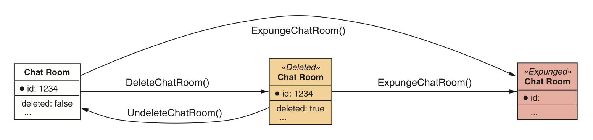
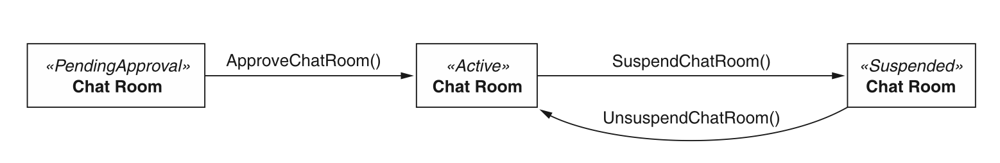
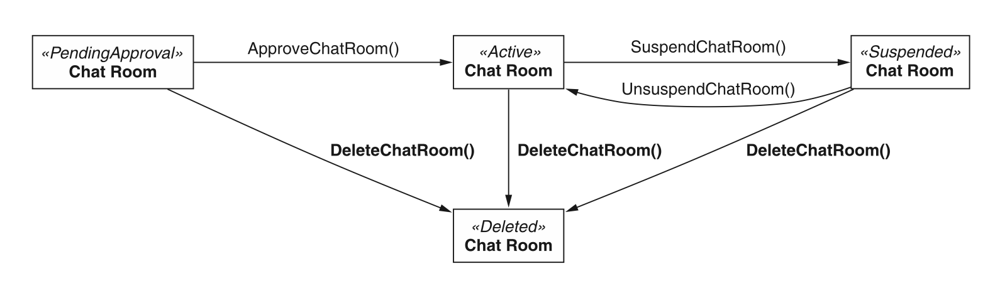
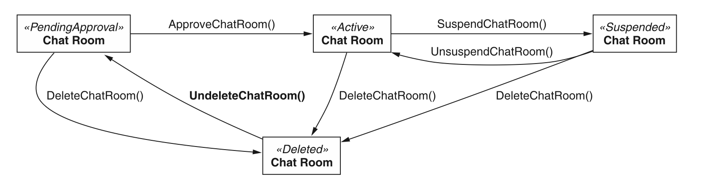

# 第 25 章 软删除

<div style="background:#f7f5e6; padding:24px; border-radius:4px; color:#405a73;">

**本章内容**
- 软删除以及它何时有用
- 如何指示资源被标记为已删除但实际上并未被移除
- 支持软删除的资源的标准方法所需的修改
- 如何取消删除软删除的资源
- 如何永久移除（清除）软删除的资源
- 管理引用完整性
</div><br/>

正如我们在 [第 7 章](ch7.md) 中学到的，标准 delete 方法只有一个目标：从 API 中移除资源。
然而，在许多场景中，这种从 API 中永久移除数据（所谓的硬删除）有点太极端了。
对于我们希望相当于计算机 “回收站” 的情况，即资源被标记为 “已删除” 但在出现错误时仍可恢复，我们需要一种替代方案。
在这种模式中，我们将探讨软删除，其中资源从视图中隐藏，并在许多方面表现得好像已被删除，同时仍然提供取消删除并恢复到完整视图的能力。

<a id="motivation"></a>
## 25.1 动机

从 Windows 95 开始，微软引入了回收站，这是一个临时存储区域，用于存放用户请求删除但尚未从系统中永久移除的文件。
问题很简单：太多人从计算机中删除文件，然后后来意识到他们不应该那样做。
这可能是一个意外（点击了错误的文件），或者是一个心理错误（以为是正确的文件但后来意识到不是），甚至只是后来改变了主意（以为已经处理完一个文件但后来意识到实际上还需要它），但要点仍然相同：他们需要一个可恢复的删除操作，与永久删除分开。
这个同样的问题在 API 中经常出现。

我们可能编写代码删除具有特定属性集的资源，但也许我们做比较时出错了，最终删除了一堆本不应匹配条件的资源。
我们可能有一个删除数据的脚本，并意识到我们在不应该的时候意外运行了它，或者在我们认为删除一些资源没问题时运行了它，后来意识到我们实际上需要它们。
对于大型数据集，这变得更糟。
你能想象意外地从存储系统中删除一 PB 的用户数据吗？
（正是因为这个原因，你不能删除 Google Cloud Storage 服务中的整个桶。）

在这种情况下，如果我们的删除操作 ——即使只是针对某些资源类型—— 可以是部分的或软的，那就太好了，这样数据不一定会从地球上抹去，
而是在我们探索数据时（例如，使用标准 list 方法）从视图中隐藏。
为了使这种软删除形式真正有用，我们需要一种像删除资源一样容易地取消删除资源的方式。
最后，我们需要一种对资源执行原始永久删除的方式。

<a id="overview"></a>
## 25.2 概述

幸运的是，实现我们软删除资源目标的机制相当简单：将删除状态存储在资源本身上，要么通过一个简单的 deleted 布尔标志，要么如果资源使用状态枚举，则使用 deleted 状态。
这个字段将在资源的整个生命周期中充当标记，指示我们应该将其与其他未删除的资源区别对待。

一旦我们有了这种存储资源删除状态的新方式，我们就必须修改标准 delete 方法来更新这个状态，而不是完全移除资源。
为了处理完全移除，我们将依赖一个特殊的自定义 expunge 方法，它将接管这一责任。
最后，我们需要一种恢复软删除资源的方式，这引导我们使用一个自定义 undelete 方法。
支持软删除的资源的新生命周期可能看起来像图 25.1。

在下一节中，我们将探讨这种模式的细节以及支持软删除所需的所有更改和需要覆盖的边缘情况。

*图 25.1 资源被软删除和清除的生命周期* <br/>
<br/>

<a id="implementation"></a>
## 25.3 实现

正如 API 设计中大多数话题的情况一样，这种模式的细节构成了我们大部分的工作。
在这种情况下，所有工作都源于我们一个简单的选择：依赖一个额外的字段来指示资源是否被删除。
一旦我们决定了这个额外字段应该是什么样子，我们还有相当多的内容需要涵盖。

<ins>首先，我们需要调整几个标准方法，使它们的行为与 [第 7 章](ch7.md) 中定义的略有不同。</ins>
例如，标准 delete 方法现在需要表现得有点像标准 update 方法，修改资源以将其标记为已删除，而不是完全删除资源。
此外，标准 list 方法需要忽略已删除的资源。
毕竟，如果它自动包含已删除的资源，那就违背了将资源标记为已删除的初衷！
最后，我们需要新的自定义方法来覆盖每个新的特殊行为：一个用于取消删除我们已软删除的资源，另一个用于永久移除资源（正如标准 delete 方法过去所做的那样）。

像往常一样，这些新方法和行为将引出其他复杂的问题需要回答。
例如，如果我们尝试软删除一个已经标记为已删除的资源，会发生什么？
当其他资源引用那些标记为已删除的资源时，我们是否需要强制执行任何引用完整性规则？
那么其他类似于标准 delete 方法的方法，例如批量 delete 方法呢？
这些类型的方法应该采用这种新行为，还是继续完全像到目前为止那样表现？

这有相当多的内容需要解开，所以让我们先介绍如何在资源上存储新的 deleted 状态。

<a id="deleted-designation"></a>
### 25.3.1 删除标记

为了在资源类型上启用这种模式，我们需要一种方式来指示资源应被系统其余部分视为已删除。
在这种情况下，有两个明显的竞争者：一个简单的布尔标志字段和一个更复杂的状态字段。
让我们先看看更简单的选项。

#### 布尔标志

在大多数情况下，指示资源已被软删除的最佳方式是在资源上定义一个简单的布尔字段。
显然，这个字段将默认为 false，因为新创建的资源不应以已删除状态开始其生命周期。

*清单 25.1 带有布尔标志的软删除资源*

```typescript
interface ChatRoom {
  id: string;
  // ...
  // 该标记用于定义资源是否被视为已软删除
  deleted: boolean;
}
```

<ins>这个字段更有趣的方面是它应该被视为仅输出。
这意味着如果有人尝试设置这个字段（例如，使用标准 update 方法），值本身应被忽略。
相反，正如我们稍后将看到的，修改这个字段的唯一方式是使用标准 delete 方法（从 false 变为 true）或自定义 undelete 方法（朝相反方向）。
这意味着尝试仅更新资源上的 deleted 字段的代码仍会成功，但资源将保持未修改。</ins>

*清单 25.2 与仅输出字段交互的示例*

```typescript
// 我们首先使用标准的获取方法来读取资源
let chatRoom = GetChatRoom({ id: "1234" });
assert chatRoom.deleted === false;
// 此处我们手动将资源的 deleted 字段设置为 true
chatRoom.deleted = true;
// 注意：该操作不会返回错误结果，而是直接忽略仅输出字段（例如 deleted）
chatRoom = UpdateChatRoom({
  resource: chatRoom,
  fieldMask: ['deleted']
});
// 尽管返回结果显示操作成功，但该资源实际上仍未被删除！
assert chatRoom.deleted === false;
```

有了这个简单的 “是或否” 布尔字段，我们就可以启用我们将在 [第 25.3.2 节](#modifying-standard-methods) 及以后探讨的所有其他复杂行为。
然而，在我们这样做之前，让我们看看另一个替代方案：状态字段。

#### 状态字段

在某些情况下，资源可以处于几种状态之一，具有明确定义的生命周期，可以用适当的状态机表示。
考虑一个世界，新的聊天室需要系统管理员批准，然后如果参与者不遵守规则，之后仍可能被暂停。
在这种情况下，我们可能有一个看起来像图 25.2 的状态图，有三个状态：待批准、活跃和已暂停。

*图 25.2 具有状态更改的资源的生命周期* <br/>
<br/>

在我们已经有一个状态字段来跟踪给定资源状态的情况下，与其添加一个布尔标志来存储资源是否已被软删除，我们可以选择通过引入一个新的 deleted 状态来重用状态字段。
这导致一个看起来像图 25.3 的状态图。

*图 25.3 添加 deleted 作为新的状态选项* <br/>
<br/>

虽然乍一看这看起来相当干净，但事实证明它有一个大问题：当我们去取消删除一个资源时，我们如何知道目标状态是什么？
在这种情况下，我们可以假设已恢复的 ChatRoom 资源应始终回到需要批准的状态，将其视为与刚重新创建时相同（见图 25.4）。
然而，这个假设可能并不适用于所有场景。
换句话说，使用状态字段来跟踪资源的状态，然后依赖一个布尔字段来跟踪资源的这个单一正交方面（是否被软删除），是完全没问题的。

*图 25.4 添加对自定义 undelete 方法的支持* <br/>
<br/>

现在我们已经介绍了指示资源是否被删除的不同方式，我们必须看看这个新指示器将对现有方法产生什么影响。
让我们先看看我们需要调整的标准方法集合。

<a id="modifying-standard-methods"></a>
### 25.3.2 修改标准方法

现在我们有了一个新的地方来跟踪资源是否被删除（一个布尔字段或可能是一个状态字段），我们需要对这个标记做一些事情。
特别是，我们需要让具有这个特殊属性的资源看起来已被删除，但只在某种程度上。
在某些情况下，方法根本不需要更改。
例如，由于 deleted 指示器是仅输出的且不能手动设置，标准 create 和 update 方法都没有有意义的变化。
让我们开始看看那些确实需要稍作修改的方法。

#### GET

对于软删除的资源，标准 get 方法应完全像对任何其他资源一样表现：按请求返回资源。
这意味着在删除资源后立即检索它不会返回 404 Not Found HTTP 错误，而是会像资源根本没有被删除一样返回它。
<ins>正如我们将看到的，在其他情况下，访问软删除资源需要额外的工作是有道理的，但当我们知道资源的标识符时，使用该标识符检索它是一个明确的迹象，表明我们可能想确定它是否被软删除；而不是我们确定它已被删除并想无论如何查看数据。</ins>

#### LIST

标准 list 方法是在面对软删除资源时需要更改以保持有用的方法之一。
在这种情况下，我们希望提供一种机制来仅查看未删除的资源，但也提供在用户明确请求时将软删除资源包含在结果集中的能力。

为了实现这一点，我们需要做两件事。
首先，标准 list 方法应自动从结果集中排除任何软删除的资源。
其次，我们需要扩充请求接口以包含一个新字段，允许用户表达希望包含软删除资源的意愿。

*清单 25.3 在标准 list 方法中包含已删除结果*

```typescript
abstract class ChatRoomApi {
  @get("/chatRooms")
  ListChatRooms(req: ListChatRoomsRequest): ListChatRoomsResponse;
}

interface ListChatRoomsRequest {
  pageToken?: string;
  maxPageSize?: number;
  // 如果设为 true，结果集会包含已软删除的资源
  includeDeleted?: boolean;
  filter?: string;
}

interface ListChatRoomsResponse {
  resources: ChatRoom[];
  nextPageToken: string;
}
```

<ins>这个定义引出了一个显而易见的问题：为什么不使用 filter 字段来包含软删除资源？
这有几个原因。</ins>
首先，不能保证所有标准 list 方法都支持过滤。
在它们不支持的情况下，我们仍然需要一种机制来支持将软删除资源包含在结果集中，在那种情况下，我们必须在所示的布尔标志或仅支持非常有限的语法来只关心软删除资源的过滤器之间做出选择。
其次，虽然这两个概念密切相关，但它们实际上是正交的。
filter 字段负责获取一组可能的结果并将这些结果缩小到仅匹配特定条件集的那些。
includeDeleted 字段负责做相反的事情：在甚至应用过滤器之前扩大潜在结果集。

这种组合确实意味着我们有一种有点令人困惑的方式来仅显示软删除资源，但这也意味着 API 在每个不同字段的用途上保持一致和清晰。

*清单 25.4 查看所有软删除资源的示例*

```typescript
softDeletedChatRooms = ListChatRooms({
  // 如需仅展示已软删除的资源，我们需要使用过滤器来限制返回结果
  filter: "deleted: true",
  // 为保证已软删除资源能被包含在结果集中（再进行过滤），需要显式指定纳入已删除资源
  includeDeleted: true,
});
```

#### DELETE

正如我们已经学到的，标准 delete 方法需要扩充，现在不是实际移除资源，而是应使用 [第 25.3.1 节](#deleted-designation) 中讨论的指示器将资源标记为已删除。
它还应返回新修改的资源。

*清单 25.5 修改后的标准 delete 方法的定义*

```typescript
abstract class ChatRoomApi {
  @delete("/{id=chatRooms/*}")
  // 增强后的标准删除方法现在会返回资源，而不是像之前那样返回void
  DeleteChatRoom(req: DeleteChatRoomRequest): ChatRoom;
}

interface DeleteChatRoomRequest {
  id: string;
}
```

新的问题是，当你尝试软删除一个已经被软删除的资源时，究竟应该发生什么？
也就是说，如果一个资源被标记为已删除，标准 delete 方法应该保持原样吗？
还是抛出错误？还是完全做其他事情？

答案遵循我们在 [第 7 章](ch7.md) 中学到的关于重复删除的相同原则：
能够区分命令式（这个请求导致资源被删除）和声明式（资源已删除，无论是否是此请求的结果）很重要。
<ins>因此，新的标准 delete 方法返回错误结果（例如，412 Precondition Failed HTTP 错误）以指示资源已经被软删除，因此请求无法按预期执行，这一点很重要。</ins>

现在我们已经介绍了相关的标准方法，让我们开始看看我们需要实现的新自定义方法，从自定义 undelete 方法开始。

### 25.3.3 取消删除

支持软删除的主要好处之一是标准 delete 方法不会永久删除数据。
相反，通过将资源标记为已删除但保持底层数据完好无损，我们在某种程度上免受各种可能的错误 API 调用的影响。
但为了使这种保护真正有价值，我们需要一种撤销错误的方式。
换句话说，如果我们删除一个资源然后后来决定不应该这样做，必须有一种方式来恢复或取消删除该资源。
正如你可能猜到的，我们可以用一个自定义方法来做到这一点。

*清单 25.6 自定义 undelete 方法的定义*

```typescript
abstract class ChatRoomApi {
  @post("/{id=chatRooms/*}:undelete")
  // 就像标准 update 方法一样，我们返回资源本身。
  UndeleteChatRoom(req: UndeleteChatRoomRequest):
    ChatRoom;
}

interface UndeleteChatRoomRequest {
  id: string;
}
```

自定义 undelete 方法很简单。
给定一个软删除资源的标识符，取消标记该资源，使其不再显示为已删除。
问题然后变成了另一个关于幂等性和重复性的问题：如果我们尝试取消删除的资源当前没有被软删除，会发生什么？
在这种情况下，就像我们对标准 delete 方法所做更改的情况一样，响应应该是错误结果（例如，412 Precondition Failed HTTP 错误）。
<ins>目的再次是确保用户能够区分导致结果的请求（命令式）和结果为真但不一定由特定请求导致（声明式）。</ins>

### 25.3.4 清除

说了这么多关于软删除提供的新功能，我们有点忽略了完全删除的旧功能。
但仅仅因为我们希望用 API 回收站来保护自己免受错误的影响，并不意味着我们永远不希望有能力真正清空它。
遗憾的是，我们已经将标准 delete 方法重新用于仅执行软删除，那么我们如何处理旧式的完全删除呢？

为了弥补这个差距，我们有两个选择：在标准 delete 方法上提供一个额外参数，或者依赖一个自定义方法。
虽然在标准 delete 请求上增加额外参数可能会减少接口和自定义方法的数量，但它有几个缺点。
第一个是 HTTP DELETE 方法通常不接受请求体。
这意味着我们特殊的新参数必须在查询字符串中提供。
最终，这意味着一个典型的删除资源的 HTTP 请求（`DELETE /chatRooms/1234`）的行为将与带有额外查询参数的同一请求（`DELETE /chatRooms/1234?expunge=true`）截然不同。
一般来说，额外参数，特别是查询字符串中的参数，不应大幅改变请求的行为和结果。
否则，为什么要为删除和创建分别设置多个方法？
为什么不直接用一个请求加上 `?action=create` 作为参数呢？

依赖标准 delete 请求中参数的另一个缺点是，由于权限和访问控制，一般来说，控制对特定 API 方法的访问比控制同一方法但带有不同参数集更容易。
在这种情况下，如果我们想禁止用户永久删除资源，同时允许同一用户软删除资源，我们就必须允许访问标准 delete 方法，但仅当该方法上的特殊标志设置为 false 时。
虽然可能，但这肯定实现起来更复杂。

<ins>由于这些原因，依赖一个单独的方法来处理从系统中完全移除资源的责任可能更好。</ins>

*清单 25.7 自定义 expunge 方法的定义*

```typescript
abstract class ChatRoomApi {
  @post("/{id=chatRooms/*}:expunge")
  // 就像旧的标准删除方法一样，清除操作应当返回空结果。
  ExpungeChatRoom(req: ExpungeChatRoomRequest): void;
}

interface ExpungeChatRoomRequest {
  id: string;
}
```

由于我们不得不担心修改后的标准 delete 方法和自定义 undelete 方法的先决条件和错误结果，值得就 expunge 方法问同样的问题。
在这种情况下，由于结果是完全删除的资源，问题略有不同：我们可以在任何资源上调用这个方法吗，无论它是否已经被软删除？
还是我们需要先软删除一个资源，然后才能永久移除它？

虽然可能有一些理由要经历先软删除资源的中间步骤，但从长远来看，这很可能只会成为 API 的减速带。
换句话说，它主要会是一种不便，将本应是单个 API 请求的操作变成两个，而没有真正做太多其他事情。
<ins>因此，几乎总是应该可以在任何资源上调用自定义 expunge 方法，无论它是否已经被软删除。</ins>

### 25.3.5 过期

虽然通常软删除和显式永久删除就足够了，但在某些情况下，我们可能希望每隔一段时间清空回收站。
例如，当我们在 Gmail 中删除一封邮件时，它会进入垃圾桶（即软删除）。
然而，在垃圾桶中 30 天后，邮件会被永久删除。
这种模式，我们在 [第 10 章](ch10.md) 中关于 LRO 行为时看到了一些，对于软删除资源来说并不罕见。
唯一的问题是确定如何最好地实现它。

就像 LRO 一样，软删除资源也应该有一个过期时间。
这意味着除了 [第 25.3.1 节](#deleted-designation) 中描述的标记之外，我们还需要在任何支持软删除的资源上添加一个新字段。
这个新字段应称为 expireTime，应在资源被删除时立即设置，根据某些预定义策略（例如，30 天后过期）计算预期的过期时间。
如果资源被标记为已删除以外的任何状态，过期时间应设置为显式的 null 值。
这意味着如果我们取消删除一个资源，它的过期时间应该被重置。

*清单 25.8 向资源添加新的过期时间字段*

```typescript
interface ChatRoom {
  id: string;
  // ...
  deleted: boolean;
  // 此字段跟踪资源何时应该过期并被永久移除。
  expireTime: Date;
}
```

这将确定事物何时过期的负担放在执行过期的方法上（在这种情况下，是标准 delete 方法），但也有一个不错的副作用，即默认情况下允许任何策略更改只影响新软删除的资源。
例如，如果我们将策略从 30 天更改为 45 天，所有已经软删除的资源仍将在其软删除日期后 30 天被删除，但任何新软删除的资源将遵循新策略。

这种策略还确保处理资源过期的代码简单明了。
本质上，我们可以依赖两个简单的条件：如果资源被标记为已删除（例如 `resource.deleted == true`）并且过期时间晚于或等于现在（例如 `resource.expireTime >= Date.now()`），我们应该简单地完全移除该资源。

### 25.3.6 引用完整性

软删除另一个值得讨论的话题是引用完整性。
简而言之，我们必须决定软删除的资源是否仍可以被其他资源引用。
我们在 [第 13 章](ch13.md) 中相当详细地讨论了这类问题，主要要点是不同 API 在引用完整性方面有不同的模式。
其中一些可能会限制破坏引用的能力。
另一些可能只是级联更改（例如，如果相关资源被删除，它可能会删除涉及的其他资源）。
还有一些可能只是保留引用不动，就像对任何未来尝试使用该引用的人来说是一个定时炸弹。

<ins>在软删除的情况下，场景非常相似。
因此，规则应保持不变。
这意味着无论正常的标准 delete 方法强制执行什么模式，改为启用软删除都不应改变那部分行为。
所以如果以前为了防止破坏引用完整性而阻止删除，软删除应该具有相同的限制，尽管技术上引用不会被破坏。</ins>

虽然这在我们最初的目标 ——能够撤销错误删除——方 面确实带来了一些复杂性（因为现在在某些情况下我们不能像以前一样完全恢复资源），但改变行为的额外复杂性，只在资源过期或被清除时才改变，根本不值得。

### 25.3.7 对其他方法的影响

尽管我们已经介绍了现有标准方法所需的各种更改，但我们还没有提到其他相关方法。
例如，如果我们支持批量方法，批量 delete 方法带来了一点困境。
该方法应该继续像以前一样表现，批量永久删除资源吗？
还是也应该修改为默认软删除？
如果应该修改，是否也应该有一个批量 expunge 方法？

简单的答案是它应该被修改，如果那种行为是必需的，应该有一个批量 expunge 方法。
一般来说，当我们改变标准方法的行为（在这种情况下，是标准 delete 方法）时，我们应该考虑其他相关方法，几乎就像它们使用了那些新改变的方法一样。

*清单 25.9 批量 delete 方法的示例实现*

```typescript
abstract class ChatRoomApi {
  @post("/chatRooms:batchDelete")
  BatchDeleteMessages(req: BatchDeleteMessagesRequest): void {
    for (let id of req.ids) {
      // 批量 delete 方法的软删除行为将被继承。
      ChatRoomApi.DeleteMessage({ id: id });
    }
  }
}
```

因此，批量 delete 方法应定义为批量形式的标准 delete，因此将从修改后的标准 delete 方法继承新行为以支持软删除。

### 25.3.8 跨版本添加软删除

最后，由于我们很少第一次就做对，我们应该解决如何安全地向以前没有软删除支持的 API 添加软删除支持的问题。
正如我们在 [第 24 章](ch24.md) 中学到的，制定关于什么构成向后兼容更改的策略至关重要，而在以前只支持硬删除的 API 中实现软删除当然是我们需要审视的更改。

与几乎所有与版本控制相关的问题一样，答案相当没有吸引力：视情况而定。
一般来说，改变方法的行为不太可能是一个安全的更改，但在许多情况下，这种向软删除的更改可能完全没问题。
例如，如果我们对资源实施具有 24 小时过期窗口的软删除，资源不会立即删除而是 24 小时后才移除，这真的是什么大问题吗？
如果被删除的信息不是特别重要（例如，没有关于此类数据处置的法律），这一点尤其正确。

因此，软删除功能是否可以以非破坏性的方式添加到现有 API 中，实际上真的有待解释。
它几乎肯定取决于最终结果（例如，是否也实现了过期），但最肯定需要深入了解数据的目的以及与数据隐私和安全相关的期望和法规。
<ins>为了安全起见，通常最好假设它在某种意义可能被视为向后不兼容。
因此，在实现软删除时增加主版本号（或等效项）是完全可以接受的。</ins>

### 25.3.9 最终 API 定义

综合所有内容，清单 25.10 展示了我们如何在聊天 API 中定义支持软删除的接口。

*清单 25.10 最终 API 定义*

```typescript
abstract class ChatRoomApi {
  @delete("/{id=chatRooms/*}")
  DeleteChatRoom(req: DeleteChatRoomRequest): ChatRoom;

  @get("/chatRooms")
  ListChatRooms(req: ListChatRoomsRequest): ListChatRoomsResponse;

  @post("/{id=chatRooms/*}:expunge")
  ExpungeChatRoom(req: ExpungeChatRoomRequest): void;
}

interface ChatRoom {
  id: string;
  // ...
  deleted: boolean;
  expireTime: Date;
}

interface ListChatRoomsRequest {
  pageToken?: string;
  maxPageSize: number;
  filter?: string;
  includeDeleted?: boolean;
}

interface ListChatRoomsResponse {
  resources: ChatRoom[];
  nextPageToken: string;
}

interface ExpungeChatRoomRequest {
  id: string;
}
```

<a id="trade-offs"></a>
## 25.4 权衡

一般来说，软删除是在允许用户从 API 中永久移除特定信息与防止他们搬起石头砸自己的脚之间的一种权衡。
因此，是否软删除是一个好主意，实际上取决于你的 API 的具体情况。

例如，如果存储的数据受到某种方式的监管，那么标准方法完全按预期行事 ——在请求时准确地永久移除信息—— 可能重要得多。
在这种情况下，制定更彻底的数据备份策略，作为防止意外数据丢失的方式可能是合理的。
这样，请求移除数据的用户得到了他们想要的，但数据仍然根据可能符合任何相关法规的策略被保留下来。

这反过来也成立。
一些法规可能专注于确保数据永远不会被永久删除。
在这种情况下，我们可能希望避免实现资源过期或自定义 expunge 方法，以避免违反这些法规。

<a id="exercises"></a>
## 25.5 练习

1. 什么时候使用布尔标志而不是状态字段来表示资源已被软删除是有意义的？
在同一资源上同时拥有这两个字段是否有意义？为什么有或为什么没有？

2. 用户应如何指示他们希望使用标准 list 方法仅查看软删除的资源？

3. 如果在尚未软删除的资源上调用自定义 expunge 方法，应该发生什么？
在同一资源上调用自定义 undelete 方法呢？

4. 软删除的资源什么时候应该过期？
过期截止时间应如何指示？

5. 在什么情况下我们可能认为添加软删除支持是向后兼容的更改？
什么情况下是向后不兼容的更改？

<a id="summary"></a>
## 本章小节

- 软删除指的是能够将资源标记为已删除，而实际上并未将其从 API 服务的存储系统中移除。

- 通常资源使用一个名为 deleted 的布尔标志字段标记为已删除，但它们也可能在已有的状态字段中添加一个新的 deleted 状态。

- 支持软删除的资源的标准方法行为需要一些小的更改
（例如，当请求软删除的资源时，标准 get 方法不应返回 404 Not Found 错误）。

- 软删除的资源可以使用自定义 undelete 方法恢复，并使用自定义 expunge 方法永久移除。

- 无论标准 delete 方法采用了哪种引用完整性准则（例如，被引用资源的级联删除），同样应适用于软删除资源。
