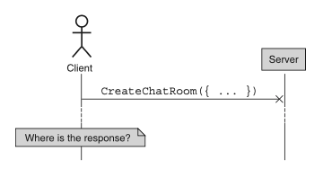
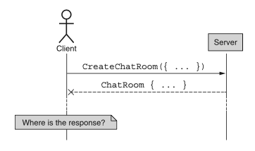
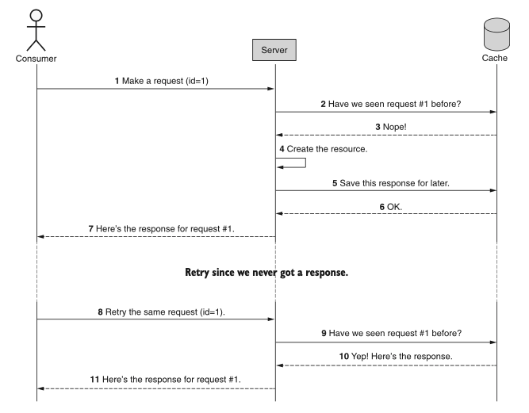
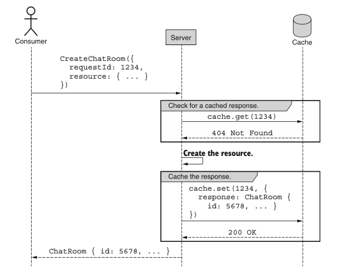
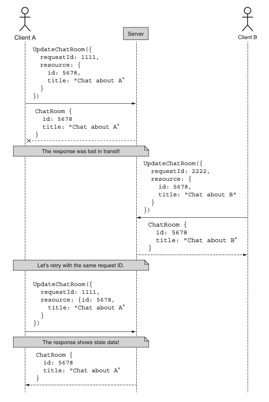
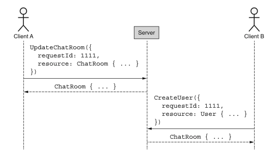
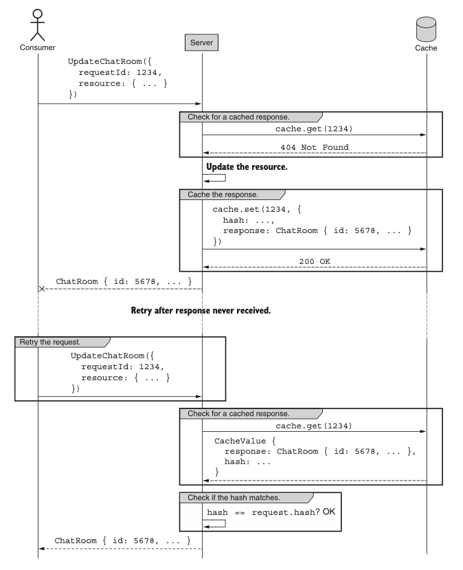

# 第 26 章 请求去重

<div style="background:#f7f5e6; padding:24px; border-radius:4px; color:#405a73;">

**本章内容**
- 如何使用请求标识符防止重复请求
- 如何管理请求标识符的冲突以避免令人困惑的结果
- 平衡请求和响应的缓存与一致性
</div><br/>

在一个我们无法保证所有请求和响应都能按预期完成旅程的世界中，当失败发生时，我们将不可避免地需要重试请求。
对于幂等的 API 方法来说这不是问题；然而，我们需要一种方式来安全地重试请求，而不会导致重复工作。
<ins>这种模式提出了一种机制，可以在 Web API 中面对失败时安全地重试请求，无论该方法是否幂等。</ins>

<a id="motivation"></a>
## 26.1 动机

遗憾的是，我们生活在一个非常不确定的世界中，尤其是在任何涉及远程网络的事情上。
鉴于现代网络的巨大复杂性和当今可用的各种传输系统，我们能够可靠地传输消息简直是个奇迹！
可悲的是，这个可靠性问题在 Web API 中同样普遍。
此外，随着 API 在越来越小的设备上通过无线网络被更频繁地使用，在越来越长的距离上发送请求和接收响应意味着，
我们实际上必须比在比如说小型有线局域网上更加关心可靠性。

这种网络固有不可靠性的必然结论是：客户端发送的请求可能并不总是到达服务器。
即使到达了，服务器发送的响应也可能并不总是到达客户端。
当这种情况发生在幂等方法上时（例如，不改变任何东西的方法，如标准 get 方法），这真的不是什么大问题。
如果我们没有得到响应，我们总是可以再试一次。
但如果请求不是幂等的呢？
为了回答这个问题，我们需要更仔细地看看这种情况。

一般来说，当我们发出请求但没有得到响应时，有两种可能性。
在一种情况下（如图 26.1 所示），请求从未被 API 服务器接收，所以我们当然没有收到回复。
在另一种情况下（如图 26.2 所示），请求被接收了，但响应从未回到客户端。

*图 26.1 请求已发送但从未被接收。* <br/>
<br/>

*图 26.2 响应已发送但从未被接收。* <br/>
<br/>

虽然这两种场景都不幸，但第一种（请求甚至从未被 API 服务器接收）是完全可恢复的情况。
在这种情况下，我们可以直接重试请求。
由于它从未被接收，基本上就好像请求从未发生过一样。
第二种情况要可怕得多。
在这种场景中，请求被接收，由 API 服务器处理，响应被发送 —— 只是它从未到达。

但最大的问题是我们无法区分这两种场景。
无论问题发生在发送请求时还是接收响应时，客户端只知道期望有一个响应，而它从未出现。
因此，我们必须为最坏的情况做准备：请求成功了，但我们没有被告知结果。
我们该怎么办？

这就是这种模式的主要目标：定义一种机制，通过它我们可以在整个 API 中防止重复请求，特别是对于非幂等方法。
换句话说，我们应该能够安全地重试方法（即使是发射导弹的方法），而无需知道请求是否被接收，也无需担心由于重试而导致方法被执行两次。

<a id="overview"></a>
## 26.2 概述

<ins>这种模式探讨了为每个我们想要确保只被服务一次的请求提供唯一标识符的想法。
使用这个标识符，我们可以清楚地看到当前的传入请求是否已经被 API 服务处理过，如果是，就可以避免再次对它采取行动。</ins>

这引出了一个棘手的问题：当捕获到重复请求时，我们应该返回什么作为结果？
虽然返回一个声明此请求已被处理的错误当然足够了，但从实际角度来说并不那么有用。
例如，如果我们发送一个创建新资源的请求并且从未得到响应，当我们再发出一个请求时，我们希望得到一些有用的东西，特别是所创建资源的唯一 ID。
错误确实防止了重复，但它并不完全是我们想要的结果。

<ins>为了处理这个问题，我们可以缓存与请求 ID 一起的响应消息，这样当发现重复时，我们可以像首次发出请求时那样返回响应。</ins>
使用请求 ID 的这种流程示例如图 26.3 所示。

*图 26.3 去重请求的事件序列概述* <br/>
<br/>

现在我们已经对这种简单模式在高层面上如何工作有了概念，让我们深入了解实现细节。

<a id="implementation"></a>
## 26.3 实现

<ins>使这种模式工作所需的第一件事是定义请求标识符字段，以便我们在确定请求是否已被 API 接收和处理时使用它。
这个字段将存在于客户端为任何需要去重的方法（在这种情况下，通常只是非幂等的方法）发送的任何请求接口上。</ins>
让我们先更仔细地看看这个字段以及最终将存储在其中的值。


### 26.3.1 请求标识符

<ins>请求标识符不过是一个标准的 ID 字段；然而，它不是存在于资源接口上，而是存在于某些请求接口上（参见清单 26.1）。</ins>
正如资源上的 ID 字段在整个 API 中唯一标识该资源一样，请求标识符旨在实现相同的目标。
这里的问题是，虽然资源标识符几乎总是永久的（ [第 6 章](ch6.md) ），但请求标识符更像是单次使用的值。
而且由于它们是客户端用来标识其传出请求的东西，因此由客户端自己选择它们是绝对关键的。

*清单 26.1 带有标识符字段的请求的定义*

```typescript
interface CreateChatRoomRequest {
  // 将请求标识符定义为请求接口上的可选字符串字段
  requestId?: string;
  resource: ChatRoom;
}
```

遗憾的是，正如我们在 [第 6 章](ch6.md) 中学到的，允许客户端选择标识符通常是个坏主意，因为他们往往选择得很差。
<ins>不过，既然这是必要的，我们能做的最好的就是指定一种格式，建议标识符随机选择，并强制执行指定的格式
（例如，我们真的不希望有人发送 ID 设置为 1 或 “abcd” 的请求）。
相反，请求标识符应遵循与资源标识符相同的标准（在 [第 6 章](ch6.md) 中讨论过）。</ins>

尽管请求标识符不像资源的标识符那样永久，但这并不会使它们变得不那么重要。
因此，如果 API 服务器收到带有无效请求 ID 的传入请求，它应拒绝该请求并抛出错误（例如，400 Bad Request HTTP 错误）。
<ins>请注意，这与将请求标识符留空或缺失不同。
在那种情况下，我们应该像请求永远不会被重试一样继续，绕过 [第 26.2 节](#overview) 中讨论的所有缓存，并像任何其他 API 方法一样表现。</ins>

#### 避免派生标识符

经常出现的一个问题是：“为什么不直接从请求本身派生一个标识符呢？”
乍一看这似乎是一个相当优雅的解决方案：对请求体执行某种哈希，然后确保每当我们再次看到它时就知道它不应该被再次处理。

这种方法的问题在于，我们不能保证实际上不需要执行同一个请求两次。
而且，我们不是在从客户端那里得到明确的声明（“我绝对想确保这个请求只被处理一次”），而是在没有提供明确方式来选择退出这种去重的情况下，隐式地确定了预期的行为。
显然，用户可以提供一些额外的标头或无意义的查询字符串参数来使请求看起来不同，但这把默认值搞反了。

默认情况下，请求不应被去重，因为我们无法确定用户的意图。
而允许用户清楚地表达其请求意图的一种安全方式是接受用户选择的标识符，而不是从请求内容中隐式派生一个。

最后，鉴于我们将在 [第 26.3.5 节](#todo) 中学到的内容，这最终不会是一个真正永不重复工作的情况。
由于缓存值几乎肯定会在某个时候过期，这更像是一种速率限制机制，确保同一个请求在某个时间段内不会被执行两次。

既然我们在讨论缓存如何工作，让我们简要讨论一下将缓存什么以及这些选择背后的理由。

### 26.3.2 响应缓存

在图 26.4 中，我们可以看到每个带有请求标识符的请求都会将结果存储在某个缓存中。
过程始于检查缓存中是否有提供的请求 ID，如果存在值，我们返回请求第一次实际被服务器处理时缓存的结果。
如果在缓存中找不到请求 ID，我们处理请求，然后在将响应按请求发送回用户之前用结果值更新缓存。

这种模式中可能看起来令人担忧的一点是，整个响应值都被存储在缓存中。
在这种情况下，存储需求可能很快失控；毕竟，我们技术上缓存了每个非幂等 API 调用的结果。
如果这些响应本身相当大呢？
例如，想象一个提供了 100 个资源的批量 create 方法。
如果我们收到该请求并为此请求去重使用这种模式，我们将需要缓存相当多的数据，而这只是一个请求。

*图 26.4 非重复请求的响应缓存序列* <br/>
<br/>

对于所有聪明的工程师来说，底线是：即使我们可以设计一个更复杂的系统来避免缓存所有这些数据，
而是尝试在不再次处理请求的情况下重新计算响应，这仍然不是一个好主意。
归根结底，工程师调试和管理复杂系统的时薪远远超过更多 RAM 或云中更大缓存集群的成本。
因此，从长远来看，缓存响应只是稳妥的选择，因为你总是可以很快地为问题投入更多硬件，但投入更多脑力就没那么容易了。

### 26.3.3 一致性

在缓存已处理请求响应这一要求背后，隐藏着一个关键的一致性问题。
换句话说，随着数据随时间更新，缓存值很容易变得陈旧或过时，而这些更新并未反映在缓存值中。
那么问题就在于，这在请求去重方面是否重要。

为了更清楚地说明这个问题，让我们想象两个客户端（A 和 B）都在对某个资源执行更新，如图 26.5 所示。
在这种情况下，让我们假设没有需要担心的冲突。
相反，让我们担心这样一个事实：客户端 A 的网络连接很差，可能需要时不时地重试请求。

*图 26.5 重试请求时可能会看到陈旧数据。* <br/>
<br/>

在这个例子中，虽然 A 和 B 都在更新资源，且这些更新没有冲突，但 A 的更新响应在传输中丢失了，从未被收到。
因此，A 决定使用与之前相同的请求标识符重试请求，以确保修改不会被重复两次。
在这次重试中，服务器用资源的缓存值进行响应，向 A 显示了最初在请求中设置的标题。
不过有一个问题：那实际上并不是数据现在的样子！

一般来说，像这样的陈旧或不一致数据可能是个巨大的问题，但关键是要回想这种模式的目的。
主要目标是允许客户端重试请求，而不会导致潜在危险的工作重复。
而这个目标的一个关键部分是确保客户端收到的响应结果与如果一切第一次就正确工作时他们会得到的结果相同。
因此，虽然这个事件序列（图 26.5）可能看起来有点奇怪，但它是完全合理且正确的。
事实上，返回除此之外的任何东西可能会更加令人困惑和不可预测。
换句话说，缓存绝对不应该随着底层数据的变化而保持最新，因为那会比我们在这种情况下看到的陈旧数据导致更多的困惑。

### 26.3.4 请求 ID 冲突

允许用户为自己的请求选择标识符的一个不可避免的后果是，他们通常并不擅长这样做。
而选择不当的请求标识符最常见的后果之一就是冲突：请求 ID 实际上并不那么随机，最终被使用多次。
在我们的设计中，这可能导致一些棘手的情况。

例如，让我们想象两个用户（A 和 B）与我们的 API 交互，他们的连接都完全良好，但他们都不擅长选择请求 ID。
正如我们在图 26.6 中看到的，他们最终各自选择了相同的请求 ID，导致了灾难性（且非常奇怪）的后果。

*图 26.6 由于请求标识符冲突而导致的令人困惑的结果。* <br/>
<br/>

不知何故，客户端 B 似乎尝试创建一个 User 资源，却得到了一个 ChatRoom 资源。
原因很简单：由于请求 ID 上发生了冲突，API 服务器注意到了它并返回了先前缓存的响应。
在这种情况下，事实证明该响应完全荒谬，与客户端 B 试图做的事情毫无关系。
这显然是一个糟糕的场景，我们能做什么呢？

正确的做法是确保请求本身自上次我们见到同一标识符以来没有发生变化。
换句话说，客户端 B 的请求也应该具有相同的请求体 —— 否则，我们应该抛出错误并让客户端 B 知道他们显然犯了一个错误。
为了实现这一点，我们需要解决两件事，都如清单 26.2 所示。

<ins>首先，当我们在执行一个尚无缓存值的请求后缓存响应值时，我们还需要存储请求本身的唯一指纹（例如，请求的 SHA-256 哈希）。
其次，当我们查找请求并找到匹配项时，我们需要验证这个（潜在的）重复请求上的请求体是否与先前的一致。
如果它们匹配，那么我们可以安全地返回缓存的响应。
如果它们不匹配，我们需要返回错误，理想情况下是类似 409 Conflict HTTP 错误。</ins>

*清单 26.2 使用请求标识符更新资源的示例方法*

```typescript
function UpdateChatRoom(req: UpdateChatRoomRequest): ChatRoom {
  // 如果未提供请求ID，直接执行更新并返回结果
  if (req.requestId === undefined) {
    return ChatRoom.update(...);
  }
  const hash = crypto.createHash('sha256')
    .update(JSON.stringify(req))
    .digest('hex');
  const cachedResult = cache.get(req.requestId);
  // 如果给定请求ID没有缓存值，则实际执行资源更新
  if (!cachedResult) {
    const response = ChatRoom.update(...);
    // 使用响应和哈希值更新缓存
    cache.set(req.requestId, { response, hash });
    return response;
  }

  // 如果哈希匹配，可以安全返回该响应
  if (hash == cachedResult.hash) {
    return cachedResult.response;
  } else {
    // 如果哈希不匹配，则抛出错误
    throw new Error('409 Conflict');
  }
}
```

通过使用这个简单的算法，每当我们看到一个已经被服务过的请求 ID 时，我们可以再次确认它确实是同一请求的重复，而不是冲突。
这使我们能够在用户未能很好地选择真正唯一的请求标识符这一不幸常见场景中安全地返回响应。

### 26.3.5 缓存过期

现在我们已经介绍了这种模式的大部分复杂部分，我们可以进入最后一个话题：数据在缓存中保留多长时间。
显然，在一个完美的世界里，我们可以永远保留所有数据，并确保任何时候用户需要重试请求，即使是在请求发出几年之后，我们也能像第一次响应时那样准确地返回缓存结果。
遗憾的是，数据存储需要花钱，因此在我们的 API 中是一种有限的资源。
最终，这意味着我们必须决定想在请求缓存中保留东西多长时间。

一般来说，请求在失败后相对较快地重试，通常是在原始请求后几秒钟。
<ins>因此，缓存过期策略的一个好的起点是将数据保留大约五分钟，但每次访问缓存值时重新启动该计时器，因为如果我们有缓存命中，就意味着请求被重试了。
如果进一步失败，我们希望给后续重试与首次尝试相同的过期策略。</ins>

为了让这个决定更容易，有一些好消息。
由于缓存本质上会导致数据在一段时间后过期，无论我们决定什么，以后都可以根据容量与流量相比有多少来微调。
换句话说，虽然五分钟是一个好的起点，但这个决定非常容易根据用户行为、可用内存容量和成本重新评估和调整。

### 26.3.6 最终 API 定义

这种模式的最终 API 定义相当简单：只需添加一个字段。
为了再次阐明这种模式的细节，完整示例序列如图 26.7 所示。

*清单 26.3 最终 API 定义*

```typescript
abstract class ChatRoomApi {
  @post("/chatRooms")
  CreateChatRoom(req: CreateChatRoomRequest): ChatRoom;
}

interface CreateChatRoomRequest {
  resource: ChatRoom;
  requestId?: string
}
```

*图 26.7 请求去重的事件序列* <br/>
<br/>

<a id="trade-offs"></a>
## 26.4 权衡

在这种模式中，我们使用一个简单的唯一标识符来避免在 API 中重复工作。
这最终是在允许非幂等请求的安全重试与 API 方法复杂性（以及缓存需求带来的一些额外内存要求）之间的权衡。
虽然有些 API 可能不那么关心重复请求场景，
但在其他情况下它可能至关重要 —— 事实上如此关键，以至于请求标识符可能是必需的而非可选的。

归根结底，是否用这种请求去重机制来使某些方法复杂化，实际上取决于具体场景。
因此，按需添加它可能是合理的，从一些特别敏感的 API 方法开始，并随着时间的推移扩展到其他方法。

<a id="exercises"></a>
## 26.5 练习

1. 为什么使用请求的指纹（例如，哈希）来确定它是否是重复请求是个坏主意？

2. 为什么尝试保持请求-响应缓存最新是个坏主意？
随着底层资源随时间变化，缓存的响应应该被无效化还是更新？

3. 如果负责检查重复的缓存系统宕机了会发生什么？
失败场景是什么？应如何防范这种情况？

4. 如果你已经有了请求 ID，为什么使用请求的指纹很重要？
请求 ID 生成的哪个属性导致了这一要求？

<a id="summary"></a>
## 本章小节

- 请求可能在任何时候失败，因此除非我们从 API 得到确认的响应，否则无法确定请求是否被处理。

- 请求标识符由 API 客户端生成，作为去重 API 服务所见的各个请求的一种方式。

- 对于大多数请求，可以根据请求标识符缓存响应，但过期和失效参数必须经过深思熟虑地选择。

- API 服务还应检查请求内容的指纹以及请求 ID，以避免在请求 ID 冲突的情况下出现异常行为。
