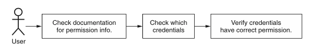
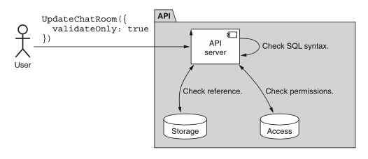
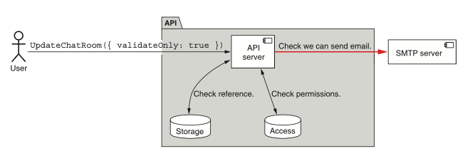
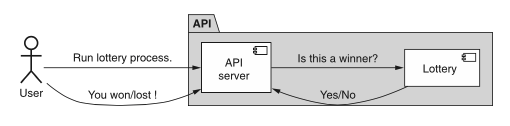

# 第 27 章 请求验证

<div style="background:#f7f5e6; padding:24px; border-radius:4px; color:#405a73;">

**本章内容**
- 为什么某些 API 方法应支持请求前验证
- 如何管理验证请求与外部依赖的交互
- 处理验证请求中方法的特殊副作用
</div><br/>

API 可能会令人困惑。
有时它们可能令人困惑到不清楚给定 API 调用的结果会是什么。
对于安全方法，我们有一个简单的解决方案来弄清楚结果：直接试一试。
然而，对于不安全的方法，这个解决方案显然行不通。
<ins>在这种模式中，我们将探讨一个可以添加到请求接口的特殊 validateOnly 字段，它将作为一种机制，让我们能够看到如果请求被执行会发生什么，而无需实际执行请求。</ins>

<a id="motivation"></a>
## 27.1 动机

即使是最直接的 API 也可能有些令人困惑 —— 毕竟，API 很复杂（否则就不会有像这本书这样的书了）。
无论我们阅读文档多少次、仔细检查源代码、调查授予我们的权限，以及审查我们即将发送给 API 的出站请求，我们很少能在第一次尝试时就一切正确。
也许是下一次尝试。
或者再下一次。
关键点是会有很多次尝试，其中一些不成功，或者成功了但方式错误，这都没关系。

虽然这种试探并看看会发生什么的方法在我们刚开始时效果很好，但当涉及生产系统时，它可能导致严重问题。
这有点像大多数人汽车出问题时会把它送到修理工那里的原因：他们可以自己捣鼓它，但这有把它弄坏的风险。
而它不是一个玩具车，它是往返工作、学校或杂货店的重要工具。

起初，我们可以通过只试探那些不改变任何数据或没有任何可怕副作用的安全方法来绕过这种危险，但其他方法呢？
例如，我们可能不想用一个名为 DeleteAllDataAndExplode() 的方法进行实验。
并不是说我们对这些方法进行实验的需求更少；只是我们没有一种好的方式来这样做。

当我们意识到在检查诸如我们是否有权执行给定 API 方法这样简单的事情时涉及多少人为错误时，这一点至关重要。
例如，考虑我们想验证是否可以调用 DeleteAllDataAndExplode() 方法的情况。
如图 27.1 所示，我们可以查看文档以了解需要什么权限，然后检查我们使用哪些凭据来发送 API 调用，
然后在系统中检查这些凭据是否具有文档所列的权限。
但如果在这条依赖链的任何地方出错了呢？

*图 27.1 请求可能在该系统中的各种检查中涉及人为错误。* <br/>
<br/>

归根结底，人类会犯错误，而计算机只是完全按照指令行事（即使我们可能本意是指令不同）。
所以虽然我们可能 99% 确定一切都会顺利进行，但在尝试之前我们不会确切知道。
必须有一种更好的方式来实验所有 API 方法 —— 即使是危险的方法。

<a id="overview"></a>
## 27.2 概述

由于我们的目标是允许用户获得其 API 调用的预览响应，我们可以通过一个字段来实现这一点，该字段指定请求应仅用于验证目的。
当 API 方法看到请求是要验证而不是执行时，它可以执行尽可能多的实际工作，而不对底层系统造成任何真正的更改。
在某种程度上，指定为仅需验证的请求应该有点像在自动回滚且永不提交的事务内执行工作。

*清单 27.1 支持验证请求的标准 create 方法示例*

```typescript
interface CreateChatRoomRequest {
  resource: ChatRoom;
  // 我们依赖一个简单的布尔标志来指示请求是否仅用于验证。
  validateOnly?: boolean;
}
```

这样做的原因很简单：用户应该获得尽可能多的验证。
这意味着应检查请求是否有执行操作的权限、是否与现有数据冲突（例如，可能不满足唯一字段要求）、是否满足引用完整性（例如，请求可能引用了不存在的另一个资源），以及任何其他服务器端的请求验证形式。
一般来说，如果请求在实际执行时会抛出错误，那么在验证时也应抛出同样的错误。

虽然很勇敢，但这并不总是可能的。
这可能是由于许多不同的事情（例如，与外部服务的连接或其他依赖，如 [第 27.3.1 节](#external-dependencies) 所讨论的），
但目标保持不变：尽量使验证响应尽可能接近真实情况。
在下一节中，我们将探讨如何处理仅验证请求的所有细节，以及需要解决的各种棘手场景。

<a id="implementation"></a>
## 27.3 实现

正如我们在清单 27.1 中看到的，我们可以允许用户通过将 validateOnly 字段设置为显式布尔值 true 来指定请求仅用于验证。
否则，默认情况下，请求就只是一个常规请求。
这个默认值很重要，因为如果我们反过来选择（默认始终只验证请求），我们就会无意中让所有请求默认无法执行实际工作。
在这种情况下，要获得任何类似正常行为的东西，我们总是需要设置一个标志，这对任何 API 来说都可能是一个大错误。

由于目标是提供对请求响应的现实预览，验证请求应努力验证请求的尽可能多的方面，这可能涉及与其他远程服务通信（只是不实际修改任何数据）。
例如（如图 27.2 所示），我们可能与访问控制服务通信，以确定用户是否有权执行所请求的操作。
如果有引用完整性问题需要担心，我们可能检查资源是否存在。
我们可能验证一些参数的正确性，例如确保字符串 SQL 查询格式有效。

*图 27.2 验证请求仍可能连接到其他内部组件。* <br/>
<br/>

此外，对请求的响应应代表常规（非验证）请求的响应。
这意味着如果请求因任何原因导致错误，我们应完全像否则那样返回该错误。
例如，如果我们无权执行请求，我们可能会得到 403 Forbidden HTTP 错误。

另一方面，如果请求本会成功，响应应尽可能接近真实响应。
这意味着响应类型中任何可以合理填充的字段都应被填充。
有些字段根本无法填充（例如，服务器生成的标识符），应留空或填入看起来现实（但肯定无效）的值。
不过，最终，结果字段主要是为了确认请求将成功执行，因此不应硬性要求响应中返回所有信息。
为此，用户应执行真实请求而非验证请求。
<ins>同样不言而喻的是，在某些方法上支持验证请求而在其他方法上不支持是完全合理的 —— 毕竟，在某些方法上它可能根本没有意义。</ins>

在这一切中最重要的是一切验证请求都应导致方法完全安全和幂等。
这意味着不应更改任何数据，不应以任何方式显现副作用，任何标记为 “仅验证” 的请求都应每次可重新运行并获得相同结果（假设系统中没有其他更改发生）。

当 API 方法只读但不一定免费时，这可能会变得令人困惑。
例如，考虑一个查询大型数据仓库的 API 方法。
对大量数据运行 SQL 查询在技术上不更改任何数据，但它肯定可能花费相当多的钱。
在某些情况下，成本与恰好匹配查询本身的数据量有关。
在这种情况下，即使 validateOnly 参数看起来可能不必要，它实际上相当关键。
否则，用户如何确定他们的 SQL 查询是否只包含有效语法？
虽然我们可能无法验证查询的所有方面，但至少在查询无效的情况下我们可以返回错误结果。

话虽如此，不幸的事实是，
请求的某些方面会导致我们违反这些关于始终完全安全和幂等的规则，所以我们有一个大问题需要回答：
当提供与方法行为的完全保真度导致违反（如非幂等方法）时，我们该怎么办？
在下一节中，我们将看看外部依赖以及如何在验证请求的上下文中与它们合作。

<a id="external-dependencies"></a>
### 27.3.1 外部依赖

验证请求时一个明显的问题来源是对外部服务或库的依赖。
原因很简单：由于我们不控制那些外部事物，我们无法解释我们与它们通信仅是为了验证目的。
例如，如果我们的 API 在 ChatRoom 资源更新时发送电子邮件消息，
我们可以通过发送测试邮件来验证我们是否可以发送电子邮件给特定收件人（如图 27.3 所示），
但这对于验证请求来说会是一个相当大的副作用。
因此，我们必须做出选择：避免验证某些方面，还是违反我们关于副作用、安全性和幂等性的规则。

*图 27.3 外部依赖使验证请求变得困难或不可能。* <br/>
<br/>

幸运的是，选择很简单：遵守规则。
如果外部依赖支持这样的验证请求，那么我们可以愉快地依赖它们来为我们提供真正验证这个下游服务所需的信息；
然而，如果这不可用，我们应该完全跳过它。
拥有一个安全、幂等且无副作用的验证过程远比验证每一个微小问题重要得多。

这可能意味着在明确外部资源不会支持所需用例时，花一点额外时间执行其他相关验证。
例如，虽然我们可能无法测试使用外部服务发送电子邮件，但我们很可能可以执行某种电子邮件地址格式验证，至少捕获明显无效的数据（例如，没有 “@” 符号的电子邮件）。
这当然不是一个完美的替代，但总比完全不执行任何验证要好。

### 27.3.2 特殊副作用

即使我们控制整个系统并且不维护任何外部依赖，提供对验证请求有用的预览响应仍有可能令人困惑。
考虑一个特殊聊天室彩票功能的例子，其方法随机返回一个特殊中奖响应（如图 27.4 所示）。
假设请求有效，当我们向这个方法发送验证请求时，响应应该是什么？
或者如果我们有更确定性的东西而不是纯粹随机的，但仍然依赖于聊天室中其他人的行为呢？
例如，如果不是随机选出的赢家，而更像是广播节目竞赛，每第 100 次调用 API 方法就会产生一个特殊响应呢？
这会改变我们对可能响应的看法吗？

*图 27.4 具有内部随机依赖的示例彩票请求* <br/>
<br/>

由于不可避免地会有我们无法省略信息而必须做出选择的情况
（例如，一个表示我们是否中了彩票的布尔字段），重要的是要记住这个验证方法的目标。
首先，我们需要验证请求并返回可能出现的任何潜在错误。
其次，假设请求确实有效，我们应该返回一个看似合理的结果，不一定是真实的，而是代表现实的。

如果我们遵循这些准则，我们之前问题的答案就简单多了：我们应该可以自由地有时返回中奖的彩票结果，其他时候返回未中奖的结果。
这些中奖的百分比不一定需要反映真实的彩票赔率，只要结果是在结果真实时可能合理返回的即可。
对于更确定性的广播竞赛风格也是如此：有时我们可能赢，其他时候可能不赢，所以响应值可以是任何一个；两者都代表现实。
简而言之，任何可以作为真实响应通过的东西都应被视为验证请求可接受的响应。

### 27.3.3 最终 API 定义

在这种情况下，API 定义本身相当简单：一个简单的（可选的）布尔字段，允许用户指定请求仅用于验证，从而使请求完全安全和幂等。

*清单 27.2 最终 API 定义*

```typescript
abstract class ChatRoomApi {
  @post("/chatRooms")
  CreateChatRoom(req: CreateChatRoomRequest): ChatRoom;
}

interface CreateChatRoomRequest {
  resource: ChatRoom;
  validateOnly?: boolean;
}
```

<a id="trade-offs"></a>
## 27.4 权衡

一般来说，验证请求是对一个恼人问题的简单答案。
通过提供一个简单的标志，这些用户可以在面对 API 中所有细节带来的大量复杂性时获得一定程度的确定性。
话虽如此，它们很少是硬性必需品，而更多的是一种便利，主要是对用户而言。

虽然用户是获得最多价值的一方，但 API 本身仍然有好处。
例如，在 API 方法昂贵的情况下（无论是金钱上、计算上，还是两者兼有），
如果该费用不转嫁给用户，支持验证请求肯定会最大限度地减少浪费，
原因很简单：用户可以表达他们仅验证请求而永不执行它的意图。

<a id="exercises"></a>
## 27.5 练习

1. 为什么我们应该依赖一个标志来使请求 “仅验证”，而不是用一个单独的方法来验证请求？

2. 想象一个从远程服务获取数据的 API 方法。
验证请求还应该与远程服务通信吗？
为什么应该或不应该？

3. 在从不写入任何数据的方法上支持验证请求是否有意义？

4. 为什么 validateOnly 标志的默认值为 false 很重要？
将默认值反转是否有意义？

<a id="summary"></a>
## 本章小节

- 有些 API 请求足够危险，以至于值得支持一种方式让用户在实际执行之前验证请求。

- 支持此功能的 API 方法应提供一个简单的布尔字段（validateOnly），指示请求仅用于验证而不实际执行。
这些请求应被视为安全的，并且不应对底层系统产生任何影响。

- 通常会有支持验证请求的 API 方法与外部服务交互的场景。
在这些情况下，这些方法应尽其所能验证那些外部事物，承认不可能验证某些方面的安全性。
