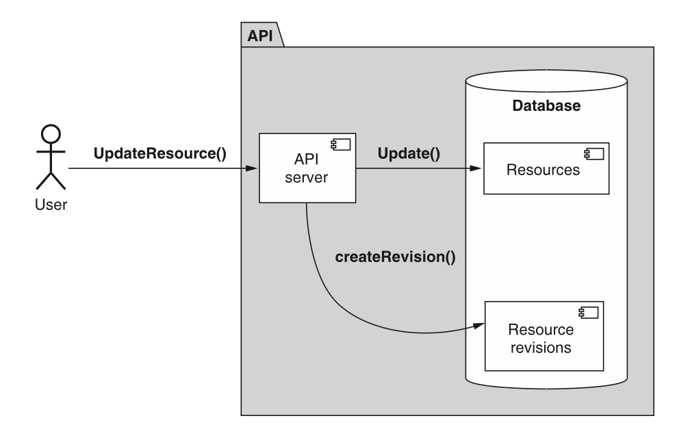
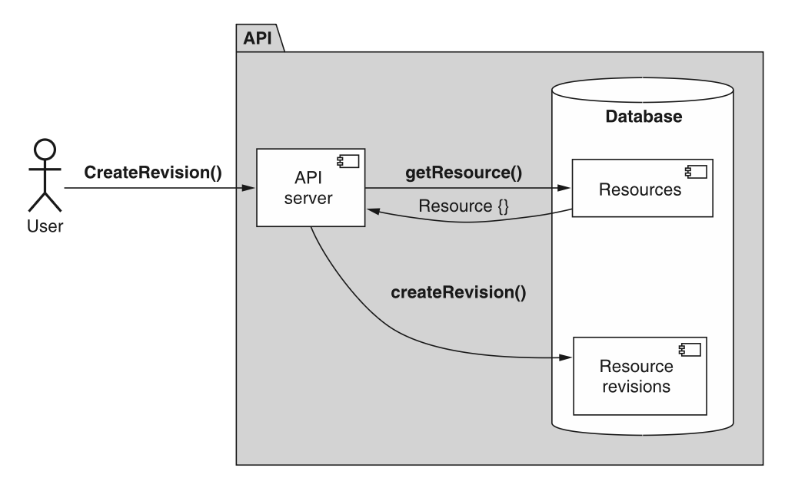

# 第 28 章 资源修订

<div style="background:#f7f5e6; padding:24px; border-radius:4px; color:#405a73;">

**本章内容**
- 如何安全地存储单个资源随时间变化时的多个修订版本
- 如何标识单个修订版本
- 隐式或显式创建修订版本的策略
- 如何列出可用修订版本并检索特定修订版本
- 恢复到先前修订版本如何工作
- 如何处理可修订资源的子资源
</div><br/>

尽管资源会随时间变化，但我们通常会丢弃过去可能发生的任何更改。
换句话说，我们只存储资源现在的样子，完全忽略资源在进行更改之前的样子。
<ins>这种模式提供了一个框架，通过它可以跟踪单个资源随时间的多个修订版本，从而保留历史并启用高级功能，例如回滚到先前的修订版本。</ins>

<a id="motivation"></a>
## 28.1 动机

到目前为止，我们与 API 中资源的所有交互都完全专注于资源的当前状态，而忽略了先前的状态。
虽然我们偶尔会考虑一致性之类的话题（例如，当我们研究在分页浏览列表时资源发生变化会发生什么），
但关于资源一直有一个很大的假设：它们只存在于一个时间点，而那个时间点就是现在。

到目前为止，这个假设一直很好地为我们服务，但某些资源需要的不止一次快照，这并不罕见。
例如，我们经常在 Microsoft Word 或 Google 文档中跟踪修订历史。
同样，如果我们的 API 涉及代表合同、采购订单、法律文件甚至广告活动的资源，
用户可能受益于能够查看资源随时间的历史，这并非疯狂的想法。
这意味着如果出现问题，诊断哪个更改是原因会容易得多。

这种模式的目标是提供一个框架，能够为单个资源存储多个修订版本，并允许其他更复杂的功能，例如删除不再需要的修订版本或将资源回滚到先前的修订版本，从而有效地撤销先前的更改。

<a id="overview"></a>
## 28.2 概述

<ins>为了解决这些问题，这种模式将依赖一个称为资源修订版本的新概念。
资源修订版本只是一个资源的快照，它用唯一标识符标记，并带有创建时刻的时间戳。</ins>
这些修订版本虽然本质上简单，但提供了相当多有趣的功能。

例如，如果我们能够浏览给定资源的所有修订版本并直接检索单个修订版本，
我们技术上就获得了窥视过去并查看资源随时间演变的能力。
更重要的是，我们可以通过回滚到特定修订版本来撤销先前的更改，使资源看起来与先前修订版本时完全一样。

但资源修订版本是什么样子的呢？
我们是否必须在 API 的生命周期内保持两个独立的接口同步？
幸运的是，答案是否定的。
资源修订版本根本不是一个独立的接口；
相反，它是通过简单地向现有资源添加两个新字段而产生的概念：
一个修订版本标识符和一个创建此修订版本时拍摄快照的时间戳。

*清单 28.1 为 Message 资源添加修订版本支持*

```typescript
interface Message {
  id: string;
  content: string;
  // ...

  // 通过添加两个字段，我们现在可以用同一个接口表示资源的多个修订版本。
  revisionId: string;
  revisionCreateTime: Date;
}
```

简而言之，这通过存储多个具有相同标识符（id）的记录来工作；
然而，这些记录中的每一个都有不同的修订版本标识符（revisionId），并表示资源在某个时间点的样子。
而现在，当我们通过标识符检索资源时，结果将是一个恰好是最新版本的资源修订版本。
从某种意义上说，资源标识符变成了最新资源修订版本的某种别名，而 “最新” 被定义为 revisionCreateTime 字段值最近的修订版本。

然而，像往常一样，关于细节有许多问题需要回答。
首先，我们如何决定何时创建新修订版本？
它应该是自动的还是需要特定的用户干预？
我们如何实现列出修订版本或检索特定修订版本资源的功能？
那么回滚到先前修订版本呢？
在下一节中，我们将详细讨论所有这些问题。

<a id="implementation"></a>
## 28.3 实现

资源修订版本如何工作？
正如我们所见，使资源可修订需要两个新字段，但这就是全部吗？
绝对不是。
还有一大堆额外的话题需要探讨。
这包括我们需要创建的各种自定义方法，以及需要修改以适应这种模式的现有标准方法。
简而言之，我们需要为想要支持的每个新行为定义新的 API 方法（例如，检索单个资源修订版本、列出修订版本、回滚到先前修订版本等）。

在我们能做任何这些之前，我们需要探讨这个新修订版本标识符字段究竟包含什么以及它将如何工作。
在下一节中，我们将通过决定什么是好的修订版本标识符以及它可能与我们典型的资源标识符有何不同来开始深入研究这种模式。

<a id="revision-identifiers"></a>
### 28.3.1 修订版本标识符

在选择修订版本标识符时，有几个选项。
首先，我们可以使用计数数字，有点像递增的版本号（1、2、3、4、……）。
另一个选项是使用基于时间的标识符，如简单的时间戳值（例如，1601562420）。
还有一个选项是使用完全随机的标识符，依赖我们在 [第 6 章](ch6.md) 中学到的原则。

前两个选项（计数数字和时间戳）在其标识符中蕴含了修订版本的时间顺序，与 revisionCreateTime 字段分开且独立，这可能会变得有点问题。
如果我们使用增量修订版本号，如果修订版本被删除（参见 [第 28.3.6 节](#deleting-revisions) ），可能会令人困惑，因为这会在修订历史中留下间隙（例如，1、2、4）。
<ins>由于删除某物的目标是移除它的所有痕迹，使用增量数字作为修订字符串肯定不理想，因为它留下间隙，使修订版本被删除这件事变得明显。</ins>

另一方面，时间戳不受这个问题影响，因为它们传达时间顺序并容忍数据中的间隙。
使用时间戳标识符，我们反而需要担心标识符上的冲突。
我们遇到这个问题的可能性非常小（通常只可能发生在对系统的极高并发访问的情况下），但这并不意味着我们可以完全忽略这个问题。
换句话说，如果没有更好的选择，那么时间戳是一个不错的折中；
然而，有一个更好的选项，它遵循 [第 6 章](ch6.md) 中探讨的原则：随机标识符。

与其他两个选项不同，随机标识符服务于一个且恰好一个目的：它是一个不透明的字节块，唯一标识单个修订版本。
但修订版本标识符是否应该与资源标识符完全相同？
虽然我们应该选择在整个 API 中一致地使用标识符，但在修订版本的情况下有一个值得探讨的问题：我们需要标识符有多大？

虽然 25 个字符的 Crockford Base32 格式标识符（120 位）在创建数十亿及更多资源时可能至关重要，
但问题是我们是否真的需要支持单个资源的修订版本数量与给定类型的资源数量一样多。
一般来说，我们的修订版本数量远少于资源数量，所以我们几乎肯定不需要完整的 120 位键空间。
<ins>相反，依赖 13 个字符的标识符（60 位）作为 64 位整数提供的相同键空间大小的近似值可能是合理的。</ins>

另一个需要考虑的问题是，依赖标识符中的校验和字符是否仍然合理，如 [第 6.4.4 节](ch6.md#checksum) 所述。
虽然这看起来可能多余，但请记住校验和字符的目的是区分某物不存在（即，一个有效标识符但没有底层数据）和某物从来不可能存在（即，一个完全无效的标识符）。
理所当然地，正如对资源做出这种区分很重要一样，对资源的单个修订版本也同样重要。
因此，我们几乎肯定应该保留资源修订版本标识符中的校验和字符。

我们可以重用 [第 6 章](ch6.md) 中展示的大部分相同代码来生成标识符，但使用更短的标识符。

*清单 28.2 生成随机资源修订版本标识符的示例代码*

```typescript
const crypto = require('crypto');
const base32Decode = require('base32-decode');

function generateRandomId(length: number): string {
  // 这里我们通过随机选择Base32字符来生成一个ID
  const b32Chars = '0123456789ABCDEFGHJKLMNPQRSTVWXYTZ';
  let id = '';
  for (let i = 0; i < length; i++) {
    let rnd = crypto.randomInt(0, b32Chars.length);
    id += b32Chars[rnd];
  }
  // 最后，我们返回ID以及计算得到的校验字符
  return id + getChecksumCharacter(id);
}

function getChecksumCharacter(value: string): string {
  // 首先将Base32字符串解码为字节缓冲区
  const bytes = Buffer.from(
    base32Decode(value, 'Crockford')
  );
  // 然后将字节缓冲区转换为BigInt数值
  const intValue = BigInt(`0x${bytes.toString('hex')}`);
  // 通过除以37取余数来计算校验和值
  const checksumValue = Number(intValue % BigInt(37));
  // 这里我们使用Crockford的Base32校验字母表
  const alphabet = '0123456789ABCDEFG' +
    'HJKMNPQRSTVWXYZ*~$=U';
  return alphabet[Math.abs(checksumValue)];
}
```

现在我们已经复习了为修订版本生成唯一标识符，让我们看看这些修订版本究竟是如何产生的。

### 28.3.2 创建修订版本

显然，能够标识修订版本很重要，但除非我们知道这些修订版本最初究竟是如何创建的，否则它基本上毫无用处。
<ins>在创建新修订版本方面，我们有两个不同的选项可供选择：显式创建修订版本（用户必须专门请求创建新修订版本）或隐式创建（无需任何特定干预就自动创建新修订版本）。</ins>

<ins>虽然这些策略中的每一个都完全可以接受，但重要的是在所有支持资源修订版本的资源中使用相同的策略，</ins>
因为如果我们在不同的资源中使用不同的修订策略，往往会导致潜在的困惑，即用户期望一种策略，而当他们的期望被打破时会感到惊讶。
<ins>因此，如果可能的话应避免混用和搭配，并在有使用不同策略的关键原因时清楚地记录下来。</ins>

所有这一切有一个注意事项。
<ins>无论我们选择哪种策略，如果资源支持修订版本，那么当该资源首次创建时，它必须无论如何都填充 revisionId 字段。
没有这一点，我们最终可能会得到实际上不是修订版本的资源，这会导致我们在以下各节中探讨的交互模式出现相当多的问题。</ins>

让我们从研究隐式创建的工作原理开始，探索创建修订版本的不同机制。

#### 隐式修订版本

在任何支持此功能的 API 中，创建资源修订版本最常见的机制是隐式创建。
这仅仅意味着不是用户专门指示 API 创建新修订版本，而是 API 自己决定何时这样做。
这并不是说用户没有能力影响何时创建修订版本。
例如，创建新修订版本最常见的机制是让 API 每次存储在资源中的数据发生变化时自动这样做，如图 28.1 所示。
事实上，有许多现实世界的系统依赖这种机制，例如 Google Docs 的修订历史或 GitHub 的问题跟踪，两者都跟踪相关资源（无论是文档还是问题）的所有历史。

*图 28.1 更新时隐式创建修订版本的流程图。* <br/>
<br/>

<ins>虽然这是最常见且肯定是最安全的选项（保留最多的历史），但还有许多其他可用的隐式修订跟踪策略。</ins>
例如，服务可能不是为每次修改创建新修订版本，而是按计划进行，只要进行了一些更改就在每天结束时创建新修订版本，或者可能跳过一定数量的更改，在每第三次修改后创建新修订版本，而不是每次单独的修改。

此外，我们可以基于里程碑而不是间隔来创建修订版本。
这意味着我们可能不是每次资源更新时创建新修订版本，而是每次修改单个特定字段时创建修订版本，或者每当执行特定自定义方法时创建修订版本。
例如，也许我们只在执行自定义 PublishBlogPost() 方法时为 BlogPost 资源创建新修订版本。

所有这些都是完全可以接受的，虽然规定一个一刀切的答案来说明修订版本应如何创建会很好，但在这里这根本不可能。
原因很简单：每个 API 都不同，具有不同业务或产品导向的约束，因此有不同的最适合创建资源修订版本的策略。

一个好的通用准则是宁可保留更多修订版本而不是更少（我们在 [第 28.3.7 节](#handling-child-resources) 中探讨节省空间的技术），
<ins>而最简单和最可预测的策略之一就是在资源每次被修改时创建新修订版本。
这种策略易于理解和使用，并且在大多数需要依赖资源修订版本的情况下创建非常有用的结果。</ins>

#### 显式修订版本

然而，在许多情况下，隐式创建修订版本可能完全不必要且过于浪费。
这引出了一个显而易见的替代方案：允许用户使用一个特殊的自定义方法明确说明他们究竟想何时创建新的资源修订版本，如图 28.2 所示。
这种显式机制允许用户精确控制修订版本何时创建，将决定修订版本创建策略的责任从 API 本身推回给用户。

*图 28.2 显式创建资源修订版本的流程图* <br/>
<br/>

为了做到这一点，我们可以创建一个新的自定义方法，它在许多方面类似于标准 create 方法。
这个自定义的创建修订版本方法不是在现有父资源下创建新资源，而是有一个单一的职责：对修订版本在当时那一刻的状态进行快照，并创建一个新修订版本来表示该快照。
这个新修订版本应具有随机生成的标识符（如 [第 28.3.1 节](#revision-identifiers) 所述），并且修订版本的创建时间戳应设置为修订版本最终被持久化的时间。

*清单 28.3 创建资源修订版本的 API 定义*

```typescript
abstract class ChatRoomApi {
  // 自定义创建版本方法用于创建一个新版本，并返回刚创建的版本（也就是设置了特殊字段的资源本身）
  @post("/{id=chatRooms/*/messages/*}:createRevision")
  CreateMessageRevision(req: CreateMessageRevisionRequest):
    Message;
}

interface Message {
  id: string;
  content: string;
  // ...
  // 我们可以通过增加28.2节介绍的这两个字段，让Message资源支持版本能力
  revisionId: string;
  revisionCreateTime: Date;
}

interface CreateMessageRevisionRequest {
  // 该方法只需要知道资源的标识符
  id: string;
}
```

现在我们已经看到了创建新资源修订版本的方式，让我们看看我们实际上如何与这些修订版本交互，首先从我们如何通过检索特定修订版本来回顾过去开始。

<a id="retrieving-specific-revisions"></a>
### 28.3.3 检索特定修订版本

正如我们在 [第 28.2 节](#overview) 中学到的，资源修订版本提供的最有价值的功能之一，是能够回顾过去并读取资源在过去的样子的数据。
但这引出了一个有趣的问题：我们究竟如何请求资源的过去修订版本？
从技术上讲，修订版本标识符（ [第 28.3.1 节](#revision-identifiers) ）作为字段存储在资源本身上；
那么我们应该依赖带有特殊过滤器的标准 list 方法吗？
虽然这在技术上可行，但它肯定相当笨拙，而且使用标准 list 方法来检索单个资源（而不是用于其浏览资源的主要目的）感觉有点奇怪。
幸运的是，有一种更好的方法来实现这一点，涉及两个部分。

<ins>首先，由于检索单个项明确是标准 get 方法的职责，这种机制当然应依赖扩展该方法以支持这个新的面向修订版本的用例。
其次，随之而来的是，我们需要一种清晰简单的方式在方法的请求中提供修订版本标识符。
为此，我们可以依赖一个新的特殊分隔符将整个资源标识符分成两部分：资源 ID 和修订版本 ID。</ins>
为此，我们将依赖 “@” 符号作为分隔符，从而产生完整的资源修订版本标识符，例如 `/chatRooms/1/messages/2@1234` 来表示给定 Message 资源的修订版本 1234。

<ins>使用这个特殊分隔符的好处相当美妙：标准 get 方法根本不需要改变。</ins>
由于我们只是发送一个稍微更详细的标识符，我们可以依赖标准 get 请求中的同一个 id 字段，并允许 API 服务将其解释为给定修订版本处的资源。

这确实引出了一个有趣的问题：当资源以特定修订版本响应时，该资源的 ID 字段中应该放什么？
换句话说，如果我们请求修订版本 1234 的资源，ID 会与请求中提供的内容完全匹配（例如 `resources/abcd@1234`），
还是我们应该回退到仅资源标识符（例如 `resources/abcd`）并将修订版本放入 revisionId 字段？

答案相当简单：返回的资源应具有与所请求内容完全等效的标识符（并且 revisionId 字段应始终填充返回的修订版本的标识符），
因为重要的是我们能够轻松断言我们得到的正是我们所请求的。

*清单 28.4 你得到你所请求内容的不变量*

```typescript
assert(GetResource({ id: id }).id == id);
// 通过其 ID 检索某物应始终返回具有相同 ID 的结果。
```

这意味着当我们请求资源而不指定修订版本 ID 时，返回的资源的 id 字段将只有资源 ID（没有 “@” 符号也没有修订版本 ID），但 revisionId 字段仍应被填充。
如果我们随后针对同一资源修订版本（基于 revisionId 字段）发出请求，结果将具有相同的数据，但 id 字段也将包含修订版本 ID。

*清单 28.5 显示检索资源的不同标识符的客户端交互*

```typescript
// 当我们请求不带版本ID的资源时，返回结果中的ID保持原样（不带版本ID）
> GetMessage({ id: 'chatRooms/1/messages/2' });
{
  id: 'chatRooms/1/messages/2',
  // ...,
  // revisionId 字段始终会填充正确的值
  revisionId: 'abcd'
}

// 当我们请求同一个资源，但同时提供版本ID时，该版本信息会包含在返回结果的ID中
> GetMessage({ id: 'chatRooms/1/messages/2@abcde' });
{
  id: 'chatRooms/1/messages/2@abcd',
  // ...,
  // revisionId 字段始终会填充正确的值
  revisionId: 'abcd'
}
```

现在我们已经了解了如何检索单个资源修订版本，让我们看看如何浏览所有修订版本，类似于我们可能浏览给定类型的所有资源的方式。

### 28.3.4 列出修订版本
幸运的是，基于我们对标准 list 方法的探索（参见 [第 7.3.4 节](#list-method) ），我们有相当多的列出资源的经验。
然而，在这种情况下，我们列出的是绑定到单个资源的修订版本，而不是不同父资源的子资源。
换句话说，虽然我们可以借鉴大多数相同的原则来实现此功能，但我们不能简单地复制粘贴标准 list 方法并使其适用于资源修订版本。

我们需要对标准 list 方法做什么改变？
<ins>首先，我们不是对资源集合使用 HTTP GET 方法，而是依赖一个看起来更像自定义方法的东西，映射到 `GET /resources/*:listRevisions`。
此外，由于目标本身不是父资源，而是保留修订版本的实际资源，我们将使用名为 id 的字段而不是名为 parent 的字段。
除此之外，该方法应以所有相同的方式工作，甚至支持分页，正如我们在 [第 21 章](ch21.md) 中看到的。</ins>

*清单 28.6 列出资源修订版本的 API 定义*

```typescript
abstract class ChatRoomApi {
  @get("/{id=chatRooms/*/messages/*}:listRevisions")
  ListMessageRevisions(req: ListMessageRevisionsRequest):
    ListMessageRevisionsResponse;
}

interface ListMessageRevisionsRequest {
  id: string;
  maxPageSize: number;
  // 这个自定义的列出版本方法和其他列表方法一样，支持分页
  pageToken: number;
}

interface ListMessageRevisionsResponse {
  // 注意：响应结果中会携带带有不同版本标识符的资源本身
  results: Message[];
  // 这个自定义的列出版本方法和其他列表方法一样，支持分页
  nextPageToken: string;
}
```

这个自定义的列出修订版本方法使我们能够浏览给定资源先前修订版本的历史，依赖与标准 list 方法许多相同的原则。
现在我们已经很好地掌握了创建、检索和浏览修订版本，让我们尝试对这些修订版本做一些更具交互性的事情：回滚到先前的修订版本。

### 28.3.5 恢复先前的修订版本

虽然拥有资源随时间所做更改的历史记录是一个有用的功能，但我们基于修订历史可以提供的最有价值的功能之一是能够将资源恢复到它在过去某个时间点的样子。
为此，我们将依赖一个自定义的恢复修订版本方法，其职责是使用特定的现有修订版本作为资源数据来源创建资源的新修订版本。
由于这个新修订版本是最新的（因此具有最近的 revisionCreateTime 值），它成为资源的当前表示。
在某种程度上，这有点像翻阅文档旧版本的文件，复印该文档，然后把新的那份放在堆叠的顶部。
在这种情况下，尽管数据较旧，复印件成为最新修订版本。

*清单 28.7 恢复资源修订版本的 API 定义*

```typescript
abstract class ChatRoomApi {
  // 要恢复到之前的版本，我们使用绑定在资源上的自定义方法
  @post("/{id=chatRooms/*/messages/*}:restoreRevision")
  RestoreMessageRevision(req: RestoreMessageRevisionRequest): Message;
}

interface RestoreMessageRevisionRequest {
  id: string;
  // 恢复版本的请求必须指定需要恢复的版本
  revisionId: string;
}
```

需要记住的是，尽管我们正在创建一个新的自定义方法，但该功能借助现有的基础组件就可以实现（只是不具备原子性，使用起来也远没有这么方便）。

*清单 28.8 恢复先前修订版本的客户端实现*

```typescript
function restoreMessageRevision(messageId: string, revisionId: string): Message {
  // 首先获取该资源的旧版本
  const old = GetMessage({
    id: `${messageId}@${revisionId}`
  });
  // 使用旧数据更新资源（确保目标是消息本身，而不是旧版本）
  UpdateMessage({
    resource: Object.assign(old, { id: messageId })
  });
  // 如果不会自动生成新版本，则需要显式创建并返回结果
  return CreateMessageRevision({ id: messageId });
}
```

为什么不直接允许用户自己实现此功能？
正如许多这些自己动手的 API 方法所担心的一样，我们必须担心并发性、原子性和便利性。
这样实现的函数需要三条完整的往返通信线路，其中任何一条都可能失败、延迟或被与同一资源交互的其他用户中断。
通过将相同的功能作为自定义方法提供，我们为用户提供了一种原子方式来执行这种对先前修订版本的恢复。

<ins>关于这个方法要记住的关键是它不会移除或更改资源的历史。
它不会取一个旧修订版本并将其移到队列前面（例如，通过更改创建时间戳使其看起来是最新的）。
相反，它创建一个全新的修订版本，从旧版本复制，并将该副本放在堆顶，但具有不同的修订版本标识符。
这确保当我们在浏览历史时，可以清楚地看到数据随时间变化的进展，而不会因修订版本被移到不同位置而感到困惑。</ins>

可能会有我们需要重写历史的时候，尽管这看起来可能不幸。
在下一节中，我们将探讨如何通过移除修订版本来更改历史记录。

<a id="deleting-revisions"></a>
### 28.3.6 删除修订版本

遗憾的是，我们都会犯错。
虽然资源修订版本对于让我们回顾资源的更改历史很强大，但它们也使得我们的错误永远存在，根本无法被遗忘。
这看起来可能是不便之处，但想象一下，如果我们不小心将一些敏感数据（社会安全号码、信用卡号、健康信息）存储在一个支持修订版本的资源中。
当我们去删除这些有问题的数据时，它实际上从未消失，因为它大概仍然存在于先前的修订版本中。
正如你可以猜到的，这可能会成为一个非常大的问题。

为了解决这个问题，在许多系统中，支持一种我们可以删除资源修订版本的方法将至关重要。
这个方法，像我们讨论过的其他几个方法一样，依赖与标准 delete 方法相同的原则，通过其唯一标识符移除资源，在这种情况下，唯一标识符是资源标识符与修订版本标识符的组合。

*清单 28.9 删除资源修订版本的 API*

```typescript
abstract class ChatRoomApi {
  // 和标准删除方法一样，该接口映射至HTTP DELETE方法
  @delete("/{id=chatRooms/*/messages/*}:deleteRevision")
  DeleteMessageRevision(req: DeleteMessageRevisionRequest): void;
}

interface DeleteMessageRevisionRequest {
  // 我们只需要提供完整的资源版本标识符（包含资源标识符）
  id: string;
}
```

虽然这个方法看起来相当简单直接，但有几个问题值得更详细地探讨。
一个好的起点是为什么这个方法应该存在。

#### 重载标准 DELETE 方法

我们在 [第 28.3.3 节](retrieving-specific-revisions) 中不是刚刚论证过，如果唯一的区别是标识符，我们可以重用现有的标准方法来执行类似的工作吗？
<ins>为什么不直接重用标准 delete 方法并也接受修订版本标识符呢？</ins>

<ins>答案很简短：很容易把它们搞混。</ins>
由于删除数据是可能造成相当大损害的事情，因此使删除资源和删除资源的单个修订版本之间的区别变得极其明显非常重要。
如果我们不将这些 API 方法彼此分开，一个错误的变量替换就可能是移除资源的单个修订版本与移除所有修订版本（以及资源本身）之间的区别。
依赖一个单独的自定义方法比重载现有的标准 delete 方法安全得多。

#### 删除当前修订版本

如果用户想删除资源的当前（最新）修订版本，会发生什么？
如果我们允许这样做，我们实际上将提供一种在单个 API 方法中删除一个修订版本并恢复另一个修订版本的方式，因为下一个最新的修订版本将成为新的 “当前” 修订版本。
虽然这当然是一个诱人的提议，但它会将自定义删除修订版本方法的范围扩展到其原始意图之外。
如果客户端尝试删除最新的修订版本，请求应以 412 Precondition Failed HTTP 错误或等效错误失败。
幸运的是，这种行为还确保我们不必处理用户试图删除唯一剩余的（因此是当前的）修订版本的场景。

#### 软删除

最后，我们必须考虑如何处理关于修订版本的软删除（ [第 25 章](ch25.md) ）话题。
修订版本应该能够被软删除吗？
如果是这样，资源也应该以同样的方式吗？
修订版本通常不应被视为有资格被软删除。
事实上，即使资源本身可以被软删除，重要的是我们有能力恢复先前的修订版本，这可能从软删除状态跳到未删除状态！
<ins>因此，当我们删除修订版本时，它们应仅被硬删除并从系统中消失。</ins>

<a id="handling-child-resources"></a>
### 28.3.7 处理子资源

<ins>到目前为止，我们做了一个相当大的假设：资源修订版本是单个资源及其直接嵌入数据的快照。</ins>
但如果该资源是其他资源的父资源呢？
例如，如果我们想支持 ChatRoom 资源的资源修订版本呢？
子 Message 资源应该作为 ChatRoom 修订版本的一部分保留在一起吗？
还是这些资源修订版本应该只存储直接关于 ChatRoom 的数据，例如聊天室的标题？

这是一个复杂的话题。
一方面，如果我们真的想要 ChatRoom 资源的快照，那么恢复到先前的修订版本会恢复到修订版本创建时消息的样子，这当然更有意义。
另一方面，这意味着相当多的工作、更多的存储空间，以及最终对只想恢复直接嵌入数据的用户来说更多的复杂性。

遗憾的是，这是那种没有一刀切解决方案的场景之一。
一般来说，将修订版本集中在单个资源而不是其整个子层级上是一个完全可行的解决方案。
它恰好也是一个更直接的提议。
在其他更独特的场景中，可能需要跟踪子层级以及资源本身。

简而言之，如果需要，扩展到资源本身之外是完全可接受的，但要确保这是一个坚定的业务需求，并且没有其他选项（例如 [第 23 章](ch23.md) 中看到的 export 方法）可用。
<ins>如果可以避免层级感知的修订版本，那么仅复杂性就足以成为避免它们的理由。</ins>

### 28.3.8 最终 API 定义

在清单 28.10 中，我们可以看到所有处理单个 Message 资源修订版本的修订版本专用 API 方法的示例。

*清单 28.10 最终 API 定义*

```typescript
abstract class ChatRoomApi {
  @get("/{id=chatRooms/*/messages/*}")
  GetMessage(req: GetMessageRequest): Message;

  @post("/{id=chatRooms/*/messages/*}:createRevision")
  CreateMessageRevision(req: CreateMessageRevisionRequest): Message;

  @post("/{id=chatRooms/*/messages/*}:restoreRevision")
  RestoreMessageRevision(req: RestoreMessageRevisionRequest): Message;

  @delete("/{id=chatRooms/*/messages/*}:deleteRevision")
  DeleteMessageRevision(req: DeleteMessageRevisionRequest): void;

  @get("/{id=chatRooms/*/messages/*}:listRevisions")
  ListMessageRevisions(req: ListMessageRevisionsRequest):
    ListMessageRevisionsResponse;
}

interface Message {
  id: string;
  content: string;
  // ... 更多字段在这里 ...
  revisionId: string;
  revisionCreateTime: Date;
}

interface GetMessageRequest {
  id: string;
}

interface CreateMessageRevisionRequest {
  id: string;
}

interface RestoreMessageRevisionRequest {
  id: string;
  revisionId: string;
}

interface DeleteMessageRevisionRequest {
  id: string;
}

interface ListMessageRevisionsRequest {
  id: string;
  maxPageSize: number;
  pageToken: string;
}

interface ListMessageRevisionsResponse {
  results: Message[];
  nextPageToken: string;
}
```

<a id="trade-offs"></a>
## 28.4 权衡

虽然资源修订版本非常强大，但它们也带来了显著更多的复杂性，无论是对 API 设计者还是 API 用户而言。
此外，由于资源随时间被修改并创建修订版本时会跟踪额外的数据，它们可能导致大得多的存储空间需求。
特别是，即使资源修订版本是 API 的关键功能，层级感知的修订版本（其中单个修订版本涵盖资源及其所有子资源）甚至更加复杂，并带来更极端的存储需求。

因此，如果可以在 API 中避免资源修订版本，那当然应该避免。
话虽如此，有时修订版本是最适合这项工作的（例如，如果 API 正在跟踪法律文件），我们需要永远存储资源的历史。
在这种情况下，资源修订版本为 API 用户提供了一种安全且直接的方式来支持此功能。

<a id="exercises"></a>
## 28.5 练习

1. 什么类型的场景更适合隐式创建修订版本？显式创建呢？

2. 为什么修订版本应使用随机标识符而不是递增数字或时间戳？

3. 为什么恢复会创建一个新修订版本？
为什么不引用先前的修订版本？

4. 如果你尝试将资源恢复到先前的修订版本，但资源已经等同于那个先前的修订版本，应该发生什么？

5. 为什么我们使用自定义方法表示法来列出和删除资源，而不是标准方法？

<a id="summary"></a>
## 本章小节

- 资源修订版本充当资源随时间变化时拍摄的快照。

- 修订版本应像任何其他资源一样使用随机标识符，即使依赖递增数字或时间戳作为标识符看起来可能有道理。

- 修订版本可以隐式创建（例如，每当资源被修改时）或显式创建（例如，根据用户请求）。

- 检索特定修订版本的资源可以通过使用 “@” 字符来指示修订版本（例如 `GET /chatRooms/1234@5678`）。
然而，列出和删除修订版本都应使用附加到相关资源的自定义方法来完成。

- 资源可以使用自定义方法恢复到先前修订版本的状态，该方法创建一个等同于先前修订版本的新修订版本，并将其标记为活动修订版本。
