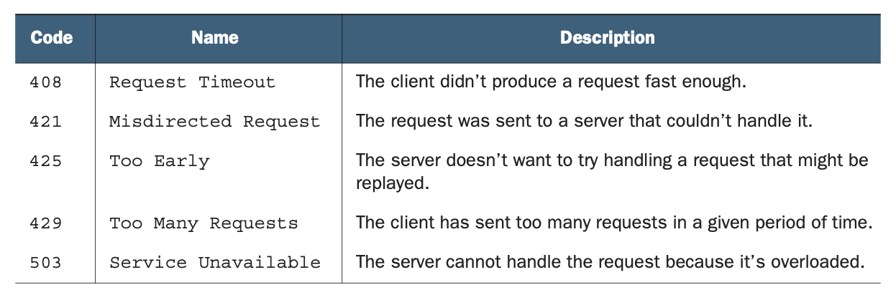
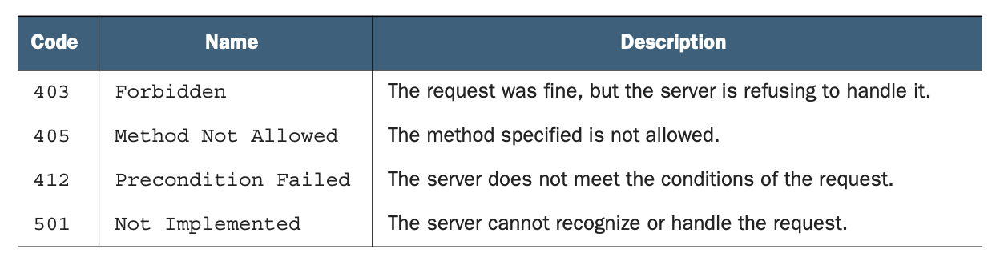
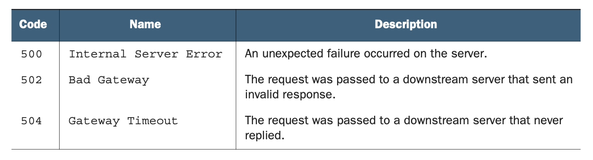

# 第 29 章 请求重试

<div style="background:#f7f5e6; padding:24px; border-radius:4px; color:#405a73;">

**本章内容**
- 如何判断哪些失败的 API 请求可以安全重试
- 用于重试计时的先进指数退避策略
- 如何避免踩踏效应
- API 为客户端指定重试时机的方式
</div><br/>

当 Web API 中发生错误时，有些是由于客户端错误，而另一些则是由于客户端无法控制的问题。
对于第二类错误，通常最好的解决方案是在稍后重试相同的请求，以期获得不同的结果。
<ins>在这种模式中，我们将探讨一种机制，通过它客户端可以在如何以及何时重试先前因 API 服务器错误而失败的请求方面获得明确的指导。</ins>

<a id="motivation"></a>
## 29.1 动机

Web API 中有些请求会失败是不可避免的事实 —— 希望不是大多数，但仍有一些。
这些失败的请求中有许多是由于客户端错误，例如无效的请求消息，而另一些可能是由于在 API 服务器上强制执行的先决条件和约束失败。
所有这些类型的错误都有一个重要的共同属性：问题出在请求本身违反某些约束或违背 API 的业务逻辑。
换一种说法，如果我们再次重放同样的无效请求，我们应该得到相同的错误响应。
毕竟，业务逻辑通常不会从一个时刻到另一个时刻发生变化。

<ins>另一整类错误则完全不同。
有时请求会导致完全暂时性的错误响应。
这种类型的错误与请求本身完全无关，而是 API 内部某些问题的结果。</ins>
也许 API 服务器过载，无法处理传入的请求，或者系统或必要的子组件正在进行计划停机，在处理请求时不可用。
无论问题是什么，都有一种清晰明显的方式来解决它：重试请求。

<ins>关键在于，错误响应实际上并不是由所发出的特定请求引起的。
相反，响应是由于至多与请求勉强相关、更可能与请求毫无关系的事情引起的。
这意味着如果我们只是在未来某个时候简单地再次尝试同一个请求，重试很有可能成功（或者至少导致不同的错误）。</ins>

那么大的问题就变成了我们究竟如何确定应该重试的请求和不应该重试的请求之间的区别。
一般来说，HTTP 错误用编号来传达出了什么问题，某些错误比其他错误更可能可重试。
例如，400 级错误（例如 400 Bad Request、403 Forbidden、404 Not Found 等）很可能是特定请求的问题，而 500 级错误（例如 500 Internal Server Error 或 503 Service Unavailable）更可能代表内部服务的问题。
<ins>在这两个类别中，500 级错误更可能可重试，但这更多是一种指导方针而非实际规则，所以这当然需要更多讨论。
此外，虽然这些错误代码可能暗示请求是否可以重试，但它们实际上并没有说明客户端应该何时重试失败的请求，让客户端猜测在再次尝试同一请求之前应该等待多长时间。</ins>

在这种模式中，我们将探讨 API 服务如何定义重试策略，既用于确定哪些请求有资格被重试，也用于确定在重试之前等待多长时间的计时算法。
我们还将介绍在 API 服务知道一些额外信息的情况下，它如何告知客户端究竟何时重试。

<a id="overview"></a>
## 29.2 概述

<ins>这种模式的目标很简单：尽可能多地响应请求，同时尽可能少地重试。</ins>
为了实现这一点，我们需要解决两个问题。
<ins>首先，我们必须为客户端提供一个要遵循的算法，以最小化整个系统中被重试的请求数量。
其次，如果 API 服务知道一些客户端不知道的信息，并且这些信息会导致一个可以成功重试请求的特定时间，
那么服务应该有一种机制向客户端提供关于何时重试请求的明确指示。</ins>
让我们先看看确定重试请求之间时间延迟的算法。

### 29.2.1 客户端重试计时

当我们遇到可重试的失败时，我们几乎肯定应该尝试再次发送相同的请求，希望服务已经变得可用。
但我们应该立即这样做吗？还是应该等一会儿？
如果应该等待，那么应该等多久？

事实证明，这是一个非常古老的问题，可以追溯到互联网的早期，当时我们需要一种算法来知道何时应该重试通过可能拥塞的网络发送 TCP 数据包。
这特别棘手，因为一旦请求被发送出去，我们就不知道发生了什么，只能简单地猜测请求何时更有可能在另一端被成功处理。
基于这些约束，针对这个问题最有效、经过实战检验的算法是指数退避 (exponential back-off)。

指数退避的想法非常简单。
对于第一次重试尝试，我们可能等待一秒钟再发出请求。
之后，对于每一个后续的失败响应，我们将之前等待的时间加倍。
如果请求第二次失败，我们等待两秒钟然后再次尝试。
如果那个请求失败，我们等待四秒钟再试一次。
这将持续加倍（8、16、32 秒），直到时间尽头或直到我们决定放弃。
我们将为这个算法引入一些额外的部分，但核心概念将保持不变。

正如我们所指出的，当另一端的系统是一个完全的黑盒子时，这个算法很棒。
换句话说，如果我们对系统一无所知，指数退避效果相当好。
但我们的 Web API 是这种情况吗？
事实上，并非如此，正如我们将在下一节中看到的，对于一类独特的场景，实际上有一个更好的解决方案。

### 29.2.2 服务器指定的重试时机

虽然指数退避仍然是一个合理的算法，但事实证明，在某些情况下有更好的选择可用。
例如，考虑这样一种场景：请求失败是因为 API 服务说该请求每分钟只能执行一次。
在这种情况下，服务器实际上确切知道在重试请求之前应该等待多长时间（在这种情况下，大约 60 秒）。

一般来说，每当服务器能够提供关于何时应该重试请求的权威指导时，这些信息都应该传达回客户端。
毕竟，即使是有部分依据的猜测也比盲目猜测要好。
虽然这些类型的场景并不常见，但它们肯定不算罕见，不能完全忽视。

我们将依赖一个专门为解决这种场景而设计的参数。
这个参数在存在时，指示客户端忽略它们通常会使用的指数退避算法，而完全基于所提供的值来确定何时重试。
通过这样做，我们可以在大多数情况下用稍微更有依据的猜测来覆盖盲目猜测，在罕见情况下则用绝对的确定性来覆盖。

<a id="implementation"></a>
## 29.3 实现

正如我们在上一节中学到的，这种模式将在大多数情况下依赖指数退避，在服务器可以指示客户端在重试请求之前确切等待多长时间的某些情况下依赖一个特殊字段。
然而，在我们深入这些话题的细节之前，有一个显而易见的问题需要讨论。我们如何确定给定请求是否应该被重试？

<a id="retry-eligibility"></a>
### 29.3.1 重试资格

可能很容易假设所有错误都有资格被重试，但遗憾的是这是一个危险的假设。
最大的担忧是这可能导致一些意想不到的后果，例如重复结果（例如，创建相同的资源两次）。
我们如何知道哪些类型的请求可以重试，哪些不能？

一般来说，有三类错误响应：那些绝对不能重试的，那些可能可以重试但应仔细审视的，以及那些可能可以毫无问题地重试的。
此外，重试的能力还取决于 API 方法本身，特别是它是否幂等和安全。
在本节中，我们将看看这些类别并总结落入每一类的 HTTP 错误代码。

#### 通常可重试

遗憾的是，被认为可能可重试的错误代码列表相对较短，总结在表 29.1 中。

*表 29.1 通常可重试的响应代码示例* <br/>
<br/>

在代码 408、421、425、429 和 503 的情况下，服务器实际上甚至从未开始处理这些请求。
我们可以得出的结论是，重试收到这些错误响应的请求几乎肯定是可接受的。

#### 绝对不可重试

一般来说，如果服务器接收并处理了请求，但确定请求在某种根本方式上是无效的，那么它通常是不可重试的。
例如，如果我们尝试检索资源并得到 403 Forbidden 错误，除非 API 中其他东西发生变化（例如权限被调整），否则重试请求不会导致不同的结果。
这些类型的错误（其中一些显示在表 29.2 中）很容易识别，因为它们要么是关于请求本身的错误，要么是声明违反内在规则的服务器错误。

*表 29.2 绝对不可重试的响应代码示例* <br/
<br/>

一般来说，所有这些响应代码都指示了情况的某种永久性，以至于将来重试请求不会导致不同的响应。
（显然，这假设系统中没有其他东西发生变化。）

#### 可能可重试

最棘手的类别是那些重试请求可能可接受的错误代码集合，但这将取决于关于请求和 API 方法的更多细节。
例如，504 Gateway Timeout 错误指示 API 请求被传递到下游服务器，而该服务器从未回复。
因此，我们不能确定下游服务器是否实际收到并开始处理该请求。
基于这种不确定性，我们只有在确定重复尝试不会导致任何问题时才能重试请求。
落入这一类的请求示例显示在表 29.3 中。

*表 29.3 可能可重试的响应代码示例* <br/>
<br/>

像往常一样，确保我们确实可以重试请求的最佳机制是依赖请求标识符，作为允许服务器去重请求并避免不良行为的一种方式，如 [第 26 章](ch26.md) 所讨论的。

现在我们已经了解了各种请求以及它们是否可重试（以及在什么情况下），让我们转换话题，开始看看我们已决定可以重试请求的情况。
特别是，让我们看看我们如何决定在重试请求之前等待多长时间。

### 29.3.2 指数退避

正如我们之前学到的，指数退避是一种算法，请求之间的延迟呈指数增长，每次请求返回错误结果时延迟翻倍。
也许理解这一点的最好方式是看一些代码。

*清单 29.1 演示使用指数退避进行重试的示例*

```typescript
async function getChatRoomWithRetries(id: string): Promise<ChatRoom> {
  return new Promise<ChatRoom>(async (resolve, reject) => {
    // 我们将初始延迟定义为1秒（1000毫秒）
    let delayMs = 1000;
    while (true) {
      try {
        // 首先，尝试获取资源并resolve该Promise
        return resolve(GetChatRoom({ id }));
      } catch (e) {
        // 如果请求失败，等待一段由delay定义的固定时长
        await new Promise((resolve) => {
          return setTimeout(resolve, delayMs);
        });
        // 最后，将下一次需要等待的时间翻倍
        delayMs *= 2;
      }
    }
  });
}
```

虽然这个实现是一个好的起点，但它可以做一些改进。
让我们从看看一些最大值开始。

#### 最大延迟和重试次数

正如我们之前所指出的，指数退避通常会继续重试请求，直到时间尽头或请求成功。
即使我们可能欣赏这种算法的持久性，这通常也不是一个好策略，因为它意味着请求完成可能需要多长时间没有界限。

为了解决这个问题，我们可以添加一些限制。
首先，我们可以添加我们希望尝试的重试次数限制。
然后我们可以添加请求重试之间等待的最长时间限制。

*清单 29.2 添加对最大延迟和重试次数的支持*

```typescript
async function getChatRoomWithRetries(
  id: string, maxDelayMs = 32000, maxRetries = 10): Promise<ChatRoom> {
  return new Promise<ChatRoom>(async (resolve, reject) => {
     // 我们通过递增该值来记录重试次数（循环迭代次数），如果超过允许的最大值则拒绝Promise
    let retryCount = 0;
    let delayMs = 1000;
    while (true) {
      try {
        return resolve(GetChatRoom({ id }));
      } catch (e) {
        // 我们通过递增该值来记录重试次数（循环迭代次数），如果超过允许的最大值则拒绝Promise
        if (retryCount++ > maxRetries) return reject(e);
        await new Promise((resolve) => {
          return setTimeout(resolve, delayMs);
        });
        delayMs *= 2;
        // 如果新的延迟时长超过最大值，就将它设置为最大值
        if (delayMs > maxDelayMs) delayMs = maxDelayMs;
      }
    }
  });
}
```

有了这些新的限制，我们就有了一种方式来确保函数最终会失败，实际上是在说：“我们试了又试，但无法获得成功的响应。”
现在这个问题已经解决了，还有一个话题需要讨论：惊群效应 (stampeding herds)。

#### 惊群效应

踩踏效应并非指真正的动物在平原上奔跑。
在技术领域，踩踏效应指的是大量远程客户端同时发出相同的请求，使接收端的系统过载的情况。
简而言之，系统可能能够单独处理每个请求，但肯定不能同时处理所有请求，因为巨大的并发量压垮了系统。
但这与指数退避有什么关系呢？

为了理解这种联系，让我们考虑我们可能有 100 个不同的客户端同时发送请求的情况 —— 可以说是踩踏效应。
当这些客户端中的每一个看到它们的请求返回错误时，它们会立即开始重试，希望后续请求会成功。
然而，问题是它们都会按照相同的指数退避算法这样做。
结果是这 100 个请求中的每一个都将继续在同一时间到达服务器，只是在每次踩踏之间有更大的间隔。
换句话说，因为客户端碰巧落入了意外同步的情况，请求不断相互阻碍，以至于没有一个成功。
从某种意义上说，算法的确定性导致了它的失败。

我们能对此做些什么呢？
一个简单的解决方案是引入一些因客户端而异的东西，而不是完美地遵循指数退避算法。
为此，我们将依赖请求之间延迟时间中随机抖动的概念。
<ins>换句话说，我们所要做的就是在指数退避算法规定的时间延迟之外添加一些随机的等待时间。</ins>

*清单 29.3 添加抖动以避免请求踩踏效应*

```typescript
async function getChatRoomWithRetries(
  id: string, maxDelayMs = 32000, maxRetries = 10): Promise<ChatRoom> {
  return new Promise<ChatRoom>(async (resolve, reject) => {
    let retryCount = 0;
    let delayMs = 1000;
    while (true) {
      try {
        return resolve(GetChatRoom({ id }));
      } catch (e) {
        if (retryCount++ > maxRetries) return reject(e);
        await new Promise((resolve) => {
          return setTimeout(resolve,
            delayMs + (Math.random() * 1000)); // 增加最多1000毫秒的抖动，避免惊群效应
        });
        delayMs *= 2;
        if (delayMs > maxDelayMs) delayMs = maxDelayMs;
      }
    }
  });
}
```

请注意，这里引入的随机抖动不是叠加的。
换句话说，它不包含在由退避算法持续加倍计算的延迟中。

现在我们已经深入了解了指数退避算法的工作原理，让我们换个话题，考虑 API 服务器可能知道客户端应该等待多长时间的场景。

### 29.3.3 稍后重试

指数退避（带有 [第 29.3.1 节](#retry-eligibility) 中的增强）是确定何时重试给定请求的绝佳选择，但我们对这种算法的偏好通常是基于这样一个假设：
我们基本上没有额外信息可以帮助我们做出更明智的决策。
然而，在某些情况下，我们知道并非如此。
最常见的例子是由于速率限制导致的错误，此时客户端发送请求过于频繁，而我们控制着下一次请求何时被允许。
换句话说，由于 API 服务器确切知道这个服务施加的限制何时重置，它也处于一个独特的位置，可以准确说明请求应在何时重试，从而不再违反速率限制规则。

指示客户端跳过指数退避例程而只是按照指示行事的最佳方式是什么？
事实证明，有一个专门针对这个主题的互联网工程任务组（IETF）标准，在 HTTP 的语义和内容规范中：RFC-7231（ https://tools.ietf.org/html/rfc7231 ）。
这个 RFC 指定了一个 “Retry-After” HTTP 头（第 7.1.3 节），它指示客户端 “在发出后续请求之前应该等待多长时间”。
<ins>简而言之，这个 HTTP 头是 API 服务器发送关于何时应重试请求的更具体指令的完美位置。</ins>

这引出了下一个问题：我们如何在这个 HTTP 头中格式化我们的延迟指令？

#### 格式

规范明确指出 Retry-After 头可以包含日期值（例如 Fri, 31 Dec 1999 23:59:59 GMT）或重试前延迟等待的持续时间（例如 120）。
<ins>尽管规范（以及大多数现代 HTTP 服务器）将支持两种格式，但几乎总是更好的选择是依赖持续时间而不是时间戳。</ins>

原因是时间是一件棘手的事情。
如果我们依赖持续时间，它由服务器生成，然后通过网络发送回客户端。
这意味着客户端最终等待的总持续时间略长于指定的持续时间。
例如，如果服务器在 Retry-After 头中放入值 120，并且响应从服务器传回客户端需要 100 毫秒，那么客户端实际上最终会延迟 120.1 秒。

将其与涉及时钟同步的更可怕的场景进行比较。
如果服务器告知客户端一个特定的重试时间，这假设服务器和客户端都对当前时间达成一致。
这不仅遭受持续时间（120）中存在的相同类型的传输延迟，而且如果客户端的时钟碰巧与服务器的时钟不同步，还可能导致更大的时间差异。
例如，如果服务器认为是中午而客户端认为是下午 1:00，当服务器说 “在下午 1:00 之前不要重试” 时，客户端实际上会立即重试，而不是服务器意图的 60 分钟延迟。

虽然所有这些可能看起来有点牵强，但多年来时钟一直是许多系统失败的根源。
由于闰秒、时区复杂性和时钟同步问题，假设两个系统的时钟彼此一致很少是一个好主意（更糟糕的是依赖这一事实来实现正确的行为）。
<ins>如果可能的话，最安全的做法是始终依赖持续时间而不是特定的时间值。</ins>

现在我们已经阐明了 Retry-After 头中应该放什么值，我们可以看到我们能够多么容易地实现对此的支持。

*清单 29.4 添加对指定的重试延迟持续时间的支持*

```typescript
async function getChatRoomWithRetries(
  id: string, maxDelayMs = 32000, maxRetries = 10): Promise<ChatRoom> {
  return new Promise<ChatRoom>(async (resolve, reject) => {
    let retryCount = 0;
    let delayMs = 1000;
    while (true) {
      try {
        return resolve(GetChatRoom({ id }));
      } catch (e) {
        if (retryCount++ > maxRetries) return reject(e);
        await new Promise((resolve) => {
          let actualDelayMs;
          if ('Retry-After' in e.response.headers) {
            // 如果提供了 Retry-After 值，则使用该值作为延迟时长
            actualDelayMs = Number(
              e.response.headers['Retry-After']) * 1000;
          } else {
            // 否则，回退到标准的指数退避算法
            actualDelayMs = delayMs + (Math.random() * 1000);
          }
          return setTimeout(resolve, actualDelayMs);
        });
        delayMs *= 2;
        if (delayMs > maxDelayMs) delayMs = maxDelayMs;
      }
    }
  });
}
```

### 29.3.4 最终 API 定义

综合所有内容，清单 29.5 展示了一个示例，演示客户端理想情况下应如何检索资源，包括使用指数退避和速率限制感知的重试。

*清单 29.5 最终 API 定义*

```typescript
async function getChatRoomWithRetries(
  id: string, maxDelayMs = 32000, maxRetries = 10): Promise<ChatRoom> {
  return new Promise<ChatRoom>(async (resolve, reject) => {
    let retryCount = 0;
    let delayMs = 1000;
    while (true) {
      try {
        return resolve(GetChatRoom({ id }));
      } catch (e) {
        if (retryCount++ > maxRetries) return reject(e);
        await new Promise((resolve) => {
          let actualDelayMs;
          if ('Retry-After' in e.response.headers) {
            actualDelayMs = Number(
              e.response.headers['Retry-After']) * 1000;
          } else {
            actualDelayMs = delayMs + (Math.random() * 1000);
          }
          return setTimeout(resolve, actualDelayMs);
        });
        delayMs *= 2;
        if (delayMs > maxDelayMs) delayMs = maxDelayMs;
      }
    }
  });
}
```

<a id="trade-offs"></a>
## 29.4 权衡

这种设计模式不幸的地方在于它依赖客户端按照指示行事。
这可能是遵循使用指数退避的指示，或者在确切时间之后重试的指示，但要点仍然是决定最终留给客户端，而我们无法控制客户端。

这种模式的好处是，依赖它我们实际上没有放弃任何东西。
指数退避是一种常见的标准，已经使用了多年，在世界各地取得了巨大成功。
我们只在服务器有一些特殊信息时才指定特定的重试时间，因此如果指示被遵循，可以导致更少的重试请求。换句话说，这种模式通常没有缺点。

<a id="exercises"></a>
## 29.5 练习

1. 为什么没有一个简单的规则来决定哪些失败的请求可以安全地重试？

2. 依赖指数退避的根本原因是什么？重试之间随机抖动的目的是什么？

3. 什么时候使用 Retry-After 头是有意义的？

<a id="summary"></a>
## 本章小节

- 在某种程度上是暂时性或与时间相关的错误（例如，HTTP 429 Too Many Requests）很可能可重试，
而那些与某种永久状态相关的错误（例如，HTTP 403 Forbidden）大多不安全重试。

- 每当代码自动重试请求时，它应依赖某种形式的指数退避，并对重试次数和请求之间的延迟设置限制。
理想情况下，它还应引入一些抖动，以避免惊群效应问题，即所有请求都按照相同的规则重试，因此总是在同一时间到达。

- 如果 API 服务知道关于请求重试何时可能成功的某些信息，它应使用 Retry-After HTTP 头来指示这一点。
