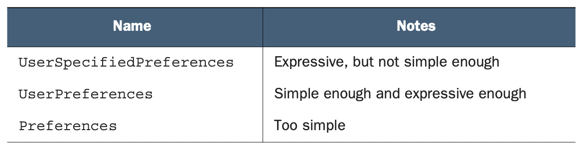

# 第 3 章 命名

<div style="background:#f7f5e6; padding:24px; border-radius:4px; color:#405a73;">

**本章内容**
- 我们为何要在意命名
- 什么因素使某些名称优于其他名称
- 如何在语言、语法和句法方面做出选择
- 上下文如何影响名称的含义
- 一个关于糟糕命名可能导致什么后果的案例研究

</div><br/>

无论我们喜欢与否，名称无处不在。
在我们构建的每一个软件系统中，在我们设计或使用的每一个 API 中，每个角落都隐藏着名称，它们的寿命将远超我们的预期。
因此，显然我们应该重视起好名字（即使我们并不总是给予命名选择足够的思考）。
在本章中，我们将探讨 API 中需要命名的不同组成部分，一些可以用来选择好名称的策略，区分好名称与坏名称的高层属性，
最后是一些通用原则，以帮助我们在面临不可避免的艰难命名决策时做出选择。

<a id="why"></a>
## 3.1 为什么命名很重要？

在软件工程领域，通常我们几乎无法避免为事物选择名称。
如果真能避免，我们就需要能够只使用语言关键字（例如 class、for 或 if）来编写代码块，而这充其量只会导致代码完全不可读。
考虑到这一点，编译型软件是一个特例。
这是因为对于传统的编译代码，函数和变量的名称只对有权访问源代码的人重要，因为名称本身在编译（或压缩）和部署过程中通常会被消除。

另一方面，在设计构建 API 时，我们选择的名称则重要得多，因为它们是所有 API 使用者将会看到并与之交互的内容。
换句话说，这些名称不会简单地被编译掉并从世界中隐藏起来。
这意味着我们需要在 API 的命名上投入大量的思考和考量。

这里自然会产生一个问题：“如果名字起得不好，难道我们不能直接更改它们吗？”
正如我们将在 [第 24 章](ch24.md) 中学到的，在 API 中更改名称可能相当困难。
想象一下，更改源代码中一个常用函数的名称，然后意识到你需要进行一次大规模的查找替换，以确保更新了所有对该函数名的引用。
虽然这很不方便（甚至在某些 IDE 中很容易做到），但确实是可行的。
然而，试想如果这份源代码是公开的，供他人构建到他们自己的项目中呢？
即使你能以某种方式更新所有公开可用的源代码中的所有引用，但总会有你无法访问的私有源代码，因此你也不可能更新到它们。

换一种说法，更改 API 中面向公众的名称有点像更改你的地址或电话号码。
要想成功地到处更新这个号码，你必须联系所有曾经拥有你电话号码的人，包括你的祖母（她可能使用纸质通讯录）以及所有曾经获得过该号码的营销公司。
即使你有办法联系到每个拥有你号码的人，你仍然需要他们去实际执行更新联系信息的操作，而他们可能太忙而没有时间去做。

既然我们已经看到了选择好名称（以及避免更改它们）的重要性，这就引出了一个重要的问题：什么才算是 “好” 名称？

<a id="what"></a>
## 3.2 什么才算是 “好” 名称？

正如我们在 [第 1 章](ch1.md) 中所学，API 在具备可操作性、表达性、简洁性和可预测性时才是 “好” 的。
而名称则非常类似，只是它们不一定具备可操作性（换句话说，名称本身并不实际执行任何操作）。
让我们来看看这一部分属性以及一些命名选择的示例，首先从表现力开始。

### 3.2.1 表达性

最重要的是，一个名称必须清晰地传达它所命名的事物，这一点至关重要。
这个事物可能是一个函数或 RPC（例如 CreateAccount）、一个资源或消息（例如 WeatherReading）、一个字段或属性（例如 postal_address），或者完全是其他东西，比如一个枚举值（例如 Color . BLUE），但读者应该能清楚理解该名称所代表的内容。
<ins>这听起来可能很简单，但以全新的视角看待一个名称，并忘记我们因长期在特定领域工作而积累的所有上下文，往往非常困难。
这种上下文通常是一笔巨大的财富，但在这种情况下，它更多的是一种负担：它让我们不擅长命名。</ins>

例如，术语 topic 通常用于异步消息传递的上下文中（例如 Apache Kafka 或 RabbitMQ）；
然而，它也被用于机器学习和自然语言处理中的一个特定领域，称为主题建模。
如果你在你的机器学习 API 中使用术语 topic，那么用户可能会对你所指的 topic 类型感到困惑，这一点也不奇怪。
如果这确实可能发生（也许你的 API 同时使用了异步消息传递和主题建模），你可能需要选择一个比 topic 更具表现力的名称，例如 model_topic 或 messaging_topic，以避免用户混淆。

### 3.2.2 简洁性

虽然表现力强的名称固然重要，但如果名称过长而没有增加额外的清晰度，也可能变得冗长累赘。
以之前的例子（topic，指代计算机科学中多个不同领域）来说，如果一个 API 只涉及异步消息传递（例如类似 Apache Kafka 的 API），且与机器学习毫无关系，那么 topic 就已经足够清晰和简洁，而 messaging_topic 则不会增加太多价值。
<ins>简而言之，名称应该具有表现力，但前提是名称的每个附加部分都能增加价值，以证明其存在的合理性。</ins>

另一方面，名称也不应过于简化。
例如，假设我们有一个 API 需要存储一些用户指定的偏好设置。
这个资源可能被命名为 UserSpecifiedPreferences；然而，Specified 并没有为名称增加太多信息。
另一方面，如果我们简单地将其命名为 Preferences，则不清楚这些偏好属于谁，日后当需要存储和管理系统级或管理员级偏好时，可能会引起混淆。
在这种情况下，UserPreferences 似乎是表现力与简洁性之间的最佳平衡点，如表 3.1 所总结。

*表 3.1 在简洁性与表现力之间做出选择* <br/>
<br/>

<a id="predictable"></a>
### 3.2.3 可预测性

在权衡了表现力与简洁性之后，选择好名称还有一个最终且非常重要的方面：可预测性。
想象一个 API，它使用名称 topic 来将相似的异步消息分组（类似于 Apache Kafka）。
然后再想象这个 API 在其他地方使用了名称 messaging_topic，而选择其中任何一个都没有充分的理由。
这会导致一些相当令人沮丧和不寻常的情况。

*清单 3.1 因命名不一致而导致令人沮丧的代码示例*

```typescript
function handleMessage(message: Message) {
    // 此处使用 topic 名称读取给定消息的主题
    if (message.topic === "budget.purge") {
        client.PurgeTopic({
            // 此处使用 messagingTopic 名称来表达同一概念
            messagingTopic: "budget.update"
        });
    }
}
```

如果这种情况看起来并不令人沮丧，那么请考虑我们在此违反的一个重要原则。
一般来说，我们应该使用相同的名称来表示相同的事物，使用不同的名称来表示不同的事物。
如果我们把这一原则视为公理，那么这就引出了一个重要的问题：topic 和 messaging_topic 有何不同？
毕竟，我们使用了不同的名称，那么它们一定代表不同的概念，对吧？

<ins>其基本的核心目标是让 API 的使用者能够先学会一个名称，然后在此基础上继续构建知识，
从而能够预测未来的名称（例如，如果它们代表相同的概念）会是什么样子。</ins>
当我们在 API 中一致地使用 topic 来表示 “给定消息的主题”（而在表示其他含义时使用其他名称）时，
我们就是在允许 API 的使用者基于他们已经学到的知识进行扩展，
而不是让他们感到困惑，迫使他们去研究每一个名称以确保其含义符合他们的预期。

现在我们已经了解了好名称的一些特征，接下来让我们探讨一些通用准则，它们可以在 API 命名时起到指导作用，
首先从语言、语法和句法等基本方面开始。

<a id="language-grammar-syntax"></a>
## 3.3 语言、语法和句法

虽然代码归根结底是由 0 和 1 组成，以数字形式存储，但命名主要是一种主观的构造，我们通过语言来表达。
与编程语言不同 ——编程语言对于什么是有效的、什么是无效的有非常严格的规定—— 语言是为了服务人类而非计算机而演进的，因此其规则要宽松得多。
这使得我们的命名选择可以更加灵活和模糊，这既可能是好事，也可能是坏事。

一方面，模糊性允许我们对事物进行足够通用的命名，以支持未来的工作。
例如，将字段命名为 image_uri 而不是 jpeg_uri，可以避免我们将自己限制在单一图像格式（JPEG）上。
另一方面，当有多种方式可以表达同一事物时，我们往往会交替使用它们，
这最终会使我们的命名选择变得不可预测（参见 [第 3.2.3 节](#predictable) ），并导致 API 令人沮丧且难以使用。
<ins>为了避免这种情况，尽管 “语言” 具有相当大的灵活性，
但通过我们自己施加一些规则，我们可以避免失去我们在优秀 API 中如此看重的可预测性。</ins>
在本节中，我们将探讨一些与语言相关的简单规则，这些规则有助于减少我们在命名时不得不做出的随意选择。

### 3.3.1 语言

尽管世界上有许多种语言，但如果我们必须选择一种在软件工程中使用最广泛的语言，目前美式英语是主要的候选者。
这并不是说美式英语比其他语言更好或更差；
然而，如果我们的目标是实现全球最大程度的互操作性，使用美式英语以外的任何语言都更可能是一种障碍，而非优势。

这意味着应该使用英语语言概念（例如 BookStore，而不是 Librería），
并且通常应优先采用常见的美式拼写（例如 color，而不是 colour）。
这还有一个额外的好处，即几乎总能很好地适配 ASCII 字符集，只有少数例外情况是美式英语从其他语言借用的词（例如 café）。

这并不意味着 API 注释必须使用美式英语。
如果 API 的受众完全位于法国，那么用法语提供文档（可能由 API 规范注释自动生成，也可能不是）可能是合理的。
然而，使用该 API 的软件工程师团队很可能还会使用其他 API，而这些 API 不太可能专门面向法国的客户。
因此，即使 API 的受众不使用美式英语作为他们的主要语言，
API 本身仍然应该依赖美式英语，作为所有同时使用许多不同 API 的各方之间的共享通用语言。

### 3.3.2 语法

鉴于 API 将使用美式英语作为标准语言，这就会引发不少复杂的问题，因为英语并不是最简单的语言，它有许多不同的时态和语气。
幸运的是，发音不会成为问题，因为源代码是书面语言而非口语，但这并不一定能消除所有潜在的问题。

本节不打算详尽规定美式英语语法在 API 命名中的每一个方面，而是会涉及一些最常见的问题。
让我们从动作（例如 RPC 方法或 RESTful 动词）开始。

#### 命令式动作

在任何 API 中，都会有类似于编程语言中 “函数” 的东西，它们执行 API 所期望的实际工作。
如果这是一个纯粹 RESTful 的 API，它仅依赖于一组特定的预设动作（Get、Create、Delete 等），那么你在命名方面需要做的工作就不多，因为所有动作都采用 `<标准动词><名词>` 的形式（例如 CreateBook）。
对于允许非标准动词的非 RESTful 或面向资源的 API，我们在命名这些动作时则有更多的选择。

<ins>REST 标准动词有一个重要的共同点：它们都使用命令式语气。</ins>
换句话说，它们都是动词的命令或指令。
如果这不太容易理解，想象一下军队里的训练教官对你大喊大叫，要求你做某事：“Create that book!” “Delete that weather reading!” “Archive that log entry!” 尽管这些命令对于军队来说有些可笑，但你完全清楚自己该做什么。

<ins>另一方面，有时我们编写的函数名称可能会采用陈述式语气。</ins>
一个常见的例子是当函数用于检查某事物时，例如 C# 中的 String.IsNullOrEmpty()。
在这种情况下，动词 “to be” 采用了陈述式语气（对资源提出问题），而不是命令式语气（命令服务执行某操作）。

<ins>虽然我们的函数采用这种语气从根本上说没有错，但在 Web API 中使用时，会留下几个重要的疑问。
首先，对于看起来可能无需请求远程服务就能处理的操作：“isValid() 实际上会产生远程调用，还是在本地处理？”</ins>
虽然我们希望用户假定所有方法调用都会通过网络进行，但让一个看似无状态的调用这样做，会有些误导性。

<ins>其次，响应应该是什么样的？</ins>
以名为 isValid() 的 RPC 为例。
它应该返回一个简单的布尔字段，说明输入是否有效吗？
如果输入无效，它应该返回一个错误列表吗？
另一方面，GetValidationErrors() 则更加清晰：如果输入完全有效，它返回一个空列表；
如果无效，则返回一个错误列表。
关于响应将采用什么形式，不会产生真正的混淆。

#### 介词

命名时另一个容易产生混淆的方面是介词，例如 “with”、“to” 或 “for”。
虽然这些词在日常对话中非常有用，但在 Web API 的上下文中使用，尤其是在资源名称中，它们可能暗示着 API 存在更复杂的潜在问题。

例如，一个图书馆 API 可能提供一种列出 Book 资源的方式。
如果这个 API 需要一种列出 Book 资源并同时包含该书对应的 Author 资源的方法，那么可能会倾向于为这种组合创建一个新的资源：BookWithAuthor（然后通过调用 ListBooksWithAuthors 或类似方法来列出）。
乍一看这似乎没问题，但当我们需要列出嵌入 Publisher 资源的 Book 资源时呢？
或者同时嵌入 Author 和 Publisher 资源呢？
在我们意识到之前，根据我们想要的不同相关资源，我们可能已经有了 30 个不同的 RPC 需要调用。

<ins>在这种情况下，我们想在名称中使用的介词（“with”）暗示了一个更根本的问题：我们想要一种列出资源并在响应中包含不同属性的方法。</ins>
我们或许可以通过使用字段掩码或视图（参见 [第 8 章](ch8.md) ）来解决这个问题，同时避免使用这个命名奇怪的资源。
在这个例子中，介词暗示了某些地方可能不太对劲。
<ins>因此，即使介词或许不应该被完全禁止（例如，某个字段可能被命名为 bits_per_second），
但这些棘手的小词有点像代码中的坏味道，提示某些地方可能存在问题，值得进一步调查。</ins>

#### 复数形式

<ins>大多数情况下，我们会为 API 中的事物选择单数形式的名称，例如 Book、Publisher 和 Author（而不是 Books、Publishers 或 Authors）。</ins>
此外，这些名称选择在 API 中往往会具有新的含义和用途。
例如，一个 Book 资源可能会在某个地方被一个名为 Author . favoriteBook 的字段引用（参见 [第 13 章](ch13.md) ）。
然而，当我们需要谈论这些资源的复数形式时，事情有时会变得混乱。
更复杂的是，如果 API 使用 RESTful URL，则一组资源的集合名称几乎总是使用复数形式。
例如，当我们请求单个 Book 资源时，URL 中的集合名称几乎肯定会是类似 /books/1234 的形式。

对于我们用作示例的名称（例如 Book），这不算什么问题；
毕竟，提到多个 Book 资源只需添加一个 “s” 将其复数化为 Books。
然而，有些名称并没有这么简单。
例如，假设我们正在为足病医生的诊所（足科医生）设计一个 API。
当我们有一个 Foot 资源时，我们就需要打破这种仅添加 “s” 的模式，从而得到一个 feet 集合。

这个例子确实打破了常规模式，但至少它是清晰且明确的。
<ins>如果我们的 API 涉及人员，因此有一个 Person 资源呢？
集合是 persons 还是 people？
换句话说，Person (id=1234) 应该通过访问类似 /persons/1234 还是 /people/1234 的 URL 来获取？
幸运的是，我们关于使用美式英语的指南给出了答案：使用 people。</ins>

其他情况则更令人头疼。
例如，假设我们正在为水族馆设计一个 API。
Octopus 资源的集合应该是什么？
如您所见，我们对美式英语的选择有时反而会给我们带来麻烦。
但最重要的是，我们要选择一种模式并坚持下去，这通常涉及快速查找语法学家认为正确的说法（在这种情况下，“octopuses” 是完全没问题的）。
<ins>这也意味着，我们永远不应假设资源的复数形式可以通过简单地添加 “s” 来生成 —— 这是软件工程师在寻找规律时常见的诱惑。</ins>

### 3.3.3 句法

我们已经进入了命名中更具技术性的方面。
与我们之前探讨的各个方面一样，在句法方面也遵循相同的准则。
<ins>首先，选择一种方式并坚持使用。
其次，如果已有现有标准（例如美式英语拼写），则使用该标准。</ins>
那么这在实际中意味着什么呢？让我们从大小写开始。

#### 大小写

当我们定义 API 时，我们需要命名各种组件，例如资源、RPC 和字段。
对于这些不同的组件，我们倾向于使用不同的大小写形式，这有点像名称呈现的格式。
大多数情况下，这种呈现方式仅在多个单词如何组合成一个单一词法单元时才显现出来。
例如，如果我们有一个表示个人名字的字段，我们可能需要将该字段命名为 “first name”。
然而，在几乎所有的编程语言中，空格是词法分隔符，因此我们需要将 “first name” 组合成一个单元，
<ins>这就为许多不同的选项打开了大门，例如 “驼峰式”、“蛇形式” 或 “烤串式”。</ins>

在驼峰式中，单词通过将第一个单词之后的所有单词的首字母大写来连接，因此 “first name” 会呈现为 firstName（其中大写字母像骆驼的驼峰一样）。
在蛇形式中，单词使用下划线字符连接，如 first_name（这看起来有点像一条蛇）。
在烤串式中，单词使用连字符连接，如 first-name（这看起来有点像串起不同单词的烤串）。
根据用于表示 API 规范的语言不同，不同的组件会以不同的大小写形式呈现。
例如，在 Google 的 Protocol Buffer 语言中，标准是消息（如 TypeScript 接口）使用大驼峰式，如 UserSettings（注意大写的 “U”），而字段名使用蛇形式，如 first_name。
另一方面，在 Open API 规范标准中，字段名采用驼峰式，如 firstName。

<ins>如前所述，只要在整个 API 中一致地使用所选的大小写形式，具体选择哪种并不那么重要。</ins>
例如，如果你将 Protocol Buffer（https://developers.google.com/protocol-buffers）消息命名为 user_settings，那么很容易让人认为这实际上是一个字段名而不是消息名。
因此，这很可能会给任何使用该 API 的人带来困惑。
说到类型，让我们花点时间看看保留字。

#### 保留关键字

在大多数 API 定义语言中，都会有办法指定存储在特定属性中的数据类型。
例如，我们可能会写 firstName: string 来在 TypeScript 中表示名为 firstName 的字段包含一个原始字符串值。
这也意味着 string 这个术语具有某种特殊含义，即使它在代码中的其他位置被使用。
<ins>因此，在 API 中使用受限关键字作为名称可能很危险，应尽可能避免。</ins>

如果这看起来有些困难，那么花点时间思考字段或消息真正代表什么，而不是选择最简单的选项，是值得的。
例如，与其使用 “to” 和 “from”（from 是 Python 等语言中的特殊保留关键字），不如尝试使用更具体的术语，例如 “sender” 和 “recipient”（如果 API 涉及消息传递），或者 “payer” 和 “payee”（如果 API 涉及支付）。

考虑 API 的目标受众也很重要。
例如，如果 API 只会在 JavaScript 中使用（也许它被设计为仅在 Web 浏览器中使用），
那么其他语言（例如 Python 或 Ruby）中的关键字可能就不必担心。
<ins>话虽如此，如果工作量不大，避免使用其他语言中的关键字也是一个好主意。
毕竟，你永远不知道你的 API 最终会不会被其中某一种语言所使用。</ins>

现在我们已经讨论了这些技术方面的内容，让我们提升一个层次，谈谈 API 所处的上下文以及其运作方式如何影响我们选择的名称。

<a id="context"></a>
## 3.4 上下文

<ins>虽然名称本身有时可以传达所有必要的信息以发挥作用，但更多时候我们依赖名称所使用的上下文来辨别其含义和预期用途。</ins>
例如，当我们在 API 中使用术语 book 时，我们可能指的是存在于图书馆 API 中的一个资源；
然而，我们也可能指的是航班预订 API 中要执行的一个动作。
可想而知，相同的词语和术语根据其使用的上下文可能意味着完全不同的东西。
<ins>这意味着我们在为 API 选择名称时，需要牢记 API 所处的上下文。</ins>

重要的是要记住，这种影响是双向的。
一方面，上下文可以为原本可能缺乏具体含义的名称赋予额外的价值。
另一方面，当我们使用具有非常特定含义但在给定上下文中不太合理的名称时，上下文也可能将我们引入歧途。
例如，名称 “record” 在附近没有任何上下文的情况下可能不是很有用，但在音频录制 API 的上下文中，该术语吸收了从 API 总体上下文中赋予的额外含义。

简而言之，虽然对于在给定上下文中如何命名没有严格的规则，
<ins>但重要的是要记住，我们在 API 中选择的所有名称都与该 API 所提供的上下文有着密不可分的联系。
因此，在选择名称时，我们应该意识到该上下文及其可能赋予的含义（无论好坏）。</ins>

让我们稍微改变一下方向，谈谈数据类型和单位，特别是它们应如何融入我们所选择的名称中。

<a id="type-unit"></a>
## 3.5 数据类型和单位

<ins>虽然许多字段名称在没有单位的情况下也具有描述性（例如 firstName: string），
但另一些字段若没有单位则可能极其令人困惑。</ins>
例如，设想一个名为 “size” 的字段。
根据上下文的不同（参见 [第 3.4 节](#context)），该字段可能具有完全不同的含义，同时也可能使用完全不同的单位。
我们可以看到相同的字段（size）在不同上下文中可能具有截然不同且在许多情况下令人困惑的含义和单位。

*清单 3.2 使用 size 字段的音频片段和图像*

```typescript
interface AudioClip {
    // 此字段可能存放经过Base64编码的二进制音频内容
    content: string;
    // 该字段的单位含义模糊。它代表字节大小？音频的时长（秒）？还是图像的尺寸？或是其他含义？
    size: number;
}

interface Image {
    // 此字段可能存放经过Base64编码的二进制音频内容
    content: string;
    // 该字段的单位含义模糊。它代表字节大小？音频的时长（秒）？还是图像的尺寸？或是其他含义？
    size: number;
}
```

在这个例子中，size 字段可能表示多种含义，但这些不同的含义也会导致截然不同的单位（例如字节、秒、像素等）。
幸运的是，这种关系是双向的，这意味着如果单位出现在某处，含义就会变得更加清晰。
换句话说，sizeBytes 和 sizeMegapixels 比单纯的 size 要清晰和明确得多。

*清单 3.3 使用带有单位的更清晰的 size 字段的音频片段和图像*

```typescript
interface AudioClip {
    content: string;
    // 现在这些size字段的含义清晰很多，因为字段名已经指明了单位
    sizeBytes: number;
}

interface Image {
    content: string;
    // 现在这些size字段的含义清晰很多，因为字段名已经指明了单位
    sizeMegapixels: number;
}
```

这是否意味着我们应该在所有场景下都简单地将单位或格式包含在字段名称中？
毕竟，这肯定能最大限度地减少像上述情况中可能出现的任何混淆。
例如，假设我们想要将图像的像素尺寸以及以字节为单位的大小一起存储。
我们可能会有两个字段，分别称为 sizeBytes 和 dimensionsPixels。
但实际上，尺寸不仅仅是一个数字：我们同时需要长度和宽度。
一种选择是使用字符串字段，并以某种众所周知的格式来存储尺寸。

*清单 3.4 使用字符串字段存储以像素为单位的尺寸的图像*

```typescript
interface Image {
    content: string;
    sizeBytes: number;
    // 字段的格式通过字段自身的前置注释来表达。
    // 单位是明确的（像素），但基础数据类型可能会造成混淆。
    // 以像素为单位的尺寸。例如："1024x768"。
    dimensionsPixels: string;
}
```

虽然这种选择在技术上有效且确实清晰，
但它显示出一种对始终使用原始数据类型的执念，即使在某些情况下它们可能并不合理。
<ins>换句话说，正如有时在名称中包含单位会使名称更清晰易用一样，有时使用更丰富的数据类型也能使名称更加清晰。
在这种情况下，与其使用组合两个数字的字符串类型，我们可以使用一个 Dimensions 接口，该接口具有 length 和 width 数值，并将单位（像素）包含在字段名称中。</ins>

*清单 3.5 使用更丰富数据类型的图像尺寸*

```typescript
interface Image {
    content: string;
    sizeBytes: number;
    // 在这种情况下，dimensions字段名称不需要在名字中带上单位，更丰富的数据类型就已经表达了含义。
    dimensions: Dimensions;
}

interface Dimensions {
    // 字段的单位（像素）是明确的，无需任何特殊字符串格式。
    lengthPixels: number;
    widthPixels: number;
}
```

<a id="case"></a>
## 3.6 案例研究：当你选择糟糕的名称时会发生什么？

这些关于如何选择好名称以及在选择过程中值得考虑的各个方面的指南都很好，
但看一下几个使用不太恰当名称的真实案例或许是值得的。
此外，我们还可以看到这些命名选择的最终后果以及它们可能引发的潜在问题。
让我们首先来看一个命名问题，其中遗漏了一个微妙但重要的部分。

#### 微妙的含义

如果你走进一家 Krispy Kreme 甜甜圈店，要 10 个甜甜圈，你期望得到 10 个甜甜圈，对吧？
如果只得到 8 个，你会感到惊讶吗？
如果得到 8 个，你可能会认为店里一定完全没货了。
先得到 8 个甜甜圈，然后不得不要求再要 2 个才能达到你想要的 10 个，这显然是不对的。

但假如你只能请求最多 N 个甜甜圈呢？
换句话说，你只能问收银员 “我能要最多 10 个甜甜圈吗？”
你会得到任意数量的甜甜圈，但绝不会超过 10 个。
（请记住，这可能导致你得到零个甜甜圈！）突然之间，第一个甜甜圈店示例中的奇怪行为就说得通了。
虽然这仍然不方便（我还没有见过有这种点餐系统的甜甜圈店），但至少它不令人困惑和意外。

在 [第 21 章](ch21.md) 中，我们将学习一种设计模式，该模式演示了如何在列表标准方法操作中安全、清晰且可良好扩展地分页浏览大量资源。
事实证明，这种只能请求最大值（而不能请求确切数量）的能力，正是分页模式的工作原理（使用 maxPageSize 字段）。

Google 的团队（由于历史原因）遵循了所描述的分页模式，但有一个重要的不同之处：请求指定的不是 maxPageSize 来表示 “给我最多 N 个项目”，而是指定 pageSize。
这三个缺失的字符导致了极其大量的混淆，就像点甜甜圈的人一样：他们认为自己要求的是一个确切的数量，但实际上他们只能要求一个最大数量。

最常见的场景是，当某人请求 10 个项目，却收到 8 个时，
他会认为没有更多项目了（就像我们可能认为甜甜圈店卖完了一样）。
实际上，情况并非如此：我们收到 8 个并不代表店里没有甜甜圈了；这只是意味着他们需要去后面再找一些。
这最终会导致 API 用户错过大量项目，因为他们在列表真正结束之前就停止了分页浏览。

虽然这可能会令人沮丧并导致一些不便，但让我们看一个因混淆字段单位而造成的更严重的错误。

#### 单位

回到 1999 年，NASA 计划将火星气候轨道飞行器送入距火星表面约 140 英里的轨道。
他们进行了一系列计算，以确定施加多大的冲力才能将轨道飞行器送入正确位置，然后执行了机动操作。
不幸的是，在那之后不久，团队注意到轨道飞行器并不在它应该在的位置。
它非但没有在距表面 140 英里的高度，反而要低得多。
事实上，后来的计算似乎表明，轨道飞行器距表面仅不到 35 英里。
遗憾的是，轨道飞行器能够承受的最低高度是 50 英里。
正如你所料，低于这个下限意味着轨道飞行器很可能在火星大气层中解体。

在随后的调查中发现，洛克希德·马丁团队以美制单位（具体是 lbf-s，即磅力秒）提供输出，而 NASA 团队则以国际单位制（具体是 N-s，即牛顿秒）开展工作。
快速计算一下，1 lbf-s 相当于 4.45 N-s，这最终导致轨道飞行器获得了超过所需冲力四倍以上的推力，从而使其最终低于最低安全高度。

*清单 3.6 MCO 上用于计算的 API 示例（已极大简化）*

```typescript
abstract class MarsClimateOrbiter {
    CalculateImpulse(CalculateImpulseRequest): CalculateImpulseResponse;
    // CalculateImpulseRequest 与 CalculateManeuverResponse 接口为简洁起见已省略。
    CalculateManeuver(CalculateManeuverRequest): CalculateManeuverResponse;
}

interface CalculateImpulseResponse {
    // 此处已经计算出冲量，但没有携带单位！这意味着我们可以把上一步的输出直接作为下一步的输入。
    impulse: number;
}

interface CalculateManeuverRequest {
    // 此处已经计算出冲量，但没有携带单位！这意味着我们可以把上一步的输出直接作为下一步的输入。
    impulse: number;
}
```

另一方面，如果集成点在字段名称中包含了单位，那么该错误就会显而易见得多。

*清单 3.7 对示例接口进行修改以包含单位*

```typescript
interface CalculateImpulseResponse {
    // 此时可以明显看出，由于单位不同，不能直接将一个API方法的输出直接送入下一个方法。
    impulsePoundForceSeconds: number;
}

interface CalculateManeuverRequest {
    // 此时可以明显看出，由于单位不同，不能直接将一个API方法的输出直接送入下一个方法。
    impulseNewtonSeconds: number;
}
```

显然，火星气候轨道飞行器是远比这里所描述的复杂得多的软件和机械系统，而且仅仅通过使用更具描述性的名称来避免这一确切的事故（ https://en.wikipedia.org/wiki/Mars_Climate_Orbiter#Cause_of_failure ）是不太可能的。
尽管如此，这很好地说明了为什么描述性的名称是有价值的，并且有助于凸显假设上的差异，尤其是在不同团队之间进行协调时。

<a id="exercises"></a>
## 3.7 练习

1. 假设你需要创建一个用于管理重复性计划的 API（“此事件每月发生一次”）。
一位资深工程师认为，存储事件之间的秒数值足以满足所有用例。
另一位工程师认为，API 应该为不同的时间单位（例如秒、分钟、小时、天、周、月、年）提供不同的字段。
哪种设计涵盖了预期功能的正确含义，并且是更好的选择？

2. 在你的公司中，存储系统使用吉字节（GB）作为计量单位（10^9 字节）。
例如，在创建共享文件夹时，你可以通过设置 sizeGB = 10 来将大小设为 10 吉字节。
有一个新的 API 即将推出，其中网络吞吐量以吉比特（Gibibit，2^30 比特）为单位计量，并且希望以吉比特为单位来设置带宽限制（例如 bandwidthLimitGib = 1）。
这种差异是否过于细微，并且可能对用户造成混淆？为什么？

<a id="summary"></a>
## 本章小节

- 好的名称，就像好的 API 一样，是简洁、富有表现力且可预测的。
- 在语言、语法和句法（以及其他任意选择）方面，通常正确的做法是选择一种方式并坚持使用。
- 名称中的介词往往是 API 的坏味道，暗示着存在一些更大的、值得修复的底层设计问题。
- 请记住，名称所使用的上下文既能传递信息，也可能具有误导性。在选择名称时要注意所处的上下文。
- 为原始类型包含单位，并依靠更丰富的数据类型来帮助传达名称中未包含的信息。
