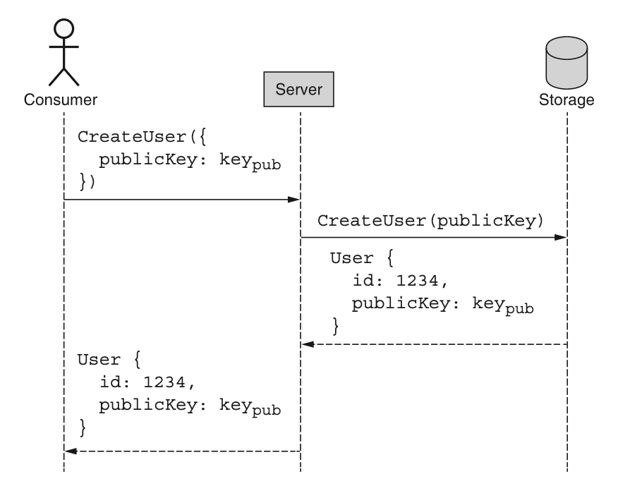
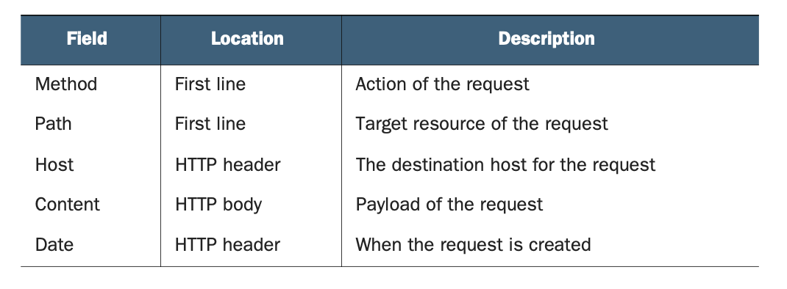
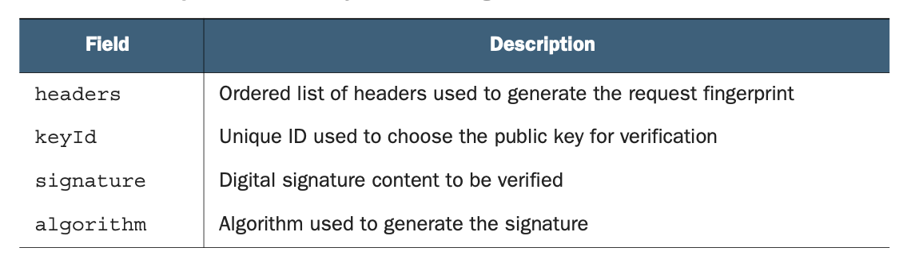

# 第 30 章 请求认证

<div style="background:#f7f5e6; padding:24px; border-radius:4px; color:#405a73;">

**本章内容**
- 请求认证系统的需求
- 数字签名概述
- 凭据生成、注册和签名
- HTTP 请求指纹
- 传达签名细节
- 验证签名和认证 HTTP 请求
</div><br/>

<ins>在这种模式中，我们将探讨如何以及为什么使用公钥-私钥交换和数字签名（ https://en.wikipedia.org/wiki/Digital_signature ）来认证所有传入的 API 请求。
这确保所有入站请求具有保证的完整性和来源真实性，并且发送者之后无法否认。</ins>
虽然替代方案（例如，共享密钥和 HMAC；https://en.wikipedia.org/wiki/HMAC ）在大多数情况下是可接受的，但当引入需要不可否认性的第三方时，这些方案就会失败。

<a id="motivation"></a>
## 30.1 动机

到目前为止，我们只是假设所有 API 请求都保证是真实的，将安全性留到以后再处理。
正如你可能猜到的，现在是时候探讨一个基本问题了：给定一个入站 API 请求，我们如何确定它来自一个实际授权的用户？

最终，是否批准给定请求的决定归结为是或否的答案，但我们需要考虑几个不同的需求来做出这个二元决定。
<ins>首先，我们需要知道请求是否来自它所声称的同一用户。</ins>
换句话说，如果请求声明它是由用户 1234 发送的，我们需要能够确定它确实来自用户 1234（就我们对用户 1234 含义的定义而言）。
<ins>其次，我们需要确保请求内容没有被损坏或篡改。</ins>
<ins>最后，以后可能变得重要的是，一个公正的第三方能够毫无疑问地验证一个请求无可否认地来自特定用户。</ins>
换句话说，如果我们发现一个声称从用户 1234 发送的请求（并且这是可验证的），用户 1234 必须不能后来声称该请求实际上是由其他人伪造的。
让我们花点时间更详细地探讨这些方面中的每一个，从请求的来源开始。

<a id="origin"></a>
### 30.1.1 来源

我们需要的第一项也是最重要的能力是确定请求的来源。
在这种情况下，我们不关心地理来源，而是关心发送请求的用户，这引出了身份的概念。

与现实世界中的身份概念不同，我们对驾照或出生证明不感兴趣。
相反，我们实际上只关心的是，如果请求声称来自用户 1234，那么该请求还具有某种只能由在我们服务中注册为用户 1234 的同一方提供的证明。
有许多方法可以实现这一点，我们将在 [第 30.2 节](#overview) 中讨论，但现在让我们继续讨论我们所说的完整性是什么意思。

### 30.1.2 完整性

完整性指的是收到的请求内容与发送时完全一致的确定性，这是 API 安全难题的关键部分。
没有它，即使我们可以确定请求的来源（例如，声称来自用户 1234 的请求具有用户 1234 的凭据），我们也不能确定请求的内容在发送后从未被篡改。
如果我们不能确定请求与发送时相同，那么知道它来自哪里实际上就没有那么有用了。

虽然不常见，但请求在传输过程中确实可以被更改。
这可能从无意的错误（例如，某些网络基础设施有故障并弄乱了数据）一直到恶意的（例如，有人拦截了请求并故意篡改它），但要点仍然相同：
我们能够确定请求的内容在发送后是否以任何方式被修改，并拒绝任何在传输过程中被修改的请求，这一点至关重要。

此外，即使我们通常可以依赖网络层安全（例如，TLS），这样做意味着按表面价值接受传入请求，而不是验证请求本身，并假设请求是以正确的方式传输的。
虽然如果我们能假设每个人在网络安全性方面总是做正确的事情会很好，但事实证明，我们的其他需求导致这个方面自然而然地随之而来。

### 30.1.3 不可否认性
不可否认性指的是这样一个理念：一旦我们验证了请求的来源，该来源就不能否认他们是来源。
此时，你可能在想，“但这为什么是个问题呢？如果我们能验证来源，那么这个需求已经隐含了！”
事实证明，这几乎是对的，但还有一点更多的东西。

真正的问题是，设计一个对称的凭据系统非常容易，其中证明你是用户 1234 所需的凭据与验证请求来自用户 1234 所需的凭据相同，有点像双方之间的共享密钥。
这种对称凭据的想法直到现在都不会成为问题，因为有一个关键假设：API 请求永远不应源自 API 服务器。
但当其他人（既不是用户 1234 也不是 API 服务器）需要验证用户 1234 是请求的真实来源时，会发生什么？
这个第三方如何区分真实来源为用户 1234 的请求和由 API 服务器滥用其共享凭据（该凭据仅用于验证用户 1234）伪造的请求？

这个需求非常明确地要求，用户证明他们是请求真实来源的机制不能也与 API 服务器共享。
换句话说，用于证明和验证 API 请求来源的凭据必须是非对称的，每一方有不同的凭据。
通过这样做，我们确保用户是唯一拥有该凭据的一方，而查看用户请求的第三方可以确定它源自该用户，而不是由 API 服务器伪造的。

<a id="overview"></a>
## 30.2 概述

虽然有许多设计竞争者，但有一个选项脱颖而出：数字签名。
我们将在下一节深入探讨数字签名如何工作的细节，但重要的是要涵盖它们是什么以及为什么它们适合这些需求的基础知识。

从根本上说，数字签名不过是一块字节。
话虽如此，这些字节代表一个值，超出合理怀疑，只能使用一对特殊的凭据来生成和验证。
这意味着使用一个凭据生成的签名，在没有拥有该凭据的情况下，实际上是不可能重新创建的。

然而，这些加密数字签名最重要的区别属性与凭据的非对称性有关。
这种非对称性意味着用于生成签名的凭据与用于验证它的凭据不同。
换句话说，密钥对中的每个凭据都有单一角色：一个用于生成签名，另一个用于验证签名。

在认证 API 请求方面，数字签名恰好非常适合这些需求。
首先，它们的加密性质意味着本质上很容易证明签名是由拥有正确凭据的某人生成的。
其次，签名依赖于被签名的消息这一事实意味着，如果消息以任何方式被更改，签名就是无效的。
最后，因为只有一方能够生成数字签名，该方无法后来声称签名是被伪造的。
换句话说，这种机制满足 [第 30.1 节](#motivation) 中列出的所有三个关键标准。

但这些签名究竟如何工作？
我们如何将它们集成到 Web API 中？
使用数字签名进行请求认证的过程涉及三个不同的阶段。
首先，用户创建一个公钥-私钥密钥对。
接下来，我们允许用户向 API 服务注册，基于密钥对中的公钥部分与系统建立身份。
从那时起，用户可以简单地用他们的私钥对所有请求进行数字签名，而 API 服务器可以使用先前关联的公钥验证这些签名。

如果这听起来有点过于简单，别担心；在下一节中，我们将更详细地介绍这些概念。

<a id="implementation"></a>
## 30.3 实现

正如我们在 [第 30.2 节](#overview) 中学到的，使用数字签名进行请求认证对用户和 API 服务器来说都是一个多阶段过程。
我们将从整个系统的基础开始我们的旅程：生成适当的非对称凭据。

### 30.3.1 凭据生成

在用户能做任何事情之前，他们首先需要生成一个密钥对。
这个密钥对是一种特殊类型的凭据，由两部分组成：一个私钥和一个公钥。
保持私钥绝对保密至关重要，因为正如我们之前学到的，拥有正确的凭据就是身份的定义。
换句话说，拥有正确的凭据就足够了，凭据上没有照片可以与出示它的人进行二次核对。

但为什么用户必须负责生成这对凭据呢？
为什么服务器不能生成它们然后简单地把私钥给用户以后使用？
正如我们在不可否认性需求中学到的，拥有非对称凭据对（而不是共享密钥）的全部意义在于防止用户否认他们签署了请求。
这之所以有效，是因为用于签署请求的凭据只掌握在用户手中，不与 API 服务器共享。
在这种情况下，如果我们允许 API 服务器生成凭据，我们只有他们的保证说他们没有为自己保留该密钥的副本。
此外，我们还必须担心私钥通过互联网传输，这有被拦截的（虽小但真实的）风险。
因此，如果我们真的想满足不可否认性的要求，私钥永远不能离开用户的手中。

我们如何生成这个密钥？
有许多工具可用，例如大多数 Linux 系统上的 ssh-keygen，但以下 TypeScript 代码展示了如何以编程方式做到这一点。

*清单 30.1 生成一组凭据*

```TypeScript
const crypto = require('crypto');

interface KeyPair {
  publicKey: string;
  privateKey: string;
}

function generateCredentials(size = 2048): Promise<KeyPair> {
  return new Promise<KeyPair>( (resolve, reject) => {
    crypto.generateKeyPair('rsa', { modulusLength: size },
      (err, pub, priv) => {
        // 如果出现任何错误，直接拒绝该Promise
        if (err) { return reject(err); }
        return resolve({
          // 使用字符串序列化数据作为公钥和私钥的值
          publicKey: pub.export({ type: 'pkcs1', format: 'pem' }),
          privateKey: priv.export({ type: 'pkcs1', format: 'pem' })
        });
      });
  });
}
```

在客户端执行这样的代码后，他们将得到一个公钥，它序列化为一个我们可以与他人共享的字符串。
现在我们需要以某种方式将这个公钥传输到 API 服务器，以便我们能够建立我们的身份。

### 30.3.2 注册与凭据交换

正如我们在 [第 30.1.1 节](#origin) 中学到的，身份通常是一个重要的概念，但在请求认证方面，这个概念的具体解释与我们日常生活中所期望的有点不同。
特别是，识别用户这件事根本没有绝对性。
换句话说，API 服务器永远不会验证用户的某些内在特征（例如，他们的指纹），而是将身份定义为持有建立该身份的凭据的任何人。
简单地说，证明你拥有分配给某个身份的秘密就足以证明你就是那个身份。

这使得注册的概念更简单。
在这种情况下，我们可以允许新用户通过提供公钥凭据向 API 注册，我们将为该用户生成一个唯一标识符。
这个事件序列如图 30.1 所示。

*图 30.1 使用公钥注册账户的序列* <br/>
<br/>

使用这个简单的、原子的标准 create 方法，我们进行了一次 API 调用，现在有了一个用于未来请求的唯一标识符（例如，用户 1234），并且公钥凭据可用于在接受请求之前验证签名。
请注意，这也避免了使用更传统的方法（如用户名和密码）向服务进行身份验证的要求。
相反，这个方案从一开始就完全依赖数字签名。

现在我们已经介绍了如何生成凭据并安全地与 API 服务器共享它们以建立对身份的共同理解，我们究竟如何使用这些密钥呢？

### 30.3.3 生成和验证原始签名

在不深入探讨密码学或数论太多细节的情况下，关于数字签名要记住的重要一点是，它是一个特殊的数字，使用私钥可以轻松计算，但如果没有该私钥则几乎不可能计算出来。
同样，这个特殊的数字可以使用公钥快速轻松地验证，但同一个公钥不能用来生成相同的签名值。
在某种程度上，它有点像安全的玻璃盒：只有拥有钥匙的人才能把东西放进去，但一旦放进去，任何人都能看到里面的物品，并知道它只能由拥有钥匙的人放置。

为了计算签名，我们将请求体与私钥结合，我们可以依赖标准库（例如 Node.js 的 crypto 包）来处理生成签名的实际困难数学工作。

*清单 30.2 对任意字符串进行签名*

```typescript
const crypto = require('crypto');

function generateSignature(payload: string, privateKey: string): string {
  const signer = crypto.createSign('rsa-sha256');
  signer.update(payload);
  signer.end();
  return signer.sign(privateKey);
}
```

验证签名同样直接。
我们取签名、我们期望已被签名的载荷以及相应的公钥，并使用标准库函数将这三者结合起来。
函数的结果将是一个简单的布尔值，说明签名是否通过验证。

*清单 30.3 验证任意签名*

```typescript
const crypto = require('crypto');

function verifySignature(
  payload: string, signature: string, publicKey: string): Boolean {
  const verifier = crypto.createVerify('rsa-sha256');
  verifier.update(payload);
  verifier.end();
  return verifier.verify(publicKey, signature);
}
```

关于这两个示例可能看起来令人惊讶的一点是，payload 参数是一个字符串，而不是比如说一个对象或 API 请求的其他某种表示。
但这实际上引出了一个重要的问题：我们究竟应该签什么？

事实证明，这个问题比听起来要复杂得多。
在下一节中，我们将讨论在生成或验证数字签名时如何确定在 payload 参数中放入什么。

### 30.3.4 请求指纹

到目前为止，我们有点含糊其辞地说必须对请求进行签名，但并没有真正具体说明这是如何工作的。
让我们花点时间探讨在决定发送请求到 API 服务器之前应该签什么时需要考虑的一些方面。

虽然只对请求体进行签名可能很诱人，但事实证明，即使这一点也比看起来要棘手一些，因为请求体要求我们序列化数据
（例如，在 TypeScript 中使用 `JSON.stringify()`），而实际上有很多不同的方式来序列化事物，即使依赖相同的序列化格式也是如此。
例如，存在各种字符编码和规范化形式，导致许多字符串可能在语义上等价，但仍有不同的字节表示。
此外，对于大多数格式，包括 JSON，通常没有关于属性在各种类似映射结构中出现顺序的规则。
例如，虽然 `{"a": 1, "b": 2}` 在语义上与 `{"b": 2, "a": 1}` 相同，但这些值的字节表示完全不同。

由于计算数字签名操作的是原始的不透明字节，这意味着内容的底层字节表示实际上非常重要。
例如，如果验证签名的一方对相同的语义消息使用不同的字节表示，这将导致签名验证失败，而实际上内容并没有真正改变。
相反，字节表示只是以不同的方式计算。

让事情更复杂的是，我们必须记住 API 请求可能涉及的远不止请求体。
例如，当使用 HTTP 作为传输机制删除资源时，HTTP 请求体是空的（而不是像 `{"id": "chatRooms/1"}` 这样的东西）。
相反，预期的动作编码在 HTTP 动词（DELETE）中，而要删除的目标表示在 URL（`/chatRooms/1`）中。
此外，HTTP 头中可能有其他对请求的含义和完整性很重要的信息（例如，请求发送的时间），确实应该包含在签名计算中。
这些因素中的每一个都使得我们更加需要某种方式来计算请求指纹，它可以唯一地表示给定请求，并最终在用私钥计算数字签名时充当载荷。

<ins>但我们如何定义这个指纹呢？
为了弄清楚这一点，我们需要考虑 HTTP 请求的哪些部分需要包含在签名中。
幸运的是，答案相当简单。
首先，我们需要包含 HTTP 方法、URL（主机和路径）以及请求体。
此外，如果存在，我们应该包含请求发送时间的指示；
大多数情况下，这存在于一个名为 “Date” 的 HTTP 头中，以支持拒绝可能太旧的请求（这些字段的摘要显示在表 30.1 中）。</ins>

*表 30.1 对 HTTP 请求进行指纹所需的组件* <br/>
<br/>

正如我们所见，数据来自各种位置，这使我们的工作变得有点复杂。
为了简化这一点，我们可以做两件事。
<ins>首先，我们可以将 HTTP 请求的第一行视为特殊的东西，通常称为请求目标，包括 HTTP 方法（例如 POST）和路径（例如 `/chatRooms/1`）。
其次，与其依赖对请求体进行签名（请求体可能变得过大），我们可以计算请求体的哈希值，并将其存储在名为 “Digest” 的单独 HTTP 头中（Base64 格式）。
通过依赖这个派生字段，我们可以在限制指纹大小的同时维护其完整性和安全性。</ins>

*清单 30.4 为 digest 头生成哈希值*

```typescript
const crypto = require('crypto');

function generateDigestHeader(body: string): string {
  // 我们在哈希值前面添加所使用哈希算法的标识前缀（本例为 SHA-256）
  return 'SHA-256=' + crypto
    .createHash('sha256')
    .update(body)
    .digest()
    // 哈希值应当进行Base64编码
    .toString('base64');
}
```

一旦我们完成了这些，我们需要组装各个部分。
为此，我们可以使用组件的有序列表（例如，请求目标、主机、日期，然后是 digest），适当地格式化它们（例如，将头转换为小写字符），
并将每一个放入一个字符串中，每个之间用换行符分隔。

*清单 30.5 根据 HTTP 请求生成指纹*

```typescript
const HEADERS = ['(request-target)', 'host', 'date', 'digest'];

function generateRequestFingerprint(
  request: HttpRequest, headers = HEADERS): string {
  return headers.map((header) => {
    let value;
    // “(request-target)”字段应当包含小写的HTTP方法和请求路径
    if (header === '(request-target)') {
      value = `${request.method.toLowerCase()} ${request.path}`;
    } else if (header === 'digest') { // “digest”字段需要生成请求体的哈希值
      value = generateDigestHeader(request.body);
    } else {
      // 其余所有值直接使用请求头中指定的内容
      value = request.headers[header];
    }
    // 最后返回一组键值对，使用冒号分隔（和请求头格式一致）
    return `${header.toLowerCase()}: ${value}`;
  }).join('\n');
}
```

*清单 30.6 用于签署 HTTP 请求的示例指纹*

```json
// 特殊的“(request-target)”字段，会被当作普通请求头处理
(request-target): patch /chatRooms/1
host: example.org
date: Tue, 27 Oct 2020 20:51:35 GMT
// 我们额外加入 digest 请求头
digest: SHA-256=HV9PltG0QPRNsl1FB7ebQA8XPasvPyRg6hhU0QF2l4M=
```

这种键值对的规范格式足以作为请求的指纹，更重要的是，它最终可以用作计算数字签名的载荷。
它包含了关于请求的目标资源（`/chatRooms/1`）、动作（PATCH）、目的地（example.org）、时间（Oct. 27）和请求体（以 SHA-256 哈希摘要的形式）的所有信息，以便稍后唯一标识该请求。

下一个问题是我们需要以某种方式告知 API 服务器我们究竟是如何计算出这个指纹的。
在下一节中，我们将探讨如何与服务器传达这些参数，以确保它能够为请求正确地得出相同的指纹。

### 30.3.5 包含签名

<ins>在我们计算出请求指纹之后，我们不能只是对它签名然后就完事了。
为了确保 API 服务器能够正确验证签名，它必须能够根据入站请求计算出相同的指纹值。
为此，我们需要包含一些关于指纹和签名的元数据。</ins>

首先，我们需要明确哪些头被包含在指纹中，以及关键的是，以什么顺序。
仅仅有头的列表是不够的，因为以不同的顺序呈现它们会导致不同的指纹。
其次，我们需要以某种方式告诉 API 服务器应该使用哪个公钥来验证签名。
这个 ID 可以等同于注册期间创建的用户 ID，因为每个用户恰好有一个公钥。
最后，我们还应该包含用于生成签名的算法，以便 API 服务器可以使用相同的算法验证它。
这些字段的摘要显示在表 30.2 中。

*表 30.2 定义签名所需的组件* <br/>
<br/>

一旦我们有了所有这些信息，我们就可以组装它，并将生成的值与请求一起传递到一个特殊的签名头中。

*清单 30.7 根据指纹和其他组件生成签名头*

```typescript
const HEADERS = ['(request-target)', 'host', 'date', 'digest'];

interface SignatureMetadata {
  keyId: string;
  algorithm: string;
  headers: string;
  signature: string;
}

function generateSignatureHeader(
  fingerprint: string, userId: string,
  privateKey: string, headers = HEADERS): string {
  // 指定不同签名组件的列表
  const signatureParts: SignatureMetadata = {
    keyId: userId,
    algorithm: 'rsa-sha256',
    headers: headers.map((h) => h.toLowerCase()).join(' '),
    signature: generateSignature(fingerprint, privateKey)
  };

  // 将各部分组合为逗号分隔的带引号键值对
  return Object.entries(signatureParts).map(([k, v]) => {
    return `${k}="${v}"`;
  }).join(', ');
}
```

这个函数的输出最终应该是一个逗号分隔的字符串，包含我们充分定义签名所需的不同字段。

*清单 30.8 签名头的值示例*

```
keyId="1234",algorithm="rsa-sha256",headers="(request-target)
➥ host date digest",signature="mgBAQEsEsoBCgIOBiNfum37y..."
```

现在我们已经有了所有的部分，剩下的就是组装一切。
这意味着我们需要取一个 HTTP 请求并附加两个新的头：一个 digest 头和一个签名头。
我们可以使用之前定义的辅助方法来承担繁重的工作。

*清单 30.9 签署请求的函数（分配相关头）*

```typescript
const HEADERS = ['(request-target)', 'host', 'date', 'digest'];

function signRequest(
  request: HttpRequest, userId: string,
  privateKey: string, headers = HEADERS): HttpRequest {
  // 更新摘要请求头
  request.headers['digest'] =
    generateDigestHeader(request.body);

  // 生成签名所需的请求指纹
  const fingerprint =
    generateRequestFingerprint(request, headers);

  // 更新签名请求头
  request.headers['signature'] = generateSignatureHeader(
    fingerprint, userId, privateKey, headers);

  // 返回附加信息后的请求对象
  return request;
}
```

这个函数的输出是一个请求，它应包含一个设置为请求体哈希的 digest 头，以及一个签名头，该签名头不仅包含数字签名，还包含 API 服务器验证签名值本身所需的所有信息。

*清单 30.10 完整已签名 HTTP 请求的示例*

```
PATCH /chatRooms/1
Host: example.org
Digest: SHA-256=HV9PltG0QPRNsl1FB7ebQA8XPasvPyRg6hhU0QF2l4M=
Signature: keyId="1234",algorithm="rsa-sha256",headers="
(request-target) host date digest",
signature="mgBAQEsEsoBCgIOBiNfum37y..."
Date: Tue, 27 Oct 2020 20:51:35 GMT

{"title":"New title"}
```

请注意，实际请求中头的顺序并不重要。
这是因为我们已经指定了在验证签名时应用于生成指纹的头顺序。
接下来我们需要考虑的是 API 服务器究竟如何验证签名并最终认证请求。
让我们在下一节中看看这一点。

### 30.3.6 认证请求

正如你所预料的，我们可以依赖相同的算法来验证签名，从而认证请求。
但我们究竟需要验证什么？

首先，我们需要确保 digest 头实际上是请求体内容的真实表示。
如果不是，这意味着请求体自哈希计算以来已发生变化，请求应被拒绝。
接下来，我们需要使用签名头中提供的模式重新计算请求的指纹。
之后，我们需要使用该头中提供的密钥标识符来查找应该用于验证签名的公钥。
最后，我们应该使用公钥和指纹来验证签名是否正确。

虽然这听起来可能很多，但我们已经编写了将执行繁重工作的大部分代码。

*清单 30.11 根据请求对象验证签名*

```typescript
// 首先我们需要一个函数，将签名请求头解析为独立的组件
function parseSignatureHeader(signatureHeader: string):
  SignatureMetadata {
  const data = Object.fromEntries(
    signatureHeader
      .split(',') // 将 `k="v",k="v"` 这样的对拆分。
      .map((pair) => pair.split('=')) // 拆分 k="v" 键值对
      .map(([k, v]) => [k, v.substring(1, v.length - 1)]); // 移除引号
  data.headers = data.headers.split(' '); // 仅拆分请求头列表
  return metadata;
}

async function verifyRequestSignature(request: HttpRequest):
  Promise<Boolean> {
  if (generateDigestHeader(request.body) !==
    // 校验请求体与摘要请求头是否匹配
    request.headers['digest']) {
    return false;
  }

  // 将签名请求头解析为多个片段
  const metadata = parseSignatureHeader(
    request.headers['signature']);

  // 根据请求头确定被签名的负载
  const fingerprint = generateRequestFingerprint(
    request, metadata.headers);

  // 根据提供的ID获取公钥（公钥存储在数据库中）
  const publicKey = (await database.getUser(
    metadata.keyId)).publicKey;

  // 使用公钥对照指纹校验签名
  return verifySignature(
    fingerprint, metadata.signature, publicKey);
}
```

有了这些，我们现在能够生成一些凭据并向 API 服务器注册、对出站请求进行数字签名，以及认证来自用户的入站请求。

### 30.3.7 最终 API 定义

这种模式的最终 API 定义相当直接，仅涉及用于创建具有关联公钥的新用户以及稍后通过其 ID 检索这些用户的方法。
关于如何签署请求和验证签名的实现已在前面探讨过，因此本节不会重现相同的代码。

*清单 30.12 最终 API 定义*

```typescript
abstract class ChatRoomApi {
  @post("/users")
  CreateUser(req: CreateUserRequest): User;

  @get("{id=users/*}")
  GetUser(req: GetUserRequest): User;
}

interface CreateUserRequest {
  resource: User;
}

interface GetUserRequest {
  id: string;
}

interface User {
  id: string;
  publicKey: string;
  // ...
}
```

<a id="trade-offs"></a>
## 30.4 权衡

由于有如此多不同的身份验证方法可用，选择其中一种而非其他显然存在权衡。
即使对请求进行数字签名几乎肯定是最安全的选项，这也并不使它成为所有场景中的正确选择。
事实上，对这种类型设计最常见的反对意见是它对场景来说过于复杂。

例如，在许多情况下，不可否认性更多是 “锦上添花” 而非真正的要求。
坚持不可否认性的理由在于，当你可能提供已签名的请求供他人稍后执行时（涉及可能或可能不完全受信任的第三方），
或者当 API 请求本身特别敏感时（例如，更新健康或财务记录）。
在这些情况下，不可否认性对 API 服务器很重要，可以保护自己免受在将来对历史日志进行审计时可能出现的不当行为指控
（例如，用户声称他们从未发出过那些请求）。

虽然这些事情并非不可能，但它们肯定不是非常常见。
毕竟，当我们在 Facebook 或 Twitter 上更新数据时，我们并没有真的打算事后否认 API 请求。
因此，其他系统（例如使用带有共享密钥的 HMAC）当然值得探索。
虽然我们不会详细讨论使用 HMAC 或其他使用短期访问令牌的标准身份验证机制（例如 OAuth 2.0；https://oauth.net/2/ ），
但对于任何要求稍微不那么严格并且可以期望依赖在传输层实现的适当安全协议的 API 来说，这些几乎肯定是有效的选项。

但为什么不在最安全的选项可用时就依赖它呢？
一个常见的答案是，这种类型的密码学计算量更大，并且最终由 API 服务器本身处理，而不是在堆栈的较低层处理。
事实上，即使在公钥密码学的常见用法（如 SSL）中，系统也只在前端使用非对称系统来交换临时对称密钥，从那时起依赖计算量较小的对称算法。
因此，关心可用计算资源的系统可能会选择更高效的替代方案。

<a id="exercises"></a>
## 30.5 练习

1. 证明请求的来源与防止将来否认之间有什么区别？为什么前者不能决定后者？

2. 客户端和服务器之间的共享密钥无法满足哪个要求？

3. 为什么请求指纹包含 HTTP 方法、主机和路径属性很重要？

4. 这种模式中提出的数字签名是否容易受到重放攻击？如果是，如何解决？


<a id="summary"></a>
## 本章小节

- 成功的请求认证有三个要求：来源证明、完整性证明和防止否认。

- 来源是请求来自已知来源且没有任何不确定性的证明。

- 完整性专注于确保请求本身自发送时起从未被篡改。

- 不可否认性指的是请求者无法后来声称请求实际上是由其他人发送的。

- 与现实世界的身份不同，认证依赖将身份定义为拥有密钥，有点像不记名债券。

- 在对请求进行签名时，实际被签名的内容应是请求的指纹，包括 HTTP 方法、路径、主机以及 HTTP 正文中的一组内容。
