# 第 4 章 资源作用域与层级结构

<div style="background:#f7f5e6; padding:24px; border-radius:4px; color:#405a73;">

**本章内容**
- 什么是资源布局
- 各种类型的资源关系（引用、多对多等）
- 实体关系图如何描述资源布局
- 如何在资源之间选择正确的关系
- 应避免的资源布局反模式
</div><br/>

正如我们在 [第 1 章](ch1.md) 中所学，将焦点从动作转向资源，
使我们能够通过利用简单模式来更轻松、更快速地建立对 API 的熟悉度。
例如，REST 提供了一组标准动词，我们可以将其应用于一组资源，
这意味着对于我们了解的每一个资源，我们同时也掌握了可对该资源执行的五种不同动作（创建、获取、列表、删除和更新）。

<ins>虽然这很有价值，但也意味着仔细思考我们作为 API 一部分所定义的资源变得更加重要。
选择正确资源的一个关键部分是理解它们将来如何组合在一起。</ins>
本章将探讨如何规划 API 中的各类资源、可用的方案，以及用于选择资源间关联方式的通用准则。
此外，我们还会介绍在规划 API 资源集合时的若干反模式（即应当避免的做法）。
我们先从基础概念入手，明确资源布局的具体含义。

<a id="what"></a>
## 4.1 什么是资源布局？

当我们谈论资源布局时，通常指的是 API 中资源（或 “事物”）的排列方式、定义这些资源的字段，以及这些资源如何通过这些字段相互关联。
<ins>换句话说，资源布局是针对特定 API 设计的实体（资源）关系模型。</ins>
例如，如果我们要为聊天室构建一个 API，资源布局指的是我们所做的选择，这些选择可能会导致一个 ChatRoom 资源以及一个可能与房间以某种方式关联的 User 资源。
我们感兴趣的是 User 和 ChatRoom 资源之间相互关联的方式。
如果你曾经设计过包含各种表的关系型数据库，这应该会感觉熟悉：你所设计的数据库 schema 在本质上通常与 API 的表现方式非常相似。

虽然我们可能倾向于认为关系才是唯一重要的，但实际上情况比这要复杂一些。
虽然关系本身是唯一直接影响最终资源布局的因素，但还有许多其他因素间接影响布局。
一个明显的例子是资源选择本身：如果我们选择不设置 User 资源，而是使用一个简单的按名称列出的用户列表（members: string[]），那么就没有其他资源需要布局，这个问题就完全避免了。

顾名思义，当我们以可视化的方式将资源布局看作由线条相互连接的方框时，API 的资源布局可能最容易理解。
例如，图 4.1 展示了我们如何将聊天室示例理解为许多用户和许多聊天室彼此相互连接。

*图 4.1 一个聊天室包含许多用户成员。* <br/>
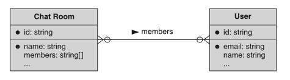<br/>

如果我们正在构建一个在线购物 API（例如类似于亚马逊的服务），
我们可能会存储 User 资源及其各种地址（用于运送在线购买的商品）和付款方式。
此外，付款方式本身可能引用一个地址作为该付款方式的账单地址。
这种布局如图 4.2 所示。

*图 4.2 用户、付款方式和地址之间都有不同的关系* <br/>
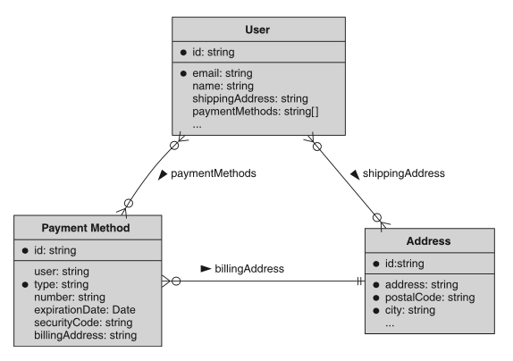<br/>

<ins>简而言之，重要的是要记住，资源布局是一个宽泛的概念，它包含我们为 API 选择的资源，而且最重要的是，这些资源如何相互交互和关联。</ins>
在下一节中，我们将简要介绍不同类型的关系以及每种类型可能提供的交互（和限制）。

### 4.1.1 关系类型

在考虑资源布局时，我们必须考虑资源之间可以相互关联的各种方式。
重要的是要考虑到，我们将要讨论的所有关系本质上是双向的，这意味着即使关系看起来是单向的（例如，一条消息指向一个用户作为作者），反向关系即使没有明确定义也仍然存在（例如，一个用户能够编写多条不同的消息）。
让我们直接来看最常见的关系形式：引用。

#### 引用关系

<ins>两个资源之间关联的最简单方式是通过简单的引用。
这里的意思是，一个资源引用或指向另一个资源。</ins>
例如，在聊天室 API 中，我们可能会有 Message 资源，它们构成了聊天室的内容。
在这种情况下，每条消息显然都由一个用户编写，并存储在消息的 author 字段中。
这将导致消息和用户之间形成简单的引用关系：一条消息有一个 author 字段，指向一个特定的用户，如图 4.3 所示。

*图 4.3 一条 Message 资源包含对编写该消息的特定 User 的引用。*<br/>
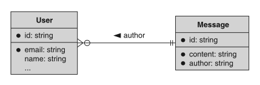<br/>

这种引用关系有时也被称为外键关系，因为每条 Message 资源会指向恰好一个 User 资源作为作者。
不过，如前所述，一个 User 资源显然可以拥有与之关联的多条不同消息。
因此，这也可以被认为是一种多对一关系，其中一个用户可能编写多条消息，而一条消息始终只有一个用户作为作者。

#### 多对多关系

<ins>作为引用关系的一种更高级变体，多对多关系代表了一种场景，
其中资源以这样一种方式连接在一起：每个资源都指向另一个资源的多个实例。</ins>
例如，如果我们有一个用于群组对话的 ChatRoom 资源，它显然会包含许多个独立的用户作为成员。
然而，每个用户也能够成为多个不同聊天室的成员。
在这种情况下，ChatRoom 资源与用户之间具有多对多关系。
一个 ChatRoom 指向多个 User 资源作为房间的成员，而一个用户也能够指向他们可能所属的多个聊天室。

这种关系如何运作的机制留待以后探讨（我们将在 [第 3 部分](part3.md) 中看到这些），但这些多对多关系在 API 中非常常见，并且有几种不同的表示方式，每种方式都有各自的优缺点。

#### 自引用关系

<ins>至此，我们可以讨论一种听起来可能很奇怪，但实际上只是引用的另一种特殊版本：自引用。</ins>
顾名思义，在这种关系中，一个资源指向另一个完全相同类型的资源，因此 “自” 指的是类型而非资源本身。
实际上，这与普通的引用关系完全一样；
然而，我们必须将其单独列出来，因为它具有典型的可视化表示方式，如图 4.4 所示，其中箭头指向资源本身。

*图 4.4 一个 Employee 资源指向其他 Employee 资源作为经理和助理。* <br/>
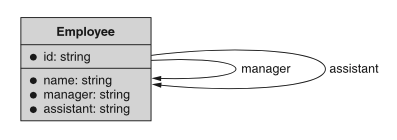<br/>

你可能会好奇，为什么一个资源会指向另一个完全相同类型的资源。
这是一个合理的问题，但这种类型的关系实际上出现的频率远超你的想象。
自引用最常见于层级关系中，此时资源是树中的一个节点，或者出现在网络风格的 API 中，此时数据可以表示为有向图（如社交网络）。

例如，假设有一个用于存储公司通讯录的 API。
在这种场景下，员工之间相互指向，以记录谁向谁汇报（例如，员工 1 向员工 2 汇报）。
这个 API 可能还有针对特殊关系的进一步自引用（例如，员工 1 的助理是员工 2）。
在上述每种情况下，我们都可以使用自引用来建模资源布局。

#### 层级关系

最后，我们需要讨论一种非常特殊的关系类型，它是标准引用关系的另一种变体：层级关系。
<ins>层级关系有点像一种资源指向另一种资源，但这种指针通常指向上方，并且其含义不仅仅是资源之间的指向。
与典型的引用关系不同，层级关系还倾向于反映资源之间的包含或归属关系，用你电脑上的文件夹术语可能最容易解释。</ins>
你电脑上的文件夹（或 Linux 用户的目录）包含一组文件，从这个意义上说，这些文件归该文件夹所有。
文件夹还可以包含其他文件夹，然后循环往复，有时是无限嵌套的。

<ins>这看起来可能无关紧要，但这种特殊的关系隐含了一些重要的属性和行为。</ins>
例如，当你删除电脑上的一个文件夹时，通常其中包含的所有文件（和其他文件夹）也会被一并删除。
或者，如果你被授予对某个特定文件夹的访问权限，这通常也意味着可以访问其中的文件（和其他文件夹）。
对于以这种方式行为的资源，人们也期望同样的行为。

在我们深入之前，先来看看层级关系是什么样的。
实际上，我们在前面的章节中一直在使用层级关系的例子，所以它们应该不会让人感到意外。
例如，我们讨论过 ChatRoom 资源由一组 Message 资源组成。
在这种情况下，就隐含了 ChatRoom 包含或拥有 Message 的层级关系，如图 4.5 所示。

*图 4.5 ChatRoom 资源通过层级关系充当 Message 资源的拥有者。* <br/>
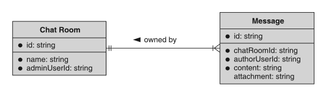<br/>

可以想象，通常认为拥有对 ChatRoom 资源的访问权限，也会授予对构成聊天室内容主体的 Message 资源的访问权限。
此外，当删除 ChatRoom 资源时，通常假定此操作会基于父子层级关系级联到 Message 资源。
在某些情况下，这种级联效果是一个巨大的好处
（例如，能够删除电脑上的整个文件夹，而无需先删除其中的每个单独文件，这很方便）。
在其他情况下，级联行为可能会带来相当大的问题
（例如，我们可能认为自己授予的是对某个文件夹的访问权限，而实际上授予的是对该文件夹内所有文件（包括子文件夹）的访问权限）。

总的来说，层级关系很复杂，并且会引发许多棘手的问题。
例如，资源能否更改父级？
换句话说，我们可以将 Message 资源从一个 ChatRoom 资源移动到另一个吗？
（通常，这是一个坏主意。）我们将在 [第 4.2 节](#choosing) 中进一步探讨层级关系及其优缺点。

### 4.1.2 实体关系图

在本章中，你可能已经看到连接不同资源的线条末端有一些有趣的符号。
虽然我们没有时间深入探讨 UML（统一建模语言； https://en.wikipedia.org/wiki/Unified_Modeling_Language ）
的全部细节，但我们至少可以看看其中一些箭头，并解释它们的工作原理。

简而言之，我们不是让一个箭头随意地从一种资源指向另一种资源，而是可以让箭头的末端传达关于关系的重要信息。
更具体地说，每个箭头末端可以告诉我们另一端可能有多少个资源。
例如，图 4.6 显示一所学校有许多学生，但每个学生只就读于一所学校。
此外，每个学生参加许多课程，并且每门课程包含许多学生。

*图 4.6 显示学校、学生和课程的实体关系图示例* <br/>
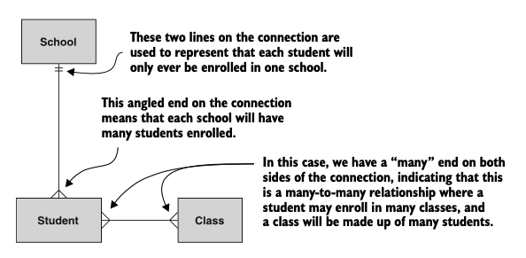<br/>

虽然这两个符号无疑是最常见的，但你有时也可能会看到其他的符号。
这些符号用于处理关联资源是可选的（即可能为零个）情况。
例如，从技术上讲，一门课程可能由零个学生组成（反之亦然）。
因此，从技术上讲，该图可能更像图 4.7 所示。

*图 4.7 更新后的图表显示学生可能未注册课程（且课程可能没有任何学生注册）* <br/>
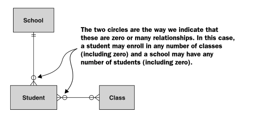<br/>

有时，掌握如何阅读这类符号可能有些困难，因此澄清每个连接符的阅读方向可能会有所帮助。
<ins>阅读这些图表的最佳方式是从一个资源开始，沿着线条，然后查看线条末端的连接符，最后在另一个资源处结束。
重要的是要记住，你要跳过与你起始资源相邻的连接符。</ins>
为了更清楚地说明这一点，图 4.8 将 School 和 Student 资源之间的连接拆分为两个单独的图表，并在线条旁边标明了连接的阅读方向。

*图 4.8 如何以 School 和 Student 资源为例阅读实体关系* <br/>
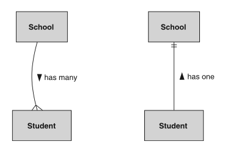<br/>

正如我们所见，一所学校有许多学生，而学生有一所学校。
为简单起见，我们将这两个关系合并到一个图表和一条连接两者的线条中，正如我们在前面的示例中看到的那样。

现在我们已经很好地掌握了如何阅读这些图表，
接下来让我们进入更重要的工作：通过选择资源之间的正确关系来建模我们的 API。

<a id="choosing"></a>
## 4.2 选择正确的关系

正如我们在 [第 4.1 节](#what) 中所学，选择正确的关系类型通常取决于我们最初选择的资源，因此在本节中我们将把这两者视为相互关联的。
让我们先从一个重要问题开始：我们究竟是否需要建立关系？

<a id="need-relationship"></a>
### 4.2.1 你究竟是否需要建立关系？

<ins>在构建 API 时，在我们选定了对我们重要的事物或资源列表之后，下一步就是决定这些资源如何相互关联。</ins>
有点类似于数据库 schema 规范化，我们常常倾向于连接所有可能有关联的东西，以构建一个丰富的、相互连接的资源网络，
从而可以通过各种指针和引用轻松导航。
虽然这无疑会打造出一个非常丰富且具有描述性的 API，但随着 API 接收越来越多的流量并存储越来越多的数据，它也可能变得难以维护，并遭遇严重的性能下降。

为了理解我们的意思，让我们设想一个简单的 API，其中用户可以相互关注（例如，类似 Instagram 或 Twitter）。
在这种情况下，用户之间具有多对多的自引用关系，即一个用户关注许多其他用户，而每个用户也可能有许多关注者，如图 4.9 所示。

*图 4.9 具有自引用以反映用户相互关注的 User 资源* <br/>
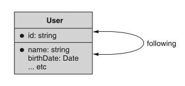<br/>

这看起来可能无关紧要，但当用户拥有数百万关注者（或用户关注数百万其他用户）时，情况就会变得相当复杂，因为这类关系会导致单个资源的变更影响数百万个其他相关资源的场景。
例如，如果某个名人删除了他们的 Instagram 账户，则可能需要删除或更新数百万条记录（取决于底层数据库 schema）。

这并不是说你应该不惜一切代价避免任何关系。
相反，重要的是尽早权衡任何给定关系的长期成本。
换句话说，资源布局（以及其中的关系）并非总是没有代价的。
就像在签署文件之前了解你的抵押贷款可能花费多少很重要一样，
在设计过程中而非在最后阶段认识到特定 API 设计的真实成本也同样重要。
在确实需要维持某种关系的场景中（例如前面的例子，存储关注者关系看起来相当重要），
有一些方法可以减轻性能下降的影响，但在任何 API 中定义引用关系时保持审慎仍然是一个好主意。

<ins>换句话说，引用关系应该是有明确目的的，并且对期望的行为来说是基础性的。
也就是说，这些关系永远不应该是偶然的、锦上添花的，或者是你将来可能需要的。
相反，任何引用关系都应该是 API 实现其主要目标所必需的重要部分。</ins>

例如，Twitter、Facebook 和 Instagram 等服务都是围绕用户之间相互关注的关系构建的。
用户之间的自引用关系对于这些服务的核心目标来说是真正基础性的 —— 毕竟，没有这种关系，Instagram 就会变得等同于一个简单的照片存储应用。
与之相比，像即时消息传递服务这样的东西，我们可以看到，即使这种 API 确实涉及用户之间以聊天形式存在的关系，它们对应用的重要性也与前者不同。
例如，在聊天中涉及的两个用户之间建立关系很重要，但拥有所有潜在联系人之间全部关系的完整集合则没有那么重要。

<a id="reference-or-inline"></a>
### 4.2.2 引用还是内联数据

假设某种关系对你的 API 的行为和功能至关重要，那么我们就需要探索并回答一些重要的问题。
- <ins>首先，我们需要探究，是将数据内联在你的 API 中（即在资源内部存储一份副本）更合理，</ins>
- <ins>还是依赖引用（即只保留一个指向正式数据的指针）。</ins>
让我们通过一个依赖聊天室示例的简单场景来说明这一点。

假设每个聊天室必须有一位管理员用户。
我们有两种选择：要么通过引用字段指向管理员用户（例如 adminUserId），要么将这位用户的数据内联，并将其表示为 ChatRoom 资源的一部分。
为了看清楚这分别是什么样的，请看图 4.10 和图 4.11，它们展示了两种场景。

*图 4.10 包含对管理 User 资源的引用的 ChatRoom 资源* <br/>
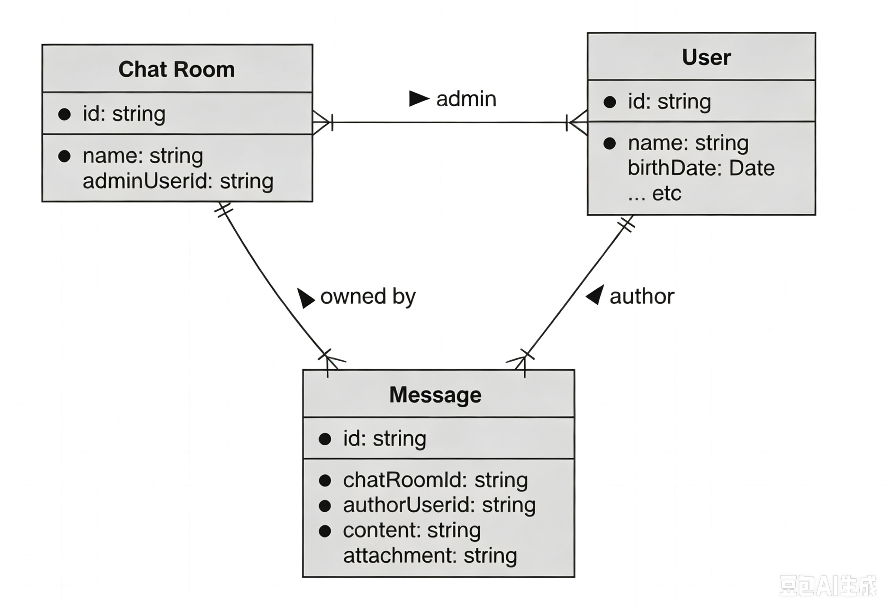<br/>

*图 4.11 包含内联表示的管理用户的 ChatRoom 资源* <br/>
<br/>

在第一个图（图 4.10）中，我们可以看到 ChatRoom 资源在指定管理员时指向了 User 资源。
另一方面，在第二个图（图 4.11）中，我们可以看到 adminUser 字段实际上包含了管理员的信息。
这就引出了一个显而易见的问题：哪种方式最好？
事实证明，答案取决于你正在查询的问题或正在执行的操作。

如果你试图查看管理员的姓名，使用内联数据要容易得多。
为了理解原因，让我们看看在每种场景下我们需要做些什么才能获取这些信息。

*清单 4.1 分别针对引用和内联示例获取管理员信息*

```typescript
function getAdminUserNameInline(chatRoomId: string): string {
  // 两种实现的第一步，都是获取聊天室资源
  let chatRoomInline = GetChatRoomInline(chatRoomId);
  return chatRoomInline.adminUser.name;
}

function getAdminUserNameReference(chatRoomId: string): string {
  // 两种实现的第一步，都是获取聊天室资源
  let chatRoomRef = GetChatRoomReference(chatRoomId);

  // 对于引用模式，如果需要获取管理员更多信息，则需要执行第二次查询
  let adminUser = GetAdminUser(chatRoomRef.adminUserId);
  return adminUser.name;
}
```

这两个函数中最明显的区别在于需要网络响应的实际 API 调用次数。
在第一种情况中，数据以内联方式返回，我们只需要一次 API 调用即可检索所有相关信息。
在第二种情况中，我们必须先检索 ChatRoom 资源，然后才知道我们感兴趣的是哪个用户。
之后，我们还得检索 User 资源才能找到用户名。

这是否意味着内联数据总是更好？
并不完全是。
这是一个需要双倍 API 调用次数才能获取我们所感兴趣信息的例子。
但如果我们并不经常需要这些信息呢？
如果是这样，那么每次有人请求 ChatRoom 资源时，我们都会传输大量字节，而这些字节最终被忽略。
换句话说，每当有人请求 ChatRoom 资源时，我们还会告知他们关于作为该房间管理员的 User 资源的所有信息。

这看起来可能没什么大不了的，但如果每个用户还内联存储了他们所有好友（其他 User 资源）呢？
在这种情况下，将管理员与聊天室一起返回实际上可能会导致大量额外数据。
此外，生成所有这些额外的内联数据通常还需要额外的计算工作（通常来自底层需要连接数据的数据库查询）。
而且它可能以不可预测的方式快速增长。那我们该怎么办呢？

<ins>不幸的是，这取决于你的 API 在做什么，因此这是一个需要判断的决定。
一个有用的经验法则是针对常见情况进行优化，同时不损害高级情况的可行性。</ins>
这意味着我们需要考虑相关资源是什么、当前有多大、未来可能增长到多大，并决定在响应中包含管理员信息有多重要。
在这种场景下，典型用户可能不会频繁查询他们聊天室的管理员是谁，而是更关注向朋友发送消息。
因此，内联这些数据可能并不那么重要。
另一方面，User 资源可能相当小，因此如果 API 经常使用这些数据，内联它可能不会造成大问题。

综上所述，我们还没有讨论另一种重要的关系类型：层级关系。
让我们看看什么时候选择层级关系比其他类型更合适。

### 4.2.3 层级关系

<ins>正如我们之前所了解的，层级关系是父资源与子资源之间的一种非常特殊的引用关系，而不是两个普通关联资源之间的关系。
这种关系最大的不同在于操作的级联效应，以及行为和属性从父级到子级的继承。</ins>
例如，删除父资源通常意味着也要删除子资源。
同样，对父级的访问权限（或无权访问）通常意味着对子级具有相同的访问级别。
这些独特且潜在有价值的特征意味着这种关系具有很大的潜力，既可能带来好处，也可能带来坏处。

<ins>我们如何决定何时将资源安排为层级关系而非简单关系更为合理呢？
假设我们已经确定对这种特定关系进行建模对我们的 API 来说是基础性的（参见 [第 4.2.1 节](#need-relationship) ），
我们实际上可以依赖这些行为作为判断这种关系是否合适的重要指标。</ins>

例如，当我们删除一个聊天室时，几乎肯定也希望删除属于该聊天室的 Message 资源。
此外，如果某人被授予对 ChatRoom 资源的访问权限，但他们却无法查看与该聊天室关联的 Message 资源，那就不太合理了。
这两个指标意味着我们几乎肯定希望将这种关系建模为适当的层级关系。

<ins>也有一些迹象表明你不应该使用层级关系。
由于子资源应该只有一个父级，我们可以很快知道，一个已经有父级的资源不能再有另一个父级</ins>。
换句话说，如果你想要的是多对一关系，那么层级关系肯定不合适。
例如，Message 资源应该只属于一个聊天室。
如果我们想将单个 Message 资源与多个 ChatRoom 资源关联起来，层级关系可能不是正确的模型。

这并不是说资源只能指向一个（且仅一个）资源。
毕竟，大多数资源会是另一个资源的子级，同时仍可能被其他资源引用（或引用其他资源）。
例如，假设 ChatRoom 资源属于公司（本例中的新资源类型）。
公司可能有保留策略（由 RetentionPolicy 资源表示），规定消息在被删除之前保留多长时间。
这些保留策略将是单个公司的子级，但可能被该公司中的任何 ChatRoom 资源引用。
如果这让你感到困惑，请看图 4.12 中的资源布局图。

*图 4.12 展示公司级保留策略应用于聊天室的资源布局图* <br/>
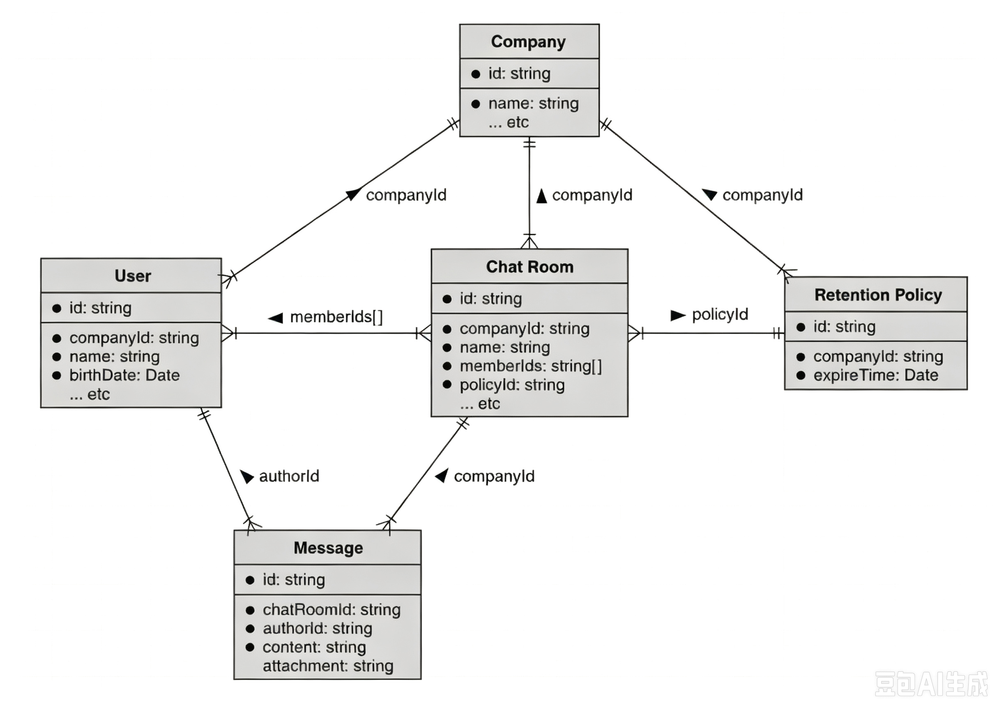<br/>

如图所示，User、ChatRoom 和 RetentionPolicy 资源都是 Company 资源的子级。
同样，Message 资源是 ChatRoom 资源的子级。
但 RetentionPolicy 是可复用的，可以应用于许多不同的房间。

希望你到现在已经对何时依赖引用而非层级关系（以及何时内联信息而不是使用引用作为指针）有了很好的理解。
但在探讨了这些主题之后，在设计 API 时我们往往会陷入一些下意识的反应。
让我们花点时间看看一些资源布局的反模式，以及如何避免它们。

<a id="anti-patterns"></a>
## 4.3 反模式

与大多数主题一样，存在一些常见的、一刀切的行为，在任何情况下都很容易遵循，但这些行为往往会将我们引入歧途。
毕竟，盲目遵循规则比深入思考 API 设计并决定资源安排及其相互关系的最佳方式要容易得多。

### 4.3.1 为一切创建资源

<ins>我们常常倾向于为 API 中想要建模的哪怕是最小的概念也创建资源。</ins>
通常，这种情况出现在建模过程中，当有人决定每一个成为数据类型的概念都必须是一个正式的资源时。
例如，假设我们有一个 API，可以在图像上存储注释。
对于每条注释，我们可能希望存储所包含的区域（可能以某种边界框的形式），以及构成实际注释内容的备注列表。

此时，我们有四个独立的概念需要考虑：图像、注释、边界框和备注。
问题在于，其中哪些应该作为资源，哪些应该在成为数据类型的阶段就止步？
一种下意识的反应是不管三七二十一，将一切都作为资源。
这最终可能看起来像图 4.13 所示的资源布局图。

现在我们有了四个完整的资源，它们拥有完整的资源生命周期。
换句话说，我们需要为每个资源实现五种不同的方法，总共 20 个不同的 API 调用。
这就引出了一个问题：这是正确的选择吗？
毕竟，我们真的需要为每个边界框赋予其自己的标识符吗？
我们真的需要为每个单独的备注提供独立的资源吗？

如果我们对这种布局再深入思考一下，可能会发现两个重要问题。
第一，BoundingBox 资源与注释是一对一的关系，因此将其单独作为一个资源几乎没有价值。
第二，Note 资源的列表不太可能变得异常庞大，因此将它们也表示为资源并不会带来太多好处。
如果我们考虑到这些，就会得到一个更简单的资源布局。

*图 4.13 将所有概念都构建为资源的资源布局图* <br/>
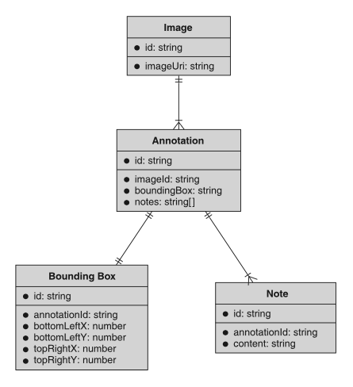<br/>

清单 4.2 依赖内联表示的简化接口

```typescript
// 这两个接口是真正的资源（注意标识符字段）
interface Image {
  id: string;
}

interface Annotation {
  id: string;
  boundingBox: BoundingBox;
  notes: Note[];
}

// 以下全部都不是资源；它们只是在Annotation资源内部通过API暴露出来的数据类型
interface BoundingBox {
  bottomLeftPoint: Point;
  topRightPoint: Point;
}

interface Point {
  x: number;
  y: number;
}

interface Note {
  content: string;
  createTime: Date;
}
```

这意味着我们实际上只需要考虑两个资源（而不是四个），这样既更容易理解，也更容易构建。
图 4.14 展示了更简化版本的资源布局图。

*图 4.14 两个简单资源而非四个资源的资源布局图* <br/>
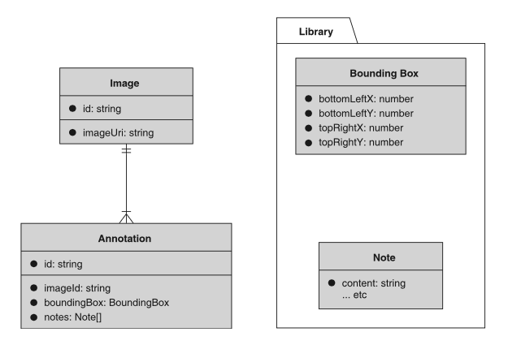<br/>

<ins>这里有一个很好的经验法则，可以避免两个问题。
首先，如果你不需要独立于其关联资源来与某个拟议的资源进行交互，那么将其仅作为数据类型可能就足够了。</ins>
在这个例子中，不太可能有人需要在图像本身的上下文之外来操作边界框，这意味着将其作为数据类型可能没有问题。

<ins>其次，如果你正在考虑的概念是你可能想要直接交互的（在这种情况下，你可能想要删除单个备注或单独创建新备注），
如果它可以被内联（参见 [第 4.2.2 节](#reference-or-inline) ），那么这可能是一个好的选择。</ins>
在这个例子中，Note 资源足够小，并且预计不会增长为每个注释的一个大型集合，
这意味着将它们内联而不是表示为独立资源可能是安全的。

<a id="deep"></a>
### 4.3.2 过深的层级结构

下一个需要避免的常见反模式是专门针对层级关系的。
<ins>层级关系往往看起来非常强大且有用，以至于我们试图在任何可能的地方都使用它。
然而，过深的层级结构可能会令所有相关方感到困惑且难以管理。</ins>

例如，假设我们正在构建一个系统来管理大学的课程目录。
我们需要跟踪不同的大学、课程所在的学院或项目（例如护理学院或工程学院）、可用的课程、开设课程的学期，以及各种课程文档（例如教学大纲）。
一种跟踪所有这些信息的方法是将所有内容放在一个单一的层级结构中，如图 4.15 所示。

*图 4.15 具有深层层级结构的课程目录* <br/>
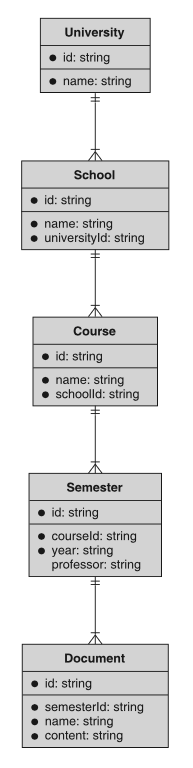<br/>

虽然从技术上讲，这样做是可以正常工作的，但要理清并在脑海中记住所有不同的父级关系是相当困难的。
这也意味着，为了找到一份文档，
我们现在需要知道相当多的信息（关于此主题的更多讨论请参见 [第 6.3.6 节](ch6.md#hierarchy-and-uniqueness-scope) ），
而这些信息可能难以存储和回忆。
但这里更大的问题是，使用层级结构的好处对于完成这项工作来说并非真正必要。
换句话说，我们或许可以在没有这么多层级的情况下，创建同样优秀的 API。

如果我们决定关键部分是大学、课程和文档呢？
在这种情况下，学院成为课程上的一个字段，学期也是如此。
我们通过质疑层级中的学院和学期级别是否真的如此关键来做到这一点。

例如，我们打算利用层级行为来做什么？
我们打算经常删除学院吗？（可能不会。）学期呢？（同样，可能也不会。）
最可能的情况是，我们希望查看给定课程曾列出的所有学期。
但我们可以通过基于课程标识符进行过滤来实现这一点，同样地，通过给定的学院 ID 来列出课程也是如此。

请记住，这并不是说我们应该完全抛弃这些资源。
就学期而言，我们不太可能需要列出可用学期用于探索目的，但学院可能值得保留。
建议的更改是将学院和课程之间的关系从层级关系更改为引用关系。
这个新的（更浅的）层级结构如图 4.16 所示。

*图 4.16 具有更浅层级结构的课程目录* <br/>
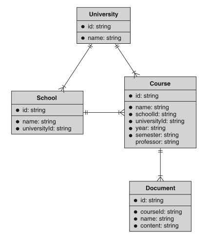<br/>

通过以这种方式（即更浅的方式）安排资源，我们仍然可以执行诸如授予对给定课程实例的所有文档的访问权限，或列出给定学期的所有课程等操作，但我们已经将层级结构缩减到真正能从中受益的部分。

### 4.3.3 一切皆内联

随着非关系型数据库的出现，特别是大规模键值存储系统，人们往往倾向于反规范化（或内联）所有数据，
包括那些在过去会被整齐地组织到各个表中，并通过复杂的 SQL 查询进行连接的数据。
<ins>虽然有时将信息内联到单个资源中，而不是将一切都作为独立资源是合理的（正如我们在 [第 4.3.2 节](#deep) 中所了解的），
但将过多的信息折叠到单个资源中，其危害不亚于将每一小块信息都分离成独立的资源。</ins>

<ins>一个重要的原因与数据完整性有关，这也是非关系型数据库中反规范化 schema 常见的问题。</ins>
例如，假设我们正在构建一个图书馆 API，用于存储由不同作者撰写的书籍。
一种选择是拥有两个资源，Book 和 Author，其中 Book 资源指向 Author 资源，如图 4.17 所示。
如果我们改为内联这些信息，我们可能会将作者姓名（和其他信息）直接存储在 Book 资源上，如图 4.18 所示。

*图 4.17 将 Author 作为独立资源的 Book* <br/>
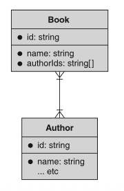<br/>

*图 4.18 将作者信息内联的 Book 建模* <br/>
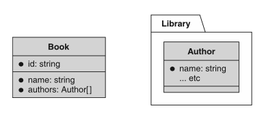<br/>

正如我们之前了解到的（参见 [第 4.2.2 节](#deep) ），像这样内联数据可能很有价值，但也可能导致一些实际问题。
例如，当你更新某本书的一位作者的姓名时，是否会更新该作者所写过的所有书籍中的姓名？
答案很可能取决于你的具体实现，但我们必须提出这个问题本身就意味着它可能会引起混淆。
<ins>换句话说，当我们内联那些仍将在其他资源之间共享的数据时（例如，写过好几本书的作者），我们就打开了一个可怕的 “潘多拉魔盒”，我们必须决定 API 的用户应如何更新这些共享数据（例如，作者的姓名）。</ins>
虽然有一些很好的方法可以解决这些问题，但这是我们一开始就不应该去操心的问题。

<a id="exercises"></a>
## 4.4 练习

1. 假设你正在构建一个书签 API，你可以为特定的在线 URL 创建书签，并将它们整理到不同的文件夹中。
你会将其建模为两个独立的资源（Bookmark 和 Folder），还是建模为单个资源（例如 Entity），
并通过内联类型字段来指示它是充当文件夹还是书签？

2. 想出一个示例，并绘制一个实体关系图，其中包含多对多关系、一对多关系、一对一关系以及可选的一对多关系。
请务必为连接符使用正确的符号。

<a id="summary"></a>
## 本章小节

- 资源布局指的是 API 中资源的排列方式以及资源之间的关系。

- 虽然你可能倾向于连接 API 中的每个资源，但请克制这种冲动，只有在这些关系为 API 提供重要功能时才存储它们。

- 有时，为某个概念存储独立的资源是合理的。
而其他时候，将数据内联并将该概念保留为数据类型则更好。
该决定取决于你是否需要与该概念进行原子性的交互。

- 避免过深的层级关系，因为它们可能难以理解和管理。
