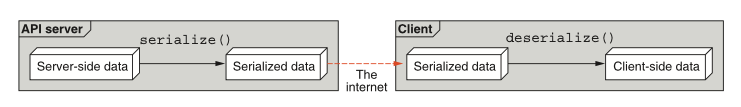

# 第 5 章 数据类型与默认值

<div style="background:#f7f5e6; padding:24px; border-radius:4px; color:#405a73;">

**本章内容**
- 我们所说的数据类型指的是什么
- 空（null）值与完全缺失的值有何不同
- 对各种基本类型和集合类型的探索
- 如何处理各种数据类型的序列化
</div><br/>

在设计任何 API 时，我们总是需要考虑我们希望作为输入接受、理解并可能存储的数据类型。
有时这听起来相当直接：一个名为 “name” 的字段可能只是一个字符串。
然而，这个问题背后隐藏着复杂的细节。
例如，字符串应如何表示为字节（事实证明对此有很多种选择）？
如果在 API 调用中省略了 name 字段，会发生什么？
这与提供一个空名称（例如 { "name": "" }）有何不同？
在本章中，我们将探讨在设计或使用 API 时几乎肯定会遇到的各种数据类型，如何最好地理解其底层数据表示，以及如何以合理且直接的方式处理各种类型的默认值。

<a id="introduce"></a>
## 5.1 数据类型简介

数据类型几乎是每种编程语言的一个重要方面，它告诉程序如何处理一块数据，
以及它应如何与语言或类型本身提供的各种运算符进行交互。
即使在动态类型语言中（其中单个变量可以充当多种不同的数据类型，而不是仅限于一种），
在某个时间点的类型信息仍然相当重要，它决定了编程语言应如何处理该变量。

<ins>然而，在设计 API 时，我们必须跳出单一编程语言的思维模式，
主要是因为我们的 API 的一个主要目标是让任何人使用任何编程语言都能与服务进行交互。</ins>
我们实现这一点的标准方式是依赖于某种序列化协议，该协议将我们在所选编程语言中的结构化数据表示，转换为与语言无关的序列化字节表示，然后再发送给请求它的客户端。
在另一端，客户端将这些字节反序列化，并转换回内存中的表示形式，以便从他们使用的语言（可能与我们的语言相同，也可能不同）与之交互。
图 5.1 概述了这一过程。

*图 5.1 数据从 API 服务器流向客户端* <br/>
<br/>

虽然这种序列化过程提供了巨大的好处（本质上允许 API 被任何编程语言使用），但它并非没有缺点。
最大的问题在于，由于每种语言的行为方式都有所不同，因此某些信息会在转换过程中丢失。
<ins>换句话说，由于不同编程语言的特性和功能存在差异，所有序列化协议都会以某种方式存在 “有损” 的情况。</ins>

这让我们回到数据类型及其在 API 中使用方式的重要性。
<ins>简而言之，在考虑使用 Web API 的用户时，仅仅依赖我们所选编程语言提供的数据类型从根本上是不够的。
相反，我们必须考虑所选序列化格式（最常见的是 JSON）所提供的数据类型，
以及在该格式无法满足我们需求时如何扩展该格式。</ins>
这意味着我们需要决定我们想要发送给客户端和从客户端接收的数据的类型，并确保它们得到充分的文档记录，
以便客户端永远不会对其行为感到意外。

这并不是说 Web API 必须具有像关系数据库系统那样的严格 schema；
毕竟，现代开发工具最强大的地方之一在于动态无 schema 结构和数据存储所提供的灵活性。
然而，重要的是要考虑我们正在交互的数据的类型，并在必要时通过额外的注解加以澄清。
如果没有这些额外的数据上下文，我们可能会陷入困境，只能猜测客户端的实际意图。
例如，a + b 对于数值（例如 2 + 4 可能得到 6）可能以一种方式运作，但对于文本值（例如 "2" + "4" 可能得到 "24"）可能表现得完全不同。
如果没有这种类型上下文，当客户端使用 + 运算符时，我们将被迫猜测其意图：是加法还是拼接？
如果一个值是数字而另一个是字符串呢？
这可能会导致更多的猜测。
但如果一个值被完全省略了呢？

### 5.1.1 缺失值与 null 值

令人惊讶的是，最令人困惑的方面之一来自于数据缺失而非存在的情况。
首先，在许多序列化格式中有一个 null 值，它是一个标志，表示非值（例如，一个字符串可以是普通值，也可以是字面量 null）。
那么，当尝试将 null 和 2 相加时，API 应如何表现？
任何使用支持此类 null 值的序列化格式的 API 都需要决定如何处理这种类型的输入。
它应该假装 null 在数学上等价于 0 吗？
那么尝试将 null 和 "value" 相加呢？在这种情况下，null 是否应被解释为空字符串 ("") 并尝试进行拼接？

更糟糕的是，动态数据结构（例如 JSON 对象）带来了一个新的问题：如果值根本不存在怎么办？
换句话说，如果存储该值的键完全缺失，而不是提供的值恰好被显式设置为 null，那该怎么办？
这是否与显式的 null 值处理方式相同？
为了理解这意味着什么，假设你有一个 Fruit 资源，其中应包含 name 和 color 字段，两者都是字符串数据类型。请考虑以下 JSON 对象示例，以及 API 可能为该资源的 color 值推断出的值：

```typescript
fruit1 = { name: "Apple", color: "red" };
fruit2 = { name: "Apple", color: "" };
fruit3 = { name: "Apple", color: null };
fruit4 = { name: "Apple" };
```

如你所见，第一个 color 值是明确的（fruit1.color == "red"）。
然而，我们应该如何处理其他情况呢？
空字符串颜色 ("") 是否与显式的 null 颜色处理方式相同（fruit2.color 与 fruit3.color 的处理方式有区别吗）？
缺少 color 值的那个 fruit 呢？
fruit3.color 与 fruit4.color 的处理方式有区别吗？
这些可能看起来只是 JSON 的特性；
然而，它们确实存在于许多其他序列化格式中（例如，Google 的 Protocol Buffers \[ https://opensource.google/projects/protobuf ] 在这方面有一些令人困惑的行为），并且它们提出了每个 API 都必须解决的问题，否则可能会变得极其不一致，令 API 使用者感到困惑。
换句话说，你不能简单地假设序列化库会做正确的事情，因为几乎可以肯定每个人都会使用不同的序列化库！

在本章中，我们将逐一介绍所有常见的数据类型，从简单的类型（有时称为基本类型）开始，逐渐过渡到更复杂的类型（例如映射和集合）。你应该已经熟悉其中的大多数概念，因此重点将不在于每种数据类型的基础知识，而更多在于将它们用于 Web API 时必须考虑的事项。我们将深入探讨每种数据类型需要注意的各种“陷阱”，以及如何最好地为任何 API 解决这些问题。我们还将坚持使用 JSON 作为首选的序列化格式，但大多数建议将适用于支持动态数据结构（同时使用推断类型和显式类型定义）的任何格式。让我们从最简单的开始：真和假值。

<a id="booleans"></a>
## 5.2 布尔值

在大多数编程语言中，布尔值是最简单的可用数据类型，表示两个值之一：true 或 false。
由于值集有限，我们倾向于依赖布尔值来存储标志或简单的 “是/否” 问题。
例如，我们可能会在聊天室中存储一个标志，表示该房间是否已归档，或者是否允许聊天机器人在该房间中。

*清单 5.1 带有布尔标志的 ChatRoom 资源* <br/>

```typescript
interface ChatRoom {
  id: string;
  // ...
  // 此处还会有聊天室的大量其他字段
  archived: boolean;
  // 该标记用于标识聊天室是否已归档
  allowChatbots: boolean;
  // 用于说明聊天室是否允许聊天机器人接入
}
```

然而，布尔标志在未来可能会变得非常受限，因为一个 “是/否” 问题可能会演变成一个更普遍的问题，需要比布尔字段所能提供的更细致的答案。
例如，未来聊天室可能允许许多不同类型的参与者，而不仅仅是普通用户和聊天机器人。
在这种情况下，我们当前的设计将导致一长串允许（或不允许）的每种类型的列表，例如 allowChatbots、allowModerators、allowChildren、allowAnonymousUsers 等等。
如果这种情况可能发生，那么避免使用一堆布尔标志，
而是依赖不同的数据类型或结构来定义特定聊天室允许或不允许的参与者类别，实际上可能更合理。

假设布尔字段是某个变量的正确选择，那么还有其他一些有趣的方面需要考虑。
布尔字段的名称中隐藏着该字段是正向还是负向的陈述。
在 allowChatbots 的例子中，该字段的 true 值表示允许聊天机器人进入聊天室。
但同样可以很容易地命名为 disallowChatbots，其中 true 值将禁止聊天机器人进入聊天室。
为什么要选择其中一种而不是另一种呢？

<ins>一般来说，正向布尔字段对我们大多数人来说最容易理解，原因很简单：人类在处理双重否定时需要多动点脑筋。
而负向字段的 false 值正是双重否定。</ins>
例如，假设字段是 disallowChatbots。
你如何检查聊天机器人是否被允许进入给定的聊天室？

*清单 5.2 如果允许，将聊天机器人添加到房间的函数* <br/>

```typescript
function addChatbotToRoom(chatbot: Chatbot,
                          roomId: number): void {
  let room = getChatRoomById(roomId);
  // 此处检查是否禁止聊天机器人接入。如果为 false，则允许加入该聊天室
  if (room.disallowChatbots === false) {
    chatbot.join(room.id);
  }
}
```

这很难理解吗？可能不是。
但与简单得多的版本（ `if (room.allowChatbots) { ... }` ）相比，它是否增加了认知负担？
对我们大多数人来说，可能是的。
仅基于这一点，选择正向布尔标志几乎总是一个好主意。
但在某些情况下，依赖负向标志可能是合理的，这主要是在我们考虑字段的默认值或未设置值时。

例如，在某些语言或序列化格式中（例如，直到最近，Google 的 Protocol Buffers v3），许多基本类型，如布尔字段，只能具有零值，而不能具有 null 或缺失值。
正如你可能猜到的，对于布尔值，这个零值几乎总是等同于 false。
这意味着，当我们考虑在创建聊天室时 allowChatbots 字段的值时，如果没有进一步干预，聊天室不允许聊天机器人（defaultChatRoom.allowChatbots == false）。
但我们无法区分用户所说的 “我没有设置这个值，所以请按你认为最好的方式处理”
（即 null 或缺失值）和 “我不想允许聊天机器人”（即显式的 false 值）。
在这两种情况下，值都只是 false。我们该怎么办？

<ins>虽然这个问题有很多解决方案，但一个常见的选择是依靠布尔字段名称的正向或负向方面来得出 “正确” 的默认值。
换句话说，我们可以为布尔字段选择一个名称，使得零值提供我们想要的默认值。</ins>
例如，如果我们希望默认允许匿名用户，我们可能会决定将字段命名为 disallowAnonymousUsers，这样零值（false）就会产生我们想要的默认值（允许匿名用户）。
不幸的是，这种选择将默认值锁定在字段名称中，这阻碍了未来的灵活性（即，你以后无法更改默认值），
但正如他们所说，非常时期需要非常手段。

<a id="numbers"></a>
## 5.3 数字

从简单的 “是/否” 问题稍微复杂一些，数值允许我们存储各种有价值的信息，
例如计数（例如 viewCount）、大小和距离（例如 itemWeight）或货币值（例如 priceUsd）。
总的来说，对于任何我们可能想要进行算术计算（或者即使这些计算只有在逻辑上合理）的东西，数字字段是理想的数据类型选择。

有一个值得注意的例子实际上并不适合这种数据类型：数字标识符。
这可能会令人惊讶，因为许多数据库系统（几乎所有的关系数据库系统）使用自动递增的整数值作为其行的主键标识符。
那么，为什么我们不在 API 中也使用标识符呢？

<ins>虽然我们可能由于各种原因（例如性能或空间限制）在底层仍然使用数字字段，但在 API 表面，数字类型最好用于那些因其实际数字属性而能提供某种形式的算术益处的值。</ins>
换句话说，如果一个 API 暴露的项目具有以克为单位的重量值，我们可以想象将所有这些值相加，以确定一组项目的总克重。
另一方面，将一组数字标识符相加并对该值进行某些操作通常没有任何意义。
相反，一堆数字 ID 的加法很可能毫无用处。
因此，重要的是依赖于数字数据类型的数字或算术益处，
而不是依赖于它们恰好只用数字字符（可能偶尔带个小数点）编写这一事实。
<ins>一般来说，那些碰巧看起来像数字但行为更像令牌或符号的值，或许应该使用字符串值（参见 [第 5.4 节](#strings) ）。</ins>

综上所述，在 API 中使用数值时，有几个事项需要考虑。
让我们从如何为这些数字字段定义边界或可接受值的范围开始。

### 5.3.1 边界

在为数字字段定义边界时，无论是整数、小数（或其他数学表示形式，如分数、虚数等），重要的是要考虑上限或最大值、下限或最小值以及零值。
由于这些因素相互影响，我们先考虑绝对值的边界，然后再决定是否同时利用该范围的负数和正数部分。

谈到边界，我们的主要关注点在于它们的大小。
换句话说，所有数字最终都需要存储在某处，这意味着我们需要知道为这些值分配多少空间（以位为单位）。
对于小整数，8 位可能就足够了，具有 256 个可能值（–127 到 127）。
对于大多数常见的数值，32 位通常是一个可接受的大小，大约有 40 亿个可能值（从负 20 亿到正 20 亿）。
对于我们可能关心的多数事物，64 位是一个安全的大小，大约有 1800 亿亿个可能值（从负 900 亿亿到正 900 亿亿）。
当我们引入浮点数时，这个范围会变得更加复杂，因为有许多不同的表示形式，这些值的存储空间可达 256 位，但关键在于，通常总有一种表示形式可以满足你在 API 中所设想的范围。

虽然这些都是可行的选择，但你可能会问，为什么我们要关心数据库中数字的大小呢？
毕竟，API 的目的不就是抽象掉所有这些细节吗？
没错；但之所以重要，是因为不同的计算机和不同的编程语言处理数字的方式远非统一。
例如，JavaScript 甚至没有真正的整数类型，而只有一个 number 类型来处理该语言的所有数值。
此外，许多语言以截然不同的方式处理超大数字。
例如，在 Python 2 中，int 类型能够存储 32 位整数，而 long 类型可以处理任意大的数字，至少存储 36 位。
简而言之，这意味着如果 API 响应向消费者发送一个非常大的数字，接收端所使用的语言可能无法正确解析和理解它。
此外，这些潜在巨大数字的接收方需要知道分配多少空间来存储它们。
简而言之，边界将是非常重要的。

因此，常见的做法是在内部对整数依赖 64 位整数类型，除非有充分的理由不这样做。
总的来说，即使目前你可能远远用不到 64 位的范围，软件中绝对确定的事情也很少，
因此设置留有增长余地的上下限要安全得多。
