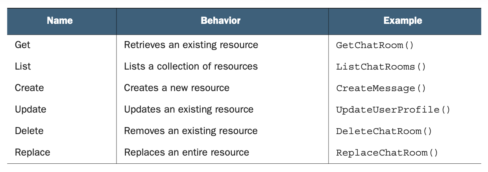
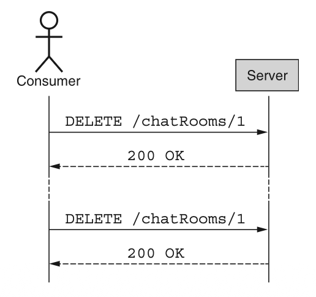
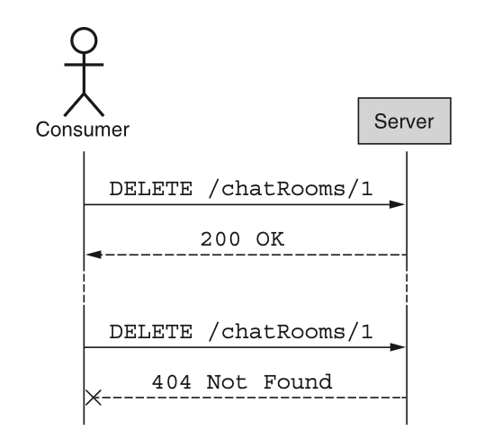
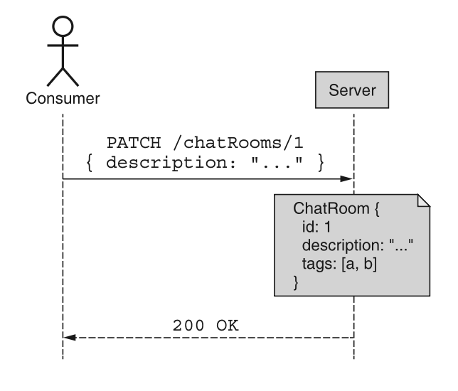
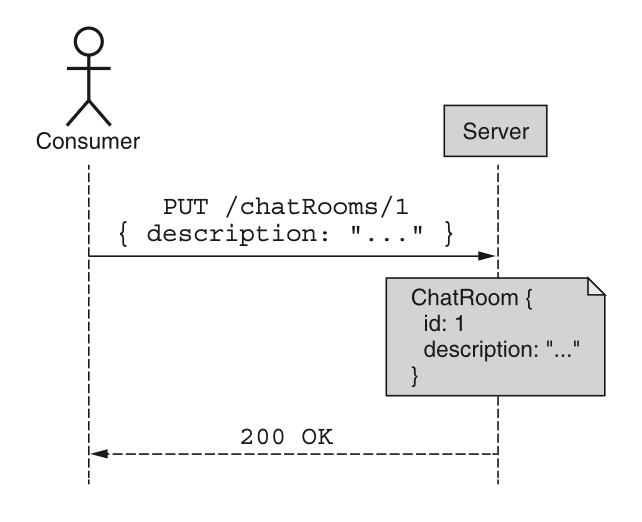

# 第 7 章 标准方法

<div style="background:#f7f5e6; padding:24px; border-radius:4px; color:#405a73;">

**本章内容**
- 什么是幂等性及其副作用
- 所有标准方法（get、list、create、update、delete）的概述
- 一个额外的半标准方法：replace
- 依赖标准方法的优缺点

</div><br/>

正如我们在 [第 1 章](ch1.md) 中所学，优秀 API 的特征之一是可预测性。
构建可预测 API 的一个好方法是仅改变可用的资源，同时保持一组一致的特定操作（通常称为方法），让每个人都能对这些资源执行这些操作。
这意味着这些方法中的每一个在表现和行为上必须精确一致，直到最后一个细节；
否则，当相同的操作应用于多个资源时表现不一致，可预测性就会完全丧失。
本章探讨了在 API 的资源中实现这些标准方法时应遵循的具体规则。

<a id="motivation"></a>
## 7.1 动机

一个设计良好的 API 最有价值的方面之一是，用户能够应用他们已有的知识来更快地理解 API 的工作原理。
换句话说，用户需要学习 API 的内容越少，他们就能越快开始使用它来实现自己的目标。
实现这一点的一种方式（在 RESTful API 中经常体现）是，对 API 定义的多种资源使用一组标准的操作（或方法）。
用户仍然需要了解 API 中的资源，但一旦他们建立对这些资源的理解，他们就已经熟悉了一组可以对这些资源执行的标准方法。

不幸的是，这只有在每个标准方法都真正标准化的情况下才有效，无论是在整个 API 范围内，还是在更广泛的 Web API 范围内。
幸运的是，REST 标准已经存在了相当长的时间，并为这种级别的 Web API 标准化奠定了基础。
基于此，本章概述了所有标准方法以及应适用于每种方法的各种规则，并从 REST 规范中汲取了大量灵感。

<a id="overview"></a>
## 7.2 概述

由于我们的目标是推动更高的一致性并最终得到一个更可预测的 API，让我们从查看拟议的标准方法列表及其总体目标开始，如表 7.1 所示。

*表 7.1 标准方法概述* <br/>
<br/>

<ins>虽然这些方法及其描述看起来可能相当直接，但实际上有大量的信息是缺失的。
而当信息缺失时，就会导致模糊性。
这种模糊性最终会导致对每种方法应如何运作产生广泛的解释差异，从而导致相同的 “标准” 方法在不同的 API 中，甚至在同一个 API 的不同资源中，表现完全不同。</ins>

让我们以单个方法为例仔细看一下：delete。
表 7.1 中的行为描述说此方法用于移除一个现有资源。
换句话说，我们可能期望，如果一个资源被创建了，然后用户删除了它，我们应该得到相当于 200 OK HTTP 响应码的结果，然后继续我们的正常流程。
但如果该资源尚不存在呢？
响应是否仍应为 OK？
还是应该返回 404 Not Found HTTP 错误？

有些人可能会争辩说，该方法的意图是移除资源，因此如果资源不再存在，那么它已经完成了工作，应该返回 OK 结果。
另一些人则认为，区分结果（执行方法时资源不再存在）和行为（资源确实是被此方法的执行所移除）很重要，
因此尝试移除一个不存在的资源应该返回 Not Found 错误，表明该资源现在不存在，而且在执行此方法时它也不存在。

此外，如果资源确实存在，但试图执行该方法的用户没有访问权限，该怎么办？
结果应该是 404 Not Found HTTP 错误？
还是 403 Forbidden HTTP 错误？
这些错误码是否应根据资源是否实际存在而有所不同？
归根结底，这种微妙的设计选择旨在防止一个重要的安全问题。
在这种情况下，如果一个未经授权的用户尝试检索某个资源，他们可以通过接收 404 Not Found 响应来确定该资源是否真正不存在，
或者通过接收 403 Forbidden 响应来确定该资源确实存在，只是他们没有访问权限。
通过这样做，一个完全没有访问权限的人也可能探测系统以找出哪些资源存在，并可能在以后针对这些资源进行攻击。

<ins>没有理由让每个 API 设计者都一遍又一遍地重新回答这些问题。
相反，本章提供的指南提供了一些标准答案，以确保跨标准方法的一致性（并防止安全泄漏或其他问题），并能够随着 API 随时间扩展而优雅地发展。
但与其只是列出一堆规则，不如让我们在下一节中深入探讨这些细微且微妙的问题。</ins>

<a id="implementation"></a>
## 7.3 实现

在深入探讨每个标准方法的具体细节之前，让我们先来研究适用于所有标准方法的横切关注点，从一个显而易见的问题开始：是否所有资源都必须支持所有标准方法？
换句话说，如果我的某个资源是不可变的，该资源是否仍应支持 update 标准方法？或者如果它是永久性的，它是否仍应支持 delete 标准方法？

### 7.3.1 应支持哪些方法？

由于标准化一组方法的目标完全是为了推动一致性，这个问题竟然还有讨论的余地，可能看起来有点奇怪。
换句话说，如果整章都在讨论以完全相同的方式实现一组标准行为，却又允许某些资源完全选择不实现这些方法，这似乎有些自相矛盾。
这说得有道理，但归根结底，实用性仍然是 API 设计的关键组成部分，而且根本无法逃避某些资源可能不希望支持所有标准方法的现实场景。
<ins>简而言之，并非每个标准方法对每种资源类型都是必需的。</ins>

不过，不同场景之间也有所不同，区分 “方法完全不应被支持”（例如，返回相当于 405 Method Not Allowed HTTP 错误）的情况和 “方法只是在这个特定实例上不被允许”（返回相当于 403 Forbidden HTTP 错误）的情况将变得很重要。
但绝对不应该发生的情况是，API 简单地省略某个特定路由（例如 update 方法），并在有人尝试对该资源使用该方法时返回 404 Not Found HTTP 错误。
如果 API 这样做，其暗示是该资源不存在，但这并非事实：技术上不存在的是该资源类型的方法。

<ins>决定是否支持每个标准方法的规则是什么？</ins>
虽然没有硬性要求，但一般指导原则是，每个资源上都应存在每个标准方法，除非有充分的理由不这么做（并且该理由应被记录和解释）。
例如，如果一个资源实际上是一个单例子资源（参见 [第 12 章](ch12.md) ），该资源是单例的，并且仅因其父级的存在而存在。
因此，只有 get 和 update 标准方法是有意义的；其余方法可以完全忽略。
<ins>这也是方法在根本上不合理的情况的一个例子，因此应返回相当于 405 Method Not Allowed HTTP 错误。</ins>

在其他情况下，某些方法可能对资源的特定实例没有意义，但对该资源类型在概念上仍然有意义。
例如，如果存储系统在特定目录上设置了 “写保护” 标志，防止对该目录内的资源进行修改，API 仍应支持标准方法（例如 update 和 delete），但当有人尝试对资源执行这些操作而当前不被允许时，应返回一个错误。
这种情况也涵盖了可能被认为是永久性的（即不应被删除）或不可变的（即不应被修改）的资源类型。
仅仅因为它们现在是永久性的和不可变的，并不意味着它们将来也不会变。
<ins>因此，最合理的做法是实现全套标准方法，并在任何人尝试修改或删除它们时简单地返回 403 Forbidden 错误码。</ins>

现在我们已经有了一些关于何时定义哪些方法的指南，让我们来看看标准方法的核心假设之一：没有副作用。

<a id="idempotence-and-side-effects"></a>
### 7.3.2 幂等性与副作用

由于标准方法的一个关键特性是可预测性，因此标准方法应完全按照其声明的那样执行，仅此而已，这应该不足为奇。
简而言之，标准方法不应有任何副作用或意外行为。
<ins>此外，某些方法具有一种称为幂等性的特定属性，它表明多次重复相同的请求（使用相同的参数）是否与单个请求具有相同的效果。
违背对此属性在特定方法上的普遍假设可能导致灾难性后果，例如数据丢失或损坏。</ins>

确定什么是可接受的、什么不违反 “无副作用” 规则可能很复杂，因为许多 API 都存在需要额外行为的场景，这些行为超出了简单标准方法的指示范围，而且通常看起来标准方法似乎是容纳这些行为的合适位置。
当额外行为很微妙或实际上并未改变任何有意义的状态时，这可能会导致更多的混淆，以至于我们可能仍然认为该方法是幂等的。

<ins>什么构成副作用？
有些是显而易见的，例如，在电子邮件 API 中，创建一封电子邮件并将信息存储在数据库中不会被视为副作用。
但如果该标准 create 方法还通过 SMTP 连接到服务器以发送该电子邮件，这将被视为副作用（因此应避免作为标准 create 方法的一部分）。</ins>

那么请求计数器呢？
每次你检索一个资源时，它都会递增一个计数器，以跟踪该资源通过标准 get 方法被检索了多少次？
从技术上讲，这意味着该方法不再是幂等的，因为底层的状态正在发生变化，但这真的是一个很大的问题吗？
复杂的答案是 “视情况而定”。
计数器更新是否会对性能产生影响，导致请求显著变慢或波动更大？
如果计数器更新因任何原因失败，会发生什么？
是否可能出现错误响应，仅仅因为计数器出现技术问题阻止其更新而导致资源检索失败？

最终，正如我们将在 [第 24 章](ch24.md) 中关于定义版本控制策略时所学到的，你对什么构成副作用的判断在某种程度上是开放解释的。
<ins>虽然应不惜一切代价避免明显的副作用（例如连接到第三方或外部服务，或触发可能导致标准方法失败或导致部分执行请求的额外工作），
但根据消费者的期望，一些更微妙的情况对 API 来说可能是合理的。</ins>

现在我们已经涵盖了标准方法的总体方面，让我们深入探讨每种方法，并研究每种方法需要考虑的一些事项，从只读方法开始，然后继续其余方法。

<a id="get-method"></a>
### 7.3.3 Get

<ins>标准 get 方法的目标非常直接：服务在某处存储了资源记录，此方法返回该记录中存储的数据。
为实现此目标，该方法只接受一个输入：所请求资源的标识符。</ins>
换句话说，这严格来说是存储数据的键值查找。

*清单 7.1 标准 get 方法示例*

```typescript
abstract class ChatRoomApi {
    // 标准 get 方法总是通过唯一标识符获取一个资源。
    @get("/{id=chatRooms/*}")
    // 标准 get 方法的返回结果应当始终是资源本身。
    GetChatRoom(req: GetChatRoomRequest): ChatRoom;
}
```

与大多数不主动更改底层数据的方法一样，此方法应是幂等的，这意味着你可以自由地多次运行它，并且假设没有其他并发更改，每次结果应相同。
这也意味着此方法，像所有标准方法一样，不应有任何明显的副作用。

虽然关于标准 get 方法还有很多可以讨论的内容，例如检索特定的资源版本，但我们将这些主题留待以后的具体设计模式中讨论。
现在，让我们继续讨论下一个只读标准方法：list。

<a id="list-method"></a>
### 7.3.4 List

<ins>由于标准 get 方法纯粹是键值查找，我们显然需要另一种机制来浏览可用的资源，而 list 标准方法正是为此而生。
在 list 方法中，你提供一个需要浏览的特定集合，结果返回属于该集合的所有资源的列表。</ins>

需要注意的是，标准 list 方法与标准 get 方法在目标上有所不同：我们不请求特定的资源，而是请求属于特定集合的资源列表。
这个集合本身可能属于另一个特定资源，但并不总是如此。
例如，考虑我们可能有一组 ChatRoom 资源，每个资源包含一组 Message 资源。
列出 ChatRoom 资源需要以 chatRooms 集合为目标，而列出给定 ChatRoom 的 Message 资源则需要以属于该特定 ChatRoom 的 messages 集合为目标。

*清单 7.2 标准 list 方法示例*

```typescript
abstract class ChatRoomApi {
    // 当列出属于顶层集合的资源时，不存在目标资源！
    @get("/chatRooms")
    ListChatRooms(req: ListChatRoomsRequest): ListChatRoomsResponse;

    // 当列出某个资源的子集合下的资源时，目标就是父资源（本例中即 ChatRoom 资源）。
    @get("/{parent=chatRooms/*}/messages")
    ListMessages(req: ListMessagesRequest): ListMessagesResponse;
}

interface ListChatRoomsRequest {
    filter: string;
}

interface ListChatRoomsResponse {
    results: ChatRoom[];
}

interface ListMessagesRequest {
    parent: string;
    filter: string;
}

interface ListMessagesResponse {
    results: Message[];
}
```

虽然列出资源集合的概念可能看起来与标准 get 方法一样简单，但实际上它比表面看起来要复杂得多。
虽然我们不会讨论此方法的所有方面（例如，某些方面将在未来的设计模式中涉及，如 [第 21 章](ch21.md) ），但这里有几个主题值得讨论，从访问控制开始。

#### 访问控制

虽然深入讨论细节没有太大意义，但有一个重要的方面值得涵盖：当不同的请求者拥有对不同资源的访问权限时，list 方法应如何表现？
换句话说，如果你想列出 API 中所有可用的 ChatRoom 资源，但你只有查看其中部分资源的权限，该怎么办？
API 应该怎么做？

<ins>显然，API 方法的行为一致性很重要，但这是否意味着每个响应对于每个请求者都必须相同？
在这种场景下，答案是否定的。
响应应该只包含请求者有权访问的资源。</ins>
这意味着，正如你所料，不同的人列出相同的资源会得到不同的数据视图。

如果可能，资源布局可以设计为最大限度地减少此类情况（例如，确保单用户资源具有单独的父级），从而在列出请求者无权访问的资源时，直接返回简单的 403 Forbidden 错误响应；
然而，根本无法避免用户有权访问集合中的某些条目但不是全部的情况。

#### 结果计数

接下来，常常会有一种诱惑，即在列出结果的同时包含条目的计数。
虽然这对于用户界面消费者来说可能很好，可以显示匹配结果的总数，但随着时间的推移，列表中的条目数量增长超过最初的预期，这往往会带来更多的麻烦。
对于分布式存储系统来说，这尤其复杂，因为它们并非为快速提供匹配特定查询的计数而设计。
<ins>简而言之，在标准 list 方法的响应中包含条目计数通常是一个坏主意。</ins>

如果某种形式的结果计数绝对必要，或者集合中涉及的数据保证保持足够小，以便在没有极端计算负担的情况下处理计数结果，那么使用某种估计值并依赖它来指示结果总数，几乎总是比精确计数更高效。
<ins>如果计数是估计值而非精确计数，那么将该字段按其实际性质命名（例如 resultCountEstimate）也很重要，以避免对值的准确性产生潜在混淆。
为了给意外情况留出空间，如果你决定结果计数既重要又可行，仍然建议将该字段命名为估计值（即使该值是精确计数）。
这意味着，如果你将来需要改为估计值以减轻存储系统的负载，你可以自由地这样做，而不会给任何人带来混淆或困难。</ins>
毕竟，精确计数在技术上只是一个非常准确的估计值。

#### 排序

出于类似的原因，对条目列表应用排序通常也不被鼓励。
就像显示结果计数一样，对结果进行排序的能力也是一个常见的 “锦上添花” 功能，特别是对于渲染用户界面的消费者而言。
不幸的是，在标准 list 方法中允许对结果进行排序，可能导致比显示结果计数更大的困难。

虽然在 API 生命周期的早期，允许排序可能很容易实现，因为数据量相对较小，但随着时间的推移，这几乎肯定会变得越来越复杂。
列表中返回更多条目需要更多服务器处理时间来进行排序，但最重要的是，对于从多个不同存储后端（如分布式存储系统中的情况）组合而成的列表，应用全局排序顺序是非常困难的。
例如，考虑尝试整合并排序分布在 100 个不同存储后端上的 10 亿个条目。
对于离线处理作业中的静态数据来说，这已经是一个复杂的问题（即使每个数据源先对其较小的那部分数据进行排序），但对于像实时 API 这样快速变化的数据集来说，则更加复杂。
此外，每次用户想要查看其资源列表时按需执行这种排序，很容易导致 API 服务器过载。

<ins>总而言之，这个小功能往往会在将来增加大量的复杂性，而对 API 消费者的价值相对较小。
因此，就像总结果计数一样，通常也是一个坏主意。</ins>

#### 过滤

<ins>虽然不鼓励对标准 list 方法中涉及的条目进行排序和计数，但对结果进行过滤以使其更有用是一个常见的功能，因此也是被鼓励的。
这是因为，应用过滤的替代方案（例如，请求所有条目然后再过滤结果）在处理器时间和网络带宽方面都极其浪费。</ins>

<ins>在实现过滤时，有一个重要的警告。
虽然设计一个严格类型的过滤结构来支持过滤（例如，具有针对各种条件的模式，以及 “and” 和 “or” 评估条件）可能很有诱惑力，但这种类型的设计通常不会很好地适应未来的变化。</ins>
毕竟，SQL 仍然接受查询作为简单字符串是有充分理由的。
正如我们在 [第 5 章](ch5.md) 中看到的枚举一样，随着我们扩展过滤的功能或不同类型，客户端需要升级其本地 schema 才能利用这些更改。
因此，虽然过滤是被鼓励的，但用于传达过滤器本身的最佳数据类型是字符串，然后可以由服务器解析并在返回结果之前应用，如果可能的话，将解析后的过滤器传递给存储系统，或者直接由 API 服务处理。
这个主题将在 [第 22 章](ch22.md) 中更详细地讨论。

到目前为止，我们一直专注于从 API 读取数据。
让我们换个角度，看看如何使用标准 create 方法将数据放入 API。

### 7.3.5 Create

如果 API 中没有数据，那么标准 get 方法（ [第 7.3.3 节](#get-method)）和标准 list 方法（ [第 7.3.4 节](#list-method) ）都没有任何用处。
而将数据传入任何 API 的主要机制是使用标准 create 方法。
<ins>标准 create 方法的目标很简单：给定关于某个资源的一些信息，在 API 中创建该新资源，以便可以通过其标识符检索它或通过列出资源发现它。</ins>
为了了解这可能是什么样子，清单 7.3 中显示了创建 ChatRoom 和 Message 资源的示例。
如你所见，请求（通过 HTTP POST 方法发送）包含有关资源的相关信息，而结果响应始终是新创建的资源。
此外，目标要么是父资源（如果可用），要么只是一个顶级集合（例如 "/chatRooms"）。

清单 7.3 标准 create 方法示例

```typescript
// 两种场景下，标准 create 方法都使用 POST HTTP 动词
abstract class ChatRoomApi {
    @post("/chatRooms")
    // 标准 create 方法总是返回新创建出来的资源
    CreateChatRoom(req: CreateChatRoomRequest): ChatRoom;

    @post("/{parent=chatRooms/*}/messages")
    // 标准 create 方法总是返回新创建出来的资源
    CreateMessage(req: CreateMessageRequest): Message;
}

interface CreateChatRoomRequest {
    resource: ChatRoom;
}

interface CreateMessageRequest {
    parent: string;
    resource: Message;
}
```

虽然创建资源背后的概念很简单，但有少数领域值得更详细地探讨，因为它们比表面看起来要复杂一些。
让我们从简要了解我们如何标识这些新创建的资源开始。

#### 标识符

正如我们在 [第 6 章](ch6.md) 中所学，对于新创建的资源，通常最好依赖服务器生成的标识符。
换句话说，我们应该让 API 本身为资源选择标识符，而不是试图自己选择一个。
话虽如此，在许多情况下，让 API 的消费者选择标识符更合理（例如，如果 API 被移动设备使用，该设备打算同步本地和远程资源集）。
在这些类型的场景中，允许消费者选择的 ID 是完全可接受的；但是，它们应遵循 [第 6 章](ch6.md) 中提供的指南。

如果必须在创建资源时提供资源标识符，则应通过设置资源接口本身的 ID 字段来完成。
例如，要创建一个具有特定标识符的 ChatRoom 资源，我们会发出一个类似 POST /chatRooms { id: 1234, ... } 的 HTTP 请求。
正如我们稍后将看到的，使用半标准的 replace 方法有另一种选择，但由于并非所有 API 都期望支持该方法，因此最好将重点放在将标识符设置为标准 create 方法的一部分。

#### 一致性

多年前，几乎可以保证你创建的每一比特数据都会存储在某个地方的单个数据库中，通常是像 MySQL 或 PostgreSQL 这样的关系型数据库服务。
然而，如今有更多的存储选项可以水平扩展，而不会随着数据集的增长而崩溃。
换句话说，当你配置的数据库有太多数据时，你可以简单地启用更多存储节点，系统将在更大的数据规模下表现更好。

这些系统对于海量数据集和超大量请求的困扰（以及福音）来说，一直是一剂神奇的良药，但它们往往也有自己的一套权衡。
其中最常见的一个与一致性相关，最终一致性似乎是无限可扩展性的常见副作用。
在最终一致的存储系统中，数据会随时间在系统中复制，但通常需要一段时间才能到达所有可用节点，导致数据已更新但尚未立即在所有地方复制完成的情况。
这意味着你可能创建了一个资源，但它可能在一段时间内不会出现在 list 请求中。
更糟糕的是，根据路由配置的不同，你可能创建了一个资源，但当你尝试通过标准 get 方法检索同一资源时，却收到 HTTP 404 Not Found 错误。

<ins>虽然根据所使用的技术，这可能无法避免，但如果可能的话，绝对应该避免。
API 最重要的方面之一是其事务行为，而其中的关键方面之一就是强一致性。</ins>
简而言之，这意味着你应该始终能够立即读取你所写入的内容。
换句话说，一旦你的 API 表明你已创建了一个资源，那么该资源在各个方面都应已被创建，并且可用于所有其他标准方法。
这意味着你应该能够在标准 list 方法中看到它，通过标准 get 方法检索它，通过标准 update 方法修改它，甚至通过标准 delete 方法将其从系统中移除。

如果你发现自己处于这样一种位置，即有些数据无法以这种方式管理，你应该认真考虑使用自定义方法（参见 [第 9 章](ch9.md) ）来加载这些数据。
原因很简单：API 对标准方法的一致性有期望，但正如我们将在 [第 9 章](ch9.md) 中看到的，自定义方法则没有这些期望。
因此，与其使用一个最终一致的 CreateLogEntry 方法，不如考虑使用一个自定义的 import 方法，例如 ImportLogEntries，这将向任何潜在用户解释结果是最终一致的，即在系统中最终一致。
另一种选择是，如果你能确定数据在系统中复制完成的时间，则可以依赖长时间运行的操作，我们将在 [第 10 章](ch10.md) 中更详细地探讨。

现在我们已经对创建新资源所涉及的一些微妙之处有了一些了解，让我们看看如何使用标准 update 方法修改现有资源。

<a id="update-method"></a>
### 7.3.6 Update

一旦新资源被加载到 API 中，除非该资源本身是不可变的且旨在永远不被更改，否则我们将需要一种直接的方式来修改该资源，这就引出了标准 update 方法。
该方法的目标是更改有关单个资源的一些现有信息，因此它应避免副作用，如 [第 7.3.2 节](#idempotence-and-side-effects) 所述。

<ins>推荐的更新资源方式依赖于 HTTP PATCH 方法，通过资源的唯一标识符指向特定资源，并返回新修改的资源。
PATCH 方法的一个关键方面是它对资源进行部分修改，而不是完全替换。</ins>
我们将更详细地探讨这一点，因为关于这个话题有很多可以讨论的内容（例如，如何区分用户意图中的 “不要更新此字段” 与 “将此字段设置为空”），
但目前的关键要点是，标准 update 方法只应更新 API 消费者明确请求的资源方面。

*清单 7.4 标准 update 方法示例*

```typescript
abstract class ChatRoomApi {
    // 标准 update 方法使用 HTTP PATCH 动词，仅修改资源的特定部分
    @patch("/{resource.id=chatRooms/*}")
    UpdateChatRoom(req: UpdateChatRoomRequest): ChatRoom;
}

interface UpdateChatRoomRequest {
    resource: ChatRoom;
    // ...
    // 我们将在第8章学习如何安全地处理资源的部分更新
}
```

标准 update 方法是修改现有资源的理想场所，但仍有一些场景下，更新操作最好在其他地方完成。
例如，从一种状态转换到另一种状态之类的场景，很可能通过某些替代操作来实现。
例如，与其将 ChatRoom 资源的状态设置为 archived，更可能使用 ArchiveChatRoom() 这样的自定义方法（参见 [第 9 章](ch9.md) ）来完成此操作。
<ins>简而言之，虽然 update 方法是修改现有资源的标准机制，但它远非实现此目的的唯一方式。</ins>

### 7.3.7 Delete

一旦资源在 API 中不再有其用途，我们就需要一种方法来移除它。
这正是标准 delete 方法的目的。
清单 7.5 展示了此方法在 API 中删除 ChatRoom 资源的可能样子。
如你所料，此方法依赖于 HTTP DELETE 方法，并通过其唯一标识符定位到目标资源。
此外，与大多数其他标准方法不同，这里的返回值类型是空消息，在 API 定义中表示为 void。
这是因为标准 delete 方法的成功结果是资源完全消失。

*清单 7.5 标准 delete 方法*

```typescript
abstract class ChatRoomApi {
  // 标准delete方法使用HTTP DELETE动词来删除资源。
  @delete("/{id=chatRooms/*}")
  // 返回结果为空响应消息，而不是一个实际的响应接口。
  DeleteChatRoom(req: DeleteChatRoomRequest): void;
}

interface DeleteChatRoomRequest {
  id: string;
}
```

#### 幂等性

<ins>虽然此方法在目的上也非常直接，但关于它是否被视为幂等的，以及如何处理删除哪些已被删除资源的请求，存在一些潜在的混淆。</ins>
归根结底，这归结为一个问题：标准 delete 方法是更注重结果（声明式）还是更注重动作（命令式）。
一方面，可以将删除资源想象为简单地发出一个请求，声明你的意图是让所讨论的资源不再存在。
在这种情况下，删除一个已被删除的资源应被视为成功，仅仅因为请求处理完成后该资源已经消失。
换句话说，使用相同参数连续执行两次标准 delete 方法将具有相同的成功结果，因此使该方法成为幂等的，如图 7.1 所示。

*图 7.1 声明式视角下的标准 delete 方法导致幂等行为。* <br/>
<br/>

在命令式方面，可以将标准 delete 方法想象为请求执行一个动作，该动作就是移除资源。
因此，如果在收到请求时资源不存在，服务无法执行预期的动作，则请求将导致失败。
换句话说，连续两次尝试删除同一资源可能导致第一次成功但第二次失败，如图 7.2 所示。
因此，以这种方式行为的 delete 方法不会被视作幂等的。
但哪种选择是正确的呢？

*图 7.2 命令式视角下的标准 delete 方法导致非幂等行为。* <br/>
<br/>

<ins>虽然有很多声明式 API（例如 Kubernetes），但面向资源的 API 本质上通常是指令式的。
因此，标准 delete 方法应以非幂等的方式行事。
换句话说，尝试删除一个不存在的资源应导致失败。</ins>
当你担心网络连接中断和响应丢失时，这可能会带来很多复杂的问题，但我们将在 [第 26 章](ch26.md) 中更详细地探讨 API 请求的可重复性。

最后，让我们看看一个与我们的标准 update 方法实现相关的半标准方法，称为标准 replace 方法。

### 7.3.8 Replace

正如我们在 [第 7.3.6 节](#update-method) 中所学的，标准 update 方法负责修改现有资源的数据。
我们还指出，它完全依赖于 HTTP PATCH 方法来允许仅更新资源的某些部分（我们将在 [第 8 章](ch8.md) 中更详细地了解这一点）。
但如果你实际上想要更新整个资源呢？
标准 update 方法可以轻松设置特定字段并控制资源上设置了哪些字段，但这意味着如果你不熟悉某个字段
（例如，它是在未来的次要版本中添加的，正如我们将在 [第 24 章](ch24.md) 中看到的），资源可能会有你并不打算让其存在的值。

例如，在图 7.3 中，我们可以看到消费者正在更新 ChatRoom 资源，尝试使用 HTTP PATCH 方法设置 description 字段。
在这种情况下，如果消费者想要清除 ChatRoom 资源上的所有标签，但客户端不知道 tags 字段，那么客户端就无法做到这一点！那么你该如何处理呢？

*图 7.3 标准 update 方法修改远程资源，但不保证最终内容。* <br/>
<br/>

<ins>半标准的 replace 方法的目标正是如此：用此请求中提供的信息完全替换整个资源。
这意味着，即使服务有客户端尚未知晓的其他字段，这些字段也将被移除，因为它们未在替换资源的请求中提供</ins>，如图 7.4 所示。

*图 7.4 标准 replace 方法确保远程资源与请求内容相同。* <br/>
<br/>

<ins>为了实现这一点，replace 方法使用 HTTP PUT 动词（而非 PATCH 动词）指向资源本身，并提供确切（且仅提供）要存储在资源中的信息。
与标准 update 方法提供的特定目标修改相比，这种完全替换确保了资源的远程副本看起来与所表达的内容完全一致，</ins>
意味着客户端无需担心是否存在他们不知道的额外字段。

*清单 7.6 标准 replace 方法的定义*

```typescript
abstract class ChatRoomApi {
  // 和标准更新方法不同，替换方法使用HTTP PUT谓词。
  @put("/{resource.id=chatRooms/*}")
  // 和标准更新方法类似，替换方法返回刚更新（或新建）的资源。
  ReplaceChatRoom(req: ReplaceChatRoomRequest): ChatRoom;
}

interface ReplaceChatRoomRequest {
  resource: ChatRoom;
}
```

```typescript
abstract class ChatRoomApi {
  // 和标准更新方法不同，替换方法使用HTTP PUT动词。
  @put("/{resource.id=chatRooms/*}")
  // 和标准更新方法类似，替换方法返回刚更新（或新建）的资源。
  ReplaceChatRoom(req: ReplaceChatRoomRequest): ChatRoom;
}

interface ReplaceChatRoomRequest {
  resource: ChatRoom;
}
```

这就引出了一个可能令人困惑的问题：如果我们能够用我们确切想要的内容替换资源的内容，那么我们不能用同样的机制来替换一个不存在的资源吗？
<ins>换句话说，这个神奇的 replace 标准方法实际上能否成为创建新资源的工具？</ins>

<ins>简短的回答是：是的，这个替换工具可以用于创建新资源，但它本身不应替代标准 create 方法，
因为在某些情况下，API 消费者可能希望仅在资源尚不存在时才创建资源。</ins>
同样，他们可能希望仅在资源确实存在时才更新资源。
使用标准 replace 方法，尽管无论哪种方式该方法最终都会成功，但你无法知道你是在替换（更新）一个现有资源还是创建一个新资源。
相反，你只知道曾经存储在特定资源位置的内容，现在被设置为发出 replace 请求时提供的内容。

<ins>此外，正如你可能猜到的，使用标准 replace 方法来创建资源意味着 API 必须支持用户选择的标识符。</ins>
正如我们在 [第 6 章](ch6.md) 中所学的，这在某些情况下当然是可行且可接受的，但出于多种原因（参见 [第 6.4.2 节](ch6.md#generate) ），通常应避免这样做。

至此，我们已经探讨了构成大多数面向资源的 API 中主要交互部分的关键标准方法。
在下一节中，我们将简要回顾当我们将所有这些整合在一起时是什么样子。

### 7.3.9 最终 API 定义

清单 7.7 中展示的是我们迄今为止讨论过的所有标准方法的集合：create、get、list、update、delete，甚至 replace。
该示例沿用了之前的例子，包括 ChatRoom 资源和子 Message 资源。

*清单 7.7 最终 API 定义*

```typescript
abstract class ChatRoomApi {
  @post("/chatRooms")
  CreateChatRoom(req: CreateChatRoomRequest): ChatRoom;

  @get("/{id=chatRooms/*}")
  GetChatRoom(req: GetChatRoomRequest): ChatRoom;

  @get("/chatRooms")
  ListChatRooms(req: ListChatRoomsRequest): ListChatRoomsResponse;

  @patch("/{resource.id=chatRooms/*}")
  UpdateChatRoom(req: UpdateChatRoomRequest): ChatRoom;

  @put("/{resource.id=chatRooms/*}")
  ReplaceChatRoom(req: ReplaceChatRoomRequest): ChatRoom;

  @delete("/{id=chatRooms/*}")
  DeleteChatRoom(req: DeleteChatRoomRequest): void;

  @post("/{parent=chatRooms/*}/messages")
  CreateMessage(req: CreateMessageRequest): Message;

  @get("/{parent=chatRooms/*}/messages")
  ListMessages(req: ListMessagesRequest): ListMessagesResponse;
}

interface CreateChatRoomRequest {
  resource: ChatRoom;
}

interface GetChatRoomRequest {
  id: string;
}

interface ListChatRoomsRequest {
  parent: string;
  filter: string;
}

interface ListChatRoomsResponse {
  results: ChatRoom[];
}

interface UpdateChatRoomRequest {
  resource: ChatRoom;
}

interface ReplaceChatRoomRequest {
  resource: ChatRoom;
}

interface DeleteChatRoomRequest {
  id: string;
}

interface CreateMessageRequest {
  parent: string;
  resource: Message;
}

interface ListMessagesRequest {
  parent: string;
  filter: string;
}

interface ListMessagesResponse {
  results: Message[];
}
```

<a id="trade-offs"></a>
## 7.4 权衡

每当你依赖标准而非完全自定义设计的工具时，你都会放弃一些灵活性。
不幸的是，除非你的场景恰好与标准设计的目标完全匹配，否则这种权衡有时可能会带来一些痛苦。
但作为这些不匹配的交换，你几乎总能获得相当多的好处。

在某种程度上，这有点像买衣服。
那件中号的新衬衫可能有点太大，但小号又绝对太小，你最终会觉得自己的选择要么是减肥，要么是穿一件宽松的衬衫。
但好处是这件衬衫大约只要 10 美元，而不是 100 美元，因为它可以大规模生产。
这有点像我们在面向资源的 API 和标准方法中遇到的情况。

这些标准方法并非适用于所有情况。
它们有时会出现一些不匹配，例如，有些东西并非真正被 “创建”，而是更像是 “被带入了存在”。
而且你完全可以设计自定义方法来处理这些独特的场景（参见 [第 9 章](ch9.md) ）。
但作为依赖标准方法而非完全自定义的基于 RPC 的 API 的交换，你获得的好处是，使用你 API 的人能够快速学习和理解不同的方法，而无需做太多工作。
更棒的是，一旦他们学会了这些方法的工作原理（如果他们以前没有从使用 RESTful API 的经验中了解到的话），
他们就会知道这些方法如何在你 API 中的所有资源上工作，从而有效地成倍增加他们的知识。

<ins>简而言之，标准方法应该（而且很可能会）让 API 完成 90% 的工作。
而对于其余的场景，你可以在下一章中探索自定义方法。
但是，使用一组通用构建块进行标准化是如此有用，以至于几乎总是最好的选择是尝试使用标准方法构建 API，只有在某些不可预见的场景使它们绝对必要时，才扩展到自定义选项。</ins>

<a id="exercises"></a>
## 7.5 练习

1. 是否可以接受跳过标准的 create 和 update 方法，而只依赖 replace 方法？

2. 如果你的存储系统无法支持新创建数据的强一致性，该怎么办？
在不违反标准 create 方法指南的情况下，你有哪些选项可以创建数据？

3. 为什么标准 update 方法依赖 HTTP PATCH 动词而不是 PUT？

4. 假设一个标准 get 方法同时更新了点击计数器。
它是幂等的吗？标准 delete 方法呢？它是幂等的吗？

5. 为什么你应该避免在标准 list 方法中包含结果计数或支持自定义排序？

<a id="summary"></a>
## 本章小节

- 标准方法是推动更高一致性和可预测性的工具。
- 所有标准方法都必须遵循相同的行为原则（例如，所有标准 create 方法的行为方式应相同），这一点至关重要。
- 幂等性是一种特性，即一个方法可以被重复调用，并且在所有后续调用中产生相同的结果。
- 并非所有标准方法都必须是幂等的，但它们不应有副作用，即调用该方法会在 API 系统的其他地方引起更改。
- 虽然看起来可能违反直觉，但标准 delete 方法不应是幂等的。
- 标准方法确实迫使行为严格符合一套非常狭窄的行为和特征集，但这是为了换取一个更容易学习的 API，使用户能够受益于他们对面向资源的 API 的现有知识。
