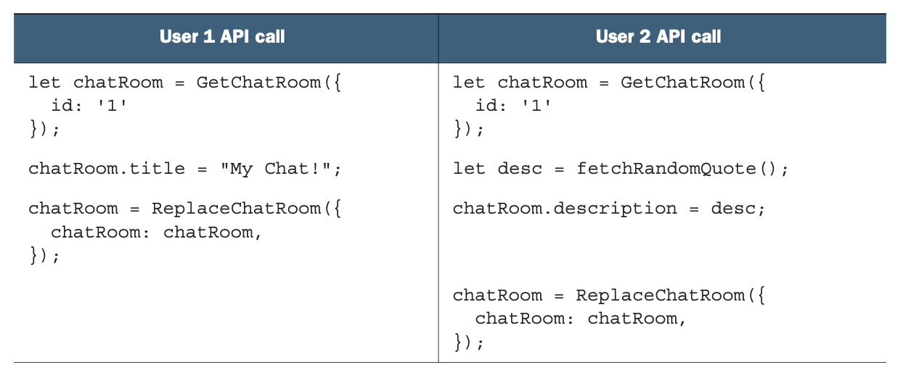
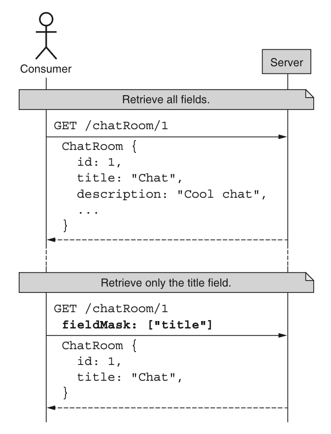
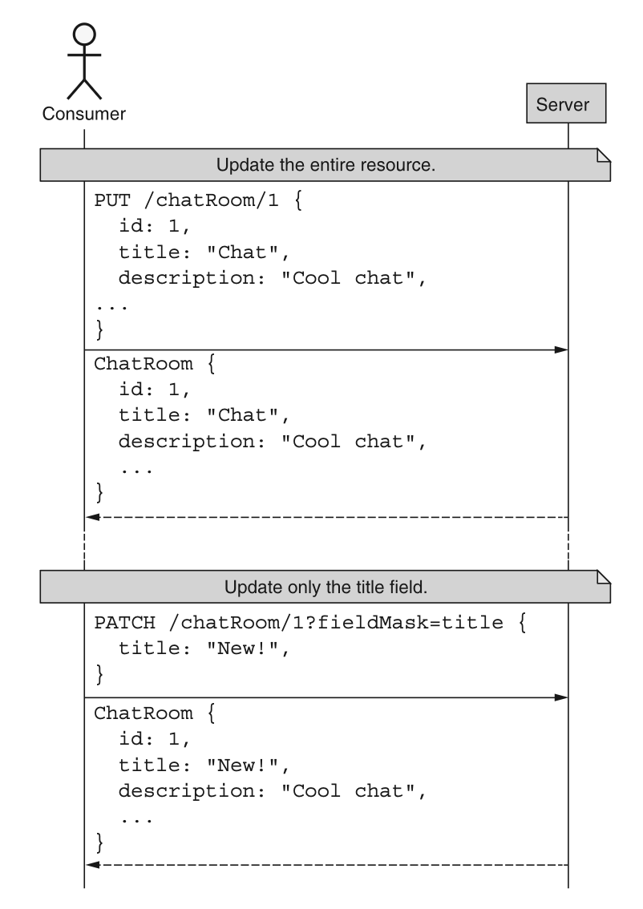
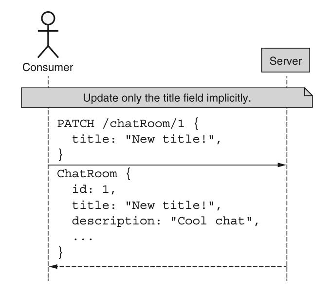
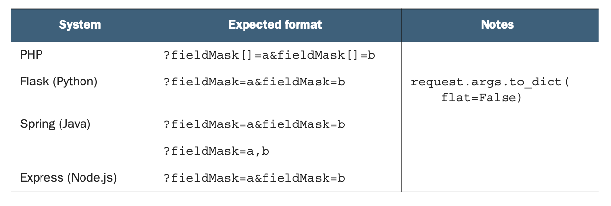
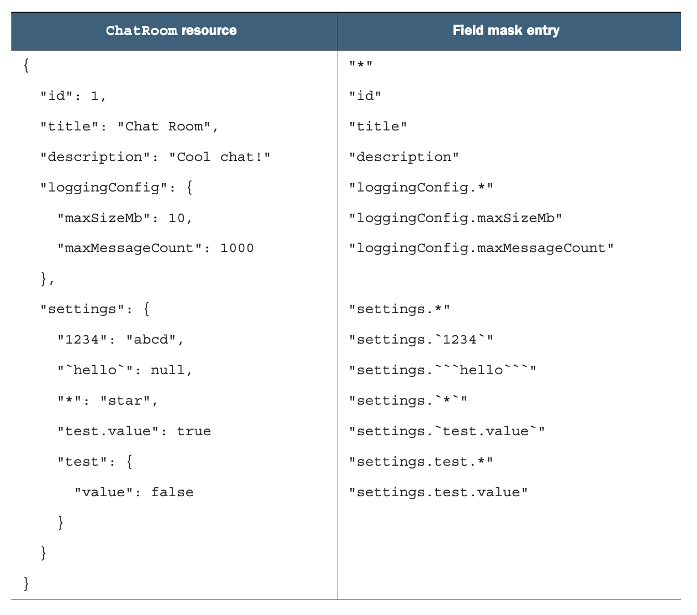

# 第 8 章 部分更新与检索

<div style="background:#f7f5e6; padding:24px; border-radius:4px; color:#405a73;">

**本章内容**
- 为什么我们可能只想要更新或检索资源的特定部分
- 如何最好地向 API 服务传达感兴趣的字段
- 如何处理复杂字段中的单个条目，例如 maps 和接口
- 是否支持寻址重复字段（例如数组）中的单个条项
- 定义默认值和处理隐式字段掩码
- 如何处理无效的字段规范

</div><br/>

正如我们在 [第 7 章](ch7.md) 中所学的，我们能够以零碎方式更新资源，而不是总是依赖完全替换，这一点很重要。
在本模式中，我们将探讨使用字段掩码作为工具，仅更新给定资源中我们感兴趣的特定字段。
此外，我们还将介绍如何将字段掩码应用于相反方向的相同问题：仅检索资源上的特定字段。
虽然不太常见，但检索部分资源而非整个资源的能力，在内存敏感型应用中尤为重要，例如消费 API 输出的物联网设备。

<a id="motivation"></a>
## 8.1 动机

在本设计模式中，我们实际上将探索同一枚硬币的两面，两者都与资源的不同视图相关。
在我们到目前为止讨论过的任何 API 中，我们只将资源视为自包含的原子单元。
换句话说，我们从未考虑过将资源分解为其组成属性并在更细粒度上进行操作的可能性。
尽管这使得某些编程范式更简单（例如，你永远不必担心管理资源的一部分），但当你希望在与 API 交互时更具体、更具表现力地表达你的意图时，这可能会带来问题。
让我们看看这种限制所禁止的两个新功能的具体实例。

### 8.1.1 部分检索

在大多数 API 中，当你检索一个资源时，你要么获得整个资源，要么获得一个错误，即 “全有或全无”。
对我们许多人来说，这实际上不是问题。
毕竟，我们还能想要什么呢？
<ins>但如果这个 API 中的资源变得非常大，包含数百个不同的字段和子字段呢？
或者如果发出请求的设备可用的计算资源显著受限，例如在非常小的物联网设备上呢？
或者如果连接速度受限或非常昂贵呢？
在这些场景中，精确控制从 API 返回多少信息突然变得非常重要。</ins>

虽然这看起来像是只有庞大资源或非常苛刻的条件下才需要的东西，但请记住，虽然单个新字段可能只占用稍微多一点的空间（因此在成本、带宽和设备内存方面），但当列出许多这样的资源时，那一点点空间会乘以条目的数量。
<ins>正如你可能想象的，随着资源数量的增长和时间的推移，曾经很小的数字实际上可能会变得相当大。
最终，为 API 用户提供仅检索他们真正感兴趣的资源（或资源列表）的部分内容的能力，具有相当大的价值。</ins>

### 8.1.2 部分更新

支持部分更新背后的逻辑要复杂一些 —— 而且较少关注性能因素和硬件限制等问题。
我们关心的不是读取资源的特定部分，而是能够对特定字段进行细粒度的定位和修改。
那么，我们为什么要在意这种更具体的更新呢？
确保资源看起来完全符合我们的预期，而不是一堆细小更改的集合，难道不重要吗？

<ins>首先，存在数据一致性的问题。</ins>
作为 API 的用户，当我们只有标准 replace 方法（参见 [第 7 章](ch7.md) ）这种粗略的画笔可以使用时，我们被迫更新资源上的所有字段，而不仅仅是我们感兴趣的那一个。
在没有适当一致性检查可用的情况下，覆盖那些对我们并不重要的字段，可能会导致数据丢失，这显然不是一件好事。
为了了解这种情况是如何发生的，想象下面两个不同的客户端针对同一资源运行表 8.1 中所示的代码片段。

*表 8.1 两个用户运行的代码序列示例，可能会引发问题*
<br/>

如果这两个序列在执行时没有任何一致性检查或锁定，最终结果将只有最后的那个标准 replace 方法起作用。
用户 1 执行的第一个更新，其效果可能就像从未发生过一样！
而且，从这一点来看，这两个更新完全没有任何理由需要冲突。
用户 1 想要更新 ChatRoom 资源的 title 字段，而用户 2 只想要更新 description 字段，这两个字段是完全分开的。
即使我们添加一些一致性检查，第二个标准 replace 方法也会失败，并需要重试以确保更新确实被提交。

<ins>但这个问题的复杂性不止于此，还有其他方式会导致数据丢失。</ins>
正如我们将在 [第 24 章](ch24.md) 中更详细地看到的，API 很少一成不变。
相反，它们往往会随着时间的推移而发展，以支持新功能并修复现有功能中的错误。
而我们最终依赖的最常见场景之一，是能够向资源添加新字段，同时仍然认为新版本是向后兼容的。
但如果你唯一的更新资源机制是完全替换它们，并且你的本地接口没有及时更新到资源上的完整（新）字段列表，这可能会带来相当大的问题。

例如，假设我们想要更新 ChatRoom 资源的 title 字段，但自从我们上次更新客户端库以来（当时我们在 ChatRoom 资源上存储的唯一字段是 title 字段和 administrator 字段），服务添加了一个新的 description 字段。
在这种情况下，如果有人之前为资源设置了 description，我们的标准 replace 方法最终可能会覆盖该数据，导致我们再次面临数据丢失。
为了了解这看起来是什么样子，清单 8.1 展示了两个不同的客户端更新同一个 ChatRoom 资源。
第一个客户端代码是最新的，并且清楚地知道新的 description 字段。
后者代码则有一段时间没有更新，并且从未听说过这个 description 字段。

*清单 8.1 两个不同的客户端更新单个资源*

```typescript
// 首先，我们使用“最新客户端”更新房间的描述。
let chatRoom = latestClient.GetChatRoom({ id: '1' });
chatRoom.description = 'Description!';
ReplaceChatRoom({ chatRoom: chatRoom });
console.log(chatRoom);
{
  id: '1',
  title: 'Old title',
  description: 'description'
}

// 如果使用旧客户端获取资源，description字段会完全缺失。
chatRoom = oldClient.GetChatRoom({ id: '1' });
console.log(chatRoom);
{
  id: '1',
  title: 'Old title',
}

// 然后我们用旧客户端更新标题，这个操作本身没有任何问题。
chatRoom.title = 'New title';
ReplaceChatRoom({ chatRoom: chatRoom });

// 但是，当我们再次使用新客户端查询时，description字段已经被清空！
chatRoom = latestClient.GetChatRoom({ id: '1' });
console.log(chatRoom);
{
  id: '1',
  title: 'New title',
  description: null
}
```

虽然这看起来可能令人担忧，好像出了什么问题，但事实上，标准 replace 方法正是在做它应该做的事情。
回想一下，此方法专门设计用于使远程资源看起来与请求中指定的资源完全一致。
这意味着，无论是否有意，都会移除任何缺失字段中的数据。

<ins>简而言之，部分更新的目标是允许 API 消费者更具体地表达他们的意图。
如果他们打算替换整个资源，他们可以使用标准 replace 方法。
如果他们只打算更新单个字段，就应该有一种更细粒度的机制，让他们能够向更新资源的 API 表达这一意图。
在这种情况下，部分更新是一个很好的解决方案</ins>。

<a id="overview"></a>
## 8.2 概述

为了实现这两个目标（支持部分检索和部分更新），我们实际上可以依赖一个单一的工具：字段掩码 (field mask)。
<ins>从根本上说，字段掩码只是一个字符串集合，但这些字符串表示给定资源上我们感兴趣的字段列表。</ins>
当检索资源时，如果我们想要更具体地指定希望检索哪些字段，我们可以简单地提供一个字段掩码，表明应返回哪些字段，如图 8.1 所示。

*图 8.1 检索资源时使用字段掩码* <br/>
<br/>

<ins>正如我们可以使用字段掩码来控制我们感兴趣检索的字段一样，我们也可以依赖相同的工具来控制服务应更新资源上的哪些字段。</ins>
在这种情况下，在更新资源时，我们可以提供我们打算更新的字段列表，并确保仅修改这些特定字段，如图 8.2 所示。

<ins>此外，由于 JSON 恰好是一种动态数据结构，如果 PATCH 请求中缺少字段掩码本身，我们可以从 JSON 对象中存在的属性推断出字段掩码（如图 8.3 所示）。</ins>
虽然在处理 API 中的动态数据结构时，这可能变得更加复杂，但在大多数情况下，这种字段掩码推断提供了最符合预期的结果。

这看起来可能很简单，但有许多边缘情况和棘手场景比看起来要复杂得多。
在下一节中，我们将探讨如何在 API 中实现字段掩码支持。

*图 8.2 替换整个资源与更新单个字段的对比* <br/>
<br/>

*图 8.3 使用从提供的数据中推断出的隐式字段掩码来更新单个字段* <br/>
<br/>

<a id="implementation"></a>
## 8.3 实现

现在我们已经掌握了字段掩码的高层次概念，我们需要更详细地了解它们是如何工作的。
换句话说，我们知道我们应该能够在 GET 或 PATCH 请求上发送这个任意字段列表，结果是获得更具体的更新或检索。
但我们该如何发送这些字段呢？
毕竟，GET 请求不接受请求体，而 PATCH 请求应该将资源本身作为请求体。
让我们更深入地探讨如何在不显著破坏我们在 [第 7 章](ch7.md) 中定义的标准请求的情况下传输字段掩码。

<a id="transport"></a>
### 8.3.1 传输

虽然字段掩码看起来确实非常强大，但它们引出了一个重要的问题：我们如何在请求中将它们传输到 API 服务器？
而且，鉴于我们与 HTTP 的紧密关系，我们如何在仍然遵循 HTTP 和面向资源的 API 设计规则的同时做到这一点？
由于 GET 和 PATCH 请求存在两个重要的约束，这一点变得尤其复杂。

<ins>首先，对于 GET 请求，不允许有请求体（而且许多 HTTP 服务器如果提供了请求体会将其剥离）。</ins>
这意味着我们绝对不能使用 HTTP 请求体来指示我们感兴趣检索的字段。
<ins>其次，对于 PATCH 请求，虽然显然允许有请求体（这是我们更新资源本身的方式），但面向资源的设计规定 PATCH 请求的请求体必须是正在更新的资源表示。</ins>
换句话说，虽然从技术上讲，我们可以在一个 JSON 表示中同时提供字段和资源，但这将破坏标准 update 方法的相当多的基本假设，并导致以后出现各种不一致。

*清单 8.2 因违反 HTTP PATCH 方法规则而导致的部分更新混乱*

```http
PATCH /chatRooms/1 HTTP/1.1
Content-Type: application/json
{
  // 在本例中，ChatRoom资源并非请求体本身，这违反了标准更新方法的规范。
  "chatRoom": {
    "id": 1,
    "title": "Cool Chat"
  },
  // FieldMask 与 ChatRoom 资源并列放置。
  "fieldMask": ["title"]
}
```

我们该怎么办？
<ins>除了 HTTP 请求体之外，还有两个潜在的位置可以放置我们的字段掩码：头部和查询字符串。</ins>
虽然这两者在技术上都是可行的，但事实证明查询参数更容易访问，特别是考虑到我们甚至可以在浏览器请求中修改它们，而头部则隐藏在 HTTP 协议栈中较深的位置，使它们不太容易访问。
<ins>因此，查询参数可能是更好的选择。</ins>

<ins>遗憾的是，对于重复查询参数似乎没有规范，这意味着重复的查询字符串参数如何解释将取决于所使用的 HTTP 服务器。</ins>
例如，考虑表 8.2 中的示例。
如你所见，不同的服务器以不同的方式处理这些输入，因此依赖一个与最常用标准
（即多次使用相同字段，例如 `?fieldMask=title&fieldMask=description` ）保持一致的库是很重要的。
尽管其中一种替代方案（ `fieldMask=a,b` ）看起来可能更简洁，
但当我们需要处理 map 或嵌套接口时（参见 [第 8.3.5 节](#implicit-field-masks) ），这可能会带来问题。

*表 8.2 不同系统如何处理多值查询参数的示例* <br/>
<br/>

这意味着我们必须为标准的 update 方法和标准的 get 方法扩充请求消息。
如你所见，这只是在请求消息上添加一个新的 fieldMask 属性的问题。

*清单 8.3 包含字段掩码的标准 get 和 update 请求示例*

```typescript
type FieldMask = string[]; // FieldMask 类型本质就是路径数组

interface GetChatRoomRequest {
  id: string;
  fieldMask: FieldMask; // 我们只需在获取资源和更新资源的请求接口中添加 fieldMask 属性
}

interface UpdateChatRoomRequest {
  resource: ChatRoom;
  fieldMask: FieldMask;
}
```

现在我们已经知道了如何在 API 中传输这些字段掩码值（同时仍然遵守 HTTP 和面向资源的 API 标准），
让我们更仔细地看看每个字段掩码条目包含的值，从 map 和嵌套接口开始。

<a id="maps-and-nested-interface"></a>
### 8.3.2 Maps 与嵌套接口

到目前为止，我们实际上只考虑了扁平的资源数据结构 —— 也就是说，那些没有任何嵌套值类型的数据结构。
尽管我们可能多么喜欢那种世界的简单性，但它不一定反映现实，在现实中，资源上的值本身可能就是其他接口类型。
此外，我们可能会遇到这样的情况：资源包含一个字段，该字段是一个 map 类型，即键值对的集合。
<ins>这引出了一个有趣的难题：这种部分更新和检索的想法是否延伸到嵌套结构内部？
还是它只适用于最顶层，实际上将资源视为完全扁平的结构？</ins>

好消息是，肯定有一种方法可以允许使用字段掩码指向嵌套字段（无论是嵌套的静态接口还是动态的类 map 的值）。
坏消息是，这需要在字段掩码条目本身中使用相当多的特定性和特殊转义字符。
<ins>为了了解这是如何工作的，让我们从一组简单的规则开始，我们可以将这些规则组合成一个强大的工具箱来应对大多数场景。</ins>
别担心，我们马上会看例子。

1. <ins>字段规范的各个部分必须使用点字符（.）作为分隔符。</ins>
2. <ins>嵌套消息的所有字段可以使用星号字符（*）来指代。</ins>
3. <ins>Map 键应始终为字符串。</ins>
4. <ins>字段规范的所有部分（字段名或 map 键），如果无法表示为不带引号的字符串字面量，则必须使用反引号字符（`）进行引用。</ins>
5. <ins>字面量反引号字符可以通过使用两个反引号字符（``）进行转义。</ins>

如果这些规则让你感到害怕，请坚持住。
示例会让它们变得更清晰。
为了探索这个独特的问题空间，让我们从清单 8.4 中的一个示例开始。
在这种情况下，假设我们的 ChatRoom 资源同时具有一个 LoggingConfig 字段和一个 settings map 字段，后者可能包含任意的键值风格数据。
让我们看看我们如何寻址各个不同的字段。

*清单 8.4 添加嵌套接口字段和动态 map 字段*

```typescript
interface ChatRoom {
  id: string;
  title: string;
  description: string;
  loggingConfig: LoggingConfig; // 这里是嵌套字段，属于结构固定、字段定义明确的静态结构
  settings: Object; // settings 字段是任意键值 map，值可以是不同类型
}

interface LoggingConfig {
  maxSizeMb: number;
  maxMessageCount: number;
}
```

为了直观地了解我们如何应用这些规则，表 8.3 显示了 ChatRoom 资源中数据的示例表示，以及我们如何将该单个字段作为字段掩码中的一个条目进行寻址的示例。

*表 8.3 资源表示及每个字段对应的字段掩码条目* <br/>
<br/>

如你所见，有一种方法可以使用这些规则来寻址资源中的每个单独字段。
虽然大多数都很直接（例如 "description" 和 "settings.test.value"），但其他的可能特别难看，乍一看可能令人困惑。
例如，在 map 键可能被解释为数值的情况下，我们需要将这些键用反引号引起来。
同样的情况也适用于点字符可能被误解为分隔符字面量的情况（例如 "settings.test.value" 和 "settings.\`test.value\`" 容易混淆）。
最后，如果需要将反引号用作字面量字符，则只需将它们双写（无论你需要在何处使用 `，只需使用 ``）。

<ins>通过遵循这五条定义字段掩码格式的规则，我们应该能够寻址数据结构中的任何嵌套字段，即使它包含奇怪的字符字面量（如点、星号或反引号）。</ins>

然而，这确实遗漏了资源中一个重要的字段类型类别：重复字段或数组。
在下一节中，我们将探讨如何使用字段掩码寻址资源中的重复字段。

### 8.3.3 重复字段

对于嵌套接口和 map 字段中的字段，我们有一种清晰而简单的寻址方式，但重复字段（例如字符串列表）呢？
如果重复字段本身是一个嵌套接口呢？
我们如何寻址给定书籍所有作者的姓氏？
幸运的是，有一种明确的方法可以做到这一点。
<ins>但在我们讨论这个方法之前，必须先讨论一个重要限制：按索引寻址重复字段中的条项。</ins>

我们都熟悉在编程语言中如何寻址数组中的单个条项。
几乎总是这样，例如 `item[0]` 用于获取名为 item 的数组中的第一个条目。
虽然这显然是编程语言中一个关键功能，但它在 Web API 中真的有意义吗？

如果我们碰巧是该 API 的唯一用户，或者我们正在寻址的资源是完全不可变的，并且该索引在某种程度上是一个唯一标识符，那么也许可以。
但在几乎所有其他场景中，Web API 中的这种功能可能会以多种方式产生误导。

<ins>首先，按索引访问条目意味着该索引是一个唯一标识符，而在大多数情况下，实际上并非如此。</ins>
该索引现在是标识符，但它不是一个稳定的标识符，因为它很容易随时间变化，无论是在目标条目之前插入一个条目，还是替换整个数组值。
<ins>其次，通过将索引用作任何类型的标识符，这意味着该特定列表具有稳定的排序顺序。</ins>
这意味着列表中的条目顺序将保证随着时间的推移保持一致，即使新条目被追加到列表末尾。
这些可能看起来是小问题，但随着时间的推移维护它们可能会成为一个相当大的负担，而且带来的好处并不多。

<ins>由于所有这些原因，在 Web API 中能够按索引单独寻址列表中的条目实际上没有多大意义。
如果确实需要这种功能，那么依赖 map 字段（其条目具有稳定的、真正的本地唯一标识符）或子资源集合（每个子资源都有其自己的全局唯一标识符）要有用得多。</ins>
因此，重要的是 API 不应支持基于索引检索或更新重复字段中的单个条目。
换句话说，消费者永远不应该能够指示 API 更新或检索资源重复字段中 “索引为 0 的条目”。
除非 API 保证各种额外的功能（这些功能随着时间的推移维护起来极其繁重），否则 “第一个条目” 的想法完全没有意义。

幸运的是，这并不意味着我们完全不能与重复字段中的条目进行交互。
相反，我们可能想对这些字段做一件非常有用的操作，为了实现这一点，我们当然需要一种表达该意图的方式。
假设我们的 ChatRoom 资源包含一个类型为 User 的 administrator 字段。
我们已经学会了如何只获取管理员的姓名（例如 `fieldMask=admin.name` ），但如果有多个管理员呢？
我们如何获取每个管理员的姓名？

*清单 8.5 具有多个管理员的 ChatRoom 表示*

```typescript
interface ChatRoom {
  id: string;
  title: string;
  description: string;
  administrators: User[]; // 在这个示例中，administrators 是 User 接口的重复字段（数组）
}

interface User {
  name: string;
  email: string;
  // ...
}
```

在这种情况下，我们可以再次依赖星号 `*` 来表示某种意义上的 “foreach” 循环。
换句话说，我们可以将前缀 "administrators.*." 视为 “对于每个管理员，只提供列出的字段” 的一种方式。
在这种情况下，为了只获取管理员的姓名，我们可以使用字段掩码值 "administrators.*.name"。
然而，请记住，这种额外功能并不妨碍我们使用（简单的）字段掩码 administrators 来请求所有管理员。

不幸的是，虽然这种能力确实使我们能够跨重复字段中的条目选择特定字段，但它并不能使我们更新这些字段。
原因与无法寻址 `administrators[0]` 的原因相同：重复字段不保证是稳定的，因此无法知道列表中的哪个条目应该用哪个值来更新。

*清单 8.6 尝试按索引更新重复字段中条目的（不好的）示例*

```http
PATCH /chatRooms/1?fieldMask=administrators.*.name HTTP/1.1
Content-Type: application/json

{
  "administrators": [
    { "name": "New name for Index 0" },
    { "name": "New name for Index 1" }
  ]
  // 在没有强一致性与顺序保证的前提下，无法保证该操作只会修改我们想要更新的管理员
}
```

<ins>如你所见，如果顺序没有得到保证，或者添加了新管理员并移动了索引位置，就无法确定结果是否如我们所预期。
因此，我们必须在所有重复字段上执行完全替换，而不是更新重复字段中的单个条目。</ins>

### 8.3.4 默认值

正如我们在 [第 5 章](ch5.md) 中所学的，默认值的目标是为用户做 “正确的事情”。
这是因为将某些字段留空是 API 用户表达他们对 API 的这一方面不一定有意见，并且信任 API 为他们提供最适合大多数其他用户的行为的一种方式。
对于字段掩码来说，所使用的标准方法（标准 get 与标准 update）的默认值略有不同。

在标准 get 方法中，默认值几乎总是资源上可用字段的完整列表。
这意味着，除非指定了字段掩码，否则应返回资源接口上存在的每个字段。
这确保了支持部分检索的标准 get 方法的行为与完全不支持部分检索时相同（我们将在 [第 8.4.1 节](#universal-support) 中更详细地探讨这一点）。

<ins>这个准则有一个例外</ins>。
在资源包含某些字段，无论出于何种原因，这些字段会导致 API 消费者的用户体验根本性恶化的情况下，这些字段应从默认的未设置字段掩码中移除。
例如，假设一个资源包含一些特别大或计算时间特别长的字段，以至于标准 get 方法需要几分钟才能返回任何结果。
在这种情况下，将这些有问题的字段从默认返回的字段集中排除可能更合理。
这意味着对这些字段感兴趣的用户需要通过显式指定字段掩码来表达他们的兴趣。

这种情况应该相对少见，但至关重要的是，如果某个字段确实属于这个例外（即默认情况下不会包含，必须明确请求），则该字段的文档本身必须包含这一事实。
如果文档中某处没有这样的说明，可能会导致极其令人困惑的行为，并迫使 API 消费者在试错之后才发现这一事实，这当然是不理想的。

这引出了最后一个值得考虑的场景：如果我们需要检索所有字段，但我们不想逐一列出每一个字段，该怎么办？
换句话说，我们不想遵循默认设置，让 API 决定我们应该获得哪些字段。相反，我们想要明确请求所有可用的字段，包括那些可能很大或难以计算的字段。
这也可能包括自我们上次更新客户端代码以来添加的字段（参见 [第 24 章](ch24.md) ）。
我们如何做到这一点？

<ins>答案实际上非常简单明了：我们应该依赖一个特殊的标记值来表示 “所有字段”；
在这种情况下，该值是星号（"*"）。
如果此值出现在字段掩码中，则应返回所有字段，无论是否还存在任何其他字段。</ins>

现在我们已经探讨了数据部分检索的默认值，我们需要稍微转换一下思路，决定通过标准 update 方法进行数据部分更新的默认值应该是什么。
不幸的是，当涉及到更新资源时，推荐的用于检索的所有字段的默认值并不完全合理；
毕竟，如果我们默认提供所有字段，那么它实际上更像是一个标准 replace 方法，而不是一个标准 update 方法。
我们应该怎么办？

一个方便的选择是尝试根据提供的数据推断字段掩码。
换句话说，我们可以遍历输入数据，并且仅当字段指定了值时才更新字段。
在下一节中，我们将更详细地探讨这个想法。

<a id="implicit-field-masks"></a>
### 8.3.5 隐式字段掩码

与检索数据的默认值不同，更新数据需要更多的思考和工作。
这是因为如果我们遵循相同的规则（默认为所有字段），我们最终会得到一个实际上行为类似于标准 replace 方法的标准 update 方法（因为它必须替换所有字段）。
这引出了一个重要的问题：在标准 update 方法（使用 HTTP PATCH 方法）上，未设置的字段掩码意味着什么？

最常见的是，HTTP PATCH 表示只使用请求体中提供的数据来更新资源的意图。
<ins>这为我们提供了标准 update 方法中字段掩码默认值的一个有趣选项：从提供的数据中推断字段掩码。
虽然这个策略看起来简单明了，但这种推断非常强大。
事实上，它如此强大，以至于它很可能是 API 用户真正从字段掩码中受益的主要方式。</ins>
我们究竟如何做到这一点？

<ins>这种推断的工作原理是遍历所有提供的字段，并记录到达该字段的路径。
如果字段本身指定了值（在 JSON 或 TypeScript 中，这意味着该值不是 undefined），那么我们将该字段路径包含在最终推断出的字段掩码中。</ins>

*清单 8.7 从资源对象推断字段掩码的函数*

```typescript
type FieldMask = string[];
// 首先，我们将 FieldMask 类型定义为字符串类型的字段名数组

function inferFieldMask(resource: Object): FieldMask {
  const fieldMask: FieldMask = [];

  // 接着遍历传入资源对象的所有键值对
  for (const [key, value] of Object.entries(resource)) {
    if (value instanceof Object) {
      // 使用递归查找嵌套对象中的字段，并用 "." 作为分隔符，在原有字段前拼接前缀
      for (const field of inferFieldMask(value)) {
        fieldMask.push(`${key}.${field}`);
      }
    } else if (value !== undefined) {
      // 只要值有设置（包括 null），我们就认为它隐式属于字段掩码的一部分
      fieldMask.push(key);
    }
  }

  return fieldMask;
}
```

使用清单 8.7 中的代码，我们可以通过查看提供的数据来推断用户的意图。
换句话说，如果用户只打算更新单个字段，他们可以通过在请求体中仅提供该字段来暗示这一点（例如 `PATCH /chatRooms/1 { "description": "New description" }` ），我们可以推断他们打算使用该单个字段（ `["description"]` ）作为字段掩码。

<ins>这里需要注意的是，null 值与在请求体中省略该字段不同。</ins>
换句话说，虽然在 JavaScript 中值为 undefined 或在 JSON 中缺失字段确实会被排除在推断出的字段掩码之外，但 null 值实际上会出现在字段掩码中。
因此，将字段设置为 null（例如 `PATCH /chatRooms/1 { "description": null }` ）将产生与我们之前的示例（ `["description"]` ）相同的字段掩码，并且同样会最终将 description 字段的值设置为指定的值，在本例中，该值是显式的 null 值。

这通常是一种完全可以接受的行为模式，但当我们开始处理动态数据结构时，它可能会引发问题，因为资源上可用的字段实际上会随时间变化。
让我们花一些时间了解我们如何最好地处理动态数据结构及其带来的独特行为。

<a id="updating-dynamic-data-structures"></a>
### 8.3.6 更新动态数据结构

正如我们在 [第 5 章](ch5.md) 中所学的，静态数据结构几乎总是更容易处理。
这主要是因为它们对于字段值只有两种不同的类别：实际值（例如 `ChatRoom({ title: "Cool chat!" })` ）和 null 值（例如 `ChatRoom({ title: null })` ）。
另一方面，动态数据结构（例如 map ）由于字段本身可能存在也可能不存在，因此有第三种类别：`undefined` 。
例如，正如我们在 [第 8.3.2 节](#maps-and-nested-interface) 中所看到的，settings 字段是一个属于此类别的 map 。
一个键（例如 `"test"` ）可能是某个值、显式 null，或者完全从 map 中缺失（在 JavaScript 中这被视为等同于 `undefined` ）。

这导致了一个棘手的情况。
假设 settings 字段被设置为 `{ "test": "value" }` 。
要更改该值，我们可以依赖隐式字段掩码：`PATCH /chatRooms/1 { "settings": { "test": "new value" } }`。
同样，如果我们想将该值设置为显式 null，这也能继续工作：`PATCH /chatRooms/1 { "settings": { "test": null } }`。
但我们如何完全移除该键呢？
换句话说，我们如何将值设置为 undefined？

不幸的是，`undefined` 不是 JSON 规范的一部分，因此像在某些 JavaScript 代码中那样显式使用该值是行不通的。
此外，大多数其他编程语言没有用于 map 中缺失键的标记值。
因此，我们需要另一种机制来从动态数据结构中移除键。

虽然可能在我们的 API 中使用特殊符号来表示 `undefined`，但这容易出错，并且以后可能会引入更多复杂性。
它要么会与 JSON 值的范围冲突，要么会违反 JSON 规范。
简而言之，这种表示 `undefined` 的特殊标志不太可能是一个非常健壮的策略。

另一种选择是依赖字段的完全替换。
也就是说，我们将检索资源，移除有问题的键，并通过替换整个 map 字段来更新资源。
虽然这当然有效（并且我们可以使用新鲜度检查来避免数据一致性问题），但它只有在更新单个字段时才有效。
如果整个资源是动态的（正如许多存储系统 Web API 中的情况），那么这会变得更加复杂，因为我们实际上是在使用标准 replace 方法来实现功能。

<ins>相反，下一个最佳解决方案是依赖带有请求体中缺失值的显式字段掩码。
换句话说，我们明确声明我们想要更新特定字段，但我们完全省略了该字段。</ins>
例如，清单 8.8 中的请求将确保从 ChatRoom 资源的 settings 字段中移除 "test" 键。
请注意，这不是将值设置为 null，而是实际上完全移除该值。

清单 8.8 从动态数据结构中移除字段的示例方法

```http
PATCH /chatRooms/1?fieldMask=settings.test HTTP/1.1
Content-Type: application/json

{}
// 由于我们只需要将 settings.test 设置为未定义状态，完全不需要传入任何数据！
```

给定此请求，当需要确定要更新什么时，我们将输入值赋给资源的值（`resource["settings"]["test"] = input["settings"]["test"]`），在本例中，这将等同于 undefined，并产生从字典中移除键的期望结果。
在其他语言中，确定输入是否包含所指示的字段，如果没有，则显式移除该键，这一点很重要。
例如，使用 Python 的 `input.get('settings', {}).get('test')` 是不可接受的，因为这将导致值为 None。
将值设置为 Python None 与从 Python 字典中移除键是不同的。

这引出了我们的最后一个主题：当你提供了一个不存在的字段时会发生什么？

### 8.3.7 无效字段

正如我们在 [第 8.3.6 节](#updating-dynamic-data-structures) 中所学的，在字段掩码中指定请求体中不存在的字段，是支持从动态数据结构中移除数据的一个巧妙技巧。
然而，对于底层数据结构不是动态的情况呢？

虽然采用防御性编码策略并在提供了不可能存在的字段时，抛出某种错误可能很有诱惑力，但这很可能效果不佳。
主要原因是，正如我们将在 [第 24 章](ch24.md) 中看到的，添加新字段以及有时移除字段是非常常见的。
因此，请求者包含一个在某个版本中存在但在当前版本中不再存在的字段，并非不可想象。
<ins>在这些情况下，更安全的做法是简单地将所有结构视为动态结构，并且当在更新时的请求中或在检索时的资源中找不到字段掩码中指定的字段时，永远不要抛出任何类型的错误。</ins>

<ins>换句话说，每当我们遇到一个未找到的字段时，我们将其值视为 undefined，然后要么更新数据，要么返回结果。</ins>

### 8.3.8 最终 API 定义

正如我们在 [第 8.3.1 节](#transport) 中所学的，我们将依赖新的 FieldMask 类型（相当于字符串数组）在标准 get 请求和标准 update 请求上定义两个新字段。

*清单 8.9 最终 API 定义*

```typescript
abstract class ChatRoomApi {
  @get("/{id=chatRooms/*}")
  GetChatRoom(req: GetChatRoomRequest): ChatRoom;

  @patch("/{resource.id=chatRooms/*}")
  UpdateChatRoom(req: UpdateChatRoomRequest): ChatRoom;
}

type FieldMask = string[];

interface GetChatRoomRequest {
  id: string;
  fieldMask: FieldMask;
}

interface UpdateChatRoomRequest {
  resource: ChatRoom;
  fieldMask: FieldMask;
}
```

<a id="trade-offs"></a>
## 8.4 权衡

使用字段掩码进行部分更新和检索可能非常强大，但重要的是要记住，其目标仍然相当有限：最小化不必要的数据传输，并允许对 API 资源进行细粒度修改。
<ins>通常，人们很容易将字段掩码（尤其是部分检索）视为类似 SQL 的查询工具，用于从恰好包含远多于应有数据的资源中提取特定数据。
虽然字段掩码可能被用于实现这一目标，但它们当然不应该被这样使用</ins>。

在 API 包含大量相关数据，并且需要一种机制让用户根据不同资源之间的关系检索特定数据的情况下，字段掩码作为工具是不够的。
相反，像 GraphQL 这样的工具更适合，它提供了一个强大的系统，用于在 API 中连接相关数据，同时也提供了使用类似字段掩码的查询格式来限制结果数据的能力。
虽然我们在本书中不会涉及 GraphQL，但如果你发现自己需要这种类型的功能，它绝对值得一看。

现在我们已经了解了使用字段掩码进行部分检索和更新的工作原理，让我们看看其他一些值得探讨的考虑因素。

<a id="universal-support"></a>
### 8.4.1 普遍支持

<ins>虽然对于标准 update 方法来说，支持部分更新是一项硬性要求（否则该方法实际上就只是标准 replace 方法），但并非每个 API 都必须支持部分检索。
原因很简单：并非每个 API 的资源都大到或复杂到值得支持部分检索。
相反，即使是一个小资源，也可以从允许对资源上哪些字段进行更新的细粒度控制中受益，因为这更多是并发性的问题，而不是资源大小和复杂性的问题。</ins>

<ins>然而，需要注意的是，如果 API 确实决定支持部分检索，它应该全面支持，而不是基于逐个资源地支持。
换句话说，如果一个 API 最终只有一个资源需要支持部分检索，那么该 API 也应该在所有资源上实现该功能。
这样做的原因是为了保持一致性。
标准 get 方法的目标是跨资源保持一致，因此引入任何取决于你正在与哪个资源交互的可变性都会导致意外，最终使 API 对消费者来说变得更差。</ins>

### 8.4.2 替代实现

<ins>同样重要的是要注意，还有几种其他实现可用于支持使用 HTTP PATCH 方法进行资源的部分更新。</ins>
例如，JSON Patch（RFC-6902；https://tools.ietf.org/html/rfc6902 ）是一个极好的选择，当你需要对正在修改的资源进行更明确和详细的控制时。
JSON Patch 依赖于一系列操作（有点像操作转换），这些操作按顺序应用以修改 JSON 文档。
JSON Patch 不仅仅是决定设置哪些值，它还提供了高级功能，例如能够将值从一个字段复制到另一个字段（而无需先检索该值），
或者使用索引和 `test` 操作来操作数组值，以断言该索引处的条目确实是预期的条目。

JSON Patch 并不是唯一的选择。
还有 JSON Merge Patch（RFC-7396；https://tools.ietf.org/html/rfc7396 ），
它更接近于本章中探讨的字段掩码实现，但它有自己的怪癖列表，并且它本身完全基于推断或隐式字段掩码。
正如你可能猜到的，当需要区分显式将值设置为 null 和将它们从结构中完全移除时，这会给动态数据结构带来问题。
此外，它对嵌套的 JSON 对象（例如映射和嵌套接口）是递归的，但对重复字段（例如数组）不是递归的，这可能会导致对这些更丰富的数据结构的潜在混淆。

<ins>虽然这些选项中有很多都很棒，但使用字段掩码来指定应该检索或更新的确切字段的想法，对大多数人来说足够简单，可以快速掌握，同时仍然足够强大，可以提供在检索或更新资源时保持精确定位所需的功能。</ins>

<a id="exercises"></a>
## 8.5 练习

1. 假设一个 ChatRoom 资源可能有一组管理员用户，而不是单个管理员。
如果我们使用数组字段来存储这些资源，我们会失去什么？有哪些替代方案可用？

2. 我们如何从动态数据结构中移除单个属性？

3. 在部分检索中，我们如何传达我们感兴趣的字段？

4. 我们如何表示我们希望检索（或更新）所有字段，而无需在字段掩码中逐一列出它们？

5. 我们应该使用什么字段掩码来更新一个名为 settings 的映射中的键 "`hello.world`"？

<a id="summary"></a>
## 本章小节

- 在资源较大或消费资源数据的客户端硬件受限的情况下，部分检索尤为重要。
- 部分更新对于避免冲突的同时进行细粒度更新至关重要。
- 字段掩码应被用来指示应检索或更新的字段，它支持寻址字段、接口中的嵌套字段以及 map 键。
- 字段掩码不应提供按位置或索引寻址数组字段中条目的机制。
- 默认情况下，对于部分检索，字段掩码应假定值为 “全部字段”；对于部分更新，应假定为隐式字段掩码（即根据字段是否存在来推断指定的字段）。
- 如果字段无效，应将其视为存在但值为 undefined。
