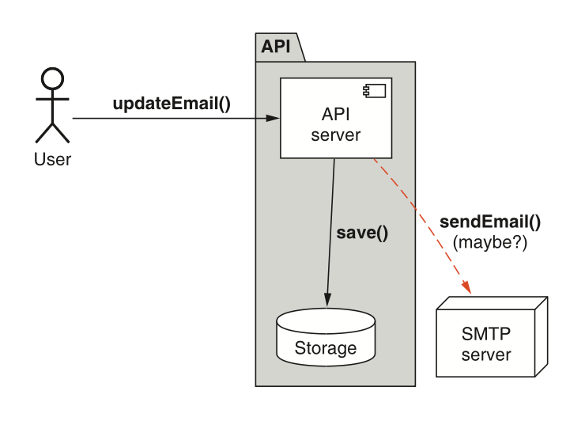
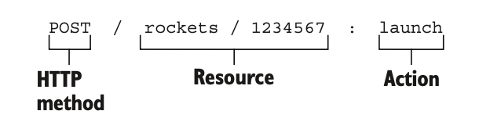
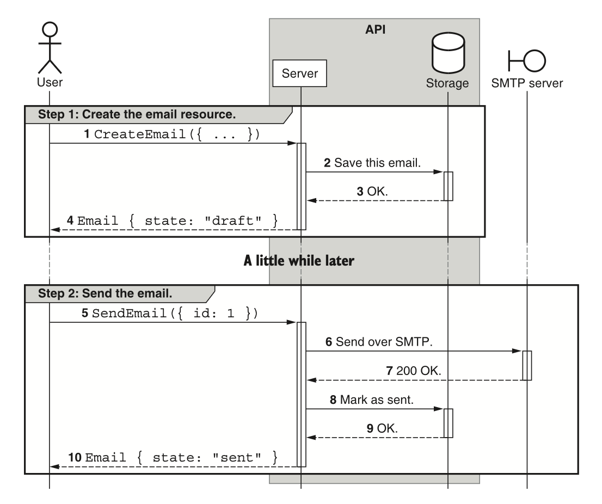
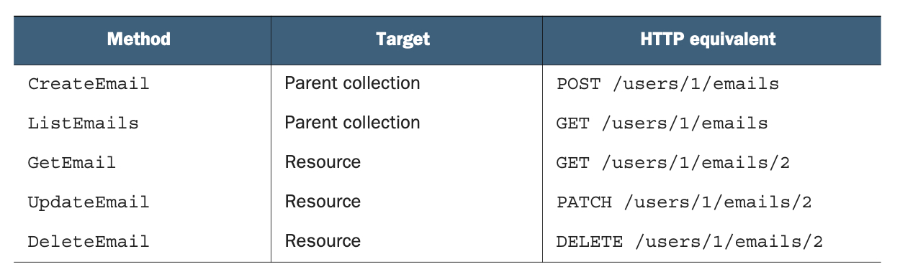

# 第 9 章 自定义方法

<div style="background:#f7f5e6; padding:24px; border-radius:4px; color:#405a73;">

**本章内容**
- 为什么标准方法无法覆盖所有可能的场景
- 在需要副作用的情况下使用自定义方法
- 如何将无状态自定义方法用于以计算为中心的 API 方法
- 确定自定义方法的目标（资源还是集合）
</div><br/>

通常，我们需要对 API 资源执行一些操作，这些操作并不完全适合标准方法中的任何一种。
虽然从技术上讲，这些行为可以通过资源的标准 update 方法来处理，但许多此类操作的行为要求对于标准方法来说会非常不合适，从而导致一个令人惊讶、令人困惑且过于复杂的接口。
为了解决这个问题，本章将探讨如何在 Web API 中安全地支持对资源的这些操作，同时使用我们称之为自定义方法的方式来维护一个简单、可预测且功能完整的 API。

<a id="motivation"></a>
## 9.1 动机

在大多数 API 中，总会有一个时刻，我们需要能够表达一个特定操作，而这个操作并不能很好地适应标准方法中的任何一种。
例如，发送电子邮件或即时翻译某些文本的正确 API 是什么？
如果你被禁止存储任何数据（也许你正在为 CIA 翻译文本）怎么办？
虽然你可以将这些操作硬塞进标准方法中（最有可能是 create 操作或 update 操作），但在这一点上，你是在扭曲这些标准方法的框架，以适应不太合适的东西。
<ins>这就引出了一个显而易见的问题：我们是否应该尝试将我们想要的行为塞进现有方法中，稍微扭曲框架以适应我们的需求？
还是应该将我们的行为改变成一种更干净地适应框架内的形式？
或者我们应该改变框架以适应我们的新场景？</ins>

答案取决于具体场景，但在本章中，我们将探讨自定义方法作为这个难题的一个潜在解决方案。
<ins>本质上，这属于第三种选择，即我们改变框架以适应新场景，从而确保不会为了凑合而扭曲任何东西。</ins>

正如你可能猜到的，自定义方法背后的概念并不复杂 ——毕竟，大多数基于 RPC 的 API一 直都在使用这个理念。
自定义方法的棘手之处在于细节。
什么时候使用它们才是安全的？
我们真的确定标准方法不是一个选项吗？
我们可以参数化自定义方法调用吗？这样的问题还有很多。

在本章中，我们将探讨自定义方法以及它们带来的所有细节和细微差别。
但在我们深入了解自定义方法如何工作之前，让我们花点时间解决一个显而易见的问题：我们真的需要使用自定义方法吗？

<a id="why-not-just-standard-method"></a>
### 9.1.1 为什么不用标准方法？

虽然我们在 [第 7 章] 中了解到的标准方法通常足以对 API 执行几乎任何操作，但有时它们会感觉不太对劲。
<ins>在这些情况下，我们常常感觉像是在遵守法律的字面规定，而非其精神实质：标准方法的行为与预期大相径庭，从而导致意外，因此也就不是一个很好的 API。</ins>
简而言之，仅仅因为我们可以用标准方法执行某个操作，并不意味着我们应该执行该操作。
但决定因素是什么呢？
除了 “感觉不对” 之外，我们还能给出更多解释吗？
让我们通过一个具体的例子来看一下：状态变更。

通常，API 资源可以存在于几种状态之一。
例如，一封电子邮件可能以草稿状态开始，然后进入已发送状态，并且可能（如果我们使用某种高级电子邮件服务）进入已撤回状态。
这显然是我们可能使用标准 update 方法的场景之一，但这样做似乎不太合适。

<ins>为什么状态变更不太适合用 update 方法呢？</ins>
第一个原因很简单：大多数状态变更都是某种形式的转换，因此转换到新状态（恰好存储在某个 state 字段中）与设置标量 (scalar) 字段的值（例如设置电子邮件的主题）有根本区别。
因此，设置状态以指示此转换发生可能既令人困惑又令人意外，这两者都不利于构建一个好的 API。

*清单 9.1 使用标准 update 方法将电子邮件标记为已发送*

```javascript
// 初始状态下，邮件的状态为草稿
const email = GetEmail({id: 'email id here'});

// 在本例中，我们通过将邮件的状态字段更新为已发送，来完成邮件发送
UpdateEmail({id: email.id, state: 'sent'});
```

如你所见，通过更新状态属性来触发邮件发送，这有点令人不适。
这个字段感觉应该由 API 服务本身来管理，而不是由客户端来更新。
<ins>简而言之，将一个字段视为从一种状态转换到另一种状态的机制，可能会相当令人困惑。
此外，它将 update 方法的真正目的混淆了，因为它同时提供了更新存储数据和转换到新状态的能力 —— 这是两个不同的概念性操作。</ins>

<ins>除了更新字段以转换到新状态所引起的混淆之外，我们还有第二个潜在问题，与副作用有关。
正如我们在 [第 7 章](ch7.md) 中所学，标准方法除了其名称所暗示的特定操作之外，真的不应该做任何其他事情。</ins>
换句话说，create 方法应该创建一个新资源，而不做任何其他事情。
类似地，update 方法应该更新一个资源，仅此而已。
<ins>但通常，状态变更会伴随需要执行的其他操作。
例如，如果我们有一个电子邮件消息资源，想要将其从草稿状态更改为已发送状态，我们还必须实际将邮件发送给收件人（否则，将其标记为已发送实际上毫无意义）。</ins>
而仅仅将状态字段更新为已发送，是一种相当隐晦的方式来表示你将与 SMTP 服务器通信以将邮件发送给某个收件人。

问题只会从这里扩展。当我们使用标准 update 方法来执行带有此类副作用的操作时，
我们必须考虑这样一个事实：现在可能需要与两个不同的系统通信才能完成更新操作（如图 9.1 所示）。
首先，对于每次更新，无论如何，我们都需要与存储系统通信，以使用新信息更新某处的数据库。
其次，如果更新恰好将电子邮件资源的状态从草稿更改为已发送，我们还需要与邮件发送系统通信（该系统还必须进一步与收件人的电子邮件服务通信）来完成工作。
本应是一个简单的 “更新数据库” 操作，现在变成了一团混乱的依赖链和可能长时间运行的后台操作，其中任何步骤都可能发生故障。

*图 9.1 API 可能需要为单个更新与多个不同系统通信。* <br/>
<br/>

更糟糕的是，这意味着根据所更新的内容不同，标准 update 方法可能立即返回结果，也可能延迟一段时间，直到邮件发送完成。
当用户仅仅试图更新有关其电子邮件的某些内容时，这会导致各种混淆。

需要注意的是，这个图表在技术上没有任何问题。
许多 API 调用可能与许多不同的服务通信，这并不一定是坏事。
问题在于，这个图表违反了之前定义的标准方法应该做什么和不应该做什么的规则。
<ins>因此，问题不在于 API 调用与多个不同系统通信；
而在于一个标准方法（如 update）与多个不同系统通信，触发副作用，并承担下游依赖。</ins>
这会使 API 从根本上变差，因为它破坏了我们对标准方法某些方面的依赖能力，反而使标准方法变得不可预测和令人困惑。

在我们结束之前，还有一个问题需要解决：为什么不重新排列我们的资源，使我们想要执行的操作更符合标准方法的预期呢？
在这个例子中，我们可能改为使用 EmailDraft 资源和 Email 资源，我们不进行状态转换，而是基于 EmailDraft 资源创建新的 Email 资源。

*清单 9.2 安排资源以适应标准方法*

```typescript
abstract class EmailApi {
  // 我们总是从创建可修改的邮件草稿资源开始
  @post("/{parent=users/*}/emailDrafts")
  CreateEmailDraft(CreateEmailDraftRequest req): EmailDraft;

  // 创建邮件资源的同时实际上也会发送邮件。邮件资源是不可变的
  @post("/{parent=users/*}/emails")
  CreateEmail(CreateEmailRequest req): Email;
}

// 邮件草稿资源包含所有待发送的关键信息
interface EmailDraft {
  id: string;
  subject: string;
  // ...
}

// 实际的邮件引用邮件草稿的内容
interface Email {
  id: string;
  content: EmailDraft;
}
```

虽然这当然是可以接受的，但这样的调整假设了仅仅依赖标准方法是 API 设计的某种神圣不可侵犯的原则。
事实上，标准方法只是达到目的的一种手段；
<ins>在这种情况下，目标是建立一个可操作、富有表现力、简单且可预测的 API。
当某个设计偏离了这一点时，几乎可以肯定最好是调整你的工具以适应 API 的需求，而不是反过来。</ins>

那我们应该怎么做呢？
显而易见的答案是依赖一个单独的非标准方法 API 调用（因此可以有副作用），将功能隔离到单个地方，而不是重载现有的标准方法。
虽然这看起来可能很简单，但正如 API 设计中的大多数事情一样，细节决定成败。
现在我们已经了解了为什么需要自定义方法，在下一节中，我们将简要介绍什么是自定义方法以及一些常见用途。

<a id="overview"></a>
## 9.2 概述

自定义方法无非是超出标准方法范围的 API 调用，因此不受我们对标准方法施加的严格要求的约束。
正如我们将在下一节中看到的，它们看起来可能有些不同，但从纯粹的技术角度来看，自定义方法实际上并没有什么特别之处。

标准方法为我们提供了一些极好的构建块，可用于我们的 API，但这种非常广泛的范围的代价是标准方法的大量指南、规则和限制的集合。
另一方面，自定义方法几乎没有限制，这意味着它们可以自由地为场景做最好的事情，而不是强迫场景去适应标准方法的结构和规则。

这也带来了一些缺点，特别是 API 的用户不能像对标准方法列表那样对自定义方法做出那么多假设。
这并不是说 API 中的自定义方法都应该是矛盾或不一致的。
相反，自定义方法应该在整个 API 中保持一致。
然而，关键在于，通常没有现成的硬性规则适用于自定义方法。
相反，选择权留给了 API 设计者，由他们决定一套规则和先例，然后这些规则应在该 API 中保持一致。

虽然这种模式的概念很简单（参见清单 9.3 中的自定义方法示例），但当我们不得不处理许多不同的场景及其背后的细微差别时，这种模式很快就会变得复杂。
例如，如果状态变更需要额外的上下文或参数化，那么这些额外信息应如何提供？
如果方法操作的是资源集合而不是单个资源，该怎么办？
如果完全不涉及状态，又该怎么办？

*清单 9.3 启动火箭的自定义方法示例* <a id="example-9-3"></a>

```typescript
abstract class RocketApi {
  // 自定义方法使用POST HTTP动词以及特殊的“:”分隔符来声明该操作本身
  @post("/{id=rockets/*}:launch")
  LaunchRocket(LaunchRocketRequest req): Rocket;
  // 自定义方法遵循与标准方法类似的命名规范（<动词><名词>）
}

interface Rocket {
  id: string;
  // ...
}

interface LaunchRocketRequest {
  id: string;
}
```

现在我们已经看到了自定义方法的样子，并且了解了我们首先需要它们的宏观原因，让我们深入探讨自定义方法如何工作的细节。

<a id="implementation"></a>
## 9.3 实现

在大多数方面，自定义方法看起来就像标准方法一样。
有一些不同之处，其中之一是 HTTP 请求的格式。
虽然标准方法依赖请求路径和 HTTP 方法的组合来指示方法的行为（例如，对资源使用 PATCH 总是表示 update 标准方法），但自定义方法不能依赖相同的机制；
HTTP 动词非常有限。
相反，自定义方法有其自己的特殊格式，将相关信息放在请求的路径中。
让我们以图 9.2 中所示的示例为基础，逐部分介绍这种格式。

*图 9.2 自定义火箭发射方法的 HTTP 请求组成部分* <br/>
<br/>

<ins>首先，自定义方法的 HTTP 方法几乎总是 POST。
使用 GET HTTP 方法作为自定义方法可能在某些情况下有意义，但单例资源（参见 [第 12 章](ch12.md) ）很可能是更合适的选择。
依赖 DELETE 方法也可能有意义，但这些例子相对少见。</ins>

虽然资源路径与标准方法相同，但路径末尾的 “动作” 部分有一个不同之处。
为避免资源（或集合）与自定义操作之间的界限产生混淆，我们绝不能重复使用正斜杠字符作为这两个关键组件之间的分隔符（例如 `POST /rockets/1234567/launch` ）。
相反，我们可以使用冒号字符（“:”）来表示资源已结束，自定义操作已开始。
这看起来可能有点奇怪，但为了避免任何歧义，这一点很重要，尤其是因为如果我们使用正斜杠，该路径在技术上是有效的。

<ins>最后，如 [清单 9.3](#example-9-3) 所示，RPC 名称应遵循与任何其他标准方法相同的命名约定，即动词后跟名词，例如 LaunchRocket 或 ArchiveDocument。</ins>
这一点尤其重要，特别是要避免使用介词如 “with” 或 “for” 的指南（例如，避免使用像 CreateRocketForMars 这样的自定义方法），因为这些自定义方法应该像标准方法一样结构良好。
换句话说，自定义方法不是标准方法参数化的一种机制。

### 9.3.1 副作用

<ins>也许自定义方法与标准方法之间最大的区别在于对副作用的接受程度。
正如我们在 [第 7 章](ch7.md) 中所学，标准方法的目标是成为一种有限的访问和操作资源数据的机制。
标准方法的关键原则之一是，它确实执行它所声称的功能，而不会在后台触发其他不属于该方法核心功能的额外操作。</ins>
换句话说，如果一个方法说它创建了一个资源，它就应该创建该资源，但它也不得做任何其他事情。

<ins>自定义方法则没有此类限制。
相反，自定义方法恰恰是执行带有副作用的操作的合适场所。
原因很简单：我们对标准方法的能力范围有一套预期。
自定义方法由于其本质，不受这些限制的约束 —— 可以说，一切皆有可能。
因此，诸如发送电子邮件、触发后台操作、更新多个资源以及你能想象到的任何其他操作，都可以在自定义方法中实现。</ins>

例如，电子邮件 API 显然需要一种发送邮件的机制；然而，依赖 CreateEmail 既将邮件存储在系统中又通过 SMTP 发送邮件，这不是一个可接受的答案。
相反，CreateEmail 可用于创建处于草稿状态的邮件，然后可以使用自定义的 SendEmail 方法来完成与远程服务器通过 SMTP 通信的工作，并且仅在邮件成功发送后，才将邮件状态转换为已发送。
使用如图 9.3 所示的流程，意味着标准方法（在本例中为 CreateEmail 方法）保持纯粹和简单，只有一个职责：在某处的数据库中保存一条记录。
然后，为了执行更复杂、更花哨的操作（例如与远程 SMTP 服务器通信），我们依赖自定义方法，它可以自由执行任何必要的操作来完成方法的目标。

<ins>到目前为止，我们已经暗示自定义方法可以像标准方法一样应用于资源和集合，但这值得进一步探讨。</ins>
让我们看看何时使用以资源为目标的自定义方法（例如 SendEmail 示例）更合理，何时使用以集合为目标的自定义方法更合理。

### 9.3.2 资源 vs. 集合

在我们列出的标准方法中，有些操作针对单个资源（例如更新资源），有些操作针对父集合（例如列出资源），如表 9.1 所示。
然而，由于自定义方法根据定义是针对具体情况进行定制的，在确定自定义方法应该操作单个资源还是父集合时，这可能会带来一些困惑。

*图 9.3 演示使用自定义方法发送电子邮件的序列图* <br/>
<br/>

*表 9.1 导入和导出数据的不同方面* <br/>
<br/>

例如，假设我们需要导出属于单个用户的所有电子邮件（有关此模式的更多信息，请参见 [第 23 章](ch23.md) ），
或者对一组条目执行单个标准操作（例如，通过单个 API 调用删除一批电子邮件）。
这些操作应该以资源本身为目标（例如 `POST /users/1:exportEmails` ），还是以资源集合为目标（例如 `POST /users/1/emails:export`）？
<ins>虽然从技术上讲，这两者之间没有区别，但当涉及同一集合中的多个资源时，几乎总是更好的选择是操作集合，
而以资源为目标的定制方法则保留给仅涉及该单个资源的操作。</ins>

那么，像导出所有用户信息（包括电子邮件集合）这样的操作呢？
在这种情况下，自定义方法的焦点已经回到父资源，而不是电子邮件集合（它们仍然涉及，但不是主要焦点）。
因此，这个针对整个用户信息的自定义导出方法最好表示为 `POST /users/1:export`。

<ins> 最后，如果你要操作跨越多个不同父级的资源集合，该怎么办？
例如，我们可能需要归档一组属于许多不同用户的电子邮件（例如 `users/1/emails/2` 和 `users/2/emails/4`）。
在这种场景下，同样适用相同的格式，但需要注意的是，父标识符将保留为通配符。
换句话说，这个操作作为 HTTP 请求看起来类似于 POST /users/-/emails:archive，依赖连字符来表示通配符，并在请求体中指明哪些电子邮件 ID 应该被归档。</ins>

### 9.3.3 无状态自定义方法

到目前为止，示例中的所有自定义方法都附加到特定的目标上，无论是资源本身，还是集合及其父资源。
<ins>然而，由于自定义方法在技术上可以做任何它们想做的事情，
我们可能还没有考虑到一种可能性：如果自定义方法没有任何状态需要处理，并且不需要附加到资源或集合上，该怎么办？</ins>

这种类型的方法称为无状态方法，相对常见，并且随着对数据存储的限制越来越多，它甚至可能成为关键的功能组成部分。
例如，不同的数据隐私法规，如《General Data Protection Regulation》（GDPR），对数据必须存放在何处以及如何存储施加了一些相当具体的规定。
像这样的要求意味着，拥有一个无状态方法来即时处理数据并返回结果 ——尤其是不存储任何提供的数据—— 是一个有价值的工具，可以添加到工具箱中。
而自定义方法是处理此类需求的理想方式。

*清单 9.4 用于翻译文本的无状态自定义方法*

```typescript
abstract class TranslationApi {
  // 在本例中，“text”类似于一个单例子资源，附带一个无状态的自定义方法“translate”
  @post("/text:translate")
  TranslateText(req: TranslateTextRequest): TranslateTextResponse;
}

// 文本翻译请求不存储任何数据
interface TranslateTextRequest {
  sourceLanguageCode: string;
  targetLanguageCode: string;
  text: string;
}

// 同理，返回结果仅包含翻译后的文本，不会持久存储任何内容
interface TranslateTextResponse {
  text: string;
}
```

纯粹的无状态方法相对少见。
毕竟，许多 API 至少需要知道用于对 API 请求收费的计费详细信息。
因此，很常见的情况是，将某个父资源（例如项目、计费账户或组织）作为权限或计费容器，作为自定义方法的目标资源，将原本无状态的方法附加到该容器资源上。
例如，翻译文本可能不是可以免费提供的东西，因此 API 可能需要用户创建一个项目资源来跟踪所有翻译活动的计费详细信息。

*清单 9.5 以父资源为锚点的有状态自定义方法*

```typescript
// 在这个示例中，我们将自定义方法挂载到父级项目资源上
abstract class TranslationApi {
  @post("/{parent=projects/*}/text:translate")
  TranslateText(req: TranslateTextRequest): TranslateTextResponse;
}

interface TranslateTextRequest {
  parent: string;
  sourceLanguageCode: string;
  targetLanguageCode: string;
  text: string;
}

interface TranslateTextResponse {
  text: string;
}
```

最重要的是，虽然无状态自定义方法目前可能看起来是最好的主意，但预见未来以及你可能期望引入的任何未来功能是很重要的。
例如，现在可能只有一种方式来翻译某些文本。
但随着更多机器学习技术的出现，也许将来会有各种不同的机器学习模型，能够进行不同形式的翻译。
这在特定行业尤其常见，例如医学领域，与日常对话中的文本翻译相比，翻译文本会使用相当多不同的术语和句法。
此外，API 用户可能希望部署他们自己的自定义机器学习模型或自定义翻译词汇表。
而所有这些场景，我们的纯粹无状态自定义方法都无法很好地支持。

在这种情况下，实际上可能更有意义的是为用户提供创建翻译机器学习模型作为资源的能力，然后将自定义方法附加到该特定资源上。
这样做，方法本身在某种程度上仍然是无状态的，因为自定义方法提供的数据不会导致任何数据被存储。

*清单 9.6 附加到 TranslationModel 资源的无状态自定义方法*

```typescript
// TranslationModel 资源拥有普通资源的全部标准方法
abstract class TranslationApi {
  @post("/translationModels")
  CreateTranslationModel(req: CreateTranslationModelRequest): TranslationModel;

  // ...
  // 管理 TranslationModel 资源的其他标准方法写在此处

  // TranslateText 方法作用于某个指定的 TranslationModel 资源
  @post("/{id=translationModels/*}/text:translate")
  TranslateText(req: TranslateTextRequest): TranslateTextResponse;
}

interface TranslateTextRequest {
  id: string;
  sourceLanguageCode: string;
  targetLanguageCode: string;
  text: string;
}

interface TranslateTextResponse {
  text: string;
}
```

现在我们已经了解了这是如何工作的，让我们看看如何将所有内容整合到一个最终的 API 定义中。

### 9.3.4 最终 API 定义

在最后一个示例中，我们将依赖示例中的电子邮件发送 API。
在这种情况下，我们有几个用于管理 Email 资源的标准方法，以及不少自定义方法来处理状态变更（例如归档电子邮件）、发送电子邮件、导出用户整个电子邮件集合，
以及一个能够判断电子邮件地址是否有效的无状态自定义方法。

*清单 9.7 最终 API 定义*

```typescript
abstract class EmailApi {
  static version = "v1";
  static title = "Email API";

  // ...
  // 所有常规标准方法（例如，CreateEmail、DeleteEmail等）都写在这里。

  @post("/{id=users/*emails/*}:send")
  SendEmail(req: SendEmailRequest): Email;
  // 用于发送邮件的自定义方法，会将邮件切换为发送状态，延迟数秒，连接SMTP服务并返回结果。

  @post("/{id=users/*emails/*}:unsend")
  UnsendEmail(req: UnsendEmailRequest): Email;
  // 撤回发送方法，支持在send方法引入的延迟窗口期内中止发送操作。

  @post("/{id=users/*emails/*}:undelete")
  UndeleteEmail(req: UndeleteEmailRequest): Email;
  // 恢复删除方法，更新Email.deleted属性，是标准删除方法的逆操作（第25章会详细介绍软删除）。

  @post("/{parent=users/*}/emails:export")
  ExportEmails(req: ExportEmailsRequest): ExportEmailsResponse;
  // 导出方法会提取全部邮件数据，并推送至远程存储位置（第23章会详细介绍导入与导出）。

  @post("/emailAddress:validate")
  ValidateEmailAddress(req: ValidateEmailAddressRequest):
    ValidateEmailAddressResponse;
  // 这个无状态的邮箱地址校验方法是完全独立的，不绑定任何父资源。
}

interface Email {
  id: string;
  subject: string;
  content: string;
  state: string;
  deleted: boolean;
  // ...
}
```

<a id="trade-offs"></a>
## 9.4 权衡

总的来说，自定义方法是一种基本功能，有助于补充标准方法和任何 API 资源所提供的功能。
然而，正如 [第 9.1.1 节](#why-not-just-standard-method) 中所讨论的，这些自定义方法的存在本身往往与 REST 及其支撑 RESTful API 设计的原则相矛盾。

正如我们之前详细探讨过的，没有必要再次赘述，但值得提醒的是，只要资源布局设计得当，任何你能用自定义方法做的事情，原则上都应该可以通过标准方法实现。
换句话说，自定义方法主要是一种折中方案，以确保最简单、最熟悉的资源层次结构也能容纳非标准的交互。

<ins>同样重要的是要记住，自定义方法常常被误用或过度使用，作为掩盖次优资源布局的借口。
我们经常看到设计不佳的 API 为所有操作都使用自定义方法，因为所选的资源以及这些资源之间的关系对于 API 的目的来说就是错误的。
如果一个 API 发现自己经常为那些几乎肯定应该由标准方法处理的常见操作使用自定义方法，这通常是一个不好的迹象。</ins>
而且，不幸的是，自定义方法可以用来比我们大多数人希望的更长时间地掩盖这种糟糕的设计，从而阻碍对 API 的实际改进。
<ins>因此，至关重要的是要完全确信任何新的自定义方法不是在充当 “创可贴”，以避免承认资源布局是错误的。</ins>

<a id="exercises"></a>
## 9.5 练习

1. 如果创建资源需要某种副作用，该怎么办？这应该是一个自定义方法吗？为什么是或为什么不是？

2. 自定义方法何时应以集合为目标？何时应以父资源为目标？

3. 为什么完全依赖无状态自定义方法很危险？

<a id="summary"></a>
## 本章小节

- 自定义方法几乎总是应使用 HTTP POST 方法，绝不应使用 PATCH 方法。
如果自定义方法是幂等且安全的，它们可能使用 GET 方法。

- 自定义方法使用冒号（:）字符将资源目标与正在执行的操作分隔开（例如 ``/missiles/1234:launch` ）。

- 虽然标准方法禁止副作用，但自定义方法允许副作用。
应谨慎使用并彻底记录，以避免用户混淆。

- 一般来说，当涉及单个集合中的多个资源时，自定义方法应以集合为目标。

- 有时，特别是对于计算工作，API 可能选择依赖无状态自定义方法来执行大部分工作。
应谨慎使用此策略，因为状态化最终可能变得重要，而且以后可能很难引入。
