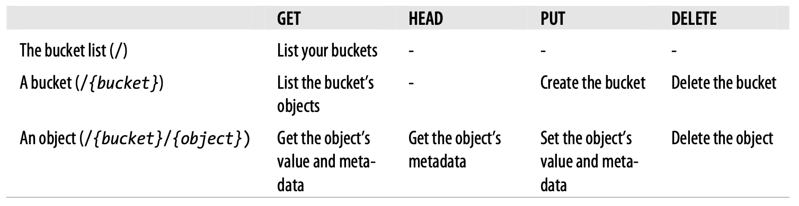

# 第 3 章 RESTful 服务有何不同？

我之前对你使用了一种 “调包计”，现在是时候纠正了。
尽管这是一本关于 RESTful Web 服务的书，但我向你展示的大多数真实服务都是像 del.icio.us API 这样的 REST-RPC 混合体：
这些服务不完全像 Web 的其余部分那样工作。
这是因为目前，像 Web 一样工作的知名 RESTful 服务并不多。
在前面的章节中，我想向你展示你可能听说过的真实服务的客户端，所以我不得不接受现有的选择。

del.icio.us 和 Flickr API 是混合服务的好例子。
它们在获取数据时像 Web 一样工作，但在修改数据时却是 RPC 风格服务。
Yahoo! 的各种搜索服务非常 RESTful，但它们太简单了，不能作为好例子。
Amazon E-Commerce Service（见 [示例 1-2](ch1.md#example-1-2) ）也相当简单，并在一些晦涩但重要的方面转向了 RPC 风格。

这些服务都很有用。
我认为 RPC 风格不适合 Web 服务，但如果另一端有有趣的数据，这从不阻止我编写 RPC 风格客户端。
不过，我不能将 Flickr 或 del.icio.us API 作为如何设计 RESTful Web 服务的示例。
这就是为什么我在本书早期就介绍了它们，当时我唯一想展示的是可编程 Web 上有什么以及如何编写 HTTP 客户端。
现在我们即将进入一个重要的设计章节，我需要向你展示当一个服务是 RESTful 且面向资源时，它是什么样子的。

## 介绍 Simple Storage Service

有两个流行的 Web 服务可以满足这一需求：Atom Publishing Protocol（APP）和 Amazon 的 Simple Storage Service（S3）。
（ [附录 A](appendix-a.md) 列出了一些公开部署的 RESTful Web 服务，其中许多你可能尚未听说过。）
APP 与其说是一个实际的服务，不如说是一组构建服务的指令，因此我将从 S3 开始，它确实存在于 Web 上的特定位置。
在 [第 9 章](ch9.md) 中，我将讨论 APP、Atom 以及 Google 的 GData 等相关主题。
在本章余下的大部分内容中，我将探讨 S3。

S3 是一种以你喜欢的任何结构存储任何数据的方式。
你可以将数据保持私有，或使其对任何拥有 Web 浏览器或 BitTorrent 客户端的人可访问。
Amazon 托管存储和带宽，并按 GB 向两者收费。
要使用本章中的 S3 示例代码，你需要通过访问 http://aws.amazon.com/s3 注册 S3 服务。
S3 技术文档位于 http://docs.amazonwebservices.com/AmazonS3/2006-03-01/ 。

S3 主要有两种用途：

**备份服务器**

你通过 S3 存储数据，不授予其他人访问权限。
你不是购买自己的备份磁盘，而是向 Amazon 租用磁盘空间。

**数据主机**

你将数据存储在 S3 上，并授予他人访问权限。
Amazon 通过 HTTP 或 BitTorrent 提供你的数据。
你不是向 ISP 支付带宽费用，而是向 Amazon 支付。
根据你现有的带宽成本，这可以为你节省大量资金。
当今许多 Web 初创公司使用 S3 来提供数据文件。

与我迄今为止展示的服务不同，S3 并非受任何现有网站启发。
del.icio.us API 基于 del.icio.us 网站，Yahoo! 搜索服务基于相应的网站，但在 amazon.com 上没有你可以填写 HTML 表单将文件上传到 S3 的网页。
S3 仅用于编程用途。
（当然，如果你将 S3 用作数据主机，人们将通过他们的 Web 浏览器使用它，甚至不知道他们正在发起 Web 服务调用。它的行为将像一个普通网站。）

Amazon 提供了 Ruby、Python、Java、C# 和 Perl 的示例库（参见 http://developer.amazonwebservices.com/connect/kbcategory.jspa?categoryID=47 ）。
还有第三方库，如 Ruby 的 AWS::S3（ http://amazon.rubyforge.org/ ），其中包含我在 [示例 1-4](ch1.md#example-1-4) 中演示的 `s3sh` shell。

## S3 的面向对象设计

S3 基于两个概念：S3 “存储桶” 和 S3 “对象”。
一个对象是一个带有相关元数据的命名数据片段。
一个存储桶是对象的命名容器。
存储桶类似于你硬盘驱动器上的文件系统，对象类似于该文件系统上的一个文件。
将存储桶与文件系统上的目录进行比较是很有诱惑力的，但文件系统目录可以嵌套，而存储桶不能。
如果你想要存储桶内的目录结构，你需要通过给对象命名，如 “directory/subdirectory/file-object” 来模拟它。

### 关于存储桶的几点说明

一个存储桶有一项与之相关的信息：名称。存储桶名称只能包含字符 A 到 Z、a 到 z、0 到 9、下划线、句点和破折号。
我建议在存储桶名称中避免使用大写字母。

如上所述，存储桶不能包含其他存储桶：只能包含对象。
每个 S3 用户限制为 100 个存储桶，并且你的存储桶名称不能与其他人的冲突。
我建议你要么将所有内容保留在一个存储桶中，要么根据你的项目或域名命名每个存储桶。

### 关于对象的几点说明

一个对象有四个部分：

- 对父存储桶的引用

- 存储在该对象中的数据（S3 称之为 “value”）

- 一个名称（S3 称之为 “key”）

- 与对象关联的一组元数据键值对。
这主要是自定义元数据，但也可以包括标准 HTTP 首部 `Content-Type` 和 `Content-Disposition` 的值

如果我想在 S3 上托管 O'Reilly 网站，我会创建一个名为 “oreilly.com” 的存储桶，并在其中填充对象，其键为 “”（空字符串）、“catalog”、“catalog/9780596529260” 等。
这些对象对应于 URI http://oreilly.com/、http://oreilly.com/catalog 等。
对象的值将是 O'Reilly 网页的 HTML 内容。
这些 S3 对象的 `Content-Type` 元数据值将设置为 `text/html`，以便浏览网站的人将这些对象作为 HTML 文档提供，而不是作为 XML 或纯文本。

### 如果 S3 是一个独立的库会怎样？

如果 S3 被实现为面向对象的代码库而非 Web 服务，你将会有两个类：`S3Bucket` 和 `S3Object`。
它们会有数据成员的 getter 和 setter 方法：`S3Bucket#name`、`S3Object.value=`、`S3Bucket#addObject` 等。
`S3Bucket` 类会有一个实例方法 `S3Bucket#getObjects`，返回 `S3Object` 实例的列表，以及一个类方法 `S3Bucket.getBuckets`，返回你所有的存储桶。
示例 3-1 展示了这个类的 Ruby 代码可能的样子。

*示例 3-1. S3 实现为假设的 Ruby 库* <a id="example-3-1"></a>

```ruby
class S3Bucket
  # 一个类方法，用于获取你所有的存储桶
  def self.getBuckets
  end
  
  # 一个实例方法，用于获取存储桶中的对象
  def getObjects
  end
  ...
end

class S3Object
  # 获取与此对象关联的数据
  def data
  end
  
  # 设置与此对象关联的数据
  def data=(new_value)
  end
  ...
end
```

## 资源

Amazon 将 S3 暴露为两种不同的 Web 服务：
一种基于纯 HTTP 信封的 RESTful 服务，和一种基于 SOAP 信封的 RPC 风格服务。
RPC 风格服务暴露的函数与示例 3-1 假设 Ruby 库中的方法非常相似：`ListAllMyBuckets`、`CreateBucket` 等。
事实上，许多 RPC 风格 Web 服务是从其实现方法自动生成的，并暴露与它们在后台调用的编程语言代码相同的接口。
这之所以有效，是因为大多数现代编程（包括面向对象编程）都是过程式的。

RESTful S3 服务暴露了 RPC 风格服务的所有功能，但不用自定义命名的函数，而是暴露称为资源的标准 HTTP 对象。
资源不响应像 `getObjects` 这样的自定义方法名称，
而是响应六种标准 HTTP 方法中的一种或多种：GET、HEAD、POST、PUT、DELETE 和 OPTIONS。

RESTful S3 服务提供三种类型的资源。
这里列出它们，每种带有示例 URI：

- 你的存储桶列表（`https://s3.amazonaws.com/`）。这种类型只有一个资源。

- 一个特定的存储桶（`https://s3.amazonaws.com/{name-of-bucket}/`）。这种类型最多可有 100 个资源。

- 存储桶内的特定 S3 对象（`https://s3.amazonaws.com/{name-of-bucket}/{name-of-object}`）。
这种类型可以有无限多个资源。

我假设的面向对象 S3 库中的每个方法都对应于这三种类型资源之一上的六种标准方法之一。
getter 方法 `S3Object#name` 对应于对 “S3 对象” 资源的 GET 请求，setter 方法 `S3Object#value=` 对应于对同一资源的 PUT 请求。
工厂方法如 `S3Bucket.getBuckets` 和关系方法如 `S3Bucket#getObjects` 对应于对 “存储桶列表” 和 “存储桶” 资源的 GET 方法。

每个资源暴露相同的接口并以相同的方式工作。
要获取对象的值，你向该对象的 URI 发送 GET 请求。
要仅获取对象的元数据，你向同一 URI 发送 HEAD 请求。
要创建存储桶，你向包含存储桶名称的 URI 发送 PUT 请求。
要向存储桶添加对象，你向包含存储桶名称和对象名称的 URI 发送 PUT 请求。
要删除存储桶或对象，你向它的 URI 发送 DELETE 请求。

S3 设计者并非凭空捏造。
根据 HTTP 标准，这就是 GET、HEAD、PUT 和 DELETE 的用途。
这四种方法（加上 S3 不使用的 POST 和 OPTIONS）足以描述与 Web 上资源的所有交互。
要将程序暴露为 Web 服务，你无需发明新的词汇或将方法名称偷偷放入 URI 中，也不需要做任何事情，除了仔细考虑你的资源设计。
每个 REST Web 服务，无论多么复杂，都支持相同的基本操作。
所有复杂性都存在于资源中。

表 3-1 显示了当你向 S3 资源的 URI 发送 HTTP 请求时会发生什么。

*表 3-1. S3 资源及其方法*
<br/>

那张表看起来有点荒谬。
我为什么要占用宝贵的篇幅来打印它？
一切都只是按照它所说的去做。
这正是我打印它的原因。
在一个设计良好的 RESTful 服务中，一切都按照它所说的去做。

你很可能对这一说法持怀疑态度，鉴于到目前为止的证据。
S3 是一个相当通用的服务。
如果你所做的只是将数据放入命名的槽位中，那么当然你可以只使用像 GET 和 PUT 这样的通用动词来实现服务。
在 [第 5 章](ch5.md) 和 [第 6 章](ch6.md) 中，我将向你展示将任何类型的操作映射到统一接口的策略。
作为一个预先说服的例子，请注意我能够通过将 “存储桶列表” 定义为一个新资源（仅响应 GET）来消除 `S3Bucket.getBuckets`。
还要注意 `S3Bucket#addObject` 作为资源设计的自然结果而消失了，该设计要求每个对象都与某个存储桶关联。

将此与 S3 的 RPC 风格 SOAP 接口进行比较。
要通过 SOAP 获取存储桶列表，方法名称是 `ListAllMyBuckets`。
要获取存储桶的内容，方法名称是 `ListBucket`。
使用 RESTful 接口，始终是 GET。
在 RESTful 服务中，URI 指定一个对象（在面向对象的意义上），方法名称是标准化的。
同样的一些方法在资源和服务之间以相同的方式工作。

## HTTP 响应码

<ins>RESTful 架构的另一个定义性特征是它对 HTTP 响应码的使用</ins>。
如果你向 S3 发送请求，且 S3 处理无误，你可能会收到 HTTP 响应码 200（“OK”），就像你在浏览器中成功获取网页时一样。
如果出现问题，响应码将在 3xx、4xx 或 5xx 范围内：例如，500（“Internal Server Error”）。
错误响应码是向客户端发出的信号，表明元数据和实体主体不应被解释为对请求的响应。
这不是客户端所请求的：而是服务器试图告知客户端问题所在。
由于响应码不是文档或元数据的一部分，客户端只需查看响应的前三个字节即可判断是否发生了错误。

示例 3-2 显示了一个示例错误响应。
我发起了一个针对不存在对象的 HTTP 请求（`https://s3.amazonaws.com/crummy.com/nonexistent/object`）。
响应码为 404（“Not Found”）。

*示例 3-2. S3 的示例错误响应*

```http
404 Not Found
Content-Type: application/xml
Date: Fri, 10 Nov 2006 20:04:45 GMT
Server: AmazonS3
Transfer-Encoding: chunked
X-amz-id-2: /sBIPQxHJCsyRXJwGWNzxuL5P+K96/Wvx4FhvVACbjRfNbhbDyBH5RC511sIz0w0
X-amz-request-id: ED2168503ABB7BF4

<?xml version="1.0" encoding="UTF-8"?>
<Error>
  <Code>NoSuchKey</Code>
  <Message>The specified key does not exist.</Message>
  <Key>nonexistent/object</Key>
  <RequestId>ED2168503ABB7BF4</RequestId>
  <HostId>/sBIPQxHJCsyRXJwGWNzxuL5P+K96/Wvx4FhvVACbjRfNbhbDyBH5RC511sIz0w0</HostId>
</Error>
```

HTTP 响应码在人类 Web 上未被充分利用。
当你请求页面时，你的浏览器不会显示 HTTP 响应码，因为当你可以直接查看文档来判断是否出错时，谁会想看数字代码呢？
当 Web 应用中发生错误时，大多数 Web 应用会发送 200（“OK”）以及一个提及错误的人类可读文档。
人类将错误文档误认为他们请求的文档的可能性非常小。

在可编程 Web 上，情况恰恰相反。
计算机程序擅长根据数字变量的值采取不同路径，而非常不擅长弄清楚文档 “意味着” 什么。
在没有预先安排规则的情况下，程序无法判断 XML 文档是包含数据还是描述错误。
HTTP 响应码就是规则：关于客户端应如何处理 HTTP 响应的粗略约定。
由于它们不是实体主体或元数据的一部分，客户端即使不知道如何读取响应，也能理解发生了什么。

除了 200（“OK”）和 404（“Not Found”）之外，S3 还使用了多种响应码。
最常见的可能是 403（“Forbidden”），当客户端未提供正确凭据发起请求时使用。
S3 还使用其他几种，包括 400（“Bad Request”），表示服务器无法理解客户端发送的数据；
以及 409（“Conflict”），在客户端尝试删除非空存储桶时发送。
有关完整列表，请参阅 S3 技术文档中的 “The REST Error Response”。
我在 [附录 B](appendix-b.md) 中描述了每个 HTTP 响应码，重点关注它们在 Web 服务中的应用。
共有 41 个官方 HTTP 响应码，但日常使用中只有大约 10 个是重要的。

## 一个 S3 客户端

Amazon 的示例库以及像 AWS::S3 这样的第三方贡献，大大减少了自定义 S3 客户端库的需求。
但我向你介绍 S3，不仅仅是为了让你了解一个有用的 Web 服务。
我想用它来说明 REST 背后的理论。
因此，我将编写自己的 Ruby S3 客户端，并在编写过程中为你剖析它。

只是为了证明这是可行的，我的库将在 S3 服务之上实现一个面向对象的接口，类似于 [示例 3-1](#example-3-1) 中的那个。
结果看起来会像 ActiveResource 或其他对象关系映射器。
不过，它不是在底层调用 SQL 调用来将数据存储在数据库中，而是在底层发起 HTTP 请求以将数据存储在 S3 服务上。
我不给我的方法起像 `getBuckets` 和 `getObjects` 这样特定于资源的名称，而是尝试使用反映底层 RESTful 接口的名称：`get`、`put` 等。

我首先需要的是一个接口，用于 Amazon 相当不寻常的 Web 服务授权机制。
但这不如看到 Web 服务实际运行有趣，所以我暂时跳过它。
我将创建一个非常小的 Ruby 模块，名为 `S3::Authorized`，以便我的其他 S3 类可以包含它。
我将在最后回到它，并补充细节。

示例 3-3 展示了一段清理代码。

*示例 3-3. S3 Ruby 客户端：初始代码*

```ruby
#!/usr/bin/ruby -w
# S3lib.rb

# 发起 HTTP 请求和解析响应所需的库
require 'rubygems'
require 'rest-open-uri'
require 'rexml/document'

# 请求签名所需的库
require 'openssl'
require 'digest/sha1'
require 'base64'
require 'uri'

module S3 # 这是一个庞大的、包罗万象的模块的开始
  
  module Authorized
    # 输入你的公钥（Amazon 称之为 "Access Key ID"）和
    # 你的私钥（Amazon 称之为 "Secret Access Key"）。这是
    # 为了让你能签署你的 S3 请求，Amazon 知道向谁收费。
    @@public_key = ''
    @@private_key = ''
    
    if @@public_key.empty? or @@private_key.empty?
      raise "You need to set your S3 keys."
    end
    
    # 除非你使用的是像 Park Place 这样的 S3 克隆，否则你不应该更改此项。
    HOST = 'https://s3.amazonaws.com/'
  end
```

这个简陋的 `S3::Authorized` 唯一有趣的方面是，你应该在此处插入与你的 Amazon Web Services 账户关联的两个加密密钥。
你发出的每个 S3 请求都包含你的公钥（Amazon 称之为“Access Key ID”），以便 Amazon 识别你。
你发出的每个请求都必须使用你的私钥（Amazon 称之为“Secret Access Key”）进行加密签名，以便 Amazon 知道这确实是你。
我使用的是标准加密术语，即使你的 “私钥” 并非完全私有 —— Amazon 也知道它。
它是私有的，意味着你绝不应向任何人透露它。
如果你这样做了，你透露给的那个人将能够发起 S3 请求，并让 Amazon 向你收费。

### 存储桶列表

示例 3-4 展示了一个面向对象的类，用于我的第一个资源 —— 存储桶列表。
我将这个资源的类命名为 `S3::BucketList`。

*示例 3-4. S3 Ruby 客户端：`S3::BucketList` 类*

```ruby
# 存储桶列表。
class BucketList
  include Authorized

  # 获取该用户已定义的所有存储桶。
  def get
    buckets = []

    # GET 存储桶列表 URI，并从中读取一份 XML 文档。
    doc = REXML::Document.new(open(HOST).read)

    # 对于每个存储桶...
    REXML::XPath.each(doc, "//Bucket/Name") do |e|
      # ...创建一个新的 Bucket 对象并将其添加到列表中。
      buckets << Bucket.new(e.text) if e.text
    end

    return buckets
  end
end
```

<div style="background-color: darkgreen; padding: 8px; border-left: 4px solid lightgreen;">
<center>XPath 详解</center>

从右向左读，XPath 表达式 `//Bucket/Name` 的含义是：

查找文档中任意位置（`//`）的每个 `Name` 标签（`Name`），且该标签必须是 `Bucket` 标签（`Bucket/`）的直接子元素。
</div><br/>

现在我的文件是一个真正的 Web 服务客户端了。
如果我调用 `S3::BucketList#get`，我会发起一个安全的 HTTP GET 请求到 `https://s3.amazonaws.com/`，这恰好是资源 “你的存储桶列表” 的 URI。
S3 服务会返回一份类似示例 3-5 所示的 XML 文档。
这就是资源 “你的存储桶列表” 的一种表述形式（我将在下一章开始这样称呼它）。
它只是关于该列表当前状态的一些信息。
`Owner` 标签明确了这是谁的存储桶列表（我的 AWS 账户名称显然是 `leonardr28`），
而 `Buckets` 标签则包含了许多 `Bucket` 标签，
用以描述我的存储桶（在本例中，有一个 `Bucket` 标签和一个存储桶）。

*示例 3-5. 一份 “你的存储桶列表” 示例*

```xml
<?xml version='1.0' encoding='UTF-8'?>
<ListAllMyBucketsResult xmlns='http://s3.amazonaws.com/doc/2006-03-01/'>
  <Owner>
    <ID>c0363f7260f2f5fcf38d48039f4fb5cab21b060577817310be5170e7774aad70</ID>
    <DisplayName>leonardr28</DisplayName>
  </Owner>
  <Buckets>
    <Bucket>
      <Name>crummy.com</Name>
      <CreationDate>2006-10-26T18:46:45.000Z</CreationDate>
    </Bucket>
  </Buckets>
</ListAllMyBucketsResult>
```

就这个小型客户端应用程序而言，`Name` 是我对存储桶唯一感兴趣的方面。
XPath 表达式 `//Bucket/Name` 给出了每个存储桶的名称，这正是我创建 `Bucket` 对象所需的全部信息。

正如我们将看到的，这份 XML 文档中缺少的一项内容是链接。
该文档给出了每个存储桶的名称，但并未说明这些存储桶在 Web 上位于何处。
就 REST 设计准则而言，这是 Amazon S3 的主要不足之处。
幸运的是，编写客户端程序根据存储桶名称计算出 URI 并不太难。
我只需遵循之前给出的规则：`https://s3.amazonaws.com/{name-of-bucket}`。

### 存储桶

现在，如示例 3-6 所示，让我们编写 `S3::Bucket` 类，这样 `S3::BucketList.get` 就有东西可以实例化了。

*示例 3-6. S3 Ruby 客户端：`S3::Bucket` 类*

```ruby
# 您已在 S3 应用程序上存储（或将存储）的一个存储桶。
class Bucket
  include Authorized
  attr_accessor :name

  def initialize(name)
    @name = name
  end

  # 存储桶的 URI 是服务根地址加上存储桶名称。
  def uri
    HOST + URI.escape(name)
  end

  # 将此存储桶存储到 S3 上。类似于 ActiveRecord::Base#save，
  # 后者将对象存储到数据库中。关于 acl_policy 的讨论见下文正文。
  def put(acl_policy=nil)
    # 将 HTTP 方法作为 open() 的参数。同时设置此存储桶的 S3
    # 访问策略（如果提供了的话）。
    args = {:method => :put}
    args["x-amz-acl"] = acl_policy if acl_policy

    # 向此存储桶的 URI 发送 PUT 请求。
    open(uri, args)
    return self
  end

  # 删除此存储桶。除非存储桶为空，否则此操作将失败并返回 HTTP 状态码 409
  #（"Conflict"）。
  def delete
    # 向此存储桶的 URI 发送 DELETE 请求。
    open(uri, :method => :delete)
  end
end
```

这里有两个更多的 Web 服务方法：`S3::Bucket#put` 和 `S3::Bucket#delete`。
由于存储桶的 URI 唯一标识了该存储桶，删除操作很简单：你向存储桶 URI 发送 DELETE 请求，它就消失了。
由于存储桶的名称会进入其 URI，并且存储桶没有其他可设置的属性，创建存储桶也很容易：只需向其 URI 发送一个 PUT 请求即可。
正如我将在编写 `S3::Object` 时展示的那样，当并非所有数据都能存储在 URI 中时，PUT 请求会复杂得多。

之前我将我的 `S3::` 类与 ActiveRecord 类进行了比较，但 `S3::Bucket#put` 的工作方式与 ActiveRecord 对 `save` 的实现略有不同。
ActiveRecord 管理的数据库表中的每一行都有一个数字唯一 ID。
如果你获取一个 ID 为 23 的 ActiveRecord 对象并更改其名称，你的更改会反映为对 ID 为 23 的数据库记录的更改：

```sql
SET name="newname" WHERE id=23
```

S3 存储桶的永久 ID 是其 URI，而 URI 包含了名称。
如果你更改了存储桶的名称并调用 `put`，客户端并不会在 S3 上重命名旧的存储桶；
它会在一个新的 URI 上使用新名称创建一个新的空存储桶。
这是 S3 程序员所做出的设计决策的结果。
它并非必须如此。Ruby on Rails 框架有不同的设计：当它通过 RESTful Web 服务暴露数据库行时，行的 URI 会包含其数字数据库 ID。
如果 S3 是一个 Rails 服务，你会看到存储桶的 URI 类似于 `/buckets/23`。
重命名存储桶并不会改变 URI。

现在是 `S3::Bucket` 的最后一个方法，我将其命名为 `get`。
与 `S3::BucketList.get` 类似，此方法向资源的 URI（此处为 “存储桶” 资源）发起 GET 请求，获取一份 XML 文档，并将其解析为 Ruby 类的新实例（参见示例 3-7）。
此方法支持多种方式来过滤 S3 存储桶的内容。
例如，你可以使用 `:Prefix` 仅检索键以特定字符串开头的对象。
我不会详细展开这些过滤选项。
如果你感兴趣，可以参阅 S3 技术文档中关于 “Listing Keys” 的部分。

*示例 3-7. S3 Ruby 客户端：`S3::Bucket` 类（完结）*

```ruby
# 获取此存储桶中的对象：全部对象，或某个子集。
#
# 如果 S3 决定不返回整个存储桶/子集，则第二个返回值将被设为 true。
# 要获取剩余的对象，你需要操作子集选项（本书正文中未涵盖）。
#
# 子集选项包括：:Prefix、:Marker、:Delimiter、:MaxKeys。
# 详情请参阅 S3 文档中关于 "Listing Keys" 的部分。
def get(options={})
  # 获取此存储桶的基础 URI，并将任何子集选项附加到查询字符串上。
  uri = uri()
  suffix = '?'

  # 对于用户提供的每个选项...
  options.each do |param, value|
    # ...如果它是 S3 子集选项之一...
    if [:Prefix, :Marker, :Delimiter, :MaxKeys].member? param
      # ...则将其添加到 URI 中。
      uri << suffix << param.to_s << '=' << URI.escape(value)
      suffix = '&'
    end
  end

  # 现在我们已经构建好了 URI。向该 URI 发起 GET 请求，
  # 并读取一份列出存储桶中对象的 XML 文档。
  doc = REXML::Document.new(open(uri).read)
  there_are_more = REXML::XPath.first(doc, "//IsTruncated").text == "true"

  # 构建 S3::Object 对象的列表。
  objects = []
  # 对于存储桶中的每个对象...
  REXML::XPath.each(doc, "//Contents/Key") do |e|
    # ...构建一个 S3::Object 对象并将其追加到列表中。
    objects << Object.new(self, e.text) if e.text
  end

  return objects, there_are_more
end
```

<div style="background-color: darkgreen; padding: 8px; border-left: 4px solid lightgreen;">
<center>XPath 详解</center>

从右向左读，XPath 表达式 `//IsTruncated` 的含义是：

查找文档中任意位置（`//`）的每个 `IsTruncated` 标签（`IsTruncated`）。
</div><br/>

对应用程序的根 URI 发起 GET 请求，你会得到资源 “你的存储桶列表” 的一种表述。
对 “存储桶” 资源的 URI 发起 GET 请求，你会得到该存储桶的一种表述：一份类似示例 3-8 所示的 XML 文档，其中包含一个 `Contents` 标签，对应存储桶中的每个元素。

*示例 3-8. 一份存储桶表述示例*

```xml
<?xml version='1.0' encoding='UTF-8'?>
<ListBucketResult xmlns="http://s3.amazonaws.com/doc/2006-03-01/">
  <Name>crummy.com</Name>
  <Prefix></Prefix>
  <Marker></Marker>
  <MaxKeys>1000</MaxKeys>
  <IsTruncated>false</IsTruncated>
  <Contents>
    <Key>mydocument</Key>
    <LastModified>2006-10-27T16:01:19.000Z</LastModified>
    <ETag>"93bede57fd3818f93eedce0def329cc7"</ETag>
    <Size>22</Size>
    <Owner>
      <ID>c0363f7260f2f5fcf38d48039f4fb5cab21b060577817310be5170e7774aad70</ID>
      <DisplayName>leonardr28</DisplayName>
    </Owner>
    <StorageClass>STANDARD</StorageClass>
  </Contents>
</ListBucketResult>
```

在本例中，文档中我感兴趣的部分是存储桶对象的列表。
对象由其键（key）标识，我使用 XPath 表达式 `//Contents/Key` 来获取该信息。
我还关注某个布尔变量（`//IsTruncated`）：该文档是包含了存储桶中所有对象的键，还是 S3 认为对象太多无法在一个文档中发送，因此对列表进行了截断。

同样，这种表述中主要缺失的依然是链接。
该文档列出了大量关于对象的信息，但并未列出它们的 URI。
客户端需要知道如何将对象名称转换为该对象的 URI。
幸运的是，根据我之前给出的规则，构建对象的 URI 并不太难：`https://s3.amazonaws.com/{name-of-bucket}/{name-of-object}`。

### S3 对象

现在我们准备实现 S3 服务核心的接口：对象。
请记住，S3 对象只是一个被赋予了名称（键）和一组元数据键值对（例如 `Content-Type="text/html"`）的数据字符串。
当你向存储桶列表或存储桶发送 GET 请求时，S3 会提供一份你需要解析的 XML 文档。
当你向对象发送 GET 请求时，S3 会原样返回你之前 PUT 到那里的任何数据字符串。

示例 3-9 展示了 `S3::Object` 的开头部分，到目前为止这应该已经不陌生了。

*示例 3-9. S3 Ruby 客户端：`S3::Object` 类*

```ruby
# 一个 S3 对象，与存储桶关联，包含一个值和元数据。
class Object
  include Authorized

  # 客户端可以看到此对象位于哪个 Bucket 中。
  attr_reader :bucket

  # 客户端可以读取和写入此对象的名称。
  attr_accessor :name

  # 客户端可以写入此对象的元数据和值。
  # 相应的“读取”方法将在稍后定义。
  attr_writer :metadata, :value

  def initialize(bucket, name, value=nil, metadata=nil)
    @bucket, @name, @value, @metadata = bucket, name, value, metadata
  end

  # 对象的 URI 是其存储桶的 URI 再加上对象名称。
  def uri
    @bucket.uri + '/' + URI.escape(name)
  end
end
```

接下来是我对 HTTP HEAD 请求的首次实现。
我使用它来获取对象的元数据键值对，并以此填充元数据哈希表（`store_metadata` 的实际实现位于此类的末尾）。
由于我使用的是 `rest-open-uri`，发起 HEAD 请求的代码看起来与发起任何其他 HTTP 请求的代码相同（参见示例 3-10）。

*示例 3-10. S3 Ruby 客户端：`S3::Object#metadata` 方法*

```ruby
# 检索此对象的元数据哈希表，可能会从 S3 获取。
def metadata
  # 如果还没有元数据...
  unless @metadata
    # 向此对象的 URI 发起 HEAD 请求，并从响应中的 HTTP 标头读取元数据。
    begin
      store_metadata(open(uri, :method => :head).meta)
    rescue OpenURI::HTTPError => e
      if e.io.status == ["404", "Not Found"]
        # 如果对象不存在，则没有元数据，这不算错误。
        @metadata = {}
      else
        # 否则，这是一个错误。
        raise e
      end
    end
  end
  return @metadata
end
```

这里的目标是在不获取对象本身的情况下获取对象的元数据。
这就像下载一篇电影评论与下载一部电影之间的区别，而当你需要为带宽付费时，这是一个很大的区别。
元数据与表述之间的这种区分并非 S3 所独有，其解决方案对于所有面向资源的 Web 服务来说都是通用的。
<ins>HEAD 方法为任何客户端提供了一种方式，可以在不获取（可能非常庞大的）表述的情况下，获取任何资源的元数据。</ins>

当然，有时候你确实想要下载电影，这时就需要 GET 请求。
我在示例 3-11 的访问器方法 `S3::Object#value` 中放置了 GET 请求。
其结构与 `S3::Object#metadata` 相对应。

*示例 3-11. S3 Ruby 客户端：`S3::Object#value` 方法*

```ruby
# 检索此对象的值，可能会从 S3 获取（连同元数据一起）。
def value
  # 如果还没有值...
  unless @value
    # 向此对象的 URI 发起 GET 请求。
    response = open(uri)
    # 从响应的 HTTP 标头中读取元数据。
    store_metadata(response.meta) unless @metadata
    # 从实体主体中读取值。
    @value = response.read
  end
  return @value
end
```

客户端在 S3 服务上存储对象的方式与存储存储桶的方式相同：通过向特定 URI 发送 PUT 请求。
存储桶的 PUT 操作很简单，因为存储桶除了名称之外没有其他显著特征，而名称会放入 PUT 请求的 URI 中。
对象的 PUT 操作则更为复杂。
这时 HTTP 客户端需要指定对象的元数据（例如 `Content-Type`）和值。
这些信息将在未来的 HEAD 和 GET 请求中可用。

幸运的是，设置 PUT 请求并不十分复杂，因为对象的值完全由客户端决定。
我不需要将对象的值包装在 XML 文档或其他格式中。
我只需按原样发送数据，并设置与我的元数据哈希表中各项相对应的 HTTP 标头即可（参见示例 3-12）。

*示例 3-12. S3 Ruby 客户端：`S3::Object#put` 方法*

```ruby
# 将此对象存储到 S3 上。
def put(acl_policy=nil)
  # 从原始元数据的副本开始，如果还没有元数据，则从一个空哈希表开始。
  args = @metadata ? @metadata.clone : {}

  # 设置 HTTP 方法、实体主体以及一些额外的 HTTP 标头。
  args[:method] = :put
  args["x-amz-acl"] = acl_policy if acl_policy

  if @value
    args["Content-Length"] = @value.size.to_s
    args[:body] = @value
  end

  # 向此对象的 URI 发起 PUT 请求。
  open(uri, args)
  return self
end
```

`S3::Object#delete` 的实现（参见示例 3-13）与 `S3::Bucket#delete` 相同。

*示例 3-13. S3 Ruby 客户端：`S3::Object#delete` 方法*

```ruby
# 删除此对象。
def delete
  # 向此对象的 URI 发起 DELETE 请求。
  open(uri, :method => :delete)
end
```

示例 3-14 展示了如何将 HTTP 响应标头转换为 S3 对象元数据的方法。
除了 `Content-Type` 之外，你应该为设置的所有元数据标头添加前缀字符串 `x-amz-meta-`。
否则它们将无法在 S3 服务器和 Web 服务客户端之间完成往返传输。
S3 会认为它们是你客户端软件的奇异特性并将其丢弃。

*示例 3-14. S3 Ruby 客户端：`S3::Object#store_metadata` 方法*

```ruby
private

# 给定一个来自 HTTP 响应的标头哈希表，提取出与 S3 对象相关的标头，
# 并将其存储在实例变量 @metadata 中。
def store_metadata(new_metadata)
  @metadata = {}
  new_metadata.each do |h,v|
    if RELEVANT_HEADERS.member?(h) || h.index('x-amz-meta') == 0
      @metadata[h] = v
    end
  end
end

RELEVANT_HEADERS = ['content-type', 'content-disposition', 'content-range',
                    'x-amz-missing-meta']
end
```

## 请求签名与访问控制

我已经尽可能推迟这个话题，现在是时候处理 S3 认证问题了。
如果你的主要兴趣在于一般性的 RESTful 服务，可以自由跳到后面关于在客户端中使用 S3 库的部分。
但如果你对 S3 的内部机制产生了兴趣，请继续阅读。

到目前为止，我展示的代码确实可以发起 HTTP 请求，但 S3 会拒绝它们，因为它们缺少至关重要的 `Authorization` 标头。
S3 无法证明你就是你自己存储桶的所有者。
请记住，Amazon 会向你收取存储在服务器上的数据费用以及传输这些数据所使用的带宽费用。
如果 S3 接受未经授权就发往你的存储桶的请求，任何人都可以向你的存储桶中存储数据，而你却需要为此付费。

大多数需要认证的 Web 服务都使用标准的 HTTP 机制来确保你就是你所声称的那个人。
但 S3 的需求更为复杂。对于大多数 Web 服务，你绝不想让任何人使用你的数据。
但 S3 的用途之一就是作为托管服务。
你可能希望在 S3 上托管一个大型电影文件，让任何人通过其 BitTorrent 客户端下载，然后由 Amazon 向你寄送账单。

或者你可能在销售对存储在 S3 上的电影文件的访问权限。
你的电子商务网站从客户那里收取付款，然后给他们一个可以用于下载电影的 S3 URI。
你正在将作为你本人发起特定 Web 服务调用（GET 请求）的权利委托给其他人，并由你的账户支付费用。

HTTP 认证的标准机制无法为这类应用提供安全性。
通常，发送 HTTP 请求的人需要知道实际密码。
你可以防止他人窥探你的密码，但你无法对别人说：“这是我的密码，但你必须承诺只用它来请求这一个 URI。”

这是公钥加密的职责。
每次发起 S3 请求时，你使用你的 “私有” 密钥（记住，并非真正私有：Amazon 也知道它）对请求的重要部分进行签名。
这些部分包括 URI、你使用的 HTTP 方法，以及一些 HTTP 标头。
只有拥有 “私有” 密钥的人才能为你的请求创建这些签名，这就是 Amazon 知道向你收取该请求费用是合理的方式。
但一旦你对请求进行了签名，你可以将签名发送给第三方，而无需透露你的 “私有” 密钥。
第三方随后可以自由地发送与你签署的那份请求完全相同的 HTTP 请求，并让 Amazon 向你收费。
简而言之：其他人可以在有限时间内以你的身份发起特定请求，而无需知道你的 “私有” 密钥。

有一种更简单的方式可以为你的 S3 对象提供匿名访问，我将在下文讨论。
但无法绕过的是对你自己请求的签名，因此即使是像这样一个简单的库，如果想要正常工作，也必须支持请求签名。
我现在要重新打开 `S3::Authorized` Ruby 模块。
我将赋予它拦截对 `open` 方法的调用的能力，并在 HTTP 请求发出之前对其进行签名。
由于 `S3::BucketList`、`S3::Bucket` 和 `S3::Object` 都包含了这个模块，它们一旦我定义完这个能力就会继承它。
如果没有我即将编写的这段代码，我在上述类中定义的所有那些 `open` 调用将发送未签名的 HTTP 请求，这些请求会因响应码 403（“Forbidden”）而被 S3 弹回。
有了这段代码，你将能够生成已签名的 HTTP 请求，从而通过 S3 的安全措施（并花费你的钱）。
示例 3-15 及后续示例中的代码大量基于 Amazon 自己的 S3 示例库。

*示例 3-15. S3 Ruby 客户端：`S3::Authorized` 模块*

```ruby
module Authorized
  # 这些是 S3 认为对请求签名有意义的标准 HTTP 标头。
  INTERESTING_HEADERS = ['content-type', 'content-md5', 'date']

  # 这是自定义元数据标头的前缀。所有此类标头都被认为对请求签名有意义。
  AMAZON_HEADER_PREFIX = 'x-amz-'

  # 对 rest-open-uri 的 open() 实现的 S3 专用包装器。
  # 该实现会在发起请求之前设置一些 HTTP 标头。
  # 其中最重要的是 Authorization 标头，它包含 Amazon 将用于决定
  # 向谁收取此请求费用的信息。
  def open(uri, headers_and_options={}, *args, &block)
    headers_and_options = headers_and_options.dup
    headers_and_options['Date'] ||= Time.now.httpdate
    headers_and_options['Content-Type'] ||= ''
    signed = signature(uri, headers_and_options[:method] || :get,
                       headers_and_options)
    headers_and_options['Authorization'] = "AWS #{@@public_key}:#{signed}"
    Kernel::open(uri, headers_and_options, *args, &block)
  end
end
```

这里艰巨的工作在 `signature` 方法中，尚未定义。
该方法需要构造一个加密字符串，放入请求的 `Authorization` 标头中：这个字符串能够说服 S3 服务，让 S3 相信真的是你在发送请求 —— 或者你已经授权他人在你的费用下发起该请求（参见示例 3-16）。

*示例 3-16. S3 Ruby 客户端：`Authorized#signature` 方法*

```ruby
# 为 HTTP 请求构建加密签名。这是对一个“规范字符串”（包含请求的所有相关信息）的签名（使用你的私有密钥签名）。
def signature(uri, method=:get, headers={}, expires=nil)
  # 接受 URI 作为字符串或 Ruby URI 对象。
  if uri.respond_to? :path
    path = uri.path
  else
    uri = URI.parse(uri)
    path = uri.path + (uri.query ? "?" + query : "")
  end

  # 构建规范字符串，然后对其进行签名。
  signed_string = sign(canonical_string(method, path, headers, expires))
end
```

好吧，这个方法再次将任务转交给了 `sign`，后者作用于 `canonical_string` 的结果。
让我们来看看这两个方法，从 `canonical_string` 开始。
它将一个 HTTP 请求转换为一个类似于示例 3-17 的字符串。
该字符串以特定格式包含了关于 HTTP 请求的所有有意义的信息（从 S3 的角度来看）。
有意义的数据包括 HTTP 方法（PUT）、`Content-type`（`text/plain`）、一个日期、一些其他 HTTP 标头（`x-amz-metadata`），以及 URI 的路径部分（`/crummy.com/myobject`）。
这就是 `sign` 将要签名的字符串。
任何人都可以创建这个字符串，但只有 S3 账户持有者和 Amazon 知道如何生成正确的签名。

*示例 3-17. 示例请求的规范字符串*

```
PUT
text/plain
Fri, 27 Oct 2006 21:22:41 GMT
x-amz-metadata:Here's some metadata for the myobject object.
/crummy.com/myobject
```

当 Amazon 的服务器收到你的 HTTP 请求时，它会生成规范字符串，对其进行签名（同样，Amazon 知道你的私有密钥），并查看两个签名是否匹配。
这就是 S3 认证的工作原理。
如果签名匹配，你的请求就会被通过。
否则，你会收到响应码 403（“Forbidden”）。

示例 3-18 展示了生成规范字符串的代码。

*示例 3-18. S3 Ruby 客户端：`Authorized#canonical_string` 方法*

```ruby
# 将 HTTP 请求的元素转换为一个字符串，该字符串可被签名以证明请求来自你的 Web 服务账户。
def canonical_string(method, path, headers, expires=nil)
  # 为所有有意义的标头设置默认值。
  sign_headers = {}
  INTERESTING_HEADERS.each { |header| sign_headers[header] = '' }

  # 复制任何实际值，包括自定义 S3 标头的值。
  headers.each do |header, value|
    if header.respond_to? :to_str
      header = header.downcase
      # 如果是自定义标头，或者是 Amazon 认为有意义的标头...
      if INTERESTING_HEADERS.member?(header) ||
         header.index(AMAZON_HEADER_PREFIX) == 0
        # 将其添加到标头哈希表中。
        sign_headers[header] = value.to_s.strip
      end
    end
  end

  # 本库消除了对 Amazon 定义的 x-amz-date 标头的需求，但有人可能仍会设置它。
  # 如果设置了，我们将不使用 HTTP 标准的 Date 标头。
  sign_headers['date'] = '' if sign_headers.has_key? 'x-amz-date'

  # 如果提供了过期时间，它将覆盖任何 Date 标头。
  # 此签名将在过期时间之前有效，而不仅仅是在 Date 标头指定的那一秒内。
  sign_headers['date'] = expires.to_s if expires

  # 现在开始为请求构建规范字符串。我们从 HTTP 方法开始。
  canonical = method.to_s.upcase + "\n"

  # 按名称对标头进行排序，并将其（或仅其值）追加到待签名字符串中。
  sign_headers.sort_by { |h| h[0] }.each do |header, value|
    canonical << header << ":" if header.index(AMAZON_HEADER_PREFIX) == 0
    canonical << value << "\n"
  end

  # 待签名字符串的最后一部分是 URI 路径。
  # 我们去掉查询字符串，并在必要时附加特殊的 S3 查询参数之一：'acl'、'torrent' 或 'logging'。
  canonical << path.gsub(/\?.*$/, '')
  for param in ['acl', 'torrent', 'logging']
    if path =~ Regexp.new("[&?]#{param}($|&|=)")
      canonical << "?" << param
      break
    end
  end

  return canonical
end
```

`sign` 的实现仅仅是对 Ruby 标准加密和编码接口的一些封装（参见示例 3-19）。

*示例 3-19. S3 Ruby 客户端：`Authorized#sign` 方法*

```ruby
# 使用客户端的私有访问密钥对字符串进行签名，并将生成的二进制字符串
# 使用 base64 编码为纯 ASCII。
def sign(str)
  digest_generator = OpenSSL::Digest::Digest.new('sha1')
  digest = OpenSSL::HMAC.digest(digest_generator, @@private_key, str)
  return Base64.encode64(digest).strip
end
```
