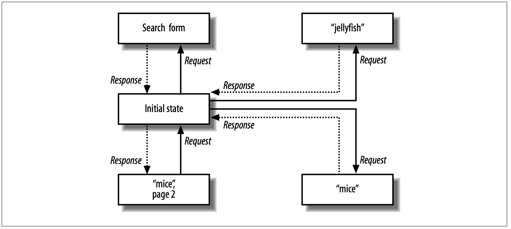
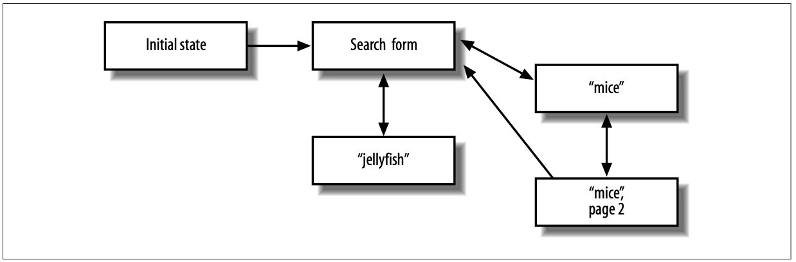
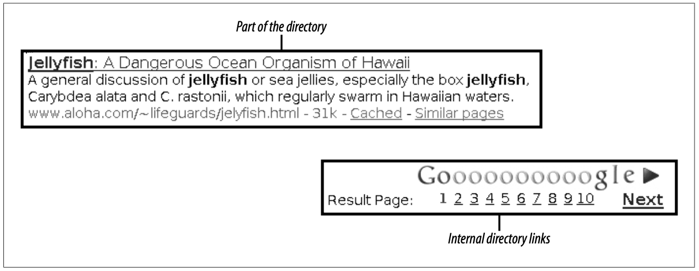
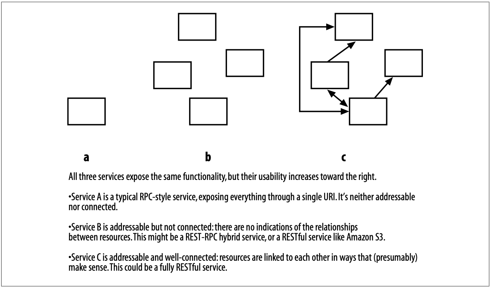
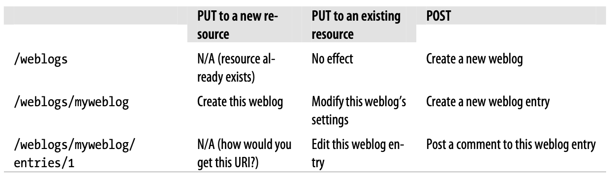

# 第 4 章 面向资源的架构

我已经向你展示了 REST 的力量，但我尚未以任何系统性的方式向你展示这种力量是如何构建的，或者如何将其暴露出来。
在本章中，我将概述一种具体的 RESTful 架构：面向资源的架构（Resource-Oriented Architecture，ROA）。
ROA 是一种将问题转化为 RESTful Web 服务的方法：一种 URI、HTTP 和 XML 的安排方式，其工作方式类似于 Web 的其余部分，并且程序员会乐于使用。

在 [第 1 章](ch1.md) 中，我根据两个问题的答案对 RESTful Web 服务进行了分类。
这些答案对应于 REST 四个定义性特征中的两个：

- 范围信息（“为什么服务器应该发送这份数据而不是那份数据？”）保存在 URI 中。
这是 *可寻址性* 原则。

- 方法信息（“为什么服务器应该发送这份数据而不是删除它？”）保存在 HTTP 方法中。
HTTP 方法只有少数几个，并且每个人都预先知道它们的作用。
这是 *统一接口* 原则。

在本章中，我将介绍面向资源的架构的活动部件：资源（当然）、它们的名称、它们的表述形式，以及它们之间的链接。
我将解释并推广 ROA 的属性：可寻址性、无状态性、连通性和统一接口。
我将展示 Web 技术（HTTP、URI 和 XML）如何实现这些活动部件，从而使这些属性成为可能。

在前面的章节中，我通过指向现有 Web 服务（如 S3）来说明概念。
在本章中，我将继续这一传统，但我也会通过指向现有网站来说明概念。
希望到现在我已经让你相信，网站就是 Web 服务，而且许多 Web 应用程序（如搜索引擎）就是 RESTful Web 服务。
当我讨论像可寻址性这样的抽象概念时，向你展示真实的 URI 是很有用的，你可以将它们输入到你的 Web 浏览器中，以查看这些概念的实际作用。

<a id="resource-oriented-what"></a>
## 面向资源——什么？

为什么要提出一个新术语 “面向资源的架构” ？
为什么不直接说 REST？
嗯，我确实在这本书的封面上说了 REST，并且我坚持认为面向资源架构中的所有内容也都是 RESTful 的。
<ins>但 REST 并不是一种架构：它是一组设计标准。
你可以说一种架构比另一种更符合这些标准，但并没有一个单一的 “REST 架构”。</ins>

到目前为止，人们倾向于根据各自对 REST 的理解，在设计服务时创造一次性的架构。
最明显的结果是，其创建者声称是 RESTful 的各种 REST-RPC 混合 Web 服务层出不穷。
我试图通过呈现一组具体的、用于构建真正 RESTful Web 服务的规则来制止这种情况。
在接下来的两章中，我甚至会展示你可以遵循的简单流程，将需求转化为资源。
如果你不喜欢我的规则，你至少会知道你可以改变什么并且仍然保持 RESTful。

作为一组设计标准，REST 是非常通用的。
特别是，它并不绑定于 Web。
REST 没有任何内容依赖于 HTTP 的机制或 URI 的结构。
但我正在讨论的是 Web 服务，因此我明确地将面向资源的架构与 Web 的技术绑定在一起。
我想讨论的是如何用 HTTP 和 URI 在特定的编程语言中实现 REST。
如果未来出现了不在 Web 之上运行的 RESTful 架构，它们的最佳实践可能看起来与 ROA 类似，但细节会有所不同。
我们到那时再具体问题具体分析。

REST 的传统定义留下了很多开放空间，从业者们用民间传说填充了这些空间。
我刻意比 Roy Fielding 在他的论文中，或 W3C 在他们的标准中走得更远：我想清理部分开放空间，以便民间传说有空间成长为一套定义明确的最佳实践。
即使 REST 是一种架构，用同样的名字来称呼我的架构也是不公平的。
我将把我基于经验的观察和建议，与那些构建 Web 的人更一般性的思想联系起来。

我提出新术语的最后一个原因是，“REST” 是一个用于宗教式极客战争中的术语。
当它被使用时，其隐含意义通常是存在一个真正的 RESTful 架构，而且就是说话者偏好的那个。
偏好另一种 RESTful 架构的人则不同意。
尽管在诸如 URI 和 HTTP 的价值等基本问题上存在普遍共识，REST 社区仍然分裂了。

理想情况下不应该有宗教战争，但我已经见得够多了，知道光靠期望无法结束它们。
<ins>因此，我给我关于 RESTful 应用程序应如何设计的理念赋予了一个独特的名称。
当这些想法不可避免地成为战争中的弹药时，不同意我观点的人可以针对面向资源的架构的各个方面，将其与其他 RESTful 架构以及整个 REST 区分开来讨论。
清晰是迈向理解的第一步</ins>。

“面向资源” 和 “面向资源的架构” 这些短语已被用来描述一般的 RESTful 架构。⁑
我不声称 “面向资源的架构” 是一个完全原创的术语，但我认为我的用法与先前存在的用法很好地融合在一起，而且使用这个术语比声称代表整个 REST 发言更好。

⁑ 我所找到的 “resource-oriented” 最早实例是 James Snell 于 2004 年在 IBM developerWorks 上发表的一篇文章：“Resource-oriented vs. activity-oriented Web services”（ http://www-128.ibm.com/developerworks/xml/library/ws-restvsoap/ ）。
Alex Bunardzic 在 2006 年 8 月使用了 “Resource-Oriented Architecture”，早于本书的宣布：http://jooto.com/blog/index.php/2006/08/08/replacing-service-oriented-architecture-with-resource-oriented-architecture/ 。
我并不同意这些文章中的全部观点，但我承认它们在术语使用上的优先性。

<a id="what-is-a-resource"></a>
## 什么是资源？

<ins>资源是任何重要到足以被作为事物本身来引用的东西。
如果你的用户可能 “想要创建指向它的超文本链接、对它做出或反驳断言、检索或缓存它的表述、通过引用将它的全部或部分包含到另一表述中、对其进行注解，或对其执行其他操作”，
那么你就应该将其设为资源。</ins>†

† “The Architecture of the World Wide Web”（ http://www.w3.org/TR/2004/REC-webarch-20041215/#p39 ），顺便提一句，其中充满了好引文：“软件开发人员应该预期跨应用程序共享 URI 将是有用的，即使这种效用最初并不明显。”
这可以成为 ROA 的战斗口号。

通常，资源是某种可以存储在计算机上并表示为比特流的东西：一份文档、数据库中的一行，或运行算法得到的结果。
资源可以是像苹果这样的物理对象，也可以是像勇气这样的抽象概念，但（正如我们稍后将看到的）这类资源的表述必然会令人失望。

以下是一些可能的资源：

- 软件版本的 1.0.3 版
- 软件的最新版本
- 2006 年 10 月 24 日的第一篇博客文章
- 阿肯色州小石城的道路地图
- 一些关于水母的信息
- 与水母相关的资源目录
- 1024 之后的下一个质数
- 1024 之后的下五个质数
- 2004 年第四季度的销售数据
- 两位熟人 Alice 和 Bob 之间的关系
- 缺陷数据库中的未关闭缺陷列表

<a id="uri"></a>
## URI

<ins>是什么让一个资源成为资源？
它必须至少有一个 URI。
URI 是资源的名称和地址。
如果一份信息没有 URI，它就不是一个资源，也不是真正在 Web 上的，除非是作为描述其他资源的某些数据。</ins>

还记得前言中的示例会话吗？
那时我在取笑 HTTP 0.9。
假设这是一个对 `http://www.example.com/hello.txt` 的 HTTP 0.9 请求：

|客户端请求|服务器响应|
|---|---|
|GET /hello.txt|Hello, world!|

HTTP 客户端通过连接到托管该资源的服务器（本例中为 `www.example.com`），并向服务器发送一个方法（“GET”）和资源的路径（“/hello.txt”）来操作该资源。
今天的 HTTP 1.1 比 0.9 稍微复杂一些，但其工作方式相同。
服务器和路径都来自资源的 URI。


|客户端请求|服务器响应|
|---|---|
|GET /hello.txt HTTP/1.1<br/>Host: www.example.com| 200 OK<br/> Content-Type: text/plain<br/> <br/> Hello, world!|


URI 背后的原理在 Tim Berners-Lee 的《Universal Resource Identifiers—Axioms of Web Architecture》（ http://www.w3.org/DesignIssues/Axioms ）中有很好的描述。
在本节中，我将阐述构建 URI 并将其分配给资源背后的原则。

💡 URI 是 Web 的基础技术。
在 HTML 之前就有超文本系统，在 HTTP 之前就有互联网协议，但它们彼此之间并不通信。
URI 将所有互联网协议互联成一个 Web，就像 TCP/IP 将 Usenet、Bitnet 和 CompuServe 等网络互联成一个单一的互联网一样。
然后 Web 吸收并淘汰了那些其他协议，就像互联网对私有网络所做的那样。

💡 今天我们浏览 Web（而非 Gopher）、从 Web 下载文件（而非 FTP 站点）、从 Web 搜索出版物（而非 WAIS）、在 Web 上进行对话（而非 Usenet 新闻组）。
像 Subversion 和 arch 这样的版本控制系统在 Web 上运行，而非自定义的 CVS 协议。
甚至电子邮件也在慢慢迁移到 Web 上。

💡 Web 淘汰其他协议，是因为它拥有大多数协议所缺乏的东西：一种标记每个可用项的简单方式。
Web 上的每个资源至少有一个 URI。
你可以把 URI 贴到广告牌上。
人们看到那个广告牌，将 URI 输入他们的 Web 浏览器，然后直接转到你想向他们展示的资源。
这看起来可能很奇怪，但在 URI 被发明之前，这种日常交互是不可能的。

### URI 应具有描述性

这是 ROA 在 REST 论文和 W3C 建议的稀疏建议之上构建的第一个要点。
我提议资源和其 URI 之间应该有一种直观的对应关系。
以下是我上面列出的资源的一些好的 URI：

- `http://www.example.com/software/releases/1.0.3.tar.gz`
- `http://www.example.com/software/releases/latest.tar.gz`
- `http://www.example.com/weblog/2006/10/24/0`
- `http://www.example.com/map/roads/USA/AR/Little_Rock`
- `http://www.example.com/wiki/Jellyfish`
- `http://www.example.com/search/Jellyfish`
- `http://www.example.com/nextprime/1024`
- `http://www.example.com/next-5-primes/1024`
- `http://www.example.com/sales/2004/Q4`
- `http://www.example.com/relationships/Alice;Bob`
- `http://www.example.com/bugs/by-state/open`

<ins>URI 应该具有结构。
它们应该以可预测的方式变化</ins>：你不应该为了水母去 `/search/Jellyfish`，而为了老鼠去 `/i-want-to-know-about/Mice`。
如果客户端知道服务 URI 的结构，它就可以创建自己的服务入口点。
这使得客户端很容易以你未曾想到的方式使用你的服务。

这不是 REST 的绝对规则，正如我们将在 “命名资源” 一节中看到的那样。
<ins>从技术上讲，URI 不一定要有任何结构或可预测性，但我认为它们应该有。
这是良好 Web 设计的规则之一，它在 RESTful 和 REST-RPC 混合服务中都同样适用。</ins>

### URI 与资源之间的关系

让我们考虑一些边界情况。
两个资源可以相同吗？
两个 URI 可以指定同一个资源吗？一个 URI 可以指定两个资源吗？

<ins>根据定义，没有两个资源可以是相同的。
如果它们相同，那么你实际上只有一个资源。
然而，在某个时刻，两个不同的资源可能指向相同的数据。</ins>
如果当前软件版本是 1.0.3，那么 `http://www.example.com/software/releases/1.0.3.tar.gz` 和 `http://www.example.com/software/releases/latest.tar.gz` 在一段时间内会指向同一个文件。
但这两个 URI 背后的概念是不同的：一个始终指向特定版本，另一个则指向客户端访问时的最新版本。
<ins>这是两个概念，也是两个资源。</ins>
当报告 1.0.3 版本的缺陷时，你不会链接到 `latest`。

<ins>一个资源可以有一个 URI，也可以有多个。</ins>
`http://www.example.com/sales/2004/Q4` 上的销售数据可能也可以通过 `http://www.example.com/sales/Q42004` 获取。
如果一个资源有多个 URI，客户端引用该资源会更加方便。
缺点在于，每增加一个 URI 都会削弱所有其他 URI 的价值。
一些客户端使用一个 URI，另一些使用另一个，并且没有自动的方式来验证所有 URI 是否指向同一资源。

💡 解决这个问题的一种方法是，为同一资源暴露多个 URI，但指定其中一个作为该资源的 “规范” URI。
当客户端请求规范 URI 时，服务器会发送相应的数据以及响应码 200（“OK”）。
当客户端请求其他 URI 之一时，服务器会发送响应码 303（“See Also”）以及规范 URI。
<ins>客户端无法直接看到两个 URI 是否指向同一资源，但它可以发出两次 HEAD 请求，看看一个 URI 是否重定向到另一个，或者两者是否都重定向到第三个 URI。</ins>

💡 另一种方法是，将所有 URI 视为相同来提供服务，但当有人请求非规范 URI 时，在 `Content-Location` 响应标头中给出 “规范” URI。

获取 `sales/2004/Q4` 可能会得到与获取 `sales/Q42004` 完全相同的数据流，因为它们是同一资源 “2004 年最后一个季度的销售数据” 的不同 URI。
获取 `releases/1.0.3.tar.gz` 可能会得到与获取 `releases/latest.tar.gz` 完全相同的数据流，但它们是不同的资源，因为它们代表了不同的东西：“版本 1.0.3” 和 “最新版本”。

<ins>每个 URI 都精确指定一个资源。
如果它指定了多个，那它就不是通用资源标识符（Universal Resource Identifier）。
然而，当你获取一个 URI 时，服务器可能会发送关于多个资源的信息：你所请求的那个以及其他相关的资源。
当你获取一个网页时，它通常传达一些自身的信息，但它也有指向其他网页的链接。</ins>
当你使用 Amazon S3 客户端检索一个 S3 存储桶时，你会得到一份包含该存储桶信息以及相关资源（存储桶中的对象）信息的文档。

## 可寻址性 <a id="addressability"></a>

现在我已经介绍了资源和它们的 URI，我可以深入探讨 ROA 的两个特性：可寻址性和无状态性。

如果一个应用程序将其数据集 (data set) 中有趣的方面作为资源暴露出来，那么它就是可寻址的。
由于资源通过 URI 暴露，一个可寻址的应用程序会为它可能提供的每一条信息都暴露一个 URI。
这通常是一个无限数量的 URI。

从最终用户的角度来看，可寻址性是任何网站或应用程序最重要的方面。
用户很聪明，如果数据足够有趣，他们会忽略或绕过几乎任何缺陷，但很难绕过可寻址性的缺失。

考虑一个真实的 URI，它命名了 “关于水母的资源目录” 这一类型中的某个资源：`http://www.google.com/search?q=jellyfish`。
那个水母搜索与 `http://www.google.com` 一样，都是一个真实的 URI。
如果 HTTP 不具备可寻址性，或者如果 Google 搜索引擎不是一个可寻址的 Web 应用程序，我就不可能在书中发布那个 URI。
我将不得不告诉你：“打开一个到 google.com 的 Web 连接，在搜索框中输入 ‘jellyfish’，然后点击 ‘Google Search’ 按钮。”

💡 这不是一个学术上的担忧。
直到 20 世纪 90 年代中期，当 `ftp://` URI 开始流行用于描述 FTP 站点上的文件时，人们不得不这样写：
“在 ftp.example.com 上启动匿名 FTP 会话。然后切换到目录 pub/files/ 并下载文件 file.txt。”
URI 使 FTP 变得像 HTTP 一样可寻址。
现在人们只需写：“下载 ftp://ftp.example.com/pub/files/file.txt。” 步骤是相同的，但现在它们可以由机器执行。

但 HTTP 和 Google 都是可寻址的，所以我可以在书中印出那个 URI。
你可以阅读并输入它。
当你这样做时，你最终会到达我当初通过 Google Web 应用程序时所到达的地方。

然后你可以将该页面加入书签，稍后再回来。
你可以将其链接到你自己的网页上。
你可以将 URI 通过电子邮件发送给其他人。
如果 HTTP 不具备可寻址性，你将不得不下载整个页面并将 HTML 文件作为附件发送。

为了节省带宽，你可以在本地网络上设置 HTTP 代理缓存。
第一次有人请求 `http://www.google.com/search?q=jellyfish` 时，缓存会保存一份文档的本地副本。
下次有人访问该 URI 时，缓存可能会提供保存的副本，而不是重新下载它。
只有当每个页面都有一个唯一标识字符串（即地址）时，这些事情才成为可能。

甚至可以将 URI 链式组合：将一个 URI 用作另一个 URI 的输入。
你可以使用外部 Web 服务来验证页面的 HTML，或将其文本翻译成另一种语言。
这些 Web 服务期望一个 URI 作为输入。如果 HTTP 不具备可寻址性，你将无法告诉它们你希望它们操作哪个资源。

Amazon 的 S3 服务是可寻址的，因为每个存储桶和每个对象都有自己的 URI，存储桶列表也是如此。
尚不存在的存储桶和对象还不是资源，但它们也有自己的 URI：你可以通过向其 URI 发送 PUT 请求来创建一个资源。

你家用电脑上的文件系统是另一个可寻址的系统。
命令行应用程序可以接受文件的路径并对其进行各种操作。
电子表格中的单元格也是可寻址的；你可以将单元格的名称填入公式中，公式将使用该单元格中当前的任何值。
URI 就是 Web 的文件路径和单元格地址。

可寻址性是 Web 应用程序最大的优点之一。
它使得客户端能够以原始设计者从未想过的方式使用网站。
遵循这一条规则就能让你和你的用户获得 REST 的许多好处。
<ins>这就是为什么 REST-RPC 服务如此普遍的原因：它们将可寻址性与过程调用的编程模型相结合。
这就是为什么我在面向资源的架构的名称中将资源放在首位：因为资源就是那种可寻址的东西。</ins>

这看起来很自然，就像是 Web 本该如此工作。
不幸的是，许多 Web 应用程序并非如此工作。
Ajax 应用程序尤其如此。
正如我在 [第 11 章](ch11.md) 中展示的那样，大多数 Ajax 应用程序只是 RESTful 或混合 Web 服务的客户端。
但当你把这些客户端当作网站使用时，你会注意到它们感觉并不像网站。

没必要挑小公司的毛病；让我们继续参观 Google 的产品，考虑 Gmail 在线电子邮件服务。
从最终用户的角度来看，只有一个 Gmail URI：`https://mail.google.com/`。
无论你做什么，无论你从 Gmail 检索或上传什么信息，你都不会看到不同的 URI。
资源 “关于水母的电子邮件” 并不可寻址，不像 Google 的 “关于水母的网页” 那样。‡
然而在幕后，正如我在 [第 11 章](ch11.md) 中所展示的，是一个可寻址的网站。
关于水母的电子邮件列表确实有一个 URI：`https://mail.google.com/mail/?q=jellyfish&search=query&view=tl`。
问题在于，你并不是那个网站的消费者。
该网站实际上是一个 Web 服务，真正的消费者是一个在你的 Web 浏览器中运行的 JavaScript 程序。§
Gmail Web 服务是可寻址的，但使用它的 Gmail Web 应用程序却不是。

‡ 将 Ajax 界面与通过访问 URI `https://mail.google.com/mail/?ui=html` 获得的更具可寻址性的 Gmail 版本进行对比。
如果你使用这个纯 HTML 界面，那么资源 “关于水母的电子邮件” 就是可寻址的。

§ 该 Web 服务的其他消费者包括适用于 Python 的 libgmail 库（ http://libgmail.sourceforge.net/ ）。

<a id="statelessness"></a>
## 无状态性

可寻址性是 ROA 的四个主要特性之一。
第二个是 *无状态性* 。
我将给出无状态性的两个定义：一个较为通用的定义，以及一个更面向 ROA 的实用定义。

<ins>无状态性意味着每个 HTTP 请求都在完全孤立的情况下发生。
当客户端发出 HTTP 请求时，它包含了服务器完成该请求所需的所有信息。
服务器从不依赖先前请求中的信息。
如果那些信息很重要，客户端会在本次请求中再次发送它。</ins>

更实际地看，可以从可寻址性的角度来考虑无状态性。
可寻址性表明，服务器所能提供的每一条有趣信息都应被暴露为资源，并赋予其自己的 URI。
<ins>无状态性表明，服务器的可能状态也属于资源，并且应该被赋予它们自己的 URI。
客户端不应该需要将服务器引导至某个特定状态，才能使其接受某个特定请求</ins>。

在人类使用的 Web 上，你经常会遇到浏览器后退按钮无法正常工作的情况，你无法在浏览器历史记录中来回导航。
有时这是因为你执行了不可撤销的操作，比如发布了一篇博客文章或购买了一本书，但通常是因为你访问的网站违反了无状态性原则。
这样的网站期望你按特定顺序发起请求：A、B，然后是 C。
当你第二次发起请求 B 而不是继续请求 C 时，它就会感到困惑。

让我们再次以搜索为例。
搜索引擎是一个具有无限多种可能状态的 Web 服务：至少对应你可能会搜索的每一个字符串。
每个状态都有其自己的 URI。
你可以向该服务请求关于老鼠的资源目录：`http://www.google.com/search?q=mice`。
你可以请求关于水母的资源目录：`http://www.google.com/search?q=jellyfish`。
如果你不习惯从头开始创建 URI，你可以向该服务请求一个要填写的表单：`http://www.google.com/`。

当你请求关于老鼠或水母的资源目录时，你得到的并不是整个目录。
你得到的只是目录中的一页：一个包含搜索引擎认为与你的查询最匹配的约 10 个条目的列表。
要获取目录的更多内容，你必须发出更多的 HTTP 请求。
第二页及后续页面是应用程序的不同状态，它们需要有自己独立的 URI，类似于：`http://www.google.com/search?q=jellyfish&start=10`。
与任何可寻址资源一样，你可以将应用程序的该状态传递给其他人、缓存它，或将其加入书签以便稍后返回。

图 4-1 是一个简单的状态图，展示了一个 HTTP 客户端如何与搜索引擎的四个状态进行交互。

这是一个无状态应用程序，因为每次客户端发出请求后，它都会回到起点。
每个请求与其他请求完全无关。
客户端可以以任意顺序、任意次数地请求这些资源。
它可以在请求 “mice” 的第 1 页之前先请求第 2 页（或者根本不请求第 1 页），而服务器不会在意。

作为对比，图 4-2 展示了以有状态方式排列的相同状态，各个状态之间以合理的方式相互衔接。
大多数桌面应用程序都是这样设计的。

这样组织起来要好得多，如果 HTTP 被设计为允许有状态交互，那么 HTTP 请求可能会简单得多。
当客户端启动与搜索引擎的会话时，它可以自动获得搜索表单。
它根本不需要发送任何请求数据，因为第一个响应是预先确定的。
如果客户端正在查看 “mice” 目录中的前 10 个条目，并且想要查看第 11 到 20 个条目，它只需发送一个说 “start=10” 的请求即可。
它不需要发送 `/search?q=mice&start=10`，重复那些初始断言：“我在搜索，而且是在搜索特定的 mice。”

<br/>
*图 4-1. 一个无状态的搜索引擎*

<a id="fig-4-2"></a>

<br/>
*图 4-2. 一个有状态的搜索引擎*

FTP 就是这样工作的：它有一个 “工作目录” 的概念，在会话过程中保持不变，除非你更改它。
你可能登录到一个 FTP 服务器，`cd` 到某个目录，然后从该目录获取一个文件。
你可以从同一目录获取另一个文件，而无需再次发出 `cd` 命令。
为什么 HTTP 不支持这一点呢？

状态会使单个 HTTP 请求变得更简单，但会使 HTTP 协议复杂得多。
FTP 客户端比 HTTP 客户端复杂得多，正是因为会话状态必须在客户端和服务器之间保持同步。
即使在可靠的网络上，这也是一项复杂的任务，而互联网并非可靠的网络。

从协议中消除状态，就是消除许多故障情况。
服务器永远不必担心客户端超时，因为没有任何交互持续的时间超过单个请求。
服务器永远不会失去对每个客户端在应用程序中 “位置” 的跟踪，因为客户端会在每个请求中发送所有必要的信息。
客户端永远不会因为服务器在未告知客户端的情况下保留了某些状态，而最终在错误的 “工作目录” 中执行操作。

无状态性还带来了新的特性。
将无状态应用程序分布到负载均衡的服务器上更为容易。
由于没有两个请求相互依赖，它们可以由两台永不协调的不同服务器来处理。
扩展就像向负载均衡器接入更多服务器一样简单。
无状态应用程序也易于缓存：一个软件只需查看单个请求，就可以决定是否缓存该 HTTP 请求的结果。
不会因先前请求的状态可能影响当前请求的可缓存性而产生挥之不去的不确定性。

客户端也从无状态性中受益。
客户端可以将 “mice” 目录处理到第 50 页，将 `/search?q=mice&start=50` 加入书签，然后在一周后回来，而无需费力地经过几十个前置状态。
一个在 HTTP 会话进行数小时后仍然有效的 URI，将与新会话中发送的第一个 URI 一样工作。

<ins>为了让你的服务具备可寻址性，你需要付出一些努力，将应用程序的数据分解为资源集。
HTTP 本质上是一个无状态协议，因此当你编写 Web 服务时，默认就能获得无状态性。
你需要做一些事情才会破坏它。</ins>

破坏无状态性最常见的方式是使用你所用框架中的 HTTP 会话（session）实现。
当用户第一次访问你的网站时，他会获得一个唯一字符串，用于标识他与该网站的会话。
该字符串可能保存在 Cookie 中，或者网站可能通过其提供给特定客户端的所有 URI 来传播这个唯一字符串。
以下是一个由 Rails 应用程序设置的会话 Cookie：

```
Set-Cookie: _session_id=c1c934bbe6168dcb904d21a7f5644a2d; path=/
```

这个 URI 则是在 PHP 应用程序中传播会话 ID 的方式：`http://www.example.com/forums?PHPSESSID=27314962133`。

重要的是，那个无意义的十六进制或十进制数字并不是状态本身。
它是服务器上某个数据结构的键，而该数据结构包含了真正的状态。
<ins>有状态的 URI 本身并非不符合 RESTful 原则：那正是服务器向客户端传达可能的下一个状态的方式。
然而，Cookie 确实存在某些不符合 RESTful 原则的问题，正如我在 “Cookie 的问题” 一节中所讨论的那样。
用 Web 浏览器的类比来说，Cookie 会破坏 Web 服务客户端的 “后退” 按钮功能。</ins>

想想 Google 搜索引擎提供的 HTML 页面中嵌入的 URI 里的查询变量 `start=10`。
那是服务器向客户端发送一个可能的下一个状态。
但是，这些 URI 需要包含状态本身，而不仅仅是提供存储在服务器上状态的键。
`start=10` 本身就有含义，而 `PHPSESSID=27314962133` 则没有。

<ins>RESTful 要求状态保留在客户端一侧，并在每个需要它的请求中传输给服务器。
服务器可以通过发送有状态的链接供客户端跟随，来引导客户端进入新状态，但它不能保留任何属于它自己的状态。</ins>

### 应用状态与资源状态

当我们谈论 “无状态性” 时，什么才算作 “状态”？
持久化数据 ——那些让我们首先想要使用 Web 服务的、有用的服务器端数据—— 与我们试图避免存放在服务器上的这种状态之间，有什么区别？
Flickr Web 服务允许你将图片上传到你的账户，这些图片存储在服务器上。
如果仅仅为了不让服务器存储任何状态，就让客户端在每次向 flickr.com 发起请求时都发送其每一张图片，那将是荒谬的。
那将完全违背了该服务的意义。
但这种场景与我声称应该避免存放在服务器上的客户端会话状态之间，有什么区别呢？

<ins>问题出在术语上。
无状态性暗示着只有一种状态，并且服务器应该不需要它。
实际上，有两种状态。
从本书的这一点开始，我将区分 *应用状态*（应当位于客户端）和 *资源状态*（应当位于服务器）。</ins>

当你使用搜索引擎时，你当前的查询和当前页面是客户端状态的片段。
这种状态对每个客户端来说都是不同的。
你可能在 “jellyfish” 搜索结果的第 3 页，而我可能在 “mice” 搜索结果的第 1 页。
页码和查询不同，是因为我们经历了不同的应用路径。
我们各自的客户端存储了不同的应用状态片段。

Web 服务只在你实际发起请求时才需要关心你的应用状态。
其余时间，它甚至不知道你的存在。
<ins>这意味着每当客户端发出请求时，它必须包含服务器处理该请求所需的所有应用状态。
服务器可能会返回一个包含链接的页面，告诉客户端将来可能想要发出的其他请求，但随后它可以完全忘记该客户端，直到下一个请求到来。
这就是我所说的 Web 服务应该是 “无状态” 的含义。
  客户端应该负责管理自己在应用中的路径。</ins>

<ins>资源状态对每个客户端来说都是相同的，其恰当的位置在服务器上。</ins>
当你上传一张图片到 Flickr 时，你创建了一个新资源：新图片有自己的 URI，并且可以成为未来请求的目标。
你可以通过 HTTP 获取、修改和删除这个 “图片” 资源。
它对所有人都是可用的：我也可以获取它。
这张图片是资源状态的一部分，它将留在服务器上，直到某个客户端将其删除。

客户端状态可能会在你意想不到的地方出现。
许多 Web 服务要求你注册一个唯一字符串，他们称之为 API 密钥或应用密钥。
你在每个请求中都发送这个密钥，服务器用它来限制你每天一定数量的请求。
例如，Google 已弃用的 SOAP 搜索 API 的密钥每天限制 1,000 次请求。
那就是客户端状态：它对每个客户端来说是不同的。
一旦你超过限制，服务的行为会发生剧烈变化：第 1,000 次请求你得到数据，第 1,001 次请求你得到一个错误。
与此同时，我正处于第 402 次请求，服务对我来说仍然正常工作。

当然，不能指望客户端自行报告这一应用状态片段：作弊的诱惑太大了。
因此，服务器将这类应用状态保留在服务器上，从而违反了无状态性。
API 密钥就像 Rails 的 `_session_id` cookie，是服务器端客户端会话（持续一天）的一个键。
这在一定程度上没问题，但需要付出可扩展性的代价。
如果服务要分布到多台机器上，集群中的每台机器都需要知道你正处于第 1,001 次请求，
而我正处于第 402 次请求（技术术语：会话复制）(session replication) ，以便每台机器都知道拒绝你的访问而允许我通过。
或者，负载均衡器需要确保你的每一个请求都发送到集群中的同一台机器（技术术语：会话亲和性）(session affinity) 。
无状态性消除了这一要求。
作为服务设计者，只有当你的资源状态需要跨多台机器拆分时，你才需要开始考虑数据复制的问题。

<a id="representation"></a>
## 表述

当你将应用程序拆分为资源时，你增加了它的表面积。
你的用户可以构造适当的 URI，并直接进入他们需要的位置进入你的应用程序。
<ins>但资源并不是数据本身；它们只是服务设计者关于如何将数据拆分为 “未关闭缺陷列表” 或 “关于水母的信息” 的想法。
Web 服务器无法发送一个想法；它必须发送一系列字节，以特定的文件格式、特定的语言呈现。
这就是资源的 *表述 (representations of the resources)* 。</ins>

<ins>资源是表述的来源，而表述只是关于资源当前状态的一些数据。
大多数资源本身就是数据项（如缺陷列表），因此资源的一种显而易见的表述就是数据本身。</ins>
服务器可以将未关闭缺陷列表呈现为 XML 文档、网页或逗号分隔的文本。
2004 年最后一个季度的销售数据可以用数字表示，也可以用图表表示。
许多新闻网站以广告密集的格式和精简的 “打印友好” 格式提供其文章。
这些都是同一资源的不同表述。

<ins>但有些资源代表物理对象或其他无法简化为信息的事物。
对于这些事物，什么是好的表述呢？
你不需要担心完美的保真度：表述是关于资源状态的任何有用信息。</ins>

考虑一个物理对象 ——一台汽水机—— 连接到 Web 服务。‖
目标是让机器的顾客避免不必要的往返。
通过该服务，顾客可以知道汽水何时变凉，以及他们最喜欢的品牌何时售罄。
没有人期望实际的汽水罐能通过 Web 服务提供，因为物理对象不是数据。
但它们确实有关于它们的数据：元数据。
汽水机中的每个槽位都可以配备一个设备，该设备知道下一个可用汽水罐的口味、价格和温度。
每个槽位都可以作为一个资源暴露，整个汽水机本身也可以。
来自这些仪器的元数据可以用于资源的表述中。

‖ 这个想法基于 CMU 汽水机（ http://www.cs.cmu.edu/%7Ecoke/ ），该机器被仪器观测多年，其当前状态可通过 Finger 协议访问。
该机器仍然存在，不过在撰写本文时，其状态无法在线访问。

即使一个对象的某一种表述包含了实际数据，它也可能还有其他包含元数据的表述。
一家在线书店可能会为一本书提供两种表述：

1. 一种只包含元数据，如封面图片和评论，用于宣传该书。
2. 该书数据的电子副本，在你付费后通过 HTTP 发送给你。

<ins>表述也可以反向流动。</ins>
你可以向服务器发送一个新资源的表述，让服务器创建该资源。
这就是当你上传图片到 Flickr 时发生的事情。
<ins>或者，你可以向服务器提供现有资源的一种新表述，让服务器修改该资源，使其与新的表述保持一致。</ins>

### 在表述之间做出选择

<ins>如果服务器为一个资源提供多种表述，它如何判断客户端请求的是哪一种呢？</ins>
例如，一份新闻稿可能同时发布英文版和西班牙文版。
某个特定客户端想要哪一个？

在 REST 的约束范围内，有多种方法可以解决这个问题。
<ins>最简单的一种，也是我为面向资源的架构（ROA）推荐的一种，是给资源的每种表述分配一个独立的 URI。
`http://www.example.com/releases/104.en` 可以指定新闻稿的英文表述，而 `http://www.example.com/releases/104.es` 可以指定西班牙文表述。</ins>

我推荐在 ROA 应用中使用这种技术，因为它意味着 URI 包含了服务器完成请求所需的所有信息。
缺点，正如你为同一资源暴露多个 URI 时一样，是稀释效应：用不同语言谈论该新闻稿的人，看起来像是在谈论不同的事物。
你可以通过暴露 URI `http://www.example.com/releases/104` 来表示该发布物的柏拉图式理想形式（独立于任何语言），从而在一定程度上缓解这个问题。

<ins>另一种方法称为 *内容协商* 。
在这种场景下，唯一暴露的 URI 是柏拉图式理想形式的 URI：`http://www.example.com/releases/104`。
当客户端对该 URI 发出请求时，它会提供特殊的 HTTP 请求标头，表明客户端愿意接受哪种类型的表述。</ins>

你的 Web 浏览器有一个语言偏好设置：你希望以哪种语言获取网页。
浏览器会在每个 HTTP 请求中通过 `Accept-Language` 标头提交此信息。
服务器通常忽略此信息，因为大多数网页只有一种语言。
但它符合我们这里想要做的事情：暴露同一资源的不同语言表述。
当客户端请求 `http://www.example.com/releases/104` 时，服务器可以根据客户端的 `Accept-Language` 标头决定提供英文还是西班牙文表述。

💡 Google 搜索引擎是一个尝试此功能的好地方。
你可以通过更改浏览器语言设置，或通过操作 URI 中的 `hl` 查询变量（例如，`hl=tr` 表示土耳其语），以几乎任何语言获取搜索结果。
该搜索引擎同时支持内容协商和为不同表述提供不同 URI 这两种方式。

客户端还可以设置 `Accept` 标头来指定它偏好哪种文件格式的表述。
客户端可以声明它偏好 XHTML 而非 HTML，或偏好 SVG 而非其他图形格式。

<ins>服务器在决定发送哪种表述时，可以使用这些请求元数据中的任何信息。
其他类型的请求元数据包括支付信息、认证凭据、请求时间、缓存指令，甚至客户端的 IP 地址。</ins>
所有这些都可能影响服务器在决定表述中包含哪些数据、使用哪种语言和格式，甚至是否发送表述或拒绝访问时的决策。

<ins>将此类信息放在 HTTP 标头中是 RESTful 的，将其放在 URI 中也是 RESTful 的。
我建议尽可能多地将此类信息放在 URI 中，而尽可能少地放在请求元数据中。
我认为 URI 比元数据更有用。
URI 会在人与人之间、程序与程序之间传递。
请求元数据几乎总是在传递过程中丢失。</ins>

这里有一个关于此困境的简单例子：W3C HTML 验证器，一个可在 `http://validator.w3.org/` 访问的 Web 服务。
这是 W3C 站点上某个资源的 URI，一个针对我假设的新闻稿英文版的验证报告：`http://validator.w3.org/check?uri=http%3A%2F%2Fwww.example.com%2Freleases%2F104.en`。
这是另一个资源：针对该新闻稿西班牙文版的验证报告：`http://validator.w3.org/check?uri=http%3A%2F%2Fwww.example.com%2Freleases%2F104.es`。

你 Web 空间中的每个 URI 都会成为 W3C Web 应用程序中的一个资源，无论它在你站点上是否指定了一个不同的资源。
如果你的新闻稿为每种表述都提供了独立的 URI，你可以从 W3C 获得两个资源：新闻稿英文版和西班牙文版的验证报告。

但是，如果你只暴露柏拉图式理想形式的 URI，并从该 URI 提供两种表述，你只能从 W3C 获得一个资源。
那将是该新闻稿默认版本（很可能是英文版）的验证报告。
你无法得知西班牙文表述是否包含 HTML 格式错误。
如果服务器没有将西班牙文新闻稿暴露为其自己的 URI，那么 W3C 站点上就没有对应的资源。
这并不意味着你不能暴露那个柏拉图式理想形式的 URI：只是它不应该是你使用的唯一 URI。

<br/> <a id="fig-4-3"></a>
*图 4-3. Google 搜索结果页面的特写*

与人类不同，计算机程序在处理它们未预料到的表述时非常糟糕。
我认为自动化 Web 客户端应该尽可能明确地说明它想要的表述。
这几乎总是意味着在 URL 中指定表述。

## 链接与连通性 <a id="links-and-connectedness"></a>

有时，表述仅仅是序列化的数据结构。它们的用途就是提取出其中的数据，之后便被丢弃。
但在最具 RESTful 风格的服务中，表述是超媒体：文档不仅包含数据，还包含指向其他资源的链接。

让我们再次以搜索为例。
如果你访问 Google 关于水母的文档目录（`http://www.google.com/search?q=jellyfish`），你会看到一些搜索结果，以及一组指向目录其他页面的内部链接。
[图 4-3](#fig-4-3) 展示了该页面的一个代表性样本。

这里有数据，也有链接。
数据表明，在 Web 上的某处，有人对水母说了如此这般的话，并着重提到了两种夏威夷水母。
链接让你可以访问其他资源：一些在 Google 搜索 “Web 服务” 内部，一些在 Web 上的其他地方：

- 讨论水母的外部网页：`http://www.aloha.com/~lifeguards/jelyfish.html`。
当然，这个 Web 服务的主要目的就是呈现此类链接。

- 指向 Google 提供的外部页面缓存的链接（ “Cached” 链接）。
这些链接通常有很长的 URI，指向 Google 拥有的 IP 地址，如 `http://209.85.165.104/search?q=cache:FQrLzPU0tKQJ...`

- 指向 Google 认为与外部页面相关的页面目录的链接（`http://www.google.com/search?q=related:www.aloha.com/~lifeguards/jelyfish.html`，链接文字为 “Similar pages”）。
这是 Web 服务以 URI 作为输入的另一个例子。

- 一组导航链接，带你到 “jellyfish” 目录的不同页面：`http://www.google.com/search?q=jellyfish&start=10`、`http://www.google.com/search?q=jellyfish&start=20`，等等。

在本章前面，我展示了如果 HTTP 像 FTP 一样是有状态协议可能会发生什么。
[图 4-2](#fig-4-2) 显示了一个有状态 HTTP 客户端在与 `www.google.com` 的 “会话” 期间可能采取的路径。
HTTP 实际上并不是那样工作的，但那幅图很好地展示了我们如何使用人机交互的 Web。
要使用搜索引擎，我们从首页开始，填写表单进行搜索，然后点击链接进入后续结果页面。
我们通常不会一个接一个地输入 URI：我们跟随链接并填写表单。

如果你以前读过关于 REST 的内容，你可能遇到过 Fielding 论文中的一个公理：“超媒体作为应用状态的引擎”。
这就是该公理的含义：HTTP “会话” 的当前状态不存储在服务器上作为资源状态，而是由客户端作为应用状态来跟踪，并通过客户端在 Web 上的路径来创建。
服务器通过提供 “超媒体” ——超文本表述中的链接和表单—— 来引导客户端的路径。

服务器向客户端发送关于当前状态附近有哪些状态的指引。
`http://www.google.com/search?q=jellyfish` 上的 “下一页” 链接就是一个状态杠杆：它告诉你如何从当前状态转移到相关状态。
这非常强大。
包含 URI 的文档指向应用程序的另一个可能状态：“第二页”、“与此 URI 相关” 或 “此 URI 的缓存版本”。
或者，它可能指向一个完全不同的应用程序的可能状态。

<ins>我将这种拥有链接的特性称为 *连通性*（connectedness）。
一个 Web 服务在多大程度上，你可以仅仅通过跟随链接和填写表单就能将服务置于不同状态，它就具有多大的连通性。
我称其为 “连通性”，是因为 “超媒体作为应用状态的引擎” 这个说法让这个概念听起来比实际更难。
我所说的只是：资源应该在其表述中相互链接。</ins>

人类使用的 Web 很容易使用，因为它连通性良好。
任何有经验的用户都知道如何将 URI 输入到浏览器的地址栏中，以及如何通过修改 URI 在站点内跳转，但许多用户所有的网络冲浪都是从单一出发点开始的：由他们的 ISP 设置的浏览器主页。
这之所以成为可能，是因为 Web 是高度连通的。
页面相互链接，甚至跨站点链接。

<ins>但大多数 Web 服务内部并不连通，更不用说相互连通了。</ins>
Amazon S3 是一个 RESTful Web 服务，它是可寻址且无状态的，但并 *不连通* 。
S3 的表述从不包含 URI。
要 GET 一个 S3 存储桶，你必须知道构造该存储桶 URI 的规则。
你不能仅仅通过 GET 存储桶列表然后跟随链接到达你想要的存储桶。

<br/>
*图 4-4. 一个服务的三种方式*

示例 4-1 展示了一个我修改过的 S3 存储桶列表（我添加了一个 `URI` 标签），使其具有连通性。
与没有 `URI` 标签的 [示例 3-5](ch3.md#example-3-5) 进行对比。
这只是将 URI 引入 XML 表述的一种方式。
随着资源之间连通性变得更好，它们之间的关系也变得更加明显（参见图 4-4）。

*示例 4-1. 一个连通的 “你的存储桶列表”*

```xml
<?xml version='1.0' encoding='UTF-8'?>
<ListAllMyBucketsResult xmlns='http://s3.amazonaws.com/doc/2006-03-01/'>
  <Owner>
    <ID>c0363f7260f2f5fcf38d48039f4fb5cab21b060577817310be5170e7774aad70</ID>
    <DisplayName>leonardr28</DisplayName>
  </Owner>
  <Buckets>
    <Bucket>
      <Name>crummy.com</Name>
      <URI>https://s3.amazonaws.com/crummy.com</URI>
      <CreationDate>2006-10-26T18:46:45.000Z</CreationDate>
    </Bucket>
  </Buckets>
</ListAllMyBucketsResult>
```

<a id="uniform-interface"></a>
## 统一接口

在整个 Web 上，你能对资源执行的基本操作只有少数几种。
HTTP 为四种最常见的操作提供了四种基本方法：

- 检索资源的表述：HTTP GET
- 创建新资源：向新 URI 发送 HTTP PUT，或向现有 URI 发送 HTTP POST（参见下文 “POST” 一节）
- 修改现有资源：向现有 URI 发送 HTTP PUT
- 删除现有资源：HTTP DELETE

我将解释这四种方法如何用于表示你能想到的几乎任何操作。
我还将涵盖另外两种不太常见的操作的 HTTP 方法：HEAD 和 OPTIONS。

### GET、PUT 和 DELETE

从 [第 3 章](ch3.md) 的 S3 示例中，你应该对这三种方法已经熟悉了。
要获取或删除一个资源，客户端只需向其 URI 发送 GET 或 DELETE 请求。
对于 GET 请求，服务器会在响应实体主体中返回一个表述。
对于 DELETE 请求，响应实体主体可能包含状态消息，也可能什么都不包含。

要创建或修改资源，客户端发送一个通常包含实体主体的 PUT 请求。
实体主体包含客户端对该资源的建议新表述。
这些数据是什么、采用什么格式，取决于具体的服务。
无论其形式如何，正是在这一点上，应用状态转移到服务器上，并成为资源状态。

再次以 S3 服务为例，其中有两种你可以创建的资源：存储桶和对象。
要创建一个对象，你向其 URI 发送 PUT 请求，并在请求的实体主体中包含对象的内容。
修改对象时也做同样的事情：新内容会覆盖任何旧内容。

创建存储桶则略有不同，因为你在 PUT 请求中不需要指定实体主体。
存储桶除了名称之外没有其他资源状态，而名称本身就是 URI 的一部分。
（这并不完全正确。存储桶中的对象也是该存储桶资源状态的组成部分：毕竟，当你 GET 存储桶的表述时，它们会被列出来。
但是每个 S3 对象都是其自身的资源，因此不需要通过其存储桶来操作对象。
每个对象都暴露统一接口，你可以单独操作它。）
指定存储桶的 URI 就等于指定了它的表述。
<ins>大多数资源的 PUT 请求确实包含带有表述的实体主体，但如你所见，这并不是必需的。</ins>

### HEAD 和 OPTIONS

还有另外三种 HTTP 方法，我认为它们是统一接口的一部分。
其中两种是简单的工具方法，所以我先介绍它们。

- 检索仅包含元数据的表述：HTTP HEAD
- 检查特定资源支持哪些 HTTP 方法：HTTP OPTIONS

你在 [第 3 章](ch3.md) 中已经看到 S3 服务的资源暴露了 HEAD 方法。
S3 客户端使用 HEAD 来获取资源的元数据，而无需下载可能非常庞大的实体主体。
这就是 HEAD 的用途。
<ins>客户端可以使用 HEAD 来检查资源是否存在，或获取有关资源的其他信息，而无需获取其完整表述。
HEAD 会给你与 GET 请求完全相同的内容，但没有实体主体。</ins>

💡 本书未涵盖两种标准的 HTTP 方法：TRACE 和 CONNECT。
TRACE 用于调试代理，CONNECT 用于通过 HTTP 代理转发其他协议。

<ins>OPTIONS 方法让客户端发现它对资源被允许执行哪些操作。
对 OPTIONS 请求的响应包含 HTTP `Allow` 标头，它列出了该资源所支持的统一接口的子集。</ins>
以下是一个示例 `Allow` 标头：

```
Allow: GET, HEAD
```

该特定标头意味着客户端可以期望服务器对此资源的 GET 或 HEAD 请求做出合理的响应，但该资源不支持任何其他 HTTP 方法。
实际上，这个资源是只读的。

<ins>客户端在请求中发送的标头可能会影响服务器在响应中发送的 `Allow` 标头。
例如，如果你在 OPTIONS 请求中附带正确的 `Authorization` 标头，你可能会发现自己被允许对特定 URI 进行 GET、HEAD、PUT 和 DELETE 请求。
如果你发送相同的 OPTIONS 请求但省略了 `Authorization` 标头，你可能会发现自己只被允许进行 GET 和 HEAD 请求。
OPTIONS 方法让客户端可以进行简单的访问控制检查。</ins>

理论上，服务器可以在响应 OPTIONS 请求时发送额外的信息，客户端也可以发送 OPTIONS 请求来询问关于服务器能力的非常具体的问题。
这很好，除了目前还没有关于客户端在 OPTIONS 请求中可能询问什么内容的公认标准。
除了 `Allow` 标头之外，也没有关于服务器可能在响应中发送什么内容的公认标准。
大多数 Web 服务器和框架对 OPTIONS 的支持都非常差。
到目前为止，OPTIONS 是一个很有前途但没有人使用的想法。

### POST

现在我们来到 HTTP 方法中最被误解的一个：POST。
此方法主要有两个用途：一个符合 REST 的约束，另一个则超出了 REST 的范畴，引入了 RPC 风格的元素。
在像这样复杂的情况下，最好的做法是回到原始文本。
以下是 HTTP 标准 RFC 2616 关于 POST 的说法（来自第 9.5 节）：

POST 方法被设计为允许一种统一的方法来涵盖以下功能：
*   对现有资源的注解；
*   向公告板、新闻组、邮件列表或类似的文章群组发布消息；
*   向数据处理过程提供一个数据块，例如提交表单的结果；
*   通过追加操作扩展数据库。

POST 方法执行的实际功能由服务器决定，并且通常取决于请求 URI。
所发布实体从属于该 URI，就像文件从属于包含它的目录、新闻文章从属于它被发布到的新闻组、或记录从属于数据库一样。

在 REST 和 ROA 的上下文中，这意味着什么？

#### 创建从属资源

<ins>在 RESTful 设计中，POST 通常用于创建从属资源：即相对于某个其他 “父” 资源而存在的资源。</ins>
博客程序可以将每个博客暴露为一个资源（`/weblogs/myweblog`），并将单篇博客文章暴露为从属资源（`/weblogs/myweblog/entries/1`）。
支持 Web 的数据库可以将表暴露为一个资源，并将单个数据库行暴露为其从属资源。
要创建一篇博客文章或一条数据库记录，你可以向父资源（博客或数据库表）发送 POST 请求。
你发布什么数据、采用什么格式，取决于具体的服务，但与 PUT 一样，正是在这一点上，应用状态转变为资源状态。
你可能会看到这种 POST 的用法被称为 POST(a)，代表 “追加”（append）。
当我在本书中说 “POST” 时，我几乎总是指 POST(a)。

为什么不能直接用 PUT 来创建从属资源呢？
嗯，有时是可以的。
S3 对象就是一个从属资源：每个 S3 对象都包含在某个 S3 存储桶中。
但我们不是通过向存储桶发送 POST 请求来创建 S3 对象的。
我们直接向对象的 URI 发送 PUT 请求。
<ins>PUT 和 POST 之间的区别在于：当客户端负责决定新资源应该使用哪个 URI 时，它使用 PUT；当服务器负责决定新资源应该使用哪个 URI 时，客户端使用 POST。</ins>

S3 服务期望客户端使用 PUT 来创建 S3 对象，因为 S3 对象的 URI 完全由其名称和存储桶名称决定。
如果客户端有足够的信息来创建对象，它就知道其 URI 将是什么。
作为 PUT 请求目标的显然 URI，就是该存储桶存在后将会驻留的 URI。

但考虑一个服务器对 URI 拥有更多控制权的应用程序：比如一个博客程序。
客户端可以收集创建博客文章所需的所有信息，但仍然不知道文章创建后的 URI 是什么。
也许服务器根据顺序或内部数据库 ID 来确定 URI：最终的 URI 会是 `/weblogs/myweblog/entries/1` 还是 `/weblogs/myweblog/entries/1000`？
也许最终的 URI 基于发布时间：服务器认为现在是什么时间？
客户端不应该需要知道这些事情。

POST 方法是一种无需客户端知道其确切 URI 即可创建新资源的方式。
在大多数情况下，客户端只需要知道 “父” 资源或 “工厂” 资源的 URI。
服务器接收来自实体主体的表述，并用它在 “父” 资源 “之下” 创建一个新资源（ “之下” 的含义取决于上下文）。

这种 POST 请求的响应通常带有 HTTP 状态码 201（“Created”）。
其 `Location` 标头包含新创建的从属资源的 URI。
既然资源实际存在且客户端知道了它的 URI，未来的请求就可以使用 PUT 方法来修改该资源，使用 GET 来获取它的表述，以及使用 DELETE 来删除它。

表 4-1 展示了向一个 URI 发送 PUT 请求如何创建或修改底层资源，以及向同一 URI 发送 POST 请求如何创建一个新的从属资源。

*表 4-1. PUT 动作*
<br/>

#### 追加到资源状态

在对资源的 POST 请求中所传达的信息，不一定要产生一个全新的从属资源。
有时，当你将数据 POST 到某个资源时，它会将你 POST 的信息追加到其自身的状态中，而不是将其放入一个新资源。

考虑一个事件日志服务，它暴露了一个单一资源：日志。
假设其 URI 为 `/log`。
要获取日志，你向 `/log` 发送 GET 请求。

那么，客户端应该如何向日志追加内容呢？
客户端可以向 `/log` 发送 PUT 请求，但 PUT 方法隐含着创建新资源，或用新设置覆盖旧设置的含义。
客户端两者都没有做：它只是将信息追加到日志的末尾。

POST 方法在这里适用，就像每个日志条目被暴露为独立资源时一样。
POST 的语义在两种情况下是相同的：客户端向现有资源添加从属信息。
唯一的区别在于，在博客和博客文章的例子中，从属信息表现为一个新资源。
而在这里，从属信息表现为父资源表述中的新数据。

#### 重载 POST：不那么统一的接口

这种看待方式解释了 HTTP 标准关于 POST 的大部分内容。
你可以用它来在父资源下创建资源，也可以用它将额外数据追加到资源的当前状态。
POST 的用途中我尚未解释的，是你最可能熟悉的那一个，因为它驱动了几乎所有 Web 应用程序：向数据处理过程提供一个数据块，例如提交表单的结果。

什么是 “数据处理过程”？
这听起来相当模糊。
而且，确实，几乎任何东西都可以是一个数据处理过程。
以这种方式使用 POST，会将资源转变为一个小型消息处理器，其行为类似于 XML-RPC 服务器。
该资源接受 POST 请求，检查请求，然后决定做……某事。
然后它决定向客户端提供……某些数据。

我将这种 POST 的用法称为 *重载 POST*（overloaded POST），类比编程语言中的运算符重载。
之所以说 “重载”，是因为单个 HTTP 方法被用来表示任意数量的非 HTTP 方法。
它的令人困惑之处与运算符重载可能带来的困惑相同：你原以为你知道 HTTP POST 的作用，但现在它被用于实现某个未知的目的。
你可能看到重载 POST 被称为 POST(p)，代表 “处理”（process）。

当你的服务暴露重载 POST 时，你会重新面对这个问题：“为什么服务器应该做这个而不是那个？”
每个 HTTP 请求都必须包含方法信息，而当你使用重载 POST 时，这些信息无法放入 HTTP 方法中。
POST 方法只是对服务器的一个指令，说：“在 HTTP 请求内部查找真正的方法信息。”
真正的信息可能位于 URI、HTTP 标头或实体主体中。
无论怎样，RPC 风格的一个元素已经潜入了该服务。

当方法信息不在 HTTP 方法中时，接口就不再是统一的。
真正的方法信息可能是任何东西。
<ins>作为 REST 的支持者，我并不喜欢这样，但有时这是不可避免的。
到 [第 9 章](ch9.md) 时，你将看到几乎任何你能想到的场景都可以通过 HTTP 的统一接口来暴露，但有时 RPC 风格是表达跨越多个资源的复杂操作的最简单方式。</ins>

即使你只使用 POST 来创建从属资源或追加到资源的表述，你可能仍然需要暴露重载 POST。
如果单个资源同时支持两种 POST 呢？
服务器如何知道客户端是在 POST 以创建从属资源，还是在追加到现有资源的表述？
你可能需要将一些额外的方法信息放在 HTTP 请求的其他地方。

<ins>重载 POST 不应该被用来掩盖糟糕的资源设计。
记住，资源可以是任何东西。
通常可以重新调整你的资源设计，以便应用统一接口，而不是将 RPC 风格引入你的服务。</ins>

### 安全性与幂等性

如果你按照设计意图来暴露 HTTP 的统一接口，你可以免费获得两个有用的属性。
当正确使用时，GET 和 HEAD 请求是 *安全* 的。
GET、HEAD、PUT 和 DELETE 请求是 *幂等* 的。

#### 安全性

GET 或 HEAD 请求是读取某些数据的请求，而不是更改任何服务器状态的请求。
客户端可以发出 10 次 GET 或 HEAD 请求，这与发出一次或根本不发出是一样的。
当你 GET `http://www.google.com/search?q=jellyfish` 时，你并没有改变水母资源目录的任何内容。
你只是在检索它的一种表述。
客户端应该能够向一个未知的 URI 发送 GET 或 HEAD 请求，并且确信不会发生任何灾难性的事情。

这并不是说 GET 和 HEAD 请求不能有副作用。
有些资源是点击计数器，每当客户端 GET 它们时就会递增。
大多数 Web 服务器会将每个传入请求记录到日志文件中。
这些是副作用：服务器状态，甚至资源状态，都在响应 GET 请求时发生变化。
但客户端并没有请求这些副作用，也不对它们负责。
客户端绝不应该仅仅为了副作用而发出 GET 或 HEAD 请求，而且副作用永远不应该大到让客户端希望自己没有发出该请求。

#### 幂等性

幂等性是一个稍微更微妙的概念。
这个想法来自数学，如果你不熟悉幂等性，一个数学例子可能会有所帮助。
数学中的幂等操作是指无论你应用一次还是多次，效果都相同的操作。
将一个数乘以零是幂等的：`4 × 0 × 0 × 0` 与 `4 × 0` 相同。﹟
<ins>类似地，对一个资源的操作如果发出一次请求与发出一系列相同请求的效果相同，那么该操作就是幂等的。
第二次及后续请求使资源状态保持在与第一次请求完全相同的状态</ins>。

﹟将一个数乘以一是既安全又幂等的：`4 × 1 × 1 × 1` 与 `4 × 1` 相同，也与 `4` 相同。
乘以零不是安全的，因为 `4 × 0` 与 `4` 不同。
乘以任何其他数既不安全也不幂等。

PUT 和 DELETE 操作是幂等的。
如果你 DELETE 一个资源，它就消失了。
如果你再次 DELETE 它，它仍然消失。
如果你使用 PUT 创建一个新资源，然后重新发送 PUT 请求，该资源仍然存在，并且具有你创建它时赋予它的相同属性。
如果你使用 PUT 更改资源的状态，你可以重新发送 PUT 请求，而资源状态不会再次改变。

<ins>实际的结果是，你不应该允许你的客户端 PUT 那些以相对方式改变资源状态的表述。</ins>
如果一个资源将某个数值作为其资源状态的一部分，客户端可以使用 PUT 将该值设置为 4、0 或 -50，但不能将该值增加 1。
如果初始值为 0，发送两个 “将值设置为 4” 的 PUT 请求会使值保持在 4。
如果初始值为 0，发送两个 “将值增加 1” 的 PUT 请求会使值不是保持在 1，而是变成 2。
那不是幂等的。

#### 为什么安全性和幂等性很重要

<ins>安全性和幂等性让客户端能够在不可靠的网络上发出可靠的 HTTP 请求。</ins>
如果你发出一个 GET 请求但没有收到响应，只需再发一个。
它是安全的：即使你之前的请求已经通过了，它也不会对服务器产生任何实际影响。
如果你发出一个 PUT 请求但没有收到响应，只需再发一个。
如果你之前的请求已经通过了，你的第二个请求不会有额外的影响。

POST 既不安全也不幂等。
向一个 “工厂” 资源发出两个相同的 POST 请求，很可能会导致两个包含相同信息的从属资源。
对于重载 POST，情况则完全不可预测。

对统一接口最常见的误用是通过 GET 暴露不安全的操作。
del.icio.us 和 Flickr API 都这样做。
当你 GET `https://api.del.icio.us/posts/delete` 时，你并不是在获取表述：你是在修改 del.icio.us 的数据集。

为什么这样不好呢？
嗯，这里有一个故事。
2005 年，Google 发布了一个名为 Web Accelerator 的客户端缓存工具。
它与你的 Web 浏览器协同运行，并 “预取” 你当前正在查看的页面所链接到的页面。
如果你碰巧点击了其中一个链接，另一侧的页面会加载得更快，因为你的计算机已经获取了它。

Web Accelerator 是一个灾难。
并不是因为软件本身有任何问题，而是因为 Web 上充斥着滥用 GET 的应用程序。
Web Accelerator 假设 GET 操作是安全的，假设客户端可以提前发出它们，以防人类用户想要查看相应的表述。
但当它对这些真实的 URI 发出 GET 请求时，却改变了数据集。
人们丢失了数据。

责任是多方面的：程序员不应该通过 GET 暴露不安全的操作，Google 也不应该发布一个在现实世界的 Web 上无法正常工作的真实工具。
当前版本的 Web Accelerator 会忽略所有包含查询变量的 URI。
这解决了部分问题，但也阻止了许多通过 GET 使用是安全的资源（如 Google 网页搜索）被预取。

你可以举出更多的例子。
许多 Web 服务和 Web 应用程序将 URI 作为输入，它们做的第一件事就是发送 GET 请求以获取资源的表述。
这些服务并不打算触发灾难性的副作用，但这不由它们决定。
而是由服务负责以符合 HTTP 标准的方式处理 GET 请求。

### 为什么统一接口很重要

<ins>关于 REST 的重点，并不在于你使用 HTTP 所定义的特定统一接口。
REST 规定了一个统一接口，但它并没有指定是哪一个统一接口。
GET、PUT 等并非适用于所有时代的完美接口。
重要的是 *统一性* ：即每个服务都以相同的方式使用 HTTP 的接口。</ins>

关键不在于 GET 是读取操作的最佳名称，而在于无论你在哪个资源上使用它，GET 在整个 Web 上都意味着 “读取”。
给定一个资源的 URI，如何获取其表述是毫无疑问的：你向该 URI 发送 HTTP GET 请求。
统一接口使得任意两个服务之间的相似性，就像任意两个网站之间的相似性一样。
如果没有统一接口，你将不得不学习每个服务期望如何接收和发送信息。
即使在同一服务内部，不同资源的规则也可能不同。

你可以对计算机进行编程，让它理解 GET 的含义，而这种理解将适用于每一个 RESTful Web 服务。
需要理解的内容并不多。
服务特定的代码可以存在于对表述的处理中。
如果没有统一接口，你将面临多种方法取代 GET 的位置：`doSearch`、`getPage`、`nextPrime`。
每个服务都说着不同的语言。
这也是我不太喜欢重载 POST 的原因：它将统一接口这种简单的世界语，变成了一座由一次性子语言组成的巴别塔。

<ins>有些应用程序扩展了 HTTP 的统一接口。
最明显的例子是 WebDAV，它增加了八个新的 HTTP 方法，包括 MOVE、COPY 和 SEARCH。
在 Web 服务中使用这些方法并不会违反 REST 的任何戒律，因为 REST 并没有规定统一接口应该是什么样的。
但使用它们会违反我的面向资源的架构（我明确地将 ROA 与标准的 HTTP 方法绑定在一起），不过你的服务仍然可以在一般意义上保持面向资源。</ins>

<ins>不使用 WebDAV 方法的真正原因是，这样做会使你的服务与其他 RESTful 服务不兼容。</ins>
你的服务将使用与大多数其他服务不同的统一接口。
确实有一些 Web 服务（如 Subversion）使用了 WebDAV 方法，所以你的服务不会孤零零的。
但它将成为一个更小的 Web 的一部分。
这就是为什么发明你自己的 HTTP 方法是一个非常非常糟糕的主意：你的自定义词汇将你置于一个只有你自己的社区中。
你还不如直接使用 XML-RPC。

另一种统一接口仅由 HTTP GET 和重载 POST 组成。
要获取资源的表述，你向它的 URI 发送 GET。
要创建、修改或删除资源，你发送 POST。
这个接口是完全 RESTful 的，但是，它同样不符合我的面向资源的架构。
这个接口刚好足以区分安全和不安全的操作。
一个面向资源的 Web 应用程序会使用这个接口，因为当今的 HTML 表单只支持 GET 和 POST。

<a id="that-is-it"></a>
## 就是这样！

这就是面向资源的架构（ROA）。
它只是四个概念：

1. 资源
2. 它们的名称（URI）
3. 它们的表述
4. 它们之间的链接

以及四个属性：

1. 可寻址性
2. 无状态性
3. 连通性
4. 统一接口

当然，仍然有很多悬而未决的问题。
如何将真实的数据集拆分为资源，以及如何布局这些资源？
实际的 HTTP 请求和响应中应该包含什么？
我将在本书的其余大部分内容中探讨这类问题。
