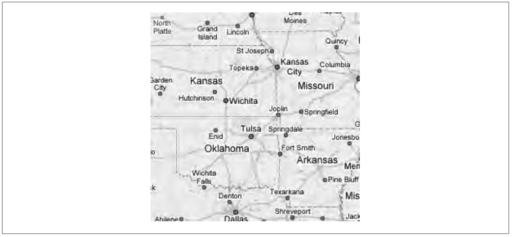
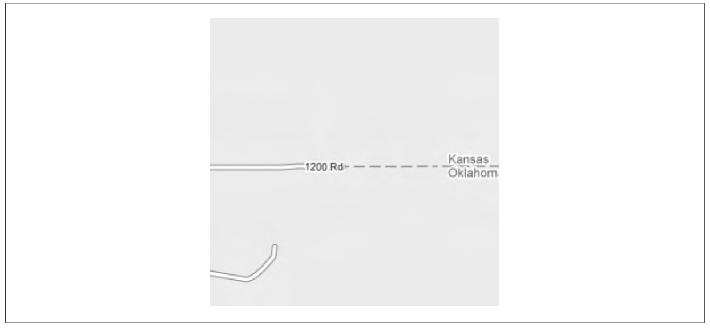
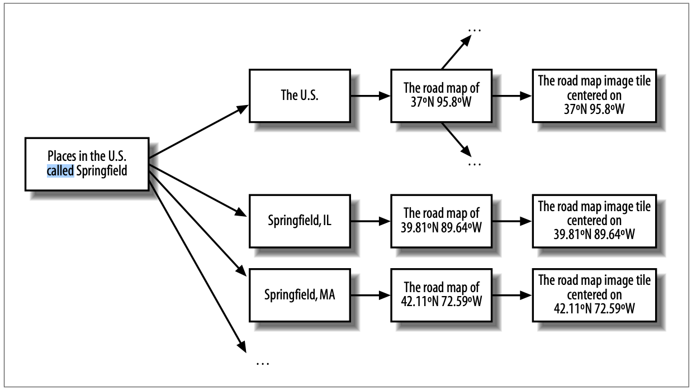
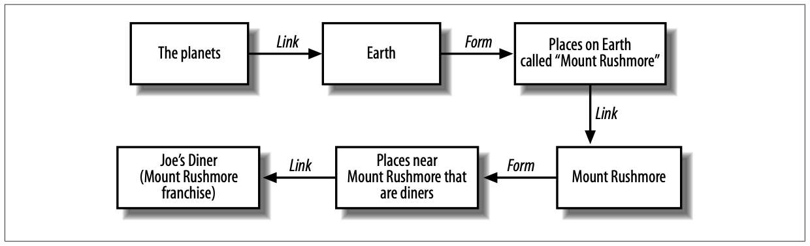

# 第 5 章 设计只读的面向资源服务

我们已经拥有一些信息，想要通过网络暴露给其他地方的人。
我们希望覆盖尽可能广泛的客户端组合。
每种编程语言都有 HTTP 库，因此自然的选择是通过 HTTP 暴露数据。
每种编程语言都有 XML 解析库，因此我们可以使用 XML 格式化数据，并始终能被理解。
太好了！

有时，思路就到此为止了。
解决方案显而易见，于是程序员们开始动手。
尽管这种方法很模糊，但它却出奇地有效。
大多数人对优秀网站的特征都有直觉上的熟悉，而优秀的 Web 服务的工作方式也大致相同。

不幸的是，这种凭直觉的方法将每个人的直觉混合成一种 Web 服务大杂烩，这些服务通常不是 RESTful 的（它们是 REST-RPC 混合体），并且仅在表面上相似。
如果你理解 REST 为什么有效，你就可以让你的服务更安全、更易于使用，并且可以通过标准工具访问。

有些 “Web 服务” 从未打算被这样使用，却似乎偶然地具备了 RESTful 的特质。
多年来被屏幕抓取的许多设计良好的网站就属于这一类。
许多图像提供者也是如此：例如，提供给 Google Maps 应用程序的静态地图瓦片，你可以通过更改 URI 来寻址地球的不同部分。
一个有趣的例子是 Amazon 的产品图片，可以通过在 URI 中添加额外字符串来以有趣的方式操作它们。⁑

⁑ 这个技巧在 Nat Gertler 的有趣文章 “Abusing Amazon Images”（ http://www.aaugh.com/imageabuse.html ）中有详细说明。

如此多的网站是 RESTful 的，这并非偶然。
一个设计良好的网站会为命名合理的资源提供简洁的表述，并通过 HTTP GET 访问。
简洁的表述易于解析或屏幕抓取，命名合理的资源易于通过编程方式寻址。使用 GET 获取表述尊重了 HTTP 的统一接口。按照这些规则设计网站，它就会很好地契合我的面向资源的架构。

既然我已经在 ROA 中介绍了 REST 的原则，接下来我将展示如何使用 ROA 来设计通过网络提供数据的程序化服务。
这些简单的服务为客户端提供了对数据集的访问。
它们甚至可能允许客户端过滤或搜索数据。
但它们不允许客户端修改数据或添加数据。
在 [第 6 章](ch6.md) 中，我将讨论允许你在服务器上存储和修改信息的 Web 服务。
现在，我专注于让客户端检索和搜索数据集。

我将讨论内容分开，是因为许多优秀的 Web 服务仅仅是将有用信息发送给需要它们的人。
这些并非玩具式的服务。
任何基于 Web 的数据库搜索都属于这一类：网页搜索、书籍搜索，甚至那种老套的股票报价 Web 服务（好吧，那个可能只是一个玩具）。
先涵盖这些较简单的、在现实生活中确实存在的案例，比试图在一章中包罗万象要更易于处理。
下一章的内容将直接建立在本章所述内容之上。
毕竟，一个允许客户端修改信息的 Web 服务，也必须允许它们检索信息。

在本章中，我将设计一个提供地图信息的 Web 服务。
它的灵感来自像 Google Maps 这样的 Web 应用程序，但那些站点（以及在其之上构建的第三方站点）是为人类临时使用而设计的。
与任何设计良好的网站一样，你可以将 Google Maps 的图像瓦片作为 Web 服务来使用，但这多少有些不合规且困难。
我在这里设计的虚构服务是一种对程序员友好的方式，可以用于任何目的检索地图数据，包括像 Google Maps Ajax 应用程序那样的基于浏览器的地图导航应用。

我不会实际实现这个服务。
实现起来太复杂，无法容纳在这本书中，而且我也没有必要的数据。
（不过请注意，在 [第 7 章](ch7.md) 中，我将使用本章的经验来实现一个类似于 del.icio.us 的社交书签服务。）
本章和下一章旨在教你如何从面向资源的角度来看待问题。
在此过程中，我希望向你展示，ROA 的简单规则和统一接口可以代表一个极其强大且相当复杂的分布式服务。

<a id="resource-design"></a>
## 资源设计

面向对象编程的标准设计技术是将系统分解为其活动部件：即其名词。
一个对象是某种事物。
每个名词（例如 “Reader”、“Column”、“Story”、“Comment”）都有自己的类，以及与其他名词交互的行为。
相比之下，RPC 风格架构的良好设计技术是将系统分解为其动作：即其动词。
一个过程执行某个操作（例如 “Subscribe to”、“Read”、“Comment on”）。

资源是某种事物，因此我采用面向对象的方法来设计资源。
事实上，面向资源的设策略可以称为 “极端面向对象”。
编程语言中的类可以暴露任意数量的方法并赋予它们任意名称，但 HTTP 资源暴露的是一个至多包含六个 HTTP 方法的统一接口。
这些方法只允许最基本的操作：创建（PUT 或 POST）、修改（PUT）、读取（GET）和删除（DELETE）。
如有必要，你可以通过重载 POST 来扩展此接口，将资源转变为一个小型 RPC 风格的消息处理器，但你不应该经常需要这样做。

一个服务可以暴露一个 `Story` 资源，并且一个 `Story` 可以以草稿或已发布的形式存在，但客户端不能将一篇草稿 `Story` 发布到正式站点上。
至少不能直接这样做：“publish” 并不是那六个动作之一。
客户端可以 PUT 一个新的表述给该 `Story`，将该表述描述为已发布状态。
该资源随后可能在一个新的 URI 上可用，并且读取它可能不再需要认证。
这是一种微妙的区别，但它可以防止你犯下危险的设计错误，比如通过 GET 暴露一个特殊的 RPC 风格 URI，如 “publish this article”。

统一接口意味着，面向资源的设计必须将面向对象设计可能视为动词的东西当作对象来处理。
在 ROA 中，一个 `Reader` 不能订阅定期出现的 `Column`，因为 “subscribe to” 不是统一接口的一部分。
必须存在第三个对象 `Subscription`，来表示 `Reader` 和 `Column` 之间的这种关系。
这个关系对象遵循统一接口：它可以被创建、获取（也许作为聚合订阅源）和删除。
“Subscription” 在面向对象的分析中可能不会作为一等对象出现，但它很可能在底层数据库模型中表现为一个表。
在面向资源的分析中，所有对象操作都通过遵循统一接口的资源进行。
<ins>每当我忍不住想要给我的某个资源 “类” 添加一个新方法时，我会通过定义一种新类型的资源来解决这个问题。</ins>

<a id="requirement-to-resource"></a>
## 将需求转化为只读资源

一旦你对你的程序要实现什么功能有了想法，我就制定了一个可以遵循的流程。†
它会生成一组资源，这些资源响应 HTTP 统一接口中的只读子集：GET 以及可能的 HEAD。
一旦你完成这个流程，你应该已经准备好在你喜欢的任何语言和框架中实现你的资源了。
如果你想暴露统一接口的更大部分，我在 [第 6 章](ch6.md) 中会介绍一个略微扩展的流程。

1. 确定数据集
2. 将数据集拆分为资源

   对于每种资源：

3. 使用 URI 命名资源
4. 暴露统一接口的一个子集
5. 设计从客户端接受的表述
6. 设计提供给客户端的表述
7. 使用超媒体链接和表单，将此资源集成到现有资源中
8. 考虑典型的事件流程：预期会发生什么？
9. 考虑错误条件：可能出什么问题？

在接下来的章节中，我将逐步展示遵循此流程如何产生一个像 Web 一样工作的 RESTful Web 服务。
我所做的与流程所述之间的唯一区别在于，我将一次性设计我所有的资源，而不是对每种资源都重复地让你经历相同的步骤。

† 这个流程与 Joe Gregorio 的 “How to create a REST Protocol”（ http://www.xml.com/pub/a/2004/12/01/restful-web.html ）有很多共同之处。

<a id="confirm-dataset"></a>
## 确定数据集

<ins>一个 Web 服务始于一个数据集，或者至少是一个关于数据集的构想。
这就是你将暴露和/或让你的用户去构建的数据集。</ins>
之前我说过我的数据集是地图，但具体是哪些地图呢？
这是一个虚构的例子，所以我会把网撒得宽一些。
我的虚构 Web 服务将提供所有投影和所有比例尺的地图。
过去、现在和假定未来的地图。
其他行星和各个城市的地图。
政区图、公路图（它们只是非常详细的政区图）、自然地图、地质地图和地形图。

这并非涵盖所有类型的地图。
我只会提供使用标准二维坐标系的地图：一种能标识地图上任意给定点的方法。
地图不必是精确的，但它必须可以使用经纬度进行寻址（又是这个词）。
这意味着我不会提供大多数虚构地点、任意扭曲地理（如同地铁图那样）或经度无法精确测量之前创建的地图。

地图由点组成：在这里，是经纬度点。
每张地图包含无限多个点，但我可以在数据集中不保留所有这些点的情况下拥有一张地图。
我只需要一些图像数据和关于该地图的几个基本信息：地图的角落在哪里？
或者，如果地图覆盖整个行星，本初子午线在地图上的哪个位置？‡
有了这些信息，我就可以使用标准的地理算法来定位地图上无限多个点并在它们之间移动。§

一张地图是某个行星的地图。
（为简单起见，我说 “行星”，但我的系统将提供月球、小行星以及任何其他具有经纬度的天体的地图。）
一张地图是我数据集中有趣的一部分，但它所代表的实际行星也是如此。
即使行星本身并没有实实在在的经纬线环绕，独立于任何特定地图来引用行星上的点也是很方便的。
一个明显的用途是：我想知道对于地球上的某个特定点有哪些可用的地图。
覆盖纽约市某一点的地图，可能比覆盖太平洋中部某一点的地图要多得多。

‡ 趣闻：行星天体的本初子午线通常参考某个任意特征（如陨石坑）来选择。
对于木星和艾奥（木卫一）这样特征不断变化的天体，本初子午线是根据其在某个任意时刻的朝向定义的。

§ 关于这些算法的一个优秀参考是 Ed Williams 的 “Aviation Formulary”（ http://williams.best.vwh.net/avform.htm ）。

因此，我的数据集不仅包括地图和地图上的点，还包括行星本身以及行星上的每个点。
将整个地球视为一个资源可能看起来有些狂妄，但请记住，我没有义务提供任何资源状态的完整说明。
如果我对于 “地球” 的表述只是我的地球地图列表，那也完全可以。
重要的是，客户端可以说 “告诉我关于地球的信息”，而不是 “告诉我关于地球的政治地图的信息”，而我能够给出答案。

说到纽约市和太平洋，行星上的某些点比其他点更有趣。
大多数点下面没有什么特别的东西。
有些点对应着一片玉米地或平坦的月球平原，而另一些点则对应着一座城市或一个陨石坑。
行星上的某些点是 “地点”。
我的用户会格外关注行星上的这些点，以及我的地图上对应的点。
他们不会愿意将这些地点指定为经纬度对。
事实上，我的许多用户正试图弄清楚某物在哪里：他们正试图将一个已知的地点转换为行星上的一个点。

幸运的是，大多数地点都有公认的名称，比如 “San Francisco”、“Eratosthenes” 和 “Mount Whitney”。
为了使用户能够轻松识别地点，我的数据集将包含地点名称到行星上对应点的映射。‖
请注意，单个行星上可能有多个同名地点。
月球上可能有一个 “Joe's Diner”，而地球上可能有一百个，它们都是不同的。
如果我的用户想要找到地球上某个特定的 Joe's Diner，他们必须更精确地指定其位置，而不仅仅是 “Earth”。

‖ 你可能对地图上某个看似无聊的点有一个私人名称，比如 “我亲吻过 Betty 的玉米地”。
这将在 [第 6 章](ch6.md) 中发挥作用，那时我将扩展我的 Web 服务，以便客户端可以创建自己的地名。
现在，我为每个行星预设了一个名称数据库。

那么那些不是点的地点呢，比如城市、国家和河流？
为简单起见，我将选择一个精心挑选的点来代表行星上的一个区域。
例如，我将在美国地理中心附近的地球上有一个点，代表名为 “美利坚合众国” 的地点。
（这显然是一个巨大的简化。许多真正的 GIS 制图程序将此类区域表示为点的列表，这些点形成线或多边形。）

每个地点都有特定的类型。
有些地点是城市，有些是山脉，有些是温泉，有些是船只的当前位置，有些是高污染区域，等等。
我会记录每个地点的类型。
两个不同类型的地点可能对应行星上的同一个点：某个不幸者的房子可能建在一个有毒废物倾倒场的上面。

我的服务可以根据名称、类型或描述找到行星上的一个地点。
它可以在任何合适的地图上显示该地点，并且可以找到附近的地点。
给定一个街道地址，我的服务可以定位地球上的对应点，并在公路地图上显示它。
给定一个国家名称，它可以定位行星上的对应地点（作为一个代表点），并在政区图上显示它。

如果客户端试图找到一个名称模糊的地点（例如 “Springfield”），我的服务可以列出给定范围内的所有合适点。
客户端还可以搜索特定类型的地点，而无需用户提供具体名称。
因此，用户可以搜索 “内华达州里诺附近的污染场地”。

### 一般性经验

这是任何分析中的标准第一步。
有时你可以选择自己的数据集，有时你则试图暴露你已有的数据。
当你看到如何最好地将你的数据集暴露为资源时，你可能会回到这一步。
在我意识到行星上的点需要被视为与任何特定地图上的点不同之前，我经历了两到三次设计过程。
即使现在，数据集仍然很混乱，只是一堆想法。
当我将其划分为资源时，我会给它赋予形状。

我将搜索操作的结果（“地球上名为 Springfield 的地点”）作为数据集的一部分来呈现。
面向 RPC 的分析会将它们视为客户端调用的操作 —— 还记得 Google SOAP 服务中的 `doGoogleSearch` 吗。
将此与 Google 网站的工作方式进行比较：在面向资源的分析中，查看数据的方式本身就是数据片段。
如果你将算法的输出视为一个资源，那么运行该算法就像向该资源发送 GET 请求一样简单。

到目前为止，我还没有提到 Web 服务客户端如何通过 HTTP 访问这个数据集。
现在我只是把所有东西汇集在一起。
我也没有考虑这些功能应该如何实现的任何细节。
如果我实际计划提供这个服务，到目前为止我宣布的功能将对我数据库的结构产生深远影响，我也可以开始设计应用程序的那一部分。
实际上，我将忽略后端实现的细节，继续推进 Web 服务的设计。

<a id="dataset-to-resource"></a>
## 将数据集拆分为资源

一旦你心中有了数据集，下一步就是决定如何将数据暴露为 HTTP 资源。
请记住，资源是任何足够有趣以至于能成为超文本链接目标的东西。
任何可能被通过名称引用的东西都应该有一个名称。
Web 服务通常暴露三种类型的资源：

* 预定义的独立资源，用于应用程序中特别重要的方面。

  这包括其他可用资源的顶级目录。大多数服务很少或根本不暴露独立资源。

  示例：网站的主页。它是一种独特的资源，位于一个众所周知的 URI 上，充当通往其他资源的门户。

  Amazon S3 服务的根 URI（`https://s3.amazonaws.com/`）提供你的 S3 存储桶列表。
  在 S3 上只有一种这种类型的资源。
  你可以 GET 此资源，但不能 DELETE 它，也不能直接修改它：它只能通过操作其存储桶来修改。
  它是一个预定义的资源，充当子资源（存储桶）的目录。

* 为通过服务暴露的每个对象提供一个资源。

  一个服务可能暴露多种对象，每种对象都有自己的资源集。
  大多数服务暴露大量或无限数量的此类资源。

  示例：你创建的每个 S3 存储桶都暴露为一个资源。
  你最多可以创建 100 个存储桶，并且它们几乎可以使用你想要的任何名称（只是你的名称不能与其他人的冲突）。
  你可以 GET 和 DELETE 这些资源，但一旦创建了它们，你就不能直接修改它们：它们只能通过操作其中包含的对象来修改。

  你创建的每个 S3 对象也暴露为一个资源。
  一个存储桶可以容纳任意数量的对象。
  你可以根据需要 GET、PUT 和 DELETE 这些资源。

* 表示对数据集应用算法所得结果的资源。

  这包括集合资源，它们通常是查询的结果。
  大多数服务要么暴露无限数量的算法资源，要么不暴露任何此类资源。

  示例：搜索引擎暴露无限数量的算法资源。
  对于你可能发出的每个搜索请求，都有一个对应的资源。
  Google 搜索引擎在 `http://google.com/search?q=jellyfish` 暴露一个资源（即 “关于水母的资源目录”），在 `http://google.com/search?q=chocolate` 暴露另一个（“关于巧克力的资源目录”）。
  这两个资源都不是事先明确定义的：Google 将任何形式为 `http://google.com/search?q={query}` 的 URI 转换为算法资源 “关于 {query} 的资源目录”。

  我在 [第 3 章](ch3.md) 中对此没有详细讨论，但 S3 也暴露了无限数量的算法资源。
  如果你感兴趣，可以回顾 [示例 3-7](ch3.md#example-3-7) 以及 `S3::Bucket#getObjects` 的实现。
  S3 的一些算法资源工作方式类似于存储桶内对象的搜索引擎。
  如果你只对名称以字符串 “movies/” 开头的对象感兴趣，那么存在一个对应的资源：它通过 URI `https://s3.amazonaws.com/MyBucket?Prefix=movies/` 暴露。
  你可以 GET 此资源，但不能直接操作它：它只是底层数据集的一个视图。

让我们将这些类别应用到我的虚构地图服务中。

我需要一个特殊的资源来列出行星，就像 S3 有一个顶级资源来列出存储桶一样。
链接到 “行星列表” 是合理的。
每颗行星都是一个资源：链接到 “金星” 是合理的。
每颗行星的每张地图也是一个资源：链接到 “金星雷达地图” 是合理的。
行星列表是第一种类型的资源，因为只有一个。
行星和地图也是独立的资源：我的服务将为少数行星提供少量地图。

以下是到目前为止的一些资源：

- 行星列表
- 火星
- 地球
- 火星卫星地图
- 金星雷达地图
- 地球地形图
- 地球政区图

但我不能只提供整张地图，然后让我们的客户端自己处理剩下的事情。
那样的话，我充其量只是在为巨大的静态地图文件运行一个托管服务：这当然是一个 RESTful 服务，但并不是一个非常有趣的服务。
我还必须提供地图的部分区域，这些区域要针对特定的点和地点。

行星上的每个点都可能是感兴趣的，因此应该成为一个资源。
一个点可能代表一座房子、一座山或一艘船的当前位置。
这些是第二种类型的资源，因为任何行星上都有无限多个点。

对于行星上的每个点，在一张或多张地图上都有一个对应的点。
这就是为什么我将自己限制在可寻址的地图上。
当地图可以通过经纬度寻址时，将行星上的一个点转换为地图上的一个点就很容易了。

以下是到目前为止的更多资源：

- 地球上的 24.9195N 17.821E
- 地球政区图上的 24.9195N 17.821E
- 火星上的 24.9195N 17.821E
- 地球地质图上的 44N 0W

我还会提供地点：通过名称而非坐标识别的行星上的点。
我的虚构数据库包含大量但有限的地点。
每个地点都有一个类型、一个经纬度，并且每个地点可能还有额外的关联数据。
例如，一个高污染区域应该 “知道” 那里有什么污染物以及浓度是多少。
与通过经纬度标识的点一样，客户端应该能够从行星上的一个地点移动到任何地图上的对应点。

<div style="background-color: darkgreen; padding: 8px; border-left: 4px solid lightgreen;">
<center>地点真的是资源吗？</center>

地点真的是它们自己的资源，还是仅仅是我刚刚定义的 “行星上的点” 资源的替代名称？
毕竟，每个地点只是一个地理点。
也许我遇到了一种情况，即单个资源有两个名称：一个基于经纬度，一个基于人类可读的名称。

嗯，考虑一个代表船舶当前位置的地点。
它与地图上的一个特定点重合，并且可能被视为该点的替代名称。
但一小时后，它将与地图上的另一个点重合。
一家企业也可能随着时间的推移在地图上从一个点移动到另一个点。
在这个服务中，地点不是一个位置：它是拥有位置的东西。
一个地点有独立于它所占据的地图点之外的生命。

这类似于 [第 4 章](ch4.md) 中关于 “版本 1.0.3” 和 “最新版本” 是否指向同一资源的讨论。
它们可能现在指向相同的数据，但那里存在两个不同的事物，并且每个都可能成为超文本链接的目标。
我可能会链接到一个并说 “1.0.3 版本有一个缺陷”。
我可能会链接到另一个并说 “下载最新版本”。
类似地，我可能会链接到地球上的一个点并说 “宝藏埋在这里”。
或者我可能会链接到同一坐标处一个名为 “USS Mutiny” 的地点并说 “我们的船目前在这里”。
地点是它们自己的资源，并且它们是第二种类型的资源：每个都对应于通过服务暴露的一个对象。
</div><br/>

我之前说过，地名是有歧义的。
美国大约有 6,000 个（约数）名为 Springfield 的城镇。
如果地名不常见，你只需说明它在哪个行星上，这就像指定经纬度一样明确。
如果地名很常见，你可能需要指定更多的范围信息：在提供地名的同时，给出大陆、国家或城市。
以下是一些示例资源：

- 金星上的克利奥帕特拉陨石坑
- 地球上的尤比希比陨石坑
- 加利福尼亚州塞瓦斯托波尔市格拉文斯坦因北高速公路 1005 号
- O'Reilly Media 公司总部
- 地球上美利坚合众国马萨诸塞州名为 Springfield 的地点

到目前为止，这些都是相当一般性的内容。
用户想知道我们有哪些地图，因此我们暴露一个列出行星的独立资源。
每颗行星也是一个独立资源，
链接到可用的地图。
行星上的地理点可以通过经纬度寻址，因此将每个点暴露为可寻址资源是合理的。
行星上的每个点对应一张或多张地图上的一个点。
某些点很有趣并且有名称，因此行星上的地点也可以通过名称访问：客户端可以在行星上找到它们，然后在地图上查看该点。

到目前为止，我所做的只是描述了预定义数据集各部分之间的交互。
我还没有暴露任何算法生成的资源，但添加一些也很容易。
最常见的算法资源类型是搜索结果列表。
我将允许我的客户端在行星上搜索具有特定名称或匹配地点特定标准的地点。
以下是一些算法资源的示例：

- 地球上名为 Springfield 的地点
- 地球上的集装箱船
- 火星上直径大于 1 公里的陨石坑
- 月球上 1900 年之前命名的地点

搜索结果可以限制在特定区域，而不仅仅是行星。
更多示例资源：

- 美国名为 Springfield 的地点
- 科罗拉多州的温泉地点
- 印度尼西亚附近的油轮或集装箱船
- 马萨诸塞州伍斯特市的披萨餐厅
- 拉什莫尔山附近的餐馆
- 24.9195N 17.821E 附近高砷区域
- 法国人口少于 1,000 的城镇

这些都是算法生成的资源，因为它们依赖于客户端提供任意搜索字符串（“Springfield”）或组合不相关的元素（“拉什莫尔山” + 餐馆，或 “法国” + 城镇 + “人口 < 1000”）。

我可以整天想出新的资源类型（事实上，我在写这部分时就是这样做的）。
但到目前为止我想出的所有资源都适合五种基本类型，刚好足以让这个虚构例子变得有趣。
示例 5-1 给出了资源类型的主列表。

*示例 5-1. 五种资源类型* <a id="example-5-1"></a>

```
1. 行星列表
2. 行星上的一个地点 ——可能是整个行星—— 通过名称标识
3. 行星上的一个地理点，通过经纬度标识
4. 行星上符合某些搜索条件的地点列表
5. 行星的地图，以特定点为中心
```

现实生活中的 Web 服务可能会定义额外的资源。
像 Google Maps 这样的真实网站暴露了我尚未提及的一项明显功能：驾驶路线。
如果我想增强我的服务，我可能会暴露一个新的算法生成资源，将一组驾驶路线视为两个地点之间的关系。
该资源的表述可能是一个文本指令列表，并引用道路地图上的点。

### 一般性经验

一个 RESTful Web 服务通过资源暴露其数据和算法。
通常存在一个层级结构，从少量内容开始，分支到无限多个叶节点。
行星列表包含行星，行星包含点和地点，地点包含地图。
S3 存储桶列表包含各个存储桶，存储桶包含对象。

<ins>掌握将算法暴露为一组资源需要一些时间。
你需要从动作的思维（“在地图上搜索地点”）转向该动作结果的思维（“符合搜索条件的地图地点列表”）。
如果你发现你的设计不符合 HTTP 的统一接口，你可能会发现自己需要回到这一步</ins>。

<a id="named-resource"></a>
## 命名资源

我已经确定了五种类型的资源（参见 [示例 5-1](#example-5-1) ）。
现在它们需要名称。
资源使用 URI 命名，所以让我们选择一些。
请记住，在面向资源的服务中，URI 包含所有作用域信息。
我们的 URI 需要回答诸如以下问题：“为什么服务器应该操作这张地图而不是那张地图？” 以及 “为什么服务器应该操作这个地点而不是那个地点？”

我将我的 Web 服务根地址设为 `http://maps.example.com/`。
为简洁起见，在本章和下一章中，我有时会使用相对 URI；
请理解它们是相对于 `http://maps.example.com/` 的。
如果我说 `/Earth/political`，我指的是 `http://maps.example.com/Earth/political`。

现在让我们考虑这些资源。
最基本的资源是行星列表。
将其放在根 URI `http://maps.example.com/` 是合理的。
由于行星列表涵盖了整个服务，因此该资源根本没有作用域信息（除非你将服务版本也算作作用域信息）。

<ins>对于其他资源，我希望选择能够以自然方式组织作用域信息的 URI。
URI 设计有三条基本规则，源于集体经验：</ins>

1. <ins>使用路径变量来编码层级关系：`/parent/child`</ins>
2. <ins>在路径变量中使用标点符号以避免暗示不存在的层级关系：`/parent/child1;child2`</ins>
3. <ins>使用查询变量来暗示算法的输入，例如：`/search?q=jellyfish&start=20`</ins>

### 将层级关系编码到路径变量中

让我们为第二类资源（行星和行星上的地点）创建 URI。
这里有一项作用域信息：我们在看哪颗行星？
（地球？金星？木卫三？）这项作用域信息自然地适合层级结构：行星列表在顶层，其下是每颗特定的行星。
以下是我的一些行星的 URI。
我通过使用斜杠字符分隔作用域信息来展示层级关系。

- `http://maps.example.com/Venus`
- `http://maps.example.com/Earth`
- `http://maps.example.com/Mars`

要通过名称标识地理地点，我只需将层级结构向右扩展。
当你能够通过添加额外的路径变量轻松扩展层级结构时，你就知道你的 URI 设计是好的。
以下是一些指向行星上不同地点的 URI：

- `http://maps.example.com/Venus`
- `http://maps.example.com/Venus/Cleopatra`
- `http://maps.example.com/Earth/France/Paris`
- `http://maps.example.com/Earth/Paris,%20France`
- `http://maps.example.com/Earth/Little%20Rock,AR`
- `http://maps.example.com/Earth/USA/Mount%20Rushmore`
- `http://maps.example.com/Earth/1005%20Gravenstein%20Highway%20North,%20Sebastopol,%20CA%2095472`

我们现在已经深入到 Web 服务领域。
向这些 URI 之一发送 GET 请求会调用一个远程操作，该操作接受可变数量的参数，并能以任意期望的精度定位行星上的一个地点。
但这些 URI 本身看起来就像普通的网站 URI，你可以将其加入书签、缓存、贴在广告牌上，并作为输入传递给其他服务 —— 因为它们本来就是。
路径变量是组织可以按层级排列的作用域信息的最佳方式。
你在文件系统或静态网站上看到的相同结构，可以对应于任意长的路径变量列表。

### 没有层级关系？使用逗号或分号

下一个需要命名的资源是地球上的地理点，用经纬度表示。
经度和纬度是关联在一起的，因此层级结构并不适用。
像 `/Earth/24.9195/17.821` 这样的 URI 没有意义。
斜杠让它看起来像是经度从属于纬度概念，就像 `/Earth/Chicago` 表示芝加哥是地球的一部分一样。

<ins>与其使用斜杠将两条作用域信息放入层级结构中，我建议使用标点符号（通常是分号或逗号）将它们组合在同一层级上。
我将使用逗号分隔纬度和经度。
这样就产生了如下 URI：</ins>

- `http://maps.example.com/Earth/24.9195,17.821`
- `http://maps.example.com/Venus/3,-80`

经纬度也可以作为作用域信息来唯一标识一个命名地点。
人类可能会将拉什莫尔山标识为 `/Earth/USA/Mount%20Rushmore` 或 `/v1/Earth/USA/SD/Mount%20Rushmore`，但 `/v1/Earth/43.9;-103.46/Mount%20Rushmore` 会更精确。

从 URI 设计的角度来看，这里有趣的是我将两条作用域信息塞进了一个路径变量中。
第一个路径变量表示行星，第二个路径变量同时表示纬度和经度。
这种 URI 看起来可能有点奇怪，因为目前没有多少网站或服务使用它们，但它们正在流行起来。

<ins>我建议在作用域信息的顺序重要时使用逗号，在顺序不重要时使用分号。
在这种情况下，顺序很重要：如果你交换了纬度和经度，你会得到行星上不同的点。
所以我使用了逗号来分隔两个数字。</ins>
人们在书面语言中已经使用逗号来分隔经纬度，这并无坏处：URI 应尽可能使用我们现有的惯例。

在另一种情况下，顺序可能不重要。
考虑一个让你混合油漆颜色以获得你想要色调的 Web 服务。
如果你混合红色和蓝色油漆，无论你是将红色倒入蓝色还是将蓝色倒入红色，结果都会得到紫色。
因此，URI `/color-blends/red;blue` 与 `/color-blends/blue;red` 标识的是同一个资源。
我认为在这里分号比逗号更好，因为顺序不重要。
这只是一个排版惯例，但它有助于人类理解你的 Web 服务 URI。
分号的使用引出了一个称为矩阵 URI（ http://www.w3.org/DesignIssues/MatrixURIs.html ）的冷门概念，这是一种在不使用查询变量的情况下在 URI 中定义键值对的方法。
一些较新的标准（如 WADL）提供了对矩阵 URI 的支持。当你需要在层级结构中间放置键值对时，它们尤其有用。

💡 URI 可能会变得非常长，尤其是当路径变量的嵌套深度没有限制时。
我的 Web 服务可能会允许客户端使用大量显式作用域信息来命名一个地点：`/Earth/North%20America/USA/California/Northern%20California/San%20Francisco%20Bay%20Area/Sebastopol/...`

💡 HTTP 标准对 URI 长度没有任何限制，但实际的 Web 服务器和客户端有限制。
例如，Microsoft Internet Explorer 无法处理超过 2,083 个字符的 URI，而 Apache 不会响应超过 8 KB 的 URI 请求。
如果你的一些资源只有在给出大量作用域信息时才可寻址，你可能不得不在 HTTP 标头中接受其中的一些信息，或者使用重载 POST 并将作用域信息放在实体主体中。

#### 地图 URI

现在我已经设计了行星上地理点的 URI，那么道路地图或卫星地图上对应点的 URI 呢？
毕竟，这个服务的主要目的是提供地图。

之前我说过我会为地图上的每个点暴露一个资源。
为简单起见，我不会暴露命名地点的地图，只会暴露经纬度点。
除了坐标集或地点名称之外，我还需要行星名称和地图类型（卫星地图、道路地图或其他）。
以下是一些指向行星、地点和点地图的 URI：

- `http://maps.example.com/radar/Venus`
- `http://maps.example.com/radar/Venus/65.9,7.00`
- `http://maps.example.com/geologic/Earth/43.9,-103.46`

#### 比例尺

像 `/satellite/Earth/41,-112` 这样的 URI 并没有说明地图应该有多详细。
我将扩展第一个路径变量，使其不仅指定地图类型，还可以指定比例尺。
我将在 `/satellite.10/Earth` 暴露一幅非常小比例尺的地图，在 `/satellite.1/Earth` 暴露一幅非常大比例尺的地图，以及介于两者之间的其他比例尺的地图。
我会选择一个合理的默认比例尺：可能是一个较大的比例尺，比如 2。
以下是同一地图在不同比例尺下的一些可能 URI：

- `/satellite.10/Earth/41,-112`：1:24,000；每英寸 2,000 英尺。
一张用于徒步或勘探的地图。
以地球上的 41°N 112°W 为中心，这张地图将显示犹他州大盐湖的湖岸。

- `/satellite.5/Earth/41,-112`：1:250,000；每英寸 4 英里。
公路地图的比例尺。
以 41°N 112°W 为中心，这张地图将显示盐湖城的北部郊区。

- `/satellite.1/Earth/41,-112`：1:51,969,000；每英寸 820 英里。
（这是在赤道处的比例。在这个比例尺下，地球的曲率会扭曲二维地图的比例尺。）
世界地图的比例尺。
以 41°N 112°W 为中心，这张地图将显示犹他州及其周边大部分州。

比例尺不仅影响地图的自然像素大小，还影响显示哪些特征。
一个小镇在比例尺 10 的地图上会以相当详细的方式显示，但在比例尺 5 的地图上，如果还能显示的话，也只是一个点。

我是如何决定比例尺 1 是大比例尺地图，而比例尺 10 是小比例尺地图的？
为什么不反过来？
我使用了一种常见的 URI 设计技巧。
我夸大了我正在做的决定，弄清了泛化情况应如何工作，然后将我的决定缩小回实际范围。

地图总是可以变得更详细，但存在一个下限。＃
如果我决定为我的地图服务获取一些新数据，我绝不会购买比比例尺 1 的世界地图更不详细的世界地图。
那样毫无意义。
然而，我很可能会找到比比例尺 10 的地图更详细的地图。
当我找到这些地图时，我可以使它们通过我的服务可用，并为它们分配比例尺 11、12，依此类推。
如果我将最详细的地图分配为比例尺 1，我将不得不为任何新地图分配比例尺 0、-1，依此类推。
URI 看起来会很奇怪。

这意味着较大的数字更适合作为更详细地图的 URI。
我可能永远不会实际获得那些更详细的地图，但对它们的思考揭示了我 URI 设计中的一个事实。

＃不过，总归是有一个极限的。参见 Jorge Luis Borges 的《On Exactitude in Science》。

### 算法资源？使用查询变量

大多数 Web 应用程序不在路径变量中存储太多状态：它们使用查询变量代替。
你可能见过这样的 URI：

- `http://www.example.com/colorpair?color1=red&color2=blue`
- `http://www.example.com/articles?start=20061201&end=20071201`
- `http://www.example.com/weblog?post=My-Opinion-About-Taxes`

如果没有查询变量，这些 URI 会更好看：

- `http://www.example.com/colorpair/red;blue`
- `http://www.example.com/articles/20061201-20071201`
- `http://www.example.com/weblog/My-Opinion-About-Taxes`

不过，有时查询变量是合适的。
这是一个 Google 搜索 URI：`http://www.google.com/search?q=jellyfish`。
如果 Google Web 应用程序使用路径变量，其 URI 看起来会更像目录，而不太像运行算法的结果：`http://www.google.com/search/jellyfish`。

这两种 URI 都是资源 “关于水母的网页目录” 的合法面向资源的名称。
然而，第二个看起来不太对劲，这是因为我们看待 URI 的方式受到了社会惯习的影响。
路径变量看起来像是你在遍历层级结构，而查询变量看起来像是你在向算法传递参数。
“搜索” 听起来像是一个算法。
例如，`http://www.google.com/directory/jellyfish` 可能比 `/search/jellyfish` 效果更好。

每当我们在 Web 上操作时，这种对查询变量的认知都会得到强化。
当你在 Web 浏览器中填写 HTML 表单时，你输入的数据会被转换为查询变量。
无法在表单中输入 “jellyfish” 然后被发送到 `http://www.google.com/search/jellyfish`。
HTML 表单的目标地址被硬编码为 `http://www.google.com/search/`，当你填写该表单时，最终会到达 `http://www.google.com/search?q=jellyfish`。
你的浏览器知道如何将查询变量附加到基础 URI 上。
它不知道如何将变量替换到像 `http://www.google.com/search/{q}` 这样的通用 URI 中。

由于这种先例，许多 REST-RPC 混合服务在使用路径变量更符合习惯用法时，却使用了查询变量。
即使混合服务恰好以 RESTful 方式暴露资源，其资源的 URI 也看起来像函数调用：例如 `http://api.flickr.com/services/rest/?method=flickr.photos.search&tags=penguin`。
将该 URI 与 Flickr 网站中供人类使用的对应 URI 进行比较：`http://flickr.com/photos/tags/penguin`。

到目前为止，我已经设法避免了查询变量：每颗行星、行星上的每个点以及每张对应的地图都可以在没有它们的情况下寻址。
我确实不太喜欢查询变量在 URI 中的样子，而且将它们包含在 URI 中是确保该 URI 被代理、缓存和 Web 爬虫等工具忽略的好方法。
回想一下我在 [将数据集拆分为资源](#dataset-to-resource) 中的 “为什么安全性和幂等性很重要” 中提到的 Google Web Accelerator。
它从不预取包含查询变量的 URI，因为那正是设计不佳、滥用 HTTP GET 的 Web 应用程序所暴露的那种 URI。
当然，我的服务不会滥用 GET，但外部应用程序无法知道这一点。

但我还有最后一种类型的资源需要表示 ——搜索结果列表—— 而我已无计可施。
继续沿着地点的层级结构向下走没有意义，我也不能仅仅为了避免给人留下我的服务正在运行算法的印象而不断地叠加标点符号。
此外，这最后一种资源本身就是运行算法的结果。
我的搜索算法会找到符合地图特定标准的地点，就像搜索引擎找到符合客户端关键词的网站一样。
查询变量非常适合命名算法资源。

地点搜索接口可以根据需要设计得尽可能复杂。
我可以暴露一个用于地名的 `name` 查询变量，用于高污染场地的 `pollutant` 查询变量，用于餐厅的 `cuisine` 查询变量，以及各种其他查询变量。
但让我们想象一下，我拥有技术可以使其变得简单。
我唯一要添加的查询变量是 `show`，它允许客户端用自然语言指定他们正在搜索哪些特征。
服务器将解析客户端为 `show` 提供的值，并确定搜索结果列表中应包含哪些地点。

在本章前面的 [将数据集拆分为资源](#dataset-to-resource) 中，我给出了大量示例搜索资源：“地球上名为 Springfield 的地点” 等等。
以下是客户端如何使用 `show` 为其中一些资源构造 URI 的方式。

- `http://maps.example.com/Earth?show=Springfield`
- `http://maps.example.com/Mars?show=craters+bigger+than+1km`
- `http://maps.example.com/Earth/Indonesia?show=oil+tankers&show=container+ships`
- `http://maps.example.com/Earth/USA/Mount%20Rushmore?show=diners`
- `http://maps.example.com/Earth/24.9195;17.821?show=arsenic`

请注意，所有这些 URI 搜索的都是行星，而不是任何特定的地图。

### URI 回顾

细节很多。毕竟，这是我虚构的资源第一次与现实世界中的 HTTP 接触。
即便如此，我的服务也只支持三种基本的 URI 类型。
回顾一下，它们如下：

- 行星列表：`/`。

- 行星或行星上的地点：`/{planet}/[{scoping-information}/][{place-name}]`：可选的 `{scoping-information}` 变量的值将是一个地名层级结构，如 `/USA/New%20England/Maine/`，或者是一个经纬度对。
可选的 `{name}` 变量的值将是地点的名称。
此类 URI 可以在其查询字符串上附加 `show` 值，以搜索给定地点附近的地点。

- 行星的地图，或地图上的点：`/{map-type}{scale}/{planet}/[{scoping-information}]`：可选的 `{scoping-information}` 变量的值将始终是一个经纬度对。
可选的 `{scale}` 变量的值将是一个点和数字。

<a id="design-representation"></a>
## 设计你的表述

我已经决定了要暴露哪些资源，以及它们的 URI 会是什么样子。
现在我需要决定当客户端请求资源时发送什么数据，以及使用什么数据格式。
这只是一个热身，因为 [第 9 章](ch9.md) 的大部分内容都致力于介绍有用的表述格式目录。
在这里，我心中有一个具体的服务，我需要决定一种（或一组）格式，这种格式能够满足任何 RESTful 表述的目标：传达资源的当前状态，并链接到可能的新的应用状态和资源状态。

### 表述传达资源的状态

任何表述的主要目的都是传达资源的状态。
请记住，“资源状态” 只是关于底层资源的任何信息。
在这种情况下，状态将回答诸如以下问题：世界的这一部分在图形上是什么样子？
那个陨石坑的经纬度确切位置在哪里？
附近的餐馆在哪里，它们的名字是什么？
集装箱船现在在哪里？
不同资源的表述将代表不同的状态项。

### 表述链接到其他状态

表述的另一项工作是提供状态的杠杆。
资源的表述应当链接到附近的资源（无论 “附近” 在上下文中意味着什么）：即可能的新的应用状态。
这里的目标是连通性：通过跟随链接从一个资源到达另一个资源的能力。

这就是网站的工作方式。
你不是通过一个接一个地输入 URI 来浏览 Web。
你可能会输入一个 URI 到达网站的主页，但随后你通过跟随链接和填写表单来浏览。
一个网页（网站的一种 “状态” ）包含指向其他相关网页（附近的 “状态” ）的链接。

当然，计算机程序无法查看文档并决定它想要跟随哪些链接。
它只有程序员赋予它的意愿。
如果 Web 服务在其表述中包含链接，那么这些表述还必须包含机器可读的信号，指明每个链接通向何处。
程序员可以编写其客户端来识别这些信号，并决定哪个链接符合当前的目标。

这些链接是应用状态的杠杆。
如果一个资源可以通过 PUT 修改，或者它可以响应 POST 生成新的资源，那么它的表述也应当暴露资源状态的杠杆。
表述应当提供关于 POST 或 PUT 请求应该是什么样子的任何必要信息。
我这里有点超前了，因为本章中的所有资源都是只读的。
现在，我将创建暴露应用状态杠杆的表述。

### 表示行星列表

我的地图服务的 “主页” 是一个很好的起点，也是引入选择表述格式背后问题的好地方。
基本上，我想显示一个指向我拥有其地图的行星的链接列表。
对于列表的表述，什么格式是好的？

总是有纯文本。示例 5-2 中的这种表述每行显示一颗行星：URI 然后是名称。

*示例 5-2. 行星列表的纯文本表述*

```
http://maps.example.com/Earth Earth
http://maps.example.com/Venus Venus
...
```

这很简单，但需要自定义解析器。
我通常认为结构化数据格式优于纯文本，尤其是在表述变得更复杂时。
（当然，如果你要提供的就是纯文本，那也没必要把它包装成其他格式。）
JSON 保留了纯文本的简洁性，同时增加了一点结构（参见示例 5-3）。

*示例 5-3. 行星列表的 JSON 表述*

```json
[
  {"url": "http://maps.example.com/Earth", "description": "Earth"},
  {"url": "http://maps.example.com/Venus", "description": "Venus"},
  ...
]
```

缺点在于，JSON 和纯文本通常都不被认为是 “超媒体” 格式。
另一种流行的选择是自定义 XML 词汇表，无论是否带有模式定义（参见示例 5-4）。

*示例 5-4. 行星列表的 XML 表述* <a id="example-5-4"></a>

```xml
<?xml version="1.0" standalone='yes'?>
<planets>
  <planet href="http://maps.example.com/Earth" name="Earth" />
  <planet href="http://maps.example.com/Venus" name="Venus" />
  ...
</planets>
```

如今，自定义 XML 词汇表似乎是 Web 服务表述的默认选择。
XML 非常适合表示文档，但我认为实际上你需要创建自定义词汇表的情况相当罕见。
基本问题已经解决，大多数时候你可以重用现有的 XML 词汇表。
碰巧的是，已经有一种用于传达链接列表的 XML 词汇表，称为 Atom。

我将在 [第 9 章](ch9.md) 中详细介绍 Atom。
Atom 可以用于表示行星列表，但它并不是非常合适。
Atom 是为已发布文本的列表而设计的，它的大部分元素在此上下文中没有意义 —— 知道一颗行星的 “作者” 或其最后修改日期意味着什么？
幸运的是，还有另一种用于显示链接列表的优秀 XML 语言：XHTML。
示例 5-5 显示了行星列表的另一种表述，而这正是我实际将使用的表述。

*示例 5-5. 行星列表的 XHTML 表述*

```html
<!DOCTYPE html PUBLIC "-//W3C//DTD XHTML 1.1//EN"
"http://www.w3.org/TR/xhtml11/DTD/xhtml11.dtd">
<html xmlns="http://www.w3.org/1999/xhtml" xml:lang="en">
<head>
  <title>Planet List</title>
</head>
<body>
  <ul class="planets">
    <li><a href="/Earth">Earth</a></li>
    <li><a href="/Venus">Venus</a></li>
    ...
  </ul>
</body>
</html>
```

使用 XHTML（一种与人类使用的 Web 相关联的技术）作为 Web 服务的表述格式，可能看起来有点奇怪。
我选择它作为此示例，是因为 HTML 解决了许多通用标记问题，而且你可能已经熟悉它了。
我也可能会为真正的 Web 服务选择它，原因完全相同。
尽管它可读性强且易于美观地呈现，但没有任何东西阻止格式良好的 HTML 像 XML 一样被自动处理。
XHTML 也是可扩展的。
我使用 XHTML 的 `class` 属性将一个通用的 XHTML 列表转换为 “行星” 列表。
这是 XHTML 微格式的一个简单示例：一种为 XHTML 的标记标签添加语义含义的方式。
我将在 [第 9 章](ch9.md) 中介绍一些标准的微格式。

### 表示地图和地图上的点

那么地图本身呢？
如果有人请求月球的卫星地图，我应该提供什么？
显然要发送的是一张图像，可以是像 PNG 这样的传统图形格式，也可以是 SVG 标量图形。
除了最大比例尺的地图外，这些图像将会很大。
这可以吗？这取决于我的 Web 服务的受众。

如果我的服务面向的是拥有超高速带宽、期望处理大量地图数据的客户端，那么巨大的文件正是他们想要的。
但更有可能的是，我的客户端会像 Google 和 Yahoo! Maps 等现有地图应用程序的用户一样：他们希望获得适合人类浏览的较小尺寸的地图。

如果客户端请求一张以 43N 71W 为中心的中等比例尺徒步地图，那么发送一张以该点为中心的整个世界地图肯定是浪费带宽。
相反，我应该发送一小部分徒步地图，以该点为中心，并附带导航链接，让客户端可以改变地图的焦点。
即使客户端请求一张详细的世界全图，我也不需要发送整张地图：我可以发送地图的一部分，让客户端根据需要获取其余部分。

这或多或少就是在线上地图站点的工作方式。
如果你访问 `http://maps.google.com/`，你会得到一张以美国本土为中心的政治地图：那就是它对 “地球地图” 的表述。
如果你访问 `http://maps.google.com/maps?q=New+Hampshire`，你会得到一张以首府康科德为中心的道路地图。
在两种情况下，地图都被分割成 256 像素见方的正方形 “瓦片” 图像。
客户端（你的 Web 浏览器）根据需要获取瓦片，并将它们拼接在一起，形成一张可导航的地图。

Google Maps 将地球分割成一个 256 像素正方形瓦片的网格，几乎忽略了经纬度问题，并为每个瓦片生成静态图像。
它对每个缩放级别都这样做，一共做了 10 次。
这很高效（尽管确实使用了大量的存储空间），但为了教学目的，我选择了一个概念上更简单的系统。
我假设我的地图服务可以动态生成并提供一张 256×256 的图像，在任何比例尺下，以任何地图上的任何经纬度点为中心。

💡 Google Maps 的静态瓦片系统更复杂，因为它在地图上增加了另一个坐标系。
除了经纬度，你还可以通过一个地点所在的瓦片来引用它。
这使得导航表述更简单，但代价是使设计更复杂。

当客户端请求地图上的一个点时，我将提供一个超媒体文件，其中包含一个指向以该点为中心的微小地图图像（一个动态生成的单个瓦片）的链接。
当客户端请求整个行星的地图时，我会相当随意地选择该行星上的一个点，并提供链接到以该点为中心的图像的超媒体文件。
这些超媒体文件将包含指向地图上相邻点的链接，这些相邻点又会包含指向更远相邻点的链接，依此类推。
客户端可以跟随导航链接，将许多瓦片拼接成任意所需大小的地图。

因此，示例 5-6 是 `http://maps.example.com/road/Earth` 的一种可能表述。
像我的行星列表表述一样，它使用 XHTML 来传达资源状态并链接到 “附近” 的资源。
这里的资源状态是关于地图上某个特定点的信息。
“附近” 资源是字面意义上的附近：它们是邻近的点。

*示例 5-6. 地球道路地图的 XHTML 表述* <a id="example-5-6"></a>

```html
<!DOCTYPE html PUBLIC "-//W3C//DTD XHTML 1.1//EN"
"http://www.w3.org/TR/xhtml11/DTD/xhtml11.dtd">
<html xmlns="http://www.w3.org/1999/xhtml" xml:lang="en">
<head>
  <title>Road Map of Earth</title>
</head>
<body>
...

...
<a class="map_nav" href="46.0518,-95.8">North</a>
<a class="map_nav" href="41.3776,-89.7698">Northeast</a>
<a class="map_nav" href="36.4642,-84.5187">East</a>
<a class="map_nav" href="32.3513,-90.4459">Southeast</a>
...
<a class="zoom_in" href="/road.1/Earth/37.0;-95.8">Zoom out</a>
<a class="zoom_out" href="/road.3/Earth/37.0;-95.8">Zoom in</a>
...
</body>
</html>
```

<br/>
*图 5-1. `/road/Earth.3/images/37.0,-95.png` 的表述*

现在，当客户端在 URI `/road/Earth` 请求资源 “地球道路地图” 时，他们得到的表述不是一张巨大、精细得离谱、难以处理的图像。
而是一个小的 XHTML 文档，其中包含指向其他几个资源的链接。

人类可以直接查看此文档并理解其含义。
计算机程序不具备这种能力；它必须由能够思考一整类此类文档并编写代码来查找具有特定含义的部分的人提前编程。
Web 服务通过承诺其将以特定结构提供资源的表述来工作。
这就是为什么我的表述中充满了像 `zoom_in` 和 `Northeast` 这样的语义线索。
程序员可以编写客户端来识别这些语义线索。

### 表示地图瓦片

[示例 5-6](#example-5-6) 中给出的地球道路地图的表述包含许多链接。
其中大多数是指向 XHTML 文档的链接，这些文档看起来很像 “地球道路地图” 本身：它们是在不同缩放级别下地图上点的表述。
然而，最重要的链接是 `IMG` 标签中的那个。
该标签的 `src` 属性引用了 URI `http://maps.example.com/road/Earth.8/images/37.0;-95.png`。

这是一种新类型的资源，我之前并未真正考虑过，但弄清楚它是什么并不难。
这个资源是 “地球道路地图上以 37°N 95.8°W 为中心的图像”。
在我的服务中，该资源的表述将是一张 256×256 的图像，显示美国大陆的地理中心（参见图 5-1）。

图 5-1 中的图像是 256 像素见方，代表地球约 625 平方英里的区域。
此图像不同于 “地球道路地图上 39°N 95.8°W 处” 的表述，后者将是一个像 [示例 5-6](#example-5-6) 那样的 XHTML 文件。
XHTML 文件会通过引用包含此图像，并同时链接到地图上的许多邻近点。

<br/>
*图 5-2. `/road.8/Earth/images/37.0,-95.png` 的表述*

这里另一个例子：如果客户端请求 `/road.8/Earth/32.37,-86.30`，我的服务将发送一个 XHTML 表述，其 `IMG` 标签引用 `/road.8/Earth/images/32.37,-86.30.png`（参见图 5-2）。
这是一张以地球 32.37°N, 86.30°W 为中心的非常详细的道路地图。

该图像同样是 256 像素见方，但它仅代表地球半平方英里的区域。比例尺决定了差异。

这里重要的不是瓦片系统的确切设置或瓦片资源 URI 的精确格式。
重要的是我放入表述中的内容。
URI `/road/Earth` 指向一个资源：“地球道路地图”。
你可能会期望该资源的表述是一张相当大的图像。
你至少会期望一张能显示整个地球的图像。
但我的服务发送的是一份 XHTML 文档，它引用了一张甚至覆盖不了美国四个州的 256×256 瓦片图像。
这份文档怎么能成为 “地球道路地图” 的良好表述呢？

表述传达其资源的状态，但它不必传达资源的全部状态。
它只需要传达一些状态。“地球” 的表述（稍后会提到）并不是实际的星球地球，“地球道路地图” 的表述也可以只引用一个简单的图像瓦片。
但这份表述所做的还不止于此：XHTML 文件将这个任意选择的点，链接到地图上该瓦片正北、正东等方向的其他邻近点。
客户端可以跟随这些链接到其他资源，并拼凑出一幅更大的图景。
地图由一组相互连接的资源构成，你可以通过跟随链接获取所需数量的图形瓦片。
因此，从某种意义上说，这种表述确实传达了关于地球道路地图的所有状态。
你可以通过跟随其指向其他资源的链接，获取你想要的那部分状态。

这里值得重申的是，如果我的客户端确实需要详细的、数 GB 大小的地图，那么我将地图状态切分成这些小瓦片是没有意义的。
以一张大图像作为 `/road/Earth?zoom=1` 的表述来传达地图的完整状态会更高效。
我的设计是针对那些实际上只需要地图一部分的客户端，而且即使我把一张巨大的地球地图给他们，他们也不知道该如何处理。
我设想的客户端能够处理 XHTML 文件、加载适当的图像，并自动跟随链接拼凑出一张需要多大就有多大的地图。
你可以为我的 Web 服务编写一个类似 Google Maps 应用程序那样工作的 Ajax 客户端。

### 表示行星和其他地点

我已经展示了行星列表、行星地图以及地图上点的表述。
但你如何从行星列表到达，比如说，地球的道路地图呢？
大概你会点击行星列表中的 “Earth”，向 `/Earth` 发送一个 GET 请求，并得到地球的表述。
这个表述包含了一组指向地球地图的链接。
此时你跟随第二个链接到达地球道路地图。
嗯，我刚才描述的就是地球的表述。
我对行星的表述包含了我拥有的关于该行星的任何有用信息，以及一组指向其他资源（行星的地图）的链接（参见示例 5-7）。

*示例 5-7. 一个地点的 XHTML 表述：行星地球* <a id="example-5-7"></a>

```html
<!DOCTYPE html PUBLIC "-//W3C//DTD XHTML 1.1//EN"
"http://www.w3.org/TR/xhtml11/DTD/xhtml11.dtd">
<html xmlns="http://www.w3.org/1999/xhtml" xml:lang="en">
<head>
  <title>Earth</title>
</head>
<body>
  <dl class="place">
    <dt>name</dt> <dd>Earth</dd>
    <dt>maps</dt>
    <dd>
      <ul class="maps">
        <li><a class="map" href="/road/Earth">Road</a></li>
        <li><a class="map" href="/satellite/Earth">Satellite</a></li>
        ...
      </ul>
    </dd>
    <dt>type</dt> <dd>planet</dd>
    <dt>description</dt>
    <dd>
      Third planet from Sol. Inhabited by bipeds so amazingly primitive
      that they still think digital watches are a pretty neat idea.
    </dd>
  </dl>
</body>
</html>
```

我选择将地点表示为键值对的列表。
在这里，“地点” 就是地球这颗行星本身。
在这个系统中，地球是一个命名地点，就像旧金山或埃及一样。
我使用 `dl` 标签（HTML 中表示键值对集合的标准方式）来表示它。
像任何地点一样，地球有一个名称、一个类型、一段描述，以及一个地图列表：指向所有映射该地点的资源的链接。

为什么我要将行星表示为地点？
因为现在我的客户端可以用解析地点表述的同一段代码来解析行星的表述。
示例 5-8 是地球上拉什莫尔山的表述。
作为对 `/Earth/USA/Mount%20Rushmore` 的 GET 请求的响应，你可能会得到这个 XHTML 文件。

*示例 5-8. 一个地点的 XHTML 表述：拉什莫尔山* <a id="example-5-8"></a>

```html
<!DOCTYPE html PUBLIC "-//W3C//DTD XHTML 1.1//EN"
"http://www.w3.org/TR/xhtml11/DTD/xhtml11.dtd">
<html xmlns="http://www.w3.org/1999/xhtml" xml:lang="en">
<head>
  <title>Mount Rushmore</title>
</head>
<body>
  <ul class="places">
    <li>
      <dl class="place">
        <dt>name</dt> <dd>Mount Rushmore</dd>
        <dt>location</dt>
        <dd>
          <a class="coordinates" href="/Earth/43.9;-95.9">43.9&deg;N 95.8&deg;W</a>
        </dd>
        <dt>maps</dt>
        <dd>
          <ul class="maps">
            <li><a class="map" href="/road/Earth/43.9;-95.9">Road</a></li>
            <li><a class="map" href="/satellite/Earth/43.9;-95.9">Satellite</a></li>
            ...
          </ul>
        </dd>
        <dt>type</dt> <dd>monument</dd>
        <dt>description</dt>
        <dd>
          Officially dedicated in 1991. Under the jurisdiction of the
          <a href="http://www.nps.gov/">National Park Service</a>.
        </dd>
      </dl>
    </li>
  </ul>
</body>
</html>
```

这个表述并没有提供拉什莫尔山的图像，甚至也没有提供链接到该图像的 XHTML 页面，而是链接到我已定义的资源：拉什莫尔山恰好所在的地理点的地图。
那些资源处理了所有图像和导航细节。
这个资源的目的是谈论地点的状态，而它在地图上的样子只是该状态的一部分。
还有它的名称、类型（“monument”）和描述。
行星表述与地点表述的唯一区别在于，地点在其定义列表中有位置（location），而行星没有。
客户端可以使用相同的代码解析这两种表述。

你可能也已经注意到，你根本不需要为这个 Web 服务编写专门的客户端。
你可以直接使用一个普通的旧式 Web 浏览器。
从主页（`http://maps.example.com/`）开始，点击一个链接（“Earth”）选择一颗行星。
你会得到 [示例 5-7](#example-5-7) 中所示的表述，然后点击 “Road” 查看地球道路地图。
然后你通过点击链接（“North”、“Zoom out”）来导航地图。
我的 Web 服务同时也是一个网站！
它并不是一个非常漂亮的网站，因为它被设计用于计算机程序使用，但没有什么能阻止人类使用 Web 浏览器来使用（或调试）它。

如果你从这本书中只得到一点收获，我希望是（假设你以前不这么认为）这个想法开始让你觉得自然。
Web 服务就是为机器人设计的网站。
我的地图服务尤其像网站：它通过超媒体将其资源连接在一起，超媒体表述恰好是 HTML 文档，并且（到目前为止）它没有使用任何 Web 浏览器不支持的功能。
但所有 RESTful 的面向资源的 Web 服务都具有 Web 的本质，即使你不能使用标准的 Web 浏览器来使用它们。

示例 5-9 显示了另一种表述：地图上某个点的表述。

*示例 5-9. 地球上 43.9°N 103.46°W 点的 XHTML 表述*

```html
<!DOCTYPE html PUBLIC "-//W3C//DTD XHTML 1.1//EN"
"http://www.w3.org/TR/xhtml11/DTD/xhtml11.dtd">
<html xmlns="http://www.w3.org/1999/xhtml" xml:lang="en">
<head>
  <title>43.9&deg;N 103.46&deg;W on Earth</title>
</head>
<body>
  <p>
    Welcome to
    <a class="coordinates" href="/Earth/43.9;-103.46">43.9&deg;N 103.46&deg;W</a>
    on scenic <a class="place" href="/Earth">Earth</a>.
  </p>
  <p>See this location on a map:</p>
  <ul class="maps">
    <li><a class="map" href="/road/Earth/43.9;-95.9">Road</a></li>
    <li><a class="map" href="/satellite/Earth/43.9;-95.9">Satellite</a></li>
    ...
  </ul>
  <p>Things that are here:</p>
  <ul class="places">
    <li><a href="/Earth/43.9;-95.9/Mount%20Rushmore">Mount Rushmore</a></li>
  </ul>
  <form id="searchPlace" method="get" action="">
    <p>
      Show nearby places, features, or businesses:
      <input name="show" repeat="template" /> <input class="submit" />
    </p>
  </form>
</body>
</html>
```

这个表述完全由链接组成：指向以该点为中心的地图的链接，以及指向位于该点的地点的链接。
它本身没有自己的状态。
它只是一个通往其他更有趣资源的门户。

### 表示搜索结果列表

我已经展示了行星列表、行星、行星上的点和地点以及地图本身的表述。
那么我的算法资源 —— 搜索结果呢？
什么才是 “拉什莫尔山附近的餐馆”（`/Earth/USA/Mount%20Rushmore?show=diners`）的好表述呢？
“24.9195°N 17.821°E 附近的高砷区域”（`/Earth/24.9195;17.821?show=arsenic`）呢？

搜索结果列表当然与所 “搜索” 的地点相关联，因此 “拉什莫尔山附近的餐馆” 的表述应链接到 “拉什莫尔山” 这个地点。
这是一个开始。

当客户端在某个地点内或附近搜索时，他们是在搜索更多地点。
无论搜索字符串是一个含义模糊的地名（“Springfield”）还是对一个地点的更一般描述（“diners”、“arsenic”），结果都将是地图上的地点：名为 Springfield 的城市、餐馆或砷读数高的地点。
因此，搜索结果列表以一个地点（“Mount Rushmore”）为起点，并将某些其他地点（“Joe's Diner”）与之关联。

那么，搜索结果列表可以只是我已定义资源（地图上的命名地点）的链接列表。
如果客户端对某个地点感兴趣，它可以跟随相应的链接，了解其状态。

示例 5-10 显示了一组搜索结果的表述。
该搜索是尝试在美国找到名为 “Springfield” 的地点：其 URI 将是 `/Earth/USA?show=Springfield`。

*示例 5-10. “美国名为 Springfield 的地点列表” 的表述*

```html
<!DOCTYPE html PUBLIC "-//W3C//DTD XHTML 1.1//EN"
"http://www.w3.org/TR/xhtml11/DTD/xhtml11.dtd">
<html xmlns="http://www.w3.org/1999/xhtml" xml:lang="en">
<head>
  <title>Search results: "Springfield"</title>
</head>
<body>
  <p>
    Places matching <span class="searchterm">Springfield</span>
    in or around
    <a class="place" href="/Earth/USA">the United States of America</a>:
  </p>
  <ul>
    <li><a class="place" href="/Earth/USA/IL/Springfield">Springfield, IL</a></li>
    <li><a class="place" href="/Earth/USA/MA/Springfield">Springfield, MA</a></li>
    <li><a class="place" href="/Earth/USA/MO/Springfield">Springfield, MO</a></li>
    ...
  </ul>
</body>
</html>
```

示例 5-10 的表述几乎完全由指向地点的链接构成。
有指向被搜索地点 “美利坚合众国”（类型为 “country” 的地点）的链接。
还有指向匹配搜索条件的各个地点的链接。
每个地点都是一个资源，并暴露类似 [示例 5-8](#example-5-8) 的表述。
每个链接都包含足够的作用域信息，以唯一标识所涉及的 Springfield。

客户端可以跟随表述中的链接来查找有关这些地点的信息，以及它们的地图。
图 5-3 显示了你可以从 `/Earth/USA?show=Springfield` 跟随的一些链接。

Google Maps 通过将图像瓦片拼接在一起制作大比例尺地图，并用图形标记在地图上进行标注来呈现搜索结果。
你可以为这个 Web 服务编写一个执行相同操作的客户端。
第一步是构建大比例尺地图。
客户端跟随初始链接到 `/Earth/USA`，并获得类似 [示例 5-4](#example-5-4) 的表述。
这为客户端提供了一个图形瓦片的地址。
客户端可以通过跟随导航链接获取相邻的瓦片，并将它们拼接成一幅覆盖整个国家的大比例尺瓦片地图。

第二步是在地图上粘贴标记，每个搜索结果对应一个标记。
为了确定标记应放置的位置，客户端跟随其中一个搜索结果的链接，获取类似 [示例 5-8](#example-5-8) 的表述。
该表述列出了相应 Springfield 的经纬度。

这可能涉及大量的链接跟随，但我的表述很简单，从一个表述到另一个表述的规则也很简单。
我已将我的数据集分布在大量资源上，并通过跟随链接使查找你想要的资源变得容易。
这种策略在人类使用的 Web 上有效，在可编程的 Web 上也同样有效。

<br/>
*图 5-3. 从搜索结果列表可以前往哪里？*

<a id="link-resources"></a>
## 将资源相互链接

由于我是并行设计所有资源的，它们已经充满了指向彼此的链接（参见图 5-3）。
客户端可以获取服务的 “主页”（行星列表），跟随链接到达特定行星，再跟随另一个链接到达特定地图，然后跟随导航和缩放链接在地图上跳转。
客户端可以搜索符合特定条件的地点，点击其中一个搜索结果以获取有关该地点的更多信息，然后跟随另一个链接在地图上定位该地点。

不过，仍然缺少一样东西。
客户端应该如何到达搜索结果列表？
我已经为搜索结果集的 URI 设定了规则，但如果客户端必须遵循规则来生成 URI，那么我的服务连通性就不够好。

我希望让客户端能够从 `/Earth/USA/Mount%20Rushmore` 到达 `/Earth/USA/Mount%20Rushmore?show=diners`。
但专门链接到 “diners” 是没有用的：那只是客户端可能搜索的无限多事物中的一种。
我无法在 `/Earth/USA/Mount%20Rushmore` 的表述中放置无限多的链接，以防有人决定搜索拉什莫尔山附近的宠物店或陨石坑。

HTML 通过表单解决了这个问题。
通过在表述中发送一个合适的表单，我可以告诉客户端如何将变量插入查询字符串。
该表单代表了无限多的 URI，所有这些 URI 都遵循某种模式。
我将通过包含这个 HTML 表单（参见示例 5-11）来扩展我关于地点的表述（如 [示例 5-8](#example-5-8) 中的那个）。

<br/>
*图 5-4. 从服务根目录到拉什莫尔山附近餐馆的路径*

*示例 5-11. 用于搜索地点的 HTML 表单*

```html
<form id="searchPlace" method="get" action="">
  <p>
    Show places, features, or businesses:
    <input id="term" repeat="template" name="show" />
    <input class="submit" />
  </p>
</form>
```

使用 Web 浏览器的人会看到这个表单呈现为一组 GUI 元素：一个文本框、一个按钮和一组标签。
他们会向文本框中输入一些数据，点击按钮，然后被带到另一个 URI。
如果他们位于 `/Earth/USA/Mount%20Rushmore`，并输入了 “diners”，他们的 Web 浏览器将向 `/Earth/USA/Mount%20Rushmore?show=diners` 发起一个 GET 请求。
自动化客户端无法向人类显示表单，但它会以相同的方式工作。
给定一个预先编程的搜索地点的需求，它会查找 `searchPlace` 表单，并将表单定义作为构建 URI `/Earth/USA/Mount%20Rushmore?show=diners` 的指南。

💡 你可能以前没见过 `repeat="template"` 语法。
这是 XHTML 5 的一个特性，在本书付印时仍在设计中。
在本章和下一章中，我会偶尔介绍 XHTML 5 的特性，以解决 XHTML 4 作为超媒体格式的缺点。

💡 这里的问题在于，我的服务接受 `show` 查询变量的任意数量的值。
客户端可以进行简单搜索，如 `?show=diners`，也可以执行复杂搜索，如 `?show=diners&show=arsenic&show=towns&show=oil+tankers`。

💡 如果 XHTML 4 中的表单显示四个都名为 `show` 的文本框，它可以支持后一种请求。
但 HTML 表单永远无法显示任意数量的文本框，而这正是我真正需要捕获我的服务能力所需的。
XHTML 5 有一个称为重复模型（repetition model）的特性，它允许我表达任意数量的文本框，而无需编写一个无限长的 HTML 页面。

现在我的服务连通性更好了。
现在可以从行星列表到达拉什莫尔山附近（假设有的话）某家餐馆的描述。
图 5-4 展示了这一路径。
从服务根目录（`/`）开始，客户端选择行星地球（`/Earth`）。
客户端使用该表述中的 HTML 表单在地球上搜索名为 “Mount Rushmore” 的地点（`/Earth?show=Mount%20Rushmore`）。
希望最顶端的搜索结果就是拉什莫尔山本身，然后客户端可以跟随第一个搜索结果链接到达 `/Earth/USA/Mount%20Rushmore`。
拉什莫尔山的表述也有一个搜索表单，客户端在其中输入 “diners”。
假设附近有任何餐馆，客户端可以跟随第一个搜索结果链接，找到拉什莫尔山附近的一家餐馆。

搜索功能不仅让客户端不必自己创建 URI，还能将总是模糊的人类地名解析为规范的资源 URI。
客户端也应该能够搜索 “Mount Rushmore National Monument”，并得到 `/Earth/USA/Mount%20Rushmore` 作为搜索结果，就像客户端可以搜索 “Springfield” 并选择他们指的是哪个 Springfield 一样。
这对于任何允许用户输入自己地名的客户端来说都是一个有用的功能。

<a id="http-response"></a>
## HTTP 响应

这个设计我几乎快完成了。
我知道我要提供什么数据。
我知道客户端在请求数据时会发送哪些 HTTP 请求。
我知道数据将如何被表述并发送出去。
但我还需要考虑 HTTP 响应本身。
我知道我的可能表述会是什么样子，那是将要放入实体主体中的内容，但我尚未考虑可能的响应码或我将发送的 HTTP 标头。
我还需要考虑可能的错误条件：即我的响应发出错误信号而不是提供表述的情况。

### 预期会发生什么？

设计中的这一步在概念上很简单，但它是通往你将在实现上花费大量时间的地方的门户：确保客户端请求被正确地转换为响应。

大多数只读资源的典型事件流程相当简单。
用户向一个 URI 发送 GET 请求，服务器返回一个愉快的响应码，如 200（“OK”）、一些 HTTP 标头和一个表述。
HEAD 请求的工作方式相同，但服务器会省略表述。
主要的问题只是客户端应在请求中发送哪些 HTTP 标头，以及服务器应在响应中发送哪些标头。

HTTP 响应标头是一个相当大的工具包，其中大部分不适用于这个简单的服务。
（关于标准 HTTP 标头的描述，请参见 [附录 C](appendix-c.md) 。）
在我的服务中，主要的 HTTP 响应标头是 `Content-Type`，它告诉客户端表述的媒体类型。
我的媒体类型是用于地图表述和搜索结果的 `application/xhtml+xml`，以及用于地图图像的 `image/png`。
如果你做过任何服务器端的 Web 编程，你已经知道 `Content-Type`：每个 HTTP 服务器和框架都使用它。

我不经常使用 HTTP 请求标头。
我认为最好的方式是让客户端通过调整资源的 URI 来调整表述，而不是调整请求标头。
但有一组标头，我认为应该内置于每个 HTTP 客户端、每个 Web 服务和每个服务黑客的脑海中：那些使条件 GET 成为可能的标头。

#### 条件 GET

条件 GET 可以节省客户端和服务器的带宽和时间。
它是通过两个响应标头（`Last-Modified` 和 `ETag`）以及两个请求标头（`If-Modified-Since` 和 `If-None-Match`）来实现的。

我将在 [第 8 章](ch8.md) 中详细介绍条件 GET，但那里的讨论与特定服务有些脱节。
这里的讨论则与地图服务相关，并涵盖了足够的内容，让你在设计服务时开始考虑条件 GET。

某些资源可能非常受欢迎：“美国道路地图”、“地球卫星地图” 或 “纽约市的餐馆”。
单个客户端很可能在其生命周期内多次请求某些资源。

但这些数据并非不断变化。
地图数据随时间推移保持得相当稳定。
卫星图像最多每隔几个月更新一次。
餐馆开张与歇业，但并非每分钟都在变化。
只有少数资源基于不断变化的数据。
大多数情况下，客户端对资源的第二次及后续 HTTP 请求都是浪费的。
它们本可以复用第一次请求的表述。
但它们怎么知道这一点呢？

这就是条件 GET 的用武之地。
每当服务器提供一个表述时，它应该为 `Last-Modified` HTTP 标头包含一个时间值。
这是表述所基于的数据最后一次更改的时间。
对于 “美国道路地图”，`Last-Modified` 很可能是地图图像首次导入服务的时间。
对于 “纽约市的餐馆”，`Last-Modified` 可能只有几天之久：即餐馆最后一次被添加到地点数据库的时间。
对于 “旧金山附近的集装箱船”，`Last-Modified` 的值可能仅在几分钟之前。

客户端可以存储这个 `Last-Modified` 值，并在以后使用它。
假设客户端请求 “美国道路地图”，并得到一个包含以下内容的响应：

```
Last-Modified: Thu, 30 Nov 2006 20:00:51 GMT
```

第二次客户端对该资源发出 GET 请求时，它可以将该时间提供在 `If-Modified-Since` 标头中：

```
GET /road/Earth HTTP/1.1
Host: maps.example.com
If-Modified-Since: Thu, 30 Nov 2006 20:00:51 GMT
```

如果在两次请求之间底层数据发生了变化，服务器会发送响应码 200（“OK”），并在实体主体中提供新的表述。
这与正常 HTTP 请求期间发生的情况相同。
但如果底层数据没有变化，服务器会发送响应码 304（“Not Modified”），并省略任何实体主体。
然后客户端就知道可以重用其缓存的表述：自第一次请求以来，底层数据没有改变。

实际内容比这要多一些（同样，我将在 [第 8 章](ch8.md) 中更详细地介绍）。
但你可以看到其中的优势。
一个获取详细地图的客户端将会发出大量 HTTP 请求。
如果其中大部分 HTTP 请求都返回状态码 304，客户端将能够重用旧的图像和地点列表，而无需下载新的。
每个人都能节省时间和带宽。

### 可能出什么问题？

我还需要为无法满足的请求做计划。
当遇到错误条件时，我会发送一个 3xx、4xx 或 5xx 范围内的响应码，并且可能会在 HTTP 标头中提供补充数据。
如果它们提供实体主体，那将是一份描述错误条件的文档，而不是所请求资源的表述（毕竟该资源无法提供）。

我在 [附录 B](appendix-b.md) 中提供了 HTTP 响应码的完整列表，以及你可能在哪些场景下使用每个响应码的示例。
以下是我的地图应用程序可能出现的一些错误条件：

- 客户端可能尝试访问不存在的地图，例如 `/road/Saturn`。
我能理解客户端请求的内容，但我没有这些数据。
在这种情况下，适当的响应码是 404（“Not Found”）。
我无需随此响应码发送实体主体，尽管这对调试有帮助。

- 客户端可能使用了我的数据库中不存在的地点名称。
最终用户可能输错了名称，或者使用了应用程序无法识别的名称。
他们可能描述了地点而没有命名，可能名称正确但行星错误。
或者他们可能只是用随机字符串构造 URI。

  我可以像前面的示例一样返回 404 响应码，或者我可以尝试提供帮助。
  如果我无法精确匹配请求的地点名称，如 `/Earth/Mount%20Rushmore%20National%20Monument`，我可以将其通过搜索引擎运行，看看是否匹配到好的结果。
  如果我确实得到了匹配，我可以提供重定向到该地点：例如，`/Earth/43.9;-95.9/Mount%20Rushmore`。

  在这种情况下，有助于解决问题的响应码是 303（“See Other”），HTTP 响应标头 `Location` 将包含我认为客户端 “真正” 想要请求的资源的 URI。
  客户端有责任接收提示并请求该 URI，或者不请求。

  如果我尝试搜索但仍然不知道客户端说的是哪个地点，我将返回响应码 404（“Not Found”）。

- 客户端可能使用了逻辑上不可能的经纬度，如 500,-181（北纬 500 度，西经 181 度）。
404（“Not Found”）在这里是一个好的响应，就像对不存在的地点一样。
但 400（“Bad Request”）会更精确。

  这两种情况有什么区别？
  嗯，请求一个不存在的地名如 “Tanhoidfog” 并没有明显的问题。
  它只是目前不存在。
  有人可能将城镇或企业命名为 “Tanhoidfog”，然后它就会成为一个有效的地名。
  客户端不知道没有这样的地点：客户端可以利用我的地图服务做的一件好事就是检查哪些地点真正存在。

  但请求经纬度对 500,-181 就有问题了。
  几何定律阻止了这样的地方存在。
  一个具备最基本知识的客户端在发出请求之前本可以弄清楚这一点。
  在这种情况下，400 响应码是合适的：问题在于客户端发出了这个请求。

- 在地图上搜索地点可能返回零个搜索结果。
例如，加州塞瓦斯托波尔附近可能没有赛车赛道。
这令人失望，但这并不是一个错误。
我可以像对待任何其他搜索一样处理：发送响应码 200（“OK”）和一个表述。
该表述将包含指向被搜索地点的链接，以及一个空的搜索结果列表。

- 服务器可能因请求过多而过载，无法满足此特定请求。
响应码是 503（“Service Unavailable”）。
另一种选择是完全拒绝处理该请求。

- 服务器可能无法正常运行。
这可能是由于数据缺失或损坏、软件缺陷、硬件故障或计算机程序可能出错的任何其他原因。
在这种情况下，响应码是 500（“Internal Server Error”）。

  这是一个令人沮丧的响应码（实际上，整个 5xx 系列都令人沮丧），因为客户端对此无能为力。
  许多 Web 应用框架在服务器端发生异常时会自动发送此错误码。

<a id="conclusion"></a>
## 结论

现在我已经有了一个地图 Web 服务的设计，它足够简单，客户端无需大量前期投入即可使用，并且足够有用，可以驱动任意数量的实用程序。
它与 Web 的理念如此紧密地契合，以至于你可以使用 Web 浏览器来使用它。
它是 RESTful 且面向资源的。
它是可寻址的、无状态的，并且连通性良好。

它也是只读的。
它假设我的客户端除了对我数据的无尽渴求之外，没有其他任何东西可以提供。
许多现有的 Web 服务都以这种方式工作，但只读的 Web 服务只是故事的一半。
在下一章中，我将向你展示客户端如何使用 HTTP 的统一接口来创建它们自己的新资源。
