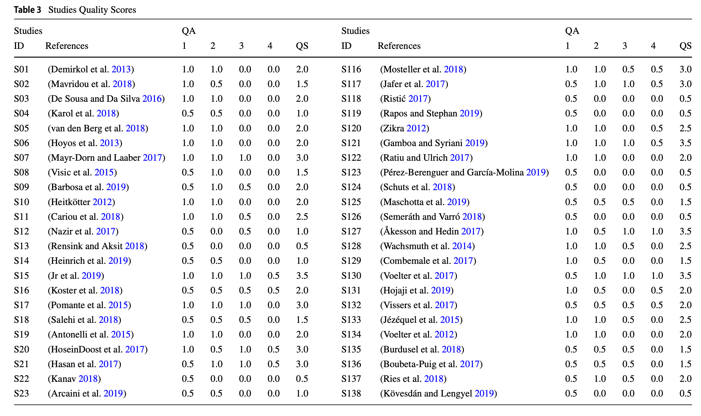
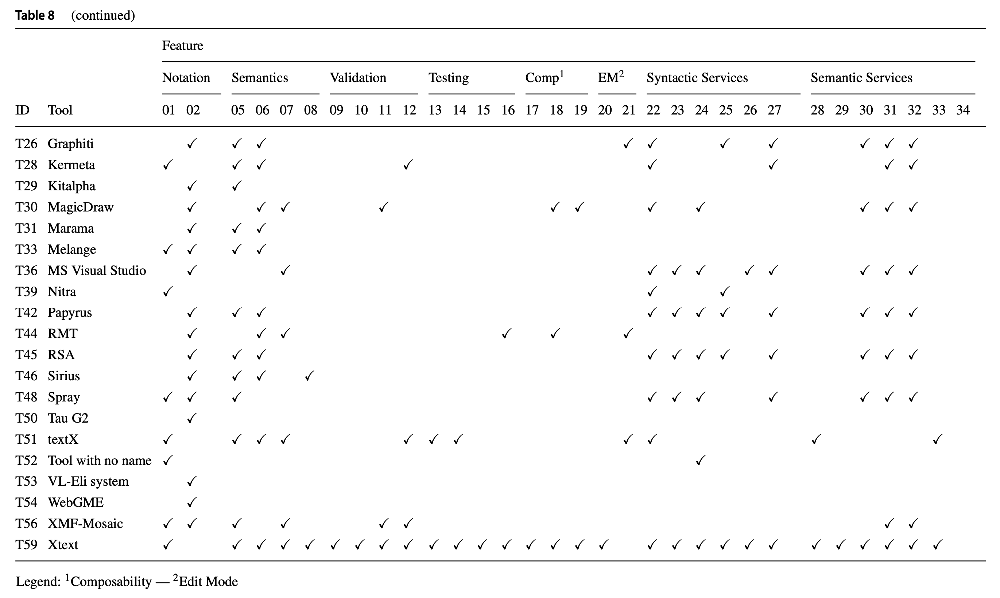

# 领域专用语言开发工具的系统性映射研究
An ́ıbal Iung[0](#0) · Joa ̃ o Carbonell[0](#0) · Luciano Marchezan[0](#0) · Elder Rodrigues[0](#0) · Maicon Bernardino[0](#0) · Fabio Paulo Basso[0](#0) · Bruno Medeiros[0](#0)

2020/08 [original english](origin/iung2020.pdf)

----
## 摘要
领域特定语言（DSL）是专用于特定应用领域的编程或建模语言。支持 DSL 实现的工具种类繁多，使得选择合适工具的决策过程变得困难。因此，识别并映射这些工具的特性对于学术界和工业界在 DSL 开发中的决策具有重要意义。目标：本研究旨在识别并梳理 2012 至 2019 年间文献中提及的、用于开发 DSL 的工具、语言工作台（ Language Workbenchese, LW ）或框架。方法：采用文献的系统性映射研究（ Systematic Mapping Study, SMS ）方法，聚焦 DSL 开发工具。结果： 我们共识别出 59 种工具（含 9 种商业许可工具与 41 种非商业许可工具），并从 230 篇论文中分析其功能特性。结论：现有工具数量庞大且覆盖功能广泛。此外，我们观察到开发者通常采用单一类型的表示法 (notation) 来实现 DSL（文本或图形）。我们还探讨了研究空白，例如：缺乏支持元元模型转换的工具，以及对建模工具互操作性支持的工具。

----
## 关键词
DSL · Domain-specific language · Language workbench ·
Model driven engineering · DSL-supporting tools · Systematic mapping study · Systematic review

----
## 1. 引言
特定领域的计算机系统实施正变得日益复杂，需要整合多个知识领域。例如，现代 Web 系统的编码需要考虑多个实现要点，包括可用性、安全性、持久性及业务规则。为使这些不同要点能独立于编码技术进行开发，软件工程师正采用领域特定语言（DSL）的开发模式（[Fowler 2010](#fowler-m-2010)），这是对特定领域功能进行建模和编码的最常用方法之一。DSL 已被应用于众多领域，包括性能测试开发（[Bernardino et al. 2016](#bernardino-m-zorzo-af-rodrigues-em-2016)）、机器深度学习（[Zhao and Huang 2018](#zhao-t-huang-x-2018)）、面向对象的领域驱动设计（[Le et al. 2018](#le-dm-dang-d-h-nguyen-v-h-2018)）、学校课表自动生成（[Ribić et al. 2018](#ribic-́-s-turcˇinhodzˇic-́-r-muratovic-́-ribic-́-a-kosar-t-2018)）以及用于通信与查询的数据库语言 （[Fowler 2010](#fowler-m-2010)）。

在此背景下，为设计捕获软件需求的所有元素，需要开发图形化和/或文本化的 DSL，以向最终用户提供最佳前端体验。DSL 能实现比软件工程日常实践中常用编程/建模语言更高的抽象层次。例如，当前开发实践中，开发者使用集成开发环境（IDE）中的代码编辑器，通过通用语言（ General Purpose Languages, GPL）（[Fowler 2010](#fowler-m-2010)）如 C 和 Python， 实现代码。与此同时，基于平台无关性理念的方法正在改变这种开发模式，通过引入更高层次的语言，使其与 C 和 Python 等具体实现无关。

要实现这种平台独立性，即一个与具体实现细节无关的软件开发项目，可能需要创建新的 DSL 来捕捉领域概念。然而，创建新 DSL 并非易事，需要借助多种 DSL 开发工具。这些工具支持 DSL 的开发与维护过程，确保其一致性、演进性和可维护性。此外，这些工具可能包含代码生成器、验证器、模型检查器，以及词法分析器、语义分析器和语法分析器。通常，这些集成工具是名为语言工作台（Languages Workbenches, LWs）（[Fowler 2010](#fowler-m-2010)）的工具箱的一部分，其使用流程通常以工具链的形式呈现（[Jakumeit et al. 2014](#jakumeitebuchwaldswagelaarddanlhegedusa-́herrmannsdorfermhorntkalninaekrause-c-lano-k-lepper-m-rensink-a-rose-l-watzoldt-s-mazanek-s-2014)）。

为实现某些软件开发流程任务的自动化（[Whittle et al. 2015](#whittle-j-hutchinson-j-rouncefield-m-ha-̊kan-b-rogardt-h-2015)），在启用工具链（[Basso et al. 2017](#basso-fp-werner-cml-de-oliveira-tc-2017)）之前必须谨慎选择每项工具。这会比较复杂，因为某些工具仅能协助 DSL 开发的单一环节（[Mussbacher et al. 2014](#mussbacher-g-amyot-d-breu-r-bruel-j-m-cheng-bhc-collet-p-combemale-b-france-rb-hel--dal-r-hill-j-kienzle-j-scho-̈ttle-m-steimann-f-stikkolorum-d-whittle-j-2014)），而另一些工具则能覆盖多个环节。这种多样性虽有益于实践，却也增加了理解的难度，既要厘清启动 DSL 辅助流程所需的核心功能特征，又要识别哪些互补工具能在特定场景下支持语言构建（[Liebel et al. 2014](#liebel-g-marko-n-tichy-m-leitner-a-hansson-jo-̈rgen-2014)）。

尽管该领域文献中充斥着关于 DSL 开发工具的参考文献，却缺乏对其质量属性的最新梳理。在此背景下，一项关于这些工具的映射研究，调研有助于技术决策的功能特征与信息，将会帮助软件工程师在特定开发场景中选择最优方案。欢迎提交关于工具链决策的论文（[Liebel et al. 2014](#liebel-g-marko-n-tichy-m-leitner-a-hansson-jo-̈rgen-2014)），因为缺乏此类映射会阻碍选择合适的元生成器，这是构建领域特定专用工具，以支持某种软件工程任务的的关键活动（[Jakumeit et al. 2014](#jakumeitebuchwaldswagelaarddanlhegedusa-́herrmannsdorfermhorntkalninaekrause-c-lano-k-lepper-m-rensink-a-rose-l-watzoldt-s-mazanek-s-2014)）。当前，该选择过程需要耗费时间，调研诸多影响决策的关键要素，包括技术层面，如哪些工具满足需求和描述性数据（用于理解其运作）。例如：类似 MetaEdit+（[Kelly et al. 1996](#kelly-s-lyytinen-k-rossi-m-1996)）这类工具虽在技术层面支持完整的 DSL 开发流程且应用广泛，但 MetaEdit+ 的商业许可模式可能与某些业务场景存在冲突。因此，在特定情境下，开发者可能需要寻找免费和/或非商业化的替代方案。

为进一步决策而对这些工具进行分类时，探讨 DSL 开发过程及其应用的研究至关重要。当前的特征化研究（[Pérez et al. 2013](#pe-́rez-f-valderas-p-fons-j-2013)；[Arkin and Tekinerdogan 2014](#arkin-e-tekinerdogan-b-2014)）虽提及了 DSL 创建中使用的工具，却未提供技术特征等足够细节。其他研究则聚焦于 DSL 领域的系统性映射（[do Nascimento et al. 2012](#do-nascimento-lm-viana-dl-neto-pas-martins-da-garcia-vc-meira-sr-2012)；[Erdweg et al. 2013](#erdweg-s-van-der-storm-t-volter-m-boersma-m-bosman-r-cook-wr-gerritsen-a-hulshout-a-2013)； [Erdweg et al. 2015](#erdweg-s-van-der-storm-t-vo-̈lter-m-tratt-l-bosman-r-cook-wr-gerritsen-a-hulshout-a-kelly-s-loh-a-et-al-2015); [Kosar et al. 2016](#kosar-t-bohra-s-mernik-m-2016); [Méndez-Acuna et al. 2016](#me-́ndez-acuna-d-galindo-j-degueule-t-combemale-b-baudry-b-2016)），但这些文献并未梳理，支持特定 DSL 与 DSML 开发生命周期阶段的，工具及其功能特性。如高亮显示与错误标记。受限于此，DSL 构建的技术决策仍面临巨大挑战。

本文采用系统性映射研究（Systematic Mapping Study, SMS ）方法（[Kitchenham et al. 2011](#kitchenham-ba-budgen-d-brereton-op-2011)），全面梳理了支持 DSL 开发的工具。我们不仅阐明了 DSL 用在哪些领域，还提供了 DSL 开发工具研究领域的现状综述，同时指明了未来研究机遇与空白领域。该综述包含对跨应用领域的分析，即 DSL 被提出的领域，以及构建 DSL 所采用的实践方法。据我们所知，本 SMS 阐述了构建 DSL 的技术特性，涵盖结构特征及商业要素，如许可类型和适用性。因此，本研究为该领域做出了重要贡献。

本文结构如下：第 [2](#2-背景) 节介绍全文使用的术语与概念；第 [3](#3-sms-流程) 节阐述 SMS 规划；第 [4](#4-执行) 节报告如何执行关于 DSL 开发工具的 SMS ；第 [5](#5-报告) 节呈现为解答研究问题所收集的数据；第 [6](#6-讨论) 节探讨研究空白；第 [7](#7-对有效性的威胁) 节阐述有效性面临的威胁（threats to validity）；最后第 [8](#8-结论) 节总结全文。

----
## 2 背景
SMS 作为二次研究，旨在勾勒研究领域框架，并从原始研究中筛选出最具相关性的成果。开展 SMS 时，研究者可采用与系统性文献评论（Systematic Literature Review, SLR）相似的检索与数据提取方法。但不同于 SLR，SMS 涵盖更广阔的研究领域与主题（[Kitchenham et al.，2011](#kitchenham-ba-budgen-d-brereton-op-2011)）。此外，SMS 结果更侧重于简明分类与统计分析，侧重于浅层评估。基于此，下文将介绍支撑本 SMS 的核心技术术语。

### 2.1 领域特定语言（DSL）
DSL，亦称小语言、小型语言、专用语言或领域特定建模语言（Domain-Specific Modeling Languages, DSML），被定义为 “具有有限表达能力、专注于特定领域的计算机编程语言”（[Mernik et al. 2005](#mernik-m-heering-j-sloane-am-2005)）。

开发 DSL，会使用名为语言工作台（Language Workbenches, LW）的工具。据 [Wachsmuth et al. 2014](#wachsmuth-gh-konat-gdp-visser-e-2014) 所述，LW 提供了 “实现编程语言的高级机制，并使新语言的开发变得经济可行”。LW 不仅能简化语义与语法分析器的定义，还支持创建语言专属的编辑环境，以及开发基于语言的其他工具，例如模型调试器（[Wu et al. 2008](#wu-h-gray-j-mernik-m-2008)）、模型编译器（[Henriques et al. 2002](#henriques-pr-pereira-mjv-mernik-m-lenicˇ-m-avdicˇausˇevic-́-e-zˇumer-v-2002)）和模型测试引擎。

LW 可作为独立版本使用，也可与框架组合使用。根据 [Johnson 1997](#johnson-re-1997) 的定义，“框架是应用程序的骨架，开发人员能够对其进行定制”。根据元对象设施（Meta-Object Facility, MOF）规范（[OMG 2019](#omg-2019)），“元模型是一个模型，由关于模型的描述组成，它本身也是模型，但其论域 (universe of discourse) 是一组模型”。元模型包含关于系统构造的陈述，是模型的抽象（[Jeusfeld 2009](#jeusfeld-ma-2009)）。此外，元模型还被用来为图形与文本语言定义 DSL（[Schmidt 2006](#schmidt-dc-2006)）。

### 2.2 DSL 开发工具特征
本节介绍本 SMS 所选主要研究中，作为 LW 信息收集模型的特征 (features)。我们认为 “特征” 一词指代被分析的 DSL 开发支持工具所提供的功能。因此，依据 [Erdweg et al. 2013](#erdweg-s-van-der-storm-t-volter-m-boersma-m-bosman-r-cook-wr-gerritsen-a-hulshout-a-2013) 及 [Erdweg et al. 2015](#erdweg-s-van-der-storm-t-vo-̈lter-m-tratt-l-bosman-r-cook-wr-gerritsen-a-hulshout-a-kelly-s-loh-a-et-al-2015) 的研究，所有列表的 (tabulated) 特征及子特征被划分为六大类别（符号表示法、语义、编辑器、验证、测试及组合能力），如图 [Fig 1](#fig-1) [1](#1) 所示。下文将详细阐述这六大类别：

#### Fig 1

*Fig 1: 基于 [Erdweg et al. 2015](#erdweg-s-van-der-storm-t-vo-̈lter-m-tratt-l-bosman-r-cook-wr-gerritsen-a-hulshout-a-kelly-s-loh-a-et-al-2015) 研究改编的 DSL 语言工作台的特征模型*

**符号表示法（Notation）** ：LW 支持的强制符号表示法。它决定模型或程序将以文本、图形或表格形式呈现。也可采用混合方式，使用一种或多种符号表示法。现有符号表示法类型包括：文本、图形、表格及符号 (Symbolic)，符号作为表格的子特征。根据 [Erdweg et al. 2013](#erdweg-s-van-der-storm-t-volter-m-boersma-m-bosman-r-cook-wr-gerritsen-a-hulshout-a-2013) 的定义：“符号表示法可混合使用文本、图形和表格符号表示法，其中文本符号表示法可支持符号 (symbols)，例如嵌入常规文本的积分符号或分数线”。

**语义（Semantics）** ：关注模型的含义，可分为翻译语义与解释语义两类。翻译语义从模型生成某种语言的程序；解释语义则直接执行模型而不进行预先翻译，例如，采用 Model@Runtime 方法（[Mussbacher et al. 2014](#mussbacher-g-amyot-d-breu-r-bruel-j-m-cheng-bhc-collet-p-combemale-b-france-rb-hel--dal-r-hill-j-kienzle-j-scho-̈ttle-m-steimann-f-stikkolorum-d-whittle-j-2014)）。如 [Fig 1](#fig-1) 所示，这两种语义机制可能同时存在于 LW 中。此外，翻译语义可细分为三类：模型到文本、模型到模型以及具体语法。

**编辑器支持（Editor Support）** ：LW 中的编辑器支持包含一个名为编辑模式的子特征，该模式分为两种类型：自由编辑模式，作为常见的文本型编辑器，用户可自由编写和编辑模板；投影编辑模式 (projectional edition) ，用户需在预定义的固定布局中进行操作。此外，编辑器支持还提供两种服务类型：语法服务 (Syntactic Service) 与语义服务。语法服务包含：可视化高亮，如文本语言的着色；大纲导航支持；模型部分折叠；提供代码建议的语法补全模板；程序比较，例如：通过 diff 工具；模型呈现的自动格式化、重构或对齐。

另一方面，语义服务包含以下内容：通过引用解析将声明和变量等概念关联起来；通过融合语义信息（引用解析等）的语义补全提供代码辅助；对程序或模型进行保留语义的重构（如重命名类和移动属性）；用于突出显示结构特征不一致，或对象约束违规的错误标记；用于修复错误的快速修复方案；溯源与模型追踪；以及实时翻译生成的代码。

**验证（Validation）** ：LW 识别模型与元模型间结构、语法及语义不一致与矛盾的能力。验证类型：结构验证与语义验证，细分为命名、类型及程序化验证。

**测试（Testing）**：LW 为语言测试提供的支持，涵盖语义测试（翻译或解释）与语法测试（解析器或投影）。测试旨在实现语言调试及开发语言调试器。测试支持类型：DSL 测试、DSL 语言定义调试（DSL 调试）以及所定义语言的调试器（DSL 程序调试）。

**组合性（Composability）** ：LW 提供的一项特性，允许使用多种语言处理系统的不同方面，例如支持增量扩展和语言对齐。例如，由其他元模型构成的元模型，或包含其他元模型结构特征的元模型。与组合性相关的特性包括：语法/视图、组合性验证、组合性语义以及编辑器服务。

### 2.3 相关研究
<ins>我们的工作受到（[Erdweg et al. 2013](#erdweg-s-van-der-storm-t-volter-m-boersma-m-bosman-r-cook-wr-gerritsen-a-hulshout-a-2013); [Erdweg et al. 2015](#erdweg-s-van-der-storm-t-vo-̈lter-m-tratt-l-bosman-r-cook-wr-gerritsen-a-hulshout-a-kelly-s-loh-a-et-al-2015)）研究的启发，这些研究构成了我们 SMS 中数据整理与提取的基础。换言之，这些研究着重突出了（适用于工具）框架分析的特征</ins>。然而，由于其研究范围仅限于 Language Workbench Challenge (LWC'13) 中展示的工具，因此不被视为系统性研究。

如 [Table 1](#table-1) 所示，目前仅有两篇 SMS 文献描述了支持 DSL 开发的工具（[do Nascimento et al. 2012](#do-nascimento-lm-viana-dl-neto-pas-martins-da-garcia-vc-meira-sr-2012); [Kosar et al. 2016](#kosar-t-bohra-s-mernik-m-2016)）。下文将重点对比本研究与这两项工作的差异。

#### Table 1

[do Nascimento et al. 2012](#do-nascimento-lm-viana-dl-neto-pas-martins-da-garcia-vc-meira-sr-2012) 对 2011 年前发表的研究进行了系统性映射，因此被认为是过时的技术，包括：1) 支持 DSL 开发的工具，以及 2) 应用领域。<ins>尽管该研究列举了六种工具和十五个领域，但未能梳理工具特性，导致缺乏技术决策依据</ins>。而我们的 SMS 识别出 59 种工具，以及它们的特性及在超过 7 个领域的应用情况。

[Kosar et al. 2016](#kosar-t-bohra-s-mernik-m-2016) 进行了一次系统性映射研究，考察了 2006 至 2012 年间发表的成果。其核心目标在于理解 DSL 研究领域，识别研究趋势，及该领域可能存在的待解决问题。<ins>因此，该研究缺乏对工具支持的分析</ins>。此外，作者参照 2005 年发表的另一项调研中提出的研究问题，并得出结论：在检索到的研究中，论文数量在数年间保持稳定。另一重要发现是：DSL 研究社群更侧重新技术开发，而非探索 DSL 与软件流程（工具链）的集成。基于此，本文 SMS 提供了大量 DSL 工具 (constructors)，其多样性给工具链的配置带来了困难，从而在该领域引发了兼容性特征方面的担忧。

[Table 1](#table-1) 基于上述特征进行了比较分析。我们的 SMS 涵盖更广泛研究，聚焦于 DSL、DSL 开发工具及研究领域；同时，文献（[do Nascimento et al. 2012](#do-nascimento-lm-viana-dl-neto-pas-martins-da-garcia-vc-meira-sr-2012)）与（[Kosar et al. 2016](#kosar-t-bohra-s-mernik-m-2016)）的研究仅限于 DSL 领域。<ins>尽管（[Erdweg et al. 2013](#erdweg-s-van-der-storm-t-volter-m-boersma-m-bosman-r-cook-wr-gerritsen-a-hulshout-a-2013)）呈现的最新研究与本研究关注点相似，但却局限于 LWC'13 会议参与者，故被归类为调研</ins>。不同的是，我们考察了 2012 至 2019 年间六大科学数据库收录的所有研究成果，而其他相关研究仅涵盖 2013 年前的研究成果。

## 3 SMS 流程
本 SMS 遵循了（[Petersen et al. 2008](#petersen-k-feldt-r-mujtaba-s-mattsson-m-2008)）提出的结构化的成熟评审流程。[Fig 2](#fig-2) 展示了该流程的三个阶段：规划（Planning）、实施（Conduction）和汇报（Reporting）。本节将详细阐述第一阶段（规划）及其活动，第二阶段（实施）将在第 [4](#4-执行) 节呈现。最后，第 [5](#5-报告) 节将展示并讨论从 SMS 数据提取活动中获得的研究成果。

#### Fig 2

*Fig 2: 采用 BPMN 符号创建的系统性映射研究流程（[Petersen et al. 2008](#petersen-k-feldt-r-mujtaba-s-mattsson-m-2008)）*

### 3.1 范围
考虑文本和图形 DSL 的创建，<ins>我们的研究目标是：梳理 2012 至 2019 年间发表的文献中涉及的支持工具、LW 及框架。同时，通过提供工具特性与许可协议的综述，为 DSL 开发者提供指引，我们旨在协助 MDE （Model-Driven Engineering）从业者，基于四个研究问题与四个质量评估问题，选择最契合其研究与实践需求的工具</ins>。除上述用于跨应用领域 DSL 分类的问题外，我们还纳入更广泛的分析，探讨所调研工具的异质性 (heterogeneity) 研究缺口、资产演化问题（模型、转换、元模型及工具链）以及可用性问题。

### 3.2 研究问题
基于此目标，我们提出了以下研究问题（Research Questions, RQ）：
- **RQ1.** DSL 开发采用哪些技术？

  我们的目标是描述这些工具，从而评估它们在研究与实践中的成熟度。
- **RQ2.** 工具采用哪些许可类型？

  若是工具获取与培训依赖于商业模式决策（如基于非商业或商业许可），我们的目标是按许可类型对工具进行分类映射。
- **RQ3.** 研究聚焦哪些应用领域？

  我们的目标是识别 DSL 在跨领域软件开发中的作用，涵盖 Web 应用、移动应用、嵌入式系统等领域。
- **RQ4.** 这些工具支持 DSL 创建过程的哪些特征？

  鉴于 DSL 开发工具种类繁多且覆盖开发全周期，我们旨在通过技术特征对这些方案进行分类。

### 3.3 纳入与排除标准
纳入与排除标准的制定基于 SMS 范围、研究目标及研究问题。本研究聚焦于 SMS 背景下最具相关性的文献，排除无关文章。此步骤至关重要，因其决定了哪些文献可在 SMS 后续阶段进行分类和定级。<ins>纳入的原始研究须满足全部纳入标准（Inclusion Criteria, IC），方可进入后续分析与分类。同样地，若研究符合至少一项排除标准（Exclusion Criteria, EC），则将从待分析的原始研究中剔除</ins>。

#### 纳入标准（IC）
- **IC1.** 原始研究必须提出一种用于操作 DSL 或 DSML 的方法、技术、手段、流程、工具、框架或 LW。

  提出支持 DSL 或 DSML 开发的新技术的研究将被纳入，例如：展示 Xtext 框架的研究。
- **IC2.** 原始研究必须提及支持 DSL 的工具、框架或 LW。

  提及支持 DSL 或 DSML 开发的技术的研究将被纳入，例如：聚焦地理空间领域，但提及 DSL 使用及其开发所用技术的研究。

  聚焦展示新 DSL 或 DSML 并提及开发所用技术的研究将被纳入，例如：专注于展示 DSL 且提及开发所用技术的研究。

#### 排除标准（EC）
- **EC1.** 2012 年前发表的研究。
- **EC2.** 非英文的研究。
- **EC3.** 重复和/或不完整的研究。
- **EC4.** 仅以摘要、幻灯片演示、海报或短文形式发表的研究。

### 3.4 检索过程
在检索过程中，我们仅考虑使用计算机科学数据库，其能通过关键词提供基于 Web 的搜索引擎。所使用的计算领域科学数据库/数字图书馆包括：Compendex（Engineering Village）[2](#2)、IEEE Xplore [3](#3)、ScienceDirect [4](#4)、计算机协会（ACM）数字图书馆 [5](#5)、Scopus [6](#6) 以及 SpringerLink [7](#7)。

#### 3.4.1 检索字符串
为定义检索字符串 [8](#8)，我们采用了 [Table 2](#table-2) 所列术语及其同义词。如 [Fig 3](#fig-3) 所示，通过 “OR” 运算符将同义词纳入字符串。同时使用 “AND” 运算符添加更多术语以缩小检索范围。在某些科学数据库中，我们需采用特定策略创建类似 [Fig3](#fig-3) 所示的不同版本字符串。为评估检索字符串的质量与全面性，我们参照三项对照研究（[Erdweg et al. 2013](#erdweg-s-van-der-storm-t-volter-m-boersma-m-bosman-r-cook-wr-gerritsen-a-hulshout-a-2013); [Erdweg et al. 2015](#erdweg-s-van-der-storm-t-vo-̈lter-m-tratt-l-bosman-r-cook-wr-gerritsen-a-hulshout-a-kelly-s-loh-a-et-al-2015); [Bernardino et al. 2017](#bernardino-m-rodrigues-e-zorzo-a-marchezan-l-2017)）的定义开展了探索性研究。据此，检索字符串在数字图书馆中执行，从而验证了检索到的文献中包含上述对照研究。
#### Table 2

#### Fig 3

*Fig 3: 搜索字符串*

### 3.5 研究质量评估
为评估原始研究的质量，制定了一套质量评估（Quality Assessment, QA）标准。本研究的 QA 评估对象是那些通过纳入与排除标准筛选后的研究。这些标准旨在量化每项原始研究的相关性，并允许比较我们选择的原始研究。<ins>即使属于研究领域范畴，质量评分达 “零 (0) 质量分” 的原始研究将从原始研究列表中剔除。此外，未通过 QA1 评估的原始研究也不能通过其他质量评估，故从原始研究列表中剔除</ins>。每位研究者按以下等级应用 QA 标准：符合（**Y**es）：1.0；部分符合（**P**artially）：0.5；不符合（**N**o）：0.0。QA 标准定义如下：

- **QA1.** 研究是否提出 (present) 支持 DSL 开发的工具？

  评估：Y：研究提出支持 DSL 开发的工具；P：研究提及支持 DSL 开发的工具但未提供详细信息；N：研究未提出或提及任何辅助 DSL 开发的工具。
- **QA2.** 该工具是否支持至少一种符号表示法（图形或文本）？

  评估：Y：研究提出了支持图形或文本符号表示法的工具；P：研究未提供支持工具但结果表明使用了图形或文本符号表示法；N：研究未提供使用图形或文本符号表示法的证据。
- **QA3.** 研究是否报告了如何在 DSL 开发中运用工具？

  评估：Y：研究通过编码示例、代码片段或图像展示工具使用；P：研究主张使用了工具但未呈现实现细节；N：研究未提供任何实现证据。
- **QA4.** 工具使用方式是否清晰详尽？

  评估：Y：研究提供了教程、流程、完成任务的步骤，或定义了实现目标的流程；P：研究仅提及必要操作步骤而未作进一步说明；N：研究未提供任何支持工具使用的证据。

### 3.6 数据提取策略
我们创建了一份表单，用于识别并从选定研究中提取相关数据。这些信息将用于回答 RQ。从每项研究中提取以下数据：
- 数据库：ACM、Compendex（Engineering Village）、IEEE、SCOPUS、ScienceDirect 和 SpringerLink
- 来源：完整参考文献、书籍、期刊名称
- 标题
- 摘要
- 作者
- 年份
- 应用领域：研究涉及的领域
- 工具 / 框架 / Language Workbench
  - 特性：符号表示法、语义、编辑支持、语义与语法服务、验证、测试及组合性
  - 许可类型：商业或非商业

尽管研究检索采用 2012 至 2019 年的时间范围，但结果中包含 2012 年前的工具。此类工具被纳入是因为年份限制仅适用于研究发表年份，而非工具发布日期。

### 3.7 数据分析
我们对收集的数据进行分析以：识别支持 DSL 开发过程的 DSL 技术（工具 / 框架 / language workbench ）（**RQ1**）；识别 DSL 工具的许可类型（商业或非商业），并按符号表示法及其许可类型展示 DSL 技术（**RQ2**）；按发表年份和研究类别识别并梳理 (map) 应用领域（**RQ3**）； 基于原始研究，梳理支持某些 DSL 开发阶段的 DSL 技术（**RQ4**）。

## 4 执行
本研究的执行 [9](#9) 工作于 2019 年 7 月完成，遵循 [Fig2](#fig-2) 所示 “Conduction” 阶段的研究方案。为支持 SMS 的规划与实施阶段，我们采用了 Thoth 工具（[Marchezan et al. 2019](#marchezan-l-bolfe-g-rodrigues-e-bernardino-m-basso-fp-2019)）。采用两组字符串检索 IEEE Xplore 数字图书馆。采用这种组合搜索策略，是由于 IEEE 搜索引擎限制搜索的每组字符串最多包含 15 个检索词。故而，在每个复合检索中，保留其他常用术语，检索字符串被拆分为两个复合术语：DSL 与 DSML。

对于所有科学数据库，检索仅限于 “摘要”、“标题” 和 “关键词” 字段。此外，在检索引擎中，我们直接将年份范围限定为 2012 至 2019 年间发表的论文。

如 [Fig 4](#fig-4) 所示，在去除重复文献后，共筛选出 1,862 项研究。随后剔除与研究主题无关的文献，例如：包含 DSL 或 DSML 术语但不属于研究范围的论文。此步骤后，剩余 1,780 项研究进入纳入与排除标准评估阶段。

#### Fig 4

*Fig 4: 系统性映射研究执行结果*

如 [Fig 2](#fig-2) 所示流程所示，执行了 “Application of Exclusion Criteria” 和 “Application of Inclusion Criteria” 两项活动后。结果有 1,780 项研究，被 “Qualifying and Classifying Papers” 活动读取。应用 EC 后，剩余 1,430 项研究。随后因不符合任何 IC 而排除部分研究。最终共有 390 项研究进入筛选 (qualification) 与分类。*（译注：本段的文字描述有误，和 [Fig 4](#fig-4) 不一致，图上描述的应该是正确的）*

### 4.1 研究质量评估
质量评分结果见 [Table 3](#table-3) ，每项研究均可通过列 **ID** 进行识别。参考文献及出版年份列于 **References** 列。基于 QA 的评分分别显示于第 **1、2、3、4** 列，最终 QA 总分呈现于 **QS** 列。两名研究者依据第 [3.5](#35-研究质量评估) 节所述的四项 QA 标准，分别对全部 230 项研究进行了独立评估。*（译注：原文中对于 QA 标准的引用章节有笔误，应该为 [3.5](#35-研究质量评估) ，原文中指向了 [3.3](#33-纳入与排除标准) 节）*

#### Table 3

该评估方法用于分析名义量表数据，其结果通过应用 [Landis and Koch (1977)](#landis-jr-koch-gg-1977) 提出的评分表进行解读，该评分表可从数据集包中获取。

卡帕系数（Kappa’s coefficient）用于分析两位观察者间的评分一致性 (inter-rater agreement)。在本 SMS 中，两位研究者均对每项研究进行分析并应用 QA 标准。结果基于一致性评分数量计算，评分范围为 0 至 1，其中 1 代表完全一致，0 代表完全不一致或随机一致。

对我们 SMS 系统中每位评委评分进行的卡帕分析得出系数为 0.64。该结果表明研究者间存在较高程度的一致性。为解决研究分类中可能出现的评判差异，我们咨询了 DSL 领域的专家。

### 4.2 分类体系
该分类体系基于 “[Data Interpretation](#fig-2)” 活动生成。为从选定研究中获取抽象层面的理解，我们合并了其关键词。<ins>本步骤所得结果，用于支持定义和分类代表选定原始研究群体的维度。如 [Table 4](#table-4) 所示，三大维度分别为：(i) DSL 开发机制类型：工具、Language Workbench 或框架；(ii) 功能特性：符号表示法、语义、编辑模式、语法服务、语义服务、验证、测试、组合性；(iii) 发表贡献：方法论、研究成果、实践报告</ins>；*（译注：这种分类法可以对原始研究进行并行的多维度分析？）*

#### Table 4

“Feature” 维度的分类体系基于（[Erdweg et al. 2013](#erdweg-s-van-der-storm-t-volter-m-boersma-m-bosman-r-cook-wr-gerritsen-a-hulshout-a-2013); [Erdweg et al. 2015](#erdweg-s-van-der-storm-t-vo-̈lter-m-tratt-l-bosman-r-cook-wr-gerritsen-a-hulshout-a-kelly-s-loh-a-et-al-2015)）的研究成果，[Table 5](#table-5) 揭示了 DSL 支持工具的功能特征。这些特征涵盖了从，工具使用的表示类型 (representation type)，如图形化与文本化，到工具辅助机制，如 Quick Fix 与 Refactoring。

#### Table 5

## 5 报告
本节呈现我们对研究问题的解答结果如下：

### RQ1. DSL 开发采用哪些技术？

通过分析 230 篇选定论文，我们识别出 59 种 DSL 开发工具，详见 [Table 6](#table-6)。我们注意到部分技术被不同作者多次引用。

<ins>值得强调的是 Xtext framework（102）获得大量引用</ins>，同时基于 Eclipse Modeling Framework （EMF）（114）和 Graphical Modeling Framework（GMF）（30）的衍生工具也广受关注，例如： Papyrus 工具（18）和 Sirius framework（42）。其他 LW 获得相当数量的引用，例如：MetaCase 公司的 MetaEdit+（27）、JetBrains 开发的 Meta Programming System（MPS）（48）以及 MetaBorg 的 Spoofax（21）。

#### Table 6

[Fig 5](#fig-5) 展示了工具支持的符号表示法的维恩图 (Venn diagram)：字母 A 代表图形符号表示法；字母 B 代表文本符号表示法； 字母 C 代表图形与文本两种表示法；字母 D 代表图形、表格与符号三种表示法；字母 E 代表图形、文本与表格三种表示法；字母 F 代表图形、文本、表格与符号四种表示法。

#### Fig 5

*Fig 5: 工具符号表示类型的维恩图（Venn Diagram）*

共有 39 种映射工具支持图形符号表示法（最大类别），其次是 30 种支持文本符号表示法的工具。在映射工具中，T38 (MPS) 和 T55 (Whole) 同时支持全部四种符号表示法。就图形、表格及 symbolic 的符号表示法的支持而言，T34 (MetaEdit+) 是唯一具备这三项功能的工具。工具 T32  (
Ma ́s) 支持图形、文本与表格三种符号表示法的独特组合。工具 T5、T16、T21、T28、T33、T43 和 T48 支持图形与文本符号表示法，但不支持符号或表格。

需特别说明的是，由于部分工具仅支持 DSL 开发中的一个环节，目前尚无工具能实现全部符号表示法。<ins>此外，T1 (Acceleo)、T27 (JET) 和 T58 (Xpand) 属于代码生成器</ins>，T57 是 Java 方言，T18 则是涵盖代码生成与模型验证的语言工具集，但本文仍将其归入文本符号表示法范畴。

### RQ2. 工具采用哪些许可类型？

在本 SMS 中，我们将研究分为两类：商业性与非商业性。通常我们直接从研究中提取此信息，但在某些情况下需要通过工具的官方网站和制造商进行检索。[Table 6](#table-6) 显示工具许可类型分布：41 款工具为非商业性质，仅 9 款需要有商业许可。另有 9 款工具因未正式发布且缺乏在线信息而无法确认许可类型 [10](#10)。作为非商业软件，学术许可类型工具，及可通过 GitHub 等在线仓库获取的可开放评估的工具，均被纳入统计范围。

### RQ3. 研究聚焦哪些应用领域？

  为映射 DSL 构建工具的应用领域，根据选定研究中评估/概念验证章节的内容，[Fig 6](#fig-6) 按发表年份绘制了应用领域分布图。基于该数据图可得出结论：“DSL Construction” 作为成熟研究领域，考虑到众多的跨应用领域，体现了学术界日益增长的关注度。*（译注：这个结论是怎么得出的？DSL Construction 在图中没有明确标示啊，另外，图中的领域是如何确定下来的？）*

#### Fig 6

*Fig 6: 按出版年份的研究领域分布泡泡图（Bubble Plot）*

  值得注意的是，36%（83 篇）研究涉及支持 DSL 与 DSML 开发生命周期阶段的工具、方法或手段 (method)。嵌入式系统占 3%（7 篇），Web 系统占1%（3 篇），移动应用占 3%（6 篇），多智能体系统占 2%（4 篇）。此外另有 4 项研究聚焦于网络物理系统 (Cyber-Physical Systems)，占比 2%。仅被 1 至 2 项研究提及的领域，如航空航天系统，归类为 “Other”。该类别涵盖 53%（123 篇）的研究，彰显了应用领域的多元性。

### RQ4. 这些工具支持 DSL 创建过程的哪些特性？

在讨论该问题结果前，需说明在按功能特性分类工具时，我们将其划分为三类：LW、DSL 构建工具及工具链工具，见 [Table 4](#table-4)。如此分类主要考量是，由于某些功能特性对一些工具无关紧要，例如：编辑模式功能对 Acceleo 和 Xpand 等工具不适用。值得注意的是，多数研究并未提供关于工具功能特性的完整信息，因此需搜索灰色文献 (gray literature) 补充数据。例如，部分工具仅针对 DSL 开发流程的特定环节提供支持（如 Acceleo、Xpand、Meta3、JET 和 XBase）。<ins>实践者普遍认为这些工具可与其他工具组合使用，形成互补的工具链。然而现有研究并未探讨其在工具链中的集成方式</ins>。

如 [Table 4](#table-4) 中 “DSL Development Mechanism Type” 维度所述，所选研究呈现的工具可归入三大类：1) 通过通用元模型支持 DSL 构建的功能； 2) DSL 环境中具有集成支持的工具箱功能，如 Language Workbench；3) 可适配多个工作台的实用功能工具，作为 DSL 构建工具链的组成部分。

<ins>[Table 7](#table-7) 展示了归类为 LW 的工具</ins>。针对该组工具，我们采用了最初为 Language Workbench 提出的全部 34 项功能特性（[Erdweg et al. 2013](#erdweg-s-van-der-storm-t-volter-m-boersma-m-bosman-r-cook-wr-gerritsen-a-hulshout-a-2013)），这是更为完善的工具箱，整合了同类工具，并提供覆盖 DSL 开发流程更多环节的环境。从这个意义上说，值得特别强调的是 LW 的完整性，非商业的 LW 如：Xtext、MPS、GEMOC Studio，以及商业的 LW 如：MetaEdit+。它们均涵盖了 DSL 开发流程中的多项功能特性。MetaEdit+（[MetaCase 2017](sms3.md#metacase-2017)）涵盖 28 项功能；MPS（[JetBrains 2017](#jetbrains-2017)）涵盖 32 项功能；GEMOC Studio（[GEMOC 2017](#gemoc-i-2017)）涵盖 31 项功能；而 Spoofax（[Wachsmuth et al. 2014](#wachsmuth-gh-konat-gdp-visser-e-2014)）、Onion（[Erdweg et al. 2013](#erdweg-s-van-der-storm-t-volter-m-boersma-m-bosman-r-cook-wr-gerritsen-a-hulshout-a-2013); [Erdweg et al. 2015](#erdweg-s-van-der-storm-t-vo-̈lter-m-tratt-l-bosman-r-cook-wr-gerritsen-a-hulshout-a-kelly-s-loh-a-et-al-2015)）以及 Whole（[Erdweg et al. 2013](#erdweg-s-van-der-storm-t-volter-m-boersma-m-bosman-r-cook-wr-gerritsen-a-hulshout-a-2013)；[Erdweg et al. 2015](#erdweg-s-van-der-storm-t-vo-̈lter-m-tratt-l-bosman-r-cook-wr-gerritsen-a-hulshout-a-kelly-s-loh-a-et-al-2015)）也涵盖了 DSL 开发过程的诸多特性。*（译注：Xtext 不属于 LW，为何出现在描述中？）*

#### Table 7

六款 LW 工具同时支持图形与文本化两种符号表示法。<ins>其中 GEMOC Studio 和 MPS 是仍在维护的非商业工具。GEMOC Studio 是唯一具备模型双向展示的工具，这意味着文本模型中的修改会实时同步到图形模型，反之亦然。GEMOC Studio 基于 EMF、Xtext 和 Sirius 构建，因此成为最完善的开源工具之一</ins>。该工具还支持语义执行与模型仿真。至于 MPS，除图形与文本符号表示法外，还涵盖表格化规范（[特征 03](#table-5) ）。然而，（[Erdweg et al. 2015](#erdweg-s-van-der-storm-t-vo-̈lter-m-tratt-l-bosman-r-cook-wr-gerritsen-a-hulshout-a-kelly-s-loh-a-et-al-2015)）指出 LW 中仅部分实现了模型的图形化表示（[特征 02](#table-5)）。Argyle 被归类为支持图形化表示法的工具，因为其支持 Software Product Lines 规范作为特征模型的图形化表示。

另外两个同时支持图形与文本符号表示法的 LW 已停止维护：Enso 不再获得支持，Más 则已终止开发。最后，功能最完善的工具 MetaEdit+ 虽具备完整性，却未提供文本表示法的规范，仅支持图形模型的文本呈现。

<ins>[Table 8](#table-8) 展示了 DSL 构建工具的功能特性</ins>。其中我们重点强调了 Eclipse DSL 生态系统，该生态包含 EMF 等非商业框架，覆盖 11 项特性，以及 Sirius（[Eclipse F 2017a](#eclipse-f-2017-sirius)），覆盖 4 项特性。

#### Table 8

以 Sirius 为例，因其特性 5 “[Model2Text](#table-5)”、6 “[Model2Model](#table-5)” 和 8 “[Interpretative](#table-5)” 被归类为 “translational or interpretative semantics”。换言之，Sirius 可通过以下方式支持 DSL 构建：从输入的 EMF 模型定义 Sirius 模型，通过代码生成后在 Eclipse IDE 内通过解释执行。

<ins>值得注意的是，某些 DSL 构建工具涵盖了大量功能特性。例如 Xtext（[Eclipse F 2017b](#eclipse-f-2017-xtext)）覆盖 29 项功能特性</ins>。EMFText 涵盖表格中所有功能特性，除了图形符号表示法外，因其允许基于 Ecore 模型定义文本语法。部分工具更专注于领域的建模表示，如 MagicDraw 用于建模 SysML、BPM 和 UPDM 语言。MagicDraw 还提供转换机制，例如，转换为 XML 和数据库模型。此外，Enterprise Architect 支持数据建模和模型仿真。但这两款工具均采用商业授权模式。<ins>非商业领域建模工具中，Papyrus 堪称完整解决方案，支持 UML profile 与 SysML，可实现实时系统建模</ins>。

<ins>最后，[Table 9](#table-9) 展示了工具链工具的功能特性</ins>。在此分类中，验证和语义等功能特性未被纳入考量，因它们与这些工具无关。该组中，值得关注的是：Acceleo（[Eclipse F 2020a](#eclipse-f-2020-acceleo)）具备 14 项功能特性，Xpand（[Eclipse F 2020c](#eclipse-f-2020-xpand)）拥有 10 项功能特性，XBase（[Eclipse F 2020b](#eclipse-f-2020-xbase)）则包含 9 项功能特性。<ins>本表所有工具均支持文本符号表示法，这可能源于它们具有与文本和代码生成相关的文本特性 (textual aspect)。此外，它们均提供模型转换功能</ins>。

#### Table 9

*（译注：上图中的图例 2 是笔误，应该是 Syntactic Services）*

Meta3、Xpand 和 Xbase 同时支持模型到模型转换与模型到文本转换，而 Acceleo 和 JET 仅支持模型到文本转换。最后需说明，尽管JET（Java Emitter Templates）工具被 5 项研究引用，但该工具已停止维护。

## 6 讨论
上面的章节严格基于研究问题呈现了研究结果。本节将更广泛地探讨这些成果如何推动整个 DSL 开发流程的自动化。首先，研究结果表明，近年来与 DSL 开发技术相关的研究数量显著增长，特别是 2017 年后
。这一趋势在历年对比中尤为明显：2017 至 2019 年间共发表 162 篇论文，而 2012 至 2016 年间仅发表 68 篇，增幅近四倍。

由于我们以先前研究（[Erdweg et al. 2013](#erdweg-s-van-der-storm-t-volter-m-boersma-m-bosman-r-cook-wr-gerritsen-a-hulshout-a-2013)；[Erdweg et al. 2015](#erdweg-s-van-der-storm-t-vo-̈lter-m-tratt-l-bosman-r-cook-wr-gerritsen-a-hulshout-a-kelly-s-loh-a-et-al-2015)）为基础构建本协议 (protocol)，有必要说明本 SMS 如何提升了这些研究的成果。首先，他们的研究仅分析了十种 LW 的特征，而我们同时考虑了其他技术类型，如 DSL 构建工具和工具链工具。<ins>本研究相较于先前相关研究的另一项改进在于：所分析的技术数量，共涵盖 59 项技术</ins>。具体而言，本 SMS 对新型 LW（如 Argyle、GEMOC Studio、MS DSL Tools、Obeo Designer）的特征分类如 [Table 7](#table-7) 所示。此外，我们在 [Table 8](#table-8) 还新增了 40 种 DSL 构建工具，同时在 [Table 9](#table-9) 增加了 6 种工具链工具。然而，本研究并未扩展（[Erdweg et al. 2013](#erdweg-s-van-der-storm-t-volter-m-boersma-m-bosman-r-cook-wr-gerritsen-a-hulshout-a-2013)）提出的特征模型，因为我们的初衷并非更新该模型，仅基于其特性更新所评估的工具清单。

基于 **RQ1** 和 **RQ4** 的研究结果，<ins>我们发现所提出的工具仅支持领 DSL 开发中的单一环节，因此集成/工具链机制至关重要。然而，被调查的研究并未详细阐述这些机制，这构成了一个局限性，阻碍了在 DSL 开发过程中根据具体需求进行选择</ins>。因此，针对 [Fig 6](#fig-6) 所展示的各领域的研究贡献，我们进一步分析了这些研究是否将 DSL 视为软件开发流程的重要组成部分，而非孤立工具。通过 **RQ3**，我们观察到 DSL 由多种工具构建并应用于若干跨应用领域。这描述了一种异质性场景，由于研究提供的信息不足，工具间的依赖关系极难确定。因此，我们针对所选研究中存在的局限性提出以下研究机遇清单：

**双向展示**：在探讨此主题时，我们发现仅 GEMOC Studio 具备该功能，该工具可同时处理图形模型与文本模型的实时修改。据我们所知，目前仅有一个 LW，Whole 支持在四种表示法（文本、图形、表格、符号 Symbolic）间自由切换。该功能可实现不同符号表示法间的可视化转换（例如：图形与文本符号表示法之间的转换）。需要特别指出的是，MPS 仅实现了图形表示法的部分功能。

**元模型迁移**：在所选研究中，未发现任何提供支持现有元元模型转换工具的研究。该功能特性可见于两项工作（[Kern 2016](#kern-h-2016)；[Bruneliere et al. 2010](#bruneliere-h-cabot-j-clasen-c-jouault-f-be-́zivin-j-2010)），它们通过使用桥接器 (bridge) 实现了元元模型间的直接转换。元模型桥接器需支持 Visio、GME、ARIS 等元元模型的互转。例如 [Kern 2016](#kern-h-2016) 实现从 Ecore 元元模型向 MetaEdit+ 使用的 GOPPRR 元元模型的转换。此类功能特性与 MDE 特性相关，如在开发全周期中持续利用模型。这些阶段包括建模工具的设计、应用转换以实现软件工程相关活动的自动化（[Basso 2017](#basso-fp-2017)），以及解决建模工具间的互操作性问题（[Bruneliere et al. 2010](#bruneliere-h-cabot-j-clasen-c-jouault-f-be-́zivin-j-2010)）。

**模型动画与仿真**：DSL 模型动画与仿真是一项新兴功能特性。例如，GEMOC Studio（[GEMOC 2017](#gemoc-i-2017)）除支持文本和图形 DSL 外，还提供模型仿真与动画功能。该功能特性允许在图形及文本 DSL 模型中定义动画器，从而实现运行时对这些 DSL 模型的动画呈现。此功能的实现或将成为未来 LW 的发展趋势。

## 7 对有效性的威胁
本节探讨我们研究的有效性面临的主要威胁，并基于（[Cook and Campbell 1979](#cook-td-campbell-dt-1979)；[Wohlin et al.2012](#wohlin-c-runeson-p-ho-̈st-m-ohlsson-m-regnell-b-2012)）的研究成果，阐述我们如何进行缓解。

**构建有效性**：SMS 研究的主要威胁在于排除相关文献。为缓解此威胁，两位研究者采用独立评估流程，依据明确界定的纳入/排除标准，并对研究进行质量评估以确定其适用性与分类。此外，在质量评估环节应用 Cohen's Kappa 系数分析评分者间一致性，从而降低评分偏差。此外，映射研究未必能确保纳入该领域所有相关文献。为缓解此风险，我们先在科学数据库中进行初步检索，并分析检索结果是否与研究问题相关。

然而，尽管所选研究数量被认为足以进行 SMS，我们无法保证所有相关研究均被纳入。另一项风险在于本 SMS 仅采用自动化检索，未采用其他检索方法，如滚雪球法和人工检索。最后，我们意识到部分相关研究可能早于 2012 年发表，早于本研究检索起始年份。但鉴于我们纳入了 230 篇分析文献中提及或展示的工具，我们认为遗漏相关工具的可能性极低。支持此结论的证据可见于早于 2012 年的工具研究文献（[Erdweg et al. 2013](#erdweg-s-van-der-storm-t-volter-m-boersma-m-bosman-r-cook-wr-gerritsen-a-hulshout-a-2013)），因该文献涵盖的所有工具在本研究中均有呈现。

**内部有效性**：此威胁涉及所选研究的分析过程。

具体而言，出版偏差可能导致纳入部分虽符合研究选择标准，但质量不足以解答研究问题的文献。

我们通过实施质量评估问题并剔除评分归零的论文（见 [Table 3](#table-3) ）来缓解此威胁。另一潜在威胁是因研究样本量较小导致的统计功效不足。为缓解此威胁，我们在分析 DSL 领域时采用了大样本研究以回应研究问题。

另一威胁在于所选研究的分类不当。为此我们采纳了该领域其他学者提出的分类方案（[Erdweg et al. 2015](#erdweg-s-van-der-storm-t-vo-̈lter-m-tratt-l-bosman-r-cook-wr-gerritsen-a-hulshout-a-kelly-s-loh-a-et-al-2015)），并新增了支持技术决策的工具特征维度。

**外部有效性**：通过在谷歌学术数据库进行补充检索，解决了科学数字图书馆及论文不可用等外部因素问题。若研究在摘要或结论中未提及使用 DSL 开发工具，则对整篇研究进行审阅以寻找使用 DSL 开发工具的迹象。

另一潜在威胁在于排除那些作者在定义语言时未使用特定 DSL 术语的原始研究。通过在检索字符串中纳入更宽泛的术语，如 “Small Language”，有效缓解了此类威胁。

另一潜在威胁是所选研究中工具特性数据不足。我们通过在工具官网及代码库中检索相关信息来缓解此风险。有些证据让我们意识到部分工具的某些功能特性可能被作者遗漏，例如：生成基于 Web 的协作式 DSL 编辑器的功能。

**结论有效性**：为减轻结论偏倚，我们遵循了（[Petersen et al. 2008](#petersen-k-feldt-r-mujtaba-s-mattsson-m-2008)）提出的研究方案，该方案是规划与实施 SMS 的公认研究方法。所选研究数量较少导致的统计效力不足可能构成另一威胁。通过纳入六个科学数据库、采用针对各数据库定制的表达式检索字符串、搜索文献中提及的工具并严格分析工具特性，最终筛选出充分的研究样本集。最后，我们仅在收集结果后才得出结论，避免了 “钓鱼式研究” 及错误率问题（[Wohlin et al. 2012](#wohlin-c-runeson-p-ho-̈st-m-ohlsson-m-regnell-b-2012)）。此外，研究者在分析和分类研究时可能无意识地受到自身偏见影响，进而影响研究结论。另一潜在威胁在于数据提取可能存在不准确性。为同时缓解这两种威胁，由两名研究者独立完成每项检索研究的质量评估与数据提取工作。若出现质量评估或数据提取分歧，则另委派两名 DSL 领域专家进行疑难讨论。最终由他们裁定：某项研究是否应纳入研究范畴，或某项数据是否应按特定方式分类。

## 8 结论
DSL 开发工具对于构建和执行基于 DSL 工具的流程至关重要。因此，梳理这些工具及其特性具有重要意义。正如 [Kitchenham et al. 2010](#kitchenham-ba-budgen-d-brereton-op-2010) 所言：“映射研究能为研究者建立后续研究活动的基准线提供显著帮助”。因此，本文通过系统性映射研究（SMS）对 DSL 开发工具及其特性进行了系统性梳理。

<ins>基于 SMS 结果可得出结论：DSL 开发领域是活跃的研究方向</ins>。多项研究展示了 DSL 解决方案可用于解决特定领域问题（[Selgrad et al. 2016](#selgrad-k-lier-a-do-̈rntlein-j-reiche-o-marc-stamminger-m-2016)；[Hoyos et al. 2013](#hoyos-jr-garcia-molina-j-botia-ja-2013)；[Córdoba-Sánchez and de Lara 2016]( #co-́rdoba-sa-́nchez-i-de-lara-j-2016); [Zarrin and Baumeister 2014](#zarrin-b-baumeister-h-2014)），或提出辅助 DSL 开发的工具（[Rose et al. 2012](#rose-lm-kolovos-ds-paige-rf-2012); [Wachsmuth et al. 2014](#wachsmuth-gh-konat-gdp-visser-e-2014); [Viyović et al. 2014](#viyovic-́-v-maksimovic-́-m-perisˇic-́-b-2014); [Efftinge et al. 2012](#efftinge-s-eysholdt-m-ko-̈hnlein-j-zarnekow-s-von-massow-r-hasselbring-w-hanus-m-2012)）。据我们所知，本 SMS 是首个聚焦于映射 DSL 开发工具及其特性的研究。本研究重点收集了 DSL 开发流程各阶段的信息以及工具特性。此外，我们还试图识别工具的商业属性（非商业或商业）及其对应的应用领域。

我们的研究结果表明，目前仅有少数工具支持不同工作台之间的双向 DSL 转换。此外，我们还发现支持双向/多重符号表示法的 DSL 工具同样稀缺。双向 DSL 工具能在同一工具内支持多种符号表示法，包括图形、文本、符号 (Symbolic) 及/或表格符号表示法。同样，另一项较少被探索的工具特性是，支持自定义图形元素来表示语言应用领域的概念（如.SVG、.EPS、.JPG），这有助于提升语言在特定领域中的表达能力。

最后，这项映射研究对构建 DSL 的研究与实践具有重要意义。从实践角度而言，研究结果可帮助 DSL 开发者识别更契合项目需求的工具、工具许可类型，以及能从所提议 DSL 中获益的领域。对结果的分析有助于 DSL 研究者和实践者选择开发新 DSL 的工具，或在 DSL 开发过程中选择协同工作的工具组合。对研究者而言，通过探讨研究趋势，本 SMS 有助于确定新的研究方向，比如模型动画与仿真。

----
## 原文注释
#### 0
通讯员: Daniel Amyot
- An ́ıbal Iung netoiiung@gmail.com

扩展的作者信息详见文章末页。

#### 1
基于（[Erdweg et al. 2015](#erdweg-s-van-der-storm-t-vo-̈lter-m-tratt-l-bosman-r-cook-wr-gerritsen-a-hulshout-a-kelly-s-loh-a-et-al-2015)）的特征模型改进方案，用于消除重复特征名称。

#### 2
Compendex: www.engineeringvillage.com

#### 3
IEEE: www.ieeexplore.ieee.org

#### 4
ScienceDirect: www.sciencedirect.com

#### 5
ACM: https://dl.acm.org

#### 6
Scopus: www.scopus.com

#### 7
SpringerLink: www.link.springer.com

#### 8
检索字符串可从我们的在线资料库获取（[Iung et al. 2020](#iung-ab-carbonell-j-marchezan-l-rodrigues-e-bernardino-m-basso-f-medeiros-b-2020)）

#### 9
研究成果已收录于本团队资料库（[Iung et al. 2020](#iung-ab-carbonell-j-marchezan-l-rodrigues-e-bernardino-m-basso-f-medeiros-b-2020)）

#### 10
我们搜索了谷歌上的工具（www.google.com）

----
## 参考文献
#### A ̊ kesson A, Hedin G (2017)
Jatte : A tunable tree editor for integrated DSLs, vol 2

#### Akhundov J, Werner M, Schaus V, Gerndt A (2016)
Using timed automata to check space mission feasibility in the early design phases. 
In: 2016 IEEE Aerospace Conference, pp 1–9

#### Alvarez C, Casallas R (2013)
MTC Flow: A Tool to Design, Develop and Deploy Model Transformation Chains. 
In: Proceedings of the Workshop on ACadeMics Tooling with Eclipse, (ACME’13). 
ACM, New York, NY, USA, pp 7:1–7:9

#### A ́ ngel MS, de Lara J, Neubauer P, Wimmer M (2018)
Automated modelling assistance by integrating heterogeneous information sources. 
Computer Languages, Systems & Structures 53:90–120

#### Antonelli HL, da Silva EAN, Fortes RPM (2015)
A Model-driven Development for Creating Accessible Web Menus. 
Procedia Computer Science 67:95–104

#### Arcaini P, Mirandola R, Riccobene E, Scandurra P (2019)
A Pattern-Oriented Design Framework for Self-Adaptive Software Systems. 
In: 2019 IEEE International Conference on Software Architecture Companion (ICSA-C), IEEE, pp 166–169

#### Arendt T, Taentzer G, Weber A (2013)
Quality assurance of textual models within eclipse using OCL and model transformations. 
In: CEUR Workshop Proceedings, vol 1092, Miami, FL, United states, pp 1–10

#### Arkin E, Tekinerdogan B (2014)
Domain specific language for deployment of parallel applications on parallel computing platforms. 
In: ACM International Conference Proceeding Series (ICPS’14), Vienna, Austria, p University of Vienna

#### Azadi M. E, Azadi M. E, Challenger M (2015)
DSML4CP: A Domain-specific Modeling Language for Concurrent Programming. 
Computer Languages, Systems and Structures 44:319–341

#### Barbosa A, Silva F, Coutinho L, Santos D, Teles A (2019)
A Domain-Specific Modeling Language for Specification of Clinical Scores in Mobile Health. 
In: Proceedings of the 14th International Conference on Evaluation of Novel Approaches to Software Engineering, SCITEPRESS-Science and Technology
Publications, Lda, pp 104–113

#### Barisˇic ́ A, Amaral V, Goula ̃o M. (2017)
Usability driven DSL development with USE-ME. 
Computer Languages, Systems and Structures 51:1339–1351

#### Barisˇic ́ A, Blouin D, Amaral V, Goula ̃o M (2017)
A Requirements Engineering Approach for Usability driven DSL Development. 
In: Proceedings of the 10th ACM SIGPLAN International Conference on Software Language Engineering, (SLE’17). ACM, New York, NY, USA, pp 115–128

#### Bartman B, Newman CD, Collard ML, Maletic JI (2017)
SrcQL: A syntax-aware query language for source code. 
In: 24th IEEE International Conference on Software Analysis, Evolution, and Reengineering (SANER’17), pp 467–471

#### Basso FP (2017)
RAS++: representing hybrid reuse assets for MDE as a service, Ph.D. Thesis, Universidade Federal do Rio de Janeiro

#### Basso FP, Werner CML, de Oliveira TC (2017)
Revisiting Criteria for Description of MDE Artifacts. 
In: 2017 IEEE/ACM Joint 5th International Workshop on Software Engineering for Systems-of-Systems and 11th Workshop on Distributed Software Development, Software Ecosystems and Systems-of-Systems, JSOS@ICSE, Buenos Aires, Argentina, May 23, 2017, pp 27–33

#### Bencharqui H, Haidrar S, Anwar A (2019)
Dealing with Requirement Inconsistencies Based on ReqDL Lan- guage. 
In: 2019 International Conference on Wireless Technologies, Embedded and Intelligent Systems (WITS), IEEE, pp 1–6

#### Bennani S, El Hamlaoui M, Nassar M, Ebersold S, Coulette B (2018)
Collaborative model-based matching of heterogeneous models. 
In: 2018 IEEE 22nd International Conference on Computer Supported Cooperative Work in Design ((CSCWD)), IEEE, pp 443–448

#### Bergenti F (2014)
An Introduction to the JADEL Programming Language. 
In: 2014 IEEE 26th International Conference on Tools with Artificial Intelligence (ICTAI’14), pp 974–978

#### Bermu ́dez R. FJ, Sa ́nchez Ramo ́n O ́ , Garc ́ıa M. J (2017)
A tool to support the definition and enactment of model-driven migration processes. 
Journal of Systems and Software 128:106–129

#### Bernardino M, Zorzo AF, Rodrigues EM (2016)
Canopus: A Domain-Specific Language for Modeling Performance Testing. 
In: 2016 IEEE International Conference on Software Testing, Verification and Validation (ICST’16), pp 157–167

#### Bernardino M, Rodrigues E, Zorzo A, Marchezan L (2017)
A Systematic Mapping Study on Model-Based Testing: Tools and Models. 
IET Software (2017) 11:141–155

#### Bettini L (2014)
Developing user interfaces with EMF parsley. 
In: Proceedings of the 9th International Conference on Software Paradigm Trends (ICSOFT-PT’14), Vienna, Austria, pp 58–66

#### Bettini L (2019)
Type errors for the IDE with Xtext and Xsemantics. 
Open Computer Science 9(1):52–79

#### Bocciarelli P, D’Ambrogio A, Paglia E, Giglio A (2018) 
On the Performance Prediction Capabilities of the eBPMN-based Model-driven Method for Business Process Simulation. 
In: CIISE, pp 71–78

#### Bonnet S, Voirin JL, Exertier D, Normand V (2016)
Not (strictly) relying on SysML for MBSE: Language, tooling and development perspectives: The Arcadia/Capella rationale, pp 1–6

#### Boßelmann S, Naujokat S, Steffen B (2018)
On the difficulty of drawing the line. In: International Symposium on Leveraging Applications of Formal Methods, Springer, pp 340–356

#### Boubeta-Puig J, D ́ıaz G, Macia ́ H, Valero V, Ortiz G (2017)
MEdit4CEP-CPN: an approach for complex event processing modeling by prioritized Colored Petri Nets. Information Systems 81:267–289

#### Bousse E, Leroy D, Combemale B, Wimmer M, Baudry B (2018)
Omniscient debugging for executable DSLs. 
Journal of Systems and Software 137:261–288

#### Bousse E, Mayerhofer T, Combemale B, Baudry B (2019)
Advanced and efficient execution trace management for executable domain-specific modeling languages. 
Software & Systems Modeling 18(1): 385–421

#### Brdjanin D, Banjac D, Banjac G, Maric S (2018)
An Online Business Process Model-driven Generator of the Conceptual Database Model. 
In: Proceedings of the 8th International Conference on Web Intelligence, Mining and Semantics, ACM, p 16

#### Bruneliere H, Cabot J, Clasen C, Jouault F, Be ́zivin J (2010)
Towards model driven tool interoperability: bridging Eclipse and Microsoft modeling tools. 
In: European Conference on Modelling Foundations and Applications, (ECMFA’2010), Springer, pp 32–47

#### Buisson J, Rehab S (2018)
Effective Bridging Between Ecore and Coq: Case of a Type-Checker with Proof Carrying Code. 
In: International Symposium on Modelling and Implementation of Complex Systems, Springer, pp 259–273

#### Bu ̈nder H (2019)
Decoupling Language and Editor-The Impact of the Language Server Protocol on Textual Domain-Specific Languages. 
In: Proceedings of the 7th International Conference on Model-Driven Engineering and Software Development, SCITEPRESS-Science and Technology Publications, Lda, pp 129–140

#### Burdusel A, Zschaler S, Stru ̈ber D (2018)
MDEoptimiser: a search based model engineering tool. 
In: Pro- ceedings of the 21st ACM/IEEE International Conference on Model Driven Engineering Languages and Systems: Companion Proceedings, ACM, pp 12–16

#### Butting A, Dalibor M, Leonhardt G, Rumpe B, Wortmann A (2018)
Deriving Fluent Internal Domain-specific Languages from Grammars. 
In: Proceedings of the 11th ACM SIGPLAN International Conference on Software Language Engineering. SLE 2018, 2018, pp 187–199

#### Butting A, Eikermann R, Kautz O, Rumpe B, Wortmann A (2018)
Controlled and Extensible Variability of Concrete and Abstract Syntax with Independent Language Features. 
In: Proceedings of the 12th International Workshop on Variability Modelling of Software-Intensive Systems, ACM, pp 75–82

#### Caramujo J, da Silva AR, Monfared S, Ribeiro A, Calado P, Breaux T (2019)
RSL-IL4Privacy: a domain-specific language for the rigorous specification of privacy policies. 
Requirements Engineering 24(1):1–26

#### Cariou E, Le Goaer O, Brunschwig Le ́a, Barbier F (2018) 
A generic solution for weaving business code into executable models. In: MODELS Workshops, pp 251–256

#### Challenger M, Demirkol S, Getir S, Mernik M, Kardas G, Kosar T (2014)
On the use of a domain-specific modeling language in the development of multiagent systems. 
Engineering Applications of Artificial Intelligence 28:111–141

#### Chlipala A, Delaware B, Duchovni S, Gross J, Pit-Claudel C, Suriyakarn S, Wang P, Ye K (2017)
The end of history? Using a proof assistant to replace language design with library design. 
In: Leibniz International Proceedings in Informatics, (LIPIcs’17), vol 71

#### Combemale B, Barais O, Wortmann A (2017)
Language engineering with the GEMOC studio. 
In: Proceedings - 2017 IEEE International Conference on Software Architecture Workshops, (ICSAW’17): Side Track Proceedings, vol 54, pp 189–191

#### Combemale B, Kienzle J, Mussbacher G, Barais O, Bousse E, Cazzola W, Collet P, Degueule T, Heinrich R, Je ́ze ́quel J-M, et al. (2018)
Concern-oriented language development (COLD): Fostering reuse in language engineering. 
Computer Languages, Systems & Structures 54:139–155

#### Cook TD, Campbell DT (1979)
Quasi-Experimentation: Design and Analysis Issues for Field Settings, Houghton Mifflin

#### Co ́rdoba-Sa ́nchez I, de Lara J (2016)
Ann: A domain-specific language for the effective design and validation of Java annotations. 
Computer Languages, Systems and Structures 45:164–190

#### Corral Diaz MA (2018)
Software Development Tools in Model-Driven Engineering. 
In: Proceedings-2017 5th International Conference in Software Engineering Research and Innovation, CONISOFT 2017, 2018-January, volumen 2018, Proceedings-2017 5th International Conference in Software Engineering

#### Coulon F, Degueule T, Van Der Storm T, Combemale B (2018)
Shape-diverse DSLs: languages without borders (vision paper). 
In: Proceedings of the 11th ACM SIGPLAN International Conference on Software Language Engineering, ACM, pp 215–219

#### Crapo AW, Moitra A (2019)
Using OWL ontologies as a domain-specific language for capturing requirements for formal analysis and test case generation. 
In: 2019 IEEE 13th International Conference on Semantic Computing (ICSC), IEEE, pp 361–366

#### de Almeida Pereira DI, Malki O, Bon P, Perin M, Collart-Dutilleul S (2018)
An MDA approach for the specification of relay-based diagrams. 
In: International Conference on Model and Data Engineering, Springer, pp 17–29

#### De F. CD, Moreira A, Arau ́jo J, Amaral V (2017)
Towards security modeling of E-voting systems

#### de la Vega A, Garc ́ıa-Saiz D, Zorrilla M, Sa ́nchez P (2018)
Flandm: a development framework of domain-specific languages for data mining democratisation. 
Computer Languages, Systems & Structures 54:316–336

#### De Sousa LM, Da Silva AR (2016)
A domain specific language for spatial simulation scenarios. 
GeoInfor- matica 20(1):117–149

#### de Sousa LM, da Silva AR (2018)
Usability evaluation of the domain specific language for spatial simulation scenarios. 
Cogent Engineering 5(1):1436889

#### Dejanovic ́ I, Vaderna R, Milosavljevic ́ G, Vukovic ́ (2017)
TextX: A Python tool for Domain-Specific Languages implementation. 
Knowledge-Based Systems 115:1–4

#### Demirkol S, Challenger M, Getir S, Kosar T, Kardas G, Mernik M (2013)
A DSL for the development of software agents working within a semantic web environment. 
Computer Science and Information
Systems 10(4 SPEC.ISSUE):1525–1556

#### Denkers J, van Gool L, Visser E (2018)
Migrating custom DSL implementations to a language workbench (tool demo). 
In: Proceedings of the 11th ACM SIGPLAN International Conference on Software Language Engineering, ACM, pp 205–209

#### Derakhshanmanesh M, Ebert Ju ̈rgen, Grieger M, Engels G (2019)
Model-integrating development of software systems: a flexible component-based approach. 
Software & Systems Modeling 18(4):2557–2586

#### do Nascimento LM, Viana DL, Neto PAS, Martins DA, Garcia VC, Meira SR (2012)
A systematic mapping study on domain-specific languages. 
In: Proceedings of the 7th International Conference on Software Engineering Advances (ICSEA’12), pp 179–187

#### Do ̈rndorfer J, Hopfensperger F, Seel C (2019)
The SenSoMod-Modeler–A Model-Driven Architecture Approach for Mobile Context-Aware Business Applications. 
In: International Conference on Advanced Information Systems Engineering, Springer, pp 75–86

#### Dupont G, Mustafiz S, Khendek F, Toeroe M (2018)
Building Domain-specific Modelling Environments with Papyrus: An Experience Report. 
In: Proceedings of the 10th International Workshop on Modelling in Software Engineering. MiSE ’18, 2018, pp 49–56

#### Dwarakanath A, Era D, Priyadarshi A, Dubash N, Podder S (2017)
Accelerating Test Automation through a Domain Specific Language

#### Eclipse F (2017) Sirius.
Available in: https://www.eclipse.org/sirius/

#### Eclipse F (2017) Xtext.
Available in: https://www.eclipse.org/Xtext/

#### Eclipse F (2020) Acceleo.
Available in: https://www.eclipse.org/acceleo//

#### Eclipse F (2020) Xbase.
Available in: https://wiki.eclipse.org/Xbase

#### Eclipse F (2020) Xpand.
Available in: https://www.eclipse.org/modeling/m2t/?project=xpand

#### Efftinge S, Eysholdt M, Ko ̈hnlein J., Zarnekow S, von Massow R, Hasselbring W, Hanus M (2012)
Xbase: Implementing Domain-specific Languages for Java. 
SIGPLAN Not. 48(3):112–121

#### Elaasar M, Noyrit F, Badreddin O, Ge ́rard Se ́bastien (2018)
Adaptation and Implementation of the ISO42010 Standard to Software Design and Modeling Tools.
In: International Conference on Model-Driven Engineering and Software Development, Springer, pp 236–258

#### Erdweg S, Van Der Storm T, Volter M, Boersma M, Bosman R, Cook WR, Gerritsen A, Hulshout A (2013)
The State of the Art in Language Workbenches. 
In: Software Language Engineering, (SLE’13). 
Springer International Publishing, Cham, pp 197–217

#### Erdweg S, Van Der Storm T, Vo ̈lter M, Tratt L, Bosman R, Cook WR, Gerritsen A, Hulshout A, Kelly S, Loh A, et al. (2015)
Evaluating and comparing language workbenches: Existing results and benchmarks for the future. 
Computer Languages, Systems & Structures 44:24–47

#### Essadi N, Anwar A (2018)
Towards A Language Interface Design to Coordinate Between Heterogeneous DSMLs. 
In: 2018 IEEE 5th International Congress on Information Science and Technology (CiSt), IEEE, pp 12–17

#### Falkner K, Chiprianov V, Falkner N, Szabo C, Puddy G (2013)
Modeling scenarios for the performance prediction of distributed real-time embedded systems. 
In: Military Communications and Information Systems Conference (MilCIS’13) 2013, pp 1–6

####  Forbrig P (2018)
Supporting Collaborative Decision Making in Software Engineering. 
In: In Proceedings of The 2018 Workshop on PhD Software Engineering Education: Challenges, Trends and Programs (SWEPHD2018)

#### Fowler M (2010)
Domain-specific languages, Pearson Education

#### Gamboa M, Syriani E (2019)
Improving user productivity in modeling tools by explicitly modeling workflows. 
Software & Systems Modeling 18(4):2441–2463

#### Garca-Daz V, Espada JP, Crespo RG, Pelayo G, Bustelo BC, Cueva Lovelle JM (2018)
An approach to improve the accuracy of probabilistic classifiers for decision support systems in sentiment analysis. 
Applied Soft Computing 67(C):822–833

#### Gargantini A, Radavelli M (2018)
Migrating combinatorial interaction test modeling and generation to the web. 
In: 2018 IEEE International Conference on Software Testing, Verification and Validation Workshops (ICSTW), IEEE, pp 308–317

#### Gargantini A, Vavassori P (2012)
CITLAB: A Laboratory for Combinatorial Interaction Testing. 
In: Proceedings of the 2012 IEEE Fifth International Conference on Software Testing, Verification and Validation,
(ICST’12). IEEE Computer Society, Washington, DC, USA, pp 559–568

#### Garmendia A, Guerra E, De Lara J, Garc ́ıa-Dom ́ınguez A, Kolovos D (2019) 
Scaling-up domain-specific modelling languages through modularity services. 
Information and Software Technology 115:97–118

#### Gavran I, Mailahn O, Muller R, Peifer R, Zufferey D (2018)
Tool: accessible automated reasoning for human robot collaboration. 
In: Proceedings of the 2018 ACM SIGPLAN International Symposium on New Ideas, New Paradigms, and Reflections on Programming and Software, ACM, pp 44–56

#### GEMOC, I (2017)
GEMOC Studio. 
Available in: http://gemoc.org/studio.html

#### Gibbs I, Dascalu S, Harris Jr. FC (2015)
A Separation-based UI Architecture with a DSL for Role Specialization. 
Journal of Systems and Software. 101(C):69–85

#### Go ́mez-Abajo P, Guerra E, de Lara J, Merayo MG (2018)
A tool for domain-independent model mutation. 
Science of Computer Programming 163:85–92

#### Gonnord L, Mosser S (2018)
Practicing domain-specific languages: from code to models. 
In: Proceedings of the 21st ACM/IEEE International Conference on Model Driven Engineering Languages and Systems:
Companion Proceedings, ACM, pp 106–113

#### Gossen F, Margaria T, Murtovi A, Naujokat S, Steffen B (2018)
DSLs for decision services: a tutorial introduction to language-driven engineering. 
In: International Symposium on Leveraging Applications of
Formal Methods, Springer, pp 546–564

#### Granchelli G, Cardarelli M, Francesco PD, Malavolta I, Iovino L, Salle AD (2017)
Towards recovering the software architecture of microservice-based systems. 
In: Proceedings - 2017 IEEE International Conference on Software Architecture Workshops, (ICSAW’17): Side Track Proceedings, pp 46–53

#### Guelfi N, Jahic ́ B, Ries B (2017)
TESMA: Requirements and design of a tool for educational programs. 
Information (Switzerland) 8(1):37

#### Haitzer T, Zdun U (2014)
Semi-automated architectural abstraction specifications for supporting software evolution. 
Science of Computer Programming 90(PART B):135–160

#### Hasan S, Dubey A, Chhokra A, Mahadevan N, Karsai G, Koutsoukos X (2017)
A modeling framework to integrate exogenous tools for identifying critical components in power systems, 
2017 Workshop on Modeling and Simulation of Cyber-Physical Energy Systems (MSCPES’17), pp 1–6

#### Ha ̈ser F, Felderer M, Breu R (2016)
An integrated tool environment for experimentation in domain specific language engineering. 
In: ACM International Conference Proceeding Series, (ICPS’16), vol 01-03-June

#### Ha ̈ser F, Felderer M, Breu R (2018)
Evaluation of an Integrated Tool Environment for Experimentation in DSL Engineering. 
In: International Conference on Software Quality, Springer, pp 147–168

#### Heinrich R, Strittmatter M, Reussner RH (2019)
A Layered Reference Architecture for Metamodels to Tailor Quality Modeling and Analysis. 
IEEE Transactions on Software Engineering

#### Heitko ̈tter H (2012)
A Framework for Creating Domain-specific Process Modeling Languages. 
Icsoft, pp 127–136

#### Henriques PR, Pereira MJV, Mernik M, Lenicˇ M., Avdicˇausˇevic ́ E, Zˇumer V (2002)
Automatic generation of language-based tools. 
Electronic notes in theoretical computer science 65(3):77–96

#### Herrera AS-B (2014)
Enhancing xtext for general purpose languages. 
In: CEUR Workshop Proceedings, vol 1321, Valencia, Spain

#### Hinkel G, Goldschmidt T, Burger E, Reussner R (2017)
Using internal domain-specific languages to inherit tool support and modularity for model transformations. 
Software and Systems Modeling, pp 1–27

#### Hiya S, Hisazumi K, Fukuda A, Nakanishi T (2013)
clooca: Web based tool for Domain Specific Modeling. 
In: Demos/Posters/StudentResearch@ ACM/IEEE 16th International Conference on Model Driven Engineering Languages and Systems (MoDELS’13), pp 31–35

#### Hoffmann B, Chalmers K, Urquhart N, Farrenkopf T, Guckert M (2018)
Towards Reducing Complexity of Multi-agent Simulations by Applying Model-Driven Techniques. 
In: International Conference on Practical Applications of Agents and Multi-Agent Systems, Springer, pp 187–199

#### Hoisl B, Sobernig S, Strembeck M (2017)
Reusable and generic design decisions for developing UML-based domain-specific languages. 
Information and Software Technology 92:49–74

#### Hojaji F, Zamani B, Hamou-Lhadj A, Mayerhofer T, Bousse E (2019)
Lossless compaction of model execution traces. 
Software & Systems Modeling, pp 1–32

#### HoseinDoost S, Adamzadeh T, Zamani B, Fatemi A (2017)
A model-driven framework for developing multiagent systems in emergency response environments.
Software and Systems Modeling, pp 1–28

#### Hoyos JR, Garcia-Molina J, Botia JA (2013)
A Domain-specific Language for Context Modeling in Context- aware Systems. 
Journal of Systems and Software 86(11):2890–2905

#### Huang C, Osaka A, Kamei Y, Ubayashi N (2015)
Automated DSL Construction Based on Software Product Lines. 
In: Proceedings of the 3rd International Conference on Model-Driven Engineering and Soft- ware Development, (MODELSWARD’15).
SCITEPRESS - Science and Technology Publications, Lda, Portugal, pp 247–254

#### Idani A, Ledru Y, Wakrime AA, Ayed RB, Bon P (2019)
Towards a tool-based domain specific approach for railway systems modeling and validation. 
In: International Conference on Reliability, Safety, and Security of Railway Systems, Springer, pp 23–40

#### Iglesias A, Iglesias-Urkia M, Lo ́pez-Davalillo B, Charramendieta S, Urbieta A (2019)
Trilateral: Software product line based multidomain iot artifact generation for industrial cps. 
In: Proceedings of the 7th International Conference on Model-Driven Engineering and Software Development, Modelsward

#### Iliasov A, Romanovsky A (2013)
SafeCap domain language for reasoning about safety and capacity. 
Proceedings - 2012 Workshop on Dependable Transportation Systems/Recent Advances in Software Dependability, (WDTS-RASD’12), pp 1–10

#### Iung A?B, Carbonell J, Marchezan L, Rodrigues E, Bernardino M, Basso F, Medeiros B (2020)
Systematic Mapping Study on Domain-Specific Language Development Tools - Data Repository, Zenodo. 
https://doi.org/10.5281/zenodo.3963379

#### Jacob F, Wynne A, Liu Y, Gray J (2014)
Domain-specific languages for developing and deploying signature discovery workflows. 
Computing in Science and Engineering 16(1):52–64

#### Jafer S, Chhaya B, Durak U (2017)
Graphical specification of flight scenarios with aviation scenario definition language (ASDL). 
In: AIAA Modeling and Simulation Technologies Conference, 2017 (AIAA SciTech’17)

#### Jager S, Maschotta R, Jungebloud T, Wichmann A, Zimmermann A (2016)
Creation of domain-specific languages for executable system models with the Eclipse Modeling Project. 
In: 10th Annual International Systems Conference, (SysCon’16) - Proceedings

#### JakumeitE,BuchwaldS,WagelaarD,DanL,HegedusA ́,HerrmannsdorferM,HornT,KalninaE,Krause C, Lano K, Lepper M, Rensink A, Rose L, Watzoldt S, Mazanek S (2014)
A survey and comparison of transformation tools based on the transformation tool contest. 
Science of Computer Programming 85, Part A(0):41 – 99. 
http://dx.doi.org/10.1016/j.scico.2013.10.009

#### JetBrains (2017)
MPS. 
Available in: https://www.jetbrains.com/mps/

#### Jeusfeld MA (2009)
Metamodel. 
In: Encyclopedia of Database Systems. Springer US, Boston, MA, pp 1727– 1730

#### Je ́ze ́quel J-M, Combemale B, Barais O, Monperrus M, Fouquet F (2015)
Mashup of Metalanguages and Its Implementation in the Kermeta Language Workbench. 
Software and Systems Modeling 14(2):905–920

#### Jinzhi L, To ̈rngren M, Chen De-Jiu, Wang J (2017)
A tool integration language to formalize co-simulation tool-chains for Cyber-Physical System (CPS). 
In: 1st Workshop on Formal Co-Simulation of Cyber- Physical Systems A satellite event of SEFM2017-15th International conference on Software Engineering and Formal Methods, Springer

#### Johnson RE (1997)
frameworks = (Components + Patterns). 
Communications of ACM 40(10):39–42

#### Jr A, Benedito F, Coutinho L, Silva F, Roriz M, Endler M (2019)
A mobility restriction authoring tool approach based on a domain specific modeling language and model transformation. 
In: International Conference on Enterprise Information Systems (ICEIS), pp 525–534

#### Jrad AB, Bhiri S, Tata S (2019)
STRATFram: A framework for describing and evaluating elasticity strategies for service-based business processes in the cloud. 
Future Generation Computer Systems 97:69–89

#### Kahani N (2018)
AutoModel: A Domain-Specific Language for Automatic Modeling of Real-Time Embedded Systems. 
In: 2018 IEEE/ACM 40th International Conference on Software Engineering: Companion (ICSE-Companion), pp 515–517

#### Kalnins A, Barzdins J (2019)
Metamodel specialization for graphical language support. 
Software & Systems Modeling 18(3):1699–1735

#### Kanav S (2018)
A modular approach to integrate verification tools in model based development. 
In: Pro- ceedings of the 21st ACM/IEEE International Conference on Model Driven Engineering Languages and Systems: Companion Proceedings, ACM, pp 150–155

#### Karol S, Nett T, Castrillon J, Sbalzarini IF (2018)
A Domain-Specific Language and Editor for Parallel Particle Methods. 
ACM Trans. Math. Softw. 44:34:1–34:32. 
https://doi.org/10.1145/3175659

#### Kelly S, Lyytinen K, Rossi M (1996)
MetaEdit+: A Fully Configurable Multi-User and Multi-Tool CASE and CAME Environment. 
In: 8th International Conference on Advances Information System Engineering (CAiSE’96). Springer-Verlag, London, UK, pp 1–21

#### Kern H (2016)
Model Interoperability between Meta-Modeling Environments by using M3-Level-Based Bridges. 
Ph.D. Thesis, Universita ̈t Leipzig

#### Kitchenham BA, Budgen D, Brereton OP (2010)
The value of mapping studies-A participant-observer case study. 
In: (EASE’10), vol 10, pp 25–33

#### Kitchenham BA, Budgen D, Brereton OP (2011)
Using mapping studies as the basis for further research–a participant-observer case study.
Information and Software Technology 53(6):638–651

#### Korenkov Y, Loginov I, Lazdin A (2015)
PEG-based language workbench. 
In: Conference of Open Innovation Association, (FRUCT’15), vol 2015-June, Yaroslavl, Russia, pp 75–81

#### Kosar T, Bohra S, Mernik M (2016)
Domain-specific languages: A systematic mapping study. 
Information and Software Technology 71:77–91

#### Koschke R, Schmidt U, Berger B (2018)
\[engineering paper\] built-in clone detection in meta languages. 
In: 2018 IEEE 18th International Working Conference on Source Code Analysis and Manipulation (SCAM), pp 165–170

#### Koster N, Wrede S, Cimiano P (2018)
A Model Driven Approach for Eased Knowledge Storage and Retrieval in Interactive HRI Systems.
In: 2018 Second IEEE International Conference on Robotic Computing (IRC), 2018, pp 113–120

#### Ko ̈vesda ́n G, Lengyel L (2019)
Meta3: a code generator framework for domain-specific languages. 
Software & Systems Modeling 18(4):2421–2439

#### Kowalski M, Magott J (2012)
Time coordination of heterogeneous distance protections using a domain specific language. 
E-Informatica Software Engineering Journal 6(1):7–26

#### Krasts O, Kleins A, Teilans A (2012)
Domain specific language for securities settlement systems. 
In: Digital Information Processing and Communications (ICDIPC’12), Second International Conference on, pp 80–83

#### Kru ̈ger S, Spa ̈th J, Ali K, Bodden E, Mezini M (2018)
CrySL: An Extensible Approach to Validating the Correct Usage of Cryptographic APIs. 
In: 32nd European Conference on Object-Oriented Programming
(ECOOP 2018), Schloss Dagstuhl-Leibniz-Zentrum fuer Informatik

#### Landis JR, Koch GG (1977)
The measurement of observer agreement for categorical data.  biometrics, pp 159–174

#### Le DM, Dang D-H, Nguyen V-H (2018)
On Domain Driven Design Using Annotation-Based Domain Specific Language. 
Computer Languages, Systems & Structures

#### Le G. O, Waltham S (2013)
Yet Another DSL for Cross-platforms Mobile Development. 
In: Proceedings of the First Workshop on the Globalization of Domain Specific Languages, (GlobalDSL’13). 
ACM, New York, NY, USA, pp 28–33

#### Lelandais B, Oudot M-P, Combemale B (2018)
Fostering Metamodels and Grammars Within a Dedicated Environment for HPC: The NabLab Environment (Tool Demo). 
In: Proceedings of the 11th ACM SIG- PLAN International Conference on Software Language Engineering, SLE 2018. 
ACM, New York, NY, USA, pp 200–204

#### Lemazurier L, Chapurlat V, Grosseteˆte A (2017)
An MBSE Approach to Pass from Requirements to Functional Architecture. 
IFAC-PapersOnLine 50(1):7260–7265

#### Li X-S, Tao X-P, Song W, Dong K (2018)
AocML: A Domain-Specific Language for Model-Driven Development of Activity-Oriented Context-Aware Applications. 
Journal of Computer Science and Technology 33(5):900–917

#### Liebel G, Marko N, Tichy M, Leitner A, Hansson Jo ̈rgen (2014)
Assessing the state-of-practice of model-based engineering in the embedded systems domain. 
In: Model-Driven Engineering Languages and Systems, MODELS’14, pp 166–182

#### Lo ́pez-Ferna ́ndez JJ, Garmendia A, Guerra E, de Lara J (2019)
An example is worth a thousand words: Creating graphical modelling environments by example. 
Software & Systems Modeling 18(2):961–993

#### Ma T, Sallai J (2017)
MiW: A domain specific modeling environment for complex molecular systems. 
Procedia Computer Science 108:1232–1241

#### Mac ́ıas F, Wolter U, Rutle A, Dura ́n F, Rodriguez-Echeverria R (2019)
Multilevel coupled model transformations for precise and reusable definition of model behaviour. 
Journal of Logical and Algebraic Methods in Programming 106:167–195

#### Makedonski P, Adamis G, Ka ̈a ̈rik M, Kristoffersen F, Carignani M, Ulrich A, Grabowski J (2019)
Test descriptions with ETSI TDL. 
Software Quality Journal, pp 1–33

#### Marchezan L, Bolfe G, Rodrigues E, Bernardino M, Basso FP (2019)
Thoth: A Web-based Tool to Support Systematic Reviews. 
In: 2019 ACM/IEEE International Symposium on Empirical Software Engineering and Measurement (ESEM), pp 1–6

#### Maro S, Stegho ̈fer J-P, Anjorin A, Tichy M, Gelin L (2015)
On Integrating Graphical and Textual Editors for a UML Profile Based Domain Specific Language: An Industrial Experience. 
In: Proceedings of the 2015 ACM SIGPLAN International Conference on Software Language Engineering, (SLE’15). 
ACM, New York, NY, USA, pp 1–12

#### Maro ́ti M, Kecske ́s T, Kereske ́nyi R, Broll B, Vo ̈lgyesi P, Jura ́cz L, Levendoszky T, Le ́deczi A. (2014)
Next generation (Meta)modeling: Web- and cloud-based collaborative tool infrastructure. 
CEUR Workshop Proceedings 1237:41–60

#### Maschotta R, Wichmann A, Zimmermann A, Gruber K (2019)
Integrated Automotive Requirements Engineering with a SysML-Based Domain-Specific Language. 
In: 2019 IEEE International Conference on Mechatronics (ICM), vol 1, IEEE, pp 402–409

#### Mavridou A, Kecskes T, Zhang Q, Sztipanovits J (2018)
A common integrated framework for heterogeneous modeling services. 
CEUR Workshop Proceedings 2245:416–422

#### Mavropoulos O, Mouratidis H, Fish A, Panaousis E (2017)
ASTo: A tool for security analysis of IoT systems. 
In: Proceedings - 2017 15th IEEE/ACIS International Conference on Software Engineering Research, Management and Applications, (SERA’17), pp 395–400

#### Mayr-Dorn C, Laaber C (2017)
A Domain-Specific Language for Coordinating Collaboration. 
2017 43rd Euromicro Conference on Software Engineering and Advanced Applications (SEAA’17), pp 57–60

#### Me ́ndez-Acuna D, Galindo J, Degueule T, Combemale B, Baudry B (2016)
Leveraging software product lines engineering in the development of external DSLs: a systematic literature review. 
Computer Languages, Systems & Structures 46:206–235

#### Mendivelso LF, Garce ́s K, Casallas R (2018)
Metric-centered and technology-independent architectural views for software comprehension. 
Journal of Software Engineering Research and Development 6(1):16

#### Merino MV, Vinju J, van der Storm T (2018)
Bacata ́: a language parametric notebook generator (tool demo). 
In: Proceedings of the 11th ACM SIGPLAN International Conference on Software Language
Engineering, ACM, pp 210–214

#### Mernik M, Heering J, Sloane AM (2005)
When and how to develop domain-specific languages. 
ACM computing surveys (CSUR) 37(4):316–344

#### MetaCase (2017)
MetaEdit+. 
Available in: http://www.metacase.com/mep/

#### Mettouris C, Achilleos A, Kapitsaki G, Papadopoulos GA (2018)
The UbiCARS Model-Driven Framework: Automating Development of Recommender Systems for Commerce. 
In: European Conference on Ambient Intelligence, Springer, pp 37–53

#### Mezhuyev V, Al-Emran M, Fatehah M, Hong NgChin (2018)
Factors affecting the Metamodelling Acceptance: A Case Study from Software Development Companies in Malaysia. 
IEEE Access 6:49476– 49485

#### Mohamad RP, Kolovos DS, Paige RF (2015)
Resource requirement analysis for web applications running in a virtualised environment. 
Proceedings of the International Conference on Cloud Computing Technology
and Science, (CLOUDCOM’15) 2015-Febru(February):632–637

#### Molina AI, Gallardo J, Redondo MA, Ortega M, Giraldo WJ (2013)
Metamodel-driven Definition of a Visual Modeling Language for Specifying Interactive Groupware Applications: An Empirical Study. 
Journal of Systems and Software 86(7):1772–1789

#### Molina PJ (2019)
Quid: prototyping web components on the web. 
In: Proceedings of the ACM SIGCHI Symposium on Engineering Interactive Computing Systems, ACM, p 3

#### Montenegro-Marin CE, Cueva-Lovelle JM, Sanjua ́n-Mart ́ınez O, Garc ́ıa-D ́ıaz V (2012)
Domain specific language for the generation of learning management systems modules. 
Journal of Web Engineering 11(1):23

#### Monthe VM, Nana L, Kouamou GE, Tangha C (2016)
RsaML: A domain specific modeling language for describing robotic software architectures with integration of real-time properties. 
In: CEUR Workshop Proceedings, vol 1697

#### Montrieux L, Yu Y, Wermelinger M (2013)
Developing a domain-specific plug-in for a modelling platform: The good, the bad, the ugly. 
In: 2013 3rd International Workshop on developing Tools as Plug-ins (TOPI’13), pp 1–6

#### Morgan R, Grossmann G, Schrefl M, Stumptner M, Payne T (2018)
VizDSL: a visual DSL for interactive information visualization. 
In: International Conference on Advanced Information Systems Engineering, Springer, pp 440–455

#### Mosteller D, Haustermann M, Moldt D, Schmitz D (2018)
Graphical Simulation Feedback in Petri Net- based Domain-Specific Languages within a Meta-Modeling Environment. 
In: PNSE@ Petri Nets/ACSD, pp 57–76

#### Mussbacher G, Amyot D, Breu R, Bruel J-M, Cheng BHC, Collet P, Combemale B, France RB, Hel- dal R, Hill J, Kienzle J, Scho ̈ttle M, Steimann F, Stikkolorum D, Whittle J (2014)
The relevance of model-driven engineering thirty years from now. 
In: Model-Driven Engineering Languages and Systems, pp 183–200

#### Nagele T, Hooman J (2017)
Rapid Construction of Co-Simulations of Cyber-Physical Systems in HLA Using a DSL. 
2017 43rd Euromicro Conference on Software Engineering and Advanced Applications (SEAA’17), pp 247–251

#### Nakamura H, Nagano R, Hisazumi K, Kamei Y, Ubayashi N, Fukuda A (2012)
QORAL: An External Domain-Specific Language for Mining Software Repositories. 
In: Proceedings of the 2012 Fourth Inter- national Workshop on Empirical Software Engineering in Practice, (IWESEP’12). 
IEEE Computer Society, Washington, DC, USA, pp 23–29

#### Naujokat S, Lybecait M, Kopetzki D, Steffen B (2017)
CINCO: A simplicity-driven approach to full generation of domain-specific graphical modeling tools. 
International Journal on Software Tools for Technology Transfer, pp 1–28

#### Nazir A, Alam M, Malik SUR, Akhunzada A, Cheema MN, Khan MK, Ziang Y, Khan T, Khan A (2017)
A high-level domain-specific language for SIEM (design, development and formal verification). 
Cluster Computing 20(3):2423–2437

#### Neubauer P, Bill R, Mayerhofer T, Wimmer M (2017)
Automated generation of consistency-achieving model editors. 
In: 24th International Conference on Software Analysis, Evolution and Reengineering (SANER’17), 2017 IEEE, IEEE, pp 127–137

#### Nordmann A, Wrede S, Steil J (2015)
Modeling of movement control architectures based on motion prim- itives using domain-specific languages. 
In: Proceedings - IEEE International Conference on Robotics and Automation (ICRA’15), vol 2015-June, Seattle, WA, United states, pp 5032–5039

#### Ober I, Palyart M, Bruel J-M, Lugato D (2018)
On the use of models for high-performance scientific computing applications: an experience report. 
Software & Systems Modeling 17(1):319–342

#### Oliveira B, Belo O (2017)
On the specification of extract, transform, and load patterns behavior: A domain- specific language approach. 
Expert Systems, 34(1)

#### OMG (2019)
META-OBJECT FACILITY.
Available in: https://www.omg.org/spec/MOF/2.4.1/PDF

#### Ouared A, Ouhammou Y, Bellatreche L (2018)
QoSMOS: QoS metrics management tool suite. Computer Languages, Systems & Structures 54:236–251

#### Pasternak M, Kahani N, Bagherzadeh M, Dingel J, Cordy JR (2018)
Simgen: a tool for generating simulations and visualizations of embedded systems on the unity game engine. 
In: Proceedings of the 21st ACM/IEEE International Conference on Model Driven Engineering Languages and Systems: Companion Proceedings, ACM, pp 42–46

#### Pescador A, Garmendia A, Guerra E, Sanchez Cuadrado JS, De Lara J (2015)
Pattern-based develop- ment of Domain-Specific Modelling Languages. 
In: 2015 ACM/IEEE 18th International Conference on Model Driven Engineering Languages and Systems, (MODELS’15) - Proceedings, Ottawa, ON, Canada, pp 166–175

#### Pescador A, Lara JD (2016)
DSL-Maps: From Requirements to Design of Domain-Specific Languages. 
31st IEEE/ACM International Conference on Automated Software Engineering (ASE’16), pp 438–443

#### Petersen K, Feldt R, Mujtaba S, Mattsson M (2008)
Systematic Mapping Studies in Software Engineering. 
12th Int. Conf. on Evaluation and Assessment in Software Engineering 17(1):1–10

#### Pietrusewicz K (2019)
Metamodelling for Design of Mechatronic and Cyber-Physical Systems. 
Applied Sciences 9(3):376

#### Pomante L, Candia S, Incerto E (2015)
A Model-Driven approach for the development of an IDE for Spacecraft on-board software. 
In: 2015 IEEE Aerospace Conference, pp 1–17

#### Pe ́rez F, Valderas P, Fons J (2013)
A domain-specific language for enabling doctors to specify biomechanical protocols. 
In: 2013 IEEE Symposium on Visual Languages and Human Centric Computing, (IEEE-VL/HCC’13), pp 99–102

#### Pe ́rez-Berenguer D, Garc ́ıa-Molina J (2019)
INDIeAuthor: A Metamodel-Based Textual Language for Authoring Educational Courses. 
IEEE Access 7:51396–51416. 
https://doi.org/10.1109/ACCESS.2019.2911884

#### Pro ̈ll R., Rumpold A, Bauer B (2018)
Applying integrated domain-specific modeling for multi-concerns development of complex systems. 
In: Pires LF, Hammoudi S, Selic B (eds) Model-Driven Engineering and Software Development. 
Springer International Publishing, Cham, pp 247–271

#### Rabiser R, Thanhofer-Pilisch J, Vierhauser M, Gru ̈nbacher P, Egyed A (2018)
Developing and evolving a DSL-based approach for runtime monitoring of systems of systems. 
Automated Software Engineering 25(4):875–915

#### Rapos EJ, Stephan M (2019)
IML: Towards an Instructional Modeling Language. 
In: Proceedings of the 7th International Conference on Model-Driven Engineering and Software Development, SCITEPRESS- Science and Technology Publications, Lda, pp 417–425

#### Ratiu D, Ulrich A (2017)
Increasing usability of spin-based C code verification using a harness defini- tion language: Leveraging model-driven code checking to practitioners. 
In: SPIN 2017 - Proceedings of the 24th ACM SIGSOFT International SPIN Symposium on Model Checking of Software (SPIN’17), pp 60–69

#### Ratiu D, Voelter M (2016)
Automated Testing of DSL Implementations - Experiences from Building mbeddr. 
In: 2016 IEEE/ACM 11th International Workshop in Automation of Software Test (AST’16), pp 15–21

#### Ratiu D, Ulrich A (2019)
An integrated environment for Spin-based C code checking. 
International Journal on Software Tools for Technology Transfer 21(3):267–286

#### Rein P, Hirschfeld R, Taeumel M (2016)
Gramada: Immediacy in programming language development. 
In: Onward! 2016 - Proceedings of the 2016 ACM International Symposium on New Ideas, New Paradigms,
and Reflections on Programming and Software (SPLASH’16), pp 165–179

#### Rensink A, Aksit M (2018)
A Java Bytecode Metamodel for Composable Program Analyses. 
In: Software Technologies: Applications and Foundations: STAF 2017 Collocated Workshops, Marburg, Germany,
July 17-21, 2017, Revised Selected Papers, vol 10748, Springer, p 30

#### Ribeiro A, Da S AR (2014)
XIS-Mobile: A DSL for mobile applications. 
In: Proceedings of the ACM Symposium on Applied Computing, (SIGAPP’14), pp 1316–1323

#### Ribeiro A, De S. L, Da S. AR (2016)
Comparative analysis of workbenches to support DSMLs: Discussion with non-trivial model-driven development needs. 
In: Proceedings of the 4th International Conference on Model-Driven Engineering and Software Development (MODELSWARD’16), pp 323–330

#### Ribeiro A, da Silva AR (2017)
RSLingo4Privacy Studio - A Tool to Improve the Specification and Analysis of Privacy Policies. 
Proceedings of the 19th International Conference on Enterprise Information Systems (ICEIS’17), pp 52–63

#### Ribic ́ S, Turcˇinhodzˇic ́ R, Muratovic ́-Ribic ́ A, Kosar T (2018)
REDOSPLAT: A readable domain-specific language for timetabling requirements definition. 
Computer Languages, Systems & Structures 54:252– 272

#### Rieger C, Kuchen H (2018)
A process-oriented modeling approach for graphical development of mobile business apps. 
Computer Languages, Systems & Structures 53:43–58. 
https://doi.org/10.1016/j.cl.2018.01.001

#### Ries B, Capozucca A, Guelfi N (2018)
Messir: a text-first DSL-based approach for UML requirements engi- neering (tool demo). 
In: Proceedings of the 11th ACM SIGPLAN International Conference on Software Language Engineering, ACM, pp 103–107

#### Ristic ́ S (2017)
How to apply model-driven paradigm in information system (Re) engineering.
In: 2017 IEEE 14th International Scientific Conference on Informatics, IEEE, pp 6–11

#### Rocha H, Durelli RS, Terra R, Bessa S, Valente MT (2017)
DCL 2.0: modular and reusable specification of architectural constraints. 
Journal of the Brazilian Computer Society, 23(1)

#### Rodriguez-Echeverria R, Izquierdo JLC, Wimmer M, Cabot J (2018)
Towards a Language Server Protocol Infrastructure for Graphical Modeling. 
In: Proceedings of the 21th ACM/IEEE International Conference on Model Driven Engineering Languages and Systems, ACM, pp 370–380

#### Rose LM, Kolovos DS, Paige RF (2012)
EuGENia Live: A Flexible Graphical Modelling Tool. 
In: Proceedings of the 2012 Extreme Modeling Workshop (XM’2012), XM’12. ACM, New York, NY, USA, pp 15–20

#### Ruiz-Rube I, Person T, Dodero JM, Mota JM, Sa ́nchez-Jara JM (2019)
Applying static code analysis for domain-specific languages. 
Software & Systems Modeling, pp 1–16

#### Salehi P, Hamou-Lhadj A, Toeroe M, Khendek F (2018)
A model-driven approach for the generation of configurations for highly available software systems. 
Innovations in Systems and Software Engineering 14(4):273–307

#### Sandobalin J, Insfran E, Abrahao S (2017)
An Infrastructure Modelling Tool for Cloud Provisioning. 
Proceedings - 2017 IEEE 14th International Conference on Services Computing (SCC’17), pp 354–361

#### Santos AL, Gomes E (2016)
Xdiagram: A declarative textual DSL for describing diagram editors (Tool Demo -). 
In: Proceedings of the 2016 ACM SIGPLAN International Conference on Software Language
Engineering, co-located with SPLASH 2016 (SLE’16), (SLE’16), pp 253–257

#### Savic ́ D, Da S AR, Vlajic ́ S, Lazarevic ́ S, Antovic ́ I, Stanojevic ́ V, Milic ́ M (2014)
Preliminary experi- ence using JetBrains MPS to implement a requirements specification language. 
Proceedings - 2014 9th International Conference on the Quality of Information and Communications Technology, (QUATIC’14) 1:134–137

#### Schmidt DC (2006)
Model-driven engineering. 
COMPUTER-IEEE COMPUTER SOCIETY- 39(2):25

#### Schuts M, Hooman J, Tielemans P (2018)
Industrial Experience with the Migration of Legacy Models Using a DSL. 
In: Proceedings of the Real World Domain Specific Languages Workshop 2018. RWDSL2018, 2018, pp 1:1–1:10

#### Schwaiger WSA (2016)
REA Business Management Ontology: Conceptual Modeling of Accounting, Finance and Management Control. 
In: CAiSE Forum

#### Selgrad K, Lier A, Do ̈rntlein J., Reiche O, Marc Stamminger M (2016)
A High-Performance Image Pro- cessing DSL for Heterogeneous Architectures. 
In: Proceedings of the 9th European Lisp Symposium on European Lisp Symposium, (ELS’16). 
European Lisp Scientific Activities Association, pp 5:38–5:37

#### Semera ́th Oszka ́r, Varro ́ Da ́niel (2018)
Iterative Generation of Diverse Models for Testing Specifications of DSL Tools. 
In: FASE, pp 227–245

#### Smits J, Visser E (2017)
FlowSpec: Declarative Dataflow Analysis Specification. 
In: Proceedings of the 10th ACM SIGPLAN International Conference on Software Language Engineering, (SLE’17). ACM, New York, NY, USA, pp 221–231

#### Sorgalla J, Wizenty P, Rademacher F, Sachweh S, Zu ̈ndorf A. (2018)
AjiL: enabling model-driven microservice development. 
In: Proceedings of the 12th European Conference on Software Architecture: Companion Proceedings, ACM, p 1

#### Stevanetic S, Zdun U (2018)
Supporting the analyzability of architectural component models-empirical findings and tool support. 
Empirical Software Engineering 23(6):3578–3625

#### Stocker K. AB, Washizaki HB, Fukazawa YB (2017)
Closing the Gap between Unit Test Code and Doc- umentation. 
Proceedings - 10th IEEE International Conference on Software Testing, Verification and Validation Workshops (ICSTW’17), pp 304–308

#### Stro ̈mba ̈ck F. (2018)
Storm: A Language Platform for Interacting and Extensible Languages (Tool Demo). 
In: Proceedings of the 11th ACM SIGPLAN International Conference on Software Language Engineering. SLE 2018, 2018, pp 60–64

#### Sutii AM, van den Brand M, Verhoeff T (2017)
Exploration of modularity and reusability of domain-specific languages: An expression DSL in MetaMod. 
Computer Languages, Systems and Structures

#### Szabo T, Alperovich S, Voelter M, Erdweg S (2016)
An extensible framework for variable-precision data- flow analyses in MPS. 
In: Proceedings of the 31st IEEE/ACM International Conference on Automated Software Engineering, (ASE’16), Singapore, Singapore, pp 870–875

#### Tairas R, Cabot J (2015)
Corpus-based Analysis of Domain-specific Languages. 
Software and Systems Modeling 14(2):889–904

#### Tariq MU, Florence J, Wolf M (2014)
Design specification of cyber-physical systems: Towards a domain- specific modeling language based on simulink, eclipse modeling framework, and giotto. 
In: CEUR Workshop Proceedings, vol 1250, pp 6–15

#### Tekinerdogan B, Arkin E (2019)
ParDSL: a domain-specific language framework for supporting deployment of parallel algorithms. 
Software & Systems Modeling 18(5):2907–2935

#### Terzic ́ B., Dimitrieski V, Kordic ́ S., Milosavljevic ́ G., Lukovic ́ I. (2018)
Development and evaluation of MicroBuilder: a Model-Driven tool for the specification of REST Microservice Software Architectures. 
Enterprise Information Systems 12(8-9):1034–1057

#### Tezel B, Challenger M, Kardas G (2018)
Dsml4bdi: A modeling tool for bdi agent development. 
In: 12th turkish national software engineering symposium (uyms 2018)

#### Theobald M, Palladino L, Virelizier P (2018)
About DSML design based on standard and open-source - REX from SAFRAN tech work using Papyrus-SysML. 
International Journal of Electrical and Electronic Engineering and Telecommunications 7:70–75. 
https://doi.org/10.18178/ijeetc.7.2.70-75

#### Tikhonova U (2017)
Reusable specification templates for defining dynamic semantics of DSLs. 
Software and Systems Modeling, pp 1–30

#### Tisi M, Cheng Z (2018)
CoqTL: an Internal DSL for Model Transformation in Coq. 
In: International Conference on Theory and Practice of Model Transformations, Springer, pp 142–156

#### Tolvanen J-P, Kelly S (2018)
Effort Used to Create Domain-Specific Modeling Languages. 
In: Proceedings of the 21th ACM/IEEE International Conference on Model Driven Engineering Languages and Systems, ACM, pp 235–244

#### Tragatschnig S, Stevanetic S, Zdun U (2018)
Supporting the evolution of event-driven service-oriented architectures using change patterns. 
Information and Software Technology 100:133–146

#### Tran N-H, Chiba Y, Aoki T (2017)
Domain-specific language facilitates scheduling in model checking. 
In: 2017 24th Asia-Pacific Software Engineering Conference (APSEC), IEEE, pp 417–426

#### Trobo IP, D ́ıaz VG, Espada JP, Crespo RG, Moreno-Ger P (2019)
Rapid modeling of human-defined AI behavior patterns in games. 
Journal of Ambient Intelligence and Humanized Computing 10(7):2683– 2692

#### Uhna ́k P, Pergl R (2016)
The OpenPonk Modeling Platform. 
In: Proceedings of the 11th Edition of the Inter- national Workshop on Smalltalk Technologies, (IWST’16). 
ACM, New York, NY, USA, pp 14:1–14:11

#### Vaderna R, Vukovic ́ Zˇ , Dejanovic ́ I, Milosavljevic ́ G (2018)
Graph Drawing and Analysis Library and Its Domain-Specific Language for Graphs’ Layout Specifications. 
Scientific Programming, pp 2018

#### van den Berg F, Hooman J, Haverkort BR (2018)
A Domain-Specific Language and Toolchain for Perfor- mance Evaluation Based on Measurements. 
Lecture Notes in Computer Science (including subseries Lecture Notes in Artificial Intelligence and Lecture Notes in Bioinformatics) 10740 LNCS:295–301. 
https://doi.org/10.1007/978-3-319-74947-1 21

#### van den Berg F, Garousi V, Tekinerdogan B, Haverkort BR (2018)
Designing cyber-physical systems with aDSL: A domain-specific language and tool support. 
In: 2018 13th Annual Conference on System of Systems Engineering (SoSE), IEEE, pp 225–232

#### van Rozen R, van der Storm T (2017)
Toward live domain-specific languages: From text differencing to adapting models at run time. 
Software & Systems Modeling 18:1–17

#### van Rozen R, van der Storm T (2019)
Toward live domain-specific languages. 
Software & Systems Modeling 18(1):195–212

#### Viana M, Penteado R, Do P. A, Durelli R (2013)
F3T: From features to frameworks tool. 
In: Proceedings - 2013 27th Brazilian Symposium on Software Engineering, (SBES’13), Brasilia, DF, Brazil, pp 89–98

#### Viana MC, Penteado RAD, do Prado AF (2013)
Domain-Specific Modeling Languages to improve framework instantiation. 
Journal of Systems and Software 86(12):3123–3139

#### Vieira MA, Carvalho ST (2017)
Model-driven Engineering in the Development of Ubiquitous Applications: Technologies, Tools and Languages. 
In: Proceedings of the 23rd Brazillian Symposium on Multimedia and the Web, (WebMedia’17). 
ACM, New York, NY, USA, pp 29–32

#### Vinogradov S, Ozhigin A, Ratiu D (2015)
Modern model-based development approach for embedded sys- tems practical experience. 
In: 1st IEEE International Symposium on Systems Engineering, (ISSE’15) - Proceedings, Rome, Italy, pp 56–59

#### Visic N, Fill H-G, Buchmann RA, Karagiannis D (2015)
A domain-specific language for modeling method definition: From requirements to grammar. 
In: Proceedings - International Conference on Research Challenges in Information Science, (RCIS’15), vol 2015-June, Athens, Greece, pp 286–297

#### Vissers Y, Mengerink JGM, Schiffelers RRH, Serebrenik A, Reniers MA (2017)
Maintenance of specifica- tion models in industry using Edapt. 
In: Specification and Design Languages (FDL), 2017 Forum on, IEEE, pp 1–6

#### Vistbakka I, Barash M, Troubitsyna E (2018)
Towards creating a DSL facilitating modelling of dynamic access control in Event-B. 
In: International Conference on Abstract State Machines, Alloy, B, TLA, VDM, and Z, Springer, pp 386–391

#### Viyovic ́ V, Maksimovic ́ M, Perisˇic ́ B (2014)
Sirius: A rapid development of DSM graphical editor. 
IEEE 18th International Conference on Intelligent Engineering Systems, Proceedings (INES’14), pp 233–238

#### Voelter M, Kolb B, Szabo ́ T, Ratiu D, van Deursen A (2017)
Lessons learned from developing mbeddr: a case study in language engineering with MPS. 
Software and Systems Modeling, pp 1–46

#### Voelter M (2018)
Fusing modeling and programming into language-oriented programming. 
In: International Symposium on Leveraging Applications of Formal Methods, Springer, pp 309–339

#### Voelter M, Kolb B, Birken K, Tomassetti F, Alff P, Wiart L, Wortmann A, Nordmann A (2019)
Using lan- guage workbenches and domain-specific languages for safety-critical software development. 
Software & Systems Modeling 18(4):2507–2530

#### Voelter M, Ratiu D, Schaetz B, Kolb B (2012)
Mbeddr: An extensible c-based programming language and IDE for embedded systems. 
In: Proceedings of the 2012 ACM Conference on Systems, Programming, and Applications: Software for Humanity (SPLASH’12), Tucson, AZ, United states, pp 121–140

#### Vo ̈gele C, van Hoorn A, Schulz E, Hasselbring W, Krcmar H (2018)
WESSBAS: extraction of probabilis- tic workload specifications for load testing and performance predictions a model-driven approach for
session-based application systems. 
Software & Systems Modeling 17(2):443–477

#### Wachsmuth GH, Konat GDP, Visser E (2014)
Language Design with the Spoofax Language Workbench. 
IEEE Software 31(5):35–43

#### Walter T, Parreiras FS, Staab S (2014)
An ontology-based framework for domain-specific modeling. 
Software & Systems Modeling 13(1):83–108

#### Whittle J, Hutchinson J, Rouncefield M, Ha ̊kan B, Rogardt H (2015)
A taxonomy of tool-related issues affecting the adoption of model-driven engineering. 
Software & Systems Modeling, pp 1–19

#### Wienke J, Wigand D, Koster N, Wrede S (2018)
Model-based performance testing for robotics software components. 
In: 2018 Second IEEE International Conference on Robotic Computing (IRC), IEEE, pp 25–32

#### Wigand DL, Nordmann A, Goerlich M, Wrede S (2017)
Modularization of domain-specific languages for extensible component-based robotic systems. 
Proceedings - 2017 1st IEEE International Conference on Robotic Computing, (IRC’17), pp 164–171

#### Wohlin C, Runeson P, Ho ̈st M, Ohlsson M, Regnell B (2012)
Experimentation in Software Engineering, Springer

#### Wu H, Gray J, Mernik M (2008)
Grammar-driven generation of domain-specific language debuggers. 
Software: Practice and Experience 38(10):1073–1103

#### Yakymets N, Sango M, Dhouib S, Gelin R (2018)
Model-Based Engineering, Safety Analysis and Risk Assessment for Personal Care Robots. 
In: 2018 IEEE/RSJ International Conference on Intelligent Robots and Systems (IROS), IEEE, pp 6136–6141

#### Yigitbas E, Anjorin A, Leblebici E, Grieger M (2018)
Bidirectional Method Patterns for Language Editor Migration. 
In: European Conference on Modelling Foundations and Applications, Springer, pp 97–114

#### Zabawa P, Hnatkowska B (2017)
CDMM-F–domain languages framework

#### Zarrin B, Baumeister H (2014)
Design of a Domain-Specific Language for Material Flow Analysis Using Microsoft DSL Tools: An Experience Paper. 
In: Proceedings of the 14th Workshop on Domain-Specific Modeling, (DSM’14). 
ACM, New York, NY, USA, pp 23–28

#### Zarrin B, Baumeister H (2018)
An integrated framework to specify domain-specific modeling languages. 
In: 6th International Conference on Model-Driven Engineering and Software Development, pp 83–94

#### Zarrin B, Baumeister H, Sarjoughian H (2018)
An integrated framework to develop domain-specific languages: Extended case study. 
In: International Conference on Model-Driven Engineering and Software Development, Springer, pp 159–184

#### Zhao T, Huang X (2018)
Design and implementation of DeepDSL: A DSL for deep learning. 
Computer Languages, Systems & Structures 54:39–70

#### Zhou N, Li D, Li S, Wang S, Liu C (2017)
Model-Based Development of Knowledge-Driven Self-Reconfigurable Machine Control Systems. 
IEEE Access 5:19909–19919

#### Zhu M, Wang AI (2017)
RAIL: A Domain-Specific Language for Generating NPC Behaviors in Action/Adventure Game. 
In: International Conference on Advances in Computer Entertainment, Springer, pp 868–881

#### Zhu Z, Lei Y, Zhu Y, Sarjoughian H (2017)
Cognitive Behaviors Modeling Using UML Profile: Design and Experience. 
IEEE Access 5:21694–21708

#### Zikra I (2012)
Implementing the unifying meta-model for enterprise modeling and model-driven development: An experience report. 
In: Sandkuhl K, Seigerroth U, Stirna J (eds) The Practice of Enterprise Modeling. 
Springer Berlin Heidelberg, Berlin, Heidelberg, pp 172–187

#### Zweihoff P, Naujokat S, Steffen B (2019)
Pyro: Generating Domain-Specific Collaborative Online Modeling Environments. 
In: International Conference on Fundamental Approaches to Software Engineering, Springer, pp 101–115

**出版者声明：** Springer Nature 对所刊载地图及机构隶属关系中的管辖权主张保持中立立场。

## 所属机构
An ́ıbal Iung[1](#affiliations) · Joa ̃ o Carbonell[1](#affiliations) · Luciano Marchezan[1](#affiliations) · Elder Rodrigues[1](#affiliations) · Maicon Bernardino[1](#affiliations) · Fabio Paulo Basso[1](#affiliations) · Bruno Medeiros[1](#affiliations)1

- Joa ̃o Carbonell joaocarbonellpc@gmail.com
- Luciano Marchezan lucianomarchp@gmail.com
- Elder Rodrigues eldermr@gmail.com
- Maicon Bernardino bernardino@acm.org
- Fabio Paulo Basso fabiopbasso@gmail.com
- Bruno Medeiros brunobragamedeiros@gmail.com

#### affiliations
Federal University of Pampa (Unipampa), Av. Tiaraju ́, 97546-550, Alegrete, RS, Brazil
