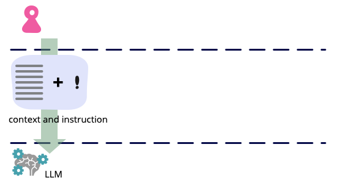
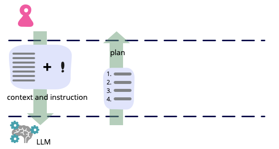
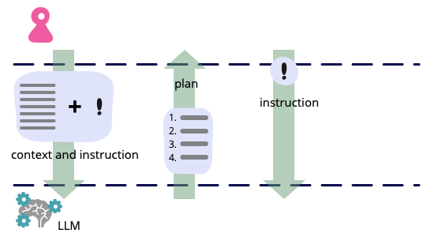
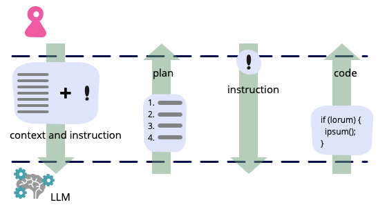

# LLM 编程提示词示例

徐昊在编写自测代码时，对 ChatGPT 使用了思维链提示 (chain of thought) 与通用知识提示 (general knowledge prompting)。

<i>本文记录了我与徐昊的一次内部交流，他展示了如何引导 ChatGPT 生成实用的、包含自测的代码。
他在初始提示中为 LLM 设定实现策略（思维链提示），并要求模型先给出实现方案而非直接生成代码（通用知识提示）。
得到方案后，他再据此完善实现逻辑，并生成实用的代码片段。</i>

| [Martin Fowler](https://martinfowler.com/)| |
|:---|:---|
|| |
|[原文](https://martinfowler.com/articles/2023-chatgpt-xu-hao.html)| 2023/4/13|

---
最近我观看了一场十分精彩的 Zoom 通话。
徐昊—— Thoughtworks 中国区技术负责人，分享了他使用 ChatGPT 辅助编写 [自测代码](https://martinfowler.com/bliki/SelfTestingCode.html)（Self‑Testing Code）的探索实践，并详细讲解了对他行之有效的交互方式。

他会先通过一段提示词设定应用上下文，并明确代码的期望结构。

<div style="background-color: darkblue; padding: 8px; border-left: 4px solid lightblue;">
当前系统为一款在线白板系统。技术栈：TypeScript、React、Redux、KonvaJS 与 react-konva。
使用 Vitest、React Testing Library 测试模型、视图模型及相关 Hooks；使用 Cypress 测试组件测试视图 (view)。
</br></br>
所有代码均需基于上述技术栈编写。
需求需以 MVVM 架构模式的 React 组件实现。
</br></br>
系统包含两类视图模型（view model）：

1. 共享视图模型（Shared view model）：表示本地用户与远端用户之间共享状态的视图模型。

2. 本地视图模型（Local view model）：表示仅适用于本地用户状态的视图模型。

以下为通用实现策略：

1. 共享视图模型以 Redux store slice 实现，使用 vitest 测试。

2. 本地视图模型以 React 组件 props 或状态（利用 useState Hook）实现；
全局本地视图模型例外，其同样以 Redux store slice 实现，使用 vitest 测试。

3. Hooks 作为主要视图助手，用于从共享视图模型获取数据。
多数情况下使用 `createSelector` 与 `useSelector` 实现记忆化（memoization），使用 vitest 与 react testing library 测试。

4. 不直接 dispatch Action 来修改共享视图模型状态，而是使封装后的视图模型接口。
接口中每个 redux action 均映射为一个方法，使用 vitest 测试。

5. 视图由 Konva 图形构成，通过 react-konva 实现为 React 组件，使用 cypress 测试组件测试。

实现与测试组件时需遵循以下规范：

1. 编写测试时使用 `describe`，而非 `test`。
2. 优先采用数据驱动测试（Data-driven tests）。
3. 测试视图组件时，通过视图模型接口模拟（fake）视图模型。

感知层（Awareness Layer）

需求：

在白板上展示其他用户的感知信息（光标、用户名、在线状态）。

AC1：不显示本地用户。

AC2：远端用户光标位置变化时，以动画形式展示变化。

按照上述指导原则提供整体解决方案。
提示：将所有感知信息放置在一个 Konva 图层中，并使用一个感知信息组件来渲染光标和用户名。
请勿生成代码。
描述解决方案，并根据上述指导原则将方案拆解为任务清单。
我们将把此任务清单称为主计划。
</div></br>

这段提示词包含了较多内容，因此他重点强调了几点。

他在此处使用了通用应用示例：与 ChatGPT 这类工具交互时需要特别注意一点 —— **绝不能在提示词中包含任何可能涉密的信息** ，否则会带来安全风险。
业务规则、真实项目中的任何代码，这些内容都绝对不能出现在与 ChatGPT 的交互中。

提示词的大部分内容用于明确设计规范，即他希望 ChatGPT 生成代码时遵循的规则。
<ins>他通过不断将提示词输入 ChatGPT、查看输出结果、反复打磨提示词，使其按照期望的风格生成代码，从而不断优化提示词</ins>。
一旦上下文配置稳定可用，他就可以将其复用到每一次 ChatGPT 会话中，并分享给团队其他成员。

</br>
*徐昊在会话开始时，为 ChatGPT LLM 提供上下文信息，并指示其生成实施方案，以此启动交互。*

尽管本次对话的最终目标是生成代码及其测试代码，但在这一阶段他明确要求：不要生成代码。
此时他希望 ChatGPT 先概述实现思路，之后再进行代码生成。
这是一种名为生成式知识（Generated Knowledge）的提示词技术。

与大模型交互的常见方式是：提出问题并要求直接生成最终结果 —— 无论是文字内容还是（本例中的）代码。
而使用 **生成式知识** 时，我们将交互拆分为独立步骤：
首先让 LLM 生成与问题相关的有效信息，再将这些信息回传给大模型，用以生成最终结果。

该提示词中最精妙的部分是 “实现策略” 部分，它融合了两种提示方式：

- **指令式提示**：为 LLM 提供需要遵守的指令
- **思维链提示**：引导 LLM 阐述其推理过程

在实现策略部分中，徐昊将期望的架构模式，定义为 ChatGPT 需遵循的 “思维链指令”。
随后他要求 ChatGPT 基于这一思维链构建任务清单（即生成式知识）。

<div style="background-color: darkgreen; padding: 8px; border-left: 4px solid lightgreen;">

解决方案：

为实现感知层（awareness layer）功能，我们可遵循需求描述中提及的规范，并使用现有技术栈完成开发。

任务清单：

1. 创建名为 `AwarenessInfo` 的新组件，用于渲染远端用户的光标和名称。

2. 创建一个新的 Konva 图层，用于承载所有 `AwarenessInfo` 组件。

3. 将该 Konva 图层添加到白板主组件中。

4. 创建新的 Redux slice，用于存储远端用户的感知信息。

5. 为感知相关的 Redux slice 封装视图模型接口。

6. 实现 `AwarenessInfo` 组件，从视图模型中获取并展示每个远端用户的感知信息。

7. 在封装的视图模型接口中实现方法，用于更新每个远端用户的感知信息。

8. 当远端用户光标位置发生变化时，调用封装视图模型接口中的更新方法，以更新对应的感知信息。

9. 在 `AwarenessInfo` 组件中，使用新位置对光标变化进行动画处理。

10. 为新的 `AwarenessInfo` 组件编写测试，包括数据驱动测试，确保其能正确展示所有远端用户的感知信息。

11. 为封装的视图模型接口编写测试，确保其能正确更新远端用户的感知信息。

12. 编写 Cypress 端到端测试，确保在远端用户改变光标位置时，感知层能够正确显示与更新。

按照以上任务执行，即可在在线白板系统中实现感知层功能。

</div></br>

ChatGPT 的响应具有非确定性，因此该结果仅为单次运行输出。
如果你（或我）再次输入这段提示词，将会得到不同的响应。

该响应的核心部分是有序任务清单，每个步骤均带有编号。
在本次会话的后续环节中，我们可以使用这些编号来指代对应任务。

</br>
*大模型最终输出了一份实施方案。*

徐昊现在可以查看这份主计划，判断其是否合理。
如果计划存在问题，他可以通过补充更多信息，让 ChatGPT 重写部分任务或整个主计划。

例如，当前的主计划没有按照不同组件类型进行分组。
这时可以使用类似这样的提示词：

<div style="background-color: #0a2463; padding: 8px; border-left: 4px solid lightblue;">

  重写主计划，并将任务按模型、视图模型和视图进行分组。

</div></br>

这可用于验证架构构想与主计划之间的一致性。

这些优化调整可以加入到初始提示词中，以获得整体更优质的响应。
对于这个特定提示词，以下指令并未包含在初始提示词中，而是在后续迭代中补充添加的：

<div style="background-color: #0a2463; padding: 8px; border-left: 4px solid lightblue;">

4. 不直接 dispatch Action 来修改共享视图模型状态，而是使封装后的视图模型接口。
接口中每个 redux action 均映射为一个方法，使用 vitest 测试。

</div></br>

当主计划看起来合理后，徐昊会要求重新生成一份包含程序元素命名的版本。

<div style="background-color: #0a2463; padding: 8px; border-left: 4px solid lightblue;">
重写主计划，这次要包含详细的组件名称、方法名和 Props。
</div></br>
<div style="background-color: darkgreen; padding: 8px; border-left: 4px solid lightgreen;">
好的，这是包含详细组件名、方法、Props的修订版主计划：

任务清单：

1. 创建名为 AwarenessInfo 的新组件，用于渲染远端用户的光标和名称。
该组件将接收用户名、光标位置、在线状态等 Props。

2. 创建名为 AwarenessLayer 的新 Konva 图层，用于承载所有 AwarenessInfo 组件。

3. 将 AwarenessLayer 添加到白板主组件中。

4. 创建名为 awareness 的新 Redux slice，用于存储远端用户的感知信息。

5. 为 awareness Redux slice 创建封装的视图模型接口 AwarenessViewModel。
该接口包含名为 updateUserAwarenessInfo 的方法，用于更新每个远端用户的感知信息。

6. 实现 AwarenessInfo 组件，从视图模型中获取并展示每个远端用户的感知信息。
组件将使用 useSelector Hook 获取相关数据。

7. 在 AwarenessViewModel 接口中实现 updateUserAwarenessInfo 方法，用于分发 Redux action 以更新每个远端用户的感知信息。
该方法将由 MainWhiteboard 组件调用。

8. 当远端用户改变光标位置时，调用 AwarenessViewModel 中的 updateUserAwarenessInfo 方法，更新对应的感知信息。

9. 在 AwarenessInfo 组件中，使用新位置对光标变化执行动画。可通过 Konva 的 Tween 动画实现。

10. 为 AwarenessInfo 组件编写测试，包括数据驱动测试，确保正确展示所有远端用户的感知信息。测试使用 React Testing Library。

11. 为封装的视图模型接口编写测试，确保正确更新远端用户的感知信息。测试使用 Vitest 框架。

12. 编写 Cypress 端到端测试，确保远端用户光标位置变化时感知层能正确显示与更新。
测试将模拟用户与白板的交互，并验证 AwarenessLayer 与 AwarenessInfo 组件的状态。

</div></br>

至此，徐昊已经准备好让 ChatGPT 为其中一个步骤生成代码。

</br>

<div style="background-color: #0a2463; padding: 8px; border-left: 4px solid lightblue;">
  为我提供 awareness slice 和 AwarenessViewModel 的测试示例与实现代码，要求测试先行。
</div></br>
<div style="background-color: darkgreen; padding: 8px; border-left: 4px solid lightgreen;">

  好的，我们首先为 awareness slice 和 AwarenessViewModel 编写测试：

针对 awareness slice 的测试：

```TypeScript
describe('awareness slice', () => {
  let store: MockStore;
  beforeEach(() => {
    store = configureMockStore()(initialState);
  });

  it('should set the cursor location', () => {
    store.dispatch(setCursorLocation({ x: 100, y: 200 }));
    const state = store.getState().awareness;
    expect(state.cursorLocation).toEqual({ x: 100, y: 200 });
  });

  it('should set the name', () => {
    store.dispatch(setName('John Doe'));
    const state = store.getState().awareness;
    expect(state.name).toBe('John Doe');
  });

  it('should set the online status', () => {
    store.dispatch(setOnline(true));
    const state = store.getState().awareness;
    expect(state.isOnline).toBe(true);
  });
});
Test for AwarenessViewModel:

describe('AwarenessViewModel', () => {
  let store: MockStore;
  let awarenessViewModel: AwarenessViewModel;
  beforeEach(() => {
    store = configureMockStore()(initialState);
    awarenessViewModel = new AwarenessViewModel(store);
  });

  it('should set the cursor location', () => {
    awarenessViewModel.setCursorLocation({ x: 100, y: 200 });
    const state = store.getState().awareness;
    expect(state.cursorLocation).toEqual({ x: 100, y: 200 });
  });

  it('should set the name', () => {
    awarenessViewModel.setName('John Doe');
    const state = store.getState().awareness;
    expect(state.name).toBe('John Doe');
  });

  it('should set the online status', () => {
    awarenessViewModel.setOnline(true);
    const state = store.getState().awareness;
    expect(state.isOnline).toBe(true);
  });
});
Now, let's implement the Awareness slice and AwarenessViewModel:

Awareness slice:

interface AwarenessState {
  cursorLocation: { x: number; y: number };
  name: string;
  isOnline: boolean;
}

const initialState: AwarenessState = {
  cursorLocation: { x: 0, y: 0 },
  name: '',
  isOnline: false,
};

const awarenessSlice = createSlice({
  name: 'awareness',
  initialState,
  reducers: {
    setCursorLocation: (state, action: PayloadAction<{ x: number; y: number }>) => {
      state.cursorLocation = action.payload;
    },
    setName: (state, action: PayloadAction) => {
      state.name = action.payload;
    },
    setOnline: (state, action: PayloadAction) => {
      state.isOnline = action.payload;
    },
  },
});

export const { setCursorLocation, setName, setOnline } = awarenessSlice.actions;

export default awarenessSlice.reducer;
AwarenessViewModel:

class AwarenessViewModel {
  private store: Store;

  constructor(store: Store) {
    this.store = store;
  }

  setCursorLocation(cursorLocation: { x: number; y: number }) {
    this.store.dispatch(setCursorLocation(cursorLocation));
  }

  setName(name: string) {
    this.store.dispatch(setName(name));
  }

  setOnline(isOnline: boolean) {
    this.store.dispatch(setOnline(isOnline));
  }
}  
```

注：在本实现中，我假定 AwarenessViewModel 仅用于向存储中设置数值。
若还需用它从存储中读取数值，我们可以在 AwarenessViewModel 类中添加对应的方法。
</div></br>

（我已去掉 ChatGPT 回复中的格式样式。）

</br>

总体而言，这段代码不算差，但也不算完美。
照目前的写法无法直接运行：缺少 `configureMockStore`，并且假定使用 `redux-mock-store`，而这个库并不在技术栈中。

徐昊可以通过让大模型逐步改写、持续微调代码来修复这些问题。
下面是一个移除 `redux-mock-store` 的示例指令。

<div style="background-color: #0a2463; padding: 8px; border-left: 4px solid lightblue;">
  在不使用 redux-mock-store 的情况下重写这些测试。
</div></br>
<div style="background-color: darkgreen; padding: 8px; border-left: 4px solid lightgreen;">
  好的，以下是不使用 redux‑mock‑store 的 AwarenessViewModel 和 awareness slice 测试示例实现：

```TypeScript
import { createAwarenessSlice, AwarenessState, updateAwareness } from './awarenessSlice';
import { AwarenessViewModel } from './AwarenessViewModel';

describe('AwarenessViewModel', () => {
  const mockDispatch = jest.fn();
  const initialState: AwarenessState = {
    users: {
      'user1': {
        name: 'User 1',
        cursorPosition: { x: 0, y: 0 },
        online: true,
      },
      'user2': {
        name: 'User 2',
        cursorPosition: { x: 100, y: 100 },
        online: true,
      },
    },
  };
  let viewModel: AwarenessViewModel;

  beforeEach(() => {
    viewModel = new AwarenessViewModel(initialState, mockDispatch);
  });

  describe('getUserNames', () => {
    it('returns the list of user names', () => {
      const names = viewModel.getUserNames();
      expect(names).toEqual(['User 1', 'User 2']);
    });
  });

  describe('getCursorPosition', () => {
    it('returns the cursor position for a given user ID', () => {
      const cursorPosition = viewModel.getCursorPosition('user1');
      expect(cursorPosition).toEqual({ x: 0, y: 0 });
    });

    it('returns undefined for an unknown user ID', () => {
      const cursorPosition = viewModel.getCursorPosition('unknown');
      expect(cursorPosition).toBeUndefined();
    });
  });

  describe('updateCursorPosition', () => {
    it('dispatches the updateAwareness action with the new cursor position', () => {
      viewModel.updateCursorPosition('user1', { x: 50, y: 50 });
      expect(mockDispatch).toHaveBeenCalledWith(updateAwareness({
        user: 'user1',
        cursorPosition: { x: 50, y: 50 },
      }));
    });
  });
});
```

以下是**不使用 redux-mock-store** 的 awarenessSlice 示例实现：

```TypeScript
import { createSlice, PayloadAction } from '@reduxjs/toolkit';

export type CursorPosition = { x: number, y: number };

export type UserAwareness = {
  name: string;
  cursorPosition: CursorPosition;
  online: boolean;
};

export type AwarenessState = {
  users: Record<string, UserAwareness>;
};

const initialState: AwarenessState = {
  users: {},
};

const awarenessSlice = createSlice({
  name: 'awareness',
  initialState,
  reducers: {
    updateAwareness: (state, action: PayloadAction<{ user: string, cursorPosition: CursorPosition }>) => {
      const { user, cursorPosition } = action.payload;
      state.users[user].cursorPosition = cursorPosition;
    },
    setOnline: (state, action: PayloadAction<{ user: string, online: boolean }>) => {
      const { user, online } = action.payload;
      state.users[user].online = online;
    },
  },
});

export const { updateAwareness, setOnline } = awarenessSlice.actions;
export const awarenessReducer = awarenessSlice.reducer;
```

请注意，由于我们不再使用 `redux-mock-store`，需要向视图模型构造函数传入模拟的 dispatch 函数，并且在 `updateCursorPosition` 的测试中，需要通过 `jest.fn()` 来验证是否分发了正确的动作。

</div></br>

后续还可以进行更多改写调整，例如要求使用 `configureTestingStore('awareness', initialState)` 来初始化测试 Store，使其符合团队的测试规范与惯用写法。
之后再稍作路径调整，并为 Reducer 补充少量粘合代码，代码即可正常运行。

一旦这套流程可行，徐昊就可以按照同样方式，对主计划中的其余任务重复操作。

在这类实践中使用 ChatGPT 的一个问题是上下文窗口有限（也称为 “token 限制”）。
当对话中接收到足够多的文字（更严格地说是 token）后，它就会开始遗忘最早的内容，这种现象会使其出现明显的健忘情况。
这在简短对话中并不明显，但在像本次实践这样需要大量上下文的工作中，影响就十分显著。
ChatGPT 一直在不断扩大其上下文窗口：GPT-4 的 token 限制为 8192，另有一个变体提升至 32768。

徐昊发现 token 限制对他的工作主要有三方面影响：第一，ChatGPT 可能会停止生成内容——这一点相对容易解决，我们可以通过类似 “你还没完成” 或 “继续” 的提示让它接续输出。
第二，如果整体提示内容过长，ChatGPT 会直接返回致命错误，此时只能重新开启对话。

第三个问题更为棘手：ChatGPT 会开始遗忘并丢失上下文。
出现这种情况时，我们需要重置上下文。
而先制定主计划、再将任务拆解为独立模块的做法正好能发挥作用。
我们可以开启新对话，带上原始策略与主计划，让它为计划中的不同任务项生成代码。

徐昊发现，上下文中的思维链对于让代码（即便在不同对话中生成）保持整体协调至关重要。
有时他虽可在提示中加入说明以生成连贯代码，但他发现优化思维链能取得更好的效果。

<ins>我从这次讨论中得到的核心收获是：运用思维链和生成式知识提示词方法，对编程工作而言能成为非常实用的工具</ins>。
这尤其表明，想要用好 LLM ，我们必须学会如何构建提示词以获得最佳效果。
这次经验说明：把 LLM 当作初级合作伙伴与之交互是很有效的方式 —— 先给出架构规范，让它展示推理过程，再在过程中逐步调整输出结果。

---
### 致谢
除了主持最初的 Zoom 讨论外，徐昊还帮助我将本文梳理成连贯完整的内容，并向我介绍了他所使用的更广泛的技术方法。

Charith Tangirala、David Johnston、Pavlo Kerestey、Premanand Chandrasekaran、Rafael Detoni、Rebecca Parsons 以及 Sachin Dharmapurikar 在内部邮件列表中对本文进行了讨论，并提出了其他一些与 LLM 交互的有趣思路。我希望在不久的将来分享这些内容。

Hacker News 用户 “afro88” 启发我对上下文窗口受限的问题进行了更深入的探究。

### 延伸阅读
learnprompting.org 是一份实用且不断完善的提示词指南，它是一个开源协作平台，专门介绍提示工程相关知识。
若想深入了解本文提及的提示词技术，可参阅 [Liu 等人](https://arxiv.org/abs/2110.08387) 关于生成式知识提示的研究，以及 [Wei 等人](https://openreview.net/forum?id=_VjQlMeSB_J) 关于思维链提示的研究。

### 重要修订
2023/4/20：补充上下文窗口相关内容  
2023/4/13：正式发布  
2023/4/4：开始撰写草稿
