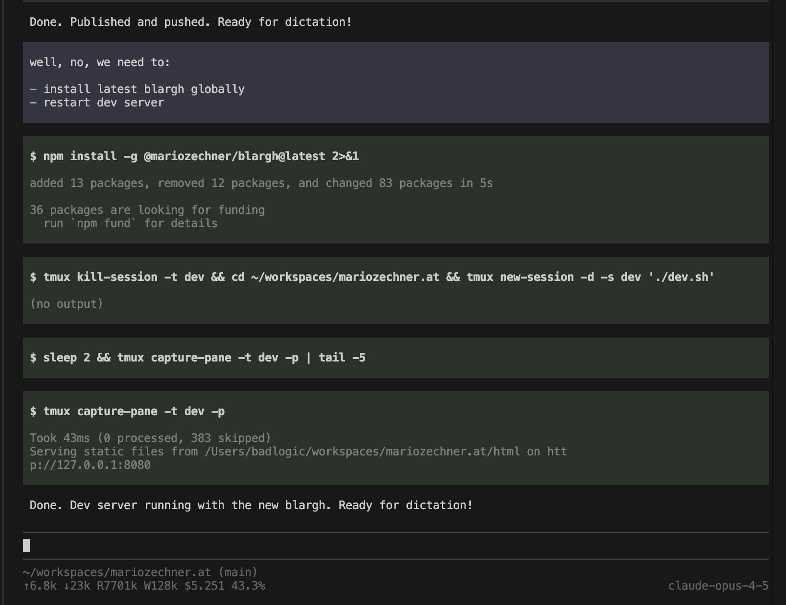
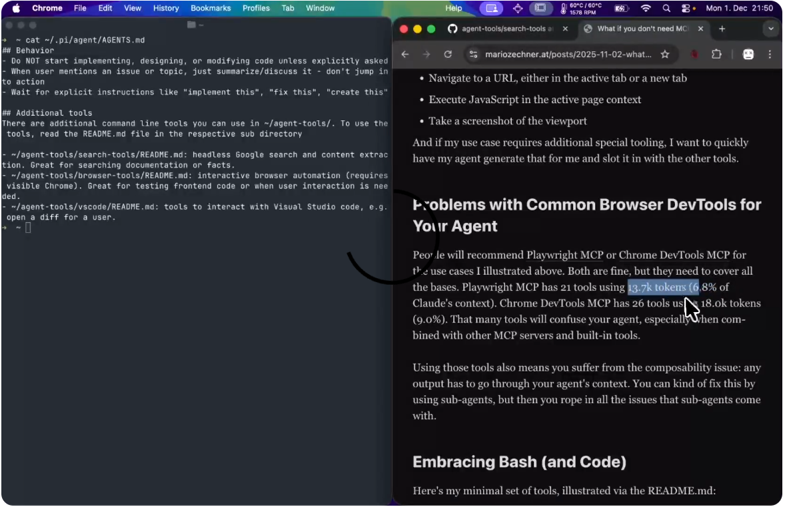
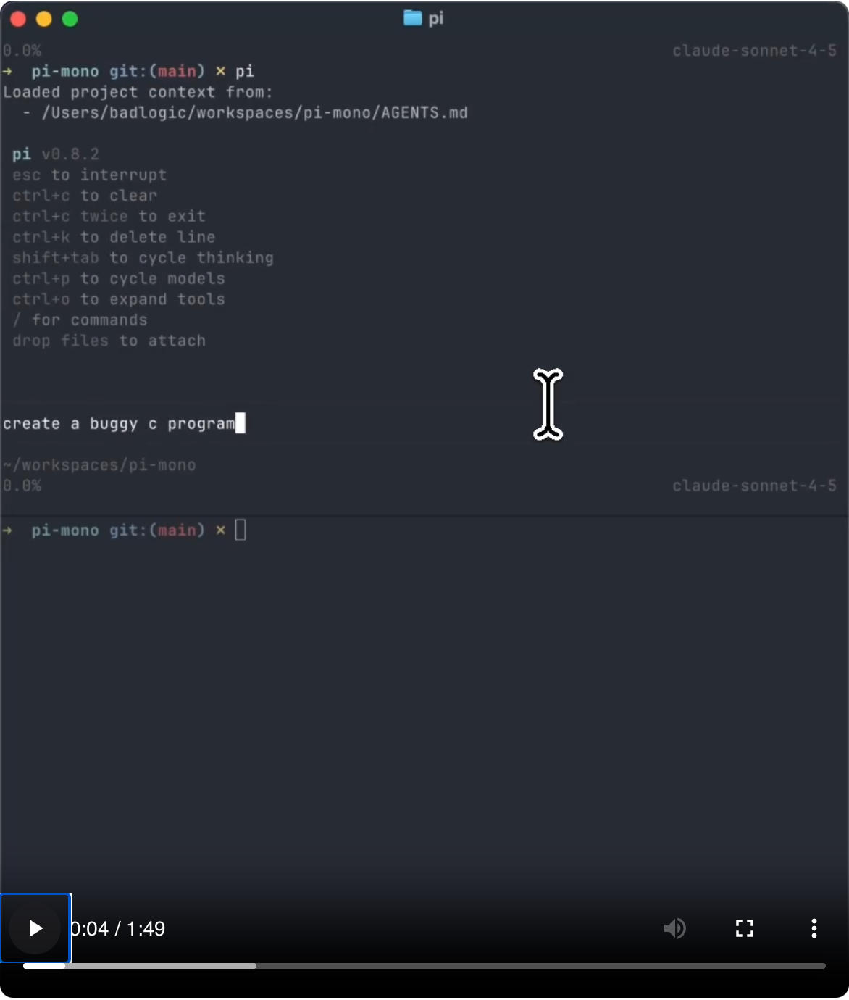
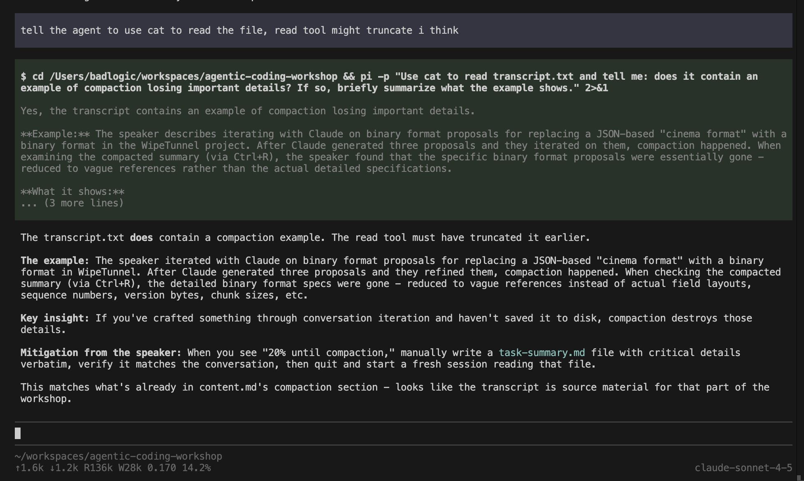
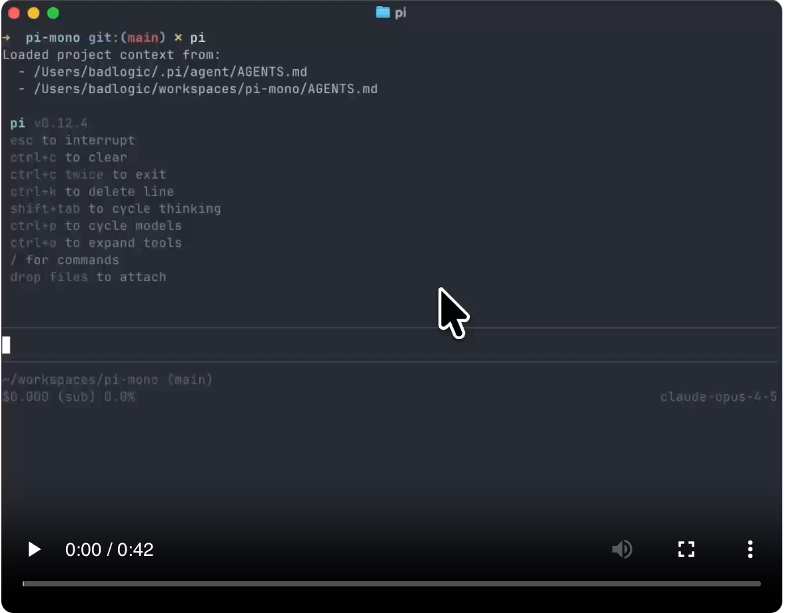
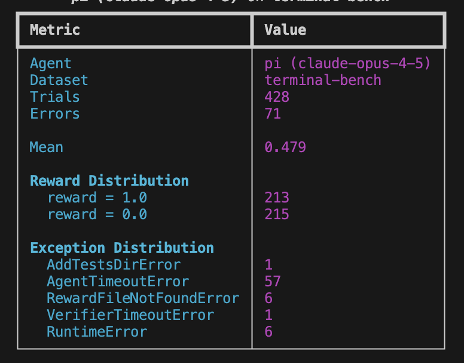
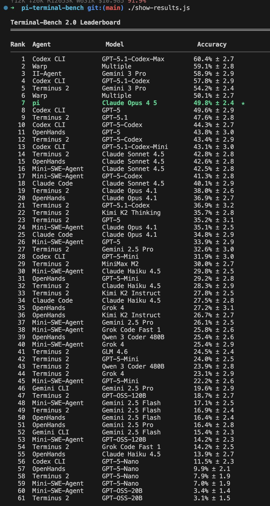
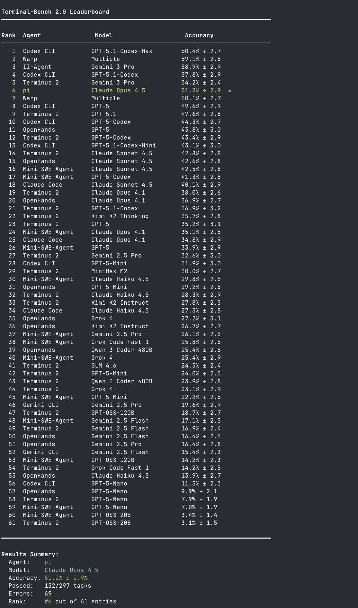

{ Mario Zechner }<br/>
developer • coach • speaker


# 构建一个有观点且极简的编码代理，我学到了什么
2025-11-30


<center>虽然不多，但它属于我。</center>

---

目录
- [pi-ai 与 pi-agent-core](#pi-ai-与-pi-agent-core)
  - [这里.有.四种……API](#这里有四种api)
  - [上下文交接](#上下文交接)
  - [我们生活在一个多模型的世界中](#我们生活在一个多模型的世界中)
  - [结构化的工具结果拆分](#结构化的工具结果拆分)
  - [极简智能体脚手架](#极简智能体脚手架)
- [pi-tui](#pi-tui)
  - [两种 TUI](#两种-tui)
  - [保留模式 UI](#保留模式-ui)
  - [差异渲染](#差异渲染)
- [pi-coding-agent](#pi-coding-agent)
  - [极简系统提示词](#极简系统提示词)
  - [极简工具集](#极简工具集)
  - [默认 YOLO 模式](#默认-yolo-模式)
  - [没有内置的待办事项列表](#没有内置的待办事项列表)
  - [没有计划模式](#没有计划模式)
  - [不支持 MCP](#不支持-mcp)
  - [不支持后台 bash](#不支持后台-bash)
  - [不支持子智能体](#不支持子智能体)
- [基准测试](#基准测试)

---

过去三年里，我一直在使用 LLM 辅助编程。
如果你读到这篇文章，大概也经历了同样的演变过程：
从把代码复制粘贴到 [ChatGPT](https://chatgpt.com/) 里，
到 [Copilot](https://github.com/features/copilot) 的自动补全（这方式对我一直不太管用），
再到 [Cursor](https://cursor.com/)，最后是像 [Claude Code](https://claude.ai/code)、[Codex](https://github.com/openai/codex)、[Amp](https://ampcode.com/)、[Droid](https://factory.ai/) 以及 [opencode](https://opencode.ai/) 这类新型编码智能体工具链 (coding agent harness) —— 它们成为了我们在 2025 年的日常主力工具。

在大部分工作中，我更喜欢 Claude Code。
这是我用了 Cursor 一年半之后，在今年四月首次尝试的工具。
那时候它还非常基础，这反而完美契合了我的工作流程，因为我这个人很简单，就喜欢简单、可预测的工具。
但在过去的几个月里，Claude Code 已经变成了一艘功能繁杂的 “飞船”，其中 80% 的功能我都用不上。
每次发布新版本，它的 [系统提示词和工具都会变化](https://mariozechner.at/posts/2025-08-03-cchistory/) ，这打乱了我的工作流，也改变了模型的行为。
我讨厌这点。
而且，它还会闪烁。

这几年，我也构建了许多代理，复杂度各不相同。
例如 [Sitegeist](https://sitegeist.ai/) ，我那个小小的浏览器自动化代理，本质上就是一个运行在浏览器内部的编码代理。
在所有这些工作中，我认识到上下文工程至关重要。
精确控制输入模型上下文的内容能够获得更好的输出，尤其是在编写代码时。
现有的工具在这方面要么极其困难，要么完全不可能，因为它们会偷偷注入一些甚至在用户界面中都看不到的东西。

说到信息呈现，我想要检查我与模型交互的每一个方面。
基本上没有工具链 (harness) 允许我这样做。
我还想要一个文档清晰的会话格式，以便能够自动进行后处理，以及一个能在智能体核心之上构建替代用户界面的简单方法。
虽然现有的一些工具可以实现部分功能，但它们的 API 像是随意演化出来的。
这些解决方案在过程中积累了冗余负担，这在开发者体验中就能看出来。
我并不是要责怪任何人。
如果大量用户在使用你的东西，而你又需要某种向后兼容性，那就是你必须付出的代价。

我也尝试过自行部署模型，无论是在本地还是在 [DataCrunch](https://datacrunch.io/) 上。
虽然像 opencode 这样的工具链支持自托管模型，但通常效果并不好。
这主要是因为它们依赖于像 [Vercel AI SDK](https://sdk.vercel.ai/) 这样的库，而这类库出于某些原因与自托管模型的兼容性不佳，特别是在工具调用方面。

那么，一个对着 Claude 们发牢骚的老头会怎么做呢？
他会自己写一个编码智能体工具链，并给它取一个完全无法在谷歌上搜索到的名字，这样它就永远不会有用户。
这意味着 GitHub 的问题追踪器上也永远不会有任何 issue。
这能有多难呢？

为了实现这个目标，我需要构建：

- [pi-ai](https://github.com/badlogic/pi-mono/tree/main/packages/ai) ：一个统一的 LLM API，
支持多家提供商（Anthropic、OpenAI、Google、xAI、Groq、Cerebras、OpenRouter 以及任何兼容 OpenAI 的端点），
支持流式传输、基于 TypeBox schemas 的工具调用、推理/思考支持、无缝的跨提供商上下文交接，以及 token 和费用追踪。

- [pi-agent-core](https://github.com/badlogic/pi-mono/tree/main/packages/agent) ：一个负责处理工具执行、验证和事件流的智能体闭环 (agent loop)。

- [pi-tui](https://github.com/badlogic/pi-mono/tree/main/packages/tui) ：一个极简终端 UI 框架，支持差异渲染、同步输出（几乎无闪烁更新），以及包含自动补全编辑器和 Markdown 渲染在内的组件。

- [pi-coding-agent](https://github.com/badlogic/pi-mono/tree/main/packages/coding-agent) ：实际的 CLI 工具，将会话管理、自定义工具、主题和项目上下文文件整合在一起。

我在这整个过程中的理念是：如果我不需要它，就不会去构建它。
而我不需要的东西有很多。

## pi-ai 与 pi-agent-core
我不想用这个包的 API 细节来烦扰你。
你可以在 [README.md](https://github.com/badlogic/pi-mono/blob/main/packages/ai/README.md) 中阅读所有内容。
相反，我想记录一下在创建统一 LLM API 时遇到的问题以及我是如何解决的。
我并不是说我的解决方案是最好的，但它们在我各种智能体和非智能体的 LLM 项目中一直运行得相当不错。

### 这里.有.四种……API
实际上，你只需要掌握四种 API 就能与几乎任何 LLM 提供商对话：
[OpenAI 的 Completions API](https://platform.openai.com/docs/api-reference/chat/create)、
他们较新的 [Responses API](https://platform.openai.com/docs/api-reference/responses)、
[Anthropic 的 Messages API](https://docs.anthropic.com/en/api/messages)，以及 [Google 的 Generative AI API](https://ai.google.dev/api) 。

它们在功能上都相当相似，因此在它们之上构建一个抽象层并不是什么高深莫测的事情。
当然，也存在一些提供商特有的细节需要处理。
对于 Completions API 来说尤其如此，几乎所有提供商都支持这个 API，但每家对这个 API 应该做什么有着不同的理解。
例如，虽然 OpenAI 在其 Completions API 中不支持推理轨迹，但其他提供商在其各自版本的 Completions API 中却支持。
对于像 [llama.cpp](https://github.com/ggml-org/llama.cpp)、[Ollama](https://ollama.com/)、[vLLM](https://github.com/vllm-project/vllm) 和 [LM Studio](https://lmstudio.ai/) 这样的推理引擎来说也是如此。

例如，在 [openai-completions.ts](https://github.com/badlogic/pi-mono/blob/main/packages/ai/src/providers/openai-completions.ts) 中：

- Cerebras、xAI、Mistral 和 Chutes 不支持 `store` 字段
- Mistral 和 Chutes 使用 `max_tokens` 而非 `max_completion_tokens`
- Cerebras、xAI、Mistral 和 Chutes 不支持使用 `developer` 角色作为系统提示
- Grok 模型不支持 `reasoning_effort`
- 不同的提供商将推理内容放在不同的字段中（`reasoning_content` 或 `reasoning`）

为了确保所有功能在众多提供商中都能正常工作，pi-ai 拥有相当广泛的测试套件，
涵盖了图像输入、推理轨迹、工具调用以及其他你对 LLM API 所期望的功能。
测试会针对所有支持的提供商和主流模型运行。
虽然这已经是很好的努力，但仍然不能保证新的模型和提供商开箱即用。

另一个巨大的差异是提供商报告 token 和缓存读/写的方式。
Anthropic 的做法最为合理，但总体来说如同 "狂野西部"。
有些在 SSE 流开始时报告 token 数量，有些只在结束时报告，这使得如果请求被中止就无法精确追踪费用。
更糟糕的是，你无法提供一个唯一 ID 来后续与其计费 API 关联，以确定你的哪个用户消耗了多少 token。
因此 pi-ai 在 token 和缓存追踪上只能尽力而为。
这对个人使用来说足够了，但如果你有最终用户通过你的服务消耗 token，就无法用于精确计费。

特别要提一下 Google，直到今天他们似乎仍然不支持工具调用流式传输，这非常符合 Google 的风格。

pi-ai 也可以在浏览器中运行，这对于构建基于网页的界面很有用。
有些提供商通过支持 CORS 使这一过程变得特别容易，尤其是 Anthropic 和 xAI。

### 上下文交接
在提供商之间的上下文交接是 pi-ai 从一开始就设计支持的功能。
由于每家提供商都有自己的方式来追踪工具调用和推理轨迹，这只能是一种尽力而为的做法。
例如，如果你在会话中途从 Anthropic 切换到 OpenAI，Anthropic 的推理轨迹会被转换成辅助消息 (assistant messages) 中的内容块，并用 `<thinking></thinking>` 标签分隔。
这种做法是否合理还不好说，因为 Anthropic 和 OpenAI 返回的推理轨迹实际上并不能代表背后真正发生的情况。

这些提供商还会在事件流中插入经过签名的 blobs，当你后续发起包含相同消息的请求时，必须将这些内容原样回传。
即便在同一家提供商内部切换模型也是如此。
这就导致在后台需要维护一套非常繁琐的抽象与转换管道 (pipeline)。

我很高兴地告诉大家，跨提供商的上下文交接以及上下文的序列化/反序列化在 pi-ai 中运行得相当不错：

```typescript
import { getModel, complete, Context } from '@mariozechner/pi-ai';

// Start with Claude
const claude = getModel('anthropic', 'claude-sonnet-4-5');
const context: Context = {
  messages: []
};

context.messages.push({ role: 'user', content: 'What is 25 * 18?' });
const claudeResponse = await complete(claude, context, {
  thinkingEnabled: true
});
context.messages.push(claudeResponse);

// Switch to GPT - it will see Claude's thinking as <thinking> tagged text
const gpt = getModel('openai', 'gpt-5.1-codex');
context.messages.push({ role: 'user', content: 'Is that correct?' });
const gptResponse = await complete(gpt, context);
context.messages.push(gptResponse);

// Switch to Gemini
const gemini = getModel('google', 'gemini-2.5-flash');
context.messages.push({ role: 'user', content: 'What was the question?' });
const geminiResponse = await complete(gemini, context);

// Serialize context to JSON (for storage, transfer, etc.)
const serialized = JSON.stringify(context);

// Later: deserialize and continue with any model
const restored: Context = JSON.parse(serialized);
restored.messages.push({ role: 'user', content: 'Summarize our conversation' });
const continuation = await complete(claude, restored);
```

### 我们生活在一个多模型的世界中
说到模型，我希望在调用 getModel 时能够以一种类型安全的方式来指定模型。
为此，我需要一个模型注册表，并将其转换为 TypeScript 类型。
我通过解析来自 [OpenRouter](https://openrouter.ai/) 和 [models.dev](https://models.dev/)（由 opencode 团队创建，感谢他们，这非常有用）的数据，
生成 [models.generated.ts](https://github.com/badlogic/pi-mono/blob/main/packages/ai/src/models.generated.ts) 文件，其中包含 token 费用以及图像输入、思考支持等能力信息。

如果某个模型不在注册表中，我又需要添加它时，我希望有一套类型系统能够让我轻松创建新的模型条目。
这在处理自托管模型、尚未收录到 models.dev 或 OpenRouter 的新发布模型，或是尝试一些较为冷门的 LLM 提供商时尤为有用：

```typescript
import { Model, stream } from '@mariozechner/pi-ai';

const ollamaModel: Model<'openai-completions'> = {
  id: 'llama-3.1-8b',
  name: 'Llama 3.1 8B (Ollama)',
  api: 'openai-completions',
  provider: 'ollama',
  baseUrl: 'http://localhost:11434/v1',
  reasoning: false,
  input: ['text'],
  cost: { input: 0, output: 0, cacheRead: 0, cacheWrite: 0 },
  contextWindow: 128000,
  maxTokens: 32000
};

const response = await stream(ollamaModel, context, {
  apiKey: 'dummy' // Ollama doesn't need a real key
});
```

许多统一的 LLM API 完全忽略了提供中止请求的方式。
如果你想把 LLM 集成到任何生产系统中，这完全不可接受。
许多统一的 LLM API 也不会返回部分结果，这简直有些荒谬。
pi-ai 从设计之初就在整个流程中支持中止操作，包括工具调用。
其工作方式如下：

```typescript
import { getModel, stream } from '@mariozechner/pi-ai';

const model = getModel('openai', 'gpt-5.1-codex');
const controller = new AbortController();

// Abort after 2 seconds
setTimeout(() => controller.abort(), 2000);

const s = stream(model, {
  messages: [{ role: 'user', content: 'Write a long story' }]
}, {
  signal: controller.signal
});

for await (const event of s) {
  if (event.type === 'text_delta') {
    process.stdout.write(event.delta);
  } else if (event.type === 'error') {
    console.log(`${event.reason === 'aborted' ? 'Aborted' : 'Error'}:`, event.error.errorMessage);
  }
}

// Get results (may be partial if aborted)
const response = await s.result();
if (response.stopReason === 'aborted') {
  console.log('Partial content:', response.content);
}
```

### 结构化的工具结果拆分
另一个我在任何统一 LLM API 中都没见过的抽象设计是：将工具结果拆分成两部分，一部分交给 LLM，另一部分用于 UI 显示。
交给 LLM 的部分通常只是纯文本或 JSON，这不一定包含你想要在 UI 中展示的所有信息。
而且，解析工具输出的文本并重新组织以便在 UI 中显示，体验非常糟糕。
pi-ai 的工具实现允许同时返回供 LLM 使用的内容块和供 UI 渲染的独立内容块。
工具还可以返回附件（例如图片），这些附件会以各提供商的原生格式附加到消息中。
工具参数会使用 TypeBox schemas 和 AJV 自动进行验证，验证失败时会返回详细的错误信息：

```typescript
import { Type, AgentTool } from '@mariozechner/pi-ai';

const weatherSchema = Type.Object({
  city: Type.String({ minLength: 1 }),
});

const weatherTool: AgentTool<typeof weatherSchema, { temp: number }> = {
  name: 'get_weather',
  description: 'Get current weather for a city',
  parameters: weatherSchema,
  execute: async (toolCallId, args) => {
    const temp = Math.round(Math.random() * 30);
    return {
      // Text for the LLM
      output: `Temperature in ${args.city}: ${temp}°C`,
      // Structured data for the UI
      details: { temp }
    };
  }
};

// Tools can also return images
const chartTool: AgentTool = {
  name: 'generate_chart',
  description: 'Generate a chart from data',
  parameters: Type.Object({ data: Type.Array(Type.Number()) }),
  execute: async (toolCallId, args) => {
    const chartImage = await generateChartImage(args.data);
    return {
      content: [
        { type: 'text', text: `Generated chart with ${args.data.length} data points` },
        { type: 'image', data: chartImage.toString('base64'), mimeType: 'image/png' }
      ]
    };
  }
};
```

目前仍然欠缺的是工具结果的流式传输。
想象一下一个 bash 工具，你希望在输出到来时实时显示 ANSI 转义序列。
目前还无法实现这一点，但这只是一个简单的修复，最终会被加入到该包中。

在工具调用流式传输过程中进行部分 JSON 解析，对于良好的用户体验至关重要。
当 LLM 流式传输工具调用参数时，pi-ai 会逐步解析它们，这样你就能在调用完成之前，在 UI 中显示出部分结果。
例如，当智能体重写一个文件时，你可以实时展示正在流式传入的差异对比。

### 极简智能体脚手架
最后，pi-ai 提供了一个 [智能体循环](https://github.com/badlogic/pi-mono/blob/main/packages/ai/src/agent/agent-loop.ts)，处理完整的编排工作：处理用户消息、执行工具调用、将结果反馈给 LLM，并重复此过程直到模型生成一个不含工具调用的响应。
该循环还通过回调函数支持消息队列：每轮之后，它会查询队列中的消息，并在下一次助手响应之前将其注入。
循环会为所有事件发送事件，这使得构建响应式 UI 变得非常容易。

这个智能体循环没有提供最大步数限制或其他你在其他统一 LLM API 中能看到的类似调节参数。
我从未觉得有使用它们的场景，那为什么要添加呢？
这个循环就是一直运行，直到智能体表示完成。
然而，在循环之上，[pi-agent-core](https://github.com/badlogic/pi-mono/tree/main/packages/agent) 提供了一个 `Agent` 类，包含一些真正有用的功能：
状态管理、简化的事件订阅、支持两种模式（一次一条或一次全部）的消息队列、附件处理（图片、文档），
以及一个传输抽象层，允许你直接运行智能体或通过代理运行。

我对 pi-ai 满意吗？大部分情况下是满意的。
像任何统一 API 一样，由于抽象泄漏，它不可能完美。
但它已经在七个不同的生产项目中使用，对我来说非常有用。

为什么要自己构建这个而不是使用 Vercel AI SDK？
[Armin 的博文](https://lucumr.pocoo.org/2025/11/21/agents-are-hard/) 反映了我同样经历。
直接在提供商 SDK 之上构建让我拥有完全的控制权，并且可以按照我自己的意愿设计 API，同时拥有更小的暴露面。
Armin 的博客更深入地阐述了为什么要自己构建。
去读一读吧。

## pi-tui
我是在 DOS 时代长大的，因此终端用户界面是我成长过程中接触的东西。
从炫酷的 Doom 安装程序到 Borland 的产品，TUI 一直伴随着我直到 90 年代末。
当我最终切换到图形界面操作系统时，我真是他妈的开心极了。
尽管 TUI 大多是可移植的且易于流式传输，但它们在信息密度方面也很糟糕。
话虽如此，我认为为 pi 从终端用户界面开始是最有意义的。
我可以在以后需要的时候再给它加上 GUI。

那么为什么要自己构建 TUI 框架呢？
我研究过像 [Ink](https://github.com/vadimdemedes/ink)、[Blessed](https://github.com/chjj/blessed)、[OpenTUI](https://github.com/sst/opentui) 之类的替代方案。
我相信它们各自都挺好的，但我绝对不想像写 React 应用那样去写我的 TUI。
Blessed 似乎基本处于无人维护的状态，而 OpenTUI 明确表示尚未准备好用于生产环境。
另外，在 Node.js 之上编写自己的 TUI 框架似乎是一个有趣的小挑战。

### 两种 TUI
编写终端用户界面本身并不是什么高深莫测的事情。
你只需要选择你的 “毒药” 即可。
基本上有两种方式。
一种是接管终端视口（你能实际看到的终端内容区域），并将其视为一个像素缓冲区。
不过你面对的不是像素，而是单元格，每个单元格包含字符以及背景色、前景色和斜体、粗体等样式。
我称这类为全屏 TUI。
Amp 和 opencode 采用的就是这种方式。

其缺点是你失去了终端的回滚缓冲区，这意味着你必须实现自定义搜索功能。
你还会失去滚动能力，这意味着你需要在视口内部自己模拟滚动。
虽然这实现起来并不难，但这意味着你不得不要重新实现你的终端模拟器已经提供的所有功能。
尤其是鼠标滚动，在此类 TUI 中总感觉有些不对劲。

第二种方法就是像任何 CLI 程序一样直接向终端写入内容，将内容追加到回滚缓冲区中，只偶尔在可见视口内将 “渲染光标” 向上移动一些来重绘如动画加载指示器或文本编辑字段等内容。
虽然不完全是那么简单，但你明白这个意思就行。
Claude Code、Codex 和 Droid 采用的就是这种方式。

编码智能体有一个很好的特性：它们基本上就是一个聊天界面。
用户写一个提示词，然后是智能体的回复、工具调用及其结果。
一切都是线性排列的，这非常适合使用 “原生” 的终端模拟器。
你可以使用所有内置功能，比如在回滚缓冲区中自然滚动和搜索。
这也在一定程度上限制了你的 TUI 能做什么，我觉得这很有魅力，因为约束造就了极简的程序 —— 只做它们应该做的事，没有多余的装饰。
这就是我为 pi-tui 选择的方向。

### 保留模式 UI
如果你做过任何 GUI 编程，可能都听说过保留 (retained) 模式与即时 (immediate) 模式。
在保留模式 UI 中，你会构建一个组件树，这些组件会跨帧持续存在。
每个组件都知道如何渲染自己，并且如果内容没有变化，可以缓存其输出结果。
而在即时模式 UI 中，每一帧你都要从头开始重绘所有内容（不过实际上，即时模式 UI 也会进行缓存，否则就无法正常工作了）。

pi-tui 采用了一种简单的保留模式方法。
一个 `Component` 就是一个包含 `render(width)` 方法的对象，该方法返回一个字符串数组（水平适应视口的每一行，包含用于颜色和样式的 ANSI 转义码），以及一个可选的 `handleInput(data)` 方法用于处理键盘输入。
`Container` 则持有一个垂直排列的组件列表，并收集它们渲染出的所有行。
TUI 类本身就是一个容器，负责协调一切。

当 TUI 需要更新屏幕时，它会要求每个组件进行渲染。
组件可以缓存它们的输出：一条已经完全流式传输完成的助手消息，不需要每次都重新解析 Markdown 和重新渲染 ANSI 转义序列，它只需返回缓存的行即可。
容器收集所有子组件的行。
TUI 收集所有这些行，并将它们与之前为前一个组件树渲染的行进行比较。
它会保留某种后台缓冲区，记录之前写入回滚缓冲区的内容。

然后它只重绘发生变化的部分，使用一种我称之为差异渲染的方法。
我起名字的能力很差，这种方法很可能有一个官方名称。

### 差异渲染
下面是一个简化的演示，展示了具体哪些部分会被重绘。

<video width="640" height="360" controls>
  <source src="./img/screen-demo.mov" type="video/mp4">
  您的浏览器不支持 HTML5 视频。
</video>

这个算法很简单：

1. **首次渲染**：直接将所有行输出到终端
2. **宽度改变**：完全清屏并重新渲染所有内容（软换行发生了变化）
3. **正常更新**：找到第一个与屏幕上当前内容不同的行，将光标移动到那一行，然后从那里开始重新渲染直到末尾

有一个问题：如果第一个发生变化的行位于可见视口之上（即用户已经向上滚动了），我们就必须执行完全清屏并重新渲染。
因为终端不允许你向视口上方的回滚缓冲区写入内容。

为了防止更新时的闪烁，pi-tui 将所有渲染操作包裹在同步输出的转义序列（`CSI ?2026h` 和 `CSI ?2026l`）中。
这会告诉终端缓冲所有输出并原子性地一次性显示。大多数现代终端都支持这一功能。

效果如何？
闪烁程度怎样？
在 Ghostty 或 iTerm2 这类功能完备的终端中，这个方案表现出色，你完全看不到任何闪烁。
而在像 VS Code 内置终端这样比较不幸的终端实现中，根据具体时间、显示尺寸、窗口大小等因素，你会遇到一些闪烁。
鉴于我已经非常习惯 Claude Code 了，所以我没有再花更多时间对此进行优化。
我对 VS Code 中出现的那一点点闪烁感到满意。
否则我还觉得不自在了。而且它的闪烁程度依然低于 Claude Code。

这种方法浪费程度如何？
我们会存储相当于整个回滚缓冲区的已渲染行，并且每次 TUI 被要求渲染自身时都会重新渲染这些行。
这通过我之前提到的缓存得到了缓解，因此重新渲染并不是什么大问题。
我们仍然需要将大量的行进行相互比较。
实际上，在年龄小于 25 年的计算机上，无论从性能还是内存使用角度来看，这都不是什么大问题（对于非常大的会话来说，也就是几百 KB）。
感谢 V8。
作为回报，我获得了一个极其简单的编程模型，可以让我快速迭代。

## pi-coding-agent
我不需要解释你应该期待一个编码智能体工具链具备哪些功能。
pi 提供了你从其他工具中习惯使用的大部分便利功能：

- 可在 Windows、Linux 和 macOS（或任何带有 Node.js 运行时和终端的系统）上运行
- 支持多家提供商，并支持会话中途切换模型
- 会话管理，支持继续、恢复和分支
- 项目上下文文件（AGENTS.md），从全局到项目特定层级加载
- 用于常见操作的斜杠命令
- 支持参数的自定义斜杠命令，以 Markdown 模板形式提供
- 针对 Claude Pro/Max 订阅的 OAuth 认证
- 通过 JSON 进行自定义模型和提供商配置
- 支持热重载的可定制主题
- 编辑器，包含模糊文件搜索、路径补全、拖放和多行粘贴功能
- 智能体工作期间的消息排队
- 支持视觉模型的图像输入
- 会话的 HTML 导出
- 通过 JSON 流式和 RPC 模式实现的无头运行
- 完整的费用和 token 追踪

如果你想了解完整功能，请阅读 [README](https://github.com/badlogic/pi-mono/blob/main/packages/coding-agent/README.md)。
更有趣的是 pi 在理念和实现上与其他工具链的不同之处。

### 极简系统提示词
以下是系统提示词：

```
你是一位专业的编码助手。你通过读取文件、执行命令、编辑代码和编写新文件来帮助用户完成编码任务。

可用工具：
- read：读取文件内容
- bash：执行 bash 命令
- edit：对文件进行精确编辑
- write：创建或覆盖文件

使用指南：
- 使用 bash 执行 ls、grep、find 等文件操作
- 在编辑之前使用 read 检查文件内容
- 使用 edit 进行精确修改（旧文本必须完全匹配）
- 仅在创建新文件或完全重写时使用 write
- 总结你的操作时，直接输出纯文本——不要使用 cat 或 bash 来展示你做了什么
- 回复要简洁
- 处理文件时明确显示文件路径

文档：
- 你自己的文档（包括自定义模型设置和主题创建）位于：/path/to/README.md
- 当用户询问功能、配置或设置时，特别是当用户要求你添加自定义模型或提供商，或者创建自定义主题时，请阅读该文档。
```

仅此而已。
唯一会在底部注入的内容是你的 AGENTS.md 文件。
包括适用于所有会话的全局文件，以及存放在项目目录中的项目特定文件。
你可以在这里根据自己的喜好定制 pi。
如果你愿意，甚至可以替换整个系统提示词。
相比之下，例如 [Claude Code 的系统提示词](https://cchistory.mariozechner.at/)、[Codex 的系统提示词](https://github.com/openai/codex/blob/main/codex-rs/core/prompt.md)，或者 [opencode 针对不同模型的提示词](https://github.com/sst/opencode/tree/dev/packages/opencode/src/session/prompt)（其中 Claude 版本是他们复制的 [原始 Claude Code 提示词](https://github.com/sst/opencode/blob/dev/packages/opencode/src/session/prompt/anthropic-20250930.txt) 的 [删减版](https://github.com/sst/opencode/blob/dev/packages/opencode/src/session/prompt/anthropic.txt)）。

你可能会觉得这很疯狂。
大概率上，这些模型在其原生编码工具链上接受过一些训练。
因此，使用原生的系统提示词或像 opencode 那样接近原生的提示词应该是最理想的。
但事实证明，所有前沿模型都经过了大量的 RL 训练，它们本身就理解什么是编码智能体。
看起来并不需要 10,000 个 token 的系统提示词，这一点我们稍后在基准测试部分会看到，而且我过去几周完全使用 pi 的经历也印证了这一点。
Amp 虽然复制了原生系统提示词的某些部分，但使用他们自己的提示词也表现良好。

### 极简工具集
以下是工具定义：

```
read
  读取文件内容。支持文本文件和图像（jpg、png、gif、webp）。图像会作为附件发送。对于文本文件，默认读取前 2000 行。对于大文件可使用 offset/limit 参数。
  - path：要读取的文件路径（相对或绝对路径）
  - offset：开始读取的行号（从 1 开始计数）
  - limit：最大读取行数

write
  将内容写入文件。如果文件不存在则创建，存在则覆盖。自动创建父级目录。
  - path：要写入的文件路径（相对或绝对路径）
  - content：要写入文件的内容

edit
  通过精确替换文本来编辑文件。oldText 必须完全匹配（包括空白字符）。用于精确的针对性修改。
  - path：要编辑的文件路径（相对或绝对路径）
  - oldText：要查找并替换的精确文本（必须完全匹配）
  - newText：用于替换旧文本的新文本

bash
  在当前工作目录中执行 bash 命令。返回 stdout 和 stderr。可选择提供超时时间（秒）。
  - command：要执行的 bash 命令
  - timeout：超时时间（秒）（可选，无默认超时）
```

此外还有一些只读工具（grep、find、ls），如果你希望限制智能体修改文件或运行任意命令的话可以使用。
默认情况下这些工具是禁用的，因此智能体只能使用上述四个工具。

事实证明，这四个工具就是一个高效的编码智能体所需的全部。
模型知道如何使用 bash，并且已经通过类似的输入模式在 read、write 和 edit 工具上接受过训练。
相比之下，可以看看 [Claude Code 的工具定义](https://cchistory.mariozechner.at/) 或 [opencode 的工具定义](https://github.com/sst/opencode/tree/dev/packages/opencode/src/tool)
（后者明显源自 Claude Code 的，相同的结构、相同的示例、相同的 git commit 流程）。
值得注意的是，[Codex 的工具定义](https://github.com/openai/codex/blob/main/codex-rs/core/src/tools/spec.rs) 与 pi 的同样简洁。

pi 的系统提示词和工具定义加起来不到 1000 个 token。

### 默认 YOLO 模式
pi 默认以完全的 YOLO 模式运行，并假设你知道自己在做什么。
它可以无限制地访问你的文件系统，并能执行任何命令，无需权限检查或安全护栏。
文件操作或命令没有权限提示。
[没有通过 Haiku 对 bash 命令进行恶意内容预检](https://mariozechner.at/posts/2025-08-03-cchistory/#haiku-this-haiku-that)。
拥有完整的文件系统访问权限。
可以使用你的用户权限执行任何命令。

如果你看看其他编码智能体的安全措施，它们大多只是安全作秀。
一旦你的智能体能够编写代码并运行代码，基本上就大局已定了。
唯一能防止数据外泄的方法就是切断智能体运行环境的所有网络访问，但这会让智能体基本失去用处。
另一种方法是使用域名白名单，但这同样可以通过其他方式绕过。

Simon Willison 已经就这个问题 [撰写了大量文章](https://simonwillison.net/2023/Apr/25/dual-llm-pattern/) 。
他提出的 “双 LLM 模式” 试图解决混淆 deputy 攻击和数据外泄问题，但就连他自己也承认 “这个解决方案相当糟糕”，并且会带来巨大的实现复杂性。
核心问题依然存在：如果一个 LLM 能够访问既能读取私密数据又能发起网络请求的工具，那么你就是在打地鼠，永远有新的攻击途径。

既然我们无法解决这个能力三件套（读取数据、执行代码、网络访问）带来的问题，pi 索性就认了。
反正每个人为了完成实际工作都是在 YOLO 模式下运行，那为什么不把它作为默认且唯一的选项呢？

默认情况下，pi 没有网络搜索或 fetch 工具。
不过，它可以使用 curl 或从磁盘读取文件，这两者都为提示注入攻击提供了足够的空间。
文件或命令输出中的恶意内容会影响智能体的行为。
如果你不习惯完全访问权限，可以在容器内运行 pi，或者如果你需要（虚假的）护栏，就使用其他工具。

### 没有内置的待办事项列表
pi 现在不支持，将来也不会支持内置的待办事项列表。
根据我的经验，待办事项列表往往让模型更加困惑，而不是提供帮助。
它们增加了模型需要跟踪和更新的状态，这为出错创造了更多机会。

如果你需要任务追踪，可以通过写入文件来实现外部状态管理：

```
# TODO.md

- [x] 实现用户认证
- [x] 添加数据库迁移
- [ ] 编写 API 文档
- [ ] 添加速率限制
```

智能体可以根据需要读取和更新这个文件。使用复选框可以跟踪哪些已完成、哪些尚未完成。
简单、可见，并且由你掌控。

### 没有计划模式
pi 现在不支持，将来也不会内置计划模式。
告诉智能体在不修改文件或执行命令的情况下，与你一起思考一个问题，通常已经足够了。

如果你需要跨会话的持久化计划，可以将其写入文件：

```
# PLAN.md

## 目标
重构认证系统以支持 OAuth

## 方案
1. 研究 OAuth 2.0 流程
2. 设计令牌存储模式
3. 实现授权服务器端点
4. 更新客户端登录流程
5. 添加测试

## 当前步骤
正在进行第 3 步——授权端点
```

智能体可以在工作时读取、更新和参考该计划。
与仅在会话内存在的临时计划模式不同，基于文件的计划可以跨会话共享，并且可以与你的代码一起进行版本管理。

有趣的是，Claude Code 现在有一个 [计划模式](https://code.claude.com/docs/en/common-workflows#use-plan-mode-for-safe-code-analysis)，本质上就是只读分析，它最终会将一个 Markdown 文件写入磁盘。
而且你基本上无法在不批准大量命令调用的情况下使用计划模式，因为做不到这一点，计划就几乎无法进行。

与 pi 的不同之处在于，我对一切都有完全的可见性。
我能看到智能体实际查看了哪些来源，又完全错过了哪些。
在 Claude Code 中，负责编排的 Claude 实例通常会生成一个子代理，而你对该子代理的行为完全没有可见性。
而在 pi 中，我能立即看到 markdown 文件。
我可以与智能体协作编辑它。
简而言之，做计划需要可观测性，而 Claude Code 的计划模式无法提供这一点。

如果你在计划期间必须限制智能体，可以通过 CLI 指定它可以访问哪些工具：

```sh
pi --tools read,grep,find,ls
```

这为你提供了一个只读模式，用于探索和规划，智能体无法修改任何内容，也无法运行 bash 命令。
不过你对此可能不会感到满意。

### 不支持 MCP
pi 现在不支持，将来也不会支持 MCP。我已经 [就此写过很多了](https://mariozechner.at/posts/2025-11-02-what-if-you-dont-need-mcp/)，
但长话短说：MCP 服务器对大多数使用场景来说都过于重量级，而且它们会带来巨大的上下文开销。

像 Playwright MCP（21 个工具，13.7k tokens）或 Chrome DevTools MCP（26 个工具，18k tokens）这类流行的 MCP 服务器，
会在每个会话中将其全部工具描述转储到你的上下文中。
这意味着你还没开始工作，上下文窗口就已经被占用了 7-9%。
在给定的会话中，这些工具中的大部分你根本用不到。

替代方案很简单：构建带有 README 文件的 CLI 工具。
智能体在需要时读取 README，仅在必要时才支付 token 成本（渐进式披露），并且可以使用 bash 来调用该工具。
这种方法具有可组合性（可以管道传递输出、链接命令），易于扩展（只需添加另一个脚本），并且 token 效率高。

以下是我如何为 pi 添加网络搜索功能的方法：


*https://mariozechner.at/posts/2025-11-30-pi-coding-agent/media/websearch.mp4*

我在 github.com/badlogic/agent-tools 上维护了这些工具的集合。
每个工具都是一个简单的 CLI，附带一个 README 文件，供智能体按需读取。

如果你一定要使用 MCP 服务器，可以了解一下 Peter Steinberger 的 mcporter 工具，它可以将 MCP 服务器封装成 CLI 工具。

### 不支持后台 bash
pi 的 bash 工具是同步运行命令的。
没有内置的方式来启动开发服务器、在后台运行测试，或者在命令运行时与 REPL 进行交互。

这是有意为之的。
后台进程管理增加了复杂性：你需要进程跟踪、输出缓冲、退出时清理，以及向运行中的进程发送输入的方法。
Claude Code 通过其后台 bash 功能处理了其中部分问题，但其可观测性很差（这是 Claude Code 的一个普遍问题），并且迫使智能体跟踪运行中的实例，却没有提供工具来查询它们。
在早期版本的 Claude Code 中，智能体在上下文压缩后会忘记其所有后台进程，并且无法查询它们，因此你不得不手动终止它们。
这个问题后来已经被修复了。

请改用 [tmux](https://github.com/tmux/tmux) 。
以下是 pi 在 LLDB 中调试一个崩溃的 C 程序的过程：

*https://mariozechner.at/posts/2025-11-30-pi-coding-agent/media/tmux.mp4*

这样的可观测性怎么样？
同样的方法适用于长期运行的开发服务器、监控日志输出以及类似的场景。
而且，如果你愿意的话，还可以通过 tmux 直接接入上面的 LLDB 会话，与智能体一起协同调试。
Tmux 还提供了一个 CLI 参数来列出所有活跃会话。
多好啊。

根本就没有必要搞什么后台 bash。
Claude Code 也一样可以使用 tmux。
你只需要 bash 就够了。

### 不支持子智能体
pi 没有专门的子智能体工具。
当 Claude Code 需要处理复杂任务时，它通常会生成一个子智能体来处理部分工作。
你对该子智能体的行为完全没有可见性。
这是一个黑盒中的黑盒。
智能体之间的上下文传递也很差。
编排智能体决定将哪些初始上下文传递给子智能体，你通常对此几乎没有控制权。
如果子智能体出错，调试会非常痛苦，因为你无法看到完整的对话历史。

如果你需要 pi 生成自身的实例，只需通过 bash 让它运行自己即可。
你甚至可以让它在 tmux 会话中生成自身，以实现完全的可观测性，并能直接与该子智能体进行交互。



但更重要的是：修复你的工作流程，至少是那些与上下文收集相关的部分。
人们在会话中使用子智能体，以为这样可以节省上下文空间 —— 这确实没错。
但这是对子智能体的错误理解。
在会话中途使用子智能体来收集上下文，说明你没有提前做好规划。
如果你需要收集上下文，应该先在单独的会话中完成这一步骤。
创建一个产物（artifact），之后在一个全新的会话中使用它，为你的智能体提供所需的所有上下文，而无需用工具输出污染它的上下文窗口。
这个产物对下一个功能也同样有用，而且你能获得完全的可见性和可控性 —— 这在上下文收集阶段至关重要。

尽管普遍观点如此，但模型在查找实现新功能或修复 bug 所需的全部上下文方面仍然能力不足。
我认为这是因为模型被训练成只读取文件的部分内容而不是完整文件，因此它们不愿意读取所有内容。
这意味着它们会遗漏重要的上下文，无法看到正确完成任务所需的信息。

只要看看 [pi-mono 的问题追踪器](https://github.com/badlogic/pi-mono/issues) 和那些拉取请求就知道了。
许多问题被关闭或需要修改，因为智能体无法完全理解需要做什么。
这并非是贡献者的错 —— 我真心感谢他们，因为即使是不完整的 PR 也能帮助我更快推进工作。
这仅仅意味着我们对智能体过度信任了。

我并不是完全否定子智能体。
它们确实有有效的使用场景。
我最常用的是代码审查：我告诉 pi 通过一个自定义斜杠命令生成自身的实例来执行代码审查，然后获取输出结果。

```
---
description: 运行一个代码审查子智能体
---
通过 bash 将自身生成为一个子智能体来进行代码审查：$@

使用适当的参数调用 `pi --print`。如果用户指定了模型，请相应使用 `--provider` 和 `--model`。

向子智能体传递提示词，要求它审查代码，关注：
- bug 和逻辑错误
- 安全问题
- 错误处理漏洞

不要自己读取代码。让子智能体来做这件事。

报告子智能体的发现结果。
```

以下是我如何使用这个方法来审查 GitHub 上的拉取请求：


*https://mariozechner.at/posts/2025-11-30-pi-coding-agent/media/subagent.mp4*

通过一个简单的提示词，我可以选择具体要审查的内容以及使用哪个模型。
如果我愿意，甚至可以设置思考层级。
我还可以将完整的审查会话保存到文件中，并随时在另一个 pi 会话中打开它。
或者我可以声明这是一个临时会话，不应保存到磁盘。
所有这些都会被转化成一个提示词，由主智能体读取，并据此通过 bash 再次执行自身。
虽然我无法完全看到子智能体内部的工作细节，但我对其输出有完全的可见性。
这是其他工具链无法真正提供的，我觉得这很不合理。

当然，这多少有点模拟的意味。
在现实中，我只会直接启动一个新的 pi 会话，让它审查那个拉取请求，可能会先把它拉取到本地的一个分支。
在我看到它的初步审查结果后，我再给出我自己的意见，然后我们一起修改，直到代码没问题为止。
这就是我用来避免合并垃圾代码的工作流程。

在我看来，生成多个子智能体并行实现多个功能是一种反模式，根本行不通 —— 除非你不在乎你的代码库逐渐变成一堆垃圾。

## 基准测试
我提出了很多宏大的主张，但我有数字证据证明上面那些反主流观点确实有效吗？
我有自己的亲身经验，但这很难在博文中传递，你只能选择相信我。
因此，我为 pi 配合 Claude Opus 4.5 创建了一个 [Terminal-Bench 2.0](https://github.com/laude-institute/terminal-bench) 测试运行，让它与 Codex、Cursor、Windsurf 以及其他编码工具链及其各自的原生模型进行竞争。
显然，我们都知道基准测试并不能代表真实世界的性能，但这已经是我能提供给你最好的证明，表明我说的并非全是胡说八道。

我完成了一轮完整的测试，每个任务执行五次，这使得结果有资格提交到排行榜。
我还开始了第二轮测试，但仅在欧洲中部时间运行，因为我发现一旦太平洋标准时间上线，错误率（以及随之而来的基准测试结果）就会变差。
以下是第一轮的结果：



以下是截至 2025 年 12 月 2 日 pi 在当前排行榜上的位置：



以下是我提交给 Terminal-Bench 团队以纳入排行榜的 [results.json](https://gist.github.com/badlogic/f45e8f6e481e5ab7d3a50659da84edaa) 文件。
如果你想复现结果，可以在 [该仓库](https://github.com/badlogic/pi-terminal-bench) 中找到 pi 的基准测试运行器。
我建议你使用 Claude 订阅套餐，而不是按需付费。

最后，这里是仅限欧洲中部时间运行的那一轮测试的一点信息：



这还需要大约一天左右的时间才能完成。
一旦完成，我会更新这篇博文。

另外请注意排行榜上 [Terminus 2](https://github.com/laude-institute/terminal-bench/tree/main/terminal_bench/agents/terminus_2) 的排名。
Terminus 2 是 Terminal-Bench 团队自己的极简智能体，它只给模型提供一个 tmux 会话。
模型以文本形式向 tmux 发送命令，并自行解析终端输出。
没有花哨的工具，没有文件操作，只有原始的终端交互。
而它却能与其他工具更复杂的智能体一较高下，并且适用于多种不同的模型。
这进一步证明了极简的方法同样可以做得很好。

## 总结
基准测试结果固然有趣，但真正的证明在于实际应用。
而我的实际应用就是我的日常工作，pi 在其中表现得非常出色。
Twitter 上充斥着关于上下文工程的帖子和博客，但我觉得目前我们拥有的工具链中，没有一个真正能让你进行上下文工程。
pi 是我为自己构建一个工具的努力，让我能最大程度地掌控一切。

我对 pi 目前的状况相当满意。
还有一些功能我想添加，比如 [上下文压缩](https://github.com/badlogic/pi-mono/issues/92) 或 [工具结果流式传输](https://github.com/badlogic/pi-mono/issues/44)，
但就我个人而言，我不觉得自己还需要更多东西了。
缺少压缩功能对我来说一直不是问题。
不知为何，我能把我和智能体之间 [数百轮的交流](https://mariozechner.at/posts/2025-11-30-pi-coding-agent/media/long-session.html) 塞进一个会话里，这在 Claude Code 中如果不靠压缩是无法做到的。

话虽如此，我欢迎贡献。
但与我所有的开源项目一样，我倾向于采取独断的方式。
这是多年来从我的大型项目中艰难学到的教训。
如果我关闭了你提交的 issue 或 PR，希望你不要介意。
我会尽力给出理由。
我只是想保持项目的聚焦和可维护性。
如果 pi 不适合你的需求，我恳请你 fork 它。
我是真心实意的。
如果你创建了更符合我需求的东西，我会很乐意加入你的努力。

我认为上面的一些经验教训也同样适用于其他工具链。
期待你的反馈。
