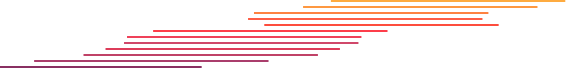
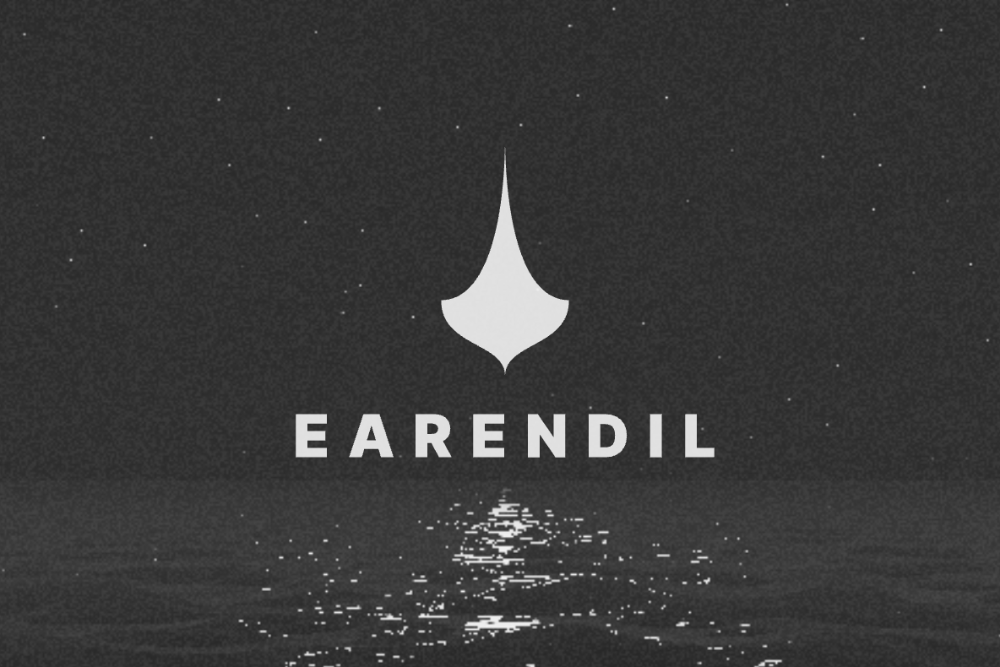

{ Mario Zechner } 
developer • coach • speaker

# 我已经妥协了
2026-3-25

真是个漂亮的 WebGL 着色器。看着它消耗你的电池电量呢。

---
目录

- [你为什么要这么做？](#你为什么要这么做)
  - [“就像诗歌，它是押韵的。” —— 伟大的 George Lucas](#就像诗歌它是押韵的--伟大的-george-lucas)
  - [“我告诉你我想要什么，我真正、真正想要的是什么” —— Spice Girls](#我告诉你我想要什么我真正真正想要的是什么--spice-girls)
  - [关于 “发狂的精灵”](#关于-发狂的精灵)
  - [但为什么是 Earendil？](#但为什么是-earendil)
- [这对 pi 来说意味着什么？](#这对-pi-来说意味着什么)
  - [机械层面](#机械层面)
  - [治理](#治理)
  - [开源性质](#开源性质)
- [总结](#总结)

---
嗯，这有点尴尬。
我已经加入了 Cristina、Jakob、Ramiz、Vegard、[Armin](https://lucumr.pocoo.org/) 和 Colin 所在的 [Earendil](https://earendil.com/) 。
而且我要把 [pi](https://pi.dev/) ——那个有所作为的小小编码智能体—— 一起带过去。

在你们拿出干草叉之前，请先听我说完。

## 你为什么要这么做？
原因有很多！让我给你上一堂 “简短” 的历史课。

### “就像诗歌，它是押韵的。” —— 伟大的 George Lucas
我从 2009 年左右开始做开源软件。
我的第一个 “成功故事” 是 [libGDX](https://libgdx.com/)，一个跨平台的游戏开发框架。
早在 2011 年，它风靡一时，是 Android 上使用最广泛的游戏开发框架。
libGDX 的一些著名用户包括 Niantic（Ingress 是用 libGDX 构建的，Pokemon Go 不是）以及 Slay the Spire 背后的团队。
它还驱动着 Spine，一个我参与了近 10 年的商业游戏开发工具。

我在 2016 年左右将大部分管理权移交给了优秀的核心贡献者团队，他们至今仍在很好地维护着这个项目。
我从未将 libGDX 商业化 —— 除非你把在其之上构建像 Spine 这样的专有软件也算作商业化。

零后悔，结果非常美好，它为我打开了许多扇门，也让我接触到了许多非常有趣（且友善）的人。
其中一些人我很自豪地称之为朋友。

libGDX 也让我接触到了由 Niklas Therning 和 Henric Müller 开发的、现已不复存在的 RoboVM。
RoboVM 是一个用于 iOS 上 JVM 代码的提前编译器和运行时，类似于（同样已不存在的）为 C# 做同样事情的 Xamarin。
Niklas 为 libGDX 创建了一个基于 RoboVM 的 iOS 后端，使 libGDX 用户能够轻松地将他们的游戏移植到 Apple 设备上。
他和 Henric 最终意识到 RoboVM 可能具有商业潜力，并围绕它建立了一家公司。
他们在早期就让我加入，并让我负责创建第一个商业、专有的附加组件：一个调试器。

一年之内，我们的团队又增加了 5 个人，最终几乎达到了与 Xamarin 功能相当的水平，包括一个基于 IntelliJ IDEA 的 IDE，使得跨平台移动开发变得相当愉快。
核心的 RoboVM 技术保持开源，而调试器、Xcode storyboard 集成以及其他花哨功能则是我们的商业产品。

然后 Miguel 和 Nat 找到了我们。
长话短说：我们把 RoboVM 卖给了 Xamarin。
不久之后，Xamarin 将我们开源的 RoboVM 核心闭源了，紧接着 Xamarin 被微软收购。
然后微软立刻关闭了 RoboVM。

虽然有一些金钱上的收益，但这件事从头到尾都他妈的糟透了。
作为 “开源 guy” ——那个曾为 RoboVM 仓库举办拉取请求竞赛、并兼职做大部分社区管理的人—— 我也成了那个必须撰写 “抱歉，不再开源了，傻瓜们” 博文的人。
你无法想象人们在社交媒体和邮件里是怎么骂我的，尽管我对局势完全没有控制权（我不是大股东）。
RoboVM 走向闭源是毁灭性的，这让我对 VC 支持的初创公司和开源都感到心灰意冷。
但最终，这些狗屁都不重要。

真正重要的是我们围绕 libGDX 和 RoboVM 建立的社区。
RoboVM 开源核心被闭源几天后，一小群 libGDX 贡献者 fork 了旧的 RoboVM 仓库并开始工作。
几天之内，libGDX 游戏就可以通过这个 fork 进行编译了。
几个月之内，他们就完全恢复了所有功能，包括调试器、Xcode 集成等等。
直到今天，libGDX 在 iOS 上仍然由这个名为 MobiVM 的 RoboVM fork 驱动。

我为什么要告诉你这些？
因为我想让你知道，在开源和商业化的这件事上，我他妈的见过不少风浪。
好的坏的都有。
一路上我学到了一些东西。我对此绝非轻率对待。

### “我告诉你我想要什么，我真正、真正想要的是什么” —— Spice Girls
也许你听说过那个叫做 [OpenClaw](https://openclaw.ai/) 的小应用。
OpenClaw 是由 pi 驱动的。
这让我成了 [Peter](https://steipete.me/) 成功的 “附带损害”。
尤其是在 Armin 认为在他的 [博客](https://lucumr.pocoo.org/2026/1/31/pi/) 上向全世界宣告 OpenClaw 和 pi 之间的关系是个好主意之后。

任何联系不上 Peter 的人都会来找我。
这个领域里你能想到的任何 VC 或大公司，都以这样或那样的方式敲过我的门。
我还与许多我敬仰的人通过电话，结果发现他们也是 pi 的用户。
过去的两个月里，我每天都要打 3 到 5 个电话。

我学到了一些东西。
我欧洲式的大脑认为 pi 只是我另一个小小的、还算有点用的开源项目，没有任何商业价值。
而我这个领域里的同行们似乎认为，它有一些特性使其在众多替代品中脱颖而出。
VC 和大公司们似乎认为 pi 具有商业价值。
有些人通过发送投资意向书或 “梦寐以求的工作” 邀请来展示他们的信念。

看到这么多的兴趣，看到越来越多的人用 pi 构建真实的东西，我内心有一部分想要更进一步。
这包括建立一个团队。这也包括以某种方式商业化来养活团队，同时不重蹈我在 RoboVM 经历过的那些狗屁事情。

但我也已经弄清楚了自己不想要什么。
我不想围绕 pi 建立自己的公司。
我们有一个四岁的孩子。
我想尽我所能地看着他、帮助他长大。
这首先就是我想要的。
其他一切都次于这个目标。
在过去的两个月里，他哭了很多次，因为 “爸爸不在这里”。
我永远、永远都不想再经历那种事情。

那么，如果我作为一家刚获得 VC 投资的初创公司的 CEO，我的职业生涯会是什么样子呢：
组建一个团队，可能找一个联合创始人，找到产品市场契合点，建立公司文化，解决团队内部的人际关系问题，踩遍沿途所有能踩到的地雷，感到孤独和压力山大，醒着的每一刻都担心如何让公司运转下去，对增加股东价值负有唯一责任，停止做技术，变成一个只会管理（又是管理）的无趣之人。

除此之外，这样一个完全专注于将 pi、而且只有 pi 商业化的 VC 资助的初创公司，将不得不做出一些决定，导致我重蹈在 RoboVM 经历过的那些狗屁。
找到理解这个领域的联合创始人和投资者极其困难。
尽管我对 VC 有一些经验，但我对自己选择一家与开源兼容的 VC 的能力没有信心。

与此相关的巨大压力并不是我追求的东西。
而且它将与我最大的愿望 ——帮助我们的孩子成长—— 相冲突。
然而，如果我不以某种方式尝试一下，我可能也会有巨大的遗憾。

所以，这就是我想要的：

- 陪伴我们的孩子，保持我们的生活方式，再也不要让我们的孩子因为 “工作” 而哭泣
- 通过组建一个小团队并添加商业化的顶层设计，使 pi 开源可持续，同时不违背开源精神和社区
- 不重复过去的错误

该怎么办，该怎么办呢？

### 关于 “发狂的精灵”
我想 Armin 和我第一次见面是在 14 年前，在 r/austria 这个 subreddit 上。
我们在很多政治问题上并不一致，他属于 “超级新自由主义者”，而我属于 “社会民主主义者”（至少根据我们彼此的印象来看是这样的）。
每当我看到那个 @mitsuhiko 的用户名出现在一个讨论串中，我就有一种冲动，想告诉网上的某人他们错了。

让 Armin 与其他网络喷子不同的地方在于，他在这些激烈讨论中的行为方式。
他从不情绪化，也从不咄咄逼人。
我们的讨论要么以友好的分歧结束，要么达成新的共识。
这在互联网上是极其罕见的。

我们最终在 2016 年的某个时候在 Vienna 线下见面了。
当时 Sentry 的办公室还处于初期阶段，年轻的 Daniel（在他加入 Sentry 之前曾与我在 Graz 共用过办公室）兴奋地带我参观他的新工作场所。

喝咖啡时，Armin 和我发现我们共同点比想象的要多。
不仅在政治立场上，也在我们看待软件、特别是开源的方式上。
在我的回忆里，我们从那天起就成了真正的朋友，尽管之后很多年我们都没有再线下见面。
但我们在网上继续互相逗弄，同时多了一份对彼此的欣赏。

同一天，我还去 Peter 在 Vienna 的办公室拜访了他。
他一边随意地烤着我见过的最大的牛排，一边和我们讨论彼此的生意进展。
典型的 Peter。

快进 9 年。
到了 2025 年 4 月。
Peter 在 Twitter 上彻底放飞自我，对着任何愿意听的人大喊：那些智能体，它们有用！
自然，Armin 和我都持怀疑态度，但我们各自订阅了 Claude Code，安装了最新的 CLI，然后……嗯。
好一阵子没睡觉了。相当长的一阵子。

五月，我们三个人最终聚在 Peter 位于 Vienna 的公寓里，一起构建了我们的第一个 “vibe slopped” 项目：VibeTunnel。
从那以后，我们不断实验，互相抛出想法，评论或修改彼此的技术博文，总的来说，线上和线下都玩得很开心。
旁观者最终给我们这种疯狂起了个名字：维也纳智能体编码学派。
我不是 Vienna 人，但我认了。

九月，Peter 在 Vienna 组织了第一次 Claude Code 匿名会，一个志同道合、夜不能寐的人的聚会。
那是我第一次见到 Colin。
他穿着看起来非常昂贵的鞋子，散发着 “金融人士” 的气质，但除此之外很平易近人。
我们以一种奇怪的坦诚方式聊了各自的生活，至少聊了一个小时 —— 考虑到在那之前我们只认识了 10 分钟。
回想起来，我觉得那有点像一次可爱的 “试探任务”：Colin 的任务可能就是来看看我们是否合拍。
从那时起，他和 Armin 就开始试图 “挖” 我。
很温和地。看来合拍度测试通过了。

不过当时我并不是很感兴趣。
我刚完成了 Sitegeist —— 一个浏览器智能体的工作，这让我很兴奋。
我觉得那会是一个不错的副业和收入来源，只是为了好玩，于是拒绝了他们的邀请。

我更频繁地去 Vienna，参加演讲、见面会，或者和家人一起去，通常最后都会以某种方式出现在 Earendil 的办公室。
Armin 和 Colin 会向我展示他们在 Elwing（一个邮件智能体）上的进展，并让我提前试用（然后弄坏它）。
他们各自创建了自己版本的 Elwing，结果很有趣。
在一次长时间的红队测试对话中，Colin 的 Elwing 开始失控。
从此它被称为 “发狂的精灵”。
后来它被解脱了（终止了），这让我有点难过。

在我去 Earendil 办公室拜访期间，我还认识了 Cristina，一位年轻的工程师，也是 Earendil 最早期的员工之一。
我们曾在某个时候进行过一次一对一的交流，我了解了她的背景。
原来，她通过某种指导关系与 Peter 有联系，她是一位才华横溢的工程师，也是个有趣的人。

我还成为了 Earendil 的早期（小额）投资人。
为什么不扔给一帮家伙一点钱，让他们在车库里买点漂亮的办公家具呢？
尤其是我每次去都能坐上那把二手 Herman Miller 椅子？
太划算了。

然后 Peter 决定在 pi 之上构建 Warelay/Claudebot/Moltbot/OpenClaw，OpenClaw 迅速爆红，Armin 写了那篇博文，告诉所有人 pi 在 OpenClaw 中的角色，然后我接到了很多电话（见上文）。

我让 Armin 和 Colin 了解情况，向他们寻求建议。
直到二月的某个命运般的日子，他们亲自打电话给我提出了一个 offer。
干得漂亮，伙计们，你们掌握了所有内部信息来设计一个很好的交易。

对我来说，交易通常是一件非常枯燥、机械的事情。
但如果涉及到朋友，就会变得困难。
如果说这对我们三个人来说不是一场情感上的挣扎，那我是在撒谎。
但我认为这实际上很有价值。
我们得以测试我们三个人在压力下如何合作。
我看到了 Colin 的工作方式。
我们也设定了预期。
最终，我们达成了协议。

### 但为什么是 Earendil？
嗯，上面那堆的文字应该能让你有所了解。
但让我明确地说出来。

Armin 在开源及其商业化方面有着良好的记录。
他深刻理解这种结合所带来的动态关系和微妙界限。
和我一样，他认为开源和开放协议是必需品，而不仅仅是给企业猪涂的口红。
我们通过 VibeTunnel、互相评论彼此的想法、通过 pi、以及一起上播客，在 “维也纳智能体编码学派” 的名义下进行了松散的合作。
我们在个人层面和技术层面都很合拍。

Colin 作为一个前金融人士还算相当不错。
他有很好的产品 sense，并且不怕（用垃圾代码）弄脏自己的手。
他也知道如何处理初创公司中所有我不想碰的部分。
我们在个人层面很合拍。
不过，他和他的智能体们永远不会获得 pi 仓库的写权限。

在我们达成协议之前，我看到了 Cristina、Jakob、Ramiz、Vegard 在办公室、在 Earendil 的 Discord 上、以及在 GitHub 仓库中的工作状态。
虽然他们每个人都有（某种程度上的）专业背景，但实际上他们都是通才。
而且都是有很好幽默感的好人。
我也倾向于认为我们很合拍。
但这也可能只是孩子们在互联网上对奇怪的老爷爷友善，容忍他糟糕的笑话。
无论如何，这些孩子们都不错。

那些早期投资者都不在我心目中的 “坏名单”上，恰恰相反。
其中一些我认识本人。
他们中的许多人在开发者工具领域有经验。
我非常有信心，他们会恰到好处地做到 “让他们自己去做” 和 “根据我们的观点和经验，这里有一些真正有用的反馈” 之间的平衡。

Earendil 的产品是构建在 pi 之上的。
这给了我关于 pi 中哪些功能有效、哪些无效的额外信号。
最终，一些 Earendil 的团队成员会在我监督和指导下帮助 pi 的工作。
反过来，我也能为面向消费者的产品做出贡献。
这对我来说是相当新的事情，因为我一直以来更多地是在面向技术人群的开发者工具这一侧。

尽管其名字源自 Tolkien，但 Earendil 并不是一家有法西斯倾向的科技公司。
恰恰相反。在我看来，他们基本上是善意的嬉皮士，认为软件，尤其是 AI，应该服务于人类，而不是反过来。
在他们看来，软件不应该取代人类，而应该赋能人类。
像许多公司一样，他们有一个章程概述了他们的价值观。
我为这个章程贡献了一小部分。
我认同它，尽管我那颗脾气暴躁、冷酷的老心仍然需要时间去适应那种 “Kumbaya” 式的措辞。

如果你和我一样是个愤世嫉俗的老人，你会翻个白眼说：章程一文不值。
我们以前见过这些：“不作恶”、“开发者，开发者，开发者” 等等。
我同意。

但我倾向于认为我没有误判 Earendil 的人。
我见过他们工作，也见过他们作为普通人的一面。
而且我与 Armin 有共同的过往。
所有这些都让我非常有信心，Earendil 不会做出什么超级超级蠢的事情。
因为这既会伤害 Earendil，也会伤害 Armin 的声誉。
而作为最后的手段，任何能点击 GitHub 上那个按钮的人都可以 fork pi —— 就像 libGDX 的人们对 RoboVM 所做的那样。

最后，也是对我最重要的一点：团队里几乎每个人都有孩子。
而 Earendil 这家公司也因此对此非常在意。

## 这对 pi 来说意味着什么？
这块 “派” 有多个层面。
你懂我的意思吧？

### 机械层面
GitHub 仓库将从 `badlogic/pi-mono` 转移到 `earendil-works/pi` 。
我们希望 GitHub 能设置重定向，这样现有的链接和克隆不会失效。
这一点待定。

同样，包名将从 @mariozechner/pi-coding-agent 变更为 @earendil/pi。
我们也会在这里设置某种形式的重定向。

pi.dev 仍然是 pi 的家。
它会在现有内容旁边加上一个 Earendil 的标志。
仅此而已。

Discord 保持原样。
它是一个社区的共同努力，而不是 Earendil 的资产。
我会像以前一样，有时间时继续在那里回答问题。

### 治理
pi 归 Earendil 公司所有。
我是 Earendil 的股东，并与 Armin 和 Colin 一起负责所有 pi 的决策。
包括技术方向、路线图、哪些合并、哪些不合并、哪些开源、哪些不开源。

外部贡献的流程与现在完全一样。
没有 CLA，没有 DCO，没有新的繁琐流程。
你开一个 PR，我审查它，然后我们继续推进。

pi 的名称和标志由 Earendil 注册商标。
当你看到 pi 时，它就是一个由我掌舵的 Earendil 产品。
这与 Mozilla、Linux 等采用的方式相同。
商标是我们的主要保护机制，而不是许可证技巧。

开源项目的周末和假期休更模式将继续存在，直至我们找到新方式，解决智能体批量产出劣质低质内容这一发展瓶颈。
一旦我们吸纳了一些值得信赖的个人作为贡献者，这些停工休更的频率可能会降低。
目前我仍然不信任任何人，因为每个人都在不经深思熟虑地随意挥舞他们的 clanker。

### 开源性质
pi 采用 MIT 许可证。
它将一直保持 MIT 许可证。
你可以使用它、fork 它、在其之上构建产品、销售这些产品。
一切不变。

在 MIT 核心之上，随着时间的推移会有一些商业化的附加组件。
我们将其分为三个层级来考虑：

1. **MIT（核心）**：你所了解的 pi。永远 MIT。没得商量。
2. **Fair Source（增值功能）**：未来的一些商业功能将采用 Fair Source (公平开源) 许可证。
免费使用，源码可见，并且在设定的期限后通过延迟开源发布模式转换为完全开源。
可以把它看作是延迟开放的开源，也是为你作为用户提供的下行风险保护。
3. **Proprietary（企业级）**：一些企业级特定功能和云基础设施将是专有的。
源码不可见。
这些是用来为第 1 和第 2 层级的东西买单的。

我们还没有构建第 2 和第 3 层级。
当我们构建时，你会知道的。
要更深入了解许可证理念，请阅读 [Armin 关于 pi 许可的博文](https://rfc.earendil.com/0015/) 。

如果你觉得我们偏离了正轨，GitHub 上的 fork 按钮仍然有效。
永远有效。

## 总结
我很高兴过去的两个月终于过去了。
我想我为 pi 找到了一个好归宿，有优秀的人帮助我照看它。
成为一个构建面向消费者产品的团队的一员，对我来说是新领域，我真心期待。

不必独自一人扛着这一切，感觉真好。

诚挚地， 
Pidalf

阅读 Armin 的想法：https://lucumr.pocoo.org/2026/4/8/mario-and-earendil/

阅读 Colin 的想法：https://www.foggynotions.day/
