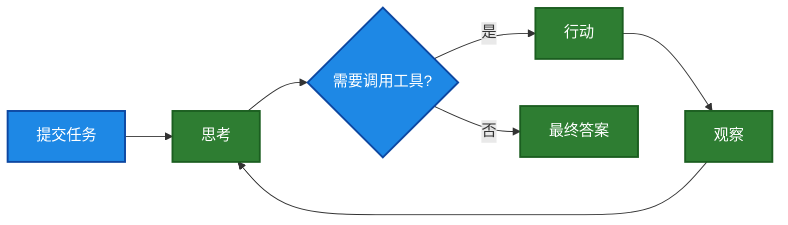

# 编码智能体的组成部分
*编码智能体 (coding agent) 如何借助工具、记忆与仓库上下文 (repo context)，让 LLM 在实际应用中发挥更佳效果*

2026/4/4 [原文](https://magazine.sebastianraschka.com/p/components-of-a-coding-agent)

</br>
[Sebastian Raschka, PhD](https://substack.com/@rasbt)

---
在本文中，我将介绍编码智能体与智能体管控框架的整体设计：它们是什么、如何运作，以及各部分在实际应用中如何协同工作。
读过我的 Build a Large Language Model (From Scratch) 与 Build a Large Reasoning Model (From Scratch) 这两本书的读者经常向我询问有关智能体的问题，因此我认为撰写一篇可供参考的文章会很有帮助。

总而言之，智能体之所以成为重要议题，是因为近期 LLM 在实际应用中的诸多进展，不仅源于模型本身的优化，更在于我们使用模型的方式。
在许多真实场景中，工具使用、上下文管理、记忆机制等配套系统，与模型本身起着同等关键的作用。
这也解释了为何 Claude Code 、Codex 这类系统，会比在普通聊天界面中使用相同模型时，能力表现显著更强。

在本文中，我将阐述构成编码智能体的六大核心组件。

## Claude Code、Codex CLI 及其他编码智能体
你或许对 Claude Code 或 Codex CLI 并不陌生。
但为了先做好铺垫，需要说明的是，它们本质上属于智能编码工具，通过在 LLM 外层封装应用层 —— 也就是所谓的智能体工具链 (agentic harness)，使其在编码任务中更易用、性能更出色。


</br>
*图 1：Claude Code CLI, Codex CLI、，以及我的 [Mini Coding Agent](https://github.com/rasbt/mini-coding-agent) 。*

<ins>编码智能体是为软件开发工作而设计的，其核心亮点不仅在于模型选型，还在于整套配套系统，
包括代码库上下文 (repo context)、工具设计 (tool design)、提示词缓存稳定性 (prompt-cache stability)、记忆机制以及长会话连续性</ins>。

这一区分至关重要，因为当人们谈论 LLM 的编码能力时，往往会把模型本身、推理行为与智能体产品混为一谈。
不过在深入讲解编码智能体的细节之前，我先简要补充一些背景，说明几个更宏观概念之间的差异：LLM、推理模型 (reasoning models)与智能体。

## LLM、推理模型与智能体之间的关系
LLM 是下一个 token 预测模型的核心。
<ins>推理模型 (reasoning model) 仍然是 LLM，但通常经过专项训练或提示，使其在推理阶段投入更多算力，用于中间步骤推理、答案验证或候选结果检索</ins>。

<ins>智能体则是构建在模型之上的一层（软件），可理解为围绕模型的控制闭环 (control loop)</ins>。
通常情况下，针对一个目标，智能体层（或称工具链）会决定下一步需要查看什么、调用哪些工具、如何更新自身状态，以及何时终止任务等。

简单来说，三者关系可以这样理解：
LLM 是发动机，推理模型是经过强化的发动机（性能更强，但使用成本更高），而智能体工具链 (agent harness) 则帮助我们驾驭模型。
这个比喻并非完美无缺，因为我们也可以将普通与推理 LLM 作为独立模型使用（如在聊天界面或 Python 会话中），但我希望它能传达出主要的观点。

</br>
*图 2：传统 LLM、推理 LLM（或称推理模型），以及封装在智能体管控框架中的 LLM 之间的关系。*

换句话说，智能体是在某个环境中反复调用模型的系统。

简而言之，我们可以这样概括：
- LLM ：原始模型
- 推理模型 (reasoning model)：经过优化、可输出中间推理过程并能进行更多自我验证的 LLM
- 智能体 (agent)：一个闭环 (loop)，通过使用模型并结合工具、记忆与环境反馈完成任务
- 智能体工具链 (agent harness)：包裹在智能体外的软件框架，用于管理上下文、工具调用、提示词、状态与控制流
- 编码工具链 (coding harness)：智能体工具链的一个特定应用实例，即面向软件工程的专用工具链，负责管理代码上下文、工具、代码执行与迭代反馈

如上所列，在智能体和编码工具的语境下，我们还有两个流行的术语：
*智能体工具链 (agent harness)* 和 *编码工具链 (coding harness)* 。
编码工具链是围绕模型的软件框架，帮助模型有效地编写和编辑代码。
而智能体工具链则更宽泛，不特定于编码（例如，想想 OpenClaw）。
Codex 和 Claude Code 可以被视为编码工具链。

总而言之，<ins>更优秀的 LLM 能为推理模型（需要额外训练）提供更好的基础，而工具链则能进一步挖掘推理模型的潜力</ins>。

<ins>诚然，LLM 与推理模型即便没有工具链加持，也能独立完成编码任务，但编码工作并非只有下一 token 生成这一环</ins>。
很大一部分工作涉及代码库导航、检索、函数查找、差异应用、测试执行、错误排查，以及在上下文中维护所有相关信息。
（程序员们应该都懂，这是一项高强度的脑力工作，这也是我们在编码时不希望被打扰的原因。）

</br>
*图 3. 编码工具链由三层组成：模型家族、智能体闭环与运行时支持。
模型提供 “引擎”，智能体闭环驱动迭代式问题求解，运行时支撑则提供基础配套设施。
在闭环内部，“observe” 从环境中收集信息，“inspect” 分析该信息，“choose” 选定下一步操作，“act” 付诸实施。*

<ins>这里的核心要点是：优秀的编码工具链能让推理型模型与非推理型模型的表现，远强于在普通聊天界面中的效果，因为它在上下文管理等诸多方面提供了辅助</ins>。

## 编码工具链 (Coding Harness)

如上一节所述，当我们提到工具链（harness）时，通常指的是模型周围的软件层，
它负责组装提示词、暴露工具、跟踪文件状态、应用编辑、运行命令、管理权限、缓存稳定的前缀、存储记忆，以及许多其他功能。

如今，在使用 LLM 时，相比于直接对模型进行提示词或使用网页聊天界面（后者更接近于 “带着上传文件进行聊天”），这一层塑造了绝大部分的用户体验。

在我看来，如今各类 LLM 的基础版本能力都十分接近（比如 GPT-5.4、Opus 4.6、GLM-5 等的基础版本），
因此工具链往往就成了决定一个 LLM 表现优于另一个的关键差异因素。

这是推测性的，但我怀疑，如果我们把最新、能力最强的开源权重 LLM 之一（如 GLM-5）放入一个类似的工具链中，
它的表现很可能与 Codex 中的 GPT-5.4 或 Claude Code 中的 Claude Opus 4.6 不相上下。
尽管如此，一些针对特定工具链的后训练通常是有益的。
例如，OpenAI 历史上曾维护着独立的 GPT-5.3 和 GPT-5.3-Codex 变体。

在下一节中，我将结合我的 Mini Coding Agent，更具体地讲解编码工具链的核心组件：https://github.com/rasbt/mini-coding-agent 。

</br>
*图 4：编码智能体/编码工具链的主要工具链功能，将在后续章节中详细讨论。*

顺便说明，为简便起见，本文中我会交替使用 “编码智能体 (coding agent)” 和 “编码工具链 (coding harness)” 这两个术语。
（严格来说，智能体是由模型驱动的决策循环，而工具链是提供上下文、工具与执行支持的外围软件架构。）

</br>
*图 5：极简但功能完整、从零实现的 [Mini Coding Agent](https://github.com/rasbt/mini-coding-agent/blob/main/mini_coding_agent.py) （纯 Python 实现）*

以下是编码智能体的六大核心组件。
你可以查看我这款极简但功能完备、从零实现的 [Mini Coding Agent](https://github.com/rasbt/mini-coding-agent/blob/main/mini_coding_agent.py) （纯 Python 实现）的源代码，获取更具体的代码示例。
代码中通过注释标注了下面将要讨论的六个组件：

```Python
##############################
#### Six Agent Components ####
##############################
# 1) Live Repo Context -> WorkspaceContext
# 2) Prompt Shape And Cache Reuse -> build_prefix, memory_text, prompt
# 3) Structured Tools, Validation, And Permissions -> build_tools, run_tool, validate_tool, approve, parse, path, tool_*
# 4) Context Reduction And Output Management -> clip, history_text
# 5) Transcripts, Memory, And Resumption -> SessionStore, record, note_tool, ask, reset
# 6) Delegation And Bounded Subagents -> tool_delegate
```

*「译注：智能体六大组件」*
- *1) 实时代码库上下文 -> WorkspaceContext*
- *2) 提示词构建与缓存复用 -> build_prefix, memory_text, prompt*
- *3) 结构化工具、校验与权限 -> build_tools, run_tool, validate_tool, approve, parse, path, tool_*
- *4) 上下文缩减与输出管理 -> clip, history_text*
- *5) 会话记录、记忆与恢复 -> SessionStore, record, note_tool, ask, reset*
- *6) 委托与有界子智能体 -> tool_delegate*

## 1. 实时代码库上下文
这或许是最直观的组件，却也是最为重要的组件之一。

当用户下达 “修复测试” 或 “实现某某功能” 的指令时，模型应当知晓当前是否处于 Git 代码库中、所处分支、哪些项目文档可能包含相关说明等信息。

原因在于，这些细节往往会改变或影响正确的执行操作。
例如，“修复测试” 并非一条自包含 (self-contained) 的指令。
若智能体能读取 AGENTS.md 或项目 README 文件，便可得知该运行哪条测试命令等信息。
若它知晓代码库根目录与结构布局，就能精准查找目标位置，而非盲目猜测。

此外，Git 分支、状态信息与提交信息，也能进一步提供上下文，帮助了解当前正在进行的修改内容以及工作重心所在。

</br>
*图 6：智能体工具链 (agent harness) 首先会生成一份精简的工作区 (workspace) 摘要，将其与用户请求结合，为模型补充额外的项目上下文信息。*

<ins>核心要点在于：编码智能体 (coding agent) 在执行任何任务前，会预先收集相关信息
（以工作区摘要的形式呈现 “稳定事实 (stable facts)”），从而避免每次接收提示时都从零开始、缺乏上下文</ins>。

## 2. 提示词构建与缓存复用
当智能体获取代码库视图后，接下来要解决的问题是如何将这些信息输入模型。
上图展示了简化流程（ `Combined prompt: prefix + request` ），
<ins>但在实际应用中，如果每次处理用户查询时，都重新拼接并处理工作区摘要，会造成较大的资源浪费</ins>。

<ins>也就是说，编码会话具有重复性，智能体的运行规则通常保持不变，工具描述通常也保持不变。
就连工作区摘要大多时候也（基本）不会改动。
主要发生变化的通常是最新的用户指令、近期对话记录 (transcript)，以及可能的短期记忆</ins>。

“智能” 的运行时不会在每一轮都将所有内容重新构建为一个巨大的无差别提示词，如下图所示。

</br>
*图 7：智能体工具链 (agent harness) 构建稳定的提示词前缀 (stable prompt prefix)，加入动态变化的会话状态，随后将组合后的提示词输入模型。*

与 [第 1 节](#1-实时代码库上下文) 的主要区别在于，[第 1 节](#1-实时代码库上下文) 关注的是收集代码库的事实信息。
而在这里，我们关心的是如何有效地打包和缓存这些事实信息，以便在多次模型调用中重复使用。

<ins>“稳定的提示词前缀” 中 “稳定"  意味着其中包含的信息不会有太大变化。
它通常包含通用指令、工具描述和工作区摘要。
如果没有什么重要的内容发生变化，我们不想浪费计算资源在每次交互中都从头重建它</ins>。

其他组件更新的频率更高（通常是每一轮都会更新）。
这些组件包括短期记忆、最近的对话记录以及最新的用户请求。

<ins>简而言之，关于 “稳定的提示词前缀” 的缓存方面，核心就是一个智能的运行时会尝试复用那部分内容</ins>。

## 3. 工具调用与使用
工具访问和工具使用是让体验开始从 “聊天 ”转变为智能体的关键所在。
*<ins>「译注：LLM 怎么知道什么时候该调用什么工具？接收任务后，LLM 会进行思考，思考后就会采取行动，调用工具，参考下图」</ins>*



一个普通的模型可以用文字来建议命令，但编码工具链中的 LLM 应该做更聚焦、更有用的事情，并且能够实际执行命令并获取结果
（而不是我们自己手动调用命令，再将结果粘贴回聊天框）。

但是，工具链通常不会让模型自由发挥任意语法，而是提供一个预定义的、允许使用的命名工具列表，这些工具具有明确的输入和清晰的边界。
（当然，像 Python 的 `subprocess.call` 之类的东西也可以包含在其中，这样智能体也能执行任意广泛的 shell 命令。）

工具使用的流程如下图所示。

</br>
*图 8：模型发出一个结构化动作 (structured action)，工具链对其进行校验，请求批准(可选)，执行该动作，然后将受限的结果反馈回闭环中。*

为了说明这一点，下面是一个示例，展示在我的 Mini Coding Agent 中这通常对用户呈现的样子。
（它不像 Claude Code 或 Codex 那样美观，因为它非常精简，使用的是纯 Python，没有任何外部依赖。）

</br>
*图 9：Mini Coding Agent 中工具调用批准请求的示意图。*

<ins>在这里，模型必须选择工具链能够识别的动作，例如列出文件、读取文件、搜索、运行 shell 命令、写入文件等。
它还必须以工具链能够检查的形式提供参数</ins>。

<ins>因此，当模型要求做某事时，运行时可以停下来并执行程序化检查，例如</ins>：

- “这是已知的工具吗？”
- “参数有效吗？”
- “这需要用户批准吗？”
- “请求的路径是否在工作区内？”

只有当这些检查都通过后，才会有实际的操作被执行。

<ins>当然，运行编码智能体确实存在一定的风险，但工具链的检查也能提高可靠性，因为模型无法执行完全随意的命令</ins>。

<ins>此外，除了拒绝格式错误的操作和设置审批关口之外，通过检查文件路径，文件访问也可以被限制在代码库内部</ins>。

从某种意义上说，工具链虽然在减少模型的自由度，但同时也提高了可用性。

## 4. 最小化上下文膨胀
上下文膨胀并非编码智能体独有的问题，而是 LLM 普遍面临的问题。
当然，如今 LLM 支持的上下文越来越长
（我最近也写过关于 [注意力变体](https://magazine.sebastianraschka.com/p/visual-attention-variants) 的文章，这些变体使其在计算上更可行），
但长上下文仍然昂贵，并且也可能引入额外的噪音（如果存在大量不相关信息）。

| | |
|---|---|
|| [A Visual Guide to Attention Variants in Modern LLMs](https://magazine.sebastianraschka.com/p/visual-attention-variants) </br> [Sebastian Raschka, PhD](https://substack.com/@rasbt) . 3月22日</br> [阅读全文](https://magazine.sebastianraschka.com/p/visual-attention-variants)|

编码智能体在多轮对话中比普通 LLM 更容易受到上下文膨胀的影响，原因在于重复的文件读取、冗长的工具输出、日志等。

<ins>如果运行时将所有内容都完全保留，很快就会耗尽可用的上下文 token。
因此，一个好的编码工具链在处理上下文膨胀方面通常比普通聊天界面（仅仅截断或总结信息）要复杂得多</ins>。

<ins>从概念上讲，编码智能体中的上下文压缩机制可以概括为下图所示</ins>。
具体来说，我们将进一步放大上一节图 8 中的 clip（第 6 步）部分。

</br>
*图 10：大输出被截断，较早的读取内容被去重，对话记录在重新进入提示词之前被压缩。*

<ins>一个最小化的工具链至少使用两种压缩策略来管理这个问题</ins>。

第一种是截断，它缩短长文档片段、工具的大量输出、记忆笔记 (memory notes) 和对话记录条目 (transcript entries)。
换句话说，它防止任何一段文本仅仅因为恰好冗长就占用了过多的提示词预算。

第二种策略是对话记录精简或摘要，它将完整的会话历史（下一节会有更多介绍）转化为一个更小的、可用于提示词的摘要。

<ins>这里的一个关键技巧是，让近期的事件保留更丰富的信息，因为它们更可能与当前步骤相关。
而对于较旧的事件，我们则进行更积极的压缩，因为它们可能关联性更低</ins>。

此外，我们还会对较早的文件读取进行去重，这样模型就不会仅仅因为会话早期多次读取了同一个文件，而反复看到相同的内容。

总体而言，我认为这是优秀编码智能体设计中一个被低估的、枯燥的部分。
<ins>很多表面上的 “模型质量”，实际上就是上下文质量</ins>。

## 5. 结构化会话记忆
在实践中，这里讨论的所有 6 个核心概念都是高度交织的，不同的章节和图表以不同的侧重点或缩放层次来涵盖它们。
在上一节中，我们讨论了提示词运行时如何使用历史记录，以及我们如何构建一个紧凑的对话记录。
上面的问题是：在下一轮对话中，应该将多少过去的信息送回模型？
因此，其重点是压缩、截断、去重和时效性。

而本节关于结构化会话记忆 (structured session memory)，则关注的是历史记录的存储时结构。
<ins>这里的问题是：智能体随着时间的推移会保留哪些内容作为持久记录 (permanent record) </ins>？
因此，其重点是运行时 (runtime) 保留一份更完整的对话记录作为持久状态，同时还有一个更轻量的记忆层，后者规模更小，会被修改和压缩，而不是仅仅被追加。

总而言之，编码智能体将状态（至少）分为两层：

- **工作记忆**：智能体显式保留的、经过提炼的小型状态。
- **完整会话记录**：包含所有用户请求、工具输出与 LLM 回复

</br>
*图 11：新事件会追加到完整会话记录中，并在工作记忆中进行总结。磁盘上的会话文件通常以 JSON 格式存储。*

上图展示了两类主要的会话文件：完整会话记录与工作记忆，它们通常以 JSON 格式存储在磁盘上。
如前所述，完整会话记录 (full transcript) 保存了全部历史信息，即使关闭智能体也可恢复会话。
工作记忆 (working memory) 则更像是提炼后的版本，仅保留当前最为关键的信息，工作记忆与精简会话记录 (compact transcript) 有一定关联。

<ins>但精简会话记录 (compact transcript) 与工作记忆的作用略有不同。
精简会话记录用于提示词重构，其作用是为模型提供压缩后的近期历史视图，
使其无需在每轮都查看完整会话记录 (full transcript) 即可继续对话。
工作记忆则更侧重于任务连续性，用于跨轮次维护一份小型、显式管理的摘要，例如当前任务、重要文件与近期记录等</ins>。

按照上图中的第 4 步，最新的用户请求、LLM 回复以及工具输出，
会在下一轮中作为 “新事件” 同时记录到完整会话记录 (full transcript) 与工作记忆 (working memory) 中；
为避免图表过于繁杂，这一过程并未在图中画出。

## 6. 使用（有界）子智能体进行委托
一旦智能体拥有工具和状态，下一个有用的能力之一就是委托。

<ins>其原因是，这使我们能够通过子智能体将某些工作并行化为子任务，从而加快主任务的速度</ins>。
例如，主智能体可能正在处理一个任务的中途，但仍需要一个侧面的答案，比如哪个文件定义了一个符号、配置文件说了什么、或者为什么某个测试失败了。
将其拆分为一个有界 (bounded) 的子任务，而不是强迫一个循环同时承载所有的工作线程，是很有用的。
*<ins>「译注：子智能体是怎么产生的？是 LLM 推理后得出的结论，通过子智能体，调用一个工具来收集相关信息。」</ins>*

（在我的 Mini Coding Agent 中，实现更简单，子任务仍然是同步运行的，但其基本思想是相同的。）

一个子智能体只有在继承了足够的上下文来完成实际工作时才是有用的。
但如果我们不对其进行限制，我们就会有多个智能体重复工作、触碰相同的文件，或者生成更多的子智能体，等等。

因此，棘手的设-计问题不仅在于如何生成一个子智能体，还在于如何为其设定边界。

</br>
*图 12：子智能体继承足够的上下文以发挥作用，但其运行边界比主智能体更为严格。*

<ins>这里的技巧在于，子智能体继承的上下文既要足够有用，又要受到约束（例如，只读模式以及限制递归深度）</ins>。

Claude Code 很早就支持子智能体，而 Codex 最近也增加了这一功能。
Codex 通常不会强制子智能体进入只读模式。
相反，它们通常继承主智能体的大部分沙箱和审批设置。
因此，边界更多是关于任务范围、上下文和深度方面的限制。

## 组件总结
上述部分试图涵盖编码智能体的主要组件。
如前所述，它们在实现中或多或少是深度交织在一起的。
然而，我希望通过逐一介绍这些组件，能够帮助大家建立起关于编码工具链如何工作的整体思维模型 (mental model)，以及为什么与简单的多轮聊天相比，它们能让 LLM 变得更加有用。

</br>
*图 13：前文所述编码工具链 (coding harness) 的六大核心功能。*

如果你希望看到这些功能以简洁、极简的 Python 代码实现，你可能会喜欢我的 [Mini Coding Agent](https://github.com/rasbt/mini-coding-agent) 。

## 这与 OpenClaw 相比如何？
OpenClaw 可能是一个有趣的比较对象，但它与编码工具链并不完全是同一类系统。

OpenClaw 更像是一个本地的通用智能体平台，它也能进行编码，而不是一个专门的（终端）编码助手。

它与编码工具链仍然存在若干重叠之处：

- 它使用工作区中的提示词和指令文件，例如 AGENTS.md、SOUL.md 和 TOOLS.md
- 它保存 JSONL 会话文件，并包含对话记录压缩和会话管理功能
- 它可以生成辅助会话和子智能体
- 等等。

然而，如上所述，二者的侧重点不同。
编码智能体针对的是一个人在代码库中工作，并要求编码助手高效地检查文件、编辑代码和运行本地工具的场景。
而 OpenClaw 则更侧重于在多个聊天、多个渠道和多个工作区之间运行许多长期存在的本地智能体，编码只是其中一项重要的工作。

---

我很高兴地宣布，我已完成《Build A Reasoning Model (From Scratch)》一书的撰写，目前所有章节均已开放抢先阅读。
出版商正在进行版式设计工作，本书预计将于今年夏季正式上市。

这或许是我迄今为止最具雄心的一部作品。
我花费了大约一年半的时间进行创作，书中融入了大量实验研究。
无论是投入的时间、精力，还是在内容打磨上的用心，它都算得上是我最为倾力的一本书，希望你能喜欢。

</br>
*《Build a Reasoning Model (From Scratch)》将在 [Manning](https://mng.bz/Nwr7) 及 [Amazon](https://amzn.to/4aAKiFY) 发售。*

主要话题包括：
- 评估推理模型
- 推理时扩展
- 自我精炼
- 强化学习
- 蒸馏

关于 LLM 中的 “推理” 有很多讨论，我认为理解它在 LLM 上下文中真正含义的最佳方式，就是从头开始实现一个！
- [Amazon](https://amzn.to/4aAKiFY) （预购）
- [Manning](https://mng.bz/Nwr7) （全书 [抢先阅读](https://mng.bz/Nwr7)，版式终稿前版本，共 528 页）

