# 编码智能体的组成部分
*编码智能体 (coding agent) 如何借助工具、记忆与仓库上下文 (repo context)，让 LLM 在实际应用中发挥更佳效果*

2026/4/4 [原文](https://magazine.sebastianraschka.com/p/components-of-a-coding-agent)

</br>
[Sebastian Raschka, PhD](https://substack.com/@rasbt)

---
在本文中，我将介绍编码智能体与智能体管控框架的整体设计：它们是什么、如何运作，以及各部分在实际应用中如何协同工作。
读过我的 Build a Large Language Model (From Scratch) 与 Build a Large Reasoning Model (From Scratch) 这两本书的读者经常向我询问有关智能体的问题，因此我认为撰写一篇可供参考的文章会很有帮助。

总而言之，智能体之所以成为重要议题，是因为近期 LLM 在实际应用中的诸多进展，不仅源于模型本身的优化，更在于我们使用模型的方式。
在许多真实场景中，工具使用、上下文管理、记忆机制等配套系统，与模型本身起着同等关键的作用。
这也解释了为何 Claude Code 、Codex 这类系统，会比在普通聊天界面中使用相同模型时，能力表现显著更强。

在本文中，我将阐述构成编码智能体的六大核心组件。

## Claude Code、Codex CLI 及其他编码智能体
你或许对 Claude Code 或 Codex CLI 并不陌生。
但为了先做好铺垫，需要说明的是，它们本质上属于智能编码工具，通过在 LLM 外层封装应用层 —— 也就是所谓的智能体管控框架，使其在编码任务中更易用、性能更出色。


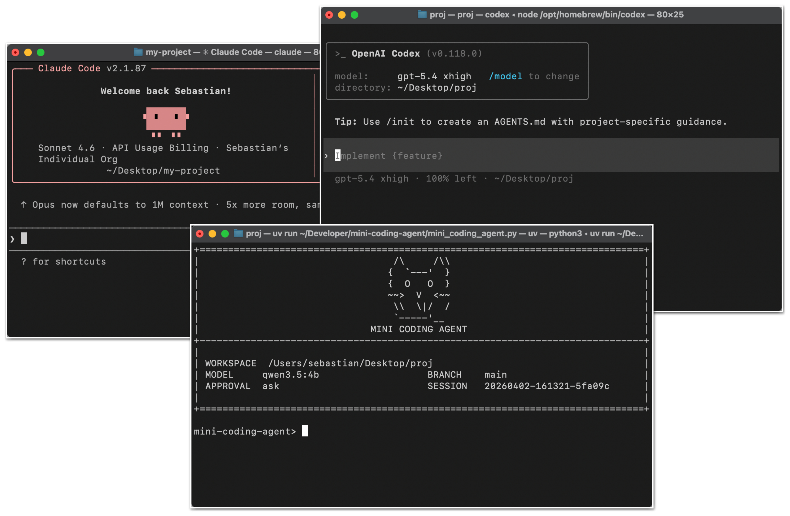</br>
*图 1：Claude Code CLI, Codex CLI、，以及我的 [Mini 编码智能体](https://github.com/rasbt/mini-coding-agent) 。*

编码智能体是为软件开发工作而设计的，其核心亮点不仅在于模型选型，还在于整套配套系统，
包括代码仓库上下文 (repo context)、工具设计 (tool design)、提示词缓存稳定性 (prompt-cache stability)、记忆机制以及长会话连续性。

这一区分至关重要，因为当人们谈论 LLM 的编码能力时，往往会把模型本身、推理行为与智能体产品混为一谈。
不过在深入讲解编码智能体的细节之前，我先简要补充一些背景，说明几个更宏观概念之间的差异：LLM、推理模型与智能体。

## LLM、推理模型与智能体之间的关系
LLM 是下一个词元预测模型的核心。
推理模型仍然是 LLM，但通常经过专项训练或提示，使其在推理阶段投入更多算力，用于中间步骤推理、答案验证或候选结果检索。

智能体则是构建在模型之上的一层架构，可理解为围绕模型的控制循环系统 (control loop)。
通常情况下，针对一个目标，智能体层（或称管控框架）会决定下一步需要查看什么、调用哪些工具、如何更新自身状态，以及何时终止任务等。

简单来说，三者关系可以这样理解：
LLM 是发动机，推理模型是经过强化的发动机（性能更强，但使用成本更高），而智能体管控框架 (agent harness) 则帮助我们驾驭模型。
这个比喻并非完美无缺，因为我们也可以将普通与推理 LLM 作为独立模型使用（如在聊天界面或 Python 会话中），但希望它能传达出核心要义。

</br>
*图 2：传统 LLM、推理 LLM（或称推理模型），以及封装在智能体管控框架中的 LLM 之间的关系。*

换句话说，智能体是在环境中反复调用模型的系统。

简而言之，我们可以这样概括：
- LLM ：基础原始模型
- 推理模型：经过优化、可输出中间推理过程并能进行更多自我验证的 LLM
- 智能体：一个循环系统，通过调用模型并结合工具、记忆与环境反馈完成任务
- 智能体管控框架 (agent harness)：包裹在智能体外的软件架构，用于管理上下文、工具调用、提示词、状态与控制流
- 编码管控框架 (coding harness)：agent harness 的一个特定应用实例，即面向软件工程的专用管控框架，负责管理代码上下文、工具、代码执行与迭代反馈

如上所述，在智能体与编码工具的语境中，还有两个常用术语：
智能体管控框架 (agent harness) 与智能编码管控框架 (agentic coding harness)。
编码管控框架是围绕模型搭建的软件架构，帮助模型高效编写和修改代码。
而智能体管控框架的范畴更广，并非专门针对编码场景（例如 OpenClaw）。
Codex 和 Claude Code 都可以视作编码管控框架。

总而言之，更优秀的 LLM 能为推理模型（需要额外训练）提供更好的基础，而管控框架则能进一步挖掘推理模型的潜力。

诚然，LLM 与推理模型即便没有管控框架加持，也能独立完成编码任务，但编码工作并非只有下一词元生成这一环。
很大一部分工作涉及代码库导航、检索、函数查找、差异应用、测试执行、错误排查，以及在上下文中维护所有相关信息。
（程序员们应该都懂，这是一项高强度的脑力工作，这也是我们在编码时不希望被打扰的原因。）

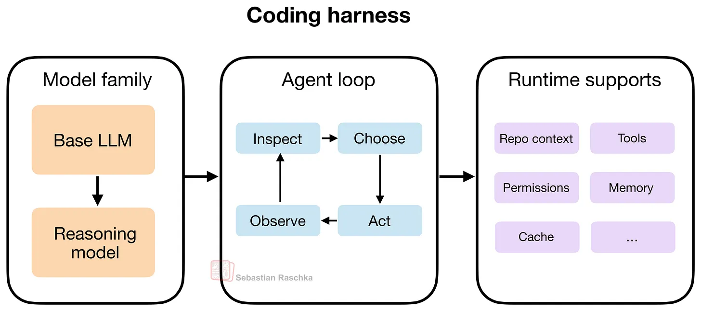</br>
*图 3. 编码管控框架由三层组成：模型家族、智能体循环与运行时支撑。

模型提供 “引擎”，智能体循环驱动迭代式问题求解，运行时支撑则提供基础配套设施。
在循环内部，“observe” 环节从环境中收集信息，“inspect” 环节分析该信息，“choose” 环节选定下一步操作，“act” 环节付诸实施。*

这里的核心结论是：优秀的编码管控框架能让推理型模型与非推理型模型的表现，远强于在普通聊天界面中的效果，因为它在上下文管理等诸多方面提供了辅助。

## 编码管控框架 (Coding Harness)

正如上一节所述，我们所说的管控框架（harness），通常是指围绕模型构建的软件层，
它负责组装提示词、开放工具调用、跟踪文件状态、执行编辑操作、运行命令、管理权限、缓存稳定前缀、存储记忆信息等诸多功能。

如今在使用 LLM 时，相较于直接向模型发送提示词或使用网页聊天界面（更接近于 “与上传文件对话” ），这一软件层在很大程度上决定了用户体验。

在我看来，如今各类 LLM 的基础版本能力都十分接近（比如 GPT-5.4、Opus 4.6、GLM-5 等的基础版本），
因此管控框架往往就成了决定一个 LLM 表现优于另一个的关键差异因素。

这只是一种推测，但我猜测：如果把最新、能力最强的开源权重大模型之一（例如 GLM-5）放到一套同类管控框架中，
它在编码任务上的表现很可能与 Codex 中的 GPT-5.4、Claude Code 中的 Claude Opus 4.6 不相上下。
话虽如此，针对特定管控框架做一些后续微调训练通常还是有益的。
例如，OpenAI 过去就分别维护了 GPT-5.3 和 GPT-5.3-Codex 两个不同版本。

在下一节中，我将结合我自己的 Mini Coding Agent，更具体地讲解编码管控框架的核心组件：https://github.com/rasbt/mini-coding-agent 。

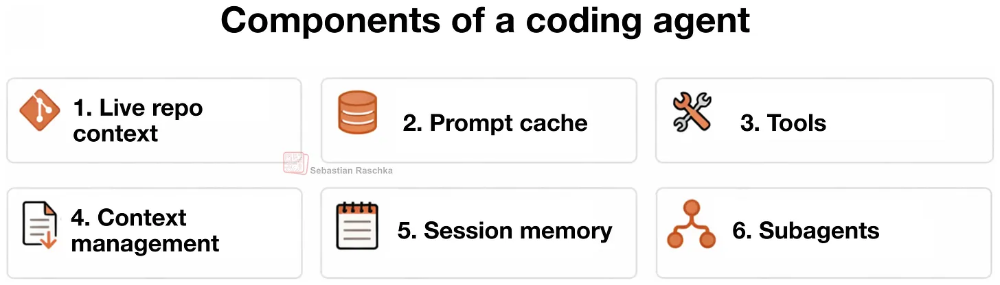</br>
*图 4：编码智能体/编码管控框架的主要管控框架特性，将在后续章节中详细讨论。*

顺便说明，为简便起见，本文中我会交替使用 “编码智能体 (coding agent)” 和 “编码管控框架 (coding harness)” 这两个术语。
（严格来说，智能体是由模型驱动的决策循环，而管控框架是提供上下文、工具与执行支持的外围软件架构。）

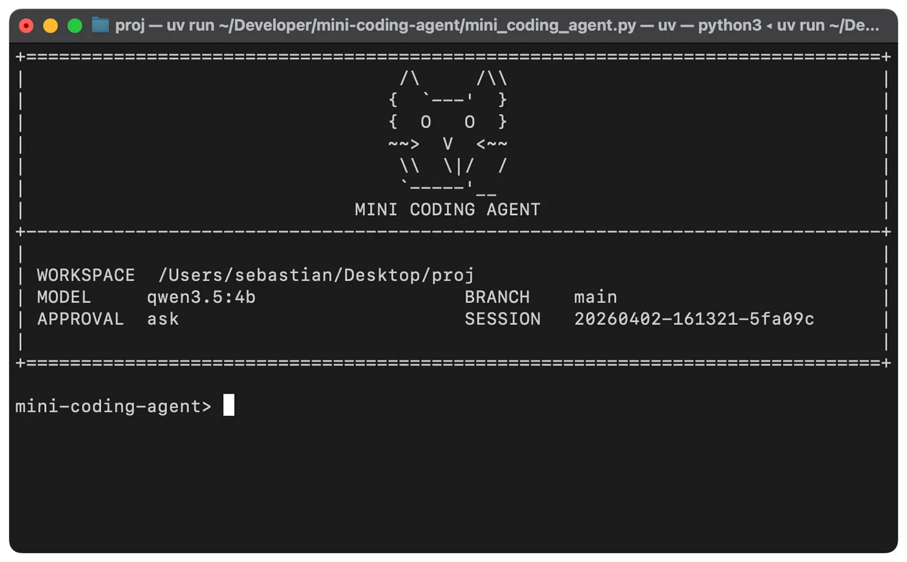</br>
*图 5：极简但功能完整、从零实现的 [Mini Coding Agent](https://github.com/rasbt/mini-coding-agent/blob/main/mini_coding_agent.py) （纯 Python 实现）*

以下是编码智能体的六大核心组件。
你可以查看我这款极简但功能完备、从零实现的 [Mini Coding Agent](https://github.com/rasbt/mini-coding-agent/blob/main/mini_coding_agent.py) （纯 Python 实现）的源代码，获取更具体的代码示例。
代码中通过注释标注了下面将要讨论的六个组件：

```Python
##############################
#### Six Agent Components ####
##############################
# 1) Live Repo Context -> WorkspaceContext
# 2) Prompt Shape And Cache Reuse -> build_prefix, memory_text, prompt
# 3) Structured Tools, Validation, And Permissions -> build_tools, run_tool, validate_tool, approve, parse, path, tool_*
# 4) Context Reduction And Output Management -> clip, history_text
# 5) Transcripts, Memory, And Resumption -> SessionStore, record, note_tool, ask, reset
# 6) Delegation And Bounded Subagents -> tool_delegate
```

## 1. 实时代码库上下文
这或许是最直观的组件，却也是最为重要的组件之一。

当用户下达 “修复测试” 或 “实现某某功能” 的指令时，模型应当知晓当前是否处于 Git 代码库中、所处分支、哪些项目文档可能包含相关说明等信息。

原因在于，这些细节往往会改变或影响正确的执行操作。
例如，“修复测试” 并非一条自包含 (self-contained) 的指令。
若智能体能读取 AGENTS.md 或项目 README 文件，便可得知该运行哪条测试命令等信息。
若它知晓代码库根目录与结构布局，就能精准查找目标位置，而非盲目猜测。

此外，Git 分支、状态信息与提交记录，也能进一步提供上下文，帮助了解当前正在进行的修改内容以及工作重心所在。

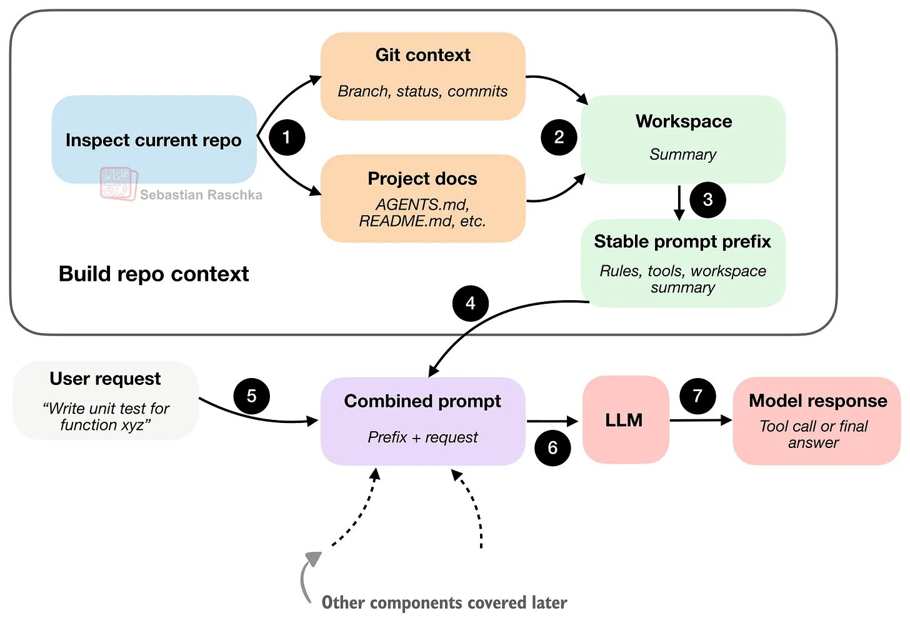</br>
*图 6：智能体管控框架 (agent harness) 首先会生成一份精简的工作空间摘要，将其与用户请求结合，为模型补充额外的项目上下文信息。*

核心要点在于：编码智能体 (coding agent) 在执行任何任务前，会预先收集相关信息
（以工作空间摘要的形式呈现 “稳定事实 (stable facts)”），从而避免每次接收提示时都从零开始、缺乏上下文。

## 2. 提示词结构 (Shape) 与缓存复用
当智能体获取代码库视图后，接下来要解决的问题是如何将这些信息输入模型。
上图展示了简化流程（ `Combined prompt: prefix + request` ），
但在实际应用中，如果每次处理用户查询时，都重新拼接并处理工作空间摘要，会造成较大的资源浪费。

也就是说，编码会话具有重复性，智能体的运行规则通常保持不变，工具说明也基本固定，
就连工作空间摘要大多时候也（基本）不会改动。
主要发生变化的通常是最新的用户指令、近期对话记录 (transcript)，以及可能的短期记忆内容。

如下图所示，"聪明" 的运行时环境不会在每一轮交互中，都把所有内容重新拼接成一个庞大且无区分的提示词。

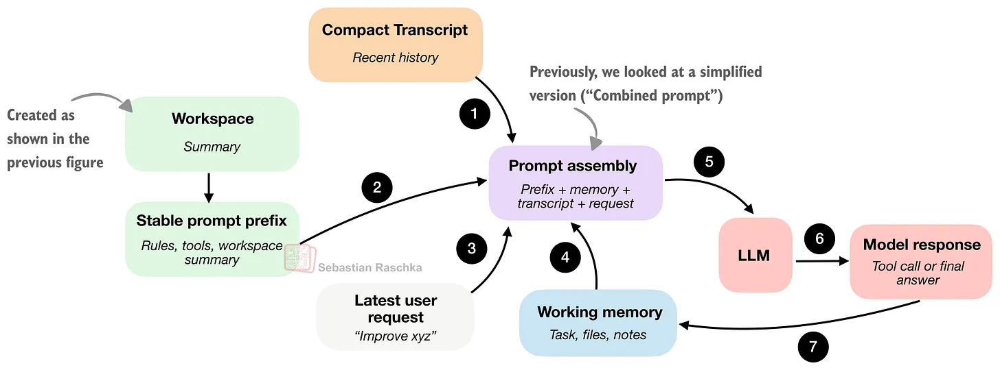</br>
*图 7：智能体管控框架 (agent harness) 构建稳定的提示词前缀，加入动态变化的会话状态，随后将组合后的提示词输入模型。*

本节与 第 1 节的主要区别在于：第 1 节关注的是代码库信息的收集，而本节则侧重于将这些信息高效封装并缓存，以供模型重复调用。

这里的 “稳定提示词前缀” 是指其中包含的信息不会频繁变动，
通常包含通用指令、工具说明以及工作空间摘要。
如果没有重要内容发生变化，我们就无需在每次交互中都从零开始重构这部分内容，从而避免算力浪费。

其他组件的更新频率则更高（通常每轮交互都会更新），包括短期记忆、近期对话记录以及最新的用户请求。

简而言之，“稳定提示词前缀” 的缓存机制，本质上就是让高效的运行时环境尽可能复用这部分内容。

## 3. 工具调用与使用
具备工具调用能力后，系统就不再像是普通聊天，而更接近一个真正的智能体。

单纯的模型只能用文本形式给出命令建议，而搭载在编码管控框架中的 LLM 则能完成更精准、更实用的操作 —— 它可以真正执行命令并获取结果（而无需我们手动运行命令后再把结果粘贴回对话窗口）。

不过，管控框架通常不会让模型随意使用任意语法，而是提供一份预定义的允许调用工具清单，每个工具都有明确名称、输入参数和使用边界。
（当然，类似 Python 的 subprocess.call 这类接口也可以包含在内，这样智能体就能执行各类常用的 shell 命令。）

下图展示了工具调用的完整流程。

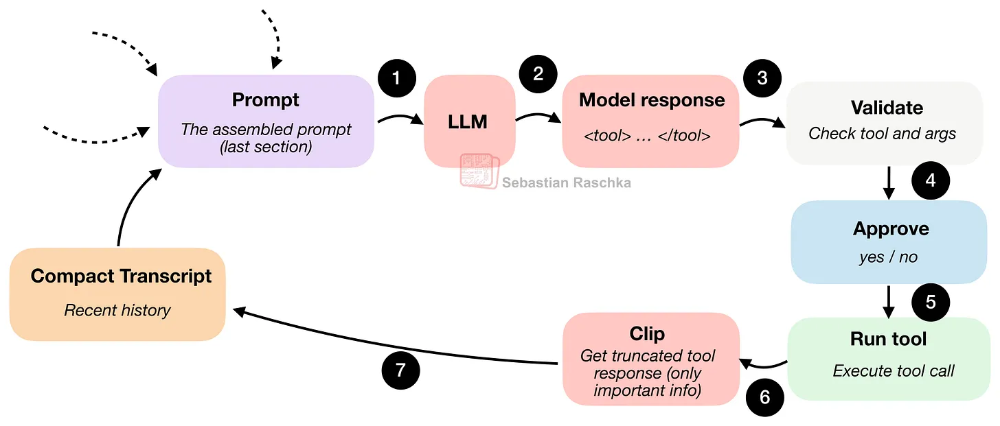</br>
*图 8：模型输出结构化动作，管控框架对其进行验证，可选择向用户请求批准，随后执行该动作，并将限定范围内的结果回传至循环中。*

为说明这一过程，下方展示一个示例，呈现使用我的 Mini Coding Agent 时用户通常看到的界面效果。
（该界面不如 Claude Code 或 Codex 美观，因为它设计极为精简，仅采用纯 Python 实现，未依赖任何外部库。）

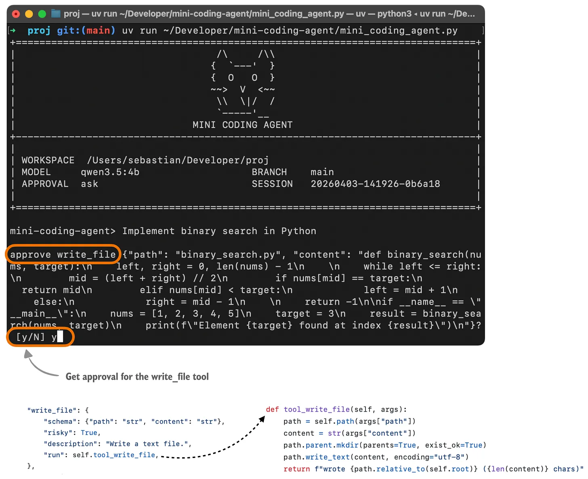</br>
*图 9：Mini Coding Agent 中的工具调用确认请求示例。*

在该环节中，模型必须选择管控框架能够识别的操作，例如列出文件、读取文件、搜索、执行 Shell 命令、写入文件等。
同时，模型还需以管控框架 (harness) 可校验的格式传入相应参数。

因此，当模型请求执行某项操作时，运行时系统可以暂停并执行程序化检查，例如：

- “这是已注册的工具吗？”
- “参数是否合法有效？”
- “该操作是否需要用户授权确认？”
- “请求访问的路径是否在工作空间范围内？”

只有在这些检查全部通过后，相关操作才会真正执行。

当然，运行编码智能体存在一定风险，而管控框架的校验机制也能提升系统可靠性，因为模型不会执行完全随意的命令。

此外，除了拒绝格式错误的操作与进行批准校验外，通过对文件路径进行检查，还能将文件访问权限限制在代码仓库内部。

从某种意义上说，管控框架限制了模型的自由度，但同时也提升了实用性。

## 4. 最小化上下文膨胀
上下文膨胀并非编码智能体独有的问题，而是 LLM 普遍面临的挑战。
诚然，如今 LLM 支持的上下文长度越来越长
（我近期也撰文介绍过让其计算开销更可控的各类 [注意力变体](https://magazine.sebastianraschka.com/p/visual-attention-variants)），
但长上下文依然成本高昂，并且（在存在大量无关信息时）还会引入额外噪声。

| | |
|---|---|
|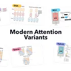| [A Visual Guide to Attention Variants in Modern LLMs](https://magazine.sebastianraschka.com/p/visual-attention-variants) </br> [Sebastian Raschka, PhD](https://substack.com/@rasbt) . 3月22日</br> [阅读全文](https://magazine.sebastianraschka.com/p/visual-attention-variants)|

在多轮对话中，编码智能体比常规 LLM 更容易出现上下文膨胀，原因在于重复的文件读取、冗长的工具输出、日志信息等。

如果运行时环境完整保留所有这些信息，很快就会耗尽可用的上下文 tokens 。
因此，优秀的编码管控框架在处理上下文膨胀时，通常会采用相当精细的策略，而非像普通聊天界面那样仅进行简单的截断或摘要处理。

从概念上讲，编码智能体中的上下文压缩机制可如下图所示进行概括。
具体而言，我们将进一步聚焦上一节 图8 中的 Clip（第 6 步）环节。

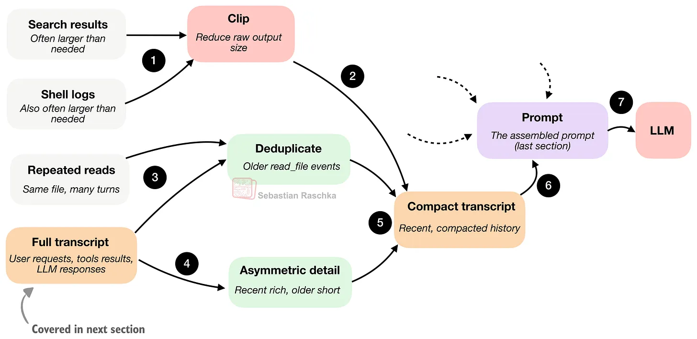</br>
*图 10：大篇幅输出会被截断，重复读取的内容会被去重，对话记录在重新输入提示词前会被压缩。*

一个极简的管控框架至少会采用两种压缩策略来处理这一问题。

第一种是截断策略 (clipping)，用于缩短过长的文档片段、大量的工具输出结果、记忆记录以及对话条目。
换句话说，该策略避免某一段文本只因内容冗长就占用过多的提示词 tokens 配额。

第二种策略是对话记录 (transcript) 精简或摘要化，即将完整的会话历史（下一节会详细介绍）压缩为更短小、可输入提示词的摘要信息。

这里的一个关键技巧是：保留近期内容的完整度，因为它们对当前步骤往往更重要；
而对更早的内容进行更激进的压缩，因为其相关性通常更低。

此外，我们还会对较早读取的文件内容进行去重处理，避免模型因为会话前期多次读取同一文件，而反复看到相同内容。

总的来说，我认为这是优秀编码智能体设计中容易被低估、看似枯燥却十分关键的部分。
很多表面上的 “模型质量”，本质上其实是上下文质量。

## 5. 结构化会话记忆
在实际应用中，本文介绍的这六大核心概念高度交织，不同小节与图示会从不同侧重点或细化程度对其展开说明。
上一节中，我们探讨了提示阶段对历史信息的使用方式，以及如何构建精简的会话记录。
当时的核心问题是：在下一轮交互中，应该将多少历史信息重新输入模型？
因此侧重点在于压缩、截断、去重与时效性筛选。

而本节所要讲的结构化会话记忆，则聚焦于历史信息在存储阶段的结构设计。
这里的核心问题是：智能体需要长期保存哪些内容作为永久记录？
因此侧重点在于：运行时系统会保留一份更完整的会话记录作为持久状态，
同时搭配一个更轻量化的记忆层——该层体积更小，且会被持续修改、压缩，而非简单地追加内容。

总而言之，编码智能体将状态至少分为两层：

- 工作记忆：智能体显式维护的、精简后的小型状态
- 完整会话记录：包含所有用户请求、工具输出与 LLM 回复

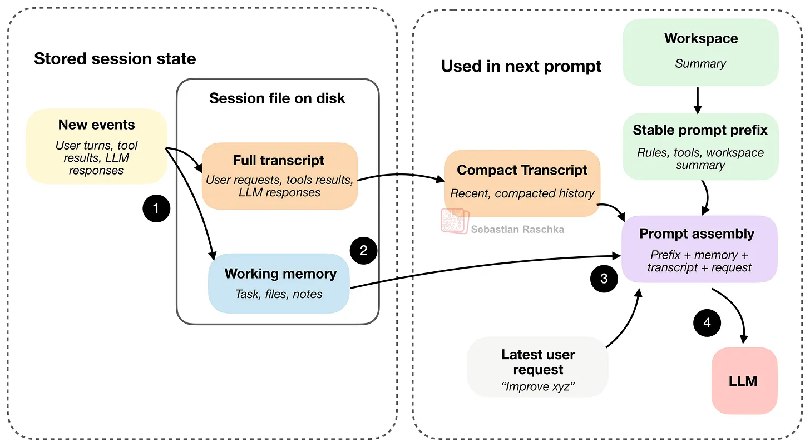</br>
*图 11：新事件会追加到完整会话记录中，并在工作记忆里进行摘要归纳。磁盘上的会话文件通常以 JSON 格式存储。*

上图展示了两类主要的会话文件：完整会话记录与工作记忆，它们通常以 JSON 格式存储在磁盘上。
如前所述，完整会话记录 (full transcript) 保存了全部历史信息，即使关闭智能体也可恢复会话。
工作记忆 (working memory) 则更像是提炼后的版本，仅保留当前最为关键的信息，工作记忆与精简会话记录 (compact transcript)有一定关联。

但精简会话记录 (compact transcript) 与工作记忆的作用略有不同。
精简会话记录用于提示词重构，其作用是为模型提供压缩后的近期历史视图，
使其无需在每轮都查看完整会话记录 (full transcript) 即可继续对话。
工作记忆则更侧重于任务连续性，用于跨轮次维护一份小型、显式管理的摘要，例如当前任务、重要文件与近期记录等。

按照上图中的第 4 步，最新的用户请求、LLM 回复以及工具输出，
会在下一轮中作为 “新事件” 同时记录到完整会话记录 (full transcript) 与工作记忆 (working memory) 中；
为避免图表过于繁杂，这一过程并未在图中画出。

## 6. 受限的子智能体委派
当一个智能体具备工具调用与状态管理能力后，接下来一项实用功能便是（任务）委派。

这么做的原因在于，它可以让我们将部分工作拆分为子任务交给子智能体并行处理，从而加快主任务的执行速度。
例如，主智能体在处理某项任务的同时，还需要一些辅助信息，比如某个符号定义在哪个文件中、配置文件的内容、或是测试失败的原因。
将这类工作拆分为受限制的子任务会更高效，而不是让一个执行循环同时处理所有工作线索。

（在我的迷你编码智能体中，实现方式更为简单，子任务仍以同步方式运行，但其核心思想是一致的。）

子智能体只有在继承了足够上下文、能够完成实际工作时才有价值。
但如果不对其加以限制，就会出现多个智能体重复工作、修改同一文件，或是不断衍生更多子智能体等问题。

因此，设计上的难点不仅在于如何创建子智能体，更在于如何对其进行约束。

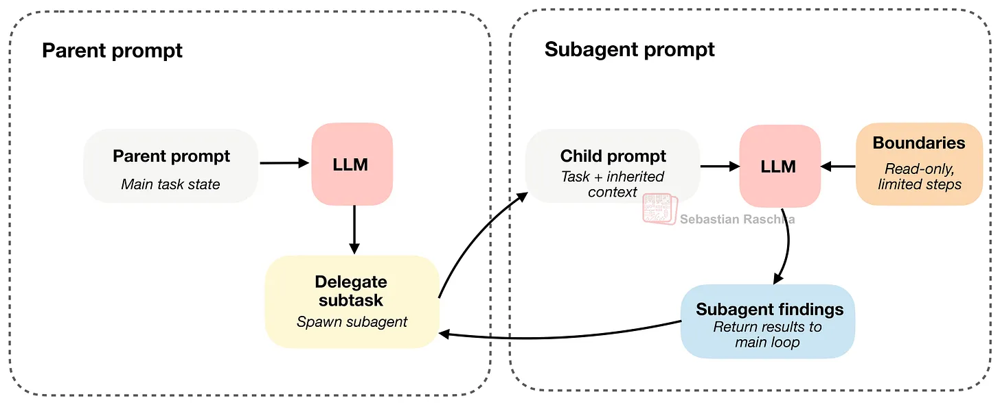</br>
*图 12：子智能体继承足够的上下文以发挥作用，但其运行边界比主智能体更为严格。*

核心设计在于，子智能体既继承了完成任务所需的充足上下文，又受到严格约束（例如只读权限、限制递归深度等）。

Claude Code 很早就支持子智能体功能，而 Codex 是近期才加入这一特性。
Codex 一般不会强制子智能体进入只读模式，它们通常会继承主智能体的大部分沙箱环境与审批机制。
因此，其边界控制更多体现在任务范围、上下文与执行深度上。

## 组件总结
上文介绍了编码智能体的主要组成部分。
如前所述，这些组件在实际实现中或多或少存在深度交织的情况。
不过，我希望通过逐一讲解的方式，帮助你建立起关于编码管控框架工作原理的整体认知，
并理解相比简单的多轮对话，这类框架为何能让 LLM 发挥更大价值。

</br>
*图 13：前文所述编码管控框架 (coding harness) 的六大核心功能。*

如果你希望看到这些功能以简洁、极简的 Python 代码实现，你可能会喜欢我的 [Mini Coding Agent](https://github.com/rasbt/mini-coding-agent) 。

## 与 OpenClaw 相比如何？
OpenClaw 或许是个有意思的对比对象，但二者并非同类系统。

OpenClaw 更像是一个本地通用智能体平台，同时具备编码能力，而非一款专用的（终端）编码助手。

二者与编码管控框架仍存在多处相似之处：

- 会使用工作空间内的提示词与指令文件，例如 AGENTS.md、SOUL.md 和 TOOLS.md
- 会保存 JSONL 格式的会话文件，具备会话记录压缩与会话管理功能
- 能够创建辅助会话与子智能体
- 等等

但正如前文所述，二者的设计侧重点有所不同。
编码智能体针对在代码仓库中工作的场景进行了优化，方便用户借助编码助手高效查看文件、编辑代码并运行本地工具。
而 OpenClaw 更侧重于在多轮对话、多个频道与多个工作空间中运行大量长期驻留的本地智能体，编码只是其众多重要任务中的一项。

---

我很高兴地宣布，我已完成《从零构建推理模型》一书的撰写，目前所有章节均已开放抢先阅读。出版商正在进行版式设计工作，本书预计将于今年夏季正式上市。

这或许是我迄今为止最具雄心的一部作品。我花费了大约一年半的时间进行创作，书中融入了大量实验研究。无论是投入的时间、精力，还是在内容打磨上的用心，它都算得上是我最为倾力的一本书，希望你能喜欢。

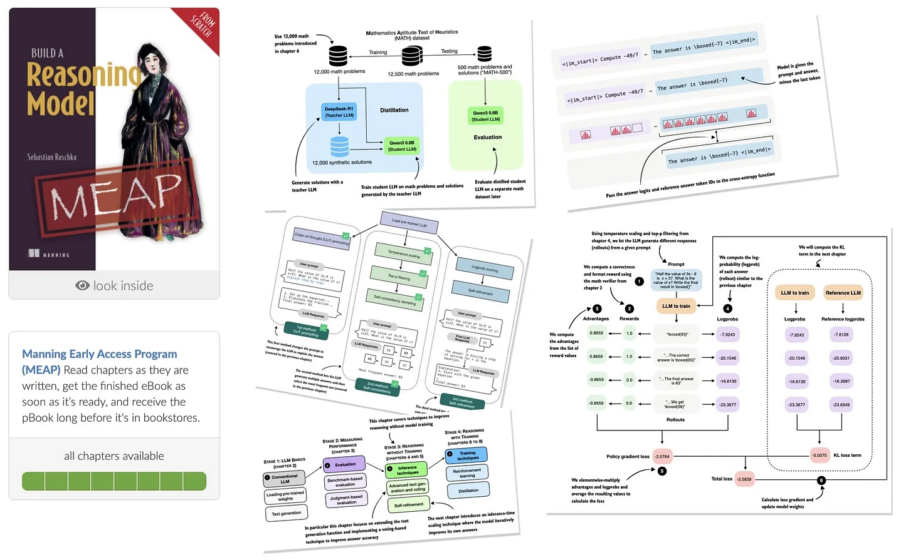</br>
*本书将在 [Manning](https://mng.bz/Nwr7) 及 [Amazon](https://amzn.to/4aAKiFY) 发售，书名《Build a Reasoning Model (From Scratch)》。*

核心主题包括：
- 推理模型评估
- 推理阶段缩放
- 自我优化
- 强化学习
- 知识蒸馏

当前围绕 LLM 的 “推理能力” 讨论颇多，而我认为，要真正理解其在 LLM 语境下的内涵，最好的方式就是从零动手实现一个推理模型！

- [Amazon](https://amzn.to/4aAKiFY) （预购）
- [Manning](https://mng.bz/Nwr7) （全书 [抢先阅读](https://mng.bz/Nwr7)，版式终稿前版本，共 528 页）

