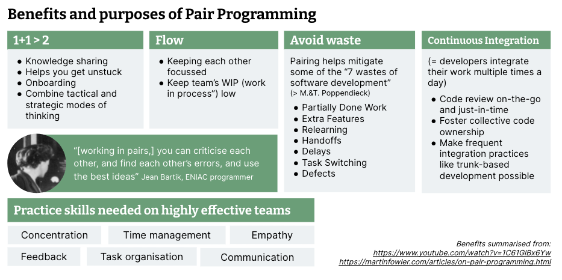

# 代码辅助工具无法替代结对编程

 
本文为 [探索生成式AI](exploring-gen-ai.md) 系列的一部分，该系列记录了 Thoughtworks 技术人员在软件开发中运用生成式 AI 技术的探索实践。

|| |
|:---|---:|
|[Birgitta Böckeler](https://birgitta.info/)| |
| |Birgitta 是 Thoughtworks 的杰出工程师，同时也是 AI 辅助交付领域专家。她拥有二十余年软件开发、架构设计及技术管理经验。|
| [原文](https://martinfowler.com/articles/exploring-gen-ai/05-not-your-pair-programmer.html) |2023/8/10|

---
希望前面的备忘录已经说明，我认为生成式 AI 驱动的代码辅助工具是开发者工具链中非常实用的补充。
在特定场景下，它们显然能加快代码编写速度，帮我们摆脱思路卡顿，更快地回忆和查阅信息。
到目前为止，所有备忘录主要讨论的都是 IDE 中的行内辅助功能，但如果在此基础上加入聊天机器人界面，实用辅助的潜力会更大。
尤其强大的是集成在 IDE 中的聊天界面，它能利用代码库的额外上下文信息，而我们无需在提示词中逐一说明。

然而，尽管我看到了这类工具的潜力，但当人们把代码辅助工具说成是结对编程的替代品时，我着实感到很无奈（GitHub 甚至将其 Copilot 产品称作 “你的 AI 结对程序员”）。
在 Thoughtworks，我们长期以来一直大力倡导结对编程及各类配对协作模式，以此提升团队效能。
这也是我们在项目启动时采用的 “合理默认实践” 之一。

将代码辅助工具定位为结对程序员，是对结对编程这一实践的贬低，也会加深人们对结对编程价值普遍存在的片面理解与误解。
我翻出了以往讲解结对编程所用的一组幻灯片，以及 [本站发布的一篇综合性文章](https://martinfowler.com/articles/on-pair-programming.html)，把其中提到的所有益处浓缩到了一页幻灯片中：

 

代码辅助工具在这方面最能产生显著效果的，是第一点 “1+1>2”。
它们能帮我们突破瓶颈，优化新人上手流程，加快战术层面的工作效率，让我们能更专注于战略层面——也就是整体方案的设计。
在 “这项技术如何运作” 这类知识分享上，它们也能提供帮助。

但结对编程还涉及另一种知识分享：它能形成集体代码所有权，并让团队共同掌握代码库的演进历史。
它分享的是隐性知识 (tacit knowledge) ——这类知识从未被文字记录下来，因此大语言模型也无法获取。
结对编程还能优化团队工作流、减少浪费，并让 [持续集成](https://martinfowler.com/articles/exploring-gen-ai/articles/continuousIntegration.html) 更易实施。
它能锻炼协作能力，比如沟通、共情、给予与接受反馈。
对于远程优先的团队，它更是提供了宝贵的团队凝聚力建设机会。

## 结论
代码辅助工具仅能实现结对编程的一小部分目标与价值。
原因在于，结对编程是一项旨在提升整个团队水平的实践，而非仅仅服务于单个开发者。
实施得当的话，沟通与协作程度的提升能够优化工作流程，并强化集体代码所有权。
我甚至认为，通过结对方式使用这类工具，是降低大语言模型辅助编码风险的最佳途径（详见前一份备忘录中 [它会在哪些方面造成阻碍](exploring-gen-ai-04.md) 部分）。

<ins>利用代码辅助工具让结对编程变得更高效，而非用其取代结对编程</ins>。
