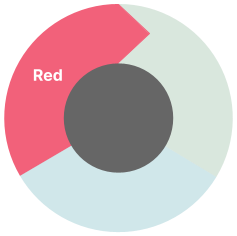
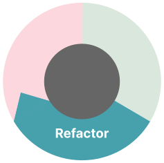

# 基于 GitHub Copilot 的 TDD

| ||
|---|---:|
| |本文为 [探索生成式AI](exploring-gen-ai.md) 系列的一部分，该系列记录了 Thoughtworks 技术人员在软件开发中运用生成式 AI 技术的探索实践。| 

|| |
|:---|---:|
|[Paul Sobocinski](https://spikes.sobes.co/)| |
| |Paul 是 Thoughtworks 的首席开发工程师，致力于提升公司及其客户在软件工程实践中的技术卓越性。自 2023 年起，他便积极采用 AI 驱动的编码工具，热衷于帮助团队以合乎道德、负责任的方式运用这些工具。
| [原文](https://martinfowler.com/articles/exploring-gen-ai/06-tdd-with-coding-assistance.html) |2023/8/17|

---

以 GitHub Copilot 为代表的 AI 代码辅助工具的出现，是否意味着我们不再需要编写测试？
测试驱动开发（TDD）是否会就此过时？
要回答这个问题，我们先来看看测试驱动开发对软件开发的两大帮助：提供优质反馈，以及在解决问题时实现 “分而治之”。

### 实现优质反馈的 TDD
优质的反馈应当快速且精准。
在这两方面，没有什么能比得上从编写精良的单元测试开始。
无论是手动测试、文档、代码审查，甚至于生成式 AI，都无法与之媲美。
事实上，大语言模型会提供无关信息，甚至产生内容 [幻觉](https://en.wikipedia.org/wiki/Hallucination_(artificial_intelligence)) 。
在使用 AI 代码辅助工具时，测试驱动开发显得尤为必要。
正如我们需要为自己编写的代码获取快速精准的反馈一样，我们也需要对 AI 代码助手生成的代码给出同样高效准确的反馈。

### 分而治之解决问题的 TDD
通过分而治之的思路解决问题，意味着更小的问题能比更大的问题更快得到解决。
这支撑了持续集成、基于主干的开发，并最终实现持续交付。
但如果 AI 助手能替我们编写代码，我们真的还需要这一切吗？

需要。
大语言模型很少能在一次提示后就提供我们需要的精确功能。
因此迭代式开发并不会消失。
此外，当大语言模型通过 [思维链提示](https://arxiv.org/abs/2201.11903) 逐步解决问题时，似乎能 “激发出推理能力 (elicit reasoning)”（见相关研究）。
基于大语言模型的 AI 代码辅助工具在分拆问题、逐个解决时表现最佳，而 TDD 正是我们在软件开发中实现这一点的方式。

## 面向 GitHub Copilot 的 TDD 技巧
今年年初以来，Thoughtworks 就已将 GitHub Copilot 与 TDD 结合使用。
我们的目标是围绕该工具的使用，试验、评估并逐步形成一系列高效实践。

### 0. 开始
 

从一个空白的测试文件开始，并不意味着从空白的上下文开始。
我们通常会从带有粗略备注的用户故事入手，也会和结对搭档一起讨论确定一个起点。

这些都是在我们将其写入打开的文件（例如测试文件的顶部）之前，Copilot 无法 “看到” 的上下文信息。
Copilot 可以处理拼写错误、要点形式、语法不佳等各种问题，但它无法处理一个完全空白的文件。

以下是一些我们实践中效果良好的初始上下文示例：

- ASCII 示意图原型 (art mockup)
- 验收标准
- 指导性假设，例如：
  - “无需图形界面”
  - “采用面向对象编程”（而非函数式编程）

Copilot 会使用打开的文件作为上下文，因此同时保持测试文件和实现文件打开（例如并排显示），能大幅提升 Copilot 的代码补全能力。

### 1. 红阶段
 

我们首先编写描述性清晰的测试用例名称。
名称描述得越详细，Copilot 的代码补全效果就越好。

我们发现 [Given-When-Then](https://martinfowler.com/bliki/GivenWhenThen.html) 结构在三个方面有所帮助。
首先，它提醒我们提供业务上下文。
其次，它能让 Copilot 为测试示例提供丰富且表意清晰的命名建议。
第三，它能反映出 Copilot 从文件顶部上下文（上一节中已介绍）中对问题的 “理解” 程度。

例如，如果我们正在编写后端代码，而 Copilot 将测试示例名称补全为 “given the user……click the buy button”，
这就提示我们应当更新文件顶部的上下文，明确注明 “假设无图形界面”，或是 “本测试套件与 Python Flask 应用的 API 接口交互”。

需要留意的更多 “陷阱”：

- Copilot 可能会一次性补全多个测试用例。
这些测试通常毫无用处（我们会直接删除）。

- 随着我们添加更多测试，Copilot 会一次补全多行代码，而不是逐行补全。
它通常能根据测试名称推断出正确的 “准备” 和 “执行” 步骤。

  - **这里有一个陷阱** ：它很少能正确推断出 “断言” 步骤，因此在进入 “绿阶段” 之前，我们要格外仔细地确保新测试是 **正确失败 (correctly failing)** 的。

### 2. 绿阶段
 

现在我们可以让 Copilot 协助实现功能代码了。
一套已存在、表意清晰且可读性良好的测试套件，能在这一步最大限度地发挥 Copilot 的潜力。

尽管如此，Copilot 往往不会采用 “小步快走 (baby steps)” 的方式。
例如，在添加新方法时，“小步快走” 指的是先返回一个硬编码值让测试通过。
到目前为止，我们还无法引导 Copilot 采用这种实现方式。

#### 补充测试
Copilot 不会采取 “小步快走” 的方式，而是直接超前写出功能代码 —— 这些功能通常相关，但尚未经过测试。
作为应对方案，我们会补充缺失的测试。
虽然这与标准的 TDD 流程有所偏离，但目前这种变通做法并未出现任何严重问题。

#### 删除并重新生成
对于需要更新的实现代码，让 Copilot 参与的最高效方式是：
删除原有实现，让它根据测试从头重新生成代码。
如果此方法失效，可以删除方法内的代码，再用代码注释分步写出实现思路，这通常会有帮助。
若仍不行，最好的办法或许是暂时关闭 Copilot，手动编写解决方案。

### 3. 重构
 

TDD 中的重构是指在不改变代码行为（且保持代码可正常运行）的前提下，通过渐进式改进提升代码库的可维护性与可扩展性。

在这方面，我们发现 Copilot 的能力有限。请看两种场景：

- **“我知道要做哪种重构操作”** ：IDE 的重构快捷键和多光标选择等功能，比 Copilot 更能让我们快速达成目标。

- **“我不知道该采取哪种重构方式”** ：Copilot 的代码补全无法引导我们完成重构。
不过，Copilot Chat 可以直接在 IDE 中给出代码优化建议。
我们已经开始试用这一功能，发现它在小范围、局部代码上能给出不错的建议。
但在更大规模的重构建议上（例如超出单个方法/函数的范围），目前效果还不够理想。

有时我们清楚要进行哪种重构，却不知道实现该重构所需的语法。
例如，创建一个可用于注入依赖的测试模拟对象。
针对这类情况，我们可以通过代码注释向 Copilot 提出需求，它就能直接提供行内解决方案。
这避免了我们切换上下文去查阅文档或进行网页搜索。

## 结论
众所周知的 “垃圾进，垃圾出” 原则，既适用于数据工程，也适用于生成式人工智能与大语言模型。
换句话说：更高质量的输入，才能让大语言模型的能力得到更好的发挥。
在我们的实践中，TDD 维持了高水平的代码质量。
这种高质量的输入，能让 Copilot 表现出远超其他方式的效果。

<ins>因此我们推荐结合 TDD 使用 Copilot，也希望上述技巧能对你有所帮助</ins>。
