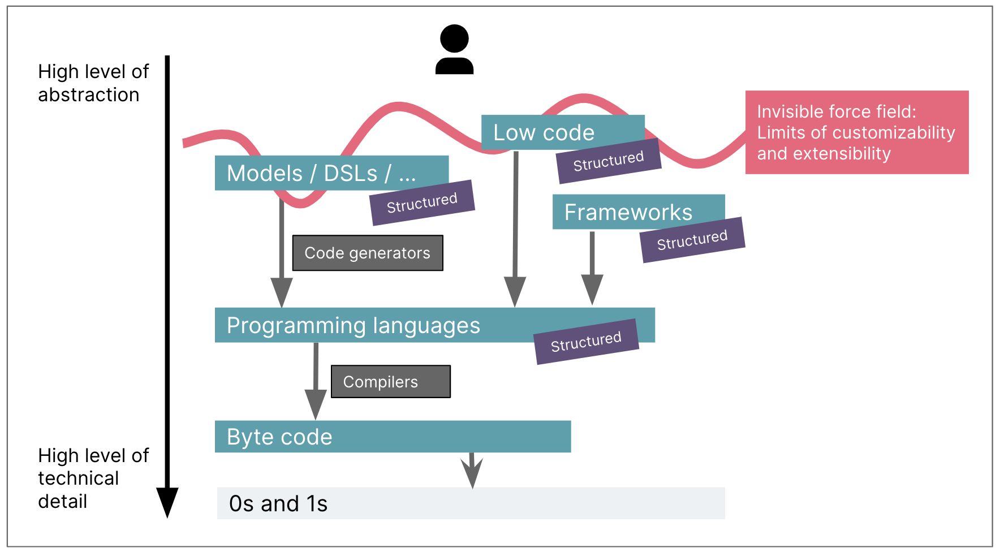
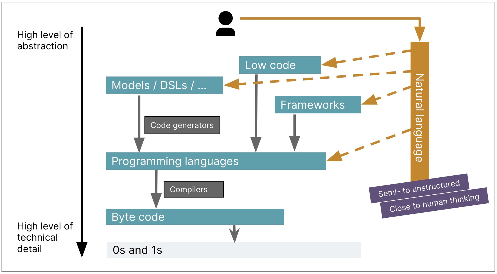

# 生成式人工智能 (GenAI) 与其他代码生成工具有何区别？

 
本文为 [探索生成式AI](exploring-gen-ai.md) 系列的一部分，该系列记录了 Thoughtworks 技术人员在软件开发中运用生成式 AI 技术的探索实践。

|| |
|:---|---:|
|[Birgitta Böckeler](https://birgitta.info/)| |
| |Birgitta 是 Thoughtworks 的杰出工程师，同时也是 AI 辅助交付领域专家。她拥有二十余年软件开发、架构设计及技术管理经验。|
| [原文](https://martinfowler.com/articles/exploring-gen-ai/07-how-is-this-different.html) |2023/9/19|

---
在我职业生涯初期，我在 MDD 领域投入了大量工作。
我们会设计一种建模语言来描述业务领域或应用系统，再用该语言以图形或文本形式（定制化 UML 或领域特定语言 DSL）表述需求。
随后我们搭建代码生成器，将这些模型转换为代码，并在代码中预留指定区域，供开发人员进行后续实现与定制开发。

不过这种代码生成模式始终未能广泛普及，仅在嵌入式开发的部分领域有所应用。
我认为原因在于，它所处的抽象层级较为尴尬，在大多数场景下，其投入产出比都不如框架、平台等其他抽象层级。

## GenAI 进行代码生成的独特之处是什么？

我们在软件工程工作中不断做出的关键决策之一，就是选择合适的抽象层级，在实现工作量与业务场景所需的定制化程度、可控性之间达成良好平衡。
整个行业一直在尝试提升抽象层级，以减少实现工作量、提高开发效率。
但这一过程存在一道无形的壁垒，受限于我们所需的可控程度。
以低代码平台为例：它们提升了抽象层级并降低了开发工作量，但也因此 [最适用于某些类型简单、逻辑直接的应用场景](https://www.thoughtworks.com/radar/techniques/bounded-low-code-platforms) 。
一旦需要实现更具定制化、更复杂的功能，我们就会触碰到这层壁垒，不得不再次降低抽象层级。

 

GenAI 开辟了一个全新的潜力领域，因为它并非又一次试图突破这层壁垒。
相反，它能够让人类在所有抽象层级上都更高效地工作，而无需像编译器或代码生成器那样，去正式定义结构化语言和转换器。

 

<ins>在越高的抽象层级上应用生成式人工智能，开发一款软件所需的整体工作量就越低</ins>。
回到低代码的例子，该领域已有不少令人瞩目的案例，展示了仅 [通过少量提示词就能搭建完整应用](https://www.youtube.com/watch?v=9thyji4QRa8) 的过程。
不过，在可覆盖的应用场景方面，这种方式同样存在低代码抽象层级所固有的局限。
如果你的业务场景触碰到了那层壁垒，需要更高的可控性 —— 就必须退回更低的抽象层级，同时也只能使用更细粒度的可提示单元。

## 我们是否需要重新思考抽象层级？

<ins>在思考 GenAI 对软件工程的潜在价值时，我常用的一种思路是：考量我们的自然语言提示词与目标抽象层级之间的抽象距离</ins>。
我上文附上链接的 [谷歌 AppSheet 演示](https://www.youtube.com/watch?v=9thyji4QRa8)，就使用了非常高层级的提示词
（“我需要创建一个应用，帮助团队跟踪差旅申请……填写表单……申请需发送给经理……”），以此生成一个可运行的低代码应用。
如果用类似的提示词向下延伸到其他目标层级，能否得到相同的效果？
比如直接生成基于 Spring 和 React 框架的代码。
或者说，要在 Spring 和 React 中实现同样的效果，提示词需要细化到何种程度、抽象程度要降低多少？

如果我们想更好地利用 GenAI 在软件工程中的潜力，也许我们需要完全重新思考传统的抽象层次，以为 GenAI 构建更多可以桥接的 “可提示” 距离。
