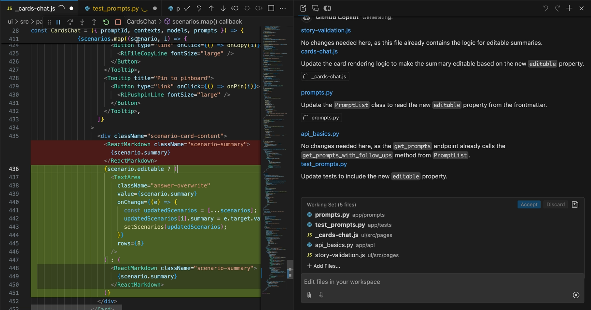
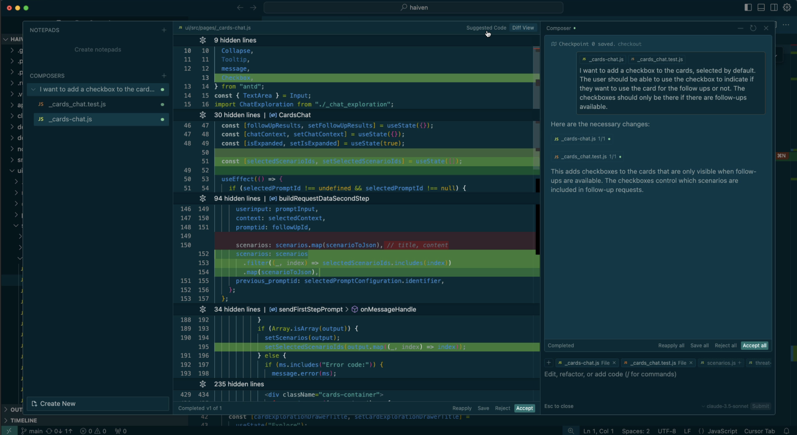
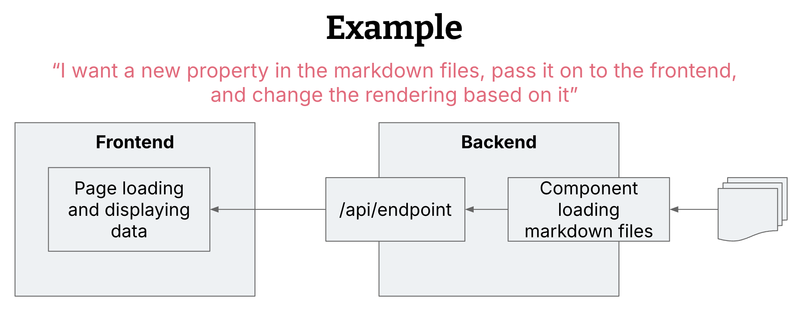

# 通过多文件编辑扩大解决方案规模

 
本文为 [探索生成式AI](exploring-gen-ai.md) 系列的一部分，该系列记录了 Thoughtworks 技术人员在软件开发中运用生成式 AI 技术的探索实践。

|| |
|:---|---:|
|[Birgitta Böckeler](https://birgitta.info/)| |
| |Birgitta 是 Thoughtworks 的杰出工程师，同时也是 AI 辅助交付领域专家。她拥有二十余年软件开发、架构设计及技术管理经验。|
| [原文](https://martinfowler.com/articles/exploring-gen-ai/11-multi-file-editing.html) |2024/11/19|

---
2024 年 10 月底，GitHub Copilot 推出了一项极为强大的全新编码辅助功能。
这项全新的多文件编辑能力，将人工智能辅助的范围从小规模、局部化的代码建议，扩展到了跨多个文件的更大型功能实现。
此前，开发者仅能借助 Copilot 完成一些辅助工作，例如在单个方法内生成几行代码。
而现在，这款工具能够处理更复杂的任务，同步编辑多个文件，并按照一个更宏大的规划完成多个步骤的实现。
这标志着编码辅助工作流程迎来了一次跨越式变革。

多文件编辑功能在诸如 [Cline](https://github.com/cline/cline)、[Aider](https://aider.chat/) 等开源工具中已经存在一段时间了。
GitHub Copilot 的竞争对手 [Cursor](https://www.cursor.com/) 也有一项名为 “Composer” 的功能（尽管同样非常新且尚无官方文档），其体验与 Copilot 多文件编辑极为相似。
Codeium 则刚刚发布了名为 [Windsurf](https://codeium.com/windsurf) 的新型编辑器，也对外宣传具备这类能力。
不过，随着这项功能登陆 GitHub Copilot，它得以触达当前企业中使用最广泛的编码助手的用户群体。

## 什么是多文件编辑？
以下是该功能在 GitHub Copilot 和 Cursor 编辑器中的工作方式：

- 用文字描述你想要实现的操作
- 选择需要工具读取和修改的一组文件。不同工具在这一步的操作有所差异，Cline 和 Windsurf 会尝试自动判断需要修改的文件。
- 耐心等待！根据我测试的任务来看，处理过程大约需要 30 到 60 秒。
- 查看工具生成的代码差异并进行审核
- 自行调整修改内容，或在必要时向工具发送进一步的修正指令。
- 对修改结果满意后，即可 “接受” 这些更改。
- 你可以在当前会话中继续下达新指令，工具会在已接受的修改基础上生成新的变更内容。

以下是 GitHub Copilot 的使用示例：

 

Cursor Composer 功能示例：

 

## 使用多文件编辑时需要考虑的事项
### 问题规模
想要高效使用这项功能，关键在于我们如何描述希望 AI 完成的任务，以及将其用于何种规模的问题。

问题规模越大，……

- ……AI 需要的代码上下文就越多
- ……触及 token 长度限制的概率就越高
- ……AI 出错的可能性就越大
- ……开发者遗漏有问题修改的风险就越高
- ……提交的代码变更量就越大——要注意，大规模变更会提高部署风险，也会让回滚和故障调试变得更加困难

我使用 Copilot 新增了一项功能，该功能可以：

- 从数据源中加载一个新的布尔类型属性
- 将该新属性作为 API 接口的一部分返回给前端
- 前端根据该属性判断页面上某个元素是否可编辑

 

在我看来，这次变更和提交规模都很合适，对 AI 来说也不算过大，能够可靠地完成任务。
不过也有人可能会说，他们通常会把这项工作拆分成三次提交。
可一旦你把它拆成三个独立的小改动，再使用多文件编辑就没有意义了，因为这些小任务完全可以用更常规的 AI 功能（比如行内补全）来完成。
所以这项功能无疑会让我们倾向于做更大的提交，而非非常细碎的提交。

我预计这些工具很快就会自动帮我判断哪些文件需要修改（顺便一提，Cline 已经做到了这一点）。
不过，在编辑会话中手动选择有限的文件范围也可能是个不错的设计，因为这会迫使我们生成更小、风险更低的变更集。
有趣的是，这再次印证了一个观点：代码结构良好，AI 效果才更好。
代码库模块化程度越高、关注点分离越清晰，就越容易给 AI 划分出一段独立的代码区域去处理。
如果你总是因为只能给 AI 提供少量文件、而不能把整个代码库丢给它而感到烦躁，那这可能就是你的代码库设计存在问题的信号。

### 问题描述，还是实现方案？
可以注意到，在上面的示例中，我实际上是在向工具描述实现方案，而不是真正提出一个待解决的问题。
由于我还必须预先确定需要修改哪些文件，无论如何我都得对实现方式有一个大致思路，因此这款工具在一定程度上迫使我停留在较低的抽象层级上进行操作。

有人可能会说，如果我已经要自行制定实现方案，那使用这个功能还有意义吗？
AI 的价值难道不应该是帮助我们在这一阶段解决问题，而不只是机械地执行实现方案吗？
我个人仍然非常喜欢使用这项功能，并且觉得它很有价值，因为它降低了我在执行一些相对直接的修改时的认知负担。
我不必去思考具体要修改哪些方法、找到合适的整合点等等。

如果尝试这样一种工作流程会很有意思：先在普通的编码助手对话中构思出实现方案，生成方案和文件清单，再将这些内容输入到多文件编辑模式中。

### 审阅体验
多文件编辑功能是否高效，另一个关键因素在于开发者的审阅体验。
工具能否让我轻松理解修改内容、判断这些修改是否合理，至关重要。
在所有这类工具中，审阅体验基本与开发者查看自己的修改并在提交前做最终检查一致：
逐一审阅每个被修改的文件，查看文件中的每一处代码变更。
因此使用感受十分熟悉。

我在审阅多文件修改时得到的一些初步观察：

- 发现几处不必要的修改是很常见的情况。
可能是对某个完全无关的函数进行了小幅重构，有时甚至是在现有测试中添加了多余的测试断言，这会让测试变得更脆弱。
因此仔细审阅每一处修改非常重要。

- 我遇到过几次 AI 对现有代码只做格式重排、却没有实质改动的情况。
这拉长了我的审阅时间，而且我必须格外小心，避免接受那些无关、或是会无意间改变代码行为的修改。
不同的代码格式化风格和配置在人类开发者之间当然也是常见问题，但我们有确定性的工具来处理，比如在 pre-commit 钩子中运行代码检查工具 (linters)。

- 我花了一点时间才搞明白这种多步骤修改的逻辑：先提出修改，审阅，接受；
再提出下一次修改，得到的是在上一次修改基础上的增量变更，而不是会话中到目前为止的所有变更汇总。
需要适应一下才能清楚自己看到的是哪一部分差异。

关于代码审阅的最后一点提醒：既然借助 AI 完成更大规模的功能变更变得更加容易，希望这不会导致开发者只粗略看一眼、简单测一下就接受 AI 的修改，然后把真正的审阅工作 “甩锅” 给后续查看拉取请求的同事……

### 反馈循环
随着编码助手能够处理的问题规模越来越大，我开始思考我们应当采用怎样的反馈循环，来保障 AI 生成的修改安全可靠。
我上文提到的修改案例无法仅通过一两个单元测试完成验证，它需要更新后端单元测试、API 集成测试以及前端组件测试。
该代码库中没有功能性端到端（E2E）测试，但在部分代码库中，这还会是另一项需要考虑的测试类型。
在现阶段，我不会信任编码助手能替我规划测试金字塔的相关决策。

无论如何，我发现从被修改的测试开始进行代码审查十分有用，这能帮我切入了解 AI 对任务的理解逻辑。

## 结论
多文件编辑是一项非常强大的功能，它带来了一系列全新的可能性，但同时也扩大了 AI 可能造成影响的范围。
尽管目前已有的简单编码辅助功能（行内辅助与对话）相对容易上手，但想要掌握并负责任地使用这项新功能，则需要花费更多时间。

