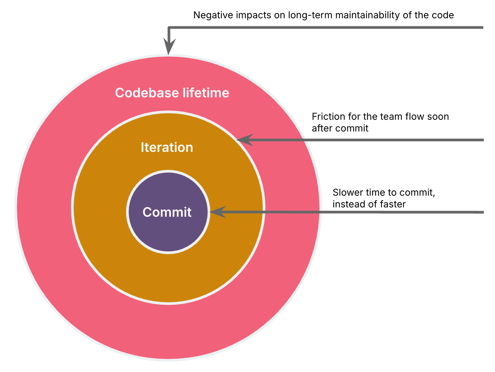

# 开发者能力在智能体编程中的作用

 
本文为 [探索生成式AI](exploring-gen-ai.md) 系列的一部分，该系列记录了 Thoughtworks 技术人员在软件开发中运用生成式 AI 技术的探索实践。

|| |
|:---|---:|
|[Birgitta Böckeler](https://birgitta.info/)| |
| |Birgitta 是 Thoughtworks 的杰出工程师，同时也是 AI 辅助交付领域专家。她拥有二十余年软件开发、架构设计及技术管理经验。|
| [原文](https://martinfowler.com/articles/exploring-gen-ai/13-role-of-developer-skills.html) |2025/3/25|

---
随着智能体编程助手的能力越来越强，人们的反应千差万别。
一些人从近期的技术进展推断并宣称：“一年之内，我们就不再需要开发者了。”。
另一些人则对 AI 生成代码的质量，以及如何让初级开发者适应这一变化中的行业环境提出了担忧。

在过去几个月里，我经常使用 Cursor、Windsurf 和 Cline 中的智能体模式，几乎完全用于修改现有代码库（而非从零编写井字棋游戏这类程序）。
整体而言，近期 IDE 集成方面的进展令我印象深刻，这些集成极大地提升了工具对我的辅助效率。它们

- 执行测试及其他开发任务，并尝试即时修复出现的错误
- 自动识别并尝试修复代码检查 (linting) 与编译错误
- 能够进行网络检索
- 部分甚至集成了浏览器预览功能，可捕获控制台错误或检查 DOM 元素

所有这些都带来了令人赞叹的 AI 协作体验，有时还能帮助我以创纪录的速度开发功能、解决问题。

然而。

即便在那些效果不错的协作场景中，我也始终在进行干预、修正和方向把控。
而且很多时候我最终决定根本不提交这些改动。
在这篇笔记中，我会列举具体的把控实例，以此说明开发者的经验与技能在这种 “智能体监督模式” 中扮演着怎样的角色。
这些实例表明，尽管技术进步令人瞩目，但在处理非简单任务时，AI 距离自主编写代码仍相去甚远。
同时，这些例子也指明了在可预见的未来，开发者依然需要具备的各类技能 —— 这也是我们必须保留并加以培养的能力。

## 我需要进行方向把控的场景
首先我想说明：对于下面列出的这些问题，AI 工具本质上就一直表现得很差。
其中部分问题即便通过更详细的提示词或自定义规则，也只能勉强缓解，无法完全解决 —— LLM 往往不会严格遵照提示词的字面要求执行。
而且编码协作的时长越久，效果就越不稳定。
因此，无论提示词设计得多严谨、编码助手集成了多少上下文获取模块，所列出的问题出现的概率都绝不可忽视。

我将这些案例按影响范围分为三类，AI 的这些失误会：

a. 反而降低我的开发效率与提交耗时（相较于无辅助编码），或
b. 对该迭代周期内的团队协作流程造成阻碍，或
c. 对代码的长期可维护性产生负面影响。

影响范围越大，团队发现这类问题的反馈周期就越长。

 

### 影响范围：代码提交耗时
这类场景中，AI 带来的阻碍反而大于帮助。
不过这其实是影响程度最轻的一类，因为这类失效模式最为明显，相关改动大概率甚至不会被纳入提交。

#### 无法运行的代码
有时我必须介入干预，才能让代码正常运行，情况就是这么简单。
我的经验要么体现在能快速修正 AI 出错的地方，要么体现在能及早判断何时放弃，要么重新开启 AI 会话，要么自己手动解决问题。

#### 问题误判
当 AI 对问题做出误判时，常常会陷入无用的深究钻牛角尖。
多数情况下，我能凭借过往处理同类问题的经验，及时把工具从歧途中拉回来。

示例：AI 判定某次 Docker 构建失败是由构建的架构设置导致，并据此修改了相关设置 —— 而实际问题根源，是复制了错误架构的 node_modules 文件。
由于这是我多次遇到的典型问题，因此能迅速发现并纠正方向。

### 影响范围：迭代中的团队协作流程
这类情况指的是，若缺乏审核与干预，会在版本交付迭代期间给团队带来协作阻碍。
我在多个交付团队的工作经验，能帮助我在代码提交前修正这些问题，因为我曾多次遇到这类次生影响。
可以想见，即便有 AI 辅助，初级开发者也会像我当年一样，只有栽进这些坑里、从中吸取教训才能掌握相关经验。
问题在于，AI 带来的编码效率提升，是否会让这类问题恶化到团队无法持续承受的地步。

#### 前期工作量过大
AI 往往倾向于一次性铺开大量工作，而非逐步实现可运行的功能片段。
这可能导致前期投入大量工作后，才发现某项技术选型不可行，或是误解了功能需求，最终造成浪费。

示例：在一次前端技术栈迁移任务中，AI 试图一次性转换所有 UI 组件，而不是先从单个组件入手，再完成一个可与后端集成的完整垂直功能模块。

#### 暴力修复而非根因分析
AI 有时会采用暴力解决的方式处理问题，而不是诊断问题的真正成因。
这会将潜在问题推迟到后续阶段，并转嫁给其他团队成员，而他们在缺乏原始变更上下文的情况下不得不重新分析。

示例：在 Docker 构建过程中遇到内存错误时，AI 直接调高了内存配置，而没有先去探究为何会占用如此多内存。

#### 使开发者工作流程复杂化
在某些场景中，AI 生成的构建工作流会带来糟糕的开发体验。
一旦提交这些改动，几乎会立刻影响其他团队成员的开发流程。

示例：将原本一条命令即可启动应用前后端的方式，拆分为两条命令。

示例：未确保热重载功能正常生效。

示例：复杂的构建配置，连我和 AI 自身都感到困惑。

示例：处理 Docker 构建错误时，未考虑如何在构建流程的更早阶段捕获这些错误。

#### 需求理解错误或不完整
有时我没有详细描述功能需求，AI 就会得出错误结论。
发现这类问题并纠正智能体不一定需要专业开发经验，只需保持关注即可。
但这种情况在我这里频繁发生，也体现出完全自主的智能体在无人监督、无人从一开始就介入干预的情况下，很容易出现工作失误。
无论是开发者自身没有同步思考需求，还是智能体完全自主运行，这类需求误解都会在后续开发阶段才被发现，进而导致大量返工和反复沟通。

### 影响范围：长期可维护性
这是最隐蔽的影响范围，因为它的反馈周期最长，这类问题可能要过数周甚至数月才会被发现。
在这些场景下，代码当前可以正常运行，但未来会变得难以修改。
遗憾的是，这也正是我二十多年编程经验发挥最大作用的一类问题。

#### 冗长且多余的测试
虽然 AI 在生成测试用例方面表现出色，但我经常发现它会新建测试函数，而不是在已有测试中补充断言；
或是添加过多断言 —— 其中一部分在其他测试里已经覆盖。
对经验不足的程序员而言可能反直觉：测试并非越多越好。重复的测试和断言越多，维护难度就越大，测试也会变得越脆弱。
这可能导致一种状况：每当开发者修改部分代码，就会有多个测试失败，进而带来更多开销与挫败感。
我曾尝试通过自定义指令缓解这一问题，但此类情况仍频繁出现。

#### 缺乏复用性
AI 生成的代码有时缺乏模块化设计，导致同一套逻辑难以在应用的其他地方复用。

示例：未意识到某个 UI 组件已在别处实现，从而编写了重复代码。

示例：使用内联 CSS 样式，而非 CSS 类与变量。

#### 代码过于复杂或冗长
有时 AI 会生成冗余代码，需要我手动删除多余部分。
这些代码要么在技术上完全多余，导致代码结构更复杂，给日后修改埋下隐患；
要么实现了超出当前实际需要的功能，增加了无效代码的维护成本。

示例：每次 AI 帮我修改 CSS 后，我都要逐行清理大量冗余样式。

示例：AI 生成了一个可动态展示 JSON 对象内部数据的全新 Web 组件，但实现得过于复杂精巧，远超当前需求。

示例：重构时，AI 未能识别现有的依赖注入链路，引入了不必要的额外参数，让设计更脆弱、更难理解。
例如，它给某个服务的构造函数新增了一个多余参数，而提供该值的依赖已经完成注入（写法类似：value = service_a.get_value(); ServiceB(service_a, value=value)）。

## 结论
从我的这些实际体验来看，无论如何想象，未来一年内都绝不可能出现能自主编写我们 90% 代码的 AI。
它能否辅助完成 90% 的代码编写工作？
或许有可能，针对部分团队和部分代码库而言。
如今在我负责的一个中等复杂度、规模相对较小（1.5 万行代码）的代码库中，AI 已经能为我 80% 的开发工作提供辅助。

 

### 如何防范 AI 失误？
那么，你该如何保护你的软件和团队免受 LLM 工具的不可靠性影响，同时又能利用 AI 编码助手带来的优势？

#### 开发者个人

- **务必仔细审查 AI 生成的代码** 。我几乎每次都能发现需要修复或改进的地方。

- **当你对当前状况感到难以掌控时，及时终止 AI 编码会话** 。
要么优化提示词并重新开始会话，要么回归手动实现 —— 就像我的同事 Steve Upton 所说的 “手工编码 (artisanal coding)”。

- 对那些短时间内神奇诞生、看似 “够用就好”，但会带来长期维护成本的方案 **保持警惕** 。

- **实践 [结对编程](https://martinfowler.com/articles/exploring-gen-ai.html#memo-05)** 。四只眼睛比两只更能发现问题，两个大脑也比单个大脑更不容易自满懈怠。

#### 团队与组织
- **沿用成熟的代码质量监控机制** 。
如果尚未部署，可搭建 SonarQube、CodeScene 这类工具，对代码异味进行告警。
这类工具虽无法覆盖所有问题，但能为安全防护体系打下良好基础。
在使用 AI 工具后，部分代码异味会更为突出，需要比以往更严格地监控，例如代码重复问题。

- **启用预提交钩子与 IDE 集成的代码审查** 。
牢记尽可能左移测试原则——有许多工具可在合并请求阶段或流水线中对代码开展审查、代码检查与安全检测。
而在开发阶段能直接发现的问题越多，效果越好。

- **重拾优秀的代码质量实践**。
针对文中所述的各类陷阱以及团队遇到的其他问题，建立相关工作惯例，强化实践规范，以缓解影响范围更广的两类问题。
例如，可以维护一份 “问题日志”，记录由 AI 生成代码导致团队协作受阻或影响代码可维护性的事件，并每周进行复盘反思。

- **利用自定义规则** 。
如今大多数编码助手都支持配置规则集或指令，这些内容会随每次提示词一同发送。
团队可以利用这一功能，逐步完善基础提示指令，将优秀实践固化为规范，减少文中列出的部分失误。
但正如前文所述，这并不能完全保证 AI 会严格遵守。
协作会话越长、上下文窗口越大，AI 的执行效果就越不稳定。

- **建立信任与开放沟通的文化**。
我们正处于一个转型阶段，这项技术正深刻改变我们的工作方式，每个人都是初学者与学习者。
拥有信任氛围和开放沟通机制的团队与组织，更善于学习并应对由此带来的不确定性。
例如，若组织以 “现在有了 AI” 为由向团队施压、要求更快交付，就会更易面临前文提到的质量风险，因为开发者可能为满足预期而投机取巧、降低标准。
而在具备高度信任与心理安全感的团队中，开发者会更愿意分享使用 AI 时遇到的挑战，帮助团队更快学习，从而最大限度发挥工具的价值。
