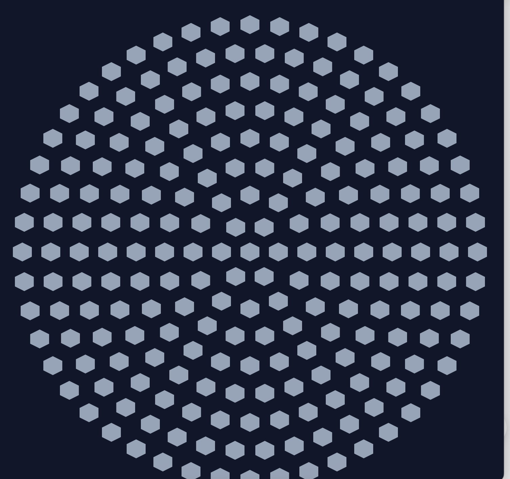
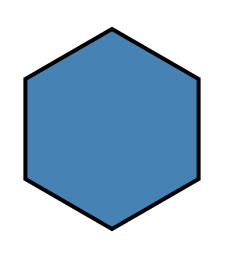
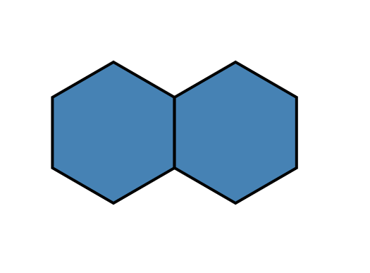
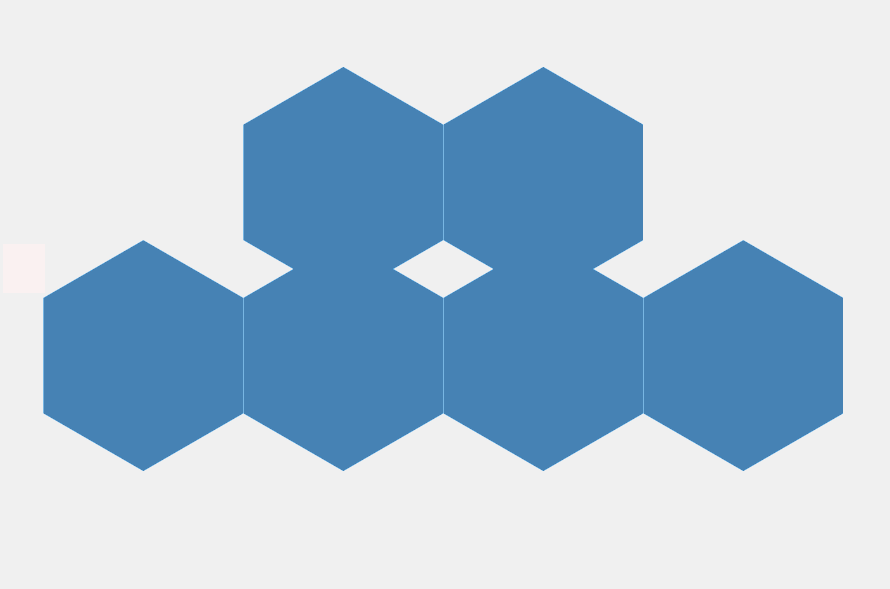
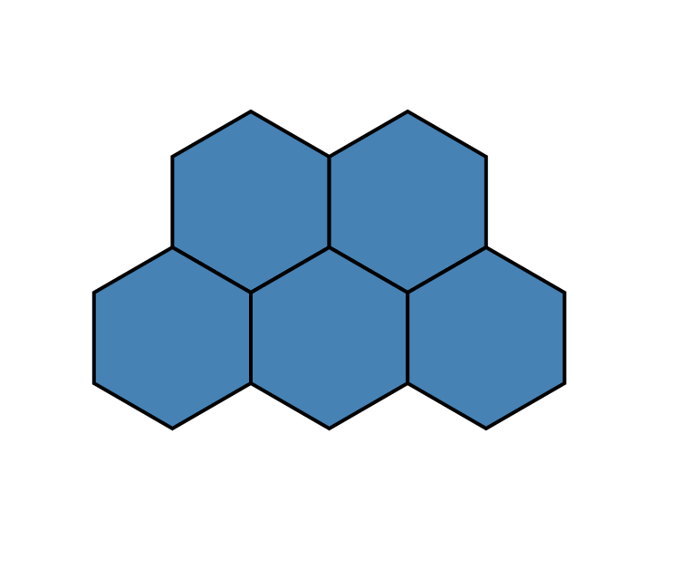
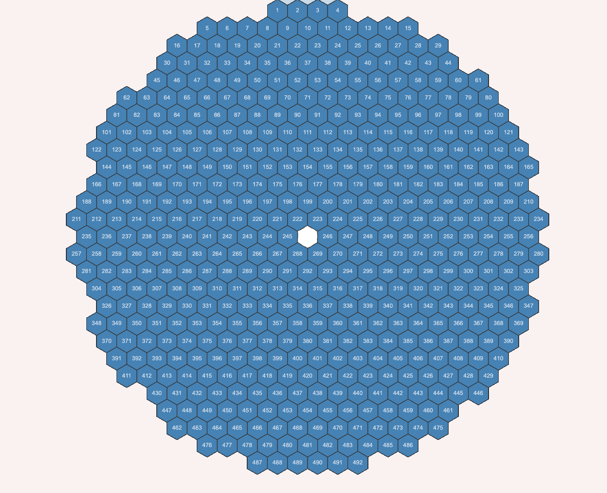

# 利用 LLM 构建三十米望远镜镜面可视化：分步实践之旅

 
本文为 [探索生成式AI](exploring-gen-ai.md) 系列的一部分，该系列记录了 Thoughtworks 技术人员在软件开发中运用生成式 AI 技术的探索实践。

|| |
|:---|---:|
|[Unmesh Joshi](https://twitter.com/unmeshjoshi)| |
| |Unmesh 是 Thoughtworks 公司的杰出工程师，常驻印度 Puna。他是 [Patterns of Distributed Systems](https://martinfowler.com/books/patterns-distributed.html) 一书的作者。|
| [原文](https://martinfowler.com/articles/exploring-gen-ai/15-building-tmt-mirror-visualization.html) |2025/4/30|

---
创建一个能可视化真实物理结构的用户界面 ——例如三十米望远镜（Thirty Meter Telescope, TMT）的主镜—— 看似需要精通几何学、D3.js 以及 SVG Graphics 等专业知识。
但借助 Claude 或 ChatGPT 这类 LLM，你无需提前掌握所有相关技术。

本文记录了一段从零开始构建复杂交互式界面的实践过程，作者此前并无 D3.js 开发经验，也缺乏通用 UI 开发背景。
该工作是为望远镜主镜研发操作界面原型的一部分，旨在实时展示各镜段的运行状态。
文章展现了 LLM 如何帮助开发者 “快速上手”，即便对底层技术不熟悉，也能搭建出可运行的原型。
更重要的是，本文说明了迭代式提示词工程 ——逐步优化你的指令—— 不仅能生成正确的代码，还能让你更清晰地理解自己想要构建的系统。

## 目标
我们需要创建一个基于 HTML 的三十米望远镜主镜可视化界面，该主镜由 492 个六边形镜段呈圆形对称排列构成。

我们最初使用描述该结构的高级提示词发起请求，但很快意识到，要实现目标，必须逐步引导 AI 完成开发。

## 第一步：初始提示词

  我想要创建一个三十米望远镜蜂窝状镜面的 HTML 展示界面。请尝试基于 HTML 和 CSS 生成该镜面的界面，它由 492 个六边形镜段按圆形排列组成，整体为蜂窝结构。
  布局需要对称，例如第一行的六边形数量与最后一行相同，第二行与倒数第二行数量相同，依此类推。
    
  “I want to create an HTML view of the Thirty Meter Telescope's honeycomb mirror.
  Try to generate an HTML and CSS based UI for this mirror, which consists of 492 hexagonal segments arranged in a circular pattern.
  Overall structure is of a honeycomb.
  The structure should be symmetric. For example the number of hexagons in the first row should be same in the last row.
  The number of hexagons in the second row should be same as the one in the second last row, etc.”

 

Claude 尝试生成了代码，但结果并不符合我的预期。
布局显得很呆板，对称性也不够理想。于是我决定采用分步实现的方式。

 

## 第二步：绘制单个六边形

  “这不是我想要的效果……我们一步一步来做。” 
“我们来绘制一个竖直边朝上的六边形，这个六边形的所有边长必须相等。” 
“我们使用 d3.js 来绘制 SVG 图形。” 
“我们只用 d3 绘制一个单独的六边形。”
    
  “This is not what I want... Let's do it step by step.” 
“Let's draw one hexagon with flat edge vertical. The hexagon should have all sides of same length.” 
“Let's use d3.js and draw svg.” 
“Let's draw only one hexagon with d3.” 

 

Claude 生成了简洁的 D3 代码，绘制出了方向和几何形状均正确的单个六边形。
代码运行成功，这让我对搭建基础组件更有信心。

经验教训：从小处着手。
在扩展复杂度之前，先确认基础功能可以正常运行。

 

## 第三步：添加第二个六边形

  “很好……现在在这个六边形旁边再添加一个。它应该与第一个六边形共享竖直边。”
    
  “Nice... Now let's add one more hexagon next to this one. It should share vertical edge with the first hexagon.”

 

Claude 调整了坐标，将第二个六边形通过对齐竖直边的方式紧贴在第一个旁边。布局逻辑开始逐渐清晰。

 

## 第四步：创建第二行

“现在我们再添加一行。 
第二行中的六边形彼此共享垂直边，与第一行的排列方式相同。 
第二行六边形的顶部斜边，应当与第一行六边形的底部斜边相互贴合（共享边）。 
第二行的六边形数量，要让第一行在第二行上方呈现**居中对齐**的效果。” 
  
“Now let's add one more row. 
The hexagons in the second row share vertical edges with each other similar to the first row. 
The top slanting edges of the hexagons in the second row should be shared with the bottom slanting edges of the hexagons in the first row. 
The number of hexagons in the second row should be such that the first row appears centrally positioned with the second row.”

 

最初的尝试未能正确对齐斜边。

  “哎呀……这并没有和上一行共享斜边。”
  
  “Oops... this does not share the slanting edges with the previous row.”

 

 

但最终，在明确了间距和偏移逻辑后，Claude 给出了正确的实现。

 

经验总结：基于几何图形的布局往往需要多次迭代，并仔细进行视觉检查。

## 第五步：扩展为对称结构

“现在我们需要创建更大的结构，增加更多行、更多六边形，要求如下：
整体呈现蜂窝状的圆形效果；
每行的六边形数量先递增、再递减，形成完美对称的结构；
六边形总数需为 492 个，与三十米望远镜（TMT）匹配；
在圆形正中心可以设置一个空白六边形（表示空位）。”
  
  “Now we need to create bigger structure with more hexagons arranged in more rows such that: The overall structure appears circular like honeycomb. The number of hexagons in the rows goes on increasing and then goes on decreasing to form a perfectly symmetric structure. The total number of hexagons needs to be 492 to match the TMT telescope. We can have an empty hexagon (showing empty space) exactly at the center of the circle.”

 

Claude 采用了基于环的布局方式来模拟圆形对称效果，但最初的结果并不理想：

  “这不是圆形，整体看起来更像一个六边形……”
  
  “This is not circular but looks more like a hexagonal overall view...”

 

随后我建议：

  “尝试让第一行和最后一行各只有6个六边形。”
  
  “Try with only 6 hexagons in the first and last row.”

 

这一调整提升了对称性，也让视觉上更接近圆形布局。
每行的六边形数量先增加后减少——完全符合预期效果。

## 第六步：调整中心开口

  “这样好多了，但我们需要在中心设置一个更小的开口。中心的黑色空白区域太大了，最多只能是1个或少数几个六边形的大小。”
  
  “This is better but we need a smaller opening at the center.The black space at the center is too big. It should be at most 1 or a few hexagons.”

 

通过缩小空白区域并重新平衡内环布局，我们最终得到了排布紧凑、圆形规整且中心仅有微小间隙的结构——与三十米望远镜（TMT）的设计完全匹配。

经验总结：将领域特定约束条件（如总数为492个）作为布局参数的调整依据。

## 第七步：添加编号与悬浮提示

   “我们要给每个六边形镜段添加编号。编号必须是连续有序的：第一行的第一个编号为 1，最后一行的最后一个编号为 492。当鼠标悬浮查看六边形镜段信息时，也要同步显示这个编号。”
  
  “We want to have a number on each hexagonal segment. They should be numbered sequentially. The first in the first row should be 1 and the last in the last row should be 492. When we show the hexagonal segment information on mouseover, we should show the number as well.”

 

Claude 最初是按照环的索引进行编号的，而非按照行的顺序。

"你现在是按照环内的位置来生成编号……但编号应该基于行来排列。
所以我们需要想办法把环映射到对应的行上。
例如，第 13 环的第 483 号镜段位于第 1 行，就应该编号为 1，以此类推。
你能提出一种将环上的镜段按这种方式映射到行的方法吗？"

这种映射关系实现之后，所有效果都完美呈现出来：

- 包含 492 个带编号镜段的圆形布局
- 中心留有小尺寸空隙
- 悬浮提示展示镜段元数据
- 从外环到内环的视觉对称性

 

## 反思
这段经历让我总结出了几个重要心得：

1. **LLM 能帮你快速上手**：即便完全不了解 D3.js 或 SVG 几何知识，我也能立刻开始开发。AI 搭建起了代码框架，而我在这个过程中完成了学习。

2. **提示词需要迭代优化** ：我的初始提示并没有错，只是不够具体。
通过每一步查看输出结果，我明确了自己的真实需求，并据此不断优化指令。

3. **LLM 通过实践助力学习** ：最终我不仅得到了可运行的界面，还收获了易于理解的代码库，以及接触新技术的实操切入点。
先动手构建，再从中学习。

## 结论
最初只是一个模糊的设计构想，最终通过与 LLM 协作开发，变成了一个可运行、对称且具备交互功能的三十米望远镜镜面可视化系统。

这段经历再次证明，提示词驱动开发不仅是生成代码，更是梳理设计思路、明确设计意图，并在构建过程中逐步理解技术的过程。

如果你曾想要探索一项新技术、开发一个用户界面，或是实现某个领域专属的可视化效果，不必等到完全掌握所有知识再动手。

借助大语言模型开始构建吧，你会在实践中不断学习。

