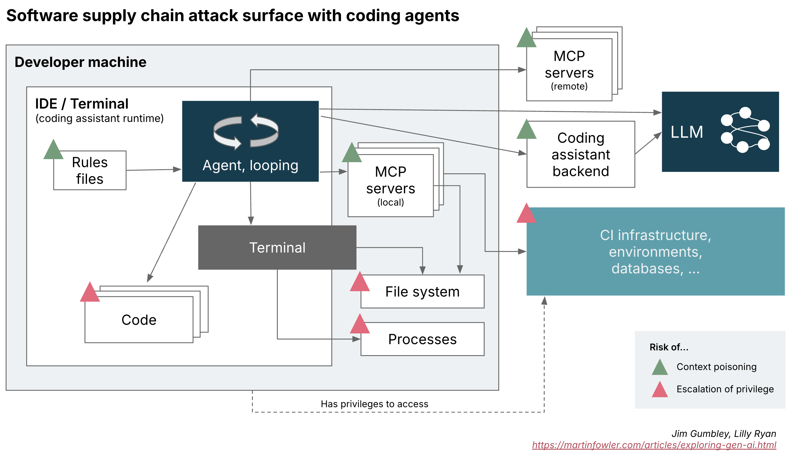

# 编码助手对软件供应链构成威胁

 
本文为 [探索生成式AI](exploring-gen-ai.md) 系列的一部分，该系列记录了 Thoughtworks 技术人员在软件开发中运用生成式 AI 技术的探索实践。

| | | | |
|---|---|---|---|
|[Jim Gumbley](https://www.linkedin.com/in/jimgumbley)| |[Lilly Ryan](https://www.linkedin.com/in/lilly-ryan/) | |
| |Jim 是 Thoughtworks 的技术顾问，专注于风险管理以及将安全能力融入软件和基础设施建设。| |Lilly Ryan 曾从事历史学研究，现转型为信息安全专家，在澳大利亚工作。|
| [原文](https://martinfowler.com/articles/exploring-gen-ai/software-supply-chain-attack-surface.html)| | |2025/5/13|

---
我们早已意识到，开发者环境是软件供应链中的薄弱环节。
出于工作需要，开发者往往拥有较高权限与较大操作自由度，会将各类组件直接集成至生产系统。
因此，在此阶段引入的任何恶意代码都可能产生广泛且严重的影响范围，尤其是涉及敏感数据与服务时。

自主型编码助手（如 Cursor、Windsurf、Cline，以及近期的 GitHub Copilot）的出现，为这一局面带来了新的变数。
这类工具不再仅仅是提供代码建议的生成器，还会通过调用工具与 “推理-行动”（ReAct）循环，主动与开发者环境进行交互。
编码助手在为软件供应链引入新组件的同时，也带来了新的安全漏洞；而这些工具本身也可能以新颖且隐蔽的方式被控制或攻陷。

## 理解智能体循环攻击面
被入侵的 MCP 服务器、规则文件，甚至某段代码或依赖项，都有可能向智能体提供被篡改的指令或命令并使其执行。
这并非无关紧要的细节 —— 相比传统开发模式或基于 AI 代码建议的系统，这种情况会显著扩大攻击面。

 

*图 1：持续部署（CD）流水线，重点展示指令与代码在这些层级之间的流转方式。该图同时标注了可能发生投毒攻击的供应链环节，以及权限提升的关键要素。*

智能体工作流的每一步都会引入风险：

- **上下文投毒 (context poisoning)** ：来自外部工具或 API 的恶意响应可能触发助手产生非预期行为，并通过反馈循环放大恶意指令。
- **权限提升 (escalation of privilege)** ：被入侵的助手（尤其是在监管宽松的情况下）可通过助手的执行流程直接执行欺骗性或有害命令。

这种复杂的迭代式环境为隐蔽却极具破坏力的攻击提供了沃土，显著拓展了传统威胁模型的边界。

传统监控工具往往难以识别恶意行为，因为当恶意活动或隐蔽的数据泄露行为隐藏在组件之间复杂、反复的交互对话中时，会更难被发现；
加之这些工具本身较新、认知度不足，且仍在快速迭代发展。

## 新增薄弱环节：MCP 与规则文件
MCP 服务器与规则文件的引入为上下文投毒创造了可乘之机 —— 恶意输入或被篡改的状态可在会话中悄然传播，进而引发命令注入、输出结果被篡改，或通过受污染代码实施软件供应链攻击。

模型上下文协议（MCP）作为一种灵活的模块化接口，可让智能体连接外部工具与数据源、维持持久化会话，并在各类工作流之间共享上下文。
然而，正如其他相关研究所指出的，MCP 本身默认缺乏内置安全机制，例如身份认证、上下文加密或工具完整性校验。
这一缺失会使开发者面临安全风险。

规则文件（例如 “Cursor 规则” ）包含预定义提示词、约束条件与指引规则，用于控制智能体在循环中的行为。
这类文件通过弥补大模型推理能力的不足，限制智能体的可执行操作、定义错误处理流程并确保任务聚焦，从而提升系统稳定性与可靠性。
尽管规则文件的设计初衷是提高行为可预测性与执行效率，但它也成为了恶意提示词可被注入的另一层载体。

## 工具调用与权限提升
编码助手已不再局限于大模型生成代码建议，而是通过函数调用执行工具操作。
例如，针对任意给定的编码任务，助手可执行命令、读取和修改文件、安装依赖项，甚至调用外部应用程序接口。

权限提升威胁是自主型编码助手带来的一项新兴风险。
恶意指令可诱导助手执行以下操作：

- 执行任意系统命令
- 修改关键配置文件或源代码文件
- 引入或传播已被入侵的依赖项

由于开发者通常拥有较高的本地权限，一旦助手被攻陷，攻击者可从本地环境进一步渗透至范围更广的生产系统，或是企业内开发者通常可访问的各类敏感基础设施。

## 如何利用编码智能体保障安全？
截至本文发布时，编码助手仍是相当新颖且处于发展中的技术。
但恰当的安全防护措施已开始呈现出一些共性思路，其中许多都属于非常经典的安全最佳实践。

- 沙箱隔离与最小权限访问控制：务必严格限制授予编码助手的权限。严格的沙箱环境能够有效缩小攻击影响范围。

- 软件供应链审查：将 MCP 服务器与规则文件视为关键供应链组件，像审核第三方库与框架依赖一样对其进行细致核查。

- 监控与可观测性：对智能体发起的文件系统变更、对 MCP 服务器的网络调用、依赖项修改等操作实施日志记录与审计。

- 在威胁建模工作中明确纳入编码助手的工作流与外部交互行为，评估这类助手所引入的潜在攻击向量。

- <ins>人工参与闭环：自动接受变更会大幅提升恶意行为的发生风险，切勿过度依赖大模型</ins>。

最后一点尤为重要。
<ins>AI 的快速代码生成可能导致审核疲劳，开发者会在未充分理解或验证的情况下，下意识信任 AI 输出的内容</ins>。
对自动化流程过度自信，或是所谓的 “氛围编程”，会大幅增加无意中引入漏洞的风险。
在负责交付生产环境软件的专业开发团队中，培养安全警惕意识、保持良好的编码习惯，以及树立认真负责的守护文化，依然至关重要。

自主型编码助手无疑能提升开发效率，然而，这些增强的能力也伴随着显著扩大的安全隐患。
只有清晰认识这些新型风险，并切实应用持续、自适应的安全管控措施，开发者与企业才能在不断发展的 AI 辅助软件开发环境中，更好地防范新兴威胁。
