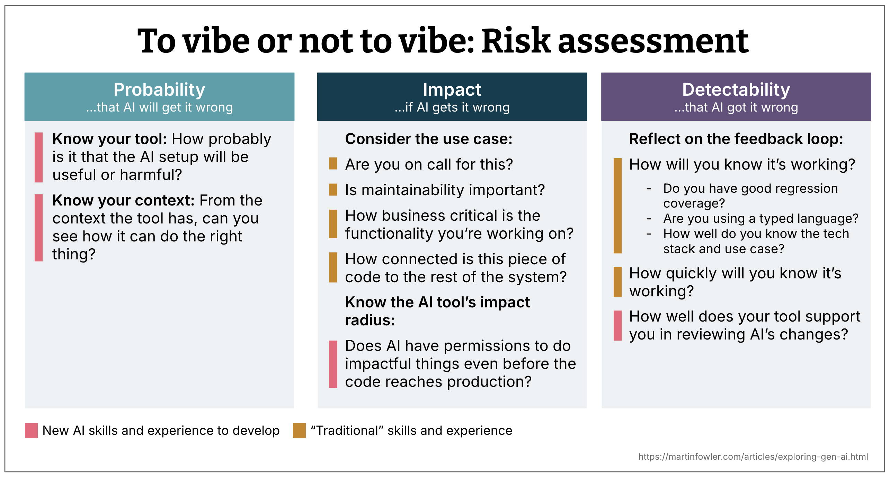
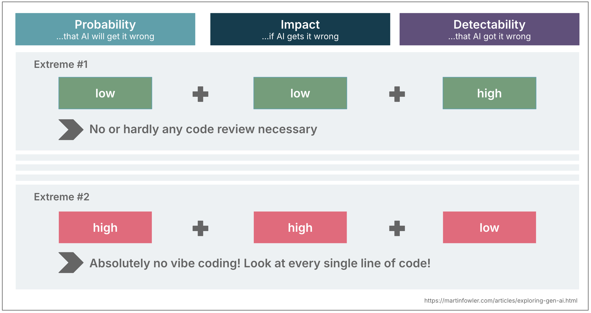

# 氛围还是不氛围

 
本文为 [探索生成式AI](exploring-gen-ai.md) 系列的一部分，该系列记录了 Thoughtworks 技术人员在软件开发中运用生成式 AI 技术的探索实践。

|| |
|:---|---:|
|[Birgitta Böckeler](https://birgitta.info/)| |
| |Birgitta 是 Thoughtworks 的杰出工程师，同时也是 AI 辅助交付领域专家。她拥有二十余年软件开发、架构设计及技术管理经验。|
| [原文](https://martinfowler.com/articles/exploring-gen-ai/to-vibe-or-not-vibe.html) |2025/9/23|

---
关于 AI 生成代码应进行何种程度审查的讨论，往往显得非常非黑即白。
氛围编码 (vibe coding)（即让 AI 生成代码而不去查看代码）究竟是好是坏？
答案当然是两者都不是，因为 “视情况而定”。

那么这取决于什么呢？

在使用 AI 进行编码时，我发现自己会不断进行微小的风险评估：
是否要信任 AI、信任程度如何，以及需要投入多少工作量来验证结果。
而且我使用 AI 的经验越丰富，这些评估就越精准、越直观。

风险评估通常结合三个因素：

- 发生概率
- 影响程度
- 可检测性

对这三个维度进行思考，有助于我决定是否使用 AI、是否需要审查代码，以及以何种细致程度进行审查。
这也能帮我思考可以采取哪些缓解措施，在利用 AI 提升效率的同时，降低其生成错误内容的风险。

## 1. 发生概率：AI 出错的可能性有多大？
以下是一些有助于你判断发生概率这一维度的因素。

### 了解你的工具
AI 编码助手的表现取决于所使用的模型、工具内部的提示词编排逻辑，以及助手与代码库、开发环境的集成程度。
作为开发者，我们无法完全掌握其底层运行逻辑，尤其是在使用商用闭源工具时。
<ins>因此，对工具质量的评估，既要参考其宣称的功能特性，也要结合我们过往的实际使用经验</ins>。

### 该用例是否适合 AI 处理？
该技术栈在训练数据中是否普遍存在？
你希望 AI 生成的解决方案复杂度如何？需要 AI 解决的问题规模有多大？

你还可以从更宽泛的角度考虑，当前用例是否需要高度 “正确性”。
例如，是严格按照设计稿实现一个界面，还是粗略绘制一个原型界面。

### 留意可用的上下文
出错概率不仅取决于模型和工具，还与可用上下文相关。
上下文包括你提供的提示词，以及智能体通过工具调用等方式能够获取的所有其他信息。

- AI 助手是否拥有足够的 **代码库访问权限** ，以便做出合理判断？
它能否看到相关文件、代码结构和领域逻辑？
如果不能，它生成无效代码的概率就会升高。

- 你所使用工具的 **代码搜索策略** 效果如何？
部分工具会为整个代码库建立索引，部分会对文件执行类似 grep 的即时搜索，还有一些会借助抽象语法树（AST）构建代码关系图。
了解所选工具采用的策略会有所帮助，不过最终只有通过实际使用经验，才能判断该策略的真实效果。

- **代码库是否适配 AI 使用** ？
也就是说，其结构是否便于 AI 处理？
代码是否模块化，拥有清晰的边界与接口？
还是一团混乱的 “泥球”，会迅速占满上下文窗口？

- **现有代码库是否能起到良好示范作用** ？
抑或是充斥着临时补丁与反模式？
如果是后者，在你没有明确告知 AI 优质范例的情况下，它生成同类糟糕代码的概率就会升高。

## 2. 影响程度：如果 AI 出错而你没有发现，后果会是什么？
这一考量主要和 **使用场景** 相关。
你是在做技术验证代码，还是生产环境代码？
你是否需要为所开发的服务值班值守？
它属于业务核心功能，还只是内部工具？

一些实用的自检判断：
- 如果今晚需要你值班处理故障，你还会上线这段代码吗？
- 这段代码的影响范围是否很大，例如是否被大量其他组件或调用方使用？

## 3. 可检测性：AI 出错时你能否发现？
这关乎反馈循环。
你是否有完善的测试？
是否使用强类型语言？
所用技术栈是否能让故障显而易见？
你是否信任工具的变更追踪与差异对比功能？

这也取决于你自身对代码库的熟悉程度。
如果你对技术栈和业务场景非常了解，就更有可能发现可疑之处。

这个维度很大程度上依赖传统工程能力：测试覆盖率、系统知识、代码审查规范。
即便代码由 AI 完成，它也决定了你能对结果抱有多大信心。

## 传统技能与新技能的结合
你可能已经注意到，这类评估问题中有许多需要用到 “传统” 工程技能，而另一些

 

## 三者结合：代码审查力度的动态调整
将这三个维度综合考量，就能指导你进行相应程度的监督。
我们以极端情况为例说明这一思路：

- **出错概率低 + 影响程度低 + 可检测性高** 
可以氛围编码！只要功能正常、达成目标，我完全不用审查代码。

- **出错概率高 + 影响程度高 + 可检测性低** 
建议进行严格审查。假定 AI 可能出错并做好兜底。

当然，大多数情况都介于两者之间。

 

## 示例：遗留系统逆向工程
我们近期为一位客户开展了遗留系统迁移工作，第一步便是借助 AI 对现有功能生成详细说明文档。

* **AI 生成错误描述的概率为中等：**
  - **工具因素** ：我们所使用的模型往往无法很好地遵照指令执行
  - **可用上下文** ：我们无法获取全部代码，后端代码完全不可用
  - **应对措施** ：我们多次运行提示词以抽查结果差异，并通过分析反编译后的后端二进制文件提升判断可信度。

* **错误描述造成的影响为中等：**
  - **业务场景** ：该系统供该机构数千家外部商业合作伙伴使用，因此重构出错会对企业声誉与营收带来业务风险
  - **复杂度** ：但另一方面，应用程序复杂度相对较低，因此我们预计修复错误会比较容易
  - **计划应对措施** ：对新应用采用分阶段逐步上线的方式。

* **错误描述的可检测性为中等：**
  - **安全保障** ：无现成测试套件可供交叉验证
  - **专家支持** ：我们计划邀请领域专家参与审核，并编写功能一致性对比测试

若没有这样一套结构化的评估方法，我们很容易出现审查不足或过度审查的情况。
而通过这种方式，我们校准了工作方案，并提前规划了应对措施。

## 结语
这种微型风险评估会逐渐成为你的第二天性。
使用 AI 的次数越多，你对这些问题的判断就越有直觉。
你会慢慢能分辨出哪些改动可以放心采用，哪些则需要更细致地检查。

我们的目的不是用检查清单拖慢自己的节奏，而是培养出直观的工作习惯，帮你在充分利用 AI 能力的同时，降低其带来的负面风险。
