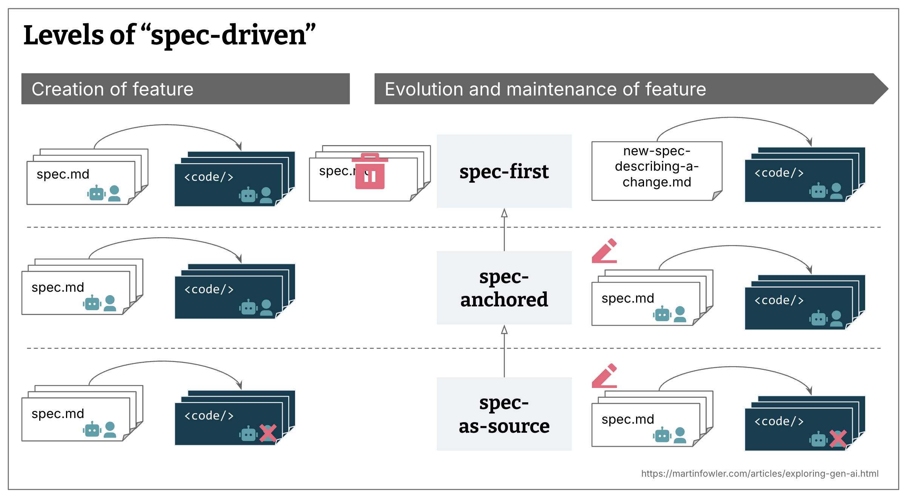
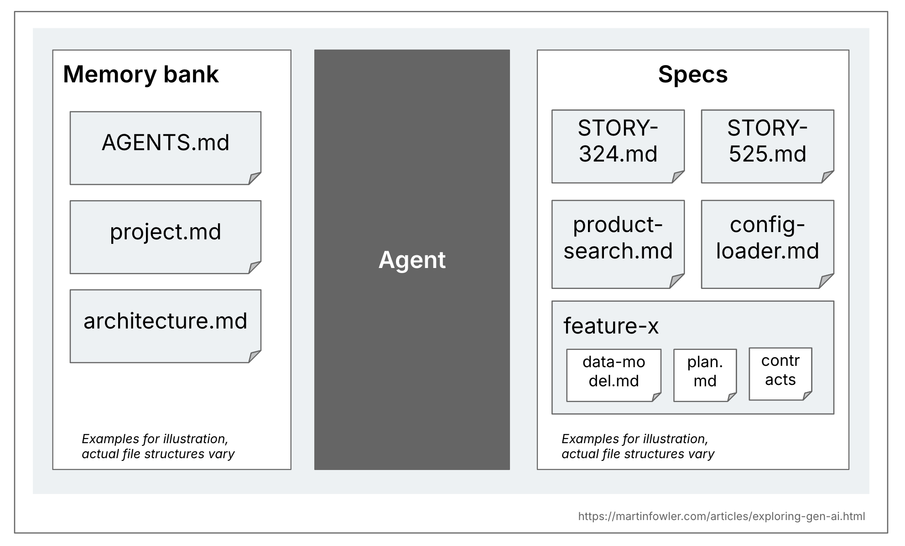
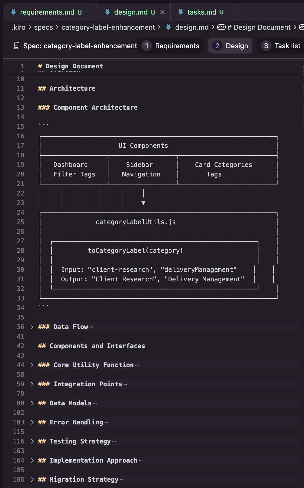
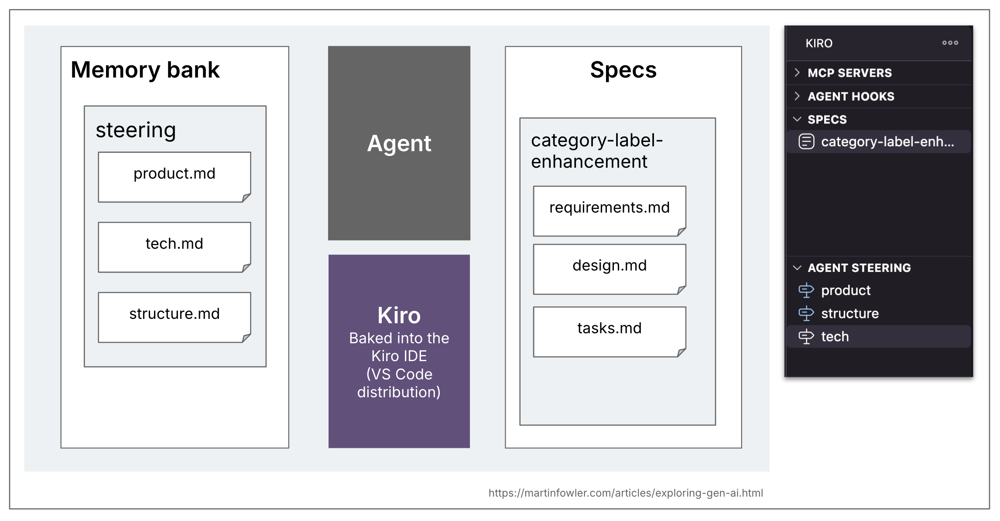
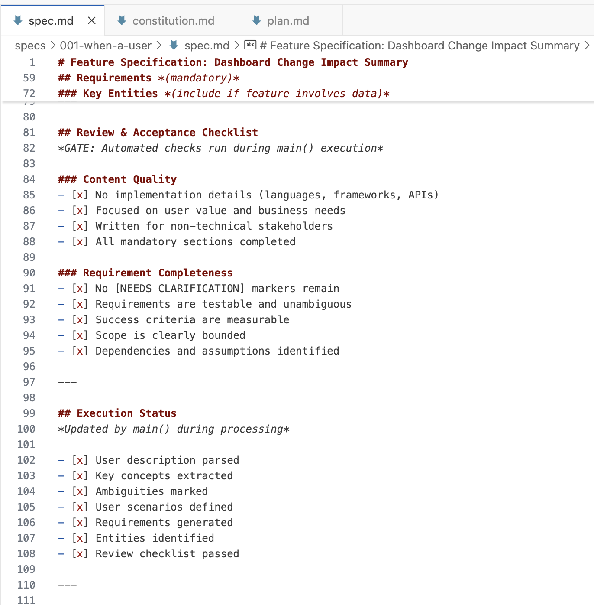
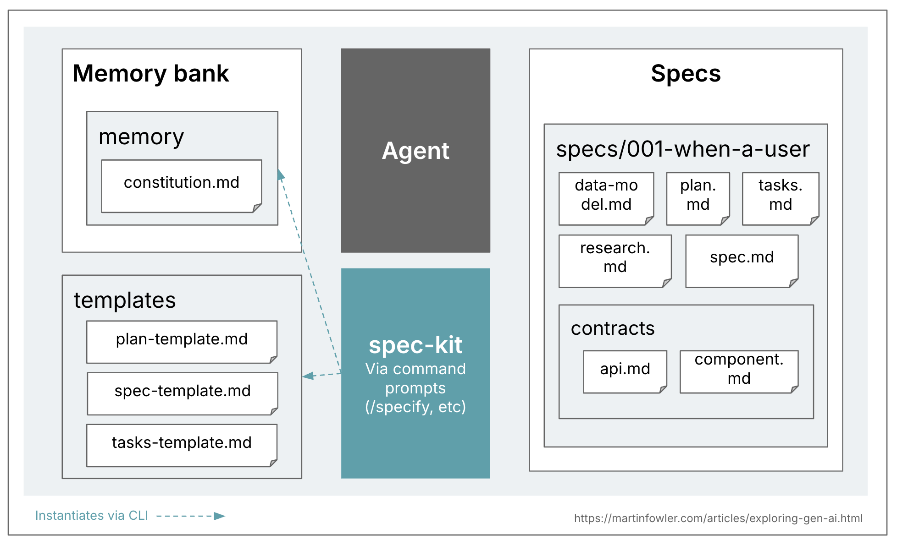
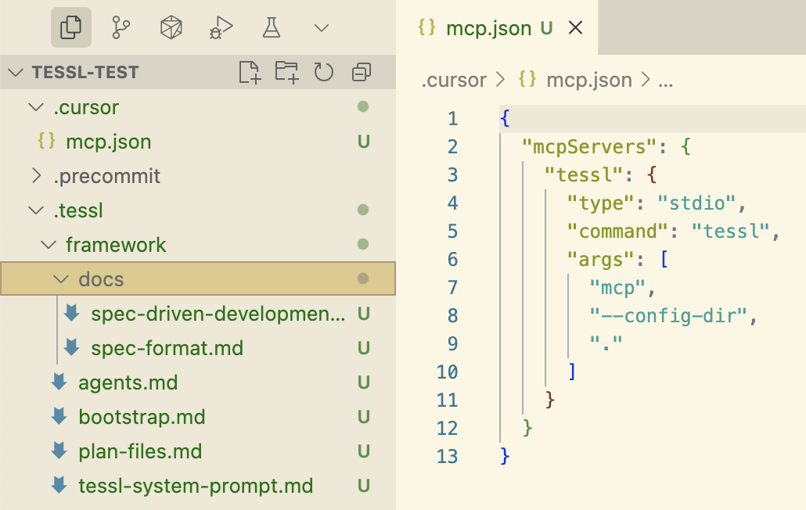
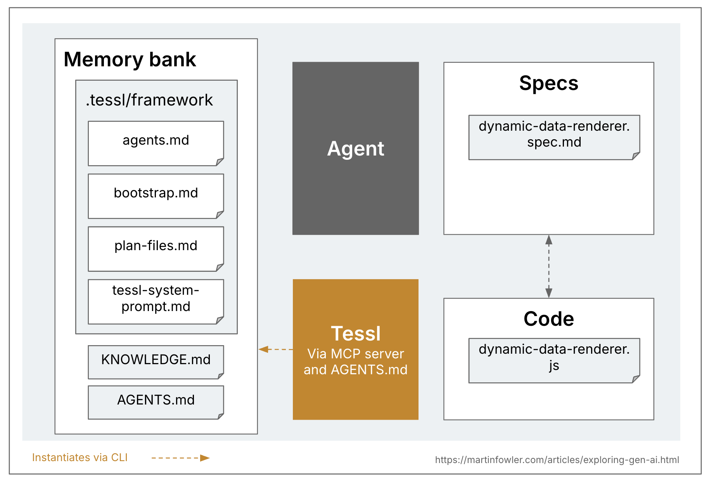
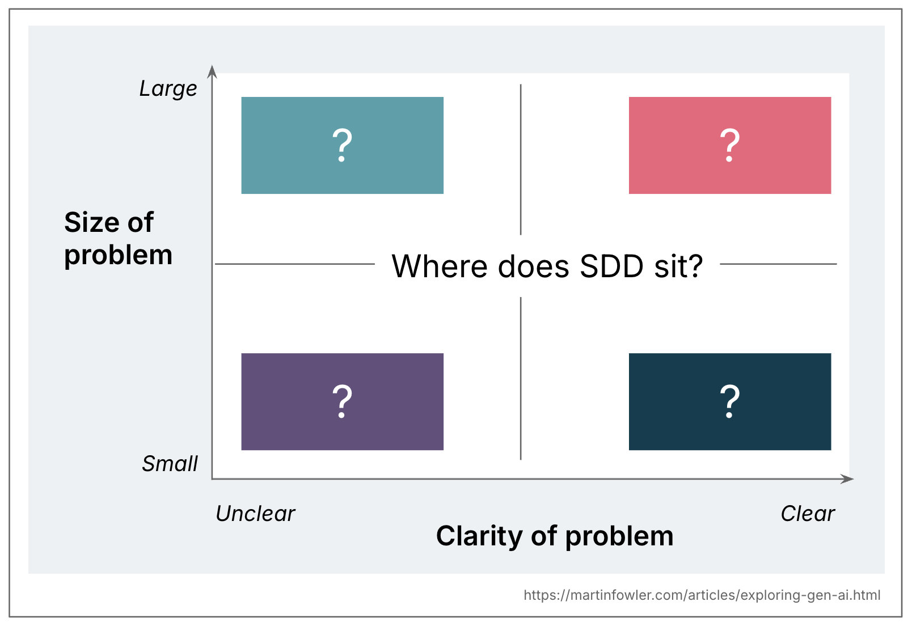
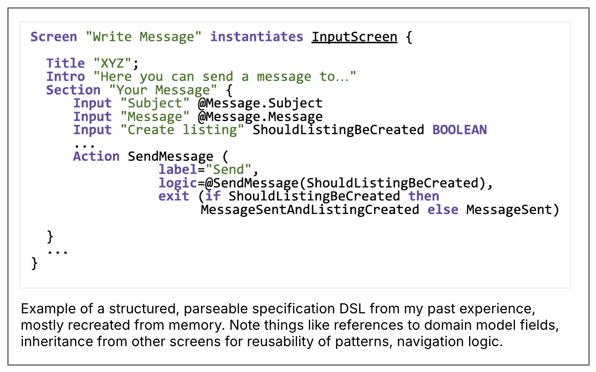

# 理解规范驱动开发：Kiro、spec-kit 与 Tessl

 
本文为 [探索生成式AI](exploring-gen-ai.md) 系列的一部分，该系列记录了 Thoughtworks 技术人员在软件开发中运用生成式 AI 技术的探索实践。

|| |
|:---|---:|
|[Birgitta Böckeler](https://birgitta.info/)| |
| |Birgitta 是 Thoughtworks 的杰出工程师，同时也是 AI 辅助交付领域专家。她拥有二十余年软件开发、架构设计及技术管理经验。|
| [原文](https://martinfowler.com/articles/exploring-gen-ai/sdd-3-tools.html) |2025/10/15|

---
我一直在尝试理解最新的 AI 编程热门术语之一：规范驱动开发（Spec-driven development, SDD）。
我研究了三款自称为 SDD 工具的产品，并试图厘清目前这个概念的含义。

## 定义
和这个快速发展领域中许多新兴术语一样，“规范驱动开发”（SDD）的定义仍在不断演变。
根据我目前观察到的使用方式，我总结出其含义：规范驱动开发指在使用 AI 编写代码之前先撰写一份 “规范”（“文档先行”）。
这份规范将成为开发人员与 AI 共同遵循的权威依据。

[GitHub](https://github.com/github/spec-kit/blob/main/spec-driven.md) ：“在这个全新的领域中， *维护软件意味着持续完善规范* 。……
开发的通用语言提升到了更高层次，而代码只是最后一公里的实现手段。”

[Tessl](https://docs.tessl.io/introduction-to-tessl/concepts) ：“一种以规范 (specs) ——而非代码—— 作为核心产物的开发模式。
规范以结构化、可测试的语言描述设计意图，再由智能体生成与之匹配的代码。”

在梳理了该术语的各类用法以及部分宣称实现 SDD 的工具后，我发现这一模式实际上存在多个不同的实现层次。

1. **规范先行**：先编写经过周密思考的规范，再将其用于当前任务的 AI 辅助开发流程中。

2. **规范锚定**：在任务完成后仍保留规范，持续用于对应功能的迭代与维护。

3. **规范即源码**：规范长期作为核心源文件，人工仅编辑规范，从不直接修改代码。

我所见过的所有 SDD 方法与定义都属于 **规范先行**，但并非所有都力求做到 **规范锚定** 或 **规范即源码**。
而且对于规范长期该如何维护，相关表述往往含糊不清，甚至完全没有说明。

下图展示了实际观察到的三个 SDD 层级，分为 "功能创建" 和 "功能迭代与维护" 两列，每个层级各占一行。 
  <ul>
    <li>
      <b>规范先行</b>：先有规范文档，再生成代码；规范和代码旁均标注机器人与人形图标，表示 AI 与开发者共同编辑规范与代码。功能创建完成后，规范被丢弃；迭代时会重新编写一份描述变更的新规范。
    </li>
    <li>
      <b>规范锚定</b>：流程与规范先行一致，但功能创建后规范不会被删除，而是在迭代阶段持续更新。
    </li>
    <li>
      <b>规范即源码</b>：流程与规范锚定一致，但代码文件旁的人形图标被划去，表示开发者不再直接编辑代码。
这三个概念通过空心继承箭头相连，体现出它们是逐层递进、相互依托的关系。
    </li>
  </ul>

 

 

## 什么是规范？
就定义而言，核心问题自然是：什么是规范？
目前似乎尚无统一的定义，我见过最接近共识的定义是将规范比作 “产品需求文档 (Product Requirements Document)”。

当下这个术语的含义相当宽泛，以下是我尝试给出的定义：

规范是一种结构化、面向行为的产出物（或一组相关产出物），以自然语言编写，用于表述软件功能，并为 AI 编码智能体提供指导。
不同形式的规范驱动开发，都会各自定义规范的结构、详细程度，以及这类产出物在项目中的组织方式。

我认为，在**规范**与代码库中更通用的上下文文档之间，有一个很有意义的区别需要区分。
这类通用上下文包括规则文件、产品及代码库的高层说明等。
有些工具将这类上下文称为 [记忆库 (memory bank)](https://docs.cline.bot/prompting/cline-memory-bank) ，本文中我也采用这个说法。
这些文件适用于代码库中所有的 AI 编码会话，而规范仅与实际创建或修改特定功能的任务相关。

 
*一张概览图将智能体上下文文件分为两类：*
  - ***记忆库**（示例文件：AGENTS.md、project.md、architecture.md）*
  - ***规范**（示例文件：Story-324.md、product-search.md，以及包含 data-model.md、plan.md 等文件的 feature-x 文件夹）*

## 评估 SDD 工具的难点
事实证明，要以贴近真实使用场景的方式评估 SDD 工具与开发方案，会耗费大量时间。
你需要在不同规模的问题、全新项目和遗留系统中对其进行测试，并且不能只是粗略浏览，而要花时间仔细审核、修改中间产出物。
正如 [关于 spec-kit 的 GitHub 博客文章](https://github.blog/ai-and-ml/generative-ai/spec-driven-development-with-ai-get-started-with-a-new-open-source-toolkit/) 所言：
“至关重要的是，你的角色不只是引导，更是验证。在每个阶段，你都要复盘并优化。”

在我测试过的三款工具中，有两款在接入现有代码库时似乎需要投入更多工作量，这也让评估它们在遗留系统中的实用性变得更加困难。
在听到相关人员在 “真实” 代码库中使用它们一段时间后的使用反馈之前，对于这类工具在实际场景中的落地效果，我仍有许多待解的疑问。

话虽如此，我们还是来了解一下这三款工具。
我会先介绍它们的工作原理（或者说我所理解的工作原理），最后再分享我的观察与疑问。
需要注意的是，这些工具迭代速度极快，因此自 9 月份我使用过后，它们很可能已经发生了更新变化。

## Kiro
Kiro 是我测试过的三款工具中最简单（最轻量）的一款。
它基本属于规范先行模式，我找到的所有示例都仅将其用于单个任务或用户故事，并未提及如何以规范锚定的方式，在多个任务中长期使用这份需求文档。

### **工作流程** ：
需求 → 设计 → 任务

工作流的每一步都对应一份 Markdown 文档，Kiro 会在其基于 VS Code 的发行版中引导你完成这三个步骤。

### **需求** ：
以需求列表形式组织，每条需求对应一个 “用户故事”（采用 “As a……” 格式），并附带验收标准（采用 “GIVEN……WHEN……THEN……” 格式）。

 
*一张 Kiro 需求文档的截图。*

### **设计**：
在我的测试中，设计文档包含下图截图所示的几个章节。目前我只保留了其中一次尝试的结果，所以不确定这是固定结构，还是会根据任务不同而变化。

 
*一张 Kiro 设计文档的截图，展示了组件架构图，以及折叠起来的几个章节：数据流、数据模型、错误处理、测试策略、实现方案、迁移方案。*

### 任务：
一份可追溯至需求编号的任务清单，该清单附带额外的UI元素，用于逐个执行任务并查看每个任务的变更内容。

 
*一张 Kiro 任务文档的截图，展示了一个任务旁带有 “任务进行中”，“查看变更” 的 UI 元素。每个任务均为待办事项项目列表，末尾附有需求编号列表（1.1、1.2、1.3）。*

Kiro 同样引入了记忆库的概念，该工具将其称作 “引导（steering）”。
记忆库的内容灵活可变，其工作流似乎并不依赖任何特定文件（我在发现 steering 部分之前就已经尝试使用它了）。
当你让 Kiro 生成 steering 文档时，它创建的默认拓扑结构是 product.md、structure.md、tech.md。

 
*这是此前概览图针对 Kiro 的定制版本：记忆库部分包含一个 steering 文件夹，其中有三个文件，分别是 product.md、tech.md 和 structure.md；规范区域则展示一个名为 category-label-enhancement（我的测试功能名称）的文件夹，里面包含 requirements.md、design.md 和 tasks.md。*

## spec-kit
spec-kit 是 GitHub 推出的 SDD 工具。
它以命令行工具（CLI）的形式发布，可针对各类常用编码助手创建工作区配置。
该结构搭建完成后，你便可在编码助手中通过斜杠命令与 spec-kit 交互。
由于其所有产出文件都会直接放入你的工作区，因此它也是本文介绍的三款工具中可定制化程度最高的一款。

 
*VS Code 界面截图：左侧为 spec-kit 生成的文件夹结构（命令文件存放于 `.github/prompts`，另有 `.specify` 目录，包含 memory、scripts、templates 子文件夹）；右侧为已打开的 GitHub Copilot 界面，用户正在输入 `/specify` 命令。*

### 工作流：
章程 → 𝄆 定义规范 → 规划 → 任务 𝄇

spec-kit 的记忆库理念是规范驱动开发模式的前提条件。
该工具将其称为 [章程（constitution）](https://github.com/github/spec-kit/blob/main/spec-driven.md#the-constitutional-foundation-enforcing-architectural-discipline)。
章程中应包含 “不可变更” 的高层原则，且适用于每一次代码变更。
它本质上是一份功能强大的规则文件，在整个工作流中被大量使用。

在每个工作流阶段（定义规范、规划、任务）中，spec-kit 会借助 bash 脚本和若干模板生成一系列文件与提示词。
工作流会大量运用文件内的检查清单，追踪需要用户明确的事项、违反章程的问题、调研任务等内容。
<ins>这些清单类似每个工作流阶段的 “完成标准”，不过由 AI 进行解读，因此无法保证会被百分百遵守</ins>。

 
*一张 spec.md 文件末尾部分的截图，展示了一系列用于内容质量、需求完整性、执行状态的检查清单。*

下面是一张概览图，用于说明我在 spec‑kit 中看到的文件结构。请注意一个规范是由多个文件共同组成的。

 
*这是此前的概览图，针对 spec‑kit 的定制版本：记忆库部分包含 constitution.md 文件。图中额外多出一个标注为 “templates” 的区域，这是 spec‑kit 中的特有概念，里面存放用于规划、规范和任务的模板文件。规范区域展示一个名为 “specs/001-when-a-user”（这正是我测试时 spec‑kit 自动生成的名称）的文件夹，其中包含 8 个文件：data-model、plan、tasks、spec、research、api、component。*

乍一看，GitHub 似乎在 [追求规范锚定的方式](https://github.blog/ai-and-ml/generative-ai/spec-driven-development-with-ai-get-started-with-a-new-open-source-toolkit/)
（ “这就是我们重新思考规范的原因 —— 不将其视为静态文档，而是随项目演进的动态可执行产物。
规范将成为共享的权威依据。
当逻辑不通时，你回到规范；
当项目变得复杂时，你完善规范；
当任务过于庞大时，你拆分规范。” ）
然而，spec‑kit 会为每一个创建的规范新建一个分支，这似乎表明，在他们看来，规范只是变更请求生命周期内的动态产物，而非功能的整个生命周期内的产物。
[社区讨论](https://github.com/github/spec-kit/discussions/152) 中也在谈论这种概念上的混淆。
这让我认为，spec‑it 目前仍只能算作规范先行，而非长期的规范锚定。

## Tessl 框架
（仍处于非公开测试阶段）

与 spec-kit 类似，Tessl 框架以命令行工具（CLI）的形式发布，可为多种编码助手创建完整的工作区与配置结构。
该命令行工具同时也可作为 MCP 服务器使用。

 
*Cursor 编辑器界面截图：左侧文件树中显示了 Tessl 创建的文件（.tessl/framework 文件夹），右侧为已打开的 MCP 配置界面，该配置会以 MCP 模式启动 tessl 命令。*

Tessl 是这三款工具中唯一一款明确以规范锚定模式为目标的工具，甚至还在探索 SDD 中的规范即源码层级。
Tessl 规范可作为被持续维护和编辑的核心产物，生成的代码文件顶部甚至会标注注释：`// GENERATED FROM SPEC - DO NOT EDIT`。
目前规范与代码文件为 1:1 映射，即一份规范对应代码库中的一个文件。
但由于 Tessl 仍处于测试阶段，相关方案还在不断试验优化中，因此未来很可能会扩展为一份规范对应包含多个文件的代码组件。
其正式版最终将支持何种模式，还有待观察。
（Tessl 团队自身认为，该框架相比其当前已公开的产品 Tessl Registry，更偏向于面向未来的技术布局。）

下面是我使用 Tessl CLI 对现有代码库中的一个 JavaScript 文件进行逆向工程（命令：`tessl document --code ...js`）后得到的规范示例：

 
*一张 Tessl 规范文件的截图。*

@generate、@test 这类标签似乎用于告知 Tessl 需要生成哪些内容。
API 部分体现了这样一种设计思路：
至少在规范中定义好向代码库其他部分暴露的接口，以此确保所生成组件中这些更为关键的部分完全由维护者掌控。
执行 `tessl build` 命令即可根据该规范生成对应的 JavaScript 代码文件。

将 “规范即源码” 模式下的规范设定在较低的抽象层级，且按单个代码文件进行维护，很可能能够减少 LLM 所需执行的步骤与解读工作，进而降低出错概率。
不过，即便在这样低的抽象层级下，我仍切实观察到了生成结果的不确定性 —— 用同一份规范多次生成代码时，结果会存在差异。
<ins>通过不断迭代规范、使其愈发具体来提升代码生成的可重复性，是一项很有意思的实践。
这个过程也让我再次体会到，编写一份无歧义且完整的规范会面临诸多陷阱与挑战。</ins>

 
*这是我们之前的概览图，针对 Tessl 的定制版本：记忆库区域包含一个 `.tessl/framework` 文件夹，内含 4 个文件，此外还有 KNOWLEDGE.md 和 AGENTS.md。规范区域展示了一个文件 dynamic-data-renderer.spec.md，即规范文件。该图中还设有一个代码区域，包含文件 dynamic-data-renderer.js。规范区域与代码区域之间有双向箭头相连，因为在 Tessl 的模式下，二者会保持相互同步。*

## 观察与疑问
这三款工具均自称是规范驱动开发的落地实现，但彼此之间差异显著。因此在探讨规范驱动开发时，首先需要明确一点：该模式并非只有单一形态。

### 一套工作流适配所有规模？
Kiro 与 spec-kit 各自提供了一套既定工作流，但我十分确定，二者均不适用于大多数实际编码场景。
尤其是目前尚不清楚，它们如何适配足够多样的问题规模，从而具备普遍适用性。

当我让 Kiro 修复一个小缺陷（就是我之前用来测试 Codex 的同一个问题）时，很快就发现这套工作流简直是杀鸡用牛刀。
需求文档把这个小缺陷拆成了 4 个 “用户故事”，合计 16 条验收标准，其中还包括一些很夸张的条目，比如：
“用户故事：作为开发者，我希望转换函数能优雅处理边界情况，以便在引入新的分类格式时系统依然保持健壮。”

我在使用 spec-kit 时也遇到了类似的问题：我并不确定它适合处理多大规模的需求。
现有的教程通常都是基于从零搭建应用来讲解的，因为这样最适合做成教程。
我最终尝试的一个实际场景，是在我之前团队里大概算 3–5 分故事点数的一个功能。
这个功能依赖大量已有代码，需要做一个概览弹窗，汇总现有仪表盘中的一批数据。
以 spec-kit 所需的步骤数量，以及它生成的一大堆需要我逐一审阅的 Markdown 文件来看，对于这个规模的需求，这套流程依然显得杀鸡用牛刀。
这个问题比我用 Kiro 测试的那个要复杂一些，但对应的工作流也繁琐得多。
我甚至都没有完成完整的实现，但我感觉，光是运行 spec-kit 并审阅其输出结果所花的时间，我用 “普通的” AI 辅助编码就已经把这个功能写完了，而且可控感会强得多。

一款好用的 SDD 工具，至少需要针对不同规模、不同类型的变更，提供几种核心工作流的灵活适配能力。

### 审阅 Markdown 还是审阅代码？
正如刚才提到的，并且从上面的工具介绍中也能看到，spec‑kit 生成了大量 Markdown 文件需要我审阅。
这些内容彼此重复，也和已有代码重复，部分文件甚至已经包含了代码。
整体来看，这些文档过于冗长，审阅起来十分枯燥繁琐。
Kiro 相对好一些，因为只需要处理 3 个文件，而且 “需求 → 设计 → 任务” 的思维模型更直观易懂。
但正如之前所说，即便只是修复一个小缺陷，Kiro 生成的内容也还是过于繁琐。

说实话，我宁愿审阅代码，也不想看这么多 Markdown 文档。
一款好用的 SDD 工具，必须提供非常优质的规范审阅体验。

### 虚假的掌控感？
即便拥有这些文件、模板、提示词、工作流和检查清单，我也经常发现智能体最终并没有完全遵循所有指令。
诚然，上下文窗口如今变得更大，这一点也常被提及为规范驱动开发得以实现的条件之一。
但上下文窗口更大，并不意味着 AI 能准确理解并执行其中的所有内容。

例如：spec‑kit 在规划阶段设有一个调研步骤，它针对现有代码和已实现功能做了大量调研，这一点做得很好，因为我要求它在已有代码基础上新增一个功能。
但最终智能体忽略了 “这些是对现有类的描述” 这一说明，直接将其当作全新规范重新生成了一遍，造成了重复代码。
而且我遇到的不仅是忽略指令的情况，有时智能体还会因为过于积极地执行指令（比如遵循章程中的某条规则）而做得过火。

过往经验表明，我们对所开发内容保持掌控的最佳方式是采用小型、迭代式的步骤。
因此我对大量前置性规范设计的做法持怀疑态度，尤其是在内容过于冗长的情况下。
一款实用的 SDD 工具必须适配迭代式开发模式，然而小型工作包似乎又与 SDD 的理念相悖。

### 如何有效区分功能规范与技术规范？
在 SDD 中，刻意区分功能规范与技术实现是一种常见理念。
其核心愿景我认为是：最终可以由 AI 完成所有方案设计与细节实现，并且基于同一套规范切换到不同技术栈。

但在实际使用 spec-kit 时，我常常困惑于该停留在功能层面，还是该补充技术细节。
相关教程与文档在这一点上也不够统一，对于 “纯功能” 的真正定义似乎存在不同解读。
回想我职业生涯中见过的大量用户故事，很多都没能正确区分需求与实现，作为一个行业，我们在这方面的实践记录并不算好。

### 目标用户是谁？
许多规范驱动开发工具的演示与教程都会涉及产品定义、功能目标等内容，甚至还会用到 “用户故事” 这类术语。
其背后的思路或许是：借助 AI 实现跨技能协作，让开发者更深入地参与需求分析？
或是让开发者在这套工作流中与产品人员结对协作？
但这些都没有被明确说明，相关内容只是默认开发者会独立完成所有分析工作。

在这种情况下，我不禁再次思考： SDD 究竟适用于何种规模与类型的问题？
它大概率不适合那些需求仍十分模糊的大型功能开发，毕竟这类工作显然需要更专业的产品与需求分析能力，以及调研、利益相关方参与等诸多环节。

 
*一张 2×2 矩阵图：横轴为 “问题清晰程度”，纵轴为 “问题规模”。四个象限均标注问号，图表中央写着：“SDD 应处于哪个位置？”*

### 规范锚定与规范即源码：我们是否在以史为鉴？
尽管很多人会将 SDD 与 TDD 或行为驱动开发（BDD）类比，但我认为，尤其对于规范即源码这一理念而言，另一个值得对照的重要方向是模型驱动开发（MDD）。
在我职业生涯初期，我参与过几个重度使用 MDD 的项目，而在试用 Tessl 框架时，这些经历不断在我脑海中浮现。
MDD 中的模型本质上就是规范，只不过并非采用自然语言，而是通过自定义 UML 或文本化领域特定语言（DSL）等形式来表达。
我们当时会构建定制化代码生成器，将这些规范转化为实际代码。

 
*一段来自我过往经验、结构化且可解析的规范领域特定语言示例，基本凭记忆还原。Screen “Write Message” 继承自 InputScreen 并实例化：{ … } 该示例体现了对领域模型字段的引用、为复用模式而继承其他 Screen、导航逻辑等相关设计。*

归根结底，MDD 从未在业务应用领域真正普及开来：它所处的抽象层级十分尴尬，只会带来过多的额外开销与约束。
但 LLM 消除了 MDD 的部分开销与限制，因此人们重新燃起希望，认为如今我们终于可以专注于编写规范，再直接从中生成代码。
借助 LLM ，我们不再受限于预定义、可解析的规范语言，也无需构建复杂的代码生成器。
当然，为此付出的代价是 LLM 生成结果的不确定性。
而我们如今也失去了可解析结构曾经带来的诸多优势：过去我们可以为规范编写者提供大量工具支持，帮助其编写合法、完整且一致的规范。
我不禁怀疑，“规范即源码” 乃至 “规范锚定” 最终是否会同时背负 MDD 与 LLM 两者的缺点：既不够灵活，又存在不确定性。

需要明确的是，我并非在怀念过去的 MDD 经历，也不是在主张 “不如把那套方案重新搬回来”。
但在如今探索规范驱动开发的过程中，我们应当借鉴过往从规范生成代码的尝试，从中吸取经验教训。
