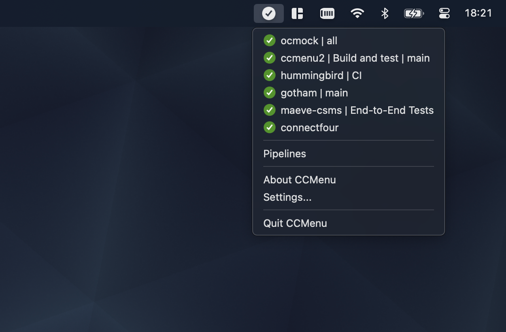
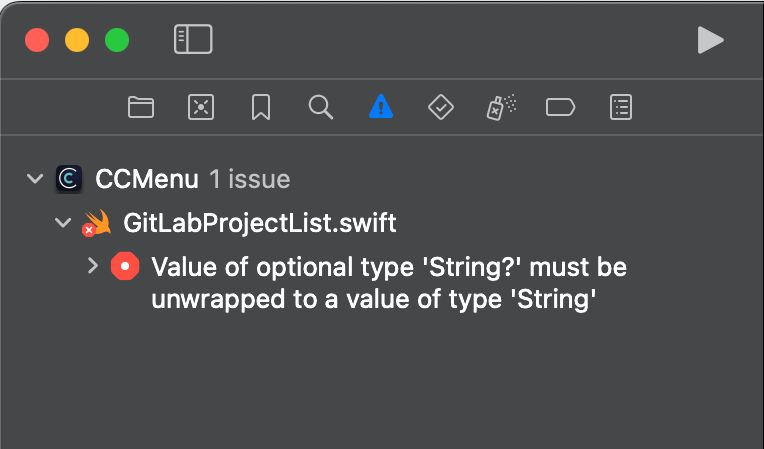

# 在使用智能体编码时评估内在质量

</br>
本文为 [探索生成式AI](exploring-gen-ai.md) 系列的一部分，该系列记录了 Thoughtworks 技术人员在软件开发中运用生成式 AI 技术的探索实践。

|| |
|:---|---:|
|[Erik Doernenburg](https://www.linkedin.com/in/edoernenburg/)| |
| |Erik 是一位经验丰富的技术专家与软件工程师。他始终关注新兴技术，并追求卓越的软件开发。|
| [原文](https://martinfowler.com/articles/exploring-gen-ai/ccmenu-quality.html) |2026/1/27|

---
关于 AI 编码助手、智能体以及多智能体集群如何在短时间内编写大量代码、且据称能实现所需功能的报道比比皆是。
在这类讨论中，人们很少提及性能、安全性等非功能性需求，或许是因为在作者们的许多使用场景中，这些并非关注点。
而对智能体生成代码的质量进行评估的情况则更为少见。
不过我认为，代码的内在质量至关重要，它决定了开发工作能否在数年内保持可持续的节奏，而非因自身负担过重而崩溃。

因此，我们不妨深入探究一下 AI 工具在 [代码内在质量](https://martinfowler.com/articles/is-quality-worth-cost.html#SoftwareQualityMeansManyThings) 方面的表现。
我们将借助智能体为现有应用添加一项功能，并观察整个过程中发生的情况。
当然，这 “仅仅” 是一个案例，本文绝非一项系统性研究。
但与此同时，根据我的经验，我们将会看到的诸多现象都存在共性规律，至少可以进行一定程度的推演。

## 我们要实现的功能
我们将基于 [CCMenu](https://ccmenu.org/) 的代码库进行开发，这是一款 Mac 端应用程序，可在 Mac 菜单栏中展示持续集成/持续部署（CI/CD）构建的状态。
这一任务增加了一定难度，原因在于 Mac 应用采用 Swift 语言编写 —— 该语言虽较为常用，但普及度不及 JavaScript 或 Python。
同时，作为一门现代编程语言，它具备复杂的语法与类型系统，对代码精准度的要求也远高于 JavaScript 和 Python。

</br>
*展示流水线列表及其状态的 CCMenu 截图*

CCMenu 会通过调用构建服务器 (build servers) 的 API，定期从这些服务器获取构建状态。
目前该应用支持采用 Jenkins 等工具所实现的旧式协议的服务器，同时也支持 GitHub Actions 工作流。
用户需求最多、但当前尚未支持的服务器是 GitLab。
因此，我们要实现的功能就是：在 CCMenu 中添加对 GitLab 的支持。

## API 封装层
GitHub 提供了 [GitHub Actions API](https://docs.github.com/en/rest/actions?apiVersion=2022-11-28) ，该接口稳定且文档完善。
GitLab 则提供了 [GitLab API](https://docs.gitlab.com/api/rest/) ，其文档同样十分详尽。
从问题领域的特性来看，二者在语义上颇为相似，但并不完全相同，后续我们会看到这一点对开发任务产生的影响。

在内部实现中，CCMenu 使用三个专门针对 GitHub 的文件来从 API 获取构建状态：一个 Feed 读取器、一个响应解析器，以及一个包含封装 GitHub API 的 Swift 函数的文件，其中包含如下示例函数：

```Swift
  func requestForAllPublicRepositories(user: String, token: String?) -> URLRequest
  func requestForAllPrivateRepositories(token: String) -> URLRequest
  func requestForWorkflows(owner: String, repository: String, token: String?) -> URLRequest
```

这些函数会返回 URLRequest 对象，该对象属于 Swift SDK 的一部分，用于执行实际的网络请求。
由于这些函数在结构上十分相似，因此它们会将 URLRequest 对象的构建委托给一个共享的内部函数：

```Swift
  func makeRequest(method: String = "GET", baseUrl: URL, path: String,
        params: Dictionary<String, String> = [:], token: String? = nil) -> URLRequest
```

即使你不熟悉 Swift 也没关系，只要能识别出参数及其类型就足够了。

## 可选 tokens
接下来，我们再详细看一下 token 参数。
对 API 的请求可以进行身份验证，但并非必须验证。
这使得像 CCMenu 这样的应用能够访问仅限特定用户查看的信息。
对于大多数 API（包括 GitHub 和 GitLab）而言，令牌只是一个长字符串，需要放在 HTTP 请求头中传递。
*（译注：此处的 token 不是 LLM 中的 token。这里指的是 GitHub API 中的参数）*

在实现中，CCMenu 使用可选字符串类型来表示 token，在 Swift 中，这种类型是在类型后加问号来标识的，本例中为 `String?`。
这是符合 Swift 习惯的用法，而且 Swift 会强制要求接收这类可选值的代码以安全的方式处理可选性，从而避免经典的空指针问题。
该语言还提供了一些特殊语法特性来简化这一过程。

有些函数在未进行身份验证的情况下没有意义，例如 `requestForAllPrivateRepositories`。
这类函数会将 token 声明为非可选类型，以此向调用方表明必须提供 token。

## 我们开始吧
我已经做过好几次这个实验了：夏天时用了 Windsurf 和 Sonnet 3.5，最近又用 Claude Code 和 Sonnet 4.5 试了一遍。
整体思路基本一致：把任务拆分成更小的模块。
针对每个模块，我先让 Windsurf 制定方案，再让它编写实现代码；
而使用 Claude Code 时，我直接让它生成实现代码，依靠模型自身的规划能力，一旦代码走向出现偏差，就借助 Git 回滚。

第一步，我大致是这样向智能体提问的：

<div style="background-color: #0a2463; padding: 8px; border-left: 4px solid lightblue;">
  “参照用于 GitHub 的 API、Feed 读取器和响应解析器这三个文件，为 GitLab 实现相同的功能。
  只编写这三个文件对应的 GitLab 版本代码，不要修改界面。”
  </br></br>
  “Based on the GitHub files for API, feed reader, and response parser, implement the same functionality for GitLab. Only write the equivalent for these three files. Do not make changes to the UI.”
</div></br>

这个需求听起来很合理，整体上也确实如此。
即便是能力稍弱的 Windsurf 模型，也识别出了关键差异并做了相应处理。
比如它知道 GitHub 中的 “repository” 在 GitLab 里叫 “project”；
也发现了 JSON 响应格式的区别 —— GitLab 会直接在顶层返回运行结果数组，而 GitHub 则是把这个数组作为顶层对象的一个属性返回。

当时我还没有查阅 GitLab 的 API 文档，只是粗略扫了一眼生成的代码，看起来一切都还不错：代码能编译通过，就连复杂的函数类型也生成正确了。可事实真的如此吗？

## 第一个意外情况
在接下来的步骤中，我让智能体实现用于添加新流水线/工作流的 UI。
我特意要求它暂时不用考虑身份验证，只实现可公开访问信息的流程。
关于这一步的详细讨论或许会放在另一篇笔记中，但新代码需要以某种方式预留出后续可能支持 token 的逻辑。

```Swift
  var apiToken: String? = nil
```

然后它就可以在调用封装函数时使用这个变量。

```Swift
  let req = GitLabAPI.requestForGroupProjects(group: name, token: apiToken)
  var projects = await fetchProjects(request: req)
```

apiToken 变量被正确声明为可选 String 类型，目前初始化为 nil。
后续代码可以根据用户是否已登录，从其他位置获取令牌。
这段代码引发了第一个编译错误：

</br>
*Xcode 面板截图，显示 GitLabProjectList.swift 中的一处编译错误。错误信息为：“可选类型 'String?' 的值必须解包为 'String' 类型才能使用”。*

这是怎么回事呢？原来，第一步生成的 API 封装代码存在一个不太明显的问题：它在所有封装函数中都把 token 声明为了非可选类型，例如：

```swift
  func requestForGroupProjects(group: String, token: String) -> URLRequest
```

底层的 `makeRequest` 函数不知为何创建得是正确的，其中的 token 被声明为可选类型。

代码之所以能编译通过，是因为按照这些函数的写法，封装函数内部确定会得到一个字符串，而这个字符串自然可以传给一个接收可选字符串，参数可以是字符串或空值（nil）的函数。
但现在，在上面这段代码中，我们持有的是一个可选字符串，它无法直接传给一个需要（确定存在的）字符串的函数。

## 临时修复 (vibe fix)
出于偷懒，我直接把错误信息复制粘贴回给了 Windsurf。
（不用 Xcode 开发 Swift 应用完全是另一回事，我还记得之前用 Cline 做过一次实验，它反复来回添加和移除显式导入语句，每次迭代差不多要花 20 美分。）
AI 针对这个问题给出的修复方案是有效的：它修改了调用处的代码，并使用 Swift 的 `??` 运算符，在没有 token 时插入空字符串作为默认值。

```swift
  let req = GitLabAPI.requestForGroupProjects(group: name, token: apiToken ?? "")
  var projects = await fetchProjects(request: req)
```

这样修改后代码可以编译，而且某种程度上能运行：如果没有 token ，就会用空字符串代替，这意味着传给函数的参数要么是 token，要么是空字符串 —— 它始终是一个字符串，永远不会是 nil。

那么，问题出在哪里？将 token 声明为可选类型的核心意义，就是为了表明该 token 是可选的。
AI 忽略了这一点，并引入了新的语义：现在用空字符串来表示没有可用 token。

这种做法：
- 不符合 Swift 惯用写法
- 不具备自解释性
- 不被 Swift 类型系统所支持

同时，这还要求在每一处调用该函数的地方都进行修改。

## 真正的修复
当然，智能体本应做的，只是修改封装函数的声明，将 token 设为可选类型。
做出这一处修改后，一切都会按预期正常运行，语义也能保持不变；
而且只需在函数参数类型上添加一个问号 `?` 即可，不必在代码里到处使用 `?? ""` 这种写法。

## 这真的重要吗？

你可能会问，我是不是在吹毛求疵。
我并不这么认为。
在我看来，这是一个很典型的例子：
如果放任 AI 智能体自行处理，它会让代码库变得更糟，而需要有经验的开发者发现问题，并引导智能体给出正确的实现。

而且，这只是我遇到的众多案例之一。
在某个环节，智能体还曾想要引入一个完全多余的缓存机制，并且，它当然无法解释自己为什么会提出加缓存的建议。

它同样没有意识到，GitHub 中存在的用户与组织重叠的情况在 GitLab 中并不存在，反而去实现了一套复杂的逻辑来处理一个根本不存在的问题。
我不得不反复引导智能体去查阅文档中的对应部分，才让它不再坚持认为这套逻辑是必要的。

它还 “忘记” 使用现有的函数来构建 URL，而是在多个地方重复编写这类逻辑，并且往往没有完整实现所有功能，例如通过 macOS 系统默认设置来覆盖基础 URL 以供测试使用的选项。

所以，在这些情况中 ——类似的问题还有很多—— 生成的代码是能运行的，也实现了所需的功能。
但这些新代码同时也会引入完全不必要的复杂度，并且遗漏了一些不那么直观的功能，降低了代码库的质量，还引入了不易察觉的问题。

如果说构建大型软件系统教会了我一件事，那就是：在软件的内在质量、代码库的质量上投入精力，是一笔值得的投资。
不要被技术债务压得喘不过气。
无论是人还是智能体，在复杂的代码库上工作都会变得更加困难。
然而，如果缺乏细致的监督，AI 智能体似乎很容易产生技术债务，让未来的开发工作对人和智能体都变得更加艰难。

## 还有一点
如果可能的话，CCMenu 会显示触发构建的用户/操作者的头像。
在 GitHub 中，头像 URL 是构建状态 API 响应数据的一部分。
而 GitLab 采用了 “更简洁”、更符合 REST 风格的设计，不会在构建响应中附带额外的用户信息。
头像 URL 必须通过向 `/user` 端点发起单独的 API 请求来获取。

Windsurf 和 Claude Code 在这个问题上都栽了大跟头。
我记得有一段很长的对话，Claude Code 一直试图说服我头像 URL 就在响应数据里。
（它很可能搞混了，因为文档的同一页面描述了多个接口。）
最后我发现，不借助智能体自己实现这个功能反而更省事。

## 我的结论
在夏季的实验期间，我一直持观望态度。
Windsurf 搭配 Sonnet 3.5 的组合确实加快了代码编写速度，但需要精心设计提示词进行规划，
而且我不得不在 Windsurf 和 Xcode 之间来回切换（用于构建、运行测试和调试），这总让人感到混乱，很快就令人疲惫。
生成的代码质量存在明显问题，智能体还常常陷入反复修复某个问题的死胡同。
所以整体而言，我并没有从使用这款智能体中获得太多收益。
<ins>我放弃了自己喜欢的编码工作，换来的却是监督一个总写出粗糙代码的 AI</ins>。

而使用 Claude Code 和 Sonnet 4.5 的情况则有所不同。
它需要的提示词更少，生成的代码质量也更高。
虽然绝算不上高质量代码，但确实有所改善，需要的返工和优化质量的提示词都更少。
此外，在终端窗口中与 Claude Code 对话，同时打开 Xcode，比在两个集成开发环境之间切换要自然得多。
对我来说，这些优势足以让我开始经常使用 Claude Code。
