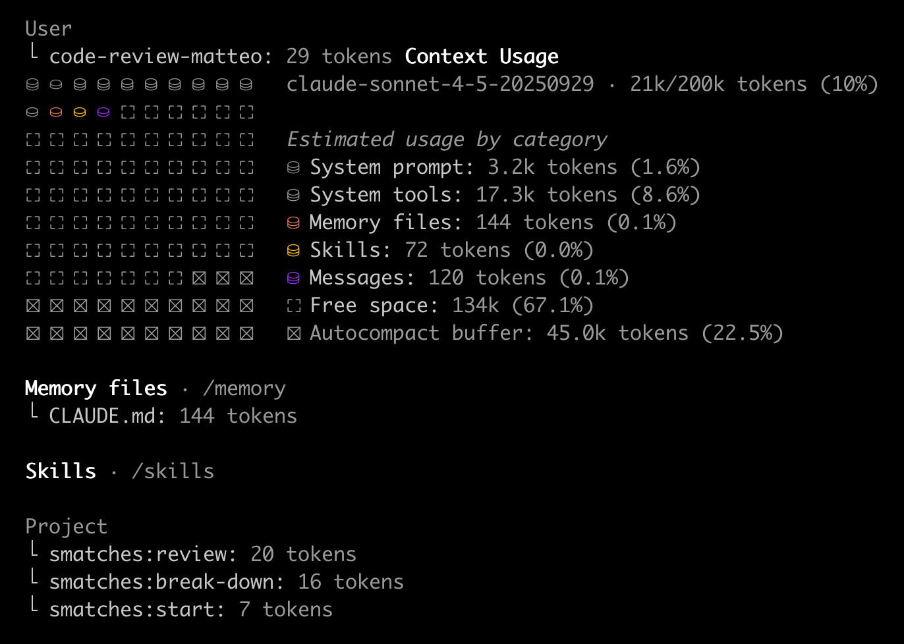

# 面向代码智能体的上下文工程

 
本文为 [探索生成式AI](exploring-gen-ai.md) 系列的一部分，该系列记录了 Thoughtworks 技术人员在软件开发中运用生成式 AI 技术的探索实践。

|| |
|:---|---:|
|[Birgitta Böckeler](https://birgitta.info/)| |
| |Birgitta 是 Thoughtworks 的杰出工程师，同时也是 AI 辅助交付领域专家。她拥有二十余年软件开发、架构设计及技术管理经验。|
| [原文](https://martinfowler.com/articles/exploring-gen-ai/context-engineering-coding-agents.html) |2026/2/5|

---
过去几个月里，我们可用于配置和丰富代码智能体上下文的选项数量激增。
Claude Code 在该领域的创新中处于领先地位，而其他代码助手也在迅速跟进。
强大的上下文工程，正成为这些工具开发者体验中至关重要的一部分。

当然，上下文工程适用于所有类型的智能体以及大语言模型的各类使用场景。
我的同事 [Bharani Subramaniam 对此有一个简洁的定义](https://www.thoughtworks.com/insights/podcasts/technology-podcasts/talking-context-engineering)：
“上下文工程就是精心筛选模型所能获取的信息，从而获得更优的结果。”

对于代码智能体，目前涌现出了一系列上下文工程方法和术语。
其基础是工具提供的配置功能（如 “rules”，“skills”），而核心细节则在于我们如何从理念层面运用这些功能（如 “specs”、各类工作流）。

这篇笔记是对上下文配置功能现状的入门介绍，文末将以 Claude Code 为例进行说明。

## 什么是代码智能体中的上下文？
“一切皆为上下文” —— 不过，我认为代码智能体的上下文配置主要包含以下几大类。

### 可复用提示词
几乎所有形式的 AI 代码上下文工程，最终都会用到一批包含提示词的 Markdown 文件。
我在这里使用最广义的 “提示词” 概念，就像 2023 年时的定义：提示词是我们发送给 LLM 以获取回复的文本。
在我看来，这些提示词背后主要有两类意图，我将其分别称为：

- **指令**：告知智能体执行某项操作的提示词，例如：“按照以下方式编写端到端测试：……”

- **指导原则**（也称规则、约束规范）：智能体应当遵循的通用惯例，例如：“编写的测试用例始终保持相互独立。”

这两类概念时常相互融合，但我依然发现对其加以区分是很有意义的。

### 上下文接口
对于我所称的 “上下文接口 (context interfaces)”，我并未找到公认的术语：它是向 LLM 描述的、在其认为需要时可用于获取更多上下文信息的方式。

- **工具** ：内置能力，例如执行 bash 命令、搜索文件等。

- **（MCP）服务器** ：运行在你的设备（或服务器）上的自定义程序或脚本，用于让智能体访问各类数据源并执行其他操作。

- **技能 (skills)* ：这是代码上下文工程领域的新成员，指对额外资源、指令、文档、脚本等内容的描述，LLM 可在判断其与当前任务相关时按需加载。

你配置的此类内容越多，它们在上下文中占用的空间就越大。
因此，针对特定任务审慎地规划所需的上下文接口，是一种更具策略性的做法。

 
*代码上下文可视化概览，展示系统提示词、上下文接口、指令与指导原则、对话历史*

#### 工作区中的文件
代码智能体中最基础且最强大的上下文接口是文件读取与搜索，用于理解你当前的代码库，因此我在此特别提及。
值得思考的是，你现有的代码作为上下文的适配程度，本质上就是你的 [代码库设计是否对 AI 友好](https://www.thoughtworks.com/radar/techniques/ai-friendly-code-design) 。

## 何时加载、是否加载：由谁决定加载上下文？
- **LLM** ：允许 LLM 自主决定何时加载上下文，是无人干预运行智能体的前提条件。
但模型是否真的会在我们预期的时机加载上下文，始终存在一定的不确定性（甚至可以说是非确定性）。示例：技能 (skills)

- **人工** ：由人工触发上下文加载能让我们获得控制权，但会降低整体自动化程度。示例：斜杠命令

- **智能体软件** ：部分上下文功能由智能体软件自身在确定的时机自动触发。示例：Claude Code 钩子

## 多少：尽可能精简上下文
上下文工程的目标之一，是平衡提供的上下文信息量——既不过少，也不过多。
尽管上下文窗口在技术上已经变得非常大，但这并不意味着不加区分地向其中塞入信息是个好做法。
当智能体接收的上下文过多时，其执行效率会下降，当然，过多的上下文也会带来成本消耗。

部分上下文体量管理取决于开发者：我们创建多少上下文配置，以及在其中放入多少文本。
我的建议是，像规则文件这类上下文内容要逐步构建，不要从一开始就塞入过多信息。
如今的模型能力已经相当强，半年前你可能必须放进上下文的内容，现在或许已经不再必要。

工具能否清晰展示上下文的占用程度，以及各类内容分别占据多少空间，是帮助我们把握这种平衡的关键功能。

 
*Claude Code 的 /context 命令结果示例，该命令可清晰展示上下文中各类内容分别占用多少空间*

但这并非完全取决于我们，部分代码智能体工具在底层优化上下文方面也比其他工具更出色。
它们会定期压缩对话历史，或优化工具的呈现方式（例如 [Claude Code 的工具搜索工具](https://www.anthropic.com/engineering/advanced-tool-use)）。

## 示例：Claude Code
以下是截至 2026 年 1 月 Claude Code 的上下文配置功能概览，以及它们在上述维度中的归属：

### [CLAUDE.md](http://claude.md/)
**类型** ：指导原则 (Guidance)

**加载决策者** ：Claude Code —— 在会话开始时始终加载

**使用时机** ：适用于整个项目、最常重复的通用约定

**示例用例** ：
- “我们使用 yarn，不使用 npm”
- “运行任何操作前不要忘记激活虚拟环境”
- “重构时不考虑向后兼容性”

**其他代码助手** ：几乎所有代码助手都具备这种主 “规则文件” 功能；已有将其标准化为 [AGENTS.md](https://agents.md/) 的尝试。

### [Rules](https://code.claude.com/docs/en/memory#modular-rules-with-claude/rules/)
**类型** ：指导原则 (Guidance)

**加载决策者** ：Claude Code，在加载配置路径下的文件时触发

**使用场景** ：用于对指导原则进行组织和模块化，从而控制始终加载的 CLAUDE.md 文件大小。
规则可按文件范围设定（例如为所有 TypeScript 文件设定 *.ts），这意味着它们仅在相关场景下才会被加载。

**示例用例** ：“编写 bash 脚本时，变量应写作 ${var} 而非 $var。”
路径：**/*.sh

**其他代码助手** ：越来越多的代码助手支持这种基于路径的规则配置，例如 GitHub Copilot 和 Cursor。

### [斜杠命令](https://code.claude.com/docs/en/slash-commands)
**类型** ：指令 (Instructions)

**加载决策者** ：人工

**使用场景** ：通用任务（代码审查、提交、测试等），你已为其编写了特定的较长提示词，并希望手动触发执行。
该功能在 Claude Code 中已废弃，由技能（Skills）替代。

**示例用例** ：/code-review · /e2e-test · /prep-commit

**其他代码助手** ：为常见功能，例如 GitHub Copilot 和 Cursor。

### [技能 (Skills)](https://code.claude.com/docs/en/sub-agents)
**类型** ：指导原则、指令、文档、脚本……

**加载决策者** ：LLM（基于技能描述）或人工

**使用场景** ：最简单的用法是，针对那些你只希望在与当前任务相关时才 “懒加载” 的指导原则或指令。
但你也可以将任意额外资源和脚本放入技能文件夹，并在主文件 SKILL.md 中引用以加载它们。

**示例用例**：
- JIRA 访问（例如技能描述智能体如何通过命令行工具访问 JIRA）
- “React 组件需遵循的规范”
- “如何集成 XYZ API”

**其他代码助手** ：Cursor 的 “智能应用 (Apply intelligently)” 规则与此类似，不过它们现在也正在切换为 Claude Code 风格的技能。

### [子智能体](https://code.claude.com/docs/en/sub-agents)
**类型** ：指令 + 模型配置与可用工具集；将在独立的上下文窗口中运行，可并行执行

**加载决策者** ：LLM 或人工

**使用场景** ：
- 适合在独立上下文内运行的常见大型任务，以提升效率（通过更精准的上下文优化结果）或降低成本
- 需要使用默认模型以外其他模型的任务
- 需要特定工具 / MCP 服务器，且不希望在默认上下文中始终启用的任务
- 可编排的工作流

**示例用例** ：
- 为刚刚构建的所有功能创建端到端测试
- 由独立上下文与不同模型完成代码审查，在不受原始会话影响的情况下提供 “二次意见”
- 子智能体是 claude-flow、Gas Town 等智能体集群实验的基础

**其他代码助手** ：[Roo Code 很早就支持子智能体](https://martinfowler.com/articles/pushing-ai-autonomy.html#MultipleAgents)，称其为 “模式 (modes)”；
[Cursor 近期新增该功能](https://cursor.com/docs/context/subagents)；
[GitHub Copilot 支持智能体配置](https://docs.github.com/en/copilot/how-tos/use-copilot-agents/coding-agent/create-custom-agents)，但目前仅支持人工触发

### [MCP 服务器](https://code.claude.com/docs/en/mcp)
**类型** ：运行在你本地设备（或服务器）上的程序，通过模型上下文协议（Model Context Protocol）为智能体提供访问数据源与执行其他操作的能力

**加载决策者** ：LLM

**使用场景** ：
当你需要让智能体访问某个 API，或调用运行在本地设备上的工具时使用。
可以把它理解为你设备上一个具备多种功能的脚本，这些功能会以结构化方式开放给智能体调用。
一旦 LLM 决定调用该服务，工具调用本身通常是确定性执行的。
目前出现了一种趋势：使用描述如何调用脚本与命令行工具的技能，来替代部分 MCP 服务器的功能。

**示例用例** ：
- JIRA 访问（可向 Atlassian 发起 API 调用的 MCP 服务器）
- 浏览器操作（如 Playwright MCP）
- 访问本地设备上的知识库

**其他代码助手** ：
目前所有主流代码助手均已支持 MCP 服务器。

### [钩子 (Hooks)](https://code.claude.com/docs/en/hooks-guide)
**类型** ：脚本

**加载决策者** ：Claude Code 生命周期事件

**使用场景** ：
当你希望在每次编辑文件、执行命令、调用 MCP 服务器等操作时，都确定性地触发某些行为时使用。

**示例用例** ：
- 自定义通知
- 每次编辑文件后，检查是否为 JS 文件，若是则运行 Prettier 格式化
- Claude Code 可观测性场景，例如将所有执行过的命令记录到某处

**其他代码助手** ：
钩子功能目前仍比较少见，Cursor 刚刚开始支持。

### [插件 (Plugins)](https://code.claude.com/docs/en/plugins)
**定义** ：一种用于分发上述全部或任意功能的方式

**示例场景** ：向组织内的团队分发一套通用的命令、技能和钩子

这个列表相当长！不过，我们目前正处于一个 “暴发 (storming)” 阶段，未来势必会收敛到一套更简洁的功能体系。
我预计，例如技能（Skills）不仅会取代斜杠命令，还会整合规则（Rules），这将使列表减少两项内容。

## 共享上下文配置
正如我在开头所说，这些功能只是为人工开展实际工作打下基础，并为其填充合理的上下文。
搭建一套优质配置需要花费大量时间，因为你必须使用一段时间后才能判断其是否有效——上下文工程并没有单元测试。
因此，人们乐于互相分享优秀的配置方案。

共享面临的挑战
- 配置分享方与接收方的上下文环境必须尽可能相似——在团队内部共享远比在互联网上陌生人之间共享效果好得多
- 人们往往会提前照搬多余的指令，过度设计上下文配置；以我的经验来看，迭代式搭建才是最佳方式
- 不同经验水平的使用者可能需要不同的规则与指令
- 如果你大量照搬他人的配置，却对自身上下文内容缺乏了解，可能会无意间造成指令重复或冲突，或是在智能体只是严格执行指令的情况下，错误归咎于代码智能体能力不足

## 注意：控制的错觉
尽管名称如此，这归根结底并非真正意义上的工程……
一旦智能体获取了所有指令与指导原则，其执行效果依然取决于 LLM 对这些内容的理解程度！
上下文工程确实能让代码智能体更高效，并大幅提升产出有效结果的概率。
然而，有些人在谈论这些功能时会使用 “确保执行某项操作” 或 “避免幻觉” 之类的表述。
但只要涉及 LLM ，我们就无法对任何结果做出绝对保证，依然需要从概率角度思考，并为任务匹配适当的人工监督级别。
