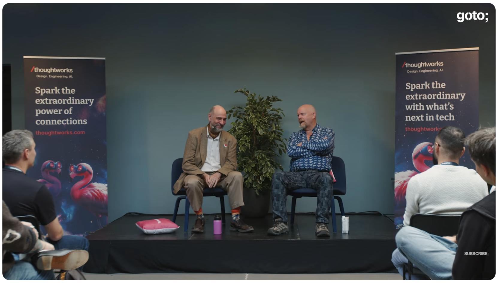

# 片段：5月27日
Martin Fowler：2026年5月27日

---

在 2025 年哥本哈根的 GOTO 大会上，[Kent Beck 和我在台上进行了一段时间的对话](https://www.youtube.com/watch?v=ii_rLjQfjp0&list=PLEx5khR4g7PINwOsYrkwz3lTTJUYoXC53) 并回答观众提问 —— 我把这种形式称为 “两个老家伙坐在公园长凳上”。
我们聊了各自在 LLM 辅助编程方面的经验（当时是 2025 年 10 月），我们感到沮丧的是，三十年来我们一直在说的一些事情，现在仍然需要再说一遍。
我们谈到了任何类似 “宣言重聚”的事情都需要由年轻一代来引领，并且分享了我们对初级开发者在职业生涯中应该关注什么的看法。

❄　❄　❄　❄　❄

Ian Johnson 撰写了一系列关于 [重构一个混乱代码库](https://dev.to/tacoda/the-agent-harness-turning-ai-slop-into-shipping-software-589i) 的文章。

> 该系列讲述了一个真实的 Laravel + React 代码库在约 3 个月、约 258 次提交中的演变过程 —— 从没有测试的传统单体架构，演变成一个结构良好的应用程序，具有自动化质量门控、React SPA 迁移进行中、以及一个能在极少监督下可靠交付生产代码的 AI 智能体。
>
> 该系列相当详细地介绍了各个步骤，他的方法遵循了我也会采用的步骤类型：首先将一切置于良好的特征测试控制之下，然后添加静态分析，引入正确的模式使事情顺利流动。

有了以上这些，他对 AI 的使用方式在练习过程中也发生了变化：

> 在这个项目的前两个月，我使用了 Claude Code，并关闭了自动批准。
每一个文件编辑、每一条终端命令、每一个变更……我都会在执行之前进行审查。[…] 结果是好的。
代码是整洁的。
但我承担了大部分的思考工作，以及一半的输入工作。
这个智能体只是一个花哨的自动补全工具，只是提供的建议更好一些。
我没有获得我所期望的那种杠杆效应。
>
> 我读到一篇关于 “在循环之外” 与 “在循环之内” 的人机协作方式的文章。
这个框架立即让我产生了共鸣。[…] 我之所以微观管理，是因为我不信任这个智能体会做正确的事情。
而我不信任它，是因为没有任何机制迫使它去做正确的事情。

他早期的步骤引入了测试、静态分析和正确的架构模式。
有了这些基础，他就可以让智能体做更多的工作。

> 我的角色从编写者转变为了策展人。
我不再编写大部分代码。
我定义模式 […] 审查测试规格 […] 审查输出 […] 更新框架 […] 做出战略决策 […]

他在系列文章的结尾总结了如何将他的经验推广到其他情况下的结论。

❄　❄　❄　❄　❄

回到我的出生地，当国家医疗服务 (NHS) 决定 [关闭几乎所有的开源代码仓库时](https://shkspr.mobi/blog/2026/05/nhs-goes-to-war-against-open-source/) ——据称是为了应对 LLM 带来的安全威胁—— 引起了一些明显的抱怨。
关闭这样的仓库并不是对抗 LLM 增强型攻击者的有效对策。
我怀疑，英国政府中备受推崇的 IT 赋能机构 GDS（政府数据服务）[发布其立场](https://www.gov.uk/guidance/ai-open-code-and-vulnerability-risk-in-the-public-sector) ，并非巧合。

> 将代码从公开转为私有，作为对安全设计交付、所有权和修复的投资的替代，是一个警示信号，因为它减少了共享和审查，可能会减缓政府及供应商之间的协同改进，并且不能消除运行中服务的根本性弱点。

[Terence Eden](https://shkspr.mobi/blog/2026/05/gds-weighs-in-on-the-nhss-decision-to-retreat-from-open-source/) 令人印象深刻地总结了他的观点：

> 在英国公务员体系中，你偶尔会听到 “被邀请参加一个没有饼干的会议” 这种说法。
它暗示了一场相当冷淡的讨论，没有任何正常会议中的礼貌客套。

❄　❄　❄　❄　❄

我见过一些案例，那些最常使用 LLM 的开发者发现他们遇到了认知耐力方面的问题。
[Adam Tornhill 也加入了这一讨论](https://adamtornhill.substack.com/p/compressed-cognition-the-hidden-cost) ：

> 使用智能体的一大好处是，它们让我们能够在更高层次的问题上停留更长时间。
我们较少被细节、依赖清理以及类似那些曾经会打断注意力的次要任务所干扰。
>
> 但这里有一个我们仍然低估的代价。
智能体编程在脑力上是昂贵的。
>
> 我通常只能维持这种节奏几个小时。
然后我就需要休息。
这个节奏实在是太紧张了。
而且根据与其他工程师的交流，我认为我不是唯一有这种感觉的人。

他解释说，与 “精灵” 一起工作意味着我们在更短的时间内做出更多的决策，这种决策密度的增加对大脑来说是沉重的负担。

他的应对方式是：保持智能体任务的规模较小，尽可能自动化一切，并接受 ——只要他有良好的验证机制—— 他不需要知道每一行代码。

值得注意的是，他并没有朝着协调大量智能体集群来工作的方向发展。
相反，他有一个长期运行的任务需要照看，以及一个聚焦的任务。

> 最后一点很重要，尤其是在当前 “并行运行二十个智能体” 的热潮下。
我甚至想不出二十件有意义的事情去构建，更不用说那些可能的中断所带来的认知负担了。
这恰恰是最不应该考虑的方向。
至少对人类来说是这样。
（是的，我理解子智能体和机器并行化。
我不是反对那些。
我反对的是人类注意力的并行化 —— 那是无法扩展的。）

我喜欢他包含的一些关于人们在这种高强度的编程时间之外可以做些什么的想法。
不仅仅是 “喝杯咖啡”（虽然他也提到了这个），还包括了解软件所支持的领域。

❄　❄　❄　❄　❄

几条来自社交媒体的精辟引用

[Lorin Hochstein](https://toot.thoughtworks.com/@norootcause@hachyderm.io/116626163784445316)

> “隐喻债务” 是指你所有的隐喻都包含了 “债务” 这个概念，因为你再也想不出任何其他的隐喻了。

❄  ❄

[Daniel Terhorst-North](https://toot.thoughtworks.com/@tastapod@mas.to/116641666908831725)

> 如果一个素食主义的 CrossFit 爱好者正在用 Claude 编写 Rust 代码，他们会先告诉你哪一件事？

❄　❄　❄　❄　❄

Karl Bode 对那些在毕业典礼致辞中一提到 AI 就被嘘的演讲者做出了回应。
他指出，年轻一代 [对技术寡头及其产物越来越不满](https://karlbode.com/anger-at-ai-is-inextricably-fused-with-justified-loathing-of-the-extraction-class-deal-with-it/) 。

> 关键在于，这些孩子并不傻。
他们看得很清楚。他们看到了科技公司、媒体和毕业典礼演讲者向他们兜售的东西，与他们自己反复亲眼所见的东西之间的差距。
>
> 他们目睹了技术寡头在过去十年里深陷一桩又一桩丑闻，一个又一个炒作周期，稳步地让他们所触及的一切都走向 “垃圾化”。
>
> […]
>
> 认为 AI 的益处不足以抵消其风险的 Z 世代比例，现在已徘徊在 50% 左右，仅在过去一年就上升了 11 个百分点。
每十个人中有八个认为，使用 AI 使真正的学习过程变得更加困难。

他认为，年轻人背负着一种 “正在进入一个日益糟糕的世界” 的认知 —— 这导致他们对技术寡头的这一最新产物感到愤怒。
这种愤怒，对于像我这样拥有舒适退休退路的人来说，是容易恰当理解的。
这是一种可能带来显著政治和社会后果的愤怒。

❄　❄　❄　❄　❄

与这些担忧相关的是上周《经济学人》周刊中的两篇文章。
该刊认为，从历史上看，重大的技术进步并未导致显著的失业或工资下降（ [付费文章](https://www.economist.com/finance-and-economics/2026/05/14/the-jobs-apocalypse-a-very-short-history) ）。
最接近的例外是 19 世纪英国最初的工业革命。
在此期间工资出现了停滞，但同时人口也从 450 万大幅增长到了 1200 万。

文章还指出，我们可能只有在经济衰退来临时，才能真正理解这一切的全部后果，因为那时系统中大多数非生产性的工作往往会被淘汰。

第二篇文章（ [同样为付费文章](https://www.economist.com/finance-and-economics/2026/05/13/is-ai-putting-graduates-out-of-work-already) ）指出，AI 正在对毕业生招聘产生一定影响。
他们对近期毕业生的调查数据进行了分析，旨在观察就业率是否因工作对 AI 的暴露程度不同而有所差异。
在过去几年中，AI 暴露程度最低的五分之一群体的就业率下降了 1.5%，而暴露程度最高的五分之一群体的就业率则下降了 6.6%。

❄　❄　❄　❄　❄

[Lawfare 对美国政府在监管 AI 方面的最新努力并不买账](https://www.lawfaremedia.org/article/ai-governance-by-phone-call) 。

> [上周]三，白宫邀请 OpenAI、谷歌、Anthropic、Meta 和微软的领导人于次日下午前往椭圆形办公室参加签字仪式。
特朗普总统原计划签署一项关于 AI 与网络安全的新行政命令 —— 这是本届政府为在前沿模型发布前建立自愿审查流程所做的最正式的努力。
但就在仪式开始前大约三个小时，当一些公司高管已经在飞往华盛顿的途中时，白宫取消了这一安排。

他们认为这套拟定监管条款力度温和，其中部分条款有助于强化网络安全防御。

> 但值得强调的是，这一命令被推迟（即使不是完全取消）的影响 —— 该命令本身已经是联邦政府能够在纸面上提出的、对前沿 AI 最为温和的干预：自愿的、聚焦于政府自身的防御、并明确禁止成为许可制度。
反对的焦点与其说是政府强制，不如说是政府在其中扮演任何确定角色这件事本身。
换言之，自愿不是本届政府前沿 AI 政策的底线，而是天花板。
>
> 考虑到推动该行政令草案的担忧可能在不久的将来加剧，这是一个有问题的立场。
对于那些为该命令被推迟或夭折而欢呼的人来说，这也是弄巧成拙的。
取消该命令非但不能解决政府干预 AI 的风险，反而只会留下 Ball 所描述的 “不透明且基本上无法无天” 的替代方案：政府只能通过私下渠道接洽企业，管控规则一事一议，不存在稳定制度。

这里的问题之一是政府明显缺乏专业知识 —— 无论是在 AI 领域还是在更广泛的软件领域。
太多事情是由技术寡头的一时兴起决定的，没有任何参与处理更广泛问题的尝试。
这也不完全是坏事，试图监管仍在快速演变的事物通常徒劳无功 —— 但问题在于 AI 的影响如此之大，落后太多确实存在真正的危险。

❄　❄　❄　❄　❄

这引出了我一件很少做的事情 —— 对一位政治职位候选人的公开支持。
如果你在马萨诸塞州第六国会选区（麻萨诸塞州北岸）投票，我会认真建议你关注 [Beth Anders-Beck](https://bethfordemocracy.com/) ，她正在该选区竞选国会议员。
Beth 拥有长期的软件开发背景（包括提出了 [Forest and Desert](https://martinfowler.com/bliki/ForestAndDesert.html) 的概念），因此能够带来国会亟需的专业知识。
我认识 Beth 已有数十年，对她的才智、判断力以及与他人合作的能力评价很高。
国会配不上 Beth，但它确实需要她。

❄ ❄
