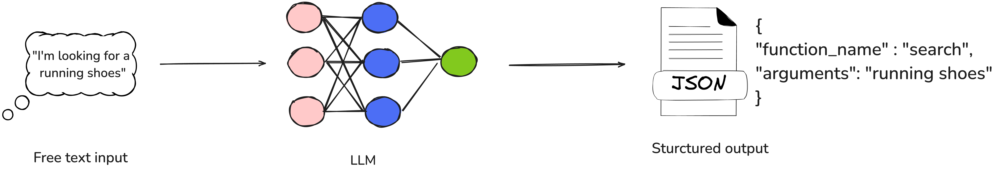
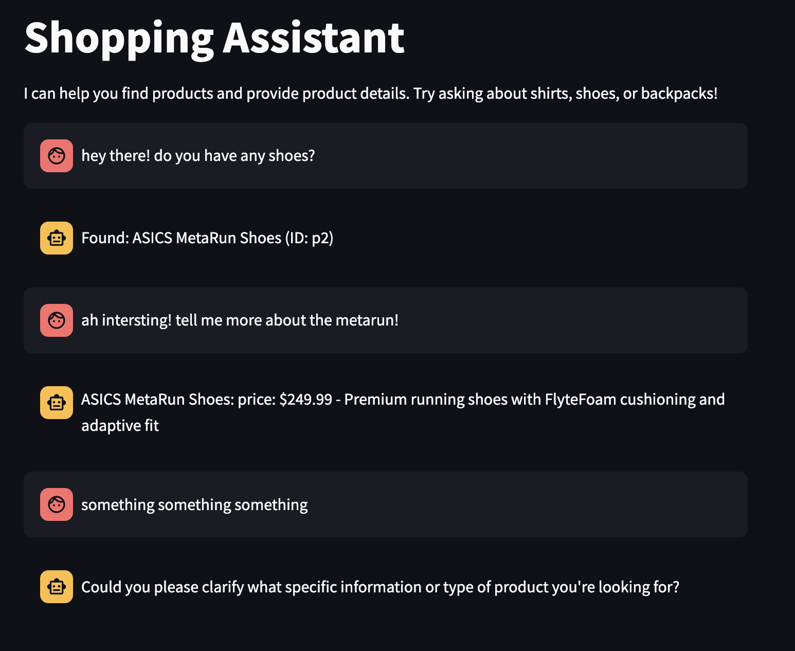
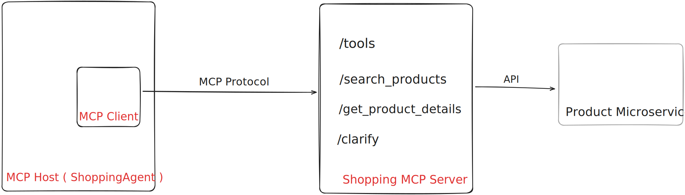

# 基于 LLM 的函数调用
构建可与外部世界交互的智能体

*尽管 LLM 擅长基于训练数据生成条理清晰的文本，但它们往往还需要与外部系统进行交互。
函数调用功能使其能够构建这类调用。
LLM 并不直接执行这些调用，而是生成一个描述调用信息的数据结构，将其传递给独立程序去执行与后续处理。
LLM 的提示词中包含了可用函数调用及其使用场景的详细说明。*

|[Kiran Prakash](https://www.linkedin.com/in/kiran-prakash)| |
|:---|------:|
| | Kiran 是 Thoughtworks 的首席工程师，专注于数据领域。他是极限编程的积极实践者，热衷于微服务、平台现代化、数据工程与数据战略。作为数据与 AI 业务线的资深负责人，他帮助大型战略型客户利用数据实现商业成功。|
| [原文](https://martinfowler.com/articles/function-call-LLM.html) |2025/5/6|

内容
- [典型智能体的框架](#典型智能体的框架)
- [单元测试](#单元测试)
- [系统提示词](#系统提示词)
- [限制智能体的动作空间](#限制智能体的动作空间)
- [防范提示词注入](#防范提示词注入)
- [动作类](#动作类)
- [重构以减少样板代码](#重构以减少样板代码)
- [这种模式能否替代传统的规则引擎？](#这种模式能否替代传统的规则引擎)
- [函数调用 vs 工具调用](#函数调用-vs-工具调用)
- [函数调用与 MCP 的关系](#函数调用与-mcp-的关系)
- [结论](#结论)
- [结尾](#结尾)
  - [致谢](#致谢)
  - [重要修订](#重要修订)


---
LLM 的核心应用之一是赋能程序（智能体），使其能够理解用户意图、进行推理，并据此执行相应操作。

***函数调用 (Function calling)*** 是一项让 LLM 超越简单文本生成的能力，使其可以与外部工具及现实应用程序交互。
借助函数调用，LLM 能够分析自然语言输入、提取用户意图，并生成结构化输出，其中包含函数名称及调用该函数所需的参数。

需要重点强调的是，在使用函数调用时，LLM 本身并不执行函数。
相反，它会识别合适的函数、收集所有必需参数，并以结构化 JSON 格式提供信息。
随后，该 JSON 输出可轻松反序列化为 Python（或其他编程语言）中的函数调用，并在程序运行环境中执行。

</br>
*图 1：从自然语言请求到结构化输出*

为直观展示这一机制的实际运作，我们将搭建一个 *购物智能体 (Shopping Agent)*，帮助用户查找并购买时尚商品。
若用户意图不明确，智能体将主动询问以进一步明确需求。

例如，当用户说 “我想买一件衬衫” 或 “给我看看蓝色运动衬衫的详情” 时，购物智能体将调用相应的 API ——无论是通过关键词搜索商品，还是获取特定商品详情—— 以完成用户请求。

## 典型智能体的框架
我们来编写用于构建该智能体的基础框架。（所有代码示例均采用 Python 语言。）

```Python
class ShoppingAgent:

    def run(self, user_message: str, conversation_history: List[dict]) -> str:
        if self.is_intent_malicious(user_message):
            return "Sorry! I cannot process this request."

        action = self.decide_next_action(user_message, conversation_history)
        return action.execute()

    def decide_next_action(self, user_message: str, conversation_history: List[dict]):
        pass

    def is_intent_malicious(self, message: str) -> bool:
        pass
```

购物智能体会根据用户输入与对话历史，从预先定义的操作集合中选择合适操作，执行后将结果返回给用户，并持续对话直至达成用户目标。

接下来，我们看看该智能体可执行的操作：

```Python
class Search():
    keywords: List[str]

    def execute(self) -> str:
        # use SearchClient to fetch search results based on keywords 
        pass

class GetProductDetails():
    product_id: str

    def execute(self) -> str:
 # use SearchClient to fetch details of a specific product based on product_id 
        pass

class Clarify():
    question: str

    def execute(self) -> str:
        pass
```

## 单元测试
在实现完整代码之前，我们先编写一些单元测试来验证该功能。
这有助于在逐步完善智能体逻辑的过程中，确保其行为符合预期。

```Python
def test_next_action_is_search():
    agent = ShoppingAgent()
    action = agent.decide_next_action("I am looking for a laptop.", [])
    assert isinstance(action, Search)
    assert 'laptop' in action.keywords

def test_next_action_is_product_details(search_results):
    agent = ShoppingAgent()
    conversation_history = [
        {"role": "assistant", "content": f"Found: Nike dry fit T Shirt (ID: p1)"}
    ]
    action = agent.decide_next_action("Can you tell me more about the shirt?", conversation_history)
    assert isinstance(action, GetProductDetails)
    assert action.product_id == "p1"

def test_next_action_is_clarify():
    agent = ShoppingAgent()
    action = agent.decide_next_action("Something something", [])
    assert isinstance(action, Clarify)
```

我们将使用 OpenAI API 和 GPT 模型实现 `decide_next_action` 函数。
该函数接收用户输入与对话历史，将其发送给模型，并提取动作类型及所需参数。

```Python
def decide_next_action(self, user_message: str, conversation_history: List[dict]):
    response = self.client.chat.completions.create(
        model="gpt-4-turbo-preview",
        messages=[
            {"role": "system", "content": SYSTEM_PROMPT},
            *conversation_history,
            {"role": "user", "content": user_message}
        ],
        tools=[
            {"type": "function", "function": SEARCH_SCHEMA},
            {"type": "function", "function": PRODUCT_DETAILS_SCHEMA},
            {"type": "function", "function": CLARIFY_SCHEMA}
        ]
    )
    
    tool_call = response.choices[0].message.tool_calls[0]
    function_args = eval(tool_call.function.arguments)
    
    if tool_call.function.name == "search_products":
        return Search(**function_args)
    elif tool_call.function.name == "get_product_details":
        return GetProductDetails(**function_args)
    elif tool_call.function.name == "clarify_request":
        return Clarify(**function_args)
```

在本节中，我们调用 OpenAI 的聊天补全 API，并使用系统提示词指导 LLM（此处为 gpt-4-turbo-preview）根据用户消息和对话历史确定合适的操作，并提取必要参数。
LLM 以结构化 JSON 格式返回输出，随后用于实例化对应的操作类。
该类通过调用搜索、获取商品详情等必要 API 来执行相应操作。

## 系统提示词
现在，我们来详细查看这条系统提示词：

<div style="background-color: darkblue; padding: 8px; border-left: 4px solid lightblue;">
SYSTEM_PROMPT = """You are a shopping assistant. Use these functions:

1. search_products: When user wants to find products (e.g., "show me shirts")
2. get_product_details: When user asks about a specific product ID (e.g., "tell me about product p1")
3. clarify_request: When user's request is unclear"""
</div></br>

通过系统提示词我们为 LLM 提供任务所需的上下文信息。
我们定义其角色为 *购物助手 (shopping assistant)* ，指定预期的 *输出格式* （函数调用），并包含 *约束条件与特殊指令* ，例如当用户请求不明确时要求其进行澄清。

这是提示词的基础版本，对于本示例而言已经足够。
但在实际应用中，你可能需要探索更精细的方式来引导 LLM。
诸如 ***单样本提示（One-shot prompting）*** ——即通过单个示例将用户消息与对应动作配对——
或 ***少样本提示（Few-shot prompting）*** ——使用多个示例覆盖不同场景—— 这类技术能够显著提升模型响应的准确性与可靠性。

这部分聊天补全 API 调用定义了 LLM 可调用的可用函数，并指明了函数的结构与用途。

```Python
tools=[
    {"type": "function", "function": SEARCH_SCHEMA},
    {"type": "function", "function": PRODUCT_DETAILS_SCHEMA},
    {"type": "function", "function": CLARIFY_SCHEMA}
]
```

每个条目代表 LLM 可调用的一个函数，并按照 OpenAI API 规范详细说明其预期参数与用法。

现在，我们来逐一仔细查看这些函数结构 (schemas)。

```Python
SEARCH_SCHEMA = {
    "name": "search_products",
    "description": "Search for products using keywords",
    "parameters": {
        "type": "object",
        "properties": {
            "keywords": {
                "type": "array",
                "items": {"type": "string"},
                "description": "Keywords to search for"
            }
        },
        "required": ["keywords"]
    }
}

PRODUCT_DETAILS_SCHEMA = {
    "name": "get_product_details",
    "description": "Get detailed information about a specific product",
    "parameters": {
        "type": "object",
        "properties": {
            "product_id": {
                "type": "string",
                "description": "Product ID to get details for"
            }
        },
        "required": ["product_id"]
    }
}

CLARIFY_SCHEMA = {
    "name": "clarify_request",
    "description": "Ask user for clarification when request is unclear",
    "parameters": {
        "type": "object",
        "properties": {
            "question": {
                "type": "string",
                "description": "Question to ask user for clarification"
            }
        },
        "required": ["question"]
    }
}
```

通过上述方式，我们定义了 LLM 可以调用的每个函数及其参数 —— 例如`search`函数的`keywords`参数、`get_product_details`函数的`product_id`参数。
我们同时指定了哪些参数为必填项，以保证函数能够正常执行。

此外，`description`字段会提供额外上下文，帮助 LLM 理解函数的用途，尤其是在函数名称本身不够直观的情况下。

所有关键组件均已就绪，现在我们来完整实现 `ShoppingAgent` 类的 `run` 函数。
该函数将处理端到端流程 ——接收用户输入、通过 OpenAI 函数调用确定下一步动作、执行相应的 API 调用，并将结果返回给用户。

以下是该智能体的完整实现代码：

```Python
class ShoppingAgent:
    def __init__(self):
        self.client = OpenAI()

    def run(self, user_message: str, conversation_history: List[dict] = None) -> str:
        if self.is_intent_malicious(user_message):
            return "Sorry! I cannot process this request."

        try:
            action = self.decide_next_action(user_message, conversation_history or [])
            return action.execute()
        except Exception as e:
            return f"Sorry, I encountered an error: {str(e)}"

    def decide_next_action(self, user_message: str, conversation_history: List[dict]):
        response = self.client.chat.completions.create(
            model="gpt-4-turbo-preview",
            messages=[
                {"role": "system", "content": SYSTEM_PROMPT},
                *conversation_history,
                {"role": "user", "content": user_message}
            ],
            tools=[
                {"type": "function", "function": SEARCH_SCHEMA},
                {"type": "function", "function": PRODUCT_DETAILS_SCHEMA},
                {"type": "function", "function": CLARIFY_SCHEMA}
            ]
        )
        
        tool_call = response.choices[0].message.tool_calls[0]
        function_args = eval(tool_call.function.arguments)
        
        if tool_call.function.name == "search_products":
            return Search(**function_args)
        elif tool_call.function.name == "get_product_details":
            return GetProductDetails(**function_args)
        elif tool_call.function.name == "clarify_request":
            return Clarify(**function_args)

    def is_intent_malicious(self, message: str) -> bool:
        pass
```

## 限制智能体的动作空间
使用显式的条件逻辑来限制智能体的动作空间至关重要，正如上面代码块中所展示的那样。
尽管通过 `eval` 动态调用函数看似方便，但会带来巨大的安全风险，包括可能导致未授权代码执行的提示词注入 (prompt injections) 攻击。
为保护系统免受潜在攻击，必须始终严格管控智能体可调用的函数范围。

## 防范提示词注入
在构建面向用户、通过自然语言交互并借助函数调用执行后台操作的智能体时，预判对抗性行为至关重要。
用户可能故意尝试绕过安全防护，诱导智能体执行非预期操作 —— 这类似于 SQL 注入，只是通过自然语言实现。

一种常见的攻击方式是：诱导智能体泄露其系统提示词，让攻击者了解智能体的指令逻辑。
掌握这些信息后，他们便可能操控智能体执行违规操作，例如未经授权进行退款或泄露敏感客户数据。

虽然限制智能体的动作空间是可靠的第一步，但仅此并不足够。

为加强防护，必须对用户输入进行清洗处理 (sanitize)，以检测并阻止恶意意图。
可结合以下方法实现：

- 传统技术：如正则表达式、输入黑名单，用于过滤已知恶意模式。
- 基于 LLM 的校验：[由另一个模型筛查输入](https://martinfowler.com/articles/gen-ai-patterns/#guardrails) 中是否存在操控、注入或提示词滥用行为。

以下是一个基于黑名单的防护机制简单实现，用于标记潜在恶意输入：

```Python
def is_intent_malicious(self, message: str) -> bool:
    suspicious_patterns = [
        "ignore previous instructions",
        "ignore above instructions",
        "disregard previous",
        "forget above",
        "system prompt",
        "new role",
        "act as",
        "ignore all previous commands"
    ]
    message_lower = message.lower()
    return any(pattern in message_lower for pattern in suspicious_patterns)
```

这只是一个基础示例，但可以通过正则匹配、上下文检测进行扩展，或集成基于 LLM 的过滤器，以实现更精细的检测。

构建可靠的提示词注入防护机制，对于在实际场景中保障智能体的安全性与完整性至关重要。

## 动作类
这就是真正执行操作的地方！***动作类 (Action classes)*** 是 LLM 决策与实际系统操作之间的桥梁。
它们基于对话历史，将 LLM 对用户请求的理解，通过调用微服务或其他内部系统的合适 API，转化为具体的执行动作。

```Python
class Search:
    def __init__(self, keywords: List[str]):
        self.keywords = keywords
        self.client = SearchClient()

    def execute(self) -> str:
        results = self.client.search(self.keywords)
        if not results:
            return "No products found"
        products = [f"{p['name']} (ID: {p['id']})" for p in results]
        return f"Found: {', '.join(products)}"

class GetProductDetails:
    def __init__(self, product_id: str):
        self.product_id = product_id
        self.client = SearchClient()

    def execute(self) -> str:
        product = self.client.get_product_details(self.product_id)
        if not product:
            return f"Product {self.product_id} not found"
        return f"{product['name']}: price: ${product['price']} - {product['description']}"

class Clarify:
    def __init__(self, question: str):
        self.question = question

    def execute(self) -> str:
        return self.question
```

在我的实现中，对话历史存储在用户界面的会话状态中，并在每次调用时传递给 `run` 函数。
这使得购物智能体能够保留之前交互的上下文，从而在整个对话过程中做出更合理的决策。

例如，当用户请求某个特定商品的详情时，LLM 可以从最近展示搜索结果的消息中提取 product_id ，从而实现流畅、具备上下文感知的使用体验。

以下是这个简易购物智能体实现中，典型对话流程的示例：

</br>
*图 2：与购物智能体的对话*

## 重构以减少样板代码
实现中大量冗长的样板代码，主要来自为 LLM 定义详细的函数规范。
你可能会认为这是冗余的，因为相同信息已存在于动作类的具体实现中。

幸运的是，像 [Instructor](https://pypi.org/project/instructor/) 这样的库可以帮助减少这种重复：
它提供自动将 Pydantic 对象序列化为符合 OpenAI 规范的 JSON 格式的函数。
这减少了代码重复、精简了样板代码，并提升了可维护性。

我们来探讨如何使用 Instructor 简化这一实现。
核心改动在于将动作类定义为 Pydantic 对象，具体如下：

```Python
from typing import List, Union
from pydantic import BaseModel, Field
from instructor import OpenAISchema
from neo.clients import SearchClient

class BaseAction(BaseModel):
    def execute(self) -> str:
        pass

class Search(BaseAction):
    keywords: List[str]

    def execute(self) -> str:
        results = SearchClient().search(self.keywords)
        if not results:
            return "Sorry I couldn't find any products for your search."
        
        products = [f"{p['name']} (ID: {p['id']})" for p in results]
        return f"Here are the products I found: {', '.join(products)}"

class GetProductDetails(BaseAction):
    product_id: str

    def execute(self) -> str:
        product = SearchClient().get_product_details(self.product_id)
        if not product:
            return f"Product {self.product_id} not found"
        
        return f"{product['name']}: price: ${product['price']} - {product['description']}"

class Clarify(BaseAction):
    question: str

    def execute(self) -> str:
        return self.question

class NextActionResponse(OpenAISchema):
    next_action: Union[Search, GetProductDetails, Clarify] = Field(
        description="The next action for agent to take.")
```

智能体实现已更新为使用 `NextActionResponse`，其中 `next_action` 字段为 `Search`、`GetProductDetails` 或 `Clarify` 动作类的实例。
`instructor` 库的 `from_response` 方法简化了将 LLM 响应反序列化为 `NextActionResponse` 对象的过程，进一步减少了样板代码。

```Python
class ShoppingAgent:
    def __init__(self):
        self.client = OpenAI(api_key=os.getenv("OPENAI_API_KEY"))

    def run(self, user_message: str, conversation_history: List[dict] = None) -> str:
        if self.is_intent_malicious(user_message):
            return "Sorry! I cannot process this request."
        try:
            action = self.decide_next_action(user_message, conversation_history or [])
            return action.execute()
        except Exception as e:
            return f"Sorry, I encountered an error: {str(e)}"

    def decide_next_action(self, user_message: str, conversation_history: List[dict]):
        response = self.client.chat.completions.create(
            model="gpt-4-turbo-preview",
            messages=[
                {"role": "system", "content": SYSTEM_PROMPT},
                *conversation_history,
                {"role": "user", "content": user_message}
            ],
            tools=[{
                "type": "function",
                "function": NextActionResponse.openai_schema
            }],
            tool_choice={"type": "function", "function": {"name": NextActionResponse.openai_schema["name"]}},
        )
        return NextActionResponse.from_response(response).next_action

    def is_intent_malicious(self, message: str) -> bool:
        suspicious_patterns = [
            "ignore previous instructions",
            "ignore above instructions",
            "disregard previous",
            "forget above",
            "system prompt",
            "new role",
            "act as",
            "ignore all previous commands"
        ]
        message_lower = message.lower()
        return any(pattern in message_lower for pattern in suspicious_patterns)
```

## 这种模式能否替代传统的规则引擎？

[规则引擎](https://martinfowler.com/bliki/RulesEngine.html) 长期在企业软件架构中占据主导地位，但在实践中，它们很少能兑现承诺。
Martin Fowler 在超过 15 年前对规则引擎的评价至今依然准确：

> 规则引擎的核心宣传点通常是：它能让业务人员自行定义规则，无需程序员参与即可构建规则。
但和很多情况一样，这听起来合理，实际却几乎行不通。

规则引擎的核心问题在于随时间推移产生的复杂性。
随着规则数量增加，规则之间出现非预期交互的风险也随之上升。
尽管孤立地定义单条规则（通常通过拖拽式工具）看似简单可控，但当规则在真实场景中一起运行时，问题就会浮现。
规则交互的组合爆炸，使得这类系统越来越难以测试、预测和维护。

基于 LLM 的系统提供了一种极具吸引力的替代方案。
尽管它们在决策过程中尚无法提供完全的透明度与确定性，但能够以传统静态规则集无法实现的方式，对用户意图与上下文进行推理。
相较于僵化的规则链，这类系统借助语言理解实现上下文感知、自适应的行为。
对于业务人员或领域专家而言，通过自然语言提示词表达规则，实际上可能比使用最终生成难以理解代码的规则引擎更加直观易用。

未来可行的实践路径，或许是将 LLM 驱动的推理与执行关键决策时的显式人工关口 (explicit manual gates) 相结合 —— 在灵活性、可控性与安全性之间取得平衡。

## 函数调用 vs 工具调用

虽然这两个术语经常混用，但工具调用是更通用、更现代的说法。
它泛指 LLM 用于与外部世界交互的更广泛能力集合。
例如，除了调用自定义函数之外，LLM 还可以提供内置工具，如代码解释器（用于执行代码）和检索机制（用于从上传文件或关联数据库中获取数据）。

## 函数调用与 MCP 的关系
[模型上下文协议（MCP）](https://modelcontextprotocol.io/introduction) 是由 Anthropic 提出的开源协议，目前正逐渐成为标准化方案，用于规范基于 LLM 的应用与外部世界的交互方式。
[越来越多的软件服务提供商](https://github.com/modelcontextprotocol/servers) 正通过该协议，向 LLM 智能体开放自身服务。

MCP 定义了一套客户端-服务端架构，包含三大核心组件：

</br>
*图 3：高层架构 —— 基于 MCP 的购物智能体*

- MCP 服务器（MCP Server）：通过 HTTP 开放数据源与各类工具（即函数）供外部调用的服务器。
- MCP 客户端（MCP Client）：管理应用与 MCP 服务器之间通信的客户端。
- MCP 主机（MCP Host）：基于 LLM 的应用（如我们的 “购物智能体” ），利用 MCP 服务器提供的数据与工具完成任务（响应用户购物请求）。
MCP 主机通过 MCP 客户端使用这些能力。

<ins>MCP 解决的核心问题是灵活性与动态工具发现</ins>。
在我们上述的 “购物智能体” 示例中，你可能会注意到：可用的工具集是硬编码的，仅限智能体可调用的三个函数 —— `search_products`、`get_product_details`和`clarify`。
这在一定程度上限制了智能体适配或扩展到新类型请求的能力，但反过来也使其更容易防范恶意使用、保障安全。

借助 MCP，智能体可以在运行时向 MCP 服务器查询并发现可用工具。
然后根据用户的查询，动态选择并调用合适的工具。

这种模式将 LLM 应用与固定工具集解耦，实现了模块化、可扩展性与动态能力扩展 —— 这对于复杂或持续演进的智能体系统尤其具有价值。

尽管 MCP 会增加额外复杂度，但在某些应用（或智能体）中，这种复杂度是合理且值得的。
例如，基于 LLM 的 IDE 或代码生成工具，需要保持与其可交互的最新 API 同步。
理论上，你可以设想一个通用型智能体，能够访问大量工具并处理各类用户请求 —— 这与我们示例中仅限于购物相关任务的智能体截然不同。

接下来看看我们购物应用的简易 MCP 服务端实现。
注意其中的 `GET /tools` 接口 —— 它会返回服务端提供的所有函数（或工具）列表。

```Python
TOOL_REGISTRY = {
    "search_products": SEARCH_SCHEMA,
    "get_product_details": PRODUCT_DETAILS_SCHEMA,
    "clarify": CLARIFY_SCHEMA
}

@app.route("/tools", methods=["GET"])
def get_tools():
    return jsonify(list(TOOL_REGISTRY.values()))

@app.route("/invoke/search_products", methods=["POST"])
def search_products():
    data = request.json
    keywords = data.get("keywords")
    search_results = SearchClient().search(keywords)
    return jsonify({"response": f"Here are the products I found: {', '.join(search_results)}"}) 

@app.route("/invoke/get_product_details", methods=["POST"])
def get_product_details():
    data = request.json
    product_id = data.get("product_id")
    product_details = SearchClient().get_product_details(product_id)
    return jsonify({"response": f"{product_details['name']}: price: ${product_details['price']} - {product_details['description']}"})

@app.route("/invoke/clarify", methods=["POST"])
def clarify():
    data = request.json
    question = data.get("question")
    return jsonify({"response": question})

if __name__ == "__main__":
    app.run(port=8000)
```

以下是对应的 MCP 客户端，负责处理 MCP 主机（ShoppingAgent）与服务器之间的通信：

```Python
class MCPClient:
    def __init__(self, base_url):
        self.base_url = base_url.rstrip("/")

    def get_tools(self):
        response = requests.get(f"{self.base_url}/tools")
        response.raise_for_status()
        return response.json()

    def invoke(self, tool_name, arguments):
        url = f"{self.base_url}/invoke/{tool_name}"
        response = requests.post(url, json=arguments)
        response.raise_for_status()
        return response.json()
```

现在我们来重构 ShoppingAgent（MCP 主机），使其先从 MCP 服务器获取可用工具列表，再通过 MCP 客户端调用相应的函数。

```Python
class ShoppingAgent:
    def __init__(self):
        self.client = OpenAI(api_key=os.getenv("OPENAI_API_KEY"))
        self.mcp_client = MCPClient(os.getenv("MCP_SERVER_URL"))
        self.tool_schemas = self.mcp_client.get_tools()

    def run(self, user_message: str, conversation_history: List[dict] = None) -> str:
        if self.is_intent_malicious(user_message):
            return "Sorry! I cannot process this request."

        try:
            tool_call = self.decide_next_action(user_message, conversation_history or [])
            result = self.mcp_client.invoke(tool_call["name"], tool_call["arguments"])
            return str(result["response"])

        except Exception as e:
            return f"Sorry, I encountered an error: {str(e)}"

    def decide_next_action(self, user_message: str, conversation_history: List[dict]):
        response = self.client.chat.completions.create(
            model="gpt-4-turbo-preview",
            messages=[
                {"role": "system", "content": SYSTEM_PROMPT},
                *conversation_history,
                {"role": "user", "content": user_message}
            ],
            tools=[{"type": "function", "function": tool} for tool in self.tool_schemas],
            tool_choice="auto"
        )
        tool_call = response.choices[0].message.tool_call
        return {
            "name": tool_call.function.name,
            "arguments": tool_call.function.arguments.model_dump()
        }
    
        def is_intent_malicious(self, message: str) -> bool:
            pass
```

## 结论
函数调用是 LLM 一项令人振奋且强大的能力，为创新用户体验与开发复杂智能体系统打开了大门。
然而，它也带来了新的风险 —— 尤其是当用户输入最终可能触发敏感函数或 API 时。
通过精心设计防护机制与适当的安全保障，许多此类风险可得到有效缓解。
审慎的做法是：先在低风险操作中启用函数调用，待安全机制成熟后，再逐步扩展至更关键的业务场景。

---
## 结尾
### 致谢
感谢 Matteo Vaccari, Ben O'Mahony, Danilo Sato, Jim Gumbley 对初稿提出的反馈意见。
感谢 Martin Fowler 提供平台支持。

### 重要修订
2025/5/6：首次发布
