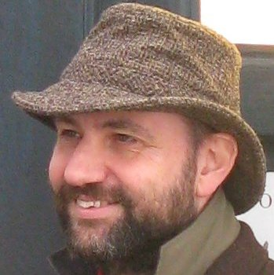

# 软件开发的未来

2026/2/13 [原文](https://martinfowler.com/bliki/FutureOfSoftwareDevelopment.html)

 
[Martin Fowler](https://martinfowler.com/)

2026 年 2 月，Thoughtworks 在 Utah 州 Deer Valley 举办了一场名为 “软件开发的未来” 的研讨会。
此次活动选址 Utah 州山区，意在纪念 [敏捷软件开发宣言](https://agilemanifesto.org/) 签署 25 周年，
但整场会议更具前瞻性，重点探讨 AI 与 LLM 的崛起将如何影响软件行业。

主办方邀请了约 50 位嘉宾，包括 Thoughtworks 员工、软件领域专家及客户 —— 均为在 LLM 驱动的行业变革中表现活跃的人士。
我们以 [开放空间](https://martinfowler.com/bliki/OpenSpace.html) 会议形式进行了为期一天半的交流，这是一场紧凑而愉悦的活动。

我并未试图将讨论与收获整理成连贯完整的论述，而是将诸多见解分篇发布在了我的碎片化随笔中：

- [2/4](fragments/2026-2-4.md)
- [2/9](fragments/2026-2-9.md)
- [2/13](fragments/2026-2-13.md)
- [2/18](fragments/2026-2-18.md)

本次闭门会议遵循 [查塔姆研究所规则 (Chatham House Rule)](https://www.chathamhouse.org/about-us/chatham-house-rule) 因此大部分发言不注明出处，除非我获得特别授权。

Thoughtworks 发布了本次活动的 [观点摘要](https://www.thoughtworks.com/content/dam/thoughtworks/documents/report/tw_future%20_of_software_development_retreat_%20key_takeaways.pdf) 。

## 其他参与者的文章：
- Annie Vella 分享了 [她的收获](https://annievella.com/posts/finding-comfort-in-the-uncertainty/)
- Rachel Laycock 接受了 [The New Stack 的采访](https://thenewstack.io/ai-velocity-debt-accelerator/)
