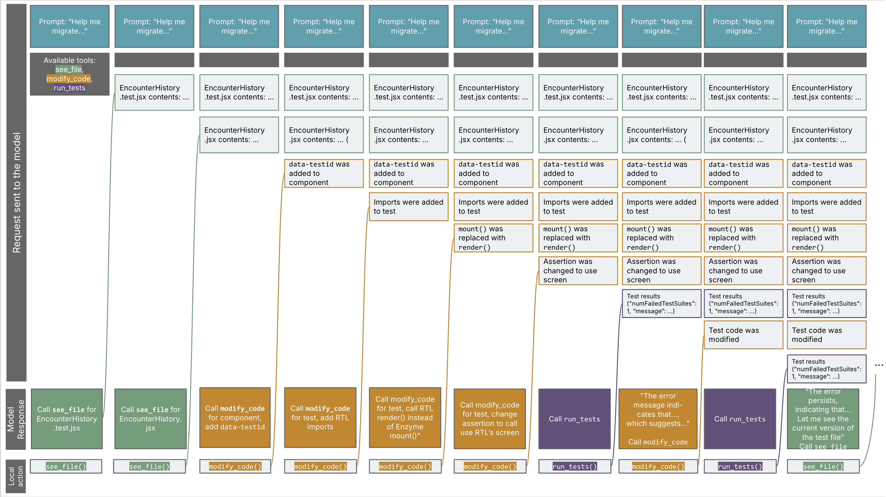

# 构建用于迁移技术栈的 AI 智能体应用

</br>
本文为 [探索生成式AI](exploring-gen-ai.md) 系列的一部分，该系列记录了 Thoughtworks 技术人员在软件开发中运用生成式 AI 技术的探索实践。

|[Birgitta Böckeler](https://birgitta.info/)| |
|:---|---:|
| |Birgitta 是 Thoughtworks 的杰出工程师，同时也是 AI 辅助交付领域专家。她拥有二十余年软件开发、架构设计及技术管理经验。|
| [原文](https://martinfowler.com/articles/exploring-gen-ai/10-ai-for-tech-stack-migration.html) |2024/8/20|

---
技术栈迁移是人工智能辅助应用的一个很有前景的场景。为了更好地了解其潜力，并深入学习智能体的实现方式，我使用了微软的开源工具 [AutoGen](https://github.com/microsoft/autogen)，尝试将一个 Enzyme 测试用例迁移到 React Testing Library。

## 什么是 “智能体 (agent)” ？
在本文语境中，智能体是指使用 LLM 的应用，但这类应用并非只是将模型的回复展示给用户，而是会根据大语言模型给出的指示自主执行操作。
此外还有一个被热炒的概念 “多智能体（multi agent）”。
在我看来，它的含义非常宽泛：既可以是 “我的应用里有多种可用操作，我把每种操作都称作一个智能体” ，
也可以是 “我有多个接入大语言模型的应用，且它们之间可以相互交互” 。

在本案例中，我的应用会依托 LLM 自主运行，并且具备多种操作能力 —— 这么说来，我是不是也可以把它称作 “多智能体” 应用了？！

## 目标
目前，很多团队都会将其 React 组件测试从 [Enzyme](https://www.thoughtworks.com/radar/languages-and-frameworks/enzyme) 迁移到 React Testing Library（简称 RTL），这已经成为一种普遍现象。
原因是 Enzyme 已不再积极维护，而 RTL 被认为是更优秀的测试框架。
据我所知，Thoughtworks 公司至少有一个团队曾尝试使用 AI 辅助完成这项迁移（但并未成功），
Slack 团队也就该问题发表过 [一篇很有价值的文章](https://slack.engineering/balancing-old-tricks-with-new-feats-ai-powered-conversion-from-enzyme-to-react-testing-library-at-slack/) 。
因此我认为，这是一个非常贴合实际的实验场景。
我查阅了 [一些关于迁移方法的文档](https://testing-library.com/docs/react-testing-library/migrate-from-enzyme/) ，并挑选了 [一个包含 Enzyme 测试的代码仓库](https://github.com/openmrs/openmrs-react-components) 。

我先手动为 EncounterHistory 组件迁移了一个简短简单的测试，以此了解理想的迁移效果应该是什么样的。
以下是我的手动操作步骤，大致也是我希望 AI 能够自动完成的流程。
你不必完全理解每一步的具体含义，但这些步骤能让你对所需的修改类型有个概念，之后我描述 AI 的执行过程时，你也会再次看到这些步骤。

- 我在测试文件中添加了 RTL 的导入语句
- 将 Enzyme 的 mount() 替换为了 RTL 的 render()，并在断言中使用了 RTL 的全局 screen 对象，而非 Enzyme 中 mount() 的返回值
- 测试运行失败 → 我意识到需要修改选择器函数，在 RTL 中并不存在通过 “div” 选择器进行查找的方式
- 我在组件代码中添加了 data-testid，并将测试代码改为使用 screen.getByTestId() 来获取元素
- 测试通过！


## AutoGen 是如何工作的？
在 AutoGen 中，你可以定义一组`Agent`，然后将它们加入到同一个`GroupChat`中。
AutoGen 的`GroupChatManager`会负责管理这些智能体之间的对话，比如决定下一个由谁来 “发言”。
群聊成员中通常会包含一个`UserProxyAgent`，它基本就代表着需要协助的开发者本人。
我可以在代码中实现一系列函数，并将这些函数注册为智能体可调用的工具。
也就是说，我可以设置允许用户代理执行某个函数，同时让`AssistantAgent`知晓这些函数，以便它们在需要时指示`UserProxyAgent`去运行。
每个函数都需要添加一些注解，用自然语言描述其功能，这样大语言模型就能判断这些函数是否适用。

例如，下面是我编写的用于运行测试的函数（其中 `engineer` 是我所定义的`AssistantAgent`名称）：

```python
@user_proxy.register_for_execution()
@engineer.register_for_llm(description="Run the tests")
def run_tests(test_file_path: Annotated[str, "Relative path to the test file to run"]) -> Tuple[int, str]:
    
    output_file = "jest-output-for-agent.json"
    subprocess.run(
        ["./node_modules/.bin/jest", "--outputFile=" + output_file, "--json", test_file_path],
        cwd=work_dir
    )

    with open(work_dir + "/" + output_file, "r") as file:
        test_results = file.read()

    return 0, test_results
```

## 实现
以这份 AutoGen 官方文档示例为起点，我创建了一个包含两个智能体的`GroupChat`：一个名为 `engineer` 的 `AssistantAgent`，以及一个`UserProxyAgent`。
我实现并注册了三个工具函数：`see_file`、`modify_code`和 `run_tests`。
随后，我根据自己手动迁移的经验，用一段提示词启动了群聊，提示词中描述了将 Enzyme 测试迁移至 RTL 的部分基础规则。
（你可以在文章末尾找到完整代码示例的链接。）

## 效果如何？！
成功了——至少成功过一次……但失败的次数要多得多，远多于成功的次数。
在最早一批成功运行的案例中，模型基本遵循了我手动操作时的相同步骤——这或许并不意外，因为我的提示词指令正是基于这些步骤编写的。

## 它是如何工作的？
这个实验让我更清楚地理解了 “函数调用” 的原理，这是让智能体得以运行的一项关键 LLM 能力。
简单来说，LLM 可以在请求中接收函数（也叫工具）的描述信息，根据用户提示词选择相关函数，并要求应用程序返回这些函数的调用结果。
要实现这一功能，模型的 API 中必须集成函数调用能力，同时模型本身还要具备良好的推理能力，能够选出合适的工具——显然不同模型在这方面的表现有优劣之分。

我追踪了请求与响应过程，以便更清晰地了解内部逻辑。下面是过程的可视化展示：



一些观察结果：

- 可以看到，请求内容在每次迭代中都会 **变得越来越大** 。
这就是 LLM 的工作方式——每次发起新请求时，都需要把迄今为止发生的所有完整上下文一并提供给模型。
向 LLM 发送请求的应用程序，当然可以实现一些机制，在历史内容过长时对其进行截断，
也就是在不丢失重要上下文的前提下找到合适的方式进行总结，而这并非易事。
例如，当你和 ChatGPT 对话时，对话越长，发送给模型的请求也会变得越来越大。
但 ChatGPT 应用会在上下文过大、发送给 GPT 模型之前对其进行截断处理。
在我这个案例里，并没有做这类优化，因此请求中的信息会随着每一轮迭代不断堆积。
事实上，我还因此几次遇到了 token 长度限制的问题。

- 整个过程存在**大量来回交互**。
上面的概览展示了一次失败运行中前 10 次请求，到第 10 次请求结束时测试仍然失败。
可以看到，每次修改代码之后，应用都会再发送一次请求确认修改已完成，然后从 LLM 获取下一步指令。
我其实本可以在初始提示词里直接附上代码内容，以此减少一些来回交互，但看着`see_file`这个操作一步步执行还是挺有意思的。
我那次成功的运行总共只用了 10 次请求：

| 迭代 | 请求（user_proxy:UserProxyAgent） | 响应（engineer:AssistantAgent） |
| ---- | ---- | ---- |
| 1 | 从提示词开始<br/>（“你将获取一个 JavaScript Enzyme 测试文件的路径，……，以下是迁移说明：……”） | see_file 组件代码 |
| 2 | 提供组件文件内容 | see_file 测试代码 |
| 3 | 提供测试文件内容 | modify_code：添加导入语句，使用 RTL 的 render 函数和 screen 对象 |
| 4 | 确认修改完成 | run_tests |
| 5 | 提供测试结果<br/>（“无法找到带有角色‘div’的可访问元素”） | modify_code：“必须给组件添加一个 test id” |
| 6 | 确认修改完成 | modify_code：在测试中使用 getByTestId |
| 7 | 确认修改完成 | run_tests |
| 8 | 提供测试结果<br/>（“expect(…).toBeInTheDocument 不是一个函数”） | modify_code：“尝试通过导入 @testing-library/jest-dom 解决该问题” |
| 9 | 确认修改完成 | run_tests |
| 10 | 提供测试结果<br/>（失败测试数 = 0） | TERMINATE（“测试运行成功……。修改现已完成。”） |

- 在很多失败的运行中，代码修改会引发括号等 **基础语法问题** ，原因通常是模型删除了过多代码。
可想而知，这往往会让 AI 完全束手无策。
问题可能出在 AI 身上，因为它给出了不合适的代码差异修改指令；
也可能是所使用的`modify_code`函数太过简单导致的。
我在想，如果不只是让模型输出文本形式的代码差异，而是提供一些真正对应 IDE 重构功能的函数，效果会如何，这很有探索潜力。

## 结论
目前围绕开发者智能体的炒作十分火热，最具代表性的案例有 [GitHub Copilot Workspace](https://githubnext.com/projects/copilot-workspace) 和 [Amazon Q's developer agent](https://docs.aws.amazon.com/amazonq/latest/qdeveloper-ug/software-dev.html)，在 [SWE Bench 网站](https://www.swebench.com/) 上还能找到更多同类产品。
但即便是精心挑选的产品演示案例，也常常 [出现 AI 解决方案经不起仔细推敲](https://www.youtube.com/watch?v=x0y1JWKSUp0) 的情况。
这些智能体要想实现 “能解决我们抛出的任何编程问题” 这一愿景，还有很长的路要走。
不过，我认为更值得去思考的是：智能体能在哪些具体领域为我们提供帮助，而不是因为它们并非宣传中那般万能，就全盘否定它们。
像上文提到的技术栈迁移就是一个极佳的应用场景：这类升级改造既无法通过批量重构工具简单完成，也不属于必须由人工参与的彻底重新设计。
只要进行合理优化并做好工具集成，我相信这类场景下的实用型智能体，会远比 “解决所有编程问题” 这种远大目标更早落地。

[Code gist on GitHub](https://gist.github.com/birgitta410/a8fcd71f04b2453dfbd26b3376ea9345)
