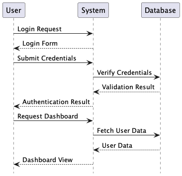
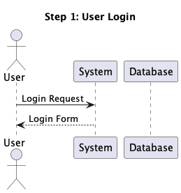
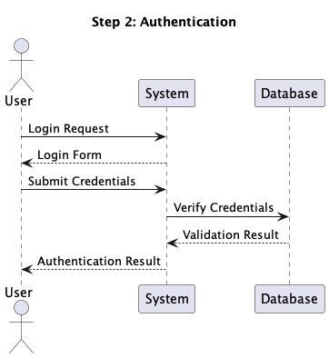
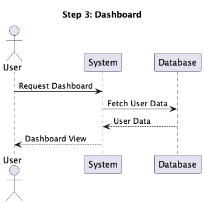

# 利用 LLM 构建定制化工具
—— 以扩展 PlantUML 为例的案例研究

</br>
本文为 [探索生成式AI](exploring-gen-ai.md) 系列的一部分，该系列记录了 Thoughtworks 技术人员在软件开发中运用生成式 AI 技术的探索实践。

|[Unmesh Joshi](https://twitter.com/unmeshjoshi)| |
|:---|---:|
| |Unmesh 是 Thoughtworks 公司的杰出工程师，常驻印度 Puna。他是 [Patterns of Distributed Systems](https://martinfowler.com/books/patterns-distributed.html) 一书的作者。|
| [原文](https://martinfowler.com/articles/exploring-gen-ai/16-building-custom-tooling-with-llms.html) |2025/5/14|

本项目使用了搭载 Claude Sonnet 3.7 的 Cursor 编辑器。
Cursor 中的智能体模式在代码生成、问题排查以及方案迭代方面尤为实用。
为便于阅读，本文仅展示部分代码片段。完整代码可在 [GitHub](https://github.com/unmeshjoshi/PlantUmlSteps) 上获取。

---
像 PlantUML 这类将图表视为代码的工具，在传达复杂系统行为方面极具价值。
它们基于文本的格式便于进行版本管理、自动化处理，也能让架构图随代码一同迭代演进。
在我讲解分布式系统的工作中，PlantUML 的时序图尤其适合精准刻画组件间的交互过程。

但我时常希望能有一个扩展程序，按步骤逐步演示这些图表，按顺序展示交互流程，而非一次性呈现全部复杂的流转逻辑 —— 就像为执行路径制作的幻灯片一样。
这种需求也反映了开发者的一个常见场景：希望根据自身需要打造个性化扩展或内部工具。

然而，对 PlantUML 这类成熟工具进行扩展通常需要大量的前期配置工作——解析钩子、构建脚本、查看器代码、打包配置等，这些繁杂的 “底层基建” 足以阻碍快速原型开发。
启动阶段所需的投入成本，往往会让很多好点子被搁置。

而 LLM 恰恰能在这方面发挥作用。
它们可以处理大量样板化工作，让开发者专注于设计与核心逻辑。
本文详细介绍了我如何使用大语言模型构建 PlantUMLSteps 这款轻量扩展，为 PlantUML 时序图增加分步播放功能。
本文的重点不仅在于工具本身，更在于展示整个开发流程：
如何通过与 LLM 的交互对话，迭代完成语法设计、解析、SVG 生成、构建自动化以及 HTML 预览器 (viewer) 开发，将繁琐的工作转化为可控的步骤。

## 图表即代码 —— PlantUML 入门简介
在深入开发流程之前，我们先为不熟悉的读者简要介绍一下 PlantUML。
PlantUML 是一款开源工具，允许你使用简洁的文本描述语言创建 UML 图表。
它支持多种图表类型，包括时序图、类图、活动图、组件图和状态图。

PlantUML 的强大之处在于，它能够将图表以纯文本形式进行版本控制、与文档系统集成，并在开发流水线中自动生成图表。
这对于需要随代码同步更新的技术文档而言尤其具有价值。

下面是一个使用 PlantUML 语法编写的时序图简单示例：

```
@startuml

hide footbox

actor User
participant System
participant Database

User -> System: Login Request
System --> User: Login Form

User -> System: Submit Credentials
System -> Database: Verify Credentials
Database --> System: Validation Result
System --> User: Authentication Result

User -> System: Request Dashboard
System -> Database: Fetch User Data
Database --> System: User Data
System --> User: Dashboard View
@enduml
```

经 PlantUML 处理后，这段文本会生成可视化的时序图，展示组件之间的交互过程。

</br>

PlantUML 类代码的特性使其易于学习和使用，对于已经熟悉文本类工具的开发者来说尤为如此。

这种简洁性让 PlantUML 成为非常理想的扩展对象。
借助合适的工具，我们可以在保留其文本工作流的同时增强它的功能。

本项目的目标是打造一款工具，能够将时序图拆分为多个步骤，并生成图表的分步查看视图。
这样对于上面的示例图表，我们就可以逐次查看登录、验证和控制台这几个步骤。

## 步骤 1：设计基于注释的步骤标记
第一个挑战是在不破坏标准 PlantUML 渲染效果的前提下，在 .puml 文件中标记 “步骤”。

<div style="background-color: #0a2463; padding: 8px; border-left: 4px solid lightblue;">
  我正在对 PlantUML 进行扩展，以实现时序图的分步查看功能。
  为此，我们需要在 .puml 文件中直接标记 “step” 区域，同时不影响标准 PlantUML 的渲染效果。
  请提出几种语法方案，要求如下：采用 PlantUML 的注释格式，确保核心引擎会忽略这些标记；
  允许在每个标记上携带 JSON 元数据（例如 name、newPage 属性）。
  </br></br>
  “I'm extending PlantUML to allow step by step view of a sequence diagram. For that we need to mark 'step' sections directly in .puml files without affecting the standard PlantUML rendering. Propose a few syntax options that: Use PlantUML's ' comment style so the core engine ignores them. Allow JSON metadata (e.g., name, newPage) on each marker.”
</div></br>

Claude 提出了多种语法方案，包括：

```
I'll propose some syntax options for step markers in PlantUML that use the single
quote comment style and allow JSON metadata.Here are several options:

' @step {”name”: “User Authentication”, “newPage”: true}
' @stepStart {”name”: “Database Query”, “newPage”: false} ... ' @stepEnd
' @step:{”name”: “Payment Processing”, “newPage”: true}
' @step.begin ... ' @step.meta {”name”: “API Request”, “newPage”: false} ... ' @step.end
' step{”name”: “Error Handling”}
```

**开发者洞见：**
在评估这些方案后，有经验的开发者会意识到：如果使用显式结束标记，一旦遗漏某个区域，就可能导致图表不完整。
选项 1 提供了更简洁的思路 —— 每个标记仅定义一个新步骤的开始，既能保证覆盖图表完整流程，又能保持语法简洁。

<div style="background-color: #0a2463; padding: 8px; border-left: 4px solid lightblue;">
  我们无需显式标记步骤结束，因为必须确保不会遗漏时序图的任何部分。因此方案1看起来很合适。
  </br></br>
  We do not need to mark step end explicitly, because we need to make sure that we do not miss any part of the sequence diagram. So option 1 looks good.
</div></br>

```
Perfect! Using option 1 with a single marker per step is a good choice since it avoids
the need to explicitly mark step ends, ensuring no part of the sequence diagram is
missed. So the syntax would be: ' @step {”name”: “User Authentication”, “newPage”:
true} This approach is clean, follows PlantUML's comment style with the single quote,
and allows for JSON metadata to specify properties for each step. The parser in your
extension can look for these markers and process the sequence diagram accordingly.
```

## 步骤 2：构建解析器逻辑（及调试）
<div style="background-color: #0a2463; padding: 8px; border-left: 4px solid lightblue;">
  “现在我们需要解析 PlantUML 文件并拆分出各个步骤。
  每当遇到步骤标记时，就创建一个步骤对象，并将后续行持续添加到该步骤中，直到遇到下一个步骤标记或文件末尾。
  如果遇到另一个步骤标记，则创建新的步骤对象。
  新步骤应包含上一步中的所有引入文件、参与者与角色声明。
  若步骤元数据中包含 newPage 属性，则新步骤无需继承上一步的全部内容；若无该属性，则需完整继承。
  如果未检测到任何步骤标记（即文件未划分步骤），则应创建一个默认步骤。
  请编写一个 StepParser，用于解析给定的 PUML 文件并生成步骤列表。”
  </br></br>
  “Now we need to parse the plantuml files and separate out step. Whenever we encounter a step marker, we create a step object and keep adding the next lines to it until we encounter another step marker or end of file. In case we encounter another step counter, we create new step object, it should have all the includes, actors and participants from the previous step. It should also have all the content of the previous step, unless the step metadata has 'newPage' attribute. If there are no step markers encountered, which is the case where we have files without steps, it should create a default step. Create a StepParser to parse given puml files and create list of steps.”
</div></br>

Claude 生成了 StepParser 类和 Step 模型类的初始代码，用于处理带有步骤标记的 PlantUML 文件解析。
该初始实现存在一些逻辑问题：

- 当 `newPage` 属性为 false 时，步骤内容继承处理不正确
- 对出现在第一个步骤标记之前的声明（角色、参与者）处理不当
- 对没有标记的文件创建默认步骤时存在问题

当时 Cursor 编辑器正以智能体模式运行，因此在运行测试并通过失败信息定位到这些问题后，Claude 提供了修正版本，能够正确处理以下情况：

- 收集第一个步骤标记之前的内容
- 继承紧邻上一步的内容
- 全局跟踪跨步骤的声明
- 为不含标记的文件正确生成默认步骤

经过这些修正，解析器顺利通过了所有测试。

下一步是生成 Gradle 任务。

<div style="background-color: #0a2463; padding: 8px; border-left: 4px solid lightblue;">
  我们需要编写一个 Gradle 任务，用于处理 "src/diagrams" 及其子文件夹下的 PUML 文件。
  针对每个文件，该任务应创建一个以文件名命名的目录，并在其中为每个步骤生成合法的 PUML 文件。
  生成方式只需在步骤内容开头添加 @startuml、结尾添加 @enduml 即可。
  </br></br>
  We need gradle task which can process puml files in src/diagrams and its sub folders. For each file it should create a directory with the name of the file where it generates valid puml file for each step. It can generate that by just adding @startuml at the start and @enduml at the end of the step content.
</div></br>

```
I'll help you create a Gradle task to process PlantUML files and generate step-by-step
diagrams. First, let's create the task in build.gradle:
```
```python
// Process each .puml file in the input directory and its subdirectories
fileTree(inputDir).include('**/*.puml').each { pumlFile ->
    def relativePath = inputDir.toPath().relativize(pumlFile.toPath()).toString()
    def fileName = pumlFile.name.replace('.puml', '')
    def stepOutputDir = new File(outputDir, fileName)
    
    if (!stepOutputDir.exists()) {
        stepOutputDir.mkdirs()
    }
    
    // Run the generator for this file
    javaexec {
        classpath = sourceSets.main.runtimeClasspath
        mainClass = 'com.example.StepDiagramGenerator'
        args = [pumlFile.absolutePath, stepOutputDir.absolutePath]
    }
```

Claude 还帮忙生成了一个简单的 PlantUML 时序图，用于测试该 Gradle 任务，也就是本文开头使用的那个示例图。

该 Gradle 任务需要一个 PlantUMLGenerator 类，用于为每个步骤生成 SVG 文件。
处于智能体模式下的 Cursor 自动生成了这个类的代码。

随后它运行构建流程以验证该任务是否可用。

```
Let's run a test to confirm our implementation works: cd /Users/unmeshjoshi/work/plantumlsequence && ./gradlew clean build
                
Task :generateStepDiagrams
Generated step diagram: /Users/unmeshjoshi/work/plantumlsteps/build/generated-diagrams/user-authentication/step-01-step-1-user-login.puml
Generated step diagram: /Users/unmeshjoshi/work/plantumlsteps/build/generated-diagrams/user-authentication/step-02-step-2-authentication.puml
Generated step diagram: /Users/unmeshjoshi/work/plantumlsteps/build/generated-diagrams/user-authentication/step-03-step-3-dashboard.puml
Generated step flow summary: /Users/unmeshjoshi/work/plantumlsteps/build/generated-diagrams/user-authentication/summary.puml

        BUILD SUCCESSFUL in 543ms
        3 actionable tasks: 3 executed
```

## 步骤 3：生成用于步骤序列的HTML查看器
下一步是生成一个简洁的 HTML 查看器，用于查看步骤序列。

<div style="background-color: #0a2463; padding: 8px; border-left: 4px solid lightblue;">
  现在我们需要生成一个 HTML 查看器，用于逐个展示步骤文件。
  该查看器可设置一个视图区域，用于展示为每个步骤生成的 SVG 图片，并显示对应步骤元数据中的步骤名称。
  我们可以添加上一步和下一步按钮，以切换展示不同步骤的图片。
  </br></br>
  Now we need to generate a HTML viewer for the step files to be shown one by one. The HTML viewer can have a view area where we show the svg image generated for each step with the step name in the metadata for that step. We can have next and previous buttons to show next and previous step image.
</div></br>

```
I'll help you create an HTML viewer for the step diagrams. We'll need to: Generate SVG
files from the PlantUML files Create an HTML viewer with navigation controls Update
the Gradle task to generate both PlantUML and SVG files, along with the HTML viewer
First, let's create a simple HTML template for the viewer: ....
```

智能体模式发现了模板存在的若干问题，并通过执行一些修正操作自动解决了这些问题。

这套方案让我们能够从单个 PlantUML 文件快速生成分步图表，并以分步形式进行查看。
因此上述图表可按以下步骤序列进行展示：

</br>
</br>
</br>


## 代码是唯一可信源
接下来该如何发展？

虽然提示词与 LLM 助手（本次采用类智能体交互模式，使用了 Claude Sonnet 等模型）为快速生成可用的 PlantUMLSteps 初始版本提供了极为高效的方式，但认清这类生成内容的本质至关重要。

- **提示词不具有确定性** ：我们对话中使用的提示词对本次交互有效，但不能被当作最终的 “可信源”。
由于大语言模型生成过程固有的可变性，即使使用相同提示词，在不同模型上运行，或在后续时间在同一模型上运行，也无法保证生成完全一致的输出。

- **代码需要管理** ：生成的代码才是工具功能的可信源。
因此，它需要像其他软件产物一样被对待——纳入版本控制、进行评审、测试与维护。

- **评审以保证可维护性** ：在初始创建阶段完成后，重新审视大模型生成的代码至关重要。
代码是否 “宜居” ？
也就是说，人类开发者能否轻松阅读、理解并修改？
尽管大模型帮助跨越了初期障碍并完成了样板代码，但要保证代码库的长期可维护性与清晰性，通常需要人工评审并酌情重构。
我们的目标是代码不仅能正常运行，还能在未来持续高效迭代演进。

在开发初期，使用自然语言（如英语）编写提示词来生成代码效果很好——尤其是在探索思路、搭建功能框架，或是熟悉新工具、新框架时。
<ins>但随着系统逐渐成型，模糊或宽泛提示词的局限性就会显现出来。
在这个阶段，我们需要的不再是更多的代码生成，而是概念建模——利用编程语言或技术栈的构造，精准地表示领域逻辑。
这一阶段需要更深入的思考来构建抽象层，并让代码结构与领域概念保持一致，而这只能通过严谨设计实现，并非单纯依靠提示词就能完成。
如果不经审查、基于提示词生成代码的方式被称作 “氛围编码 (vibe coding)”，那么这种更规范的方法便可称为 “AI 辅助的结构化编码”</ins>。

## 超越代码生成：重构中的开发者洞见
下一步是对代码进行重构，使其更具可读性与可维护性。

最初，parse 方法是一个冗长的单体函数，从检测步骤标记到管理声明与内容，所有逻辑都混杂在一起。
代码难以理解，也难以维护。

完整代码可在 [GitHub 上的此次初始提交](https://github.com/unmeshjoshi/PlantUmlSteps/commit/c50eafe0eef2dd97a56cd60a55baf69869994fc8#diff-01bd69bfbdde13cd432f55629e3c850c00ab6907b88cf8c5314a9aa645546ed3) 中查看。

<div style="background-color: #0a2463; padding: 8px; border-left: 4px solid lightblue;">
  StepParser.java 中的 parse 方法需要重构。
  它应当体现需求中用到的概念或领域概念，遵循标准的整洁代码规范，使用表意清晰的方法命名，让代码读起来如同领域特定语言（DSL）一般流畅。
  </br></br>
  The StepParser.java parse method needs refactoring. It should represent concepts used in the requirement or domain concepts and follow standard clean code practices with intentional method names and code that reads like a DSL.
</div></br>

这一初始请求较为开放，这表明开发者意识到代码需要改进，但希望获得具体实施思路上的指导。大语言模型给出了一套完整的重构方案，其中新增了多个类与方法：

```
- Introduced `PlantUmlDocument` to represent the document being parsed
- Smaller, more focused methods with intention-revealing names
- Better encapsulation of related behaviors
- More expressive variable and method names
```
```java
    /**
     * Represents a PlantUML document being parsed, managing state during parsing
     */
    private class PlantUmlDocument {
        private final List steps = new ArrayList<>();
        private final List declarations = new ArrayList<>();
        private final List contentBeforeFirstStep = new ArrayList<>();
        private Step currentStep = null;
        private boolean hasStepMarkers = false;
        
        public void beginNewStep(StepMetadata metadata) {
            hasStepMarkers = true;
            
            // Save the current step if it exists
            if (currentStep != null) {
                steps.add(currentStep);
            }
            
            // Create a new step
            currentStep = new Step(metadata.getName(), metadata.isNewPage(), metadata.getAttributes());
            
            // Add all declarations to the new step
            currentStep.addAllDeclarations(declarations);
            
            // If this isn't a new page and we have previous steps, copy all content from previous steps
            if (!metadata.isNewPage() && !steps.isEmpty()) {
                carryOverPreviousStepsContent();
            }
        }
        
        private void carryOverPreviousStepsContent() {
            for (Step previousStep : steps) {
                for (String contentLine : previousStep.getContent()) {
                    currentStep.addContent(contentLine);
                }
            }
        }
        
        public void addDeclaration(String line) {
            declarations.add(line);
            
            if (currentStep != null) {
                currentStep.addDeclaration(line);
            } else {
                contentBeforeFirstStep.add(line);
            }
        }
        
        public void addContentLine(String line) {
            if (currentStep != null) {
                currentStep.addContent(line);
            } else if (!line.trim().isEmpty()) {
                contentBeforeFirstStep.add(line);
            }
        }
        
        public void finalizeDocument() {
            // Add the last step if it exists and hasn't been added yet
            if (currentStep != null) {
                steps.add(currentStep);
            }
        }
```

完整代码可在 [GitHub 的此次提交](https://github.com/unmeshjoshi/PlantUmlSteps/commit/661002fcede7ec70eac2b41309fb9423d14c4ca1) 中查看。

<div style="background-color: #0a2463; padding: 8px; border-left: 4px solid lightblue;">
  PlantUmlDocument.java 中的 contentBeforeFirstStep 仅用于在不存在步骤标记时创建默认步骤吗？
  如此一来，我们或许可以采用两遍处理的方式：首先检查是否存在步骤标记，若存在，则执行基于步骤的处理；
  否则，直接创建一个默认步骤，并添加所有声明和内容。
  这样就无需再保留 contentBeforeFirstStep。
  我们还可以将 PlantUmlDocument 更名为 ParsedPumlFile，以此表示解析后的 PUML 文件。
  </br></br>
  The contentBeforeFirstStep in PlantUmlDocument.java is used only for creating default step when there are no step markers? So we can possibly do two pass processing where we first check if there are step markers.. if there are.. we do step-based processing. Or else we just create a default step and add all declarations and content. That will remove the need to have `contentBeforeFirstStep` We can also possibily name PlantUmlDocument as `ParsedPumlFile` which represents the parsed puml file.
</div></br>

LLM 采用两遍处理的方式实现了这一建议，并将 `PlantUmlDocument` 重命名为 `ParsedPumlFile`。
完整代码可在 [GitHub 的此次提交](https://github.com/unmeshjoshi/PlantUmlSteps/commit/f57500915039824fc2bf3f010f0dc914f363114f) 中查看。


<div style="background-color: #0a2463; padding: 8px; border-left: 4px solid lightblue;">
  `ParsedPumlFile` 更适合使用构建者模式来实现。`StepBuilder` 可以作为创建 `Step` 对象的构建器。
  </br></br>
  `ParsedPumlFile` can be better represented as builder pattern. `StepBuilder` can be a builder for `Step` objects.
</div></br>

这一见解体现了开发者对设计模式的识别能力，同时指出重构后的类采用了 Builder Pattern 。

最终的重构版本相比原始代码实现了大幅优化：

```java
class StepBuilder {
    private final List<Step> steps = new ArrayList<>();
    private final List<String> globalDeclarations = new ArrayList<>();
    private Step currentStep = null;
    
    public void startNewStep(StepMetadata metadata) {
        if (currentStep != null) {
            steps.add(currentStep);
        }
        
        currentStep = new Step(metadata);
        currentStep.addAllDeclarations(globalDeclarations);
        
        if (!metadata.isNewPage() && !steps.isEmpty()) {
            // Copy content from the previous step
            Step previousStep = steps.get(steps.size() - 1);
            for (String contentLine : previousStep.getContent()) {
                currentStep.addContent(contentLine);
            }
        }
    }
    
    public void addDeclaration(String declaration) {
        globalDeclarations.add(declaration);
        
        if (currentStep != null) {
            currentStep.addDeclaration(declaration);
        }
    }
    
    public void addContent(String content) {
        // If no step has been started yet, create a default step
        if (currentStep == null) {
            StepMetadata metadata = new StepMetadata("Default Step", false, new HashMap<>());
            startNewStep(metadata);
        }
        
        currentStep.addContent(content);
    }
    
    public List<Step> build() {
        if (currentStep != null) {
            steps.add(currentStep);
        }
        
        return new ArrayList<>(steps);
    }
}
```

完整代码可在 [GitHub 的此次提交](https://github.com/unmeshjoshi/PlantUmlSteps/commit/6b0a305d42da3df4d3d0b783926fa6e7b19045cd) 中查看。

还有更多可优化的空间，但我已选取其中一部分，用以展示 LLM 与开发者之间协作的本质。

## 结论
该扩展工具的各个部分——注释语法、Java 解析逻辑、HTML 查看器以及 Gradle 整合配置——均始于一段针对性的 LLM 提示词。
部分环节需要资深开发者向模型提供专业指导，但其核心价值在于：能够快速探索并验证思路，而不必陷入繁琐的样板代码中。
当你已有设计构想，却因搭建演示框架所需的工作量而迟迟无法动手时，LLM 能提供极大帮助。
它们可以帮你生成可用的粘合代码、集成各类库、编写简单界面，让你专注于验证想法本身是否可行。

在初始可用版本完成之后，由开发者引导 LLM 优化代码、提升代码可维护性至关重要。
开发者必须做到：

- 提出有深度的问题
- 对给出的实现方案提出质疑与检验
- 提供替代实现思路
- 运用软件设计原则

开发者与 LLM 之间的这种协作，是构建可维护、可扩展系统的关键。
LLM 可以生成可运行的代码，但唯有开发者能让代码更易读、更易维护且更具扩展性。
