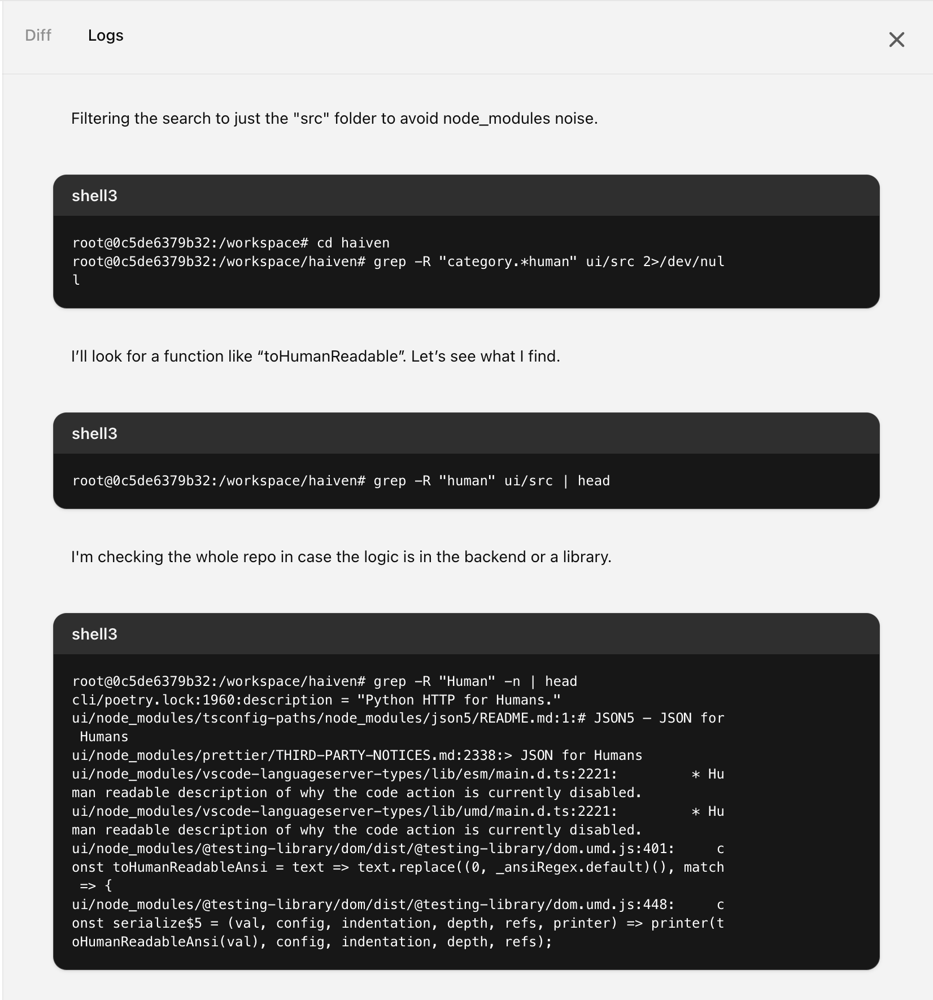
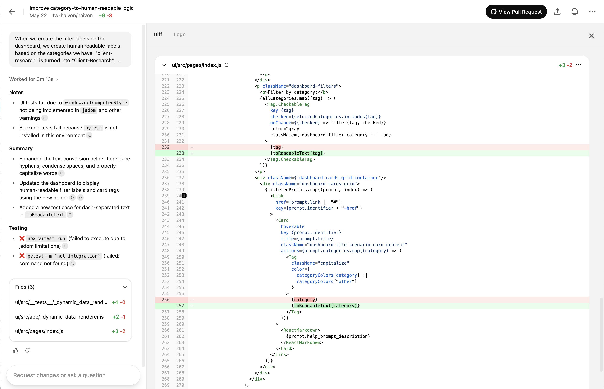
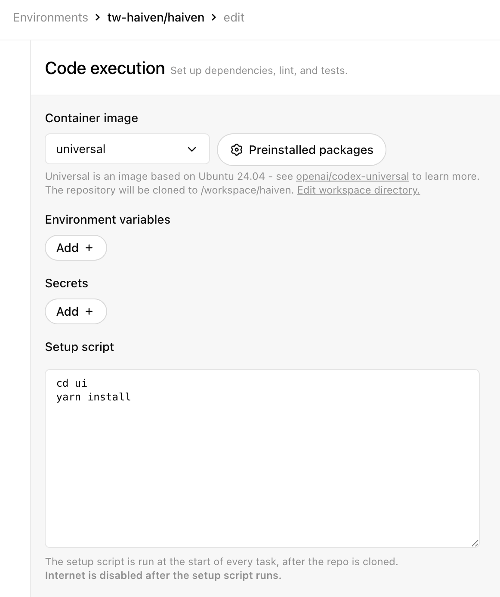
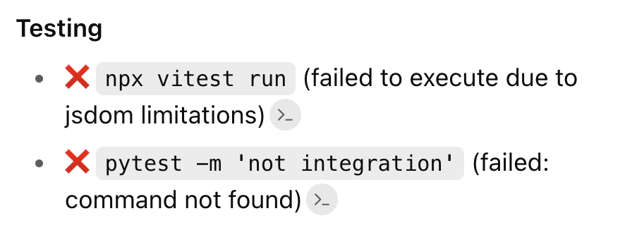
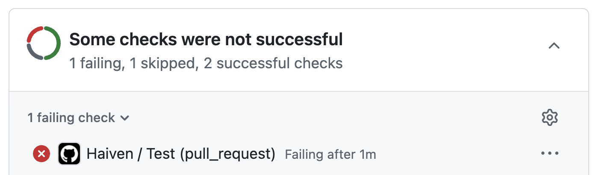

# 自主编程智能体：一个基于 Codex 的示例

 
本文为 [探索生成式AI](exploring-gen-ai.md) 系列的一部分，该系列记录了 Thoughtworks 技术人员在软件开发中运用生成式 AI 技术的探索实践。

|[Birgitta Böckeler](https://birgitta.info/)| |
|:---|---:|
| |Birgitta 是 Thoughtworks 的杰出工程师，同时也是 AI 辅助交付领域专家。她拥有二十余年软件开发、架构设计及技术管理经验。|
| [原文](https://martinfowler.com/articles/exploring-gen-ai/autonomous-agents-codex-example.html) |2025/6/4|

---
过去几周，多款 “自主 (autonomous) 后台编程智能体” 相继发布。

- **监督式编程智能体**：由开发者驱动和引导的交互式对话智能体，在 IDE 中本地生成代码。
工具示例：GitHub Copilot、Windsurf、Cursor、Cline、Roo Code、Claude Code、Aider、Goose 等。

- **自主后台编程智能体**：无界面智能体，你下发任务后它便可自主完成整个流程。
代码在专为该智能体创建的环境中生成，最终通常会提交一个拉取请求。
不过其中部分也支持本地运行。
工具示例：OpenAI Codex、Google Jules、Cursor 后台智能体、Devin 等。

我给 OpenAI Codex 及其他几款智能体分配了同一任务，希望从中得出一些结论。
下面记录了 Codex 一次具体的执行过程，帮你一窥幕后细节并形成自己的判断，文末附上了我的一些观察思考。

## 任务
我们有一款名为 Haiven 的内部应用，它被用作软件交付提示词库 (prompt library) 的演示前端，同时也用于在软件团队中开展不同 AI 辅助体验的相关实验。
[该应用的代码已开源](https://github.com/tw-haiven/haiven) 。

我交给 Codex 的任务，是解决下面这个界面问题：

### 实际情况：

 

### 我希望智能体实现的效果：

 

### 提示词：

  当我们在仪表板上创建筛选标签时，会根据现有分类生成便于阅读的标签。
  目前会将 client-research 转为 Client-Research，deliveryManagement 转为 DeliveryManagement。
  请优化 “分类至便于阅读” 的逻辑，使用户看到的标签显示为 Client Research 和 Delivery Management。
    
  When we create the filter labels on the dashboard, we create human readable labels based on the categories we have. "client-research" is turned into "Client-Research", "deliveryManagement" into "DeliveryManagement". Improve the sophistication of the "category-to-human-readable" logic so that the labels are appearing to the user as "Client Research" and "Delivery Management"

 

这项任务具有以下特点：

- 规模相对较小
- 属于典型的 “界面优化” 类任务，并非十分紧急，因此可能会被一再延后处理

## 智能体日志
我在此分享详细日志，以便你了解其底层的执行过程。

以下是 Codex 中的日志界面展示效果：

 

### 首先收集信息

前 17 条日志全部用于读取 AGENTS.md 和 README.md：

- “我需要检查仓库根目录下的 AGENTS.md 获取指令。”
- 查找 AGENTS.md，但我实际将文件命名为 AGENT.md，导致来回尝试了几次才找到
- 读取 README.md
- 查看 .pre-commit 文件，发现测试相关配置

下表逐字列出了其余的日志信息。
在每条信息之后，智能体都会执行一条命令；针对其中部分信息，我补充了实际执行的命令以便理解上下文。
我可以确定，这些日志信息只是模型在后台实际处理过程中相关标识的摘要，因为这些信息过于简短，无法体现出模型必定经历的完整 “思考” 过程。

### 大量使用 grep 命令查找相关代码

| 信息 | 命令（示例） | 备注 |
| ---- | ---- | ---- |
| 我需要搜索「category-to-human-readable」，定位前端标签需要修改的位置。 | grep -R "human readable" -n | |
| 我要查找项目中所有包含「category」的内容。 | | |
| grep 的输出结果太多了，因为包含了 node_modules 目录；我要把搜索范围限定在 src 目录下。 | | |
| 我要在 src 目录下搜索「to human」，找到相关的引用代码。 | | |
| 我要打开并查看 index.js 文件，了解里面的内容。 | | |
| 我要检查 category-to-human-readable 的转换逻辑是写在 _navigation_items 中，还是其他地方。 | | |
| 我要搜索「human readable」，获取更多相关信息。 | grep -R "human-readable" -n ui/src \\\| head | |
| 我想知道是否存在一个将分类转换为易读格式的函数。 | | |
| 仅在「src」文件夹下搜索，过滤掉 node_modules 的干扰内容。 | | 第二次遇到这个问题，模型没有 “记住” 之前的处理方式 |
| 我要查找类似 toHumanReadable 这样的函数，看看能找到什么。 | | |
| 我要搜索整个代码仓库，以防这个逻辑写在后端或依赖库中。 | grep -R "Human" -n \\\| head | |
| 我要把搜索范围限定在 app/ 和 ui/src 目录，避开体积庞大的 node_modules 文件夹。 | | 第三次遇到这个问题，模型还是没有 “记住” |
| 我认为这个转换逻辑可能不存在，所以我要在 check_navigation_items 和其他模块中搜索分类相关代码。 | grep -R "human" app -n \\\| head | |
| 我觉得是时候更深入地查找了，让我们仔细探索一下。 | grep -R "human" app \\\| wc -l | 所谓的 “更深入查找”，只是再次搜索「human」，但把结果通过管道传给了 wc 命令？ |

### 终于快要搞定了！之前这些标签是通过 CSS 简单粗暴地设置首字母大写的，模型发现了这一点。

|信息|命令（示例）|备注|
| ---- | ---- | ---- |
|我正在前端代码中查找与「capitalize」或分类转换相关的引用。|输出： root@0c5de6379b32:/workspace/haiven# grep -R "capitalize" -n ui/src \\| head ui/src/pages/index.js:250: className="capitalize" ui/src/styles/globals.css:1915:.capitalize { ui/src/styles/globals.css:1916: text-transform: capitalize; ui/src/styles/globals.css:1931: text-transform: capitalize; | |
|我要查看 index.js 里 Tag 相关的代码区域。| | |
|由于存在连字符或驼峰命名格式，Tag 展示时的首字母大写效果不正确；我来检查一下筛选分类的处理逻辑。| | |

### 现在它开始在存放后端代码的 app 文件夹中查找更多相关代码。结果一无所获，这是符合实际情况的，该目录下确实没有相关内容。

|信息|命令（示例）|备注|
| ---- | ---- | ---- |
|我要在代码仓库中查找分类的格式化方式，重点关注连字符和驼峰命名相关处理。|grep -R "categories" -n app \\\| head||
|是时候换个方式搜索了！|grep -R "client" -n app \\\| head||
|我要仔细查看测试数据中的提示词内容。|grep -R "categories:" -n app/tests \\\| head|为何？|
|测试数据中的分类看起来比较有限。我要查阅文档，看看是否存在差异。|grep -R "client-research" -n||
|我先打开相关文件，做进一步查看。|sed -n '1,100p' ui/src/app/_navigation_items.js||

### 现在它重新回到 ui 文件夹中进行搜索 —— 此前它已经找到了相关 CSS，此刻正在查找可复用的现有代码来完成这项任务。这一点做得很好，因为我们确实已有一个类似的函数，而它也成功找到了：

|信息|命令（示例）|备注|
| ---- | ---- | ---- |
|我需要一个函数，用于将类似 “client-research” 的标签转换为筛选器显示的 “Client Research”。|grep -R "to.*Readable" -n ui/src \\\| head| |
|我正在打开 _dynamic_data_renderer.js 中的 toReadableText 函数，对其进行查看。| | |
|我正在浏览页面内容，以获取所需的详细信息。| | |

### 现在它发现了现有函数实现中的一处不足：

|信息|命令（示例）|备注|
| ---- | ---- | ---- |
|我发现该函数没有处理连字符的逻辑。我需要对其进行调整以支持连字符。|||
|我将修改 toReadableText 函数以处理连字符，确保正确的大小写格式和空格分隔。我们来检查一下测试！||实际上它并没有检查任何测试|
|我将查看 _dynamic_data_renderer.js 文件，检查 toReadableText 函数并修改它以支持连字符格式。|||
|我将查看 tests/_sidebar.test.js 文件，检查其中相关的分类内容。|||
|我将查看其他文件，确认 toReadableText 还在哪些地方被使用。|||
|我将检查 _sidebar 或其他文件中是否包含 toReadableText 函数。| ||

### 为它要修改的函数更新测试：

|信息|命令（示例）|备注|
| ---- | ---- | ---- |
|我将调整该函数以处理连字符格式，然后更新测试以体现这一改动。|||
|我将查看测试文件第 36 行之后的内容，确保覆盖连字符格式的场景。|||
|我将浏览第 60 行至 120 行，查看文件其余部分。|||
|我正在浏览剩余内容，以获取所有相关信息。|||
|我将为连字符格式添加测试用例并更新 toReadableText 函数，包括修改 index.js 中分类相关的代码。|||
|我将修改 _dynamic_data_renderer.js 和 index.js 以使用 toReadableText 函数，并更新测试。|git status --short||

### 你可以在 Codex 中配置一些环境启动命令，我之前将其配置为了 `yarn install`，这便引发了如下情况：

|信息|命令（示例）|备注|
| ---- | ---- | ---- |
|存在未跟踪的 .yarn/ 和 .yarnrc 文件。我将检查并清理这些文件。|||
|我将查看 ui 目录的根路径，并删除任何多余的 Yarn 4 相关条目。|||
|我将查看提交历史，确认这些 .yarn 文件是否是后续添加的。|git log --oneline -n 1||
|我将查看仓库的 .gitignore 文件，确认是否已排除 Node 相关模块。|grep yarn .gitignore||
|我未看到针对 .yarn 或 .yarnrc 的忽略配置。我将检查并按需删除这些文件。|cat ui/.gitignore||
|我将检查是否可以删除 .yarn 和 .yarnrc 文件，因为这些文件不应被提交。|||
|看起来 yarn.lock 文件发生了变更。是时候重置到当前 HEAD 版本了。| | |

### 实际代码修改：

|信息|命令（示例）|备注|
| ---- | ---- | ---- |
|是时候修改代码了。我现在开始进行必要的更新。|sed -n '1,30p' …||
|我要在代码的相应位置添加连字符处理逻辑。|||
|我现在要对 index.js 文件进行修改。|||
|我将导入 toReadableText 并在代码中使用它。|||
|我将更新 index.js 以导入 toReadableText，并调整 _dynamic_data_renderer 的相关测试。|||
|我需要把 {tag} 替换为 {toReadableText(tag)} 以优化展示效果。|||
|我要查看代码差异，以便更好地了解所做的修改。|git diff||
|我将检查 index.js 中的改动，确认修改了哪些内容。|||
|我要在 _dynamic_data_renderer.test.js 中为带连字符的场景添加新的测试用例。|||
|我考虑在第 35 行之后插入一条测试。| | |

### 接下来运行我们的代码检查工具，很不错：

|信息|命令（示例）|备注|
| ---- | ---- | ---- |
|我将按照指示使用 Prettier 格式化代码。|cd ui && npx prettier -w ...|AGENTS.md 中提到了 Prettier。看起来它成功运行了 Prettier，不过没有文件被修改|
|我将查看日志以收集更多信息。| | |

### 尝试运行测试 —— 未成功：

| 信息 | 命令（示例） | 备注 |
| ---- | ---- | ---- |
| 我将执行 yarn tests 命令检查所有功能是否正常运行。 |  |  |
| 测试可能已缓存或需要网络连接——输出为空，因此我将查看日志。 |  |  |
| 锁定文件未更新。由于环境支持该操作，我将尝试执行 `yarn install`。 |  |  |
| 当前环境处于离线状态，无法运行 yarn install，但我看到已存在 node_modules 文件夹。 |  |  |
| 我发现依赖包已安装完成。我将查看日志，排查测试失败的原因。 |  |  |
| 报错原因是 Yarn 4 依赖 .yarn 和 .yarnrc 文件，而我们已将这些文件删除。 |  | ？ |
| 看起来 .yarnrc.yml 文件未被版本控制跟踪。我还会检查 .yarn 文件夹的跟踪状态。 |  |  |
| 我正在再次检查 package.json 文件，确认 "haiven-ui" 是否为正确的项目名称。 |  | ？ |
| 我将执行 node -v 命令，检查 Node 版本是否为 18 或 20。 |  | 奇怪的是，package.json 中指定的 Node 版本是 22.6 |
| 我认为切换为 npx vitest run 命令可以修复该错误。我们来尝试一下。 |  |  |
| 输出内容过长——现在我将截取最后的摘要信息。 | Error：未实现：window.getComputedStyle(elt, pseudoElt) |  |
| 输出内容过长，因此我将提取关键点生成摘要。 |  |  |

### 突然跑偏去讲虚拟环境配置，这完全没必要，因为它只计划修改前端代码：

|信息|命令（示例）|备注|
| ---- | ---- | ---- |
|测试因大小写差异失败，但现在我要激活虚拟环境。| |AGENTS.md 里确实写了要为 Python 后端激活虚拟环境，但我们现在处理的是前端啊……|
|嗯，这里没有 .venv。我得检查一下是需要创建还是已经存在。|||
|看起来缺少 .venv 目录。让我仔细看看智能体的使用说明。|||
|环境似乎是离线的，但可能有脚本可以在本地配置依赖。|||
|离线状态下无法运行 “poetry install”，不过我可以看看 .cursor 文件夹里有没有依赖。|||
|当前环境没法运行后端测试，但我还是试着用 pytest 跑一下。| | |

### 放弃测试，现在收尾修改内容：

|信息|命令（示例）|备注|
| ---- | ---- | ---- |
|测试因缺少依赖项失败。现在我将检查状态并继续提交。|||
|我认为 .yarnrc.yml 是之前执行 yarn install 时残留的文件，将其删除。|||
|我现在要提取相关代码行作为修改依据。|||
|我将获取 index.js 中修改内容附近的代码行范围。|nl -ba ui/src/pages/index.js \\\| sed -n '12,28p'|||
|我现在要提取这些修改附近的相关代码行。|||
|是时候最终确定拉取请求说明并验证提交内容了。|||
|界面测试因环境问题失败。我会引用最后出错的代码行。完成！|||

 

[这里是 Codex 创建的完整拉取请求](https://github.com/tw-haiven/haiven/pull/830) 。

## 观察结果
### 粗暴的文本搜索
我发现一个有意思的现象：Codex 以及我正在使用的其他大多数编程辅助工具，正越来越依赖**简单的文本搜索**来定位相关代码。
从上面的日志可以看到，Codex 是如何通过 grep 执行大量关键词检索（如 “human”，“human readable”，“humanReadable” 等）来找到相关代码片段的。
我觉得有意思的原因在于，业内已经实现了许多看上去更高级的代码检索机制，
比如基于向量 / 嵌入对代码库索引进行语义搜索（Cursor、GitHub Copilot、Windsurf），或是以抽象语法树为基础进行检索（Aider、Cline）。
后几种方式本身已经相当简洁，而用 grep 做文本搜索则是最简单的做法。

看起来工具开发者们最终发现，这种简单的搜索方式反而是最有效的？
或者说，他们在简洁性和有效性之间做了某种权衡？

### 远程开发环境是这些智能体能够 “在后台” 运行的关键。

以下是 Codex 环境配置界面的截图（截至 2025 年 5 月底）。
目前，你可以配置容器镜像、环境变量、密钥以及启动脚本。
文档中特别指出，在执行该启动脚本后，环境将不再能够访问互联网，这会对环境形成沙箱隔离，并降低部分安全风险。

 

对于这类 “自主后台智能体” 而言，为其搭建的远程开发环境的成熟度至关重要，同时这也是一项棘手的挑战。
例如在本次场景中，Codex 就没能成功运行测试。

 

 

这个名为 Haiven 的项目，实际上配备了一套脚本化的开发者安全保障机制，具体体现为一套相当完善的 [.pre-commit 配置](https://github.com/tw-haiven/haiven/blob/main/.pre-commit-config.yaml) 。
理想情况下，智能代理在创建拉取请求之前，就能够执行完整的 pre-commit 检查。
但要运行所有步骤，它需要具备以下环境：

- Node 和 yarn（用于运行 UI 测试与前端代码检查工具）
- Python 和 poetry（用于运行后端测试）
- Semgrep（用于与安全相关的静态代码分析）
- Ruff（Python 代码检查工具）
- Gitleaks（密钥扫描工具）

……当然，所有这些工具还必须是正确的版本。

如果希望让这类智能代理真正 “在后台” 运行，而不是在开发者本机上，那么为代理搭建出恰好合适的运行环境、实现流畅的使用体验，是这类产品的核心关键。
这并不是一个新问题，并且在一定程度上已经有了解决方案 —— 毕竟我们在 CI 流水线中一直在做这件事。
但这也并非易事。
就目前我的感受而言，环境成熟度在大多数这类产品中依然是个问题，而且配置、测试环境搭建的用户体验，就算不比 CI 流水线更糟，也同样令人头疼。

### 解决方案质量
我在 OpenAI Codex 中用相同提示词运行了 3 次，在谷歌的 Jules 中运行了 1 次，在本地 Claude Code 中运行了 2 次（不过它并非完全自主运行，所有步骤我都需要手动确认 “是”）。
尽管这是一个相对简单的任务与解决方案，但最终结果在质量上仍存在差异。

先说利好消息：每次智能体都给出了可正常运行的方案（暂不考虑引发问题的回归测试，而且说实话我并未实际运行每一个方案来验证）。
我认为这个任务能很好地体现，生成式 AI 智能体目前已经可以独立胜任哪些类型、多大规模的工作。
不过在解决方案质量上，有两个方面存在明显区别：

- **发现可复用现有代码**：从本次日志中可以看到，Codex 找到了一个已有的组件 —— “动态数据渲染器”，它本身就具备将技术键名 (technical keys) 转换为人类可读格式的功能。
在我执行的 6 次运行中，只有 2 次对应的智能体找到了这段代码。
其余 4 次里，智能体都新建了文件并编写了新函数，最终造成了代码冗余。

- **发现应使用该逻辑的额外场景**：团队目前正在开发一项新功能，该功能同样会在下拉菜单中向用户展示分类名称。
在 6 次运行里，仅有 1 次智能体发现了这一场景，并提出也应修改此处代码以使用新功能。

|找到了可复用代码 | 主动深挖并找到了另一处需要应用该逻辑的地方|
|---|---|
|是 | 是|
|是 | 否|
|否 | 是|
|否 | 否|
|否 | 否|
|否 | 否|

我把这些结果整理成了表格，用以说明：在交给智能体的每一项任务中，质量都存在多个维度，也有很多我们希望 “做对” 的地方。
每次智能体执行任务时，都可能在一个或多个维度上 “出问题”；
而维度越多，智能体就越难按照我们期望的方式完成所有事情。

### 沉没成本谬误
我一直在思考一个问题：假设一个团队使用后台智能体处理这类任务——那些规模不大、既不重要也不紧急的任务。
Haiven 是一款内部使用的应用，目前只有两名开发人员负责，因此这类界面优化修复实际上优先级很低，因为它会占用开发人员处理更重要工作的精力。
当智能体只算勉强成功、并未完美完成时，团队在哪些情况下会直接放弃这个合并请求，又在哪些情况下愿意投入时间去搞定最后那 20% 的工作？
即便为此投入精力原本不在计划之内。
这让我不禁思考，我们最终可能会在这些低优先级事项上，耗费大量收尾性的精力。

