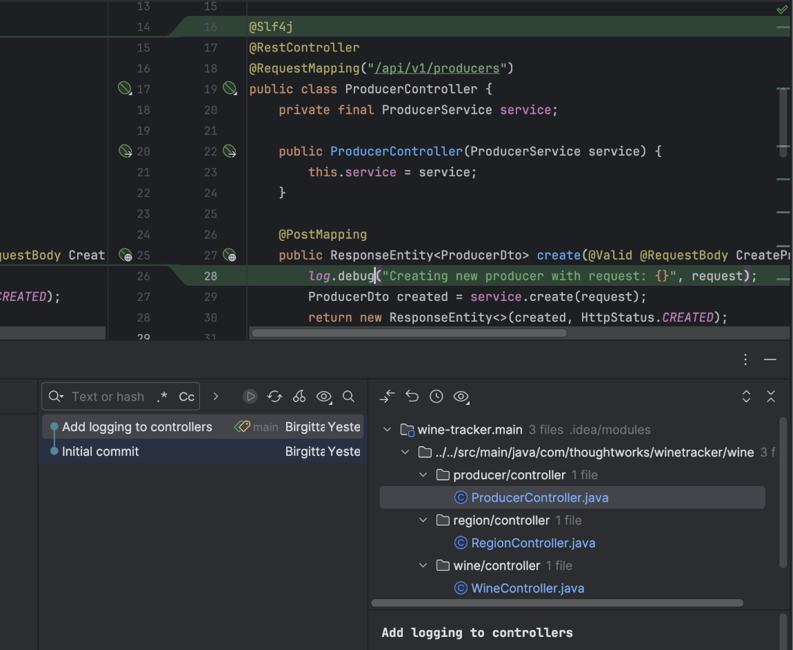
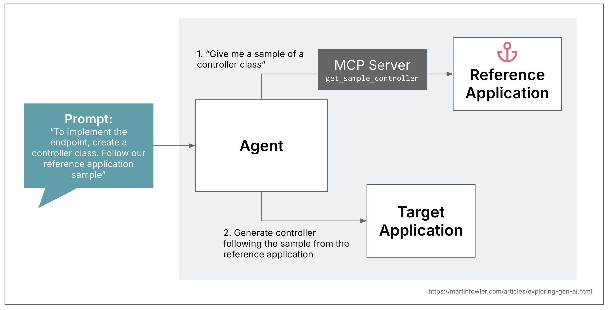
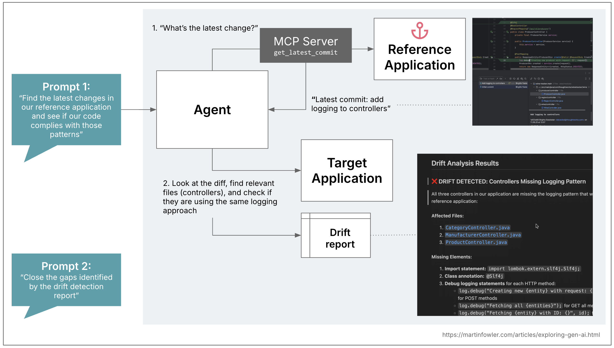

# 将 AI 锚定到参考应用

 
本文为 [探索生成式AI](exploring-gen-ai.md) 系列的一部分，该系列记录了 Thoughtworks 技术人员在软件开发中运用生成式 AI 技术的探索实践。

|[Birgitta Böckeler](https://birgitta.info/)| |
|:---|---:|
| |Birgitta 是 Thoughtworks 的杰出工程师，同时也是 AI 辅助交付领域专家。她拥有二十余年软件开发、架构设计及技术管理经验。|
| [原文](https://martinfowler.com/articles/exploring-gen-ai/anchoring-to-reference.html) |2025/9/25|

---
服务模板 (service template) 是企业为工程团队打造 “黄金路径” 时的典型构建模块，旨在让正确的做法易于落地。
这类模板应成为企业内所有服务的典范，始终体现最新的编码范式与标准。
*（译注：将服务模版理解为 MDE 中的参考实现有助于理解本文中服务模版的作用）*

不过，服务模板面临的一大挑战在于：一旦团队基于模板创建了服务，后续将模板的更新同步到这些已创建的服务中会十分繁琐。
生成式 AI 能否为此提供帮助？

## 作为示例提供的参考应用
在我近期在 [此处](https://martinfowler.com/articles/pushing-ai-autonomy.html) 撰文介绍的一项大型实验中，我搭建了一台 MCP 服务器，让编码助手能够获取典型设计模式的代码示例。
在我的场景里，这一应用基于 Spring Boot Web 框架，涉及的模式包括 repository 、service 与 controller 类。
当下，为 LLM 提供目标输出范例以提升效果，已是一种成熟的提示词工程实践。
用更专业的说法来讲，“提供示例 (providing examples)” 也被称为 [少样本提示 (few-shot prompting)](https://martinfowler.com/articles/pushing-ai-autonomy.html) 或上下文内学习 (in-context learning) 。

当我开始在提示词中使用代码示例时，很快就意识到这十分繁琐，因为我是在自然语言的 Markdown 文件里编写。
这感觉有点像我在大学里第一次用铅笔写 Java 考试题目：你根本不知道自己写的代码能否真正编译。
更重要的是，如果你要为多种编码模式编写提示词，还需要让它们彼此保持一致。
把代码示例维护在一个可以编译和运行的参考应用项目中（就像服务模板一样），会让你向 AI 提供可编译、风格一致的示例变得容易得多。

 

## 检测与参考应用的偏离
现在回到我一开始提到的问题：一旦代码生成完成（无论是通过 AI 还是服务模板生成），并在此基础上进行扩展与维护，代码库往往会逐渐偏离参考应用这一标杆范本。

因此在第二步，我开始思考如何利用这种方法，在业务代码库与参考应用之间进行 "代码模式偏离检测 (code pattern drift detection)"。
我用一个相对简单的示例做了测试：在参考应用的控制器 (controller) 类中添加了日志记录器 (logger) 以及 `log.debug` 语句。

 

随后我扩展了 MCP 服务器，使其能够访问参考应用中的 Git 提交记录。
让智能体先查看参考应用中的实际变更，能让我对偏离检测的范围进行一定控制；
我可以通过提交记录，明确告知 AI 我关注的是哪一类代码偏离。
在引入这一方式之前，我只是让 AI 对比参考控制器与现有控制器，结果它会做大量无关的比对，而这种基于提交限定范围的方式效果显著。

 

第一步，我只是让 AI 生成一份识别所有代码偏离问题的报告，方便我进行审核和修改，比如剔除无关的检测结果。
第二步，我让 AI 根据这份报告编写代码，填补其中发现的差距。

## AI 的真正创新价值体现在何处？
像添加日志记录器 (logger)、更换日志框架这类简单操作，通过 [OpenRewrite](https://docs.openrewrite.org/) 等代码修改工具也可以确定性地完成。
在选择使用 AI 之前，务必先考虑这一点。

<ins>AI 的优势在于，当代码偏离问题需要比基于正则表达式的代码修改方案更灵活的编码实现时，它能大放异彩</ins>。
以日志场景的进阶版本为例，将不规范、内容丰富的日志语句转为结构化格式时，大语言模型更擅长把各式各样的现有日志信息转换成对应的结构化形式。

这个示例 MCP 服务器包含在 [原文](https://martinfowler.com/articles/pushing-ai-autonomy.html) 配套的 [代码仓库](https://github.com/birgitta410/pushing-ai-autonomy-article) 中。
