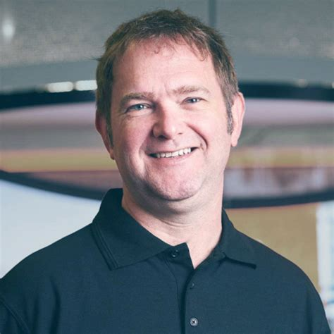
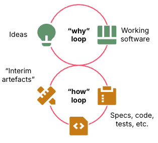
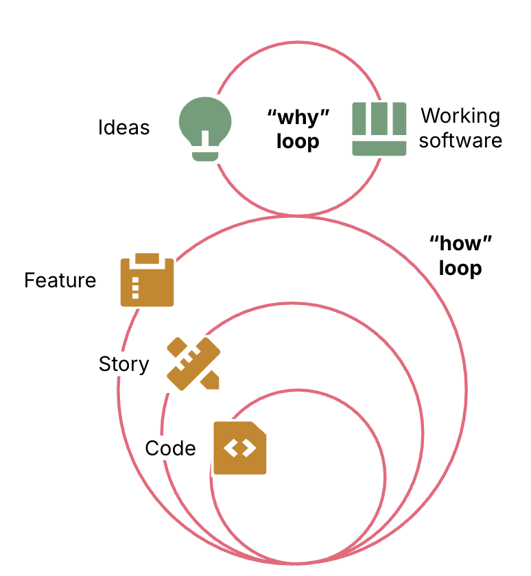
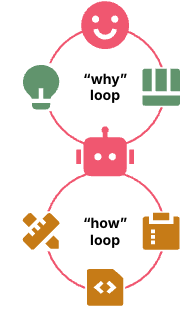
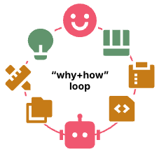
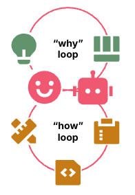

# 软件工程循环中的人与智能体

 
本文为 [探索生成式AI](exploring-gen-ai.md) 系列的一部分，该系列记录了 Thoughtworks 技术人员在软件开发中运用生成式 AI 技术的探索实践。

|[Kief Morris](https://kief.com/)| |
|:---|---:|
| | Kief Morris 居住在伦敦，担任 Thoughtworks 全球云技术专家。|
| [原文](https://martinfowler.com/articles/exploring-gen-ai/humans-and-agents.html) |2026/3/4|

---
*（译注：全篇像个科幻小说，依据部分事实加上自己的想象。我感觉这个人可能代码写的不多，甚至是反对写代码的人）*

人类是否应该完全退出软件开发流程、只做氛围编程 (vibe code)？
还是需要开发者全程介入、逐行审查代码？
我认为答案应聚焦于将想法转化为成果这一目标。
人类的正确定位，是构建并管理整个工作循环 (work loop)，而非完全放任智能体，或是微观管控其产出。
我们可将此称为 “循环之上 (on the loop)” 。

作为软件创作者，我们通过将想法转化为可运行的软件，并在学习与迭代想法的过程中持续优化，最终达成成果。
这是 “目标循环 (why loop)” 。
在人工智能真正自主崛起之前，这一循环始终由人类主导，因为我们才是成果的需求方。

软件构建的过程则是 “执行循环 (how loop)" 。
执行循环包含创建、选择与使用代码、测试、工具、基础设施等中间产物，也可能涉及技术设计文档、架构决策记录（ADR）等文档。
我们习惯将这些产物视为交付物，但实际上，中间产物只是达成目标的手段。

 
*软件交付反馈循环：上层的 “目标循环 (why loop)” 与下层的 “执行循环(how loop)” 相连。
目标循环围绕想法与可运行软件迭代优化，执行循环则围绕规格文档、代码、测试等中间产物迭代实施。*

*图 1：目标循环围绕想法与软件迭代，执行循环围绕软件构建迭代。*

实际上，执行循环（how loop） 包含多层子循环。
最外层的执行循环为目标循环定义需求并交付可运行软件。
最内层循环负责生成与测试代码。
中间各层循环将更高层级的工作拆解为更小任务，交由下层循环实现，并对结果进行验证。

 
*多层级的 “执行循环” 支撑着 “目标循环” ：外层循环围绕功能特性迭代，中层循环围绕用户故事迭代，内层循环围绕代码迭代。*

*图 2：执行循环包含多层内层循环，分别针对完整实现中的更小粒度增量开展工作。*

这些循环可能遵循设计评审、测试阶段等实践。
它们可能通过采用微服务或 CUPID 等架构方法与设计模式来构建系统。
正如从这些实践和模式中产生的中间产物一样，它们都只是实现我们真正关心的成果的一种手段。

但或许我们并不关心实现目标所使用的手段？
或许我们可以直接让 LLM 以任意方式自行运行执行循环？

## 人类脱离循环 (Humans outside the loop)
很多人已经体会到这种模式的乐趣：人类专注于目标循环（why loop），而将执行循环（how loop）交给智能体处理。
这就是氛围编码（vibe coding）的普遍定义。
对规格驱动开发（SDD）的某些解读也基本如此 —— 人类只专注描述想要达成的成果，而不规定 LLM 该如何实现。

 
*人类处于循环之外：上层的目标循环由人类掌控，围绕想法与可运行软件迭代；通过机器人连接下层执行循环，由其对代码等中间产物进行迭代。*

*图 3：人类负责目标循环，智能体负责执行循环。*

人类脱离执行循环的吸引力在于，目标循环才是我们真正关心的部分。
软件开发本身是一个复杂混乱的领域，难免会陷入过度设计的流程与技术债务的泥潭。
而迄今为止，每一代新的 LLM 都越来越擅长根据用户提示直接生成可运行的软件。
如果你对生成结果不满意，只需告知模型，它就会进行新一轮迭代。

如果 LLM 能够在无需人类参与的情况下编写和修改代码，我们还需要在乎代码是否 “简洁优雅” 吗？
只要模型能理解，变量名是否清晰表达含义就不再重要。甚至我们可能都无需关心软件是用什么语言编写的？

我们关心的是外部质量，而非单纯为了内部质量而追求内部质量。
外部质量是我们作为软件用户或其他利益相关方所体验到的质量。
功能质量是必需的，系统必须正确运行。
而对于生产环境软件，我们还关注非功能性、运维层面的质量。
系统不应崩溃，应运行流畅，我们不希望它将机密数据发布到社交媒体网站，不希望产生巨额云服务费用，并且在许多领域还需要通过合规审计。

只有当内部质量影响到外部成果时，我们才会关注它。
在人类开发者梳理代码库、添加功能和修复漏洞时，整洁的代码库能让他们更快、更可靠地完成工作。
但 LLM 并不在意开发者体验，不是吗？

理论上，我们的 LLM 智能体可以生成极度复杂、纠缠不清的面条式代码库，通过执行临时 Shell 命令进行测试与修复，并最终产出正确、合规、高性能的系统。
我们只需让大量模型像 Ralph Wiggumming 那样不断 “瞎折腾式尝试”，在依靠自身发热沸腾海水供能的数据中心里持续运行，最终总能达成目标。
[1](#1)

而在实践中，设计清晰、结构良好的代码库相比混乱代码库，具备对外部至关重要的优势。
当 LLM 能更快理解和修改代码时，它们的工作效率更高，无效循环也更少。
我们确实关心构建所需系统的时间与成本。

## 人类介入循环 (Humans in the loop)
部分开发者认为，维持内部质量的唯一方式，是深度介入执行循环（how loop）的最底层。
通常，当智能体在某段出错代码上陷入无效循环时，人类开发者能在数秒内理解并修复。
在许多场景下，人类的经验与判断力依然优于 LLM 。

 
*人类介入循环：单一的 “目标+执行” 循环，上层由人类掌控，下层由机器人执行。该循环围绕想法、代码与测试等中间产物，以及可运行软件进行迭代。*

*图 4：人类同时负责目标循环与执行循环。*

人们谈及 “人介入在循环” 时，通常是指人在最内层循环（即代码生成环节）担任把关者，例如人工检查大模型生成的每一行代码。

如果坚持过度介入开发流程，问题在于人会成为瓶颈。
智能体生成代码的速度远超人工审核速度。
<ins>有关 AI 提升研发效率的报告结果参差不齐，
至少部分原因在于：人们花费在编写规范、审核代码上的时间，比借助大模型生成所节省的时间还要多</ins>。

我们需要采用经典的 “左移（shift left）” 思想。
曾经，我们写完所有代码，交给 QA 团队测试，然后修复足够多的漏洞以便发布版本。
后来我们发现：开发者在工作过程中自行编写并运行测试，可以立即发现并修复问题，从而让整个流程更快、更可靠。

适用于人类的原则同样适用于智能体。
如果智能体能够自行评估所生成代码的质量，而非依赖人类检查，就能产出更好的代码。
我们需要向其明确我们的期望，并为其提供实现目标的最佳方式指导。

## 人类在循环之上 (Humans on the loop)
我们不必亲自检查智能体的产出，而是可以让它们更擅长自主生成高质量结果。
由规范、质量检查与工作流指引组成的整套体系，用来控制执行循环（how loop）内部各个层级的子循环，这就是智能体的管控框架（harness）。
构建与维护这类管控框架的新兴实践—— [管控工程 (Harness Engineering)](https://martinfowler.com/articles/exploring-gen-ai/harness-engineering.html) ，正是人类在循环之上开展工作的方式。

 
*人类掌控循环：由人类连接，上层的目标循环（why loop）与下层的执行循环（how loop）。目标循环围绕想法与可运行软件迭代。机器人位于执行循环的最底层，围绕规格、代码等中间产物进行迭代。*

*图 5：人类定义执行循环，智能体负责运行。*

类似循环之上（on the loop）的理念也被称作 “中间循环（middle loop）”，
包括未来软件开发研讨会（The Future of Software Development Retreat）的参与者也如此描述。
中间循环指将人类的注意力转移到高于编码循环的更高层级循环中。

介入循环（in the loop）与循环之上（on the loop）的区别，在我们对智能体产出（包括中间产物）不满意时体现得最为明显：
- 采用 “介入循环” 的方式：直接修复产物 —— 无论是手动修改，还是指令智能体按要求修正。
- 采用 “循环之上” 的方式：改进生成该产物的管控框架（harness），使其今后直接产出符合预期的结果。

我们通过持续优化管控框架来不断提升最终成果质量，并在此基础上进一步提升整体效能。

## 智能体飞轮 (The agentic flywheel)
下一阶段是：人类指导智能体去管理和优化管控框架，而非亲自动手。

 
*飞轮：上层的 “目标循环（why loop）” 通过人类与机器人共同连接下层的 “执行循环（how loop）”。目标循环围绕想法与可运行软件迭代，执行循环围绕规格说明等中间产物迭代。*

*图 6：人类指导智能体构建并优化执行循环。*

我们通过向智能体提供评估循环运行效果所需的信息来构建这个飞轮。
一个良好的起点是管控框架中已包含的测试与评估机制。
随着我们为其提供更丰富的信号，飞轮会变得更加强大。
添加用于度量性能、验证故障场景的流水线阶段；
输入生产环境的运行数据、用户行为日志与业务结果数据，从而拓宽智能体分析的范围与深度。

在工作流的每一步，我们让智能体复盘结果，并针对管控框架提出改进建议。
改进范围包括工作流中所有可能提升结果的上游环节。
我们最终得到的，是一个能够自主生成优化建议、实现自我改进的智能体管控框架。

我们首先以交互方式审议这些建议，提示智能体执行具体变更。
我们也可以让智能体将建议加入产品待办列表，以便我们对其划分优先级、安排计划，让智能体在自动化流程中自主领取、实施并测试。

随着信心逐步提升，智能体可为自身建议评定分数，包含风险、成本与收益。
之后我们便可设定规则：达到特定分数的建议可自动通过并执行。

在某种程度上，这看起来会很像人类脱离循环的传统氛围编码。
我认为，对于高频开展的标准化工作，当优化循环进入收益递减阶段时，确实会呈现这种状态。
但通过管控工程，我们得到的将不只是一次性 “够用就行” 的解决方案，而是健壮、甚至具备反脆弱性、能够持续自我优化的系统。

---
### 1
如今，“拉尔夫循环（ralph loop）” 在口语中常用来表示：直接启动一批智能体，让它们不断循环试错，直到（但愿）完成任务。
但在最初的定义里，操作者在智能体进行拉尔夫式试错的过程中，承担着引导把控的重要作用。
