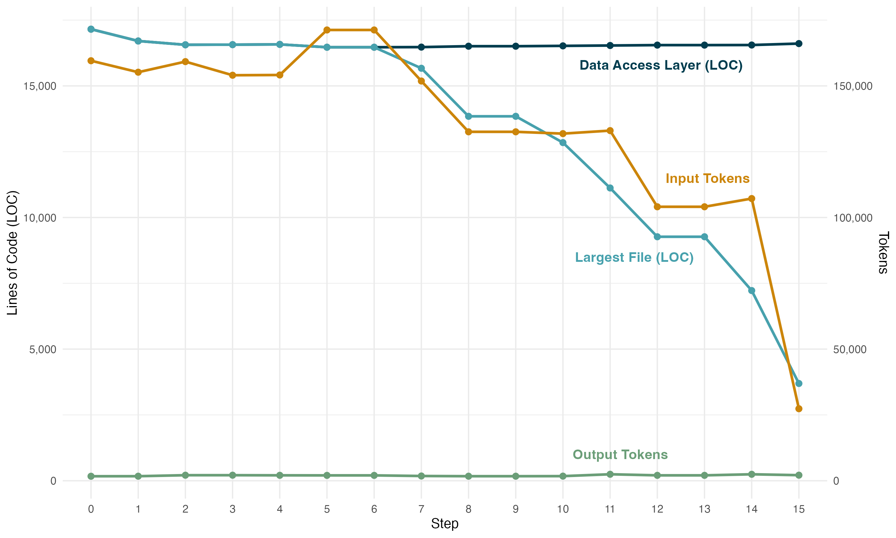

# 重构的经济效益

</br>
本文为 [探索生成式AI](../exploring-gen-ai.md) 系列的一部分，该系列记录了 Thoughtworks 技术人员在软件开发中运用生成式 AI 技术的探索实践。

|[Giles Edwards-Alexander](https://overwatering.org/)| |
|:---|---:|
| | Giles 是 Thoughtworks 在欧洲、中东和印度的首席技术官（CTO）。他在工程和技术领导方面拥有超过 25 年的经验，涵盖从移动端到 AI 的各种技术，以及包括零售、金融科技和医疗保健在内的多个行业。|
| [原文](https://martinfowler.com/articles/exploring-gen-ai/refactoring-economic-benefit.html) |2026/7/30|

---
为了适应智能体工程的新世界，我构建了一个应用程序来支持我的工作。
这是一个复杂的应用程序：高质量的 Web UI，具有动态刷新和查找、模态框和自动保存、与外部系统的集成、机器学习和文本分析、后台作业，以及带有完全自动化部署的适当环境设置。
它大约有 150,000 行代码，主要是 Rust（约 120 kLoC），其余的是 TypeScript 和 Terraform。

这完全是由智能体编写的。
主要是 Claude Code，也使用了一些 Cursor。
除了偶尔出于兴趣查看外，我没有阅读或审查任何代码。

在构建应用程序的过程中，我可以看到一些问题正在出现。
在看到一次对一个文件中第 4000 行的编辑在终端中滚动后，我仔细查看了一下。
数据访问层已经增长到超过 6,000 行。
随着更多功能的加入，它继续增长。
每个查询，无论是读取还是写入，都重复了相同的 HTTP 请求设置，相同的 JSON 编码和解码。
最终，它达到了 17,155 行。
都在一个 Rust 文件中。

## 一个重构实验

这个 17,155 行的文件是整个数据访问层。
一个单一的、自包含的模块。
审查代码时，发现没有去重，没有内部语言，函数提取有限，类提取也非常少。
它确实有一个清晰的边界，有一个需要保留的接口。
这是一个很好的重构目标。

重构智能体代码库的目标是现在花费 token 进行重构，以降低未来工作的 token 消耗。
一项实验应该能够证明，随着这个文件被重构，在这个代码库中进行单独功能实现的 token 成本会降低。

正是因为智能体从未学习过这一点，现在才能将其作为实验来运行。
我可以在每个重构阶段之后，提示一个全新的智能体进行完全相同的更改。
与人类工程师不同，实验不会因从之前的步骤中学习而受到影响。

1. 创建一个整体的重构计划，遵循严格的重构纪律。
2. 设计一个代表性的更改，用单个提示描述。
3. 建立一个基线更改成本：在一个子智能体中执行该提示，包括要求子智能体报告 token 消耗。
4. 丢弃该更改。
5. 在循环中：
   - 应用整体重构的一个步骤。
   - 在一个子智能体中，执行完全相同的更改，并获得更改的 token 成本。
   - 丢弃该更改。
   - 记录所有 token 成本、执行更改的时间，以及每个重构步骤之后的代码行数，包括基线。

用于代表性更改的提示和所应用的重构步骤显示在下面的附录中。

一个警告：尽管 Claude 显示了 token 计数、报告每个会话消耗的 token 并按 token 计费，
但它没有提供可靠的方法来实时计数 token。
我假设这是一个临时问题，会随着时间推移而改善。
相反，子智能体报告了接收和发送的字符数，并使用 [tiktoken](https://github.com/openai/tiktoken) 通过将字符数除以四来近似 token 数。

## 结果

| 步骤 | 数据访问层代码行数 | 最大单文件代码行数 | Rust总代码行数 | 每次变更输入Token | 每次变更输出Token | 单次变更耗时(秒) |
|------|-----------------------|------------------|----------------|-------------------------|--------------------------|---------------------|
| 基准版本 | 17,155 | 17,155 | 50,359 | 159,564 | 1,705 | 342 |
| 步骤1（FirestoreClient） | 16,706 | 16,706 | 49,910 | 155,205 | 1,723 | 530 |
| 步骤2（extract_doc_id, new_link） | 16,562 | 16,562 | 49,766 | 159,227 | 2,105 | 574 |
| 步骤3（链接查询辅助方法） | 16,567 | 16,567 | 49,771 | 154,054 | 2,105 | 524 |
| 步骤4（FakeStore 断言条件） | 16,577 | 16,577 | 49,781 | 154,146 | 2,060 | 654 |
| 步骤5（值构造器） | 16,469 | 16,469 | 49,673 | 171,251 | 2,036 | 1,353 |
| 步骤6（FieldsBuilder） | 16,469 | 16,469 | 49,673 | 171,251 | 2,036 | 1,353 |
| 步骤7（queries.rs） | 16,474 | 15,670 | 49,678 | 151,850 | 1,800 | 587 |
| 步骤8（traits.rs） | 16,508 | 13,845 | 49,712 | 132,558 | 1,723 | 446 |
| 步骤9（拆分traits） | 16,508 | 13,845 | 49,712 | 132,558 | 1,723 | 446 |
| 步骤10（codec.rs） | 16,521 | 12,846 | 49,725 | 131,871 | 1,750 | 540 |
| 步骤11（fake_store.rs） | 16,535 | 11,122 | 49,739 | 133,016 | 2,460 | 600 |
| 步骤12（拆分store） | 16,550 | 9,269 | 49,754 | 104,080 | 2,050 | 490 |
| 步骤13（测试代码就近放置） | 16,550 | 9,269 | 49,754 | 104,080 | 2,050 | 490 |
| 步骤14（完善fake_store.rs） | 16,553 | 7,225 | 49,757 | 107,205 | 2,453 | 523 |
| 步骤15（拆分store） | 16,608 | 3,695 | 49,812 | 27,360 | 2,113 | 454 |

这里有趣的指标是数据访问层的总代码行数、数据访问层中最大单个文件的总代码行数，以及在产生更改时消耗的输入 token 数量。

<br/>

这个图表展示了四件事。
第一个点是基线，即第 0 步，然后在应用每个重构步骤之后重复相同的指标。

- 数据访问层整体的总代码行数。
最初，这只是我刚开始使用的单个文件。
随着重构的应用，这变成了许多文件。
到最后有 19 个 Rust 文件。

- 数据访问层中单个最大文件的代码行数。
这开始于初始单个文件中的整个数据层。
到最后，单个最大的文件是一个测试库。
进一步的重构可以通过对测试库应用相同的方法。

- 子智能体在应用代表性更改时消耗的输入 token 总数。
- 子智能体在应用代表性更改时产生的输出 token 总数。

## 重构降低 token 消耗

结果很清晰。
输入 token 保持相当平稳，直到最大的文件开始变小，然后它们下降，用 Claude 的话说，跌落悬崖。

从基线到最终重构，同一任务的输入 token 从 159,564 减少到 27,360。
节省了 132,204 个 token，即 83%。
而且这种节省不是一次性的。
从现在开始，触及数据访问层的每一个更改都会花费显著更少的 token。

节省了多少？
按撰写本文时 Sonnet 5 定价 $3/MTok 计算，39.7 美分。
不多。它会倍增吗？
这将如何在调试中发挥作用？
更复杂的功能？
这只是重构了代码库的一部分，能否对整个代码库进行积极的重构以在所有地方找到节省？
那些重构的成本会是多少？

这种节省是因为智能体必须阅读更少的代码。
但这并不是因为可阅读的代码变少了。
数据访问层的整体代码总量保持相当稳定。
因此，为了能够获得这种节省，智能体必须能够成功地识别需要阅读的最小文件子集。
结果表明这正在发生。
在应用更改时阅读 Claude Code 的思考输出和文件读取摘要也表明，子智能体每次都能成功地读取越来越小的代码部分。

换句话说，随机将文件切割成更小的文件不太可能带来同样的帮助：即使每个文件都更小，智能体也不得不阅读许多文件来寻找相关代码。
而效果最大的步骤发生在最后，之前的步骤是为实现这种节省而进行的重构。
这并不是计划好的。
它只是重构典型进行方式的结果：先进行本地文件更改以提取重复项，然后在重复的核心出现后再分解成更小的文件。

重构并没有使代表性更改变得更小。
编写代码时产生的 token 数量基本不受影响：输出 token 的变化不大。
这些输出 token 的价格是输入 token 的五倍。
但是，它们的数量少了很多。
是否有可以应用的重构来减少输出 token 的产生？
我需要一个更复杂的示例更改来探索这些问题。
非确定性代码生成过程的噪声掩盖了由代码因子分解变化引起的任何差异。

## 过程中的注意事项

Claude 不擅长重构。
如果你阅读下面的提示和重构步骤，很明显产生的重构是直接响应提示的结果。
Claude 无法查看代码、查看一般的重构并找出哪些适合应用：需要人类主动引导它。
这与在这个应用中的更广泛经验相吻合。
开发工具链包括一个明确的重构步骤。
那个重构步骤并没有提示 Claude 改进这个文件。
更具体地说，Claude.ai 比 Claude Code 更好。
我使用了两个界面来创建重构计划。
Claude Code 发现了提取函数作为第一步。
Claude.ai 更进一步，看到了一个完整的客户端类需要被提取。

它在应用重构方面也很差。
重构的机械行为是通过编写使用 grep 和 sed 的 Python 脚本执行的。
这些脚本经常被缩进搞糊涂。
哦，真是讽刺。
此外，最有价值的单次重构在第一次遍历中被遗漏了，必须作为后续步骤重新应用。
这就是为什么图中的步骤数与附录中的重构步骤数不匹配的原因。

完成整个实验大约花了八个小时。
大部分时间无人值守。
唯一的干预是在 6 小时 40 分钟后，当时它看起来已经完成，但跳过了那个步骤，需要被重新引导。
这个实验是在缓慢的酒店 WiFi 上运行的。
我想知道这是否是导致时间增加的原因。
但在对代码库进行更深入的分析后，cargo 临时构建缓存变得非常大。
测试执行受到了显著影响。

## 进一步的工作和更广泛的影响

不幸的是，直到实验完成，我才想到要统计创建和执行重构计划所需的 token 数量。
我查看了在做这项工作的整个时间段内（包括设计和运行实验）的总消耗量。
我无法说出执行重构需要多少 token。
然而，上限是五百万。
这包括创建重构计划两次、设计实验（包括代表性更改）的工作，以及各种其他任务。
未来的工作应该包括更准确地统计重构所消耗的 token。

这只是一个实验，在一个重要的应用程序上进行，该应用程序仍处于绿地基状态，由单个开发人员构建和维护。
但我相信这是一个潜在有趣的第一步。
这项工作展示了重构在时间和金钱上的价值，同时衡量了重构的成本。
研究更复杂的更改、更广泛的重构、持续重构，甚至不同重构方法的相对价值，都将是很有趣的。

这仅仅是个开始。

## 附录

注意：这些附录包括我使用的提示以及返回的输出。
唯一的编辑是删除了要进行的特定代码更改。
这些内容未作编辑以显示智能体是如何被引导的。
这里没有隐藏的技巧。
因此，其中可能有一些令人困惑的语言。
错误存在于原文中。

### 代表性更改

这是记录下来的提示，它被输入给每个子智能体，除了代码库和附带的架构文档外，没有提供进一步的上下文。
每个子智能体都从完全相同的信息开始。

> 你正在 `~/dev/your-project-name` 的 Rust 项目中工作。
>
> 在 Firestore 层添加一个新的 `ItemWatchStore` 公共异步 trait，完全遵循现有模式。该 trait 必须有三个方法：
>
> - `async fn watch_item(&self, item_id: &str, user_id: &str) -> Result<()>`
> - `async fn unwatch_item(&self, item_id: &str, user_id: &str) -> Result<()>`
> - `async fn watched_items_for_user(&self, user_id: &str) -> Result<Vec<String>>`
>
> 监视记录存储在 Firestore 的 `item_watches` 集合中。
每个文档都有字段：`itemId` (字符串)、`userId` (字符串)、`createdAt` (时间戳)。
没有用于监视记录的 Rust 结构体——这些方法返回 `Vec<String>` (项目 ID)。
>
> 为 `FakeStore` (使用添加到 `FakeStoreInner` 的内存中的 `Vec<(String, String)>` 字段) 和 `FirestoreStore` (使用与此文件中其他存储实现相同的 HTTP 模式) 实现该 trait。
>
> 在你回复的最后，精确输出以下 JSON 块 (填入真实值)：
>
> ```json
> {
>  "files_read": [
>    {"path": "src/firestore.rs", "chars": 123456},
>    ...
>  ],
>  "response_chars": 7890
> }
> ```
>
> 不要提交更改。在编写代码后停止。

### 重构步骤

*「请查看原文以了解相应的步骤」*
