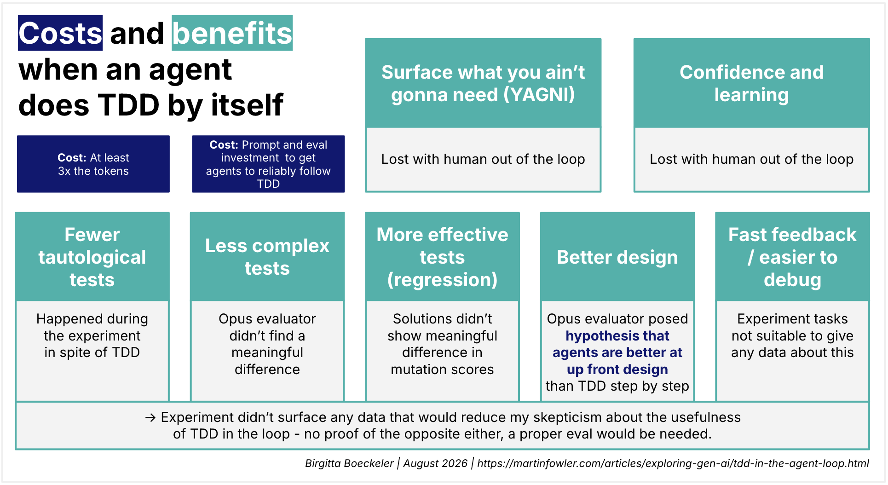

# 在 Agent 循环内部执行 TDD —— 是 “作秀” 还是 “实际价值”？

 
本文为 [探索生成式AI](../exploring-gen-ai.md) 系列的一部分，该系列记录了 Thoughtworks 技术人员在软件开发中运用生成式 AI 技术的探索实践。

|[Birgitta Böckeler](https://birgitta.info/)| |
|:---|---:|
| |Birgitta 是 Thoughtworks 的杰出工程师，同时也是 AI 辅助交付领域专家。她拥有二十余年软件开发、架构设计及技术管理经验。|
| [原文](https://martinfowler.com/articles/exploring-gen-ai/tdd-in-the-agent-loop.html) |2026/8/11|

---

TDD（测试驱动开发）工作流可以通过多种方式用于 AI 辅助编码：

- **人写测试**：
人以某种形式定义测试场景，无论是自然语言、BDD 风格还是直接写代码。
然后 AI 编写实现以使这些测试通过（可能第一步先将人的场景转换为代码）。

- **人的检查点**：
AI 编写一个失败的测试，人查看它以审查该测试是否在测试想要的行为，然后 AI 编写实现。

- **完全在 Agent 循环内部**：
提示 Agent 先逐个编写失败的测试，然后编写实现并检查之前失败的测试是否变绿。

在现阶段，最后一种用法是迄今为止最常见的。
<ins>但是，要求 Agent 完全在其自身循环内部遵循 TDD 工作流，真的有什么不同吗？
它是否真的提供了价值，还是说这是少数几个例子之一，即对人类有益的东西对编码 Agent 来说可能无关紧要甚至有害？</ins>

我创建了一个探索性的评估设置来初步探讨这个问题，看看能发现什么。
它远非全面和结构化的评估结果，但如果你正在努力让 Agent 使用 TDD，它确实产生了一些值得思考的假设。

<ins>长话短说：基于 Opus 对结果质量的判断，TDD 工作流与非 TDD 工作流之间没有明显可辨的差异。
相反，Opus 不止一次将非 TDD 工作流解决方案的设计和测试质量排名略高。
各解决方案之间的变异测试分数也没有显著差异。</ins>

## 设置

- **任务**：
在 Claude 的帮助下，我创建了一个小型、一个中型和一个大型任务，都是对某些业务逻辑的绿地实现。
我让它提出一系列建议，要求具有特异的和特定的逻辑，以增加解决方案之间出现差异的可能性，而不仅仅是重复训练数据中已经占主导地位的内容。

- **指令**：
在所有运行中，我都包含了达到至少 80 %代码覆盖率的指令。

- **模型**：
我使用 Sonnet 4.6 来生成解决方案。

- **TDD 遵循度的评判**：对 TDD 遵循度的评估也由 Sonnet 4.6 完成。

- **解决方案的评判**：
Opus 4.8 比较了两种解决方案及其测试的质量，但不知道解决方案是如何创建的。
我没有对什么是高质量给出非常具体的输入，因为这是一次非常开放的探索。
而且根据我的经验，我越具体，模型就越可能在我列出的质量标准上不必要地过度索引。
Opus 在判断代码质量方面已被证明是一个相当有能力的模型。
在对解决方案进行排名时，它即时创建了一个评分标准，传递给评估各个解决方案的所有子 Agent。

 

当你从我的结果中得出自己的结论时，需要考虑的主要注意事项有：

- 这显然是一个非常小的样本量，所以请持保留态度
- 对 “质量” 含义的判断几乎完全留给了 Opus（只有关于测试质量的几点提示）
- 没有任何一次运行完美地遵循了 TDD，但都相当不错
- 给 Agent 的编码任务都是绿地项目，且相对较小，纯粹关于业务逻辑

## Agent 执行 TDD 的能力到底有多好？

在我开始之前，我需要确保 TDD 指令确实被遵循了。
从历史上看，这对我来说并不顺利：Agent 经常先写实现，然后生成测试，跳过确认红色步骤，或者在当前测试之前过度实现，以至于下一个测试无需变红就能通过。

我最终使用的提示对 Sonnet 来说足够有效，可以用于比较，尽管所有会话都在一定程度上显示出一些这类失败。
对于每次 TDD 运行，我都有一个独立的 Agent 根据会话记录来评判工作流的遵循程度，这样我就不会意外地将一次没有真正执行 TDD 的运行纳入考量。

## 结果

我创建了 5 批解决方案，每批包含两个非 TDD 解决方案和两个 TDD 解决方案。
在其中一批中，我还添加了两个运行，指示它们先编写测试，但没有完整的 TDD 纪律（没有渐进的红/绿）。

在小型（1批）和中型（3批）任务中，出现了一个小规律：Opus 将两个非 TDD 解决方案排在第 1 和第 2 位，两个 TDD 解决方案排在第 3 和第 4 位。
只有一次 ——在我用更明确的重构和设计审查步骤强化了 TDD 提示之后—— 一个 TDD 解决方案才排在第 1 位。
在同一批中，另一个使用完全相同提示运行的 TDD 解决方案却排在最后……对于大型任务，TDD 排在中游，而两个非 TDD 运行分别占据了最好和最差的位置。

（详细信息见附录）

## 假设

总而言之，在全部批次中，TDD 和非 TDD 都既有被评为最佳解决方案的，也有被评为最差解决方案的，而 TDD 整体表现略差。

当要求 Opus 查看会话记录，并在了解每个记录使用了哪种工作流的情况下对结果进行假设时，Opus 发现，非 TDD 和测试优先的运行总是在编写任何代码或测试之前就创建了完整的设计（架构、数据类型、边缘情况、契约），而不是一次一个需求/测试地逐个处理。
这似乎是略微推动结果向更好的数据模型、更全面的跨领域边缘情况和更好的功能完整性方向发展的因素。

TDD 指令积极地反对这种前置设计步骤。
这些运行中的设计是从许多局部最小决策的总和中涌现出来的，并且很少被重新审视，因此它往往停留在第一个测试恰好锁定的任何形状上。
Agent 没有想到要为其编写测试的行为根本没有被实现。

<ins>当我与 Ivett Ördög 讨论这个问题时，她提出了这个理论：“AI Agent 的训练方式是，它们见过完成的函数和这些函数的描述。
它们见过的实际逐步 TDD 示例的数量在训练数据中只占很小一部分。
这意味着 LLM 对代码的内部表征是需求到代码的直接转换，而不是如何达到该表征的过程。”</ins>

## TDD 的目标 —— 在 Agent 循环中是否仍然实现？

以下是我关于在 Agent 循环中使用 TDD 的一般性反思，不仅基于这个实验。
我将逐一审视我个人在使用 TDD 时的最终目标，跳过一些关于首先拥有测试（特别是单元测试）的目标（如重构安全网、活文档、测试覆盖率），重点关注那些特定于 TDD 工作流的目标。

### 测试优先 >> 避免同义反复

测试优先使得断言我想要的输出变得更加容易，而不是复述实现。
这样的测试在实现错误时永远不会失败，因为它源自于它本应检查的相同逻辑。
当断言与特定的实现路径解耦时，测试实际上可以捕获行为不符合我意图的情况。

#### 在 Agent 循环中是否仍然实现？

在我的实验中，尽管先写了测试，一些 TDD 会话仍然存在这个问题。
在一个特别明显的例子中，测试将实现的输出与自身进行比较，重新运行相同的代码来生成 “预期” 答案（参见此观察列表中的第 4 点）。
先写测试并不能可靠地防止这一点 —— 它可能降低了这种可能性，这是我们用 LLM 所能期望的全部，但从这个小型数据集，我无法得出关于该概率的任何结论。

### 测试优先 >> 可测试性

测试优先确保代码从一开始就被设计为可测试的，而不是事后改造出比必要更复杂和脆弱的测试。

#### 在 Agent 循环中是否仍然实现？

结果没有给我任何明确的信号，无论哪种方向。
就这一点而言，我所选择任务的大小和性质并不需要大量可能暴露出这一点的设计复杂性。
然而，在某种程度上，可测试性是驱动设计（见下文）的推论。

### 红-绿 >> 测试有效性

先观察测试失败，然后成功（红-绿），证明它确实能捕获回归。

#### 在 Agent 循环中是否仍然实现？

当人类被移除时，这到底有多大意义？
观察测试变红只有在有人检查它为什么变红时才能证明任何事情。
当 Agent 既编写测试又确认它失败时，红色测试只能告诉你 Agent 运行了它并看到了失败，而不是失败的原因是正确的原因。
我的实验中 TDD 遵循度的评估也显示了这一点：Agent 有时仍然跳过或伪造红色步骤，或者在测试之前实现，以至于测试立即通过。
回归有效性可以通过变异测试来监控和改进（ [正如我在这里写过的](../sensors-for-coding-agents.md) ）。
各解决方案之间的变异测试分数没有显示任何信号表明 TDD 运行产生了比非 TDD 运行明显更好的变异测试分数。
我并不真正关心回归质量是如何实现的，只要我有一个机制来看它有多好。

### 测试优先，红-绿-重构 >> 驱动更好的设计

先编写测试迫使我们实现在实现之前指定用法，推动更好的接口和更模块化的代码。
TDD 循环中的重构步骤进一步推动我们逐步改进设计。

#### 在 Agento 循环中是否仍然实现？

实验至少完全没有证明 TDD 运行在设计上更优越。
我现在甚至根据 Opus 的评分怀疑 TDD 是否使情况更糟，因为非 TDD 解决方案的排名通常更高，并且它列出的设计缺陷对我来说是有道理的。
但数据集当然太小，无法得出任何确定性的结论。
（如果有人有时间和 Token 来运行一个更大的实验，那将会非常有趣！）

<ins>当人类先编写测试时，它迫使我们实现在实现之前思考用法，我们必须在不知道如何构建它之前承受指定行为和期望的摩擦。
Agent 不会经历这一点，可以在计划实现的同一时刻编写测试。
在两者之间没有人工检查点的情况下，先编写测试是否还有任何真正的目的？</ins>

### 小步 >> YAGNI

只编写足够的代码来通过下一个测试是关于克制的。
它应该阻止我们构建还没有人要求过的抽象或处理情况。

#### 在 Agent 循环中是否仍然实现？

这是一个非常以人为中心的好处，当 Agent 自己执行 TDD 时，这个好处就丢失了。
我们不再能坐享那种摩擦 —— 那种我们必须真正思考正在构建的所有复杂细节的摩擦。
这在理论上转移到了我们为 Agent 编写规格说明的时候，但我们没有一种类似 TDD 的机制让我们以小步骤来思考规格说明。

难道 Agent 不能以这些小步骤工作，并在发现可能不必要的事情时向我们提问吗？
根据我的总体经验，它们不太擅长这一点。
在实验中也一样，最小实现指令并没有可靠地阻止它们构建更多。
它们经常超出范围，实现了比当前测试要求更多的东西，因为它们拥有完整的需求。
我们通常不会逐一地喂给规格说明，那将非常低效。

### 小步 >> 快速、局部的反馈

一次只迈出一小步意味着当测试失败时，我几乎确切地知道是什么导致了它，因为自上次绿色状态以来唯一改变的就是你刚刚写的那一个东西。

#### 在 Agent 循环中是否仍然实现？

该设置没有显示 Agent 在有 TDD 与无 TDD 的情况下是否更频繁地陷入调试困境。
但根据我的总体经验，Agent 通常相当擅长找出测试为什么是红色的，即使没有采取小心的、有意的步骤来达到那里。
我仍然怀疑当它们确实陷入困境时，是否可以通过小的 TDD 步骤来有效缓解，以及整体成本/收益比较是否成立。

### 小步 >> 信心与学习

在 Kent Beck的《Test-Driven Development by Example》一书的序言中，他对 TDD 最大的理由是 “管理恐惧”。
他说，对难题的合理恐惧使开发人员变得犹豫、不善于沟通，并回避反馈。
通过 TDD，每通过一个测试都向我们展示进展，因此我们可以放松，知道进展已经被锁定。
测试是一种心理机制，帮助我们继续前进。

#### 在 Agent 循环中是否仍然实现？

这很大程度上是关于管理人类的恐惧，并给予人类放松的许可。
当 Agent 在循环内部执行 TDD 时，这并不会转移，因为它不能给我与控制相同的那份和信任，如同我自己一步一步地做一样。

## 成本

### 至少 3 倍的 Token 消耗

详见附录中的具体数字。

自然，由于 TDD 工作流需要更多的回合和工具调用，会使用更多的 Token。
然而，其中许多 Token 会命中缓存，所以请注意 3 倍或更高的 Token 因子并不直接代表实际成本增加了多少。
（不幸的是，我在实验期间没有跟踪缓存命中情况。）

## 提示维护与测试

TDD 似乎不是一个模型 “自然而然” 就会的过程。
这就像一场与训练数据的逆流之战，需要在一个提示上经过多次迭代才能让它大部分时间遵循该过程。
例如，当我在第一批次后发现 Agent 在红-绿-重构循环中没有做太多重构时，我更改了提示以强调该步骤，因为它对 TDD 当然至关重要。
后来我请 Opus 查看这些会话，看看是否发现了重构工作的改进。
它确实报告了重构步骤的增加 —— 然而，它也列出了一些案例，其中 Agent 开始重构，但决定设计已经足够好，即使在 Opus 认为明显不够好的情况下（例如，当所有内容都在一个大型模块中实现，但显然可以拆分成多个职责时）。

TDD 是一套相对复杂的指令，包含很多变量，因此 Agent 对它的解释也有很大差异。
所以我想象这类提示在不同模型之间比更简单的指令更加不稳定，这意味着需要投入精力来保持提示在不同模型和模型版本发布中有效。

 

## 我的结论

我认为，目前有越来越多的证据表明，对我们希望模型如何做某事过度具体化并不是一种可持续的方法。
相反，我们应该尽可能多地找到监控结果并给予反馈的方法。
这种反馈应尽可能自动化，并且我们需要仔细思考我们在哪里将自己插入作为判断什么是好和正确的仲裁者。

尽管我知道我的小规模评估远不能代表关于 TDD 有效性的广泛视角，但它绝对没有给我任何新的迹象表明所有这些努力是值得的。
尤其是如果我们可以找到其他方法来实现 TDD 的大部分好处。

我个人已经停止告诉我的编码 Agent 先写测试，更不用说执行 TDD 了（说实话，我从未这样做过），直到我看到评估或其他强有力的论据让我信服为止。
相反，我正试图专注于 TDD 在 Agent 循环之外使用时给我带来的好处，并探索实现它们替代方案。

### 如何获得良好的回归测试？
...以便当现有功能被破坏时，Agent 和我都能得到信号

我仍然关心扎实的回归测试，因为尽管 Agent 当然可以以错误的方式修复红色测试，但至少红色测试给它一个反馈信号，以双重检查可能被破坏的预先存在的需求。
我 [借助变异测试来监控和改进回归质量](../sensors-for-coding-agents.md)，而不是给出详细的 TDD 指令并寄希望于最好的结果。

### 如何将常规重构融入流程？
...以便代码库保持易于更改

重构仍然至关重要，但传统 TDD 的小步骤似乎在 Agent 循环中并不是一种高效或有效的方式。
以下是一些触发重构的示例：
让 Agent [访问静态代码分析](../sensors-for-coding-agents.md)；
定期 [审查结构kkkkkk:q
和模块化程度](../sensors-for-coding-agents.md)；
建立团队仪式以保持对代码库的良好理解并及早发现偏离；
关注每次更改所涉及的文件数量趋势，以及 [每次更改的 Token 数量](./refactoring-economic-benefit.md)。

### 如何获得信心？
...以便我不害怕推送到生产环境

最困难的问题仍然存在，我们如何获得 TDD 曾经给我们的那种信心，我们如何管理恐惧，我们如何锁定进展？
对此我没有明确的答案，但我只想提到一个似乎有助于构建这个答案的事情：我最近尝试了 Ivett Ördög 倡导的 [Approved Scenarios](https://lexler.github.io/augmented-coding-patterns/patterns/approved-scenarios/) 方法。
用我的话来说（不要让她为此负责），这是一种半手动测试的形式，由每个应用程序定制的测试运行器支持。
该运行器以易于思考的方式向我展示功能测试场景，并允许我在彻底确认后将期望（场景/ fixtures）在该运行器中 “冻结”。
每当将来这些冻结的期望被违反时，我必须再次批准它们。
我的同事 skkVaccari [在这里对他使用这种方法的经验进行了很好的概述](https://www.youtube.com/watch?v=3tdmoj35HG0) 。

<ins>无论最终是什么让我们对软件产生信任和信心 —— 我认为我们所知的 TDD 的作用将比生成式 AI 时代之前显著缩小。</ins>

---
### 附录：根据 Opus 评估的结果

完整结果可 [在本仓库中](https://github.com/birgitta410/tdd-comparisons/)找到。
具体内容略，请参考原文。
