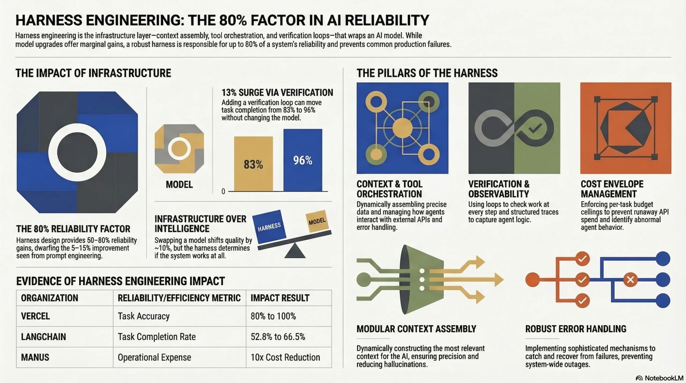

# Harness 工程是什么？2026年完整入门指南

2026年3月6日 Jamie Park 撰文 [原文](https://harnessengineering.academy/blog/what-is-harness-engineering-introduction-2026/)

---

两年前，业界还在探讨 “智能体能否工作？” 如今问题已然改变：“智能体能否实现稳定可靠、持续一致、大规模工作？”

这一转变催生了一门全新工程学科。
如果你听过 “管控工程 (harness engineering)” 这一术语，却尚不了解其含义，
也不清楚为何资深工程师正以此深耕职业方向，这份指南将为你入门引路。

本文将详解管控工程的实际定义、术语由来、支撑该学科的三大核心支柱，以及入门所需掌握的知识内容。
仅需具备基础技术求知欲，无需其他前置知识。

 
*
管控工程相关概念可视化总览。点击放大查看。
*

## 交互式概念图谱
点击任意节点展开或收起。
可使用控件缩放、自适应视图或切换全屏。

<iframe src="https://harnessengineering.academy/wp-content/uploads/mindmaps/what-is-harness-engineering-mindmap.html" style="position:absolute;top:0;left:0;width:100%;height:100%;border:none;" loading="lazy" allowfullscreen title="Interactive mind map"></iframe>

## 术语由来
本文语境中的 “Harness（管控/束具）” 一词，源自马术装备：缰绳、马鞍、马衔与笼头组合在一起，能让骑手驾驭强劲牲畜朝指定方向行进。
马匹提供原始动力，而束具实现精准管控。

在人工智能系统里，“马匹” 就是大语言模型 —— GPT-4、Claude、 Gemini、 Llama 等。
这类模型能力出众、响应迅速，性能还在持续增强。但仅凭自身，它们没有明确行进方向：会产生幻觉、遗忘长任务上下文、错用工具、写出能编译却无法运行的代码。

管控工程，就是搭建配套基础设施、包裹 (wrap) 大模型以保障其稳定可靠落地的专业领域。
这套管控体系不会替代模型本身的智能，只会对其能力进行规范与引导。

2026 年初，OpenAI 工程团队首创该术语：
其内部一款超百万行代码的产品，全程无人工手写代码。
工程师不亲自编码，而是搭建一套让智能体能稳定写代码的支撑系统 —— 这套系统，就是管控。

## 定义
**管控工程 (Harness engineering)** 是通过设计运行环境、约束规则、反馈回路与基础设施，让人工智能智能体实现规模化可靠运行的工程实践。

管控工程师不负责构建人工智能模型，也不进行模型微调或训练。
相反，他们构建模型周边的所有配套体系：模型接收的上下文、可调用的工具、避免错误的安全护栏、捕获异常的校验系统，以及处理故障的恢复机制。

如果说软件工程师构建应用、机器学习工程师构建模型，那么管控工程师就是搭建模型与现实世界可靠性之间的桥梁。

用计算机科学类比理解：模型是中央处理器，上下文窗口是内存，管控体系是操作系统，智能体是应用程序。
没有操作系统管理内存、调度进程与处理输入输出，就无法直接在中央处理器上运行软件。
同理，没有管控体系管理上下文、协调工具与处理故障，就不能部署人工智能智能体。

## 为何管控工程在当下至关重要
三大趋势相互交汇，使得管控工程在 2026 年成为必要领域。

**模型趋于商品化**。
Claude、GPT-4、Gemini 以及各类开源模型在标准基准测试中的表现差距极小。
模型本身已不再构成竞争优势，
模型周边的系统才决定了智能体在生产环境中能否成功运行。

**智能体从演示阶段迈入生产阶段**。
2025 年，大多数智能体部署还仅停留在演示、概念验证或管控严格的内部工具层面。
而到了 2026 年，各类企业开始部署智能体处理客户交互、编写生产级代码、管理基础设施以及做出财务决策。
可靠性的标准也从 “效果惊艳的演示” 提升至 “绝不能宕机” 。

**基准测试已无法衡量核心价值**。
标准基准测试仅评估单轮任务的完成情况，但生产环境中的智能体需要连续运行数小时，有时甚至数天，执行成百上千个步骤。
它们会遭遇 API 超时、调用频率限制、上下文窗口耗尽以及工具故障等问题。
如果智能体在执行五十个步骤后就偏离任务轨道，那么基准测试百分之一的性能提升毫无意义。

这三大转变催生了对一类工程师的需求：他们不专精于构建模型，而是专注于打造让模型稳定可靠运行的系统。
这就是管控工程。

## 三大支柱
管控工程建立在三大相互关联的支柱之上。
理解这些内容将为你掌握该学科的所有其他知识提供概念框架。

### 支柱一：上下文工程
上下文工程 (context engineering) 是对智能体能够访问哪些信息、何时访问这些信息，以及该信息如何结构化进行管理的工程实践。

所有人工智能模型都拥有有限的上下文窗口 (context window) 。
即便具备 20 万 token 上下文窗口的模型，在智能体执行数小时任务时也会面临实际限制：
上下文会被占满，信息被挤出窗口，智能体便会 “遗忘” 此前的决策。

上下文工程通过多种技术解决这一问题：

- **上下文压缩**：在保留与当前任务相关信息的前提下，缩减智能体工作记忆中的信息体量
- **动态上下文注入**：在合适的时机加载所需信息，而非在初始提示中一次性塞入所有内容
- **知识持久化**：将决策、进度与状态存储在上下文窗口之外（如文件、数据库或结构化日志），使智能体能够跨会话恢复状态
- **优先级评分**：按相关性对上下文内容排序，确保最重要的信息在压缩过程中得以保留

在实际工作中，管控工程师可能会创建一个 progress.txt 文件，让智能体在每次会话开始时读取，汇总已完成的工作和后续任务。
或者，他们会搭建一套系统，根据智能体当前任务动态加载相关文档，而非一次性加载全部文档。

上下文工程常被称作 2026 年人工智能开发者最重要的技能。
它直接决定了智能体能否在长时间任务中保持行为连贯。
如需深入了解，敬请关注我们即将推出的 [上下文工程基础指南](#todo) 。

### 支柱二：架构约束
如果说上下文工程是为智能体提供正确的信息，那么架构约束 (architectural constraints) 就是防止智能体做出错误行为。

生产环境中的智能体需要明确的边界。
没有约束的话，负责代码重构的智能体可能会重写整个代码库；
管理基础设施的智能体可能会删除本不应触碰的资源；
生成内容的智能体可能会使用与品牌调性不符的语气。

架构约束包括：

- **工具访问控制**：定义智能体可以使用哪些工具、能够修改哪些文件，以及哪些操作需要人工审批
- **结构规范强制**：使用代码检查工具、类型检查器以及 CI/CD 流水线，自动验证智能体的输出是否符合质量标准
- **作用范围边界**：限制智能体在单次任务中可修改的内容，避免引发级联式变更
- **安全防护护栏**：在智能体输出投入生产前，对其进行过滤，排查安全漏洞、有害内容或违规行为

OpenAI 的管控工程方案同时运用 AI 智能体和确定性代码检查工具 (linters) 来保障架构规范。
确定性检查能立刻发现结构违规问题，AI 智能体则能捕捉更细微的问题，例如命名规范不一致或文档内容滞后。

其核心理念是：约束并不会降低智能体的能力，反而会提升其能力。
在边界清晰的环境中运行的智能体可以拥有更高的自主性，因为管控系统会拦截错误。
如果没有约束，就需要持续的人工监督，这也就失去了使用智能体的意义。

### 支柱三：熵管理
随着时间推移，人工智能生成的代码和内容会逐渐累积不一致问题：
变量命名出现混乱、文档与实现脱节、无效代码不断堆积、测试覆盖率下降。
这种系统退化现象就是熵 (entropy) 。

在传统软件开发中，开发人员会在代码评审、代码重构和知识共享过程中自然发现并修正熵增问题。
而在智能体驱动的开发模式下，熵增速度会大幅加快，因为智能体生成代码的速度远超人工评审速度。

熵管理技术包括：

- **定期审计**：通过定时执行的智能体任务，扫描代码中的不一致问题、无效代码以及文档滞后情况
- **自动化清理**：由专门的智能体负责代码重构、测试维护与文档更新
- **回归检测**：用于识别智能体行为随时间出现退化的系统
- **模型漂移监测**：检测因模型服务商更新或上下文劣化导致模型输出质量下降的情况

Martin Fowler 的 [分析](#todo) 指出，管控工程将塑造两种未来形态：需要改造适配的人工智能时代前应用，以及从一开始就为智能体维护而设计的人工智能时代后应用。
理解熵管理对这两者而言都至关重要。

## 管控工程与相关学科的区别
如果你来自相关领域，以下内容将帮你理解管控工程在整个技术体系中的定位：

| 学科 | 核心关注点 | 与管控工程的关系 |
|---|---|---|
| 提示词工程 | 设计面向语言模型的有效输入 | 属于上下文工程的一部分（支柱一） |
| 机器学习工程 | 模型训练、微调与部署 | 独立学科；管控工程以模型已存在为前提 |
| 智能体工程 | 构建智能体逻辑、工具与工作流 | 互补关系；智能体工程师搭建智能体，管控工程师构建其外围系统 |
| 开发运维 / 平台工程 | 基础设施、持续集成/持续部署、发布部署 | 技能重叠；管控工程将类似原则应用于 AI 特定场景 |
| 上下文工程 | 管理流向 AI 系统的信息 | 管控工程的核心支柱之一，而非学科全部 |

最简单的区别在于：提示词工程优化单次交互，智能体工程优化智能体的逻辑，而管控工程优化让智能体可靠运行的整个系统。

## 入门指南：优先学习内容
如果你对管控工程感兴趣，以下是按技能等级整理的实用学习路径。

### 基础阶段（第 1–4 周）
1. **理解大语言模型 API 的工作原理**。
直接使用 OpenAI 或 Anthropic API 构建一个简单应用，不依赖任何框架。
这能帮你建立关于提示词、模型输出以及工具调用的基础认知。

2. **学习上下文窗口管理**。
尝试进行长对话，观察上下文占满后模型行为的变化。
试着对早期对话内容进行总结以释放空间，这就是最基础形式的上下文工程。

3. **构建一个具备工具调用能力的简易智能体**。
创建一个可调用 2–3 种工具（文件读取、网络搜索、计算）的智能体，观察它的失效场景。
这些失效问题正是管控工程要解决的核心。

### 中级阶段（第 2–3 个月）
4. **学习生产级智能体架构**。
阅读 Anthropic 关于 [高效管控长运行智能体的指南](https://www.anthropic.com/engineering/effective-harnesses-for-long-running-agents)，
研究其初始化智能体、进度文件与会话衔接的设计思路。

5. **构建跨会话智能体**。
创建一个可跨越多个上下文窗口完成任务的智能体，实现进度持久化与状态恢复。
这正是管控工程发挥关键作用的场景。

6. **实现防护护栏**。
为智能体添加约束：工具访问控制、输出校验与作用范围限制。
评估这些约束对可靠性与自主性的双重影响。

### 高级阶段（第 4–6 个月）
7. **构建完整的管控系统**。
为生产级智能体设计全套基础设施：上下文管理、工具编排、状态持久化、错误恢复、监控与评估。

8. **学习评估框架**。
学会系统性地衡量智能体可靠性，构建评估数据集，
运行回归测试。在此阶段，熵管理将变得至关重要。

9. **为开源管控项目贡献代码**。
将你的技术能力应用于 LangChain、Claude Agent SDK 或 CrewAI 等框架。
理解多种实现方案能深化你的专业水平。
有关工具对比，可参阅我们在 [agent-harness.ai 上的框架对比指南](https://agent-harness.ai/blog/ai-agent-frameworks-2026-comparison/) 。

## 常见问题
### 学习管控工程需要具备机器学习背景吗？
不需要。相较于机器学习研究，管控工程更贴近系统工程与运维开发。
你只需理解大语言模型 API 的工作原理，无需掌握 Transformer 架构或模型训练流程。
扎实的软件工程基础比机器学习专业知识更为重要。

### 管控工程师是正式的职位名称吗？
该职位正在兴起。
截至 2026 年初，在具有前瞻性的人工智能企业以及大量使用人工智能智能体的团队中已出现该岗位。
即便职位名称尚未正式确定，相关技能也十分抢手。
可关注招聘中名为 “人工智能基础设施工程师”，“智能体平台工程师” 或 “人工智能系统工程师” 的岗位。
职业相关详情，敬请关注我们即将推出的 [管控工程师职业指南](https://harnessengineering.academy/blog/) 。

### 管控工程与 MLOps 有何区别？
MLOps 聚焦于机器学习模型的生命周期：训练、部署、监控与再训练。
管控工程则聚焦于已部署模型的外围系统，保障智能体行为稳定可靠。
二者在监控与基础设施方面存在重叠，但核心关注点不同。
MLOps 关心 “模型表现是否良好？”，管控工程关心 “智能体在当前场景下能否输出可靠结果？”

### 构建一套生产级管控系统需要多久？
范围明确的单智能体系统：2–4 周。
具备复杂编排、状态管理与评估能力的多智能体系统：2–6 个月。
相关投入会通过减少调试耗时、提升智能体可靠性获得回报。

### 学习管控工程应该掌握哪种编程语言？
Python 在人工智能智能体生态中占据主导地位。
大多数框架、软件开发工具包和工具都以 Python 作为首要开发语言。
TypeScript 是第二常用语言，尤其适用于基于网页的智能体系统。
优先学习 Python，有需要时再补充 TypeScript 即可。

## 下一步
管控工程是一个新兴领域，现在开始入门能让你领先于大多数工程师。
该领域的人才需求增长速度远超从业者供给速度。

**本周任务**：使用原生大语言模型 API 构建一个简易智能体，观察其失效场景。
这些失效问题正是管控工程所要解决的。

**本月任务**：阅读基础资料 —— [OpenAI 的管控工程文章](https://openai.com/index/harness-engineering/) 与 Anthropic 的 [高效管控体系指南](https://www.anthropic.com/engineering/effective-harnesses-for-long-running-agents) 。
这两份文档定义了该学科的当前发展水平。

**本季度任务**：持续关注我们学院的内容，我们将深度解析三大支柱：上下文工程、架构约束、熵管理，以及串联起这些内容的实用技能。

若你希望紧跟该学科的发展动态，可 [订阅学院通讯](https://harnessengineering.academy/newsletter/)，教程、职业指南与学习路径将直接发送至你的邮箱。
