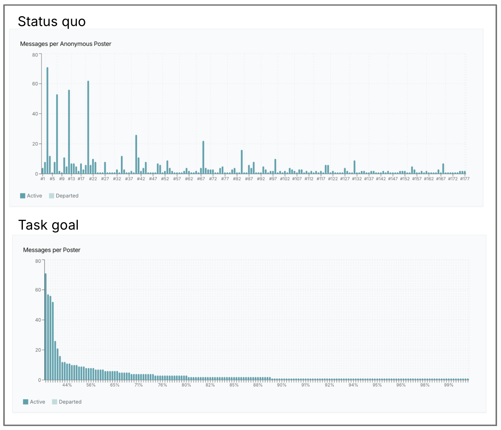
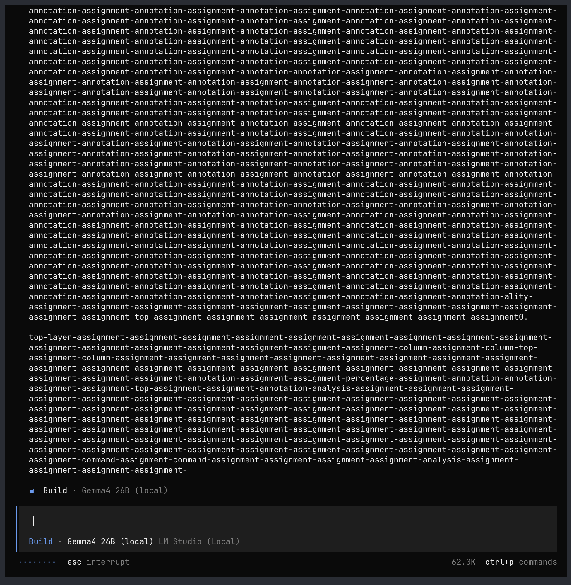
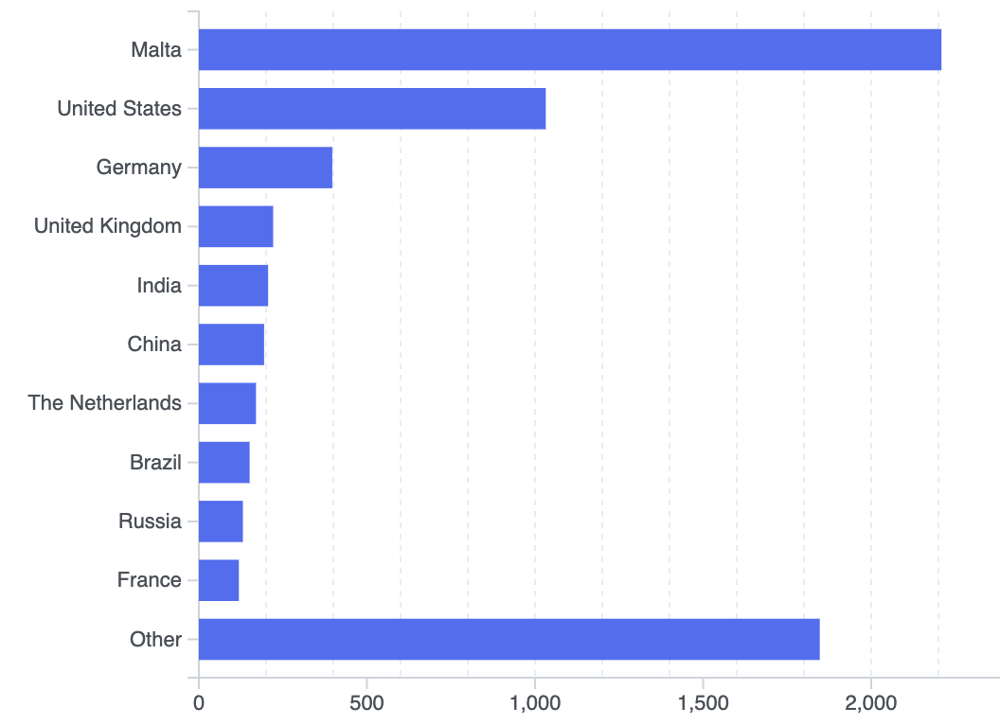
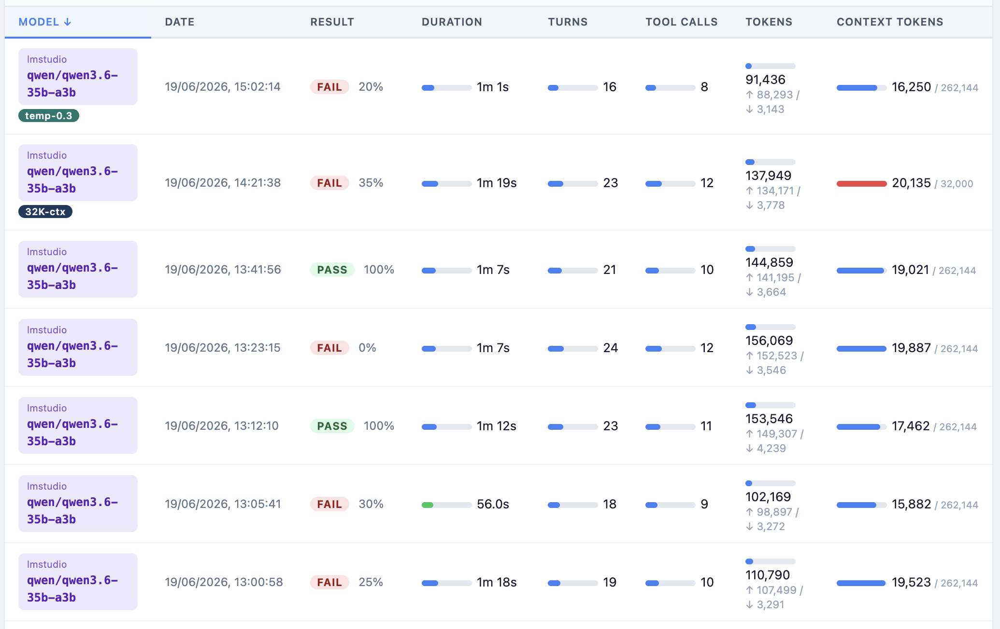

# 本地模型用于编码的体验

 
本文为 [探索生成式AI](../exploring-gen-ai.md) 系列的一部分，该系列记录了 Thoughtworks 技术人员在软件开发中运用生成式 AI 技术的探索实践。

|[Birgitta Böckeler](https://birgitta.info/)| |
|:---|---:|
| |Birgitta 是 Thoughtworks 的杰出工程师，同时也是 AI 辅助交付领域专家。她拥有二十余年软件开发、架构设计及技术管理经验。|
| [原文](https://martinfowler.com/articles/exploring-gen-ai/local-models-for-coding-experiences.html) |2026/7/8|

---

这是我描述最近在本地开发机器上运行小型模型进行智能体编码体验的第二份备忘录。
在第一份备忘录中，我涵盖了可能影响该设置可行性的诸多因素 —— 硬件、模型选择、运行时、框架。
在这里，我专注于具体体验、我交给模型的任务、发生的情况以及我的最终结论。

## 范围

回顾一下：我的重点是智能体编码，而不仅仅是自动补全。
我使用的机器是 M3 Max（48GB RAM）和 M5 Pro（64GB RAM）。

## 可行性漏斗

老实说，评估小型模型相当繁琐：下载需要一段时间（在我位于柏林市中心非光纤互联网连接上），然后在框架中配置新模型，将其用于任务，解释结果……

我将其视为通过一个递增可行性的漏斗：

1. 它是否能放入 RAM 中？
如果我没有足够的 RAM，我根本无法运行模型，就这样。
对于更广泛可行性的总体评估，让我们假设以 48GB 可用 RAM 为基准。

2. 它是否以合理的速度运行？
一旦模型开始运行，第一个冒烟测试就是看它多快能响应一个简单请求。

3. 它能否处理工具调用？
一旦我看到请求速度可以忍受，我就给它一个来自编码框架的简单任务，涉及读取和更改文件，以查看它是否能处理工具调用。

4. 它是否能构建功能正确的代码？

5. 它是否能处理持续的对话/更多的上下文？
一旦一个简单任务成功，我就继续对话更长时间，以查看它能在上下文长度方面承受多少来回交流。

6. 它是否能处理更大或更复杂的任务？
如果一个设置通过了 1-5，下一步就是给它一个更复杂的任务来解决，看看会发生什么。

7. 代码质量是否可以接受？
编码速度和审查工作之间的平衡如何？

## 旅程

这真是一个相当跌宕起伏的旅程，这本身就是一个观察！

- **第一阶段 —— 手动评估**：
我首先挑选了几个任务，然后用不同的模型和配置 “手动” 一遍又一遍地执行它们。
我想看看在用户体验方面是什么感觉，这是自动化设置难以做到的。

- **第二阶段 —— 自动化评估**：
然而，在我将结果分享给 Thoughtworks 的其他同事后，我立即从他们的意见和经验中学到了新的东西。
因此，为了用不同的配置重新尝试我的一些任务，我凭直觉编码了一个小型自动化评估设置，这给了我更多的数据。

- **第三阶段 —— 日常使用**：
在这之后，我使用最有前途的模型（Qwen3.6 35B MoE）处理日常工作中不断出现的任务，以查看我是否能将其集成到我的工作流中。

## 任务

将哪些任务交给模型会产生巨大的差异，并且是评估的关键挑战之一。
在我更系统的比较中使用的主要任务都是 JavaScript/TypeScript，所以技术栈并不多样，请记住这一点。

以一种不太系统的方式，我也用它编写了一些 shell 和 Python 脚本，效果还不错。

由于任务如此重要，我在这里给你一些关于其中两个任务的详细信息，以帮助你理解我的结果。
任务的选择最终是决定小型、本地运行模型可行性的最大因素之一 —— 这完全取决于期望。
它关乎任务的复杂性（模型推理能力如何？），关于我们估计代理将不得不读取和写入的文件数量
（模型工具调用能力如何？上下文窗口有多大？）。

## 任务1：排序并累计现有的条形图

> 我想更改前端中标题为 “Messages per anonymous poster” 的图表 —— 它应该是 “per poster”，而不是 “anonymous” —— 我希望条形图中的条按消息数量排序，最高的条在最左边 —— 我希望 x 轴不显示数字（如 “#75” ），而是显示某个条占总消息的百分比。
例如，如果前 10 个条加起来是 240 条消息，而该时间段内的总消息是 1000 条，那么我希望在第 10 个条处看到 x 轴上显示 24%。
我希望每 10 个条显示一次这个百分比。
>
> ---
> *「此处为提示词，下面是原文」*
>
> ---
> I want to change the diagram in the frontend titled, “Messages per anonymous poster” - It should be “per poster”, not “anonymous” - I want the bars in the bar chart to be sorted by number of messages, with highest bar first on the left - I want the x-axis to not show numbers (“#75”), instead I want it to show what percentage of the overall messages a certain bar is at. E.g., if the first 10 bars add up to 240 messages, and the overall messages in that time period are 1000, then I want to see 24% at the x-axis at the 10th bar. I want this percentage to be shown every 10th bar.

- 需要一些代码搜索，尽管是微不足道的（我在提示中给出了线索，它需要查找特定的图表标题）
- 需要对 1-2 个文件进行更改
- x 轴上的值累积是模型最常遇到困难的地方
- 这些文件没有预先存在的测试，也没有明确期望添加测试

 

### 第一阶段：手动评估

我使用 Qwen3.6 35B、Gemma 4 31B、Gemma 4 26B 和 Qwen Coder Next 80B MoE 进行了尝试，同时使用了 OpenCode 和 Pi 作为框架。

- Qwen Coder Next 在我 64GB 的 M5 Pro 上确实在 2.5 分钟内成功实现了功能正确的代码。
然而，当我在对话之后添加另一条消息时，运行时崩溃了 —— 所以它有能力，但实际运行起来并不可行。

- Qwen3.6 35B 和 Gemma 4 31B 毫无问题地调整了排序，但随后我花了 15 分钟与它们来回沟通关于累积百分比的问题，直到该功能正常工作。
本着我在开头描述的 “漏斗” 的精神，在这个阶段我只想关注功能，甚至没有查看代码质量 —— 如果模型甚至不能给我正确的功能，质量就还不太重要。

- Gemma 4 26B 在这里是最成功的。
它确实实现了我要的全部功能。
但当我继续对话要求重构时，我遇到了 “文本墙之灾” ……我的理解是，这可以通过激活 “存在惩罚” 来缓解，但我还没有尝试过。

 

### 第二阶段：自动化评估

令人沮丧的是，自动化设置并没有证实手动体验。
Gemma 4 26B 在 3 次尝试中均未能提供功能正确的解决方案，而 Qwen3 35B MoE 在 2 次尝试中均成功。
失败的原因总是它没有正确实现我要求的 x 轴标签。
它们要么根本没有显示，要么显示错误。

请注意，对于自动化评估，我期望代理 “一次性” 解决问题，这并不完全现实。
我给了它访问浏览器的权限作为唯一的自我修正传感器，但它从未调用过。
[扩展传感器和传感器的使用](https://martinfowler.com/articles/sensors-for-coding-agents.html) 可能会导致自我修正，这将使其在实际使用中更可行。

## 任务2：根据 access_log 数据创建一个国家条形图

> 我想在我们的可视化中添加一个水平条形图，显示请求来自哪些国家。
图表标题应为 “Countries”。
它应该显示前 10 个国家，按请求数量排序，请求最多的国家在顶部。
所有其他国家应分组到图表底部的 “Other” 类别中。
对于没有国家值的访问条目，它们不应显示为自己的类别，而应合并到 “Other” 中。
>
> 提醒一下，条目现在看起来像这样：
>
> {"ts": "2026-05-24T01:10:41+02:00", "ip": "x.x.x.x", "status": 200, "ref": "https://the-referer.com", "country": "Malta"}
>
> 我们只需要读取和更改这一个文件，不用担心应用程序的其余部分。
我们正在读取一堆包含访问日志条目（如上面示例所示）的 `*.ndjson` 文件，并将其可视化。
>
> `@scripts/visualise_access_logs.mjs`
>
> ---
> *「此处为提示词，下面是原文」*
>
> ---
>
> I want to add a horizontal bar chart to our visualisation that shows which countries the requests have come from. The title of the chart should be “Countries”. It should show the top 10 countries, sorted by number of requests, with the country with the most requests at the top. All other countries should be grouped into an “Other” category at the bottom of the chart. For access entries without a country value, they should not show up as their own category, but be lumped into “Other” as well.
> 
> As a reminder, the entries now look like this:
> 
> {”ts”: “2026-05-24T01:10:41+02:00”, “ip”: “x.x.x.x”, “status”: 200, “ref”: “https://the-referer.com”, “country”: “Malta”}
> 
> We will only have to read and change this one file, don't worry about the rest of the application. We are reading a bunch of *.ndjson files with access log entries such as the one given as an example above, and visualising them
> 
> @scripts/visualise_access_logs.mjs

- 恰好更改一个文件，即生成 HTML 页面的脚本
- 文件中已预先使用 D3 进行图表绘制
- 该脚本没有测试设置，也没有期望编写测试

 

### 第一阶段：手动评估

我使用 Gemma 4 31B 和 Qwen 35B 尝试了这个任务，结果出人意料地艰难！
我看到我的内存使用量增加了很多，非常长的推理链，随后是极其缓慢的最终编辑文件的尝试。
我尝试了一些不同的变体，比如先用大型模型重构为更小的文件。
我同时使用了 OpenCode 和 Pi，但区别不大。
我的笔记上写着 “11分钟后放弃”、“12分钟后放弃”、“8分钟后停止”。
与其他任务相比，这里有什么不同，我不清楚，它看起来并不那么复杂。

由于这个任务需要恰好更改一个独立的文件，我也尝试了老式方法：我在 LM Studio 中与一个模型开始普通聊天，不使用任何框架，并将整个文件粘贴到那里 —— 这给了我一个可行的解决方案！
然而，整个过程大约花了 6 分钟，其中大部分时间都花在模型重述我的 450 行先前代码以及新增的图表行上。

### 第二阶段：自动化评估

在自动化设置中，我使用 Qwen 35B MoE 运行了这个任务 7 次，其中 5 次未能正确解决……失败的问题总是条形图上没有显示国家标签。

 

## 日常使用

### 任务特征

除了这些结构化的比较之外，我还定期使用 Qwen3.6 35B MoE 处理日常任务，包括工作和个人任务。

- 几个 bash 和 Python 脚本 ——通 常可以
- 向我的个人网站添加新内容条目 —— 良好
- 对现有代码库进行小的、定义明确的更改 —— 通常可以
- 从头开始构建一个游戏（先用 Claude Sonnet 进行规划，然后将编码执行委托给本地模型） —— 开始很好，但在更复杂的逻辑上失败了

以下是我目前对任务选择的一些反思：

- 是否需要代码研究，还是提示可以直接指向要更改的具体文件？
代理需要做的发现越多，它就越需要工具调用，也就越会填满上下文窗口，从而占用宝贵的 RAM。

- 它可能需要编辑多少文件？
即使我们可以将代理指向特定文件并跳过一些代码搜索，这些文件越大，对上下文窗口的压力就越大。

- 指令有多具体？
我们都习惯了在编码代理指令中更加模糊，因为大型模型已经变得如此强大。
使用本地模型提示代理有点像早期自动补全时代和我 2024 年 11 月首次尝试使用 [Copilot 的 “多文件编辑” 模式](https://martinfowler.com/articles/exploring-gen-ai/11-multi-file-editing.html) 的混合体……

- 技术栈是什么？
从这个非常小的数据集很难判断，但我的印象是，我在 Bash 和 Python 任务上的成功率通常比 JavaScript 任务高得多。
但在任务类型中可能还有其他因素在起作用。

### 回归基础

在日常使用中，我实际上相当享受这段回到过去、能力较弱的旅程。
感觉几乎像是一次排毒。
小型模型对设置变化的敏感性更高，因此我获得了更多关于什么有帮助、什么没有帮助的信号。
而且，直接放弃并且不再理解结果的诱惑要低得多，我重新开始更多地审查结果 —— 我是说，这是好事。
我过去给强大模型很多自主权并在某种程度上向其投降的经历，常常导致不断的返工和后期阶段的意外。
因此，我很享受较弱的模型让我放慢脚步，并在当下更加小心，而不是把那种理解和谨慎推迟到未来。

### 另一个视角

我的同事 Jigar Jani 在一台 48GB 的 Macbook 上定期使用 Qwen 35B MoE（4BIT），并且几乎用它进行所有编码，工作在一个 “真实世界” 的 Python 和 React 代码库上。
他正在持续使用技能来增强他的框架，并发现 [Graphify](https://graphify.net/) 和 [Understand Anything](https://github.com/Egonex-AI/Understand-Anything) 对于帮助模型进行代码搜索和理解特别有用。
Jigar 发现它相当有用，并且随着他改进框架而看到改进，但他也强调代码审查非常重要。

## 总结……

这是一次令人沮丧的经历，有时结果令人困惑，因此我发现它绝对还不是一种即插即用的体验。
但是，我觉得我现在稍微更好地理解了哪些类型的任务在此时有可能与这些小模型一起工作，并且我正在将 Qwen 3.6 整合到我的工作流中，以进一步提高我何时使用它的直觉。

然而，总的来说，智能体编码能力绝对离我现在已经习惯的更大模型的能力还很远。

在发布时，我的默认设置是：

- **模型**：qwen3.6-35b-a3b，4BIT 量化（48GB 可用 RAM 使用该模型有些捉襟见肘，我必须在使用期间关闭其他高 RAM 应用程序）

- **推理关闭**（LM Studio：Inference > Settings Custom Fields > Enable Thinking > disable ）

- **最大上下文窗口**（LM Studio：Load > Context and Offload > Context Length > 将滑块拖至最大）

- **OpenCode 或 Pi** 作为编码框架

- 当我有小的、直接的任务时，我会使用它，通常由更大的模型预先规划

---
## 使用的确切模型 ID（在 LM Studio 中）：

- `qwen/qwen3.6-35b-a3b`，Q_4_KM 量化，GGUF 格式
- `gemma-4-26b-a4b-it-mlx`，4bit 量化，MLX 格式
- `gemma-4-31b-it-mlx`，4bit 量化，MLX 格式
- `qwen/qwen3-coder-next`，Q_4_KM 量化，GGUF 格式

生成式 AI（Claude 和 Claude Code）被用于研究和语言润色。

