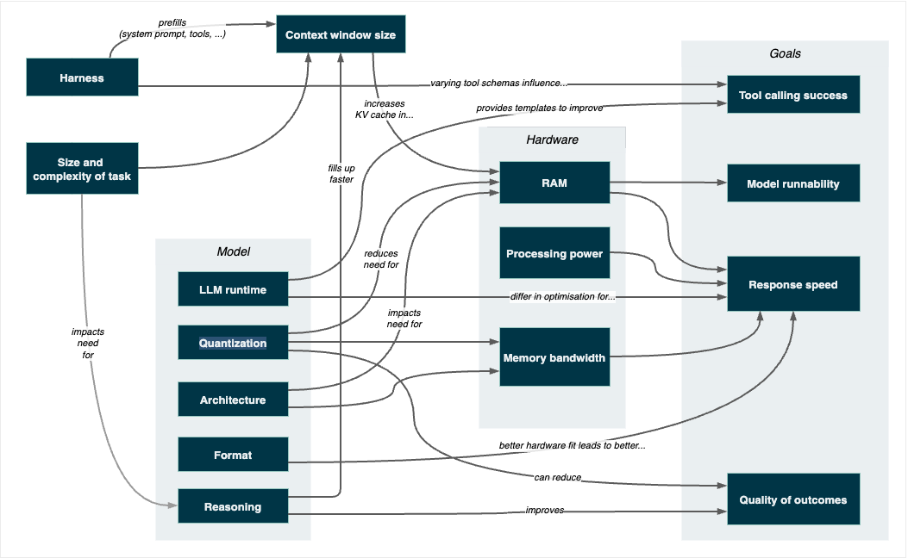
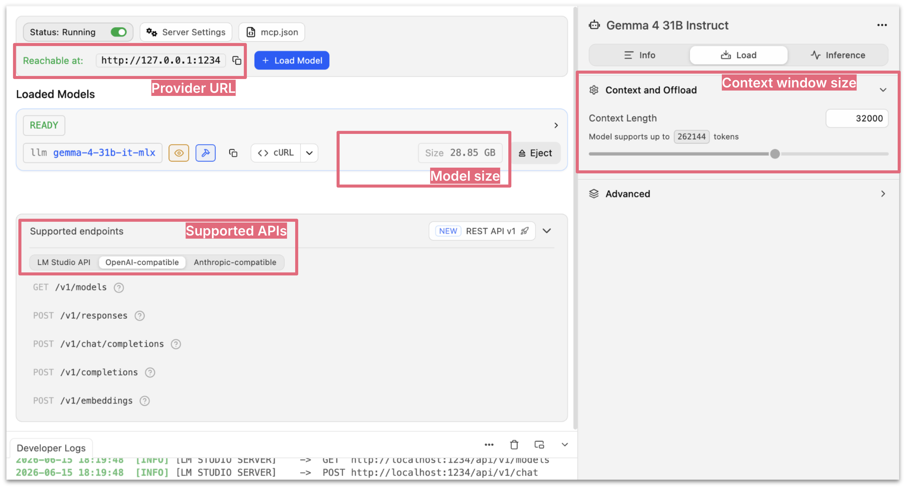

# 面向代码任务的本地模型可行性

 
本文为 [探索生成式AI](../exploring-gen-ai.md) 系列的一部分，该系列记录了 Thoughtworks 技术人员在软件开发中运用生成式 AI 技术的探索实践。

|[Birgitta Böckeler](https://birgitta.info/)| |
|:---|---:|
| |Birgitta 是 Thoughtworks 的杰出工程师，同时也是 AI 辅助交付领域专家。她拥有二十余年软件开发、架构设计及技术管理经验。|
| [原文](https://martinfowler.com/articles/exploring-gen-ai/local-models-for-coding-factors.html) |2026/7/7|

---

直到最近，我已经有相当长一段时间没有尝试过在本地运行模型了，因为每次尝试带来的失望感总是太强烈。
不过，大约一个月前，我重新投入了这件事 —— 有太多的说法让人无法忽视，关于它们已经取得了多大的进步，运行它们现在变得多么可行，以及其中一些模型在编码方面变得多么出色。
以下是我在过去四周左右时间里，断断续续使用它们的一些个人体验。

在这篇备忘录中，我将首先进行一个更一般性的介绍，并探讨影响这些模型用于编码可行性的各种因素。
在后续的备忘录中，我将更详细地描述我的实际体验。

## 范围

我主要感兴趣的是它们在编码方面的实用性，不仅仅是自动补全，更是 *智能体编码 (agentic coding)* 。
其次，我感兴趣的是它们对于更广泛的开发人员来说，在多大程度上是就绪和可用的 —— 也就是那些不想深入研究一堆规范、额外工具和调整来使其工作的开发者。

在硬件方面，我一直在以下两台机器上运行模型：

- Apple M3 Max, 48GB RAM
- Apple M5 Pro, 64GB RAM

## 影响可行性的因素

有许多因素在起作用，会影响结果，这使得在我们所拥有的资源限制下评估哪种设置效果最好，成为一件相当繁琐的工作。
这也使得当人们在网上分享他们使用这些模型成功的经验时，很难从噪音中筛选出信号。

我特别感到困惑的是，在自动化评估设置中，同一个模型在更强的机器上明显产生了更好的结果（不仅仅是速度，而是更好的代码！），尽管所有其他设置都是相同的。

我将从摘要开始，然后再深入讨论每个因素的细节。

 
*Fig 1：可能影响结果的诸多因素 —— 点击或悬停框以突出显示箭头。*

*「请查看原文获得动态效果」*

- **可运行性**：RAM 是核心约束。
我使用了 15-25GB 之间的模型，上下文窗口最大为 64K，使用了 OpenCode 和 Pi 框架，未启用任何 Skills 和 MCP 服务器。

- **响应速度**：受许多因素影响，但对某些模型来说已经相当不错，与一年前相比有了长足进步。
设置：LM Studio + 4BIT 量化 + M3 Max/M5 Pro + GGUF/MLX 两者皆有。

- **智能体编码的可行性**：工具调用仍然很棘手，模型常常失败，但通常能够从失败中自我恢复。
这是智能体编码的一个关键组成部分。
没有它，你当然仍然可以采用老式方法，从聊天窗口中复制粘贴。
而且，小模型对于自动补全来说肯定比对于智能体用途要可行得多。

- **结果质量**：取决于任务（更多内容将在下一份备忘录中说明），但显然远不及我们从大型模型中获得的能力水平。
总体而言，结果时好时坏。
我只关注功能的正确性，没有深入代码质量。

## RAM

模型权重必须能放入可用 RAM 中，或者更具体地说，放入 VRAM 中。
如果不能，运行时要么崩溃（我遇到过！），要么降到慢得无法使用的速度。
在 Apple Silicon 上，几乎所有的 RAM 都对 GPU 可访问，没有单独的 VRAM 限制，这在其他机器配置中可能有所不同。

影响：模型可运行性；响应速度。

我的体验：在 48GB 的机器上，我运行了 8GB 到接近 30GB 的模型。
30GB 当然会大大增加负担，尤其是当上下文窗口被添加时，15-25GB 的大小更舒适，而且我不必关闭那么多其他应用程序。
在 64GB 的机器上，我运行过一个 48GB 的模型 —— 一开始效果很好，但很快就崩溃了……

## 处理能力

更多的核心通常意味着更快的令牌生成，但架构也很重要，即使核心更少，更新的芯片代际也可以缩小差距。
如果不深入钻研每种配置和架构的细节，这很难在机器之间进行比较。

影响：响应速度。

我的体验：在 M3 Max 和 M5 Pro 上，与一年前相比，我运行的所有模型的速度都相当令人印象深刻。
然而，随着对话变长，速度会下降。
如果输出质量可以接受的话，我可以接受以当前速度使用它们来完成某些任务。

## 内存带宽

内存带宽是令牌生成的瓶颈，决定了数据在 RAM 和计算单元之间移动的速度。

影响：响应速度。

我的体验：我使用的 M3 Max 和 M5 Pro 都具有几乎相同的带宽，约为 300 GB/s，所以我没有真正与其他产品进行对比。
但如前所述，我尝试的所有模型的速度都相当可以接受。

## 参数数量

参数数量基本上代表了模型学习知识和能力的大小。
更多的参数通常意味着更好的输出质量，但也意味着更大的文件大小。

影响：所需的 RAM 量；结果质量。

我的体验：在 48GB 内存下，我使用了大约 30B 参数、正负 5B 的模型。
我在 64GB 机器上加载的最大的模型是 Qwen3 Coder Next 80B（MoE），它在解决我交给它的任务方面比小型模型好得多 —— 但在我继续对话后崩溃了。

## 推理能力

推理模型在响应之前会经历一个 “思维链” 过程，这有助于处理复杂的多步骤任务，但也可能生成更多 token 并减慢响应速度。

影响：任务的复杂性；响应速度；上下文窗口大小（因此需要更多 RAM）。

我的体验：我尝试的所有模型都具有推理能力，并且在我大部分实验中默认开启。
然而，我经常注意到它们会在推理链中无休止地循环，尤其是较小的模型。
（“等等……”，“实际上……”，“但是等等……”）所以我也在自动化设置中关闭推理进行了一些运行 —— 果然，它不仅更快（这是可以预料的），而且表现相同甚至略好！
这提醒我们，推理并不总是必要的，有时甚至可能适得其反。

## 工具调用能力

对于智能体用途，模型必须能够可靠地发出结构化的工具调用语法，该语法与框架所期望的模式匹配。
没有专门针对工具调用进行训练或微调的模型通常会产生格式错误的调用。

影响：使用智能体框架的能力。

我的体验：这是我尝试的模型的一个常见问题，尽管它们通常能够自我纠正并从失败的工具调用中恢复（例如，使用错误的参数名称，如 `file.path` 而不是 `filePath`）。

## 格式

GGUF 是基于 llama.cpp 的运行时（如 LM Studio 和 Ollama）的标准格式，并且拥有迄今为止最大的模型库。
MLX 是苹果自己的框架，专门为 Apple Silicon 构建，可能更快，但目前可用的 MLX 格式模型较少。

影响：响应速度。

我的体验：我在一两个模型上尝试了这两种格式，但我个人没有感觉到太大的区别。
这可能是因为我进行的评估类型是非结构化的 —— 另一方面，正如任何用户体验研究人员会告诉我们的那样，感知到的速度最终才是最重要的，而不是时钟所说的……

## 量化

量化压缩模型权重以减小文件大小，以一定的质量为代价换取更小的 RAM 占用。
量化的级别通常在模型名称和描述中标记为 Q4 / Q6 / Q8，或 4BIT / 6BIT / 8BIT，数字越低表示压缩率越高。
最近最新的热门是模型的 QAT（量化感知训练）变体，它们在训练期间模拟了量化过程。
与标准量化相比，它们应该能更好地保持质量。

影响：所需的 RAM 量；响应速度；响应质量。

我的体验：我下载的所有模型都是 Q4 / 4BIT 的，我还没有尝试不同的变体。
我也还没有尝试过 QAT 的模型。

## 架构

MoE（混合专家）模型具有大量的总参数，但在推理时只激活其权重的子集，因此一个 35B 的 MoE 模型需要的 RAM 显著减少，并且可以比一个 35B 的密集模型运行得更快。

影响：所需的 RAM 量；响应速度。

我的体验：Qwen3.6 35B MoE 模型在参数数量和 RAM 使用之间给了我迄今为止最好的平衡，因此在可运行性和结果质量方面也最好。
这可能是因为 MoE 架构，我不确定。
这种架构也可能解释了我为什么在 64GB 机器上从该模型中获得了比在 48GB 上更好的编码能力 —— 它可能在那里加载了更多的专家？
我不确定这是否正确，但这是我迄今为止唯一合理的假设。

## 上下文窗口大小设置

上下文窗口大小会通过 KV 缓存消耗模型权重之上的 RAM，并且随着上下文长度的增加而增长。
运行时中配置的默认大小对于智能体编码来说太小了，必须设置为至少 32K，如果不是 64K 的话。

影响：任务的大小和复杂性；所需的 RAM 量；响应速度；使用推理的能力。

我的体验：我试图看看我能节省多少。
对于小型任务，我有时可以用 32K，但经常不得不增加到 64K，所以这似乎是一个很好的默认最小值。
由于模型本身已经在挑战我可用 RAM 的边界，即使在 64GB 机器上，我也不确定我还能增加多少……因此，尽管许多这些模型在理论上支持更大的窗口，但实际使用它受到内存限制的约束。

## 所用模型列表

编码方面的热议都围绕着 Qwen3 和 Gemma 4，所以我就选了这些。

### Qwen3

- Qwen3.6 35B-A3B MoE Q4 GGUF (22 GB)
- Qwen3.6 Coder Next 80B MoE GGUF (45 GB)

### Gemma 4

- Gemma 4 12B Q4 GGUF (7.5 GB)
- Gemma 4 26B 4BIT MLX (15.6 GB)
- Gemma 4 31B 4BIT MLX (29 GB)

## 运行时

运行时处理模型的发现、配置和加载。
它还决定了我们如何将框架与模型集成这一实际问题。
通常，这是通过启动一个 Web 服务器来实现的，该服务器提供一系列框架支持的典型 API，然后该 Web 服务器的 localhost URL 在框架中被配置为模型提供者。
框架支持最广泛的是 OpenAI API，但例如 Claude Code 期望的是 [Anthropic 的 Claude API](https://platform.claude.com/docs/en/api/messages) 。

影响：配置和可发现性的难易程度；与框架集成的难易程度；响应速度。

 
*Fig 2：LM Studio 中的 “Developer” 视图，显示了一个正在运行的服务器以及迄今为止描述的许多因素（提供者 URL、模型大小、API、上下文窗口大小配置）*

我的体验：虽然我过去使用过其他运行时，但我目前回到了使用 [LM Studio](https://lmstudio.ai/) ，主要是因为它出色的用户体验。
关于哪个运行时针对哪种硬件和哪种类型的模型进行了最优化，以获得更高的速度，有很多细节。
但回想一下运行本地模型的更广泛可行性，用户体验在其中扮演了重要角色。
值得一提的是，我的同事们最常提到的替代方案是 [oMLX](https://omlx.ai/) 。

## 框架（Claude Code、OpenCode、Pi……）

编码框架 (coding harness) 在向上下文窗口注入多少开销（系统提示、工具数量）方面可能有显著差异，这在我们本地资源受限的情况下变得更加重要。
我们围绕框架的扩展也会产生影响，例如有多少 Skills 或 MCP 服务器处于活动状态。
每个框架的描述都会发送给模型，并同样占用上下文窗口的空间。

我上面提到过，小模型仍然在工具调用方面挣扎 —— 而每个框架对基本工具都有略微不同的模式，这很可能没有帮助。
以编辑文件为例：

- **Pi**：`old_text` 和 `new_text`（ [参见此处](https://github.com/earendil-works/pi/blob/main/packages/coding-agent/src/core/tools/edit.ts) ）
- **OpenCode**：`oldString` 和 `newString`（ [参见此处](https://github.com/anomalyco/opencode/blob/dev/packages/opencode/src/tool/edit.ts) ）
- **Claude Code**：`old_string` 和 `new_string`（至少在我询问时它是这么说的）

最后，并非所有框架都容易支持本地模型的集成。
开源工具通常是首选，但 Claude Code 也可以指向本地提供者。
[GitHub Copilot 似乎在其 CLI 中支持它](https://docs.github.com/en/copilot/how-tos/copilot-cli/customize-copilot/use-byok-models) ，而且我认为在 Cursor 中也可以覆盖 OpenAI 基础 URL 并将其指向 localhost。

影响：所需上下文窗口的大小；工具调用的成功率；可集成性。

我的体验：在尝试中，我使用了 OpenCode 和 Pi。
我避免使用 Claude Code，[因为它显然会给上下文窗口带来相当大的负担](https://portkey.ai/blog/the-harness-tax/) 。

## 细节

在 [第二份备忘录](./local-models-for-coding-experiences.md) 中，我将更深入地探讨我交给模型的任务类型，以及我所经历的体验。

对我总体结论的预览：像这样使用小型模型仍然相当混乱且难以评估。
得出结论的过程令人沮丧，因为结果依赖于太多因素。
因此，我会说，对于那些不想花费太多时间的开发者来说，它仍然没有准备好提供一种简单的 “即插即用” 体验。

然而，基于这次体验，我确实有一个我现在在本地使用的首选模型，那就是 **Qwen3.6 35B MoE**。
在我尝试过的模型中，它在能力、速度和 RAM 占用之间提供了最佳的平衡。

## 致谢

特别感谢 Jigar Jani 和 Syed Atif Akhtar 的审阅和宝贵意见。

生成式 AI（Claude 和 Claude Code）被用于研究和语言润色。
