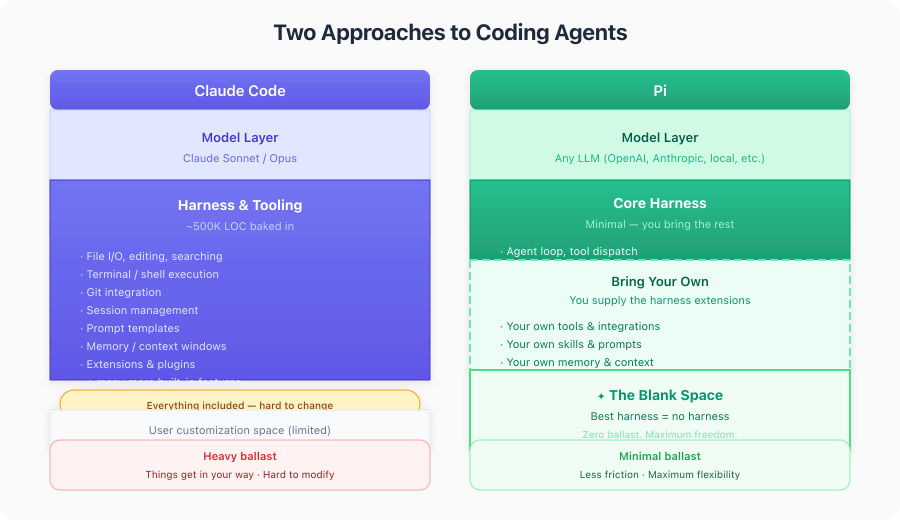

# 我当前的本地智能体开发设置

2026/4/29 Willem van den Ende pi.dev llamacpp mlx ai

[原文](https://willemvandenende.com/blog/engineering/my-local-agentic-dev-setup-today)

---
我原本打算在闲暇时写一篇关于我本地开发环境的文章。
但前几天我在领英上发布了，关于取消我每月 100 美元的 Claude Max 套餐、转向使用本地模型的 [帖子](https://www.linkedin.com/posts/willemvandenende_cancelled-my-claude-code-plan-was-using-activity-7454883528661676032-KdZp) ，引发了远超我预期的关注和疑问，因此我把这篇文章提前了。
本文试图回答以下问题：你使用什么硬件，使用什么软件（推理服务器和编码智能体），以及使用哪些模型？
我在 [延伸阅读](#延伸阅读) 部分附上了一些博客文章的链接，这些文章可能会回答其他一些问题。

我的设置适合我自己，我是在一台翻新的 MacBook Pro M3 Max（64GB 内存）上运行的。
需要注意的是，过去几年里，LLM 在单位硬件性能和单位功耗上的表现已经提升了数个数量级，而且目前仍看不到尽头。
过去一个月里，我本地的模型速度大约提升了两倍，同时在相同或更好能力下使用的内存更少。
我现在运行编码智能体时还能同时开着浏览器；-)
下面要讲的两个模型，我都能在日常工作中让它们持续运行（一次只运行一个模型）。

我使用 [llama.cpp](https://github.com/ggml-org/llama.cpp) 来运行模型。
我写了一个脚本用来拉取并构建最新的 llamacpp，因为我想尝试最新的开源权重模型和开源模型。
此外，最近几周几乎每天都能看到性能的提升，而我喜欢快速的反馈。
我使用 [Pi.dev](https://pi.dev/) 作为编码智能体，至于聊天、提问以及写作方面的头脑风暴，我则在 Emacs 中使用 [GPTEL](https://github.com/karthink/gptel) 。

你可能会注意到上面没有提到 IDE。
我是极限编程（eXtreme Programming）的早期采用者。
只要能先写测试、快速运行测试、然后进行重构，我就很满意了。
我很少需要用到调试器。
我仍然订阅了 Jetbrains Ultimate，但这更多是为了做技术教练的工作，而不是日常开发所用。
LLM 让我能够进行重构，并且为 Elixir 这类通常不被 IDE 支持的语言即时创建重构工具。

假设

- 我们都在摸索中前行。
- 工具链 (harness)（编码智能体 + “skills” + 扩展）的质量至少与模型本身同样重要。
- 部署开源模型、开源编码智能体以+定制扩展需要投入时间，但回报是透彻的技术理解，以及一个稳定的基础，让后续工程投入形成复利效应。
- <ins>对我而言，开源、本地的模型已经跨过了能够胜任日常编码智能体工作的门槛</ins>。

正如 Patrick Debois 所指出的，我的方案属于高级用户的配置。
还有其他方式可以实现类似的目标。
LinkedIn 帖子下的评论区里有一些有趣的方案，下面的 [后记](#后记) 中还有一个令人意外的方式。

总的来说，这归结为：像 Claude Code、Codex 或 OpenCode 这类工具提供了更多开箱即用的体验，而使用更多自主搭建的工具链以及本地 LLM 或具有强隐私保障的托管模型，则能带来更多的控制权、个性化、数字自主权以及数据隐私。

下面这个表格是我在与下文提到的 27B 模型对话中制作的。

</br>

## 推理：LLamaCPP
我一开始用的是 ollama，看起来 Unsloth Studio 也很有前景（但据我所知它还没有 Mac 硬件加速，不过应该快有了）。
我选择运行 llama.cpp 是因为它速度相当快，更重要的是，在 MacOS 上非常稳定。
模型开发者通常也会支持 llamacpp，以便将自己的改动合并进去、把模型发布出来 —— 推理的工作方式目前仍在快速演进中。
这在聊天场景中影响不大，但编码智能体会使用 “工具调用 (tool calls)”
（模型发出的 XML 或 JSON 格式的请求，例如在 bash 中执行 ls 命令，或带有 JSON 参数的 “edit” 操作），
而要让这一点变得可靠并不容易。

我偶尔会尝试 mlx —— 这是 Mac 原生推理方案，因为有时它比 llamacpp 更快。
在聊天场景下通常能正常工作，但在智能体编码方面表现稍逊。

过去我使用过 claude code 来帮助完成配置。
[llama.cpp](https://github.com/ggml-org/llama.cpp) 提供了关于如何安装和下载模型的详细说明。
如果你想打好基础，这可能是比直接使用提示词更好的入门方式。

我已经克隆了 llama.cpp 仓库，放在我的 llama-server-scripts 目录下，该目录本身也是一个 git 仓库。
我在 .gitignore 中添加了 llama.cpp。
然后我让 Claude 写了一个脚本来拉取并构建 llama.cpp。
这个方法基本可行 :-)。
通常情况下我会安装所有内容的正式发布版本，但当有前景不错的新模型或性能优化出现时，我真的很难耐心等待。

我跳过了如何安装编译器等方面的说明。
这份现场报告 [在 32GB 内存的 M2 MacBook Pro 上使用 Qwen 3.6 35B-A3B 进行编码](https://www.reddit.com/r/LocalLLaMA/comments/1svdep5/field_report_coding_with_qwen_36_35ba3b_on_an_m2) 也包含了如何设置 xcode-build 等说明，
以及该 35B 模型最初在某些任务上表现不佳的一些情况。

```sh
➜  llama-server-scripts git:(main) ✗ cat build_llama.sh
#!/usr/bin/env bash
set -euo pipefail

LLAMA_DIR="llama.cpp"

if [ ! -d "$LLAMA_DIR" ]; then
  echo "Error: $LLAMA_DIR directory not found. Clone it first." >&2
  exit 1
fi

cd "$LLAMA_DIR"

echo "Pulling latest llama.cpp..."
git pull

echo "Configuring CMake build..."
cmake -B build \
  -DCMAKE_BUILD_TYPE=Release \
  -DGGML_METAL_EMBED_LIBRARY=ON

echo "Building..."
cmake --build build --config Release -j"$(sysctl -n hw.ncpu)"

echo ""
echo "Build complete."
./build/bin/llama-server --version
```

## 模型：Qwen3.6 35B-A3B 和 27B
这两个模型都是在过去两周内发布的。
我之前运行的是 3.5 系列模型，在复活节假期期间用来做些尝试已经足够好了。
35B 是一个混合专家 (MoE) 模型。
虽然这些模型需要更多的内存，但在 Mac 上运行速度要快得多，或者在像我的 Framework 笔记本那样整模型无法放入 GPU 的机器上 —— 
因为每个 token 只有 30 亿参数处于激活状态，而 “稠密” 模型则需要激活 270 亿参数。
稠密模型在连贯性方面可能更好一些。
在 3.5 版本中，这种差异在规划和总结任务上比较明显，27B 模型的输出更详细。
但在这里，“足够好” 仍然是关键 —— 35B 模型对我所做的事情来说通常已经足够好了，而且运行速度快得多。
据我所知，它的速度在每秒 30 到 80 个 token 之间，而 27B 模型目前峰值速度约为每秒 19 个 token。
这在聊天时影响很大，但当我在做其他事情、让它在后台运行时，差异就没那么明显了。

Unsloth 提供了针对这两个模型（ [qwen3.6](https://unsloth.ai/docs/models/qwen3.6) ）的良好文档和配置脚本。
llama.cpp 脚本中的参数一开始可能看起来有些吓人，但我是从某个配置入手，然后根据我在 https://reddit.com/r/LocalLlama 上看到的信息不断修改，慢慢就习惯了。

需要注意的是，你并不一定需要脚本才能启动。
有一个 “router” 脚本可以启动 llamacpp，然后通过现在相当不错的 Web UI，你就可以选择要加载哪个（或哪些）模型了。
这通常就足够好了。

一旦你下载了模型，访问 8000 端口就可以开始使用了。
我挺喜欢这个聊天界面，因为它内置了对话分支功能，并且会在运行时显示性能指标。
这让我无需进行详细的评估就能对某个特定模型的表现有个直观感受。

我会先记录 27B 模型，因为它在我的机器上配置最为简洁。

## 27B 模型

我将从 27B 的脚本开始，因为这个脚本更多是直接从 Unsloth 复制粘贴过来的，然后我会根据个人喜好进行修改。
希望这样更便于大家理解。

今天的特别选项是 `--spec-default`。
我甚至找不到它的文档，所以这里是 [deepwiki 查询](https://deepwiki.com/search/what-does-specdefault-do_93cffa03-5266-4c9e-ba6a-331d12efd6db?mode=fast) 。
它会为推测解码设置一些默认参数。
这意味着 27B 模型现在的速度有时能超过每秒 20 个 token。
虽然算不上极快，但对于规划任务来说更舒适了，而且它可以在后台完成工作，并在 Pi 的超时限制内结束。

`-c 65536 \` 用于将上下文大小设置为 65k 个 token。
由于我主要用这个模型来做规划、提问等任务，不需要 256k 个 token。
我属于 “早重置、勤重置” 这一派。
越小的上下文、越聚焦，结果也越聚焦。
过去两个月里，上下文的内存消耗已经大大降低，除了启动服务器。

`--chat-template-kwargs '{"preserve_thinking": true}' \` 用于保留推理痕迹。
这意味着在多轮对话中，上下文更容易被缓存（因为相同的 token 会再次出现），
而且有些模型在看到之前轮次中的推理 token 时表现会更好（至少我听说是这样）。
由于在 Mac 上推理速度相对较慢，有效的缓存会带来很大的不同。

`-np 1` 一次只运行一个进程。
当编码智能体运行时，GPU 已经满载了，我自己也只能单任务处理，额外的进程意味着额外的上下文，而我没有那么多内存。

`--jinja` 用于模板处理。
其余的参数是生成参数，我可能是从 unsloth 的 Hugging Face 页面复制过来的。

`-hf` 会从 HuggingFace 下载模型。
unsloth/Qwen3.6-27B-GGUF:Q4_K_M 是模型的名称及其量化版本。
关于哪个量化版本最适合我的机器，我还没有做深入的研究。
这个版本大致匹配 rapid-mlx 的默认设置，因此我有个参照。
Q4 代表 “4位整数”。
数值通过量化过程进行近似表示。
这可能会损失一些精度，但 Qwen 3.6 系列模型似乎对此不太敏感。
一般来说，更小的量化版本运行速度更快，占用的内存也更少。

其他参数大多是一般的推理参数，具体选项请参考模型页面。

run27b.sh:

```sh
exec ./llama.cpp/build/bin/llama-server \
    -hf unsloth/Qwen3.6-27B-GGUF:Q4_K_M \
    --spec-default \
    --no-mmproj \
    --fit on \
    -np 1 \
    -c 65536 \
    --cache-ram 4096 -ctxcp 2 \
    --jinja \
    --temp 0.6 \
    --top-p 0.95 \
    --top-k 20 \
    --min-p 0.0 \
    --presence-penalty 0.0 \
    --repeat-penalty 1.0 \
    --reasoning on \
    --chat-template-kwargs '{"preserve_thinking": true}' \
    --host 0.0.0.0 \
    --port 8000
```

## 35B
从上周后半周开始，这就是我的日常主力模型。这是我手动下载的。
完整的模型名称大概是 unsloth/Qwen3.6-35B-A3B-MXFP4_MOE.gguf。

这个模型是手动下载的，遵循的是较旧的使用模式。
我一开始用的是 Simon Willison 的 ‘llm’ 工具。
该工具将模型保存在与 -hf 选项（后者是后来才有的）不同的位置。

我在这里也使用了更小的量化版本，目的是看看它能否正常工作。
显然这不是最佳选择，但过去几天它对我来说是可行的。
基准测试结果是在我开始使用之后才发布的。
有时候是尝试 (tinker) 的时候，有时候是制作小工具的时候，尝试迟早会回来。

请注意，这次运行时使用了更大的上下文：`-c` 参数设置为 256k 个 token。
在这方面，小型开源模型正在紧跟前沿。
连贯性则是另一个问题，但这个模型在超过 100k 个 token 的上下文中似乎表现得也相当不错。
这使得即兴发挥更加从容。
同样，从昨天起也使用了 `--spec-default`。
上个月，35B 模型的运行速度大约是每秒 30 个 token，而现在，通过这个设置以及其他优化，我经常看到速度远超每秒 60 个 token。
这并不代表一切（比如，如果同一个提示需要运行 3 次才能得到一个结果），但按照这种方式，在提示词上进行迭代会让人愉快得多。

```sh
#!/usr/bin/env bash
set -euo pipefail
ROOT_DIR="$(cd "$(dirname "${BASH_SOURCE[0]}")" && pwd)"
LLAMA_DIR="${ROOT_DIR}/llama.cpp"

MAIN="$HOME/Library/Application Support/io.datasette.llm/gguf/models/Qwen3.6-35B-A3B-MXFP4_MOE.gguf"
ls "${MAIN}"

exec "${LLAMA_DIR}/build/bin/llama-server" \
  -m "$MAIN" \
  --spec-default \
  -c 262144 \
  --temp 0.6 --top-k 20 --top-p 0.95 --repeat-penalty 1.0 \
  --presence-penalty 0.0 \
  --chat-template-kwargs '{"preserve_thinking": true}' \
  --parallel 1 \
  --jinja \
  --host 0.0.0.0 --port 8000
```

## 沙箱：Nono
绝对不要在沙箱之外运行编码智能体。
这同样适用于 claude code ——它虽然有一些限制，但具体如何理解仍有弹性空间—— 而对于 Pi（见下文）则更是如此，
Pi 的设计本身就是 “只有一次生命” 模式。
除非你愿意接受比如 home 目录被删除这样的后果。

我在 Mac 上使用 Nono，而不是 Docker 或 devcontainers（devcontainers 本质上也是 Docker）。
在 Mac 上，Docker 需要运行在一个虚拟机中，这会占用我大约 9GB 的内存，而这些内存正是我运行 LLM 所需要的。
此外，我还可以在不同的项目之间复用已安装的软件包，由于我做了很多实验，这让整个工作流程更加顺畅。

沙箱可以访问主机上的若干目录以及当前工作目录。
Nono 会提示请求权限，你可以使用 `--allow-cwd` 标志来覆盖这一行为。

调用方式：

```sh
nono run --profile pi -- pi
```

配置文件位于 `$HOME/.config/nono/profiles/pi.json`

```json
{
  "meta": {
    "name": "pi",
    "version": "1.0.0",
    "description": "Auto-generated profile for pi"
  },
  "filesystem": {
    "allow": [
      "$HOME/Library/caches/elixir_make",
        "$HOME/.hex",
        "$HOME/.local/share/mise/",
        "$HOME/.local/state/mise/",
        "$HOME/Library/Caches/mise/",
        "$HOME/Library/Caches/deno",
        "$HOME/.pi/agent/",
        "$HOME/dev/spikes/llm/monotonic-pi-extensions/packages/",
        "$HOME/Users/willem/.config/git/"
    ],
    "read": [
    ],
    "read_file": [
        "$HOME/.gitconfig"
    ],
    "write": []
  },
  "network": {
    "block": false
  },
  "workdir": {
    "access": "readwrite"
  }
}
```

## 编码智能体：Pi.dev

前几天我介绍了在使用托管模型的情况下，[如何在 VPS 上入门 Pi 编码智能体的一般设置](https://willemvandenende.com/blog/engineering/how-to-get-started-with-the-pi-coding-agent-on-a-vps) 。
一旦你启动 Pi，它会自动指向安装文档。

配置文件位于 `~/.pi/agent/models.json`：

```json
 {
     "providers": {
         "llama.cpp": {
           "baseUrl": "http://127.0.0.1:8000/v1",
             "api": "openai-completions",
             "apiKey": "dummy",
             "models": [
                 {
                     "id": "Qwen3.6-35B-A3B-MXFP4_MOE.gguf",
                     "name": "Qwen3.6-35B",
                     "reasoning": true,
                     "input": ["text"],
                      "compat": {
                        "thinkingFormat": "qwen-chat-template"
                       },
                     "contextWindow": 262144,
                       "maxTokens": 32768,

                     "cost": { "input": 0, "output": 0, "cacheRead": 0, "cacheWrite": 0 }
                 },
                 {
                     "id": "unsloth/Qwen3.6-27B-GGUF:Q4_K_M",
                     "name": "Qwen3.6-27B",
                     "reasoning": true,
                     "input": ["text"],
                      "compat": {
                        "thinkingFormat": "qwen-chat-template"
                       },
                     "contextWindow": 262144,
                       "maxTokens": 32768,

                     "cost": { "input": 0, "output": 0, "cacheRead": 0, "cacheWrite": 0 }
                 }]
         }
   }
}
```

这是一个摘录。
请注意，27B 模型的 contextWindow 设置与运行脚本中的设置并不一致。
这里存在重复配置。
据我所知，我在此处使用的 OpenAI API 并不会导出上下文窗口的大小。
因此你需要两处都进行设置，这有点烦人。
如果能按每个请求单独指定就好了，因为并不是每个请求都需要那么大的上下文。
欢迎提出建议！

## 延伸阅读

- [编码智能体生成它自己的扩展](https://willemvandenende.com/blog/engineering/coding-agent-generates-its-own-extensions) —— 在与智能体对话的过程中，即时为它提供解决方案。

- [与 Pi 一起进行番茄结对](https://willemvandenende.com/blog/engineering/a-pair-pomodoro-with-pi) —— 关于使用编码智能体进行短周期工作的一次简短实验。

- [如何入门 Pi 编码智能体（在 VPS 上）](https://willemvandenende.com/blog/engineering/how-to-get-started-with-the-pi-coding-agent-on-a-vps) —— 在 VPS 上配置 Pi 比我预想的要简单。

- [小型开源 LLM 现已可用于开源智能体](https://willemvandenende.com/blog/engineering/smaller-open-llms-now-work-for-open-agents) —— 开源权重模型及推理在质量和速度上的阶段性跃升。

- Nate B Jones 本周发布了一期不错的播客/视频，讨论了苹果在本地模型方面的策略 —— 例如，对于那些一旦数据离开办公室（无论加密程度如何）就无法获得工作认证的律所而言，这一点尤为重要。
[Nate B Jones 谈苹果与下一个万亿美元市场](https://podcasts.apple.com/gb/podcast/ai-news-strategy-daily-with-nate-b-jones/id1877109372?i=1000763732500)

完整披露：我持有苹果（APPL）、英伟达（NVDA）和阿里巴巴（BABA，通义千问的开发者）的多头头寸。
我也使用其他硬件和模型，但英伟达的硬件不多。

我之前提到过的那份现场报告 —— [在 32GB 内存的 M2 MacBook Pro 上使用 Qwen 3.6 35B-A3B 进行编码](https://www.reddit.com/r/LocalLLaMA/comments/1svdep5/field_report_coding_with_qwen_36_35ba3b_on_an_m2) —— 包含了详细的配置说明，并对一些开发任务做了深入讲解。

## 后记
上面那份现场报告中让我印象深刻的是，作者选择了 OpenCode 和 Qwen3.6 35B，而不是 Claude：

> 为什么我不直接使用……Claude Code？
因为它在针对小上下文窗口的优化方面存在问题，导致我遇到了一些麻烦。
能够独立完成大型项目的长时间运行任务对我来说很重要，所以我不选择 Claude Code。

所以也许我的直觉是对的。
我还没有像使用 Claude Code 那样，用 Pi 和 Qwen 去处理长时间运行的任务。
但这表明这是可行的，甚至可能更好。
详细的提示词和确定性的工具链 (harness)，缩小了前沿模型与普通工具链之间的差距。
关于这一点，以后可能会再展开说说。
希望这对你有帮助，如果有任何问题或意见，请告诉我。

## 致谢
感谢 Barney Dellar 指出 [延伸阅读](#延伸阅读) 部分中我博客的链接是失效的。
那恰恰是这篇文章中我唯一使用 AI 来生成的部分……
