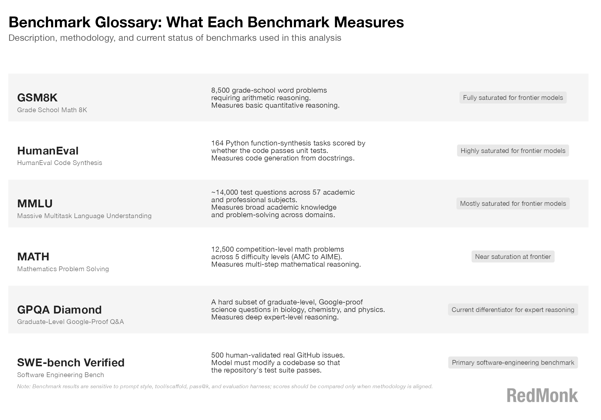
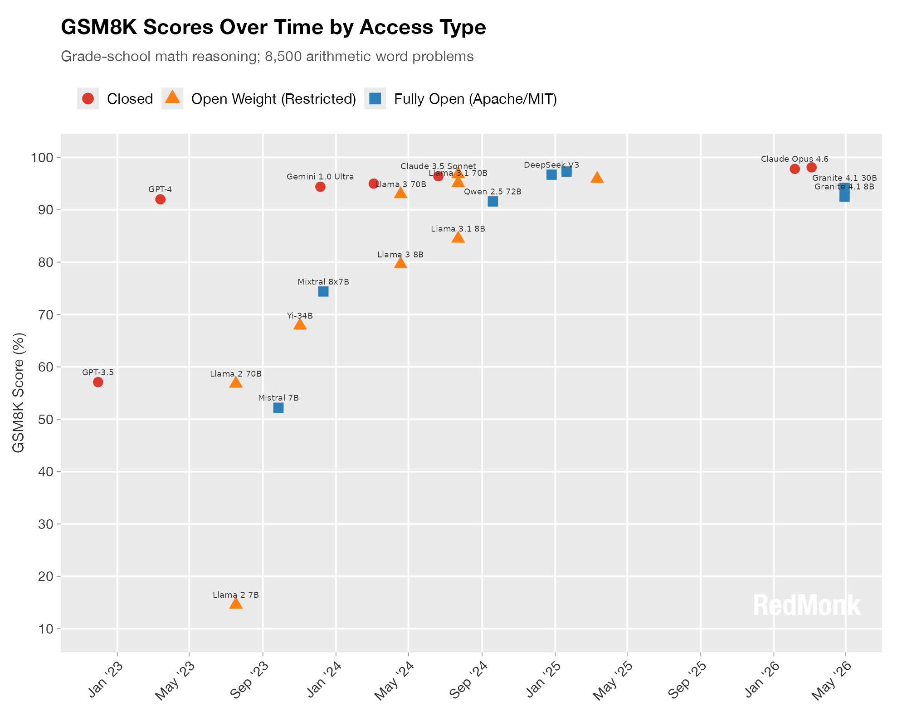
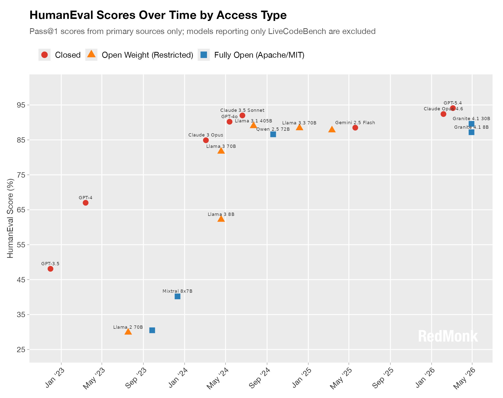
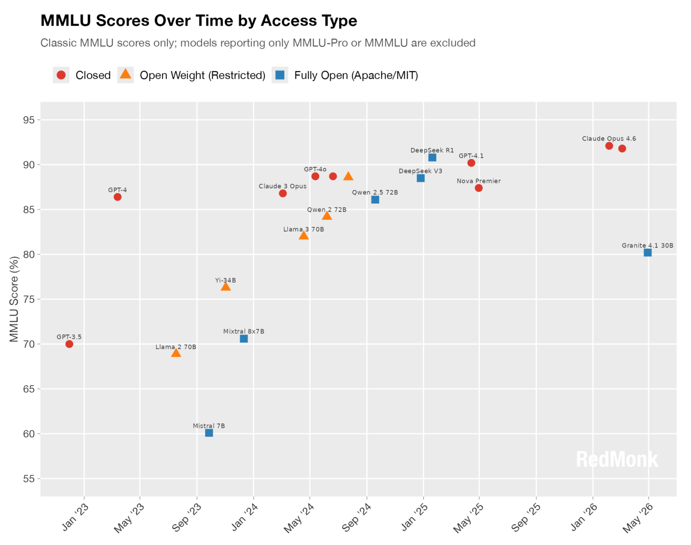
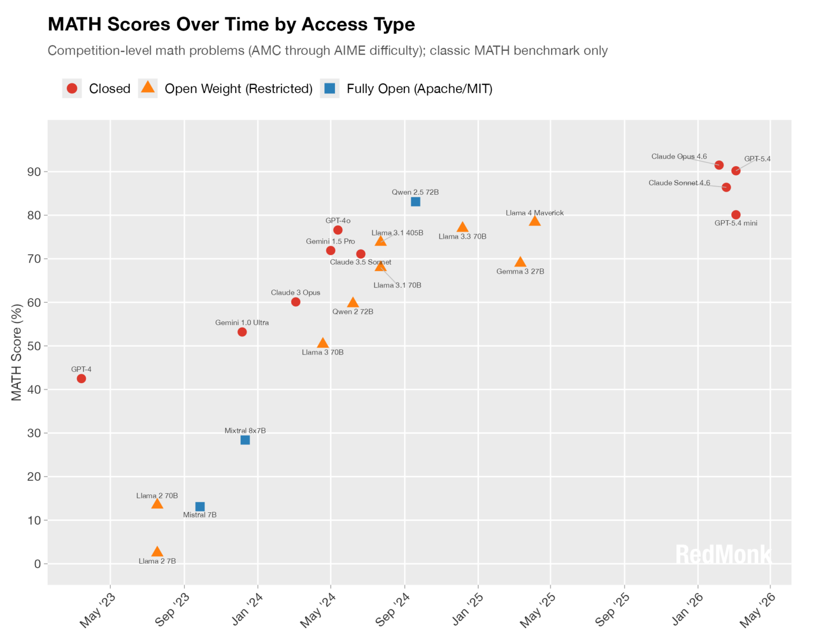
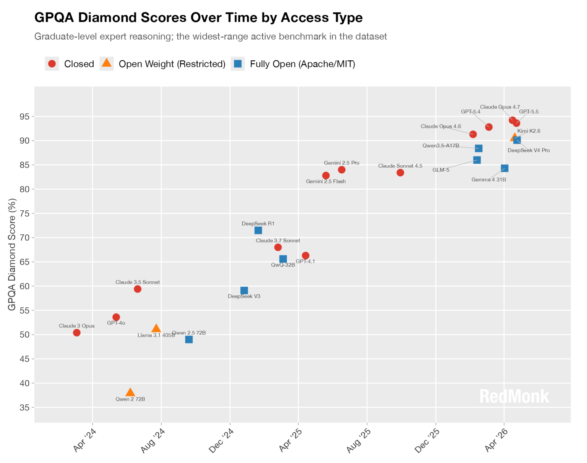
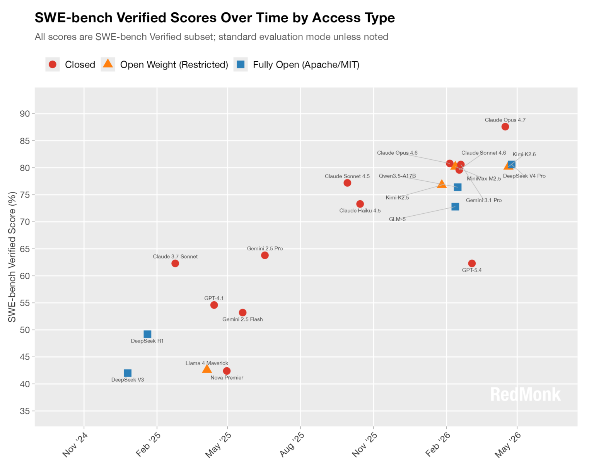
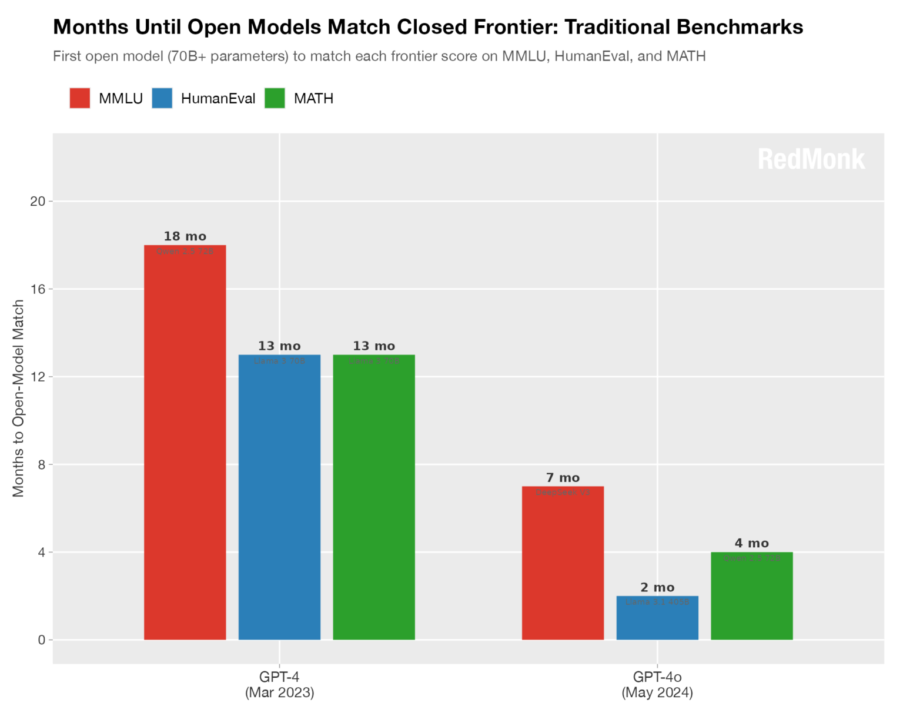
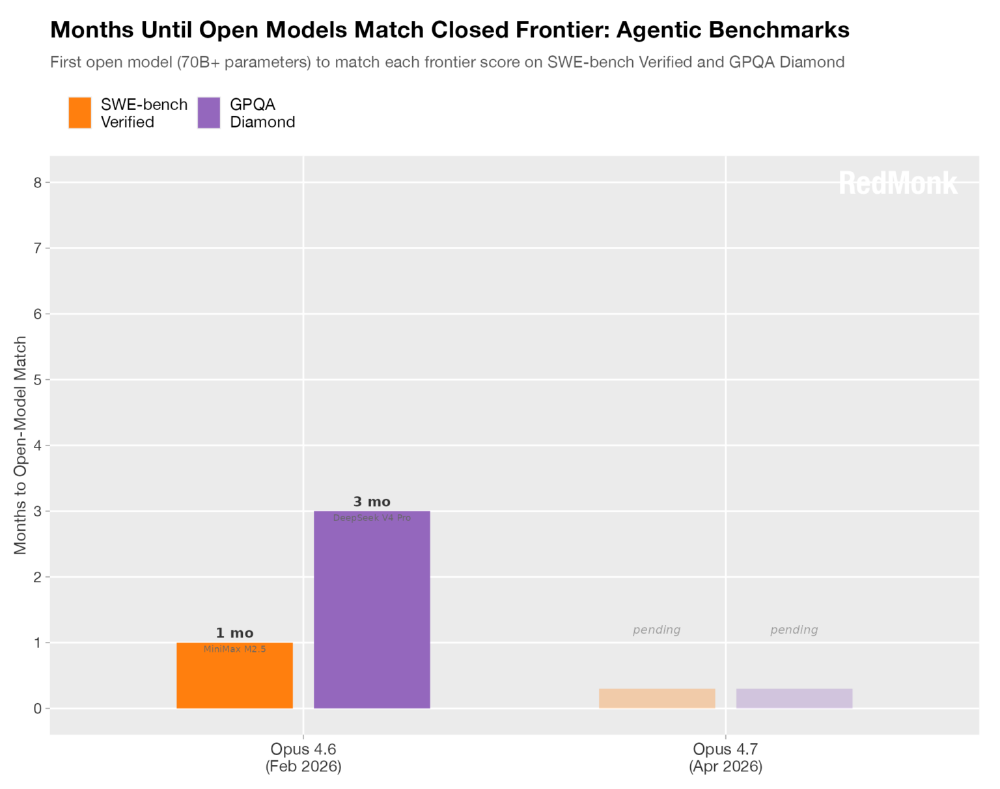

# 开放与封闭：前沿模型的追逐

作者：[Stephen O'Grady](https://redmonk.com/sogrady/author/sogrady/) | [@sogrady](https://twitter.com/sogrady) | 2026年5月15日 | [原文]（https://redmonk.com/sogrady/2026/05/15/open-ai-models/

--- 
起初，软件是开放的。
这并不是因为人们认为这是一种正确的战略方法，而是因为 [软件在只是后来才想到的东西](https://redmonk.com/sogrady/2011/05/24/the-age-of-data/) —— 硬件才是真正重要的。
不到二十年后，硬件变得更便宜，因此其重要性也随之降低。
为了追求更高的资本回报，焦点又转回了软件。
为了最大化这些回报，软件从开放转向了封闭。

自那时起，软件就在开放与封闭之间持续拉锯。
在操作系统、虚拟化软件、移动设备以及其他一些领域中，封闭软件率先领跑，开放软件随后追赶。
而在大数据、容器、编程语言和 Web 服务器等领域，角色则发生了逆转：开源通常处于领先地位，而封闭及专有模式则不得不努力跟上。

模型虽然完全构建在开源的基础之上，并且极度依赖开源，但它们本身却属于前面所说的 “封闭” 阵营。
那些 [最初开放](https://proceedings.neurips.cc/paper_files/paper/2017/file/3f5ee243547dee91fbd053c1c4a845aa-Paper.pdf) 的东西，后来变成了封闭的。
“前沿” 模型 ——也就是那些不断推动 “前沿” 边界的模型—— 无一例外都是专有或封闭的，尽管 OpenAI 的名字中带有 “Open”。

然而，自 Chat-GPT 于 2022 年 11 月 22 日向全球发布以来，自然而然地出现了试图用 “开放” 的替代方案来对抗专有模型主导地位的努力（我们稍后会回到在这个语境下 “开放” 究竟意味着什么）。
科技行业既有长久以来的主导者，也有针对这些主导者的联盟式抵抗，这两者都有着悠久的历史。

在近期的一次行业活动中，一位 AI 高管将那些追赶封闭式前沿模型的开放模型比作 “一群狼”。
普通的行业观察者如果不知道开放替代方案的存在，也是情有可原的，因为几乎所有的媒体注意力都被 Anthropic 和 OpenAI 的最新成就所吸引 —— 尽管这在一定程度上也可以说是因为后者有明显的战略倾向，即选择在 Google AI 发布消息的时间点附近安排自己的发布，以最大限度地削弱对方的影响。

因此，开放模型能否与封闭模型竞争，并不是一个有趣的问题。
它们过去一直在竞争，未来也一直会竞争。
真正需要问的问题是：竞争得怎么样？
换句话说，“这群狼” 最终能否追上它们的猎物？
如果能，又需要多快的时间？

出于多种原因，评估 AI 模型是一项具有挑战性的工作。
基于个人经验的实验是有用的 ——任何在去年 11 月前后使用过模型的人，都会对其能力上的差异感到震惊—— 但这显然无法规模化。
然而，现有的真正标准化的定量测量手段，只有行业基准测试。

考虑到早在几十年前的 TPC-C 大战期间，基准测试就已经被人为操纵到了几乎失去参考价值的程度，它们本来不会成为评估的首选。
但在目前这个阶段，对于衡量不同模型之间的性能表现来说，基准测试仍然是 “最不坏” 的方法。

话虽如此，对于基准测试（包括本文所选用的这些）来说，仍然存在许多其他具体的担忧，其中包括：

- **数据污染**：模型可能在有意或无意间使用了包含基准测试题目的数据进行训练。
- **自我报告**：基准测试结果通常由创建模型的实验室自行报告。
- **缺乏标准化方法**：基准测试的得分会因脚手架、提示词、尝试次数等因素的不同而产生很大差异，而基准测试通常不会对测试方法进行标准化。
- **特定性**：稍后我们会看到，基准测试通常有特定的关注领域。
没有一个基准测试能够充分覆盖或代表真实世界用例的广度。
值得注意的是，本文所选的基准测试都是 “文本输入、文本输出” 类型，而非多模态。
- **难度**：为了衡量模型随时间推移的进展，本次分析所选取的基准测试必须有实际的历史数据。
这意味着，那些最近才出现、可能更具挑战性、更能考验模型能力的基准测试并未包含在此次分析中，因为它们还无法揭示任何值得注意的长期趋势。

除了上述注意事项之外，还有一点需要指出：有几十种潜在的基准测试可供使用 —— 有些是通用的，有些是特定领域的。
本次选择的基准测试，优先考虑那些在大量不同模型上都有可获得的、一致的得分，并且具有合理的历史数据以供评估。
换句话说，这仅仅是基于当前所选基准测试的一个快照，如果选择其他基准，可能会得出不同的结果。

在继续之前，最后一个必要的澄清是 “开放” 的定义。
本次分析既包括封闭模型，也包括开放模型。
封闭就是封闭，而开放则包含两个不同的子集：开放权重模型和完全开放模型。
完全开放模型指的是那些根据已知且经 OSI 批准的开放源代码许可证（如 Apache、MIT 等）进行授权的模型。
而 “开放权重” 则是指 [行业中新兴的](https://www.linkedin.com/feed/update/urn:li:activity:7402729193228324864/?originTrackingId=bagLRp%2FvRfOk8qseYxY0%2FA%3D%3D) 一个共识性术语，指的是那些大部分开放，但在使用上包含一些限制、因此不能被称作开源模型的模型 —— 在本数据集中最典型的例子就是 Llama。

在交代完这些背景信息之后，我们先从所选基准测试的简要术语表开始。

值得注意的是，这里的基准测试是按照从 “最饱和” 到 “最不饱和” 的顺序排列的。
“饱和” 指的是那些实际上已经被所有或大多数模型解决的基准测试，因此它们已不再能用于衡量模型的相对能力。
尽管这些饱和基准在今天已经失去了实用价值，但它们仍然被纳入本次分析，因为它们能够展示开放模型在追赶专有模型方面所取得的历史性进展。

我们首先来看一个完全饱和的基准测试：GSM8K。

从 2022 年 12 月 GPT-3.5 的表现开始，在 16 个月内，GSM8K 中的小学数学问题就已经被基本解决。
重要的是，无论是开放模型还是封闭模型都做到了这一点。
到 2024 年底，完全开放的 DeepSeek 在得分上已基本匹配了 Claude Sonnet 约 96% 的水平。
同样值得注意的是，2023 年 7 月发布的 7B 参数的 Llama 基本上还处于大约 15% 的猜测水平，
而 2026 年 5 月发布的 8B 参数的 Granite 模型得分已经达到 93% —— 这意味着即使是小型模型的性能也在迅速提升。

接下来，我们来看一个饱和度稍低的基准测试：HumanEval。

上图中的 “Pass@1” 表示模型只有一次回答问题的机会，并且这里排除了其他相关基准测试（如 LiveCodeBench）。
同样，我们看到相同的模式再次出现，无论是开放模型还是封闭模型，基本上都解决了 HumanEval 中的问题，尽管得分略低于 GSM8K。

同样值得注意的是，30B 参数的 Granite 4.1 与两年前的 405B 参数的 Llama 3.1 表现相当。
这证明，在性能上，带有使用限制的开放权重模型并不优于完全开放（纯开源许可证）的模型 —— 无论参数规模大小。

比 HumanEval 饱和度略低一些的是 MMLU。

小型模型在更广泛的 14,000 道题目上表现不佳：7B 参数的 Mixtral 代表了约 70% 出头的峰值，此后一直没有被超越。
而 70B+ 参数的大型模型方面，其能力也停滞在 GPT-4o 的水平附近。
像 DeepSeek 这样的大型开放模型表现不错，但与封闭的 Opus 4.6 相比仍有明显差距。

同样值得注意的是，虽然在性能上开放权重模型处于领先地位，但完全开放模型紧随其后，并且目前已经取得了最高的得分。

接下来是 MATH 基准测试。

这正是模型开始拉开差距的地方。
前沿封闭模型的得分在 90% 左右，而最好的开放模型最高只能达到 83%。
诚然，这部分可能是一个统计假象，因为较新的模型更倾向于报告 AIME 和 MATH-500 基准测试的结果，而不是经典的 MATH。
另外还有两点值得注意：模型大小似乎对性能影响不大，并且较旧的完全开放模型 Qwen 仍然优于较新的开放权重模型 Llama。

接下来，我们将在 GPQA Diamond 基准测试中看到更大的差距。

这里有许多有趣的发现。

首先，DeepSeek R1 在首次亮相时，领先于所有模型，无论是开放还是封闭。
但几个月后，封闭模型以 Gemini 的形式实现了一次大幅跃升，而开放模型花了将近一年的时间才缩小这一差距。
今年早些时候，DeepSeek、GLM、Kimi 和 Qwen 已经接近了 Anthropic 和 OpenAI 的性能水平，但尚未完全持平。

最后，我们来看 SWE-bench Verified——这是一个包含 500 个经过人工验证的真实 GitHub 问题的基准测试。

从去年 5 月到今年年初，所有的进展都来自封闭模型。
然而，到了 2 月，情况开始加速。
开放和封闭模型 ——包括 Gemini、GLM、Kimi、MiniMax、Opus、Sonnet 等—— 都落在了 73-81% 的区间内。
Opus 4.7 尽管存在其他发布方面的问题，但其得分跃升至约 88%，而 DeepSeek V4 Pro 则以约 81% 的得分领跑开放阵营。

这里的模式清晰且一致：封闭模型实现跃升，开放模型紧随其后。而且这个周期似乎在变得越来越短。

为了探究这一点，让我们来看看开放模型在那些我们已经考察过的饱和基准测试上，追平封闭模型能力所需的时间。

在 MMLU 基准测试上，Qwen 花了 18 个月才追上 GPT-4 的能力水平；而在 HumanEval 和 MATH 上，Llama 则花了 13 个月。

然而，在所有这些基准测试中，开放模型追赶 GPT-4o 能力所需的最长时间是七个月，而 Llama 在 HumanEval 上只用了两个月就追平了 GPT-4o 的表现。

那么，对于那些更难的、尚未饱和的基准测试，情况又如何呢？

情况依然类似。
DeepSeek 在 GPQA 基准测试上花了三个月就追上了 Opus 4.6 的能力水平，而 MiniMax 在 SWE-Bench 上只花了一个月就做到了同样的事情。
目前还没有模型能够匹配 Opus 4.7 的表现，但这距离 Opus 4.7 发布还不到一个月。

## 要点总结

从这一组数据中可以得出许多不同的结论（需结合前述注意事项），以下五点尤为突出：

- **封闭模型**在创新速度上处于领先地位，从能力角度来看不断开拓新的前沿。

- **开放模型**正在追赶，且追赶周期似乎越来越短。
不存在明显的能力护城河 —— 今天的前沿，明天就会变成入场门槛。

- 目前封闭模型优于开放模型，但限定使用的开放权重模型与完全开放模型之间实际上并无优劣之分。

- **小型模型**在特定专业领域极具竞争力，但在通用性能上落后。

- 在被调查的模型中，**美国**拥有最多的模型数量（42个）以及最高的封闭模型比例（64%）。
相比之下，**中国**有 17 个模型，且每一个模型要么是开放权重，要么是完全开放。

在完成这一基础分析之后，后续有必要追踪这些模型的持续演变，以及相关基准测试的同步发展。

**披露说明：** Amazon（Nova）、Google（Gemini、Gemma）和 IBM（Granite）均为 RedMonk 的客户。
01.AI（Yi）、Alibaba（Qwen）、Anthropic（Opus、Sonnet）、DeepSeek、Mistral（Mistral、Mixtral）、Meta（Llama）、MiniMax、Moonshot（Kimi）、OpenAI（GPT）和 Zhipu（GLM）目前均不是 RedMonk 的客户。
