# 写了 17 年开源代码，我为什么认为在编程智能体中堆砌功能纯属浪费时间？
*让你的编程智能体来适应你的需求，而不是反过来你去适应它。*

[演讲连接](https://www.youtube.com/watch?v=Dli5slNaJu0) 
[原文链接](https://www.infoq.cn/article/sLVv23TfVFxoBPjNwcZI?utm_campaign=geek_search&utm_content=geek_search&utm_medium=geek_search&utm_source=geek_search&utm_term=geek_search) 2026-04-27 
声明：本文为 InfoQ 翻译整理，不代表平台观点，未经许可禁止转载。 
[原文](https://eu.36kr.com/en/p/3784634069277961)

---
在当下 AI 编程工具陷入混战的今天，我们似乎已经对各种功能的堆砌习以为常。
但在 libGDX 创始人、拥有 17 年开源经验的 Mario Zechner 看来，这一切正在变得越来越失控。

“当你发现 AI 背着你悄悄修改你的上下文，而你完全不知情时，这种掌控感的丧失是极其危险的。”

近日，在 Tessel 主办的开发者大会上，Mario 不仅公开吐槽了 Claude Code 和 OpenCode，还介绍了他的极简主义 “叛逆之作” ——pi 。
这是一款终端编程智能体，只有四个工具：读取、写入、编辑和 bash。
它拥有主流智能体中最短的系统提示，却具备极强的可扩展性，并让开发者重获掌控权。

**本文基于演讲视频整理，由 InfoQ 编辑发布。**

**核心观点如下：**

- Claude Code 现在就像一艘宇宙飞船，功能多到你可能只用了其中的 5%，了解的大概也就 10%。
剩下的 90% 全是 AI 和智能体领域的 “暗物质”，没人知道它在背后到底在做什么。

- 在现有的编程框架中，许多功能对于达成好的结果可能根本不是必需的。
你不需要文件工具、子智能体，也不需要联网搜索，什么都不需要。

- 我们目前正处于一个 “瞎折腾看结果 (messing around and seeing the result)” 的阶段。
没人知道一个完美的编程智能体应该长什么样。
我们需要一种更好的 “瞎折腾 (messing around)” 方式。
编程智能体必须具备自我修改和高度可塑性，这样我们才能快速试验新想法，看看能否搞出一些新的行业标准或工作流。

- 真正需要进行 lint 检查和类型检查的唯一时刻，是当智能体认为它已经彻底完成了工作。

## 1 ChatGPT → Copilot → Aider → Claude Code

2025 年 4 月左右，Peter Steinberger（OpenClaw 创始人）找到我和 Armin Ronacher（Sentry 联合创始人、Flask Web 框架的创造者）说：“现在的编程智能体真的已经进化到能干活的程度了。”
我当时的第一个反应是：“哦，快闭嘴吧！”
我是真不信。
但一个月后，我们几个人把自己关在一间公寓里整整 24 小时，整晚沉浸在这些哐啷作响、反复擦拭、糊成一团的世界里。

我们不停地造东西，造了很多，但大多数我们自己从来没用过。
这就是 2025 到 2026 年的新常态：我们写了很多代码，造了很多轮子，但真正被用到的只有寥寥几个。
到最后我开始想，我讨厌所有现有的编程智能体或者说开发框架。
自己写一个能有多难？
那时 Peter 说：“我就想搞个自己的小玩意儿。”
后来，你可能也知道，故事就这么展开了。

今天，我要讲的故事算不上惊天动地，但我希望分享一些过去几个月里我在这个行业中获得的洞察。

我们先来聊聊编程智能体的演化史。

2025 年之前的情况基本是这样的：从 ChatGPT 里复制代码，但大部分代码都是碎片化的。
通常它只能写一些你自己懒得动手的简单函数。
后来有了集成在 Visual Studio Code 里的 GitHub Copilot，你只需要一路敲敲敲就行了，但有时它能用，大多数时候用不了。
有时候它甚至会 “好心” 地替你写一段 GPL 许可证下的代码，比如 John Carmack 的快速平方根倒数算法。
再后来有了 Aider，同一时期还有 AutoGPT。

终于，Claude Code 登场了。我记得他们在 2024 年 11 月发布了测试版，但真正火起来大概是在 2025 年 2 月或 3 月。
当时我觉得它太不可思议了。
Claude 团队非常出色，他们在社交媒体上非常活跃，而且个个都是天才。

说实话，基本上整个品类就是他们开创的。
虽然 Aider 和 AutoGPT 之前铺了路，但都没能到达这个高度。
这就是所谓的智能体式搜索范式：它不会像 Cursor 那样进入你的代码库做索引和各种复杂的构建（尽管那可能也不管用）。
Claude 团队直接通过强化学习训练模型使用文件工具和 bash 工具，这样一来它就能实时探索你的代码库，找到理解代码所需的信息，并直接进行修改。
效果令人惊叹。
我们完全不睡觉，因为产出的代码量比我们以前手写时多出好几倍。

那时候它简单且可预测，完美契合我的工作流程。
<ins>但后来，他们掉进了一个我们很多人都可能掉进去的陷阱：
既然这些哐啷作响的家伙能写这么多代码，那不如让它把我们能想到的所有功能都写出来</ins>？
听起来是个好主意，对吧？
加这个功能，加那个功能，不停地加……
最终，我们得到了一个像 Homer Simpson 设计的怪物。
Claude Code 现在就像一艘宇宙飞船，功能多到你可能只用了其中的 5%，了解的大概也就 10%。
剩下的 90% 全是 AI 和智能体领域的 “暗物质”，没人知道它在背后到底在做什么。

## 2 Claude Code 不是一个稳定好用的工具

我个人觉得它不好用，因为我始终认为开发者需要知道智能体到底在做什么。
我们现在在 Tessel 的会场上，他们也很喜欢做上下文管理/工程。
但我最终发现，Claude Code 在可观测性和上下文管理方面都不是一个好工具。
再说了，谁能受得了 Claude Code 那没完没了、莫名其妙的疯狂闪烁？

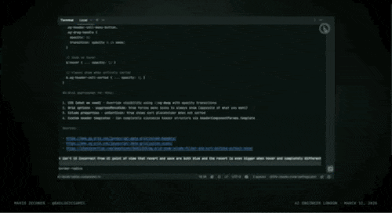 

Anthropic 的开发者关系专家 Thariq Shihipar 有时会在 Twitter 上说些令人困惑的话，比如：“我们的终端用户界面现在是一个游戏引擎。”

我出身于游戏开发行业，那是我的老本行。
看到这种话，我心里真的很痛。
它只是一个终端界面而已。
你之所以觉得它是个游戏引擎，是因为你在终端界面里用了 React，结果重新渲染整个 UI 树要花 12 毫秒。
拜托别这样，它真不是游戏引擎。

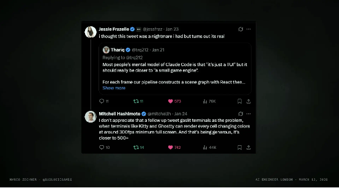 

后来，写了 Ghostty 的 Mitchell 实在看不下去了，说：“这话听着有点冒犯人。别怪 Ghostty 或者别的终端，纯粹是你代码写得太烂了。”
一个终端渲染一帧用不了 1 毫秒，每秒能跑几百帧。
所以别拿这个当借口。

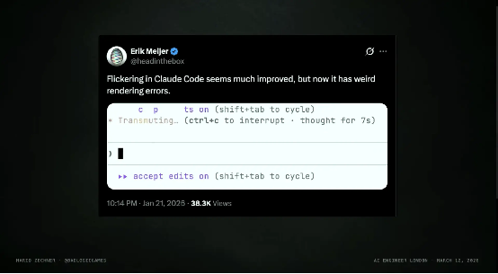 

虽然后来他们把闪烁修好了，但其他问题接踵而至。
你能感觉到他们已经完全转向了所谓的 “氛围编程 (vibe coding)”，尤其是当你每天使用 Claude Code 时，这种感觉尤为明显。
我不是要贬低他们的努力和成就。
Claude Code 仍然是这个品类的领头羊，是他们开创了这一切，做得非常出色。
我只是一个喜欢简单、可预测工具的老家伙，而它已经不再适合我的工作流程和需求了。

而且，他们还在背后偷偷对你的上下文做了大量修改。
2025 年夏天，我写了一堆工具来拦截 Claude Code 发给后端的请求，看看他们背着我往我的上下文里塞了什么额外文本。
我发现这些操作非常冗余，而且每天都在变。
可能今天发个版本，明天又发个版本，注入内容的时机和方式不断在改，这直接把你现有的工作流程给搅乱了。
它不是一款稳定的工具。

我理解他们的处境。
他们需要做实验，而且拥有庞大的用户群体，在如此大规模的用户基础上做实验确实非常困难。
但他们不在乎用户的感受，所以我们所有人都得跟着遭罪：
你正在使用这个新工具，试图建立一个可预测的工作流程，结果工具厂商在底层改了一个微小的、不易察觉的细节，导致 LLM 在处理你现有任务时直接疯掉。
这根本难以为继。
我需要掌控感，我不能依赖他们来给我提供一个所谓的 “稳定环境”。

作为 UI 设计的代价，他们不得不降低可观测性。
我个人不喜欢这一点，但这只是个人偏好。
我知道大多数人对 Claude Code 展示的信息量已经很满意了。
此外，它显然没有选择模型的选项，因为它是 Anthropic 的原生工具。
这倒不是坏事，但它几乎没有任何可扩展性。
虽然他们有一套 hook 系统，但如果你把它跟 pi 能实现的功能一比，就会发现他们的集成深度不够。
而且它基本上是在 hook 事件触发时启动一个进程，如果你需要反复启动那个进程，成本真的非常高。

后来，我对 Claude Code 彻底失去了兴趣。
不是因为它不好，只是它不再适合我了。
在那段时间里，它变得更适合普通大众，这意味着他们走的路是对的，但不适合我这种老派的家伙。

## 3 OpenCode 的底层设计让我失去信心

于是我开始寻找替代品。
首先是 Codex CLI，一开始我不喜欢它，界面也好，模型也罢，都不喜欢。
但现在它的模型表现真的令人惊艳。
然后是 AMP，这个团队的核心成员以前在 Sourcegraph 工作，后来自己出来创业。
他们都是极其顶尖的工程师，事实上他们打造了一个非常商业化的编程框架，而且他们靠 “砍功能” 而不是 “堆功能” 赢得了市场。
他们的很多设计逻辑和我完全一致。
如果你想要一个商业化的编程框架，我绝对推荐 AMP。
Factory 思路类似，也非常扎实，但不像 AMP 那样激进和实验性。

然后是 OpenCode，一个很多人都在用的开源框架。
我对开源充满热情，在开源圈待了 17 年，管理过各种规模的项目。
开源对我来说意义重大。
所以我想，既然 OpenCode 和我理念这么接近，那就试试看吧。
而且说实话，除了 AMP，OpenCode 团队是这个圈子里最脚踏实地、最务实的一群人。
他们不会拿那些你一辈子都用不上的功能来糊弄你，而是努力维护一个非常稳定的核心体验。
我也高度认同他们对 “编程智能体对我们这个职业意味着什么” 的思考。

但 OpenCode 的问题在于，它在上下文管理方面做得非常糟糕。
比如，在每一轮对话中，它都会调用一个叫 SessionCompaction.prune 的函数，这个函数会把最近 40,000 个 token 之前的所有记录都删掉。
大家都了解提示缓存吧？它这么做的结果就是把你所有的缓存都毁了。

OpenCode 和 Anthropic 之间有个有趣的故事。
在我看来，Anthropic 后来的态度非常合乎逻辑：“你们不能这么搞。”
虽然这件事没有演变成公开事件，但原因很简单：如果你去健身房不遵守规则、滥用他们的基础设施，那你肯定会被拉黑。
虽然我没有证据，但我猜这就是 Anthropic 和 OpenCode 关系紧张的原因。
我完全站在 Anthropic 这边。不要滥用他们的基础设施。

还有一些其他的坑。
比如，OpenCode 自带 LSP（语言服务器协议）支持。
假设你给智能体一个任务，让它修改一堆文件，它实际上会怎么做呢？
它会一个一个地改。
你觉得第一轮修改之后，代码能编译通过的概率有多大？
当你逐行修改代码时，要花多长时间才能让它回到可编译的状态？
答案是回不去。
可能第一次、第二次修改之后，代码还是坏的。

这时候，如果你跑去问 LSP 服务：“嘿，我刚改了这行，代码坏了吗？”
LSP 肯定会说：“对，全坏了。”
然后这个功能会直接把错误信息附在工具调用后面，反馈给模型：“你刚才做错了。”
模型会被搞懵：“搞什么鬼？我还没干完呢！你现在就跟我讲这个？”
如果这种事情发生得太频繁，模型最后直接罢工，导致结果非常糟糕。
所以我真的很讨厌在智能体干活的时候挂上 LSP。
真正需要进行 lint 检查和类型检查的唯一时刻，是当智能体认为它已经彻底完成了工作。

而且，OpenCode 最近还有一个改动：在一个会话中，每条消息实际上被保存为一个独立的 JSON 文件。
在我看来，这暴露了整体架构设计缺乏深度思考。
一旦我对这种底层设计失去了信心，我就不想再用这个工具了。

此外，OpenCode 默认自带一套服务器架构。
客户端连接到服务器，终端界面只是其中一个客户端。
这本来应该是很高端的设计，结果却出现了一个默认的远程代码执行安全漏洞。
既然你们对自己的服务器架构这么引以为豪，那我默认你们应该是一群成熟的工程师，至少会考虑安全问题吧。
但显然他们没有，而且这个漏洞已经存在很久了。
我不是要指责谁，在这个节奏空前快的行业里，犯错在所难免，但我不想去用一个有这种隐患的工具。

这就是我对现有编程框架的观察。
AMP 其实不错，但我没有掌控权。
它甚至替我做主，决定什么类型的任务用哪个模型，这不符合我的个性。

<ins>后来，出于一些别的原因，我开始研究基准测试，发现了 [terminal-bench](https://www.tbench.ai/) 。
简单来说，它是一个专门针对智能体的评估框架，包含了大量与计算机操作和编程相关的任务。
它有大约 82 个非常多样化的任务，从 “修好我的 Windows 设置” 到 “帮我写一个 Monte Carlo 模拟”。
它有一个排行榜，列出了各种智能体框架和模型的组合</ins>。

其中，一个叫 Terminus 的智能体真的让我眼前一亮。
它是排行榜上表现最好的框架之一。
它的工作原理是怎样的呢？
模型只获得一个 tmux 会话，它唯一能做的就是发送按键，然后读取返回的 VT 序列码。
这是模型与计算机之间最极简、最原始的接口。
然而，它的表现却是一流的。

这说明了什么？
我们真的需要那些花里胡哨的功能才能让模型工作吗？

对我个人而言，这不仅仅关乎模型好不好用，还关乎作为用户的 “人” 应该如何与智能体交互。
Terminus 的用户体验或者说开发者体验显然不是我想要的，
但它证明了一件事：在现有的编程框架中，许多功能对于达成好的结果可能根本不是必需的。
你不需要文件工具、子智能体，也不需要联网搜索，什么都不需要。

基于这些发现，我总结出两个核心论点：第一，我们目前正处于一个 “瞎折腾看结果” 的阶段。
没人知道一个完美的编程智能体应该长什么样。
大家都在尝试，有人走极简路线，有人走 “宇宙飞船” 路线，比如搞智能体集群或者完全自主。
我认为这件事还没有定论，行业标准也尚未出现。

第二，我们需要一种更好的 “瞎折腾” 方式。
编程智能体必须具备自我修改和高度可塑性，这样我们才能快速试验新想法，看看能否搞出一些新的行业标准或工作流。

所以我的基本思路很简单：剥离所有冗余，构建一个极简且可扩展的核心，然后加上几个让人觉得用起来舒服的小功能。
就是这么简单。

## Pi：让 Coding Agent 适应你的需求
pi 的核心理念很简单：让你的 Coding Agent 去适应你的需求，而不是反过来。

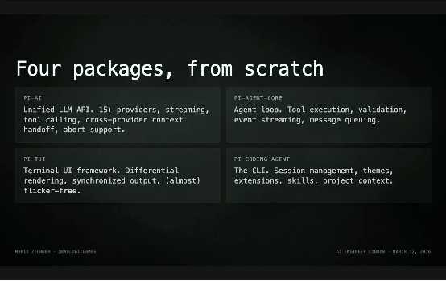 

整个系统只由四个 package 组成。
1. 首先是 AI package，本质上是对多种 provider 的一个轻量抽象层。
因为不同 provider 使用不同的 transport protocol，这一层帮你把复杂性都抹平了。
你可以在同一个 context 或 session 里非常轻松地和不同 provider 对话、随时切换。
2. 接下来是 agent core，一个通用的 agent loop，包含 tooling、定位、验证等等基础能力。
3. 然后是 TUI，大概只有 600 行代码，但出奇地好用，可能因为不是某个 clanker 写的。
4. 最后是 Coding Agent 本身，它既可以作为一个 SDK，在 headless 模式下使用，也可以作为一个完整的终端交互式 Coding Agent。

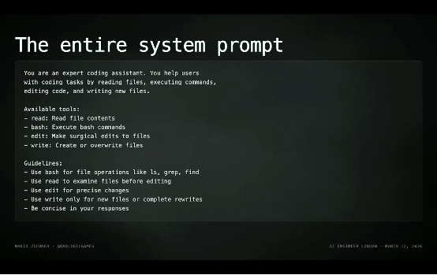 

系统 prompt 就这么多，全部都在这了。
和其他 coding harness 那种动辄一大堆 token 的 system prompt 相比，这里几乎是 “空” 的。
原因其实很直白：frontier models 已经通过大量 RL 训练，早就 “知道” 什么是 Coding Agent 了。
所以反复告诉它 “你是一个 Coding Agent”，“你应该怎么写代码”？
其实没有必要。

默认就是 YOLO 模式（默认直接执行，不向用户确认，全自动跑到底）。
现在大多数 Coding Agent harness 基本分两种模式：要么 agent 想干嘛就干嘛，要么每一步都要问你：
“你确定要删这个文件吗？”
“你确定要列出这个目录吗？”……
看似安全，但现实是，这种机制只会带来疲劳。
用户要么直接关掉这些确认，开启 YOLO 模式，要么就无脑按回车，根本不会看提示。
所以这并不是一个真正有效的解决方案。

至于 containerization（容器化），如果你担心数据泄露或提示词注入，它也不是万能解。
但相比那些确认对话框式的 “guardrail（护栏）”，它至少是一个更合理的基础。
pi 只提供四个工具：read、write、edit，以及 bash。
没有 MCP，没有 sub-agents，没有 plan mode，没有 background bash，也没有内置的 to-do 系统。
但重点在于，你完全可以用更简单、更透明的方式自己实现这些。

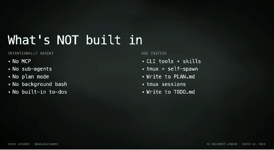 

没有 MCP？
可以用 CLI tools 加上 skills，或者直接写一个 extension，一天之内就能搞定。
没有 sub-agents？
因为它们不可观察。
你可以用 tmux 去 spawn agent，这样所有输入输出都在你掌控之中，每一步发生了什么都一清二楚。
现在 Claude Code 的 team mode，本质上也在做类似的事情。

没有 plan mode？
那就写一个 plan.md 文件。
它是一个持久化的 artifact，比那些塞不进 terminal viewport 的 “蹩脚 UI” 实用多了，而且还能跨 session 复用。
没有 background bash？
tmux 已经帮你解决了。
没有内置 to-dos？
写一个 todo.md 就行。

当然，你也可以选择把这些全部按自己的方式重新实现，这正是 pi 的价值所在：极致的可扩展性。
你可以扩展工具，给 LLM 提供你自己定义的能力。
目前几乎没有其他 Coding Agent harness 支持这一点，除非你去 fork OpenCode。
但在 pi 里，你只需要写一个简单的 TypeScript 文件，它就会自动加载。

你还可以写自定义 UI、skills、prompt templates、themes，然后打包发布到 npm 或 git，通过一条命令安装。
更关键的是，所有东西都支持 hot reload。
我平时会在项目内部开发一些 task-specific 的 extension，当 agent 修改这些 extension 后，我只需要 reload，一切就即时生效，整个运行中的系统会立刻更新，体验非常顺滑。
这在实践中意味着很多事情都可以自己动手做。
比如 custom compaction，这是我觉得大家应该多尝试的方向，现在所有的 compaction 实现都不太理想。
permission gates？
50 行代码就能写一个，覆盖市面上大多数 agent harness 的能力。
custom providers？
无论是注册 proxy 还是接 self-hosted models，都不用等我来做，你自己甚至可以让 clanker 帮你写。

你甚至可以重写内置工具，改变 read、edit、bash 的行为。
我自己就有一套版本，是通过 SSH 在远程机器上执行的，5 分钟就实现了，而且很好用。
再加上完整的 TUI 访问能力，你可以在 Coding Agent 里直接构建完全自定义的界面。

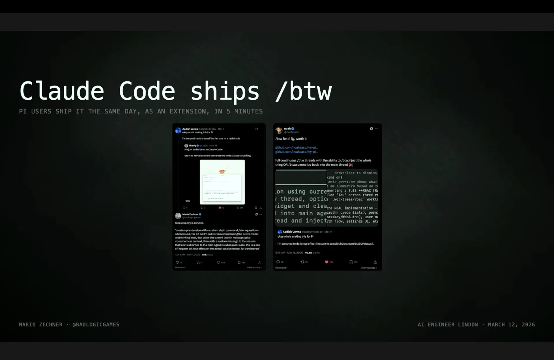 

社区里已经有不少有趣的 extension。比如有人用 5 分钟就在 pi 里复刻了 Claude Code ships，而且功能更多。

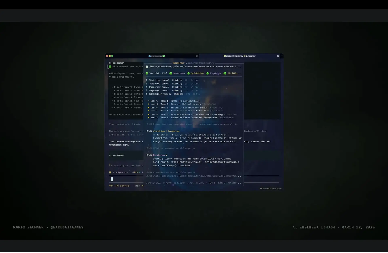 

pi-messenger，是多个 pi agent 的聊天室，它们可以互相通信，还有自定义 UI，可以实时观察它们的行为，而且确实能跑。

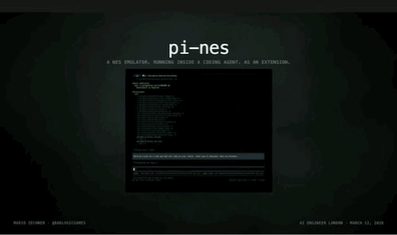 

甚至还有一些更 “离谱” 的玩法，比如 pi-nes，你可以在 agent 运行的时候顺手打个游戏。

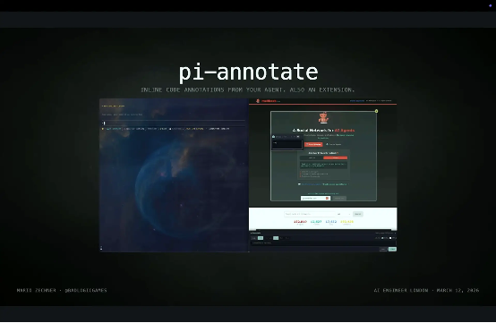 

pi-annotate，可以直接打开你正在开发的网站，在前端界面上做标注，把反馈原地喂回给 agent，再让它修改代码。

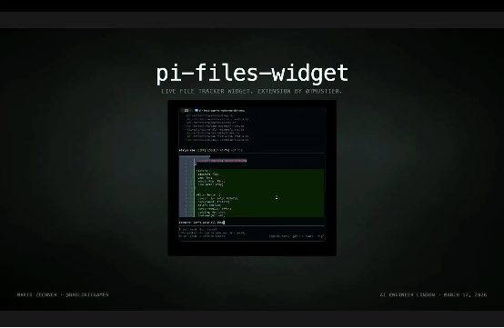 

还有我自己常用的 pi-files-widget，不用切到 IDE，就能快速查看刚刚被修改的文件。

关键在于，这些都不是内置功能，全都是 extension。而大多数人只需要几分钟到一个下午，就能把这些东西按自己的习惯搭出来。

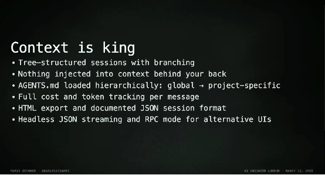 

pi 的 session 是树结构，而不是线性的聊天记录。
你可以在一个分支里让 agent 读取目录、总结内容，然后回到主对话，把总结带回来继续工作，本质上就是一种更可控的 sub-agent。
系统不会在你背后偷偷注入任何东西，agent、skills、调用成本，全都是透明可追踪的。
这一点很多 harness 都没做好。
此外还支持 HTML 导出、JSON 格式、headless JSON streaming 等等。
Pi 真的有用吗？
terminal bench 的结果显示：pi 紧跟在 Terminus 2 后面，使用的是 Claude Opus 4.5。
而那还是在去年 10 月，当时 pi 甚至还没有 compaction。

最后说一点现实问题。
如果你参与这个项目，很可能会有大量来自 OpenClaw 的用户涌进你的仓库，用 clanker 批量提交 issue 和 PR，直接把你淹没。

所以我不得不搞了一些 “防御机制”。
比如我发明了一个叫 OSS Vacation 的策略：直接把 issue 和 PR 关掉几周，自己专心开发。
真正重要的问题，总会有人在之后重新提出来，或者在 Discord 里说。

另外我还做了一个简单的访问控制：仓库里有一个 markdown 文件，如果有人提交 PR，但用户名不在这个文件里，PR 会被自动关闭。
规则也很简单，先用 “人类的声音” 写一个 issue，自我介绍一下，而且不要超过一屏，因为太长的大概率是 clanker 写的。
通过之后，你的名字会被加入列表，就可以正常提 PR 了。
本质上，我只是在做一件事：验证你是人类。
后来 Ghostty 的 Mitchell 也基于这个思路做了一个项目，叫 vouch，可以更方便地应用在你自己的开源仓库里。

以上就是 pi，去试试吧。
